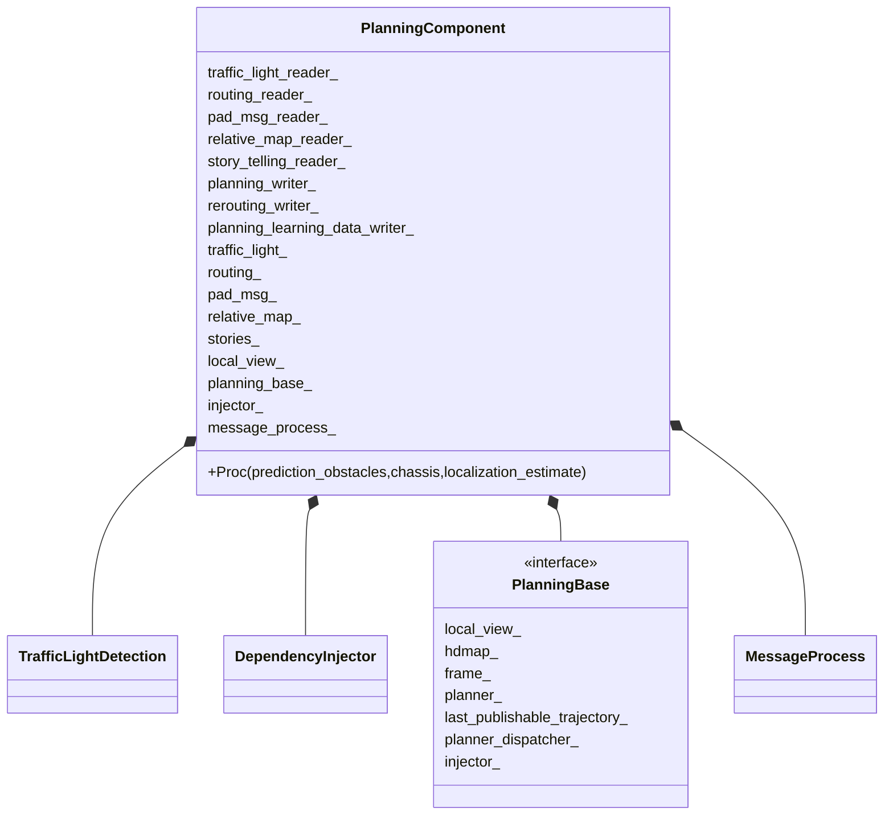
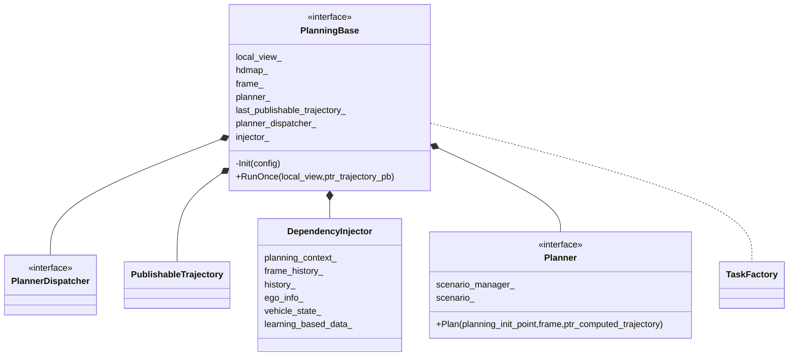
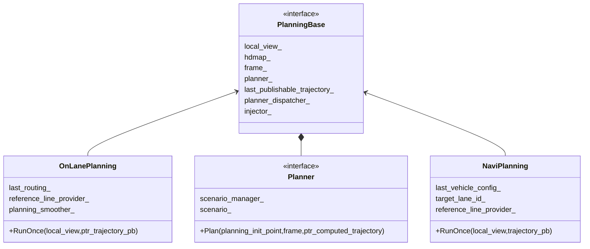
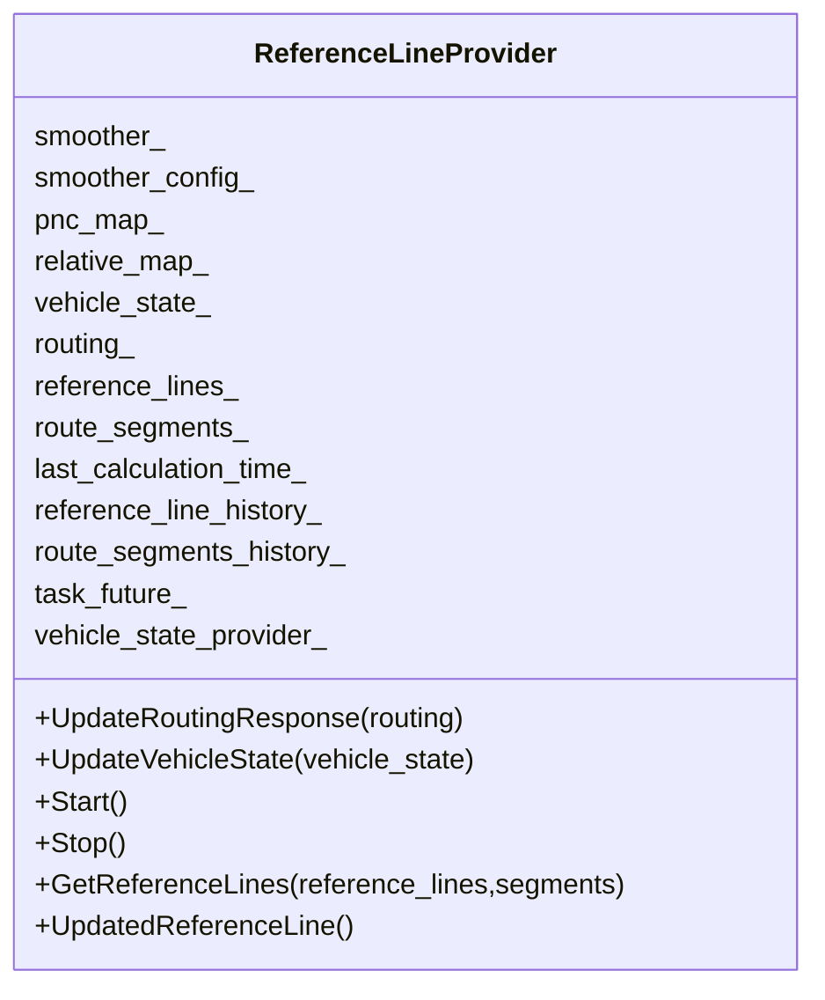
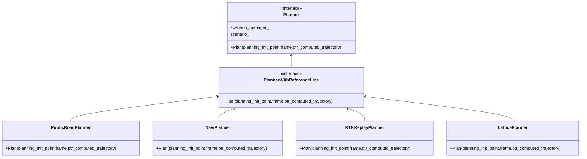
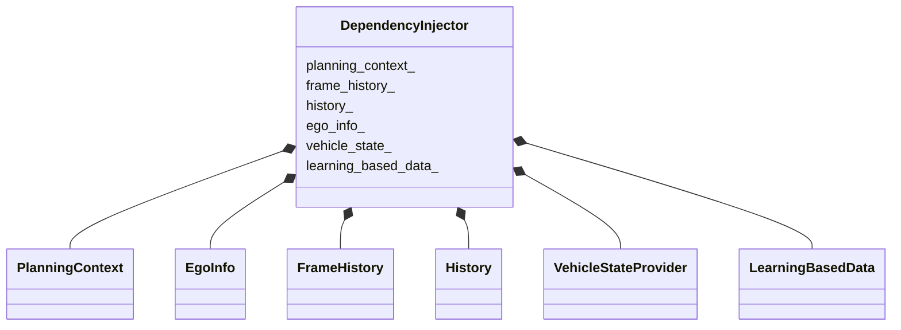
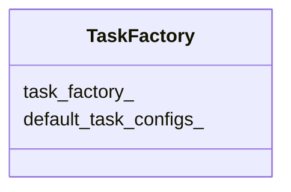
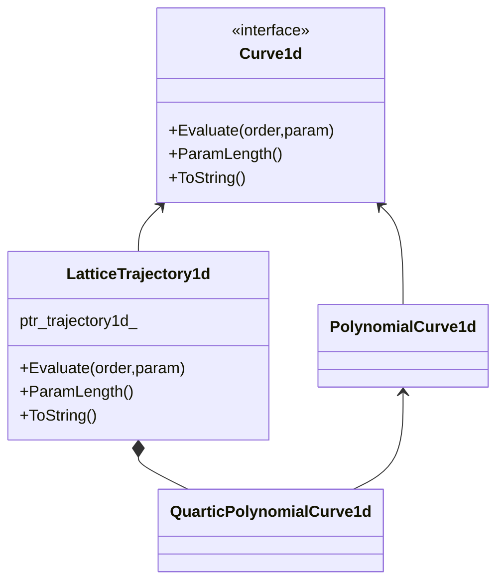

# Planning源码解析

## 类图




















```c++
std::vector<std::shared_ptr<Curve1d>> Trajectory1DBundle 
```




```c++
class Frame {
  static DrivingAction pad_msg_driving_action_;
  uint32_t sequence_num_ = 0;
  LocalView local_view_;
  const hdmap::HDMap *hdmap_ = nullptr;
  common::TrajectoryPoint planning_start_point_;
  common::VehicleState vehicle_state_;
  std::list<ReferenceLineInfo> reference_line_info_;

  bool is_near_destination_ = false;

  /**
   * the reference line info that the vehicle finally choose to drive on
   **/
  const ReferenceLineInfo *drive_reference_line_info_ = nullptr;

  ThreadSafeIndexedObstacles obstacles_;

  std::unordered_map<std::string, const perception::TrafficLight *>
      traffic_lights_;

  // current frame published trajectory
  ADCTrajectory current_frame_planned_trajectory_;

  // current frame path for future possible speed fallback
  DiscretizedPath current_frame_planned_path_;

  const ReferenceLineProvider *reference_line_provider_ = nullptr;

  OpenSpaceInfo open_space_info_;

  std::vector<routing::LaneWaypoint> future_route_waypoints_;

  common::monitor::MonitorLogBuffer monitor_logger_buffer_;
};
```


