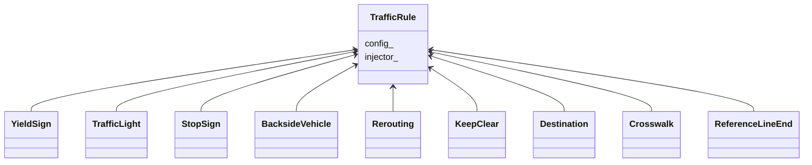
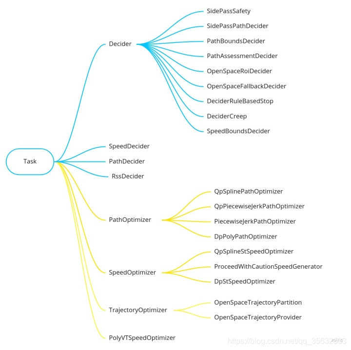

## TrafficLightTrafficRule

行驶在城市道路上的自动驾驶车辆必定受到各种交通规则的限制。在正常情况下，车辆不应当违反交通规则。

另外，交通规则通常是多种条例，不同城市和国家地区的交通规则可能是不一样的。

如何处理好这些交通规则就是模块实现需要考虑的了。目前Planning模块的实现中，有如下这些交通规则的实现：




## TrafficRule配置

交通条例的生效并非是一成不变的，因此自然就需要有一个配置文件来进行配置。交通规则的配置文件是：`modules/planning/conf/traffic_rule_config.pb.txt`。

下面是其中的一个代码片段：

```json
config: {
  rule_id: BACKSIDE_VEHICLE
  enabled: false
  backside_vehicle {
    backside_lane_width: 4.0
  }
}

config: {
  rule_id: CROSSWALK
  enabled: true
  crosswalk {
    stop_distance: 1.0
    max_stop_deceleration: 6.0
    min_pass_s_distance: 1.0
    max_valid_stop_distance: 3.5
    expand_s_distance: 2.0
    stop_strict_l_distance: 6.0
    stop_loose_l_distance: 8.0
    stop_timeout: 4.0
  }
}
```

对应的protobuf文件

modules/planning/proto/traffic_rule_config.proto

```protobuf
message TrafficRuleConfig {
  enum RuleId {
    BACKSIDE_VEHICLE = 1;
    CROSSWALK = 2;
    DESTINATION = 3;
    KEEP_CLEAR = 4;
    REFERENCE_LINE_END = 5;
    REROUTING = 6;
    STOP_SIGN = 7;
    TRAFFIC_LIGHT = 8;
    YIELD_SIGN = 9;
  }
  optional RuleId rule_id = 1;
  optional bool enabled = 2;
  oneof config {
    BacksideVehicleConfig backside_vehicle = 3;
    CrosswalkConfig crosswalk = 4;
    DestinationConfig destination = 5;
    KeepClearConfig keep_clear = 6;
    ReferenceLineEndConfig reference_line_end = 7;
    ReroutingConfig rerouting = 8;
    StopSignConfig stop_sign = 9;
    TrafficLightConfig traffic_light = 10;
    YieldSignConfig yield_sign = 11;
  }
}
```


## TrafficDecider

* Task<--Decider<--CreepDecider
* Task<--Decider<--LaneChangeDecider
* Task<--Decider<--OpenSpaceRoiDecider
* Task<--Decider<--OpenSpacePreStopDecider
* Task<--Decider<--OpenSpaceFallbackDecider
* Task<--Decider<--PathAssessmentDecider
* Task<--Decider<--PathBoundsDecider
* Task<--Decider<--PathLaneBorrowDecider
* Task<--Decider<--PathReuseDecider
* Task<--Decider<--RuleBasedStopDecider

* Task<--Decider<--SpeedBoundsDecider

