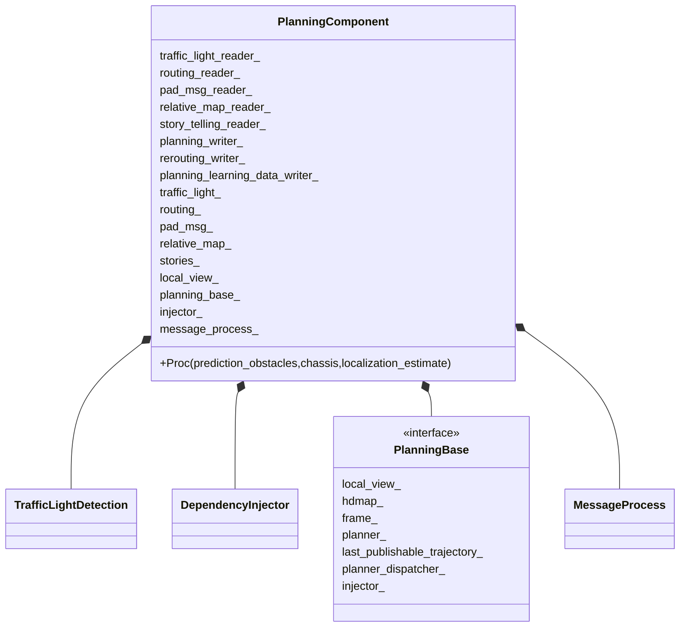
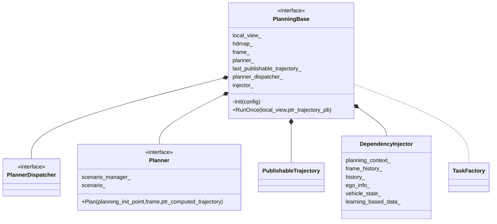
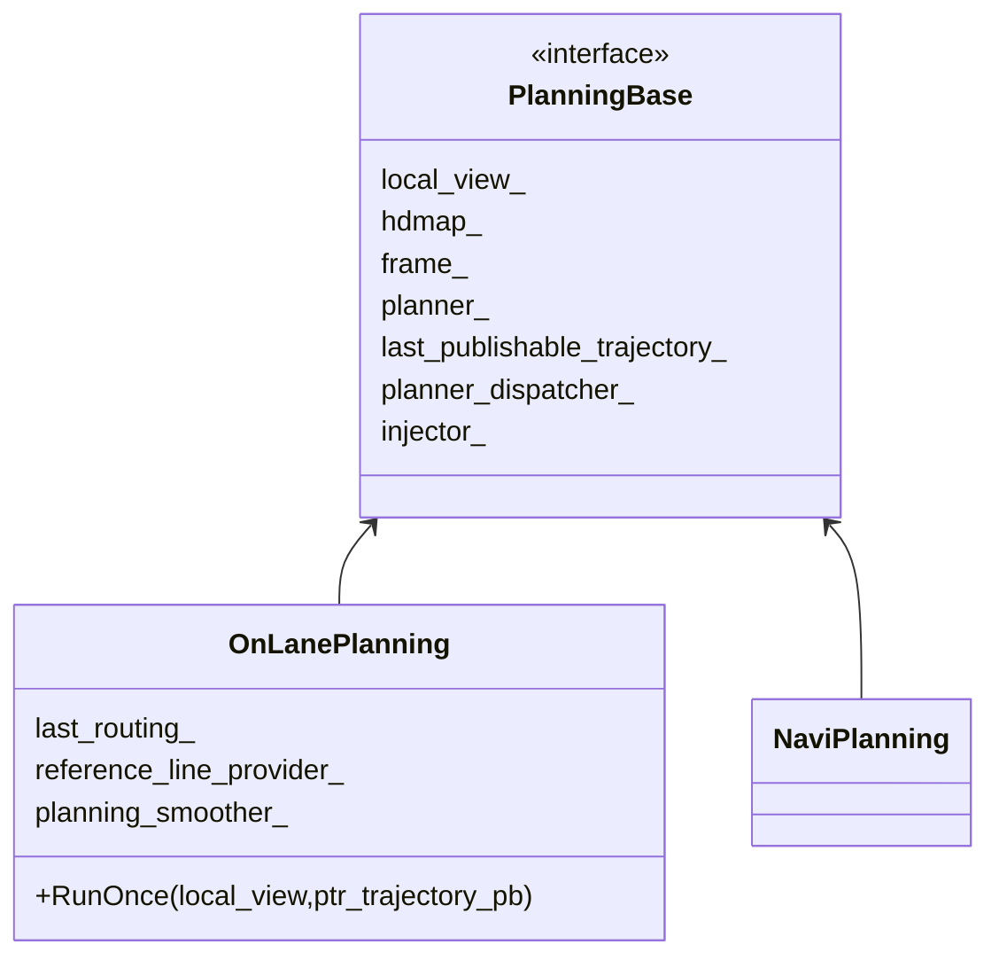
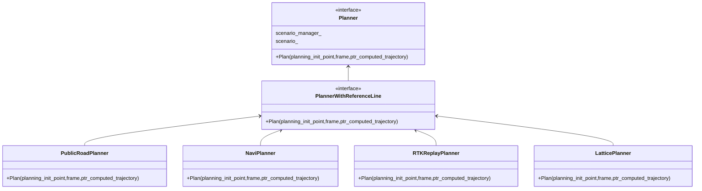
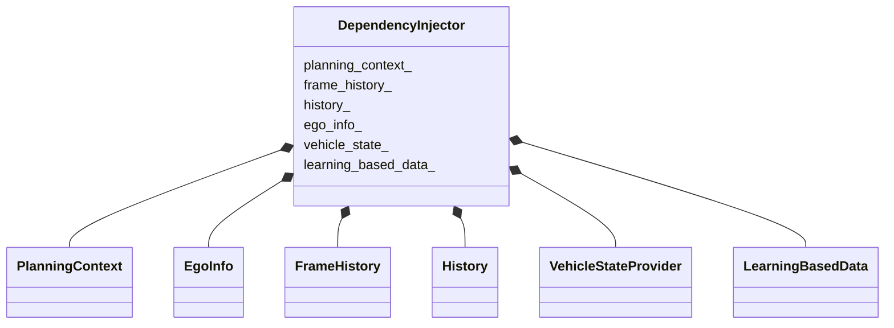
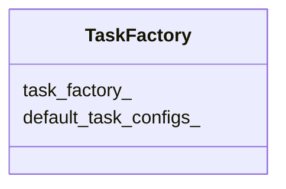
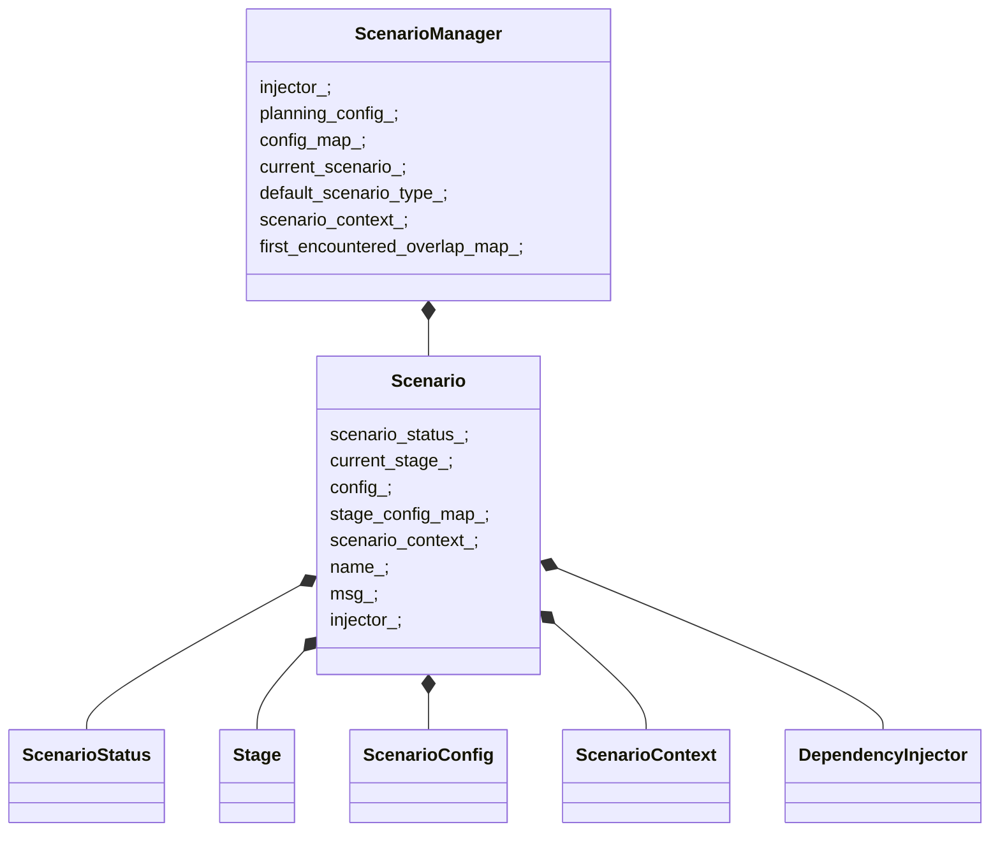

# 源码解析

## 类图



















## 源码

**PlanningComponent模块**的入口为modules/planning/planning_component.cc

对应的配置dag文件：

```json
```


PlanningComponent模块会订阅topic：`"/apollo/routing_response"`

该topic由Routing模块发布，`RoutingResponse`是Routing模块生成的路径

```c++
 //  routing_response_topic: "/apollo/routing_response"
  routing_reader_ = node_->CreateReader<RoutingResponse>(
      config_.topic_config().routing_response_topic(),
      [this](const std::shared_ptr<RoutingResponse>& routing) {
        AINFO << "Received routing data: run routing callback."
              << routing->header().DebugString();
        std::lock_guard<std::mutex> lock(mutex_);
        routing_.CopyFrom(*routing);
      });

```

`RoutingResponse`保存着Routing模块生成的路径

在文件`modules/routing/proto/routing.proto` 中定义

```protobuf
message RoutingResponse {
  optional apollo.common.Header header = 1;
  repeated RoadSegment road = 2;
  optional Measurement measurement = 3;
  optional RoutingRequest routing_request = 4;

  // the map version which is used to build road graph
  optional bytes map_version = 5;
  optional apollo.common.StatusPb status = 6;
}
```


