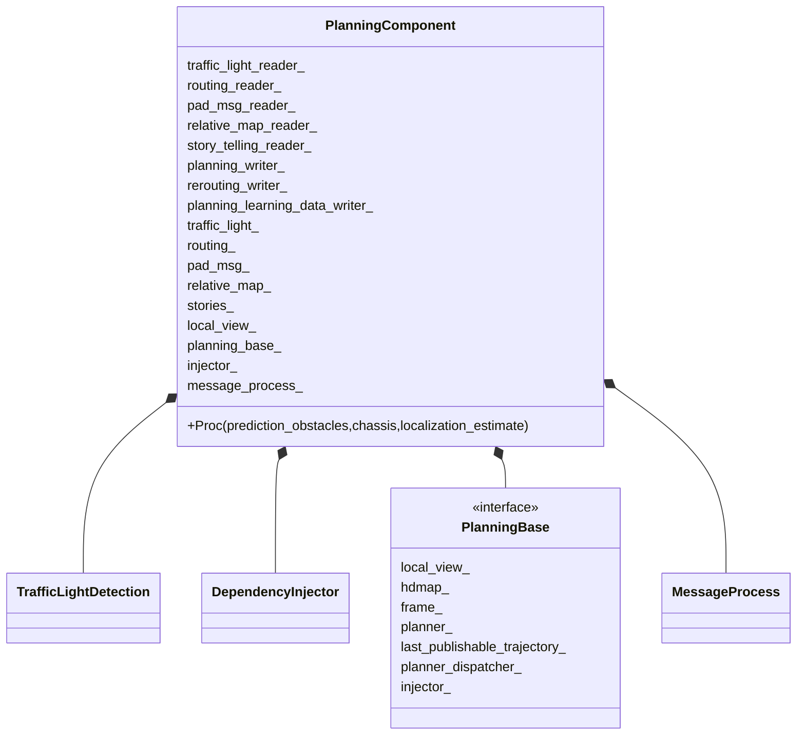
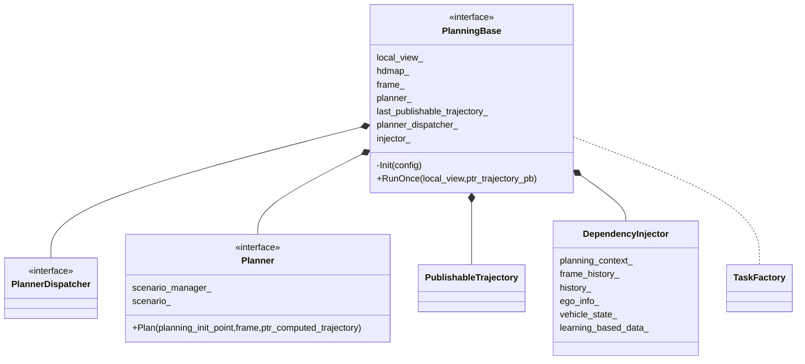
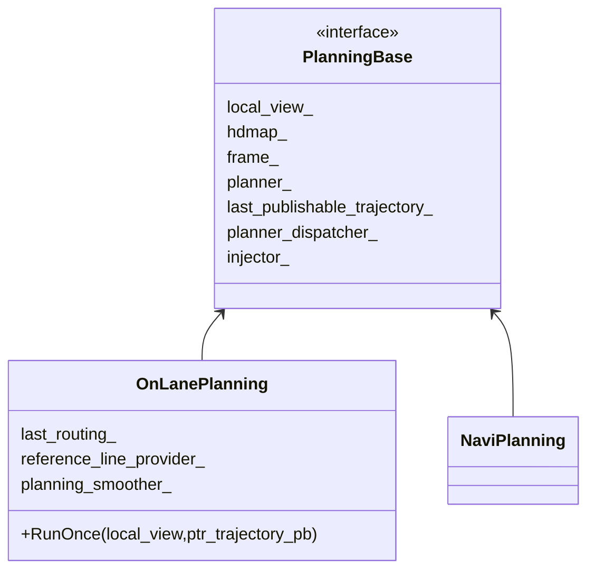
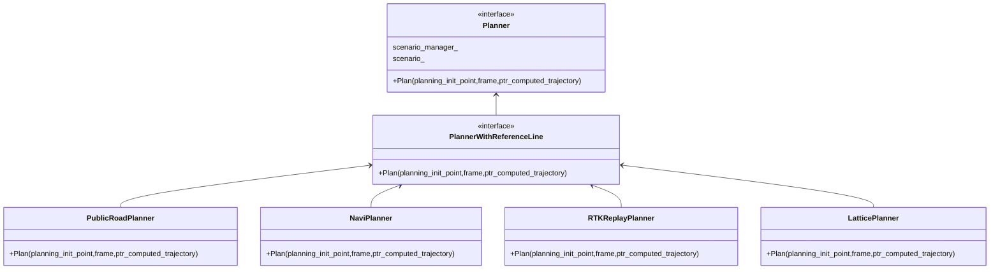
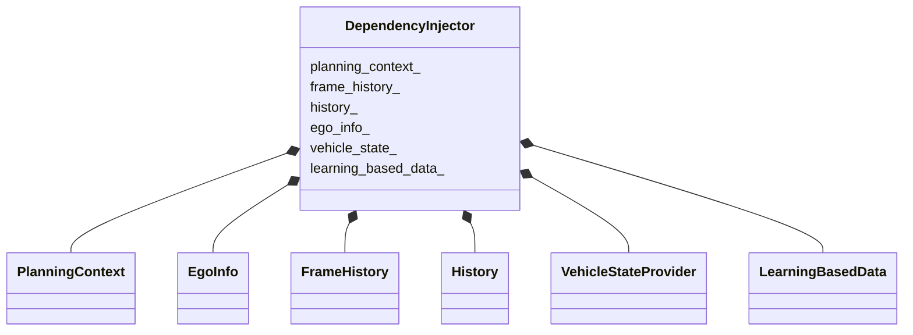
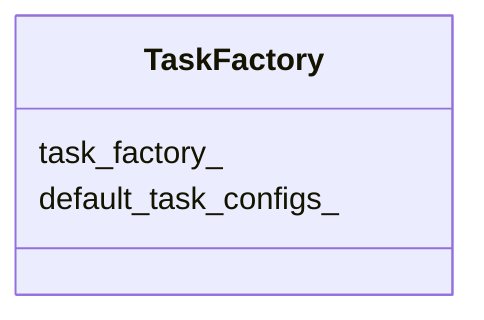

## 类图

```mermaid
classDiagram


class PlanningComponent{
	traffic_light_reader_
	routing_reader_
	pad_msg_reader_
	relative_map_reader_
	story_telling_reader_
	planning_writer_
	rerouting_writer_
	planning_learning_data_writer_
	
	traffic_light_
	routing_
	pad_msg_
	relative_map_
	stories_
	local_view_
	planning_base_
	injector_
	message_process_
	
	+Proc(prediction_obstacles,chassis,localization_estimate)
}


PlanningComponent*--TrafficLightDetection
class TrafficLightDetection{
	
}

PlanningComponent*--DependencyInjector
class DependencyInjector{
	
}


PlanningComponent*--PlanningBase
class PlanningBase{
	<<interface>>
	local_view_
	hdmap_
	frame_
	planner_
	last_publishable_trajectory_
	planner_dispatcher_
	injector_
}

PlanningComponent*--MessageProcess
class MessageProcess{
	
}
```

```mermaid
classDiagram

class PlanningBase{
	<<interface>>
	local_view_
	hdmap_
	frame_
	planner_
	last_publishable_trajectory_
	planner_dispatcher_
	injector_
	-Init(config)
	+RunOnce(local_view,ptr_trajectory_pb)
}

PlanningBase*--PlannerDispatcher
class PlannerDispatcher{
	<<interface>>
}


PlanningBase*--Planner
class Planner{
	<<interface>>
	scenario_manager_
	scenario_
	+Plan(planning_init_point,frame,ptr_computed_trajectory) 
}


PlanningBase*--PublishableTrajectory
class PublishableTrajectory{
	
}

PlanningBase*--DependencyInjector
class DependencyInjector{
	planning_context_
	frame_history_
	history_
	ego_info_
	vehicle_state_
	learning_based_data_
}

PlanningBase..TaskFactory
class TaskFactory{
	
}
```

```mermaid
classDiagram

class PlanningBase{
	<<interface>>
	local_view_
	hdmap_
	frame_
	planner_
	last_publishable_trajectory_
	planner_dispatcher_
	injector_
}

PlanningBase<--OnLanePlanning
class OnLanePlanning{
	last_routing_
	reference_line_provider_
	planning_smoother_
	+RunOnce(local_view,ptr_trajectory_pb)
}

PlanningBase<--NaviPlanning
class NaviPlanning{
	
}

```

```mermaid
classDiagram

class Planner{
	<<interface>>
	scenario_manager_
	scenario_
	+Plan(planning_init_point,frame,ptr_computed_trajectory) 
}

Planner<--PlannerWithReferenceLine
class PlannerWithReferenceLine{
	<<interface>>
	+Plan(planning_init_point,frame,ptr_computed_trajectory) 
}

PlannerWithReferenceLine<--PublicRoadPlanner
class PublicRoadPlanner{
	+Plan(planning_init_point,frame,ptr_computed_trajectory) 
}

PlannerWithReferenceLine<--NaviPlanner
class NaviPlanner{
	+Plan(planning_init_point,frame,ptr_computed_trajectory) 
}

PlannerWithReferenceLine<--RTKReplayPlanner
class RTKReplayPlanner{
	+Plan(planning_init_point,frame,ptr_computed_trajectory) 
}

PlannerWithReferenceLine<--LatticePlanner
class LatticePlanner{
	+Plan(planning_init_point,frame,ptr_computed_trajectory) 
}

```

```mermaid
classDiagram

class DependencyInjector{
	planning_context_
	frame_history_
	history_
	ego_info_
	vehicle_state_
	learning_based_data_
}

DependencyInjector*--PlanningContext
class PlanningContext{
	
}

DependencyInjector*--EgoInfo
class EgoInfo{
	
}

DependencyInjector*--FrameHistory
class FrameHistory{
	
}

DependencyInjector*--History
class History{
	
}

DependencyInjector*--VehicleStateProvider
class VehicleStateProvider{
	
}

DependencyInjector*--LearningBasedData
class LearningBasedData{
	
}

 
```

```mermaid
classDiagram

class TaskFactory{
	task_factory_
	default_task_configs_
}
```