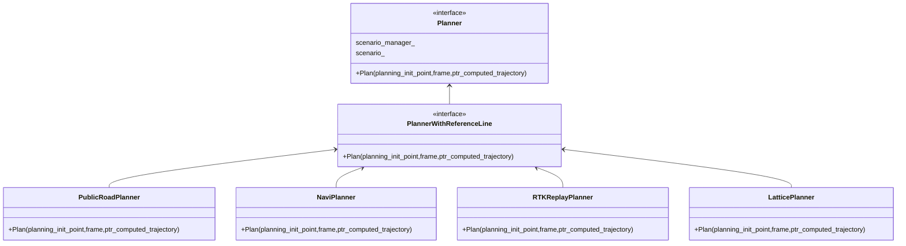
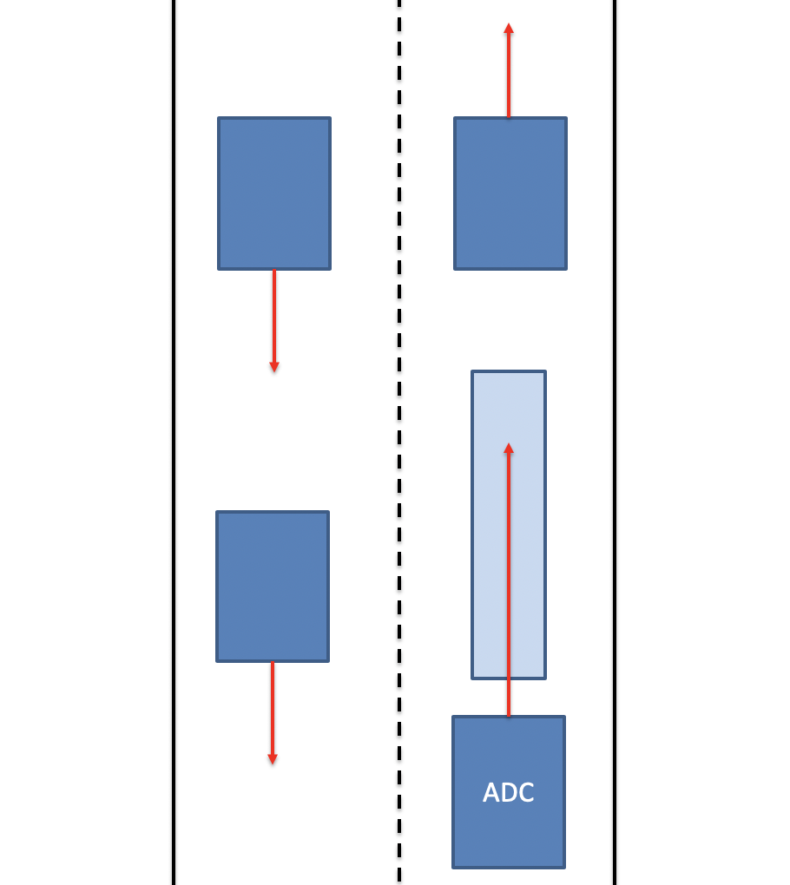
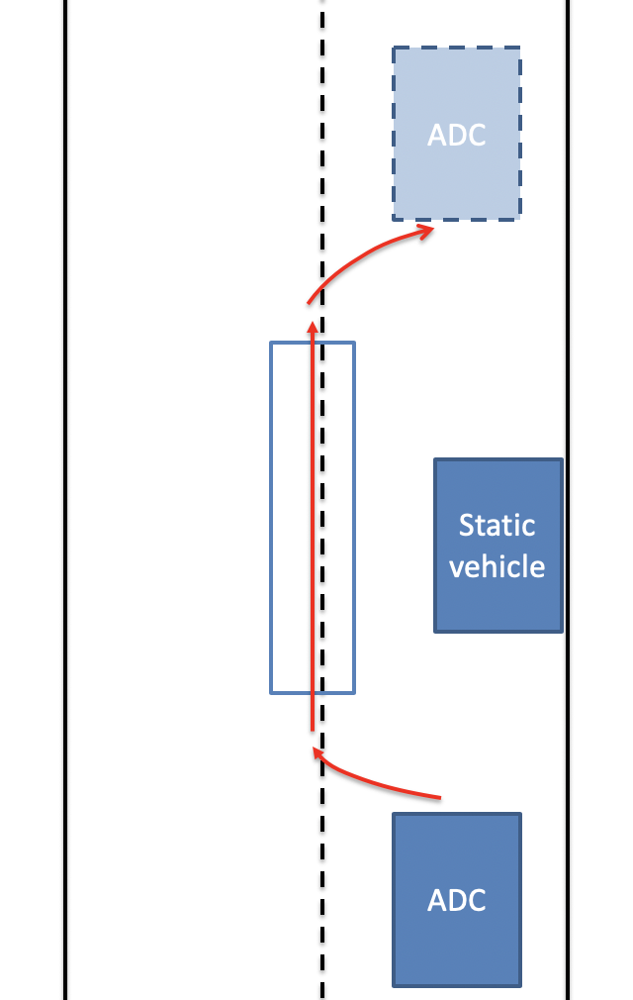
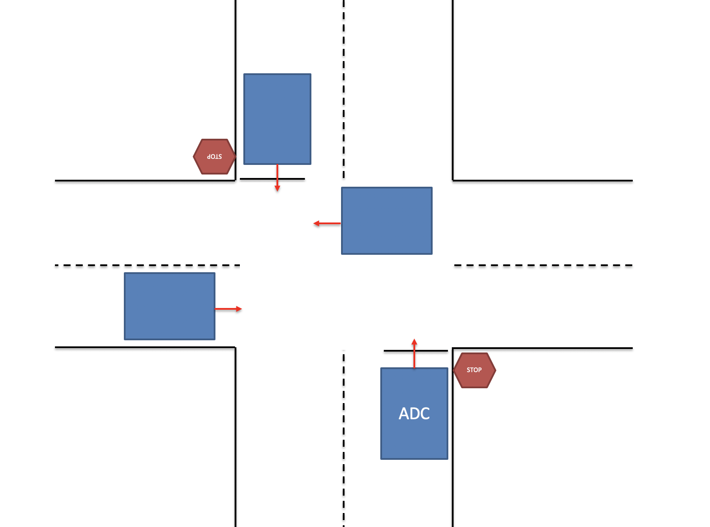
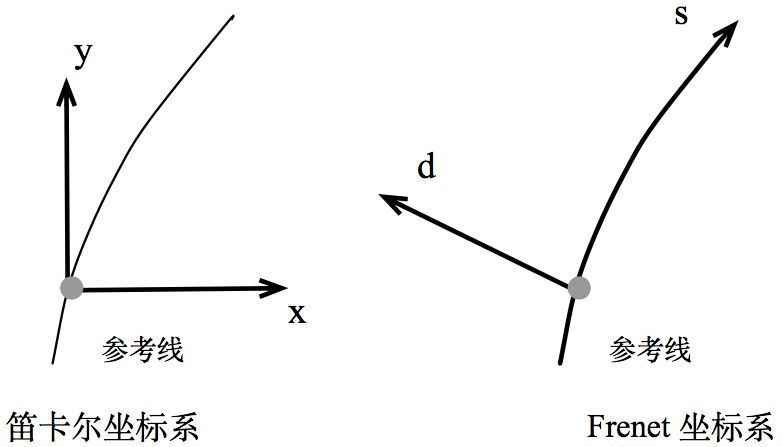
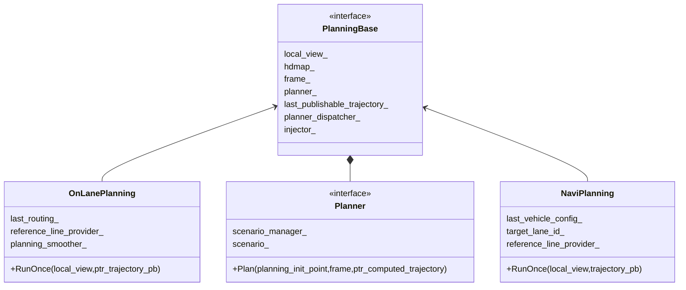

 # 规划篇

# Planning概要说明

## 简介

在Apollo的平台上，规划分为三种模式：

**OnLanePlanning（3.5版本叫StdPlanning, 车道规划，可用于城区及高速公路各种复杂道路）**

**NaviPlanning（导航规划，主要用于高速公路）**

**OpenSpacePlanning （自主泊车和狭窄路段的掉头，Apollo6.0没有）**

apollo6.0包含四种具体规划算法：

**PublicRoadPlanner（默认规划器,实现了EM算法）**

**LatticePlanner、NaviPlanner（主要用于高速公路场景）**

**RTKPlanner（循迹算法，一般不用）**


EM Planner和Lattice Planner对比：

| EM Planner                    | Lattice Planner    |
| :---------------------------- | :----------------- |
| 横向纵向分开求解              | 横向纵向同时求解   |
| 参数较多（DP/QP, Path/Speed） | 参数较少且统一     |
| 流程复杂                      | 流程简单           |
| 单周期解空间受限              | 简单场景解空间较大 |
| 能适应复杂场景                | 适合简单场景       |
| 适合城市道路                  | 适合高速场景       |



每个规划器针对不同的场景和问题。在这4个规划器中，都实现了继承自 Planner 类的 Plan() 函数和继承自PlannerWithReferenceLine 类的 PlanOnReferenceLine() 函数。在执行具体的规划任务时，都是在 Plan() 中调用PlanOnReferenceLine()，从而获得规划的轨迹结果。也就是说，最底层的规划方法，是在各规划器的PlanOnReferenceLine() 中实现


apollo曾经用到的Planner

| 名称              | 加入版本 | 类型        | 说明                                                         |
| :---------------- | :------- | :---------- | :----------------------------------------------------------- |
| RTKReplayPlanner  | 1.0      | RTK         | 根据录制的轨迹来规划行车路线。                               |
| PublicRoadPlanner | 1.5      | PUBLIC_ROAD | 实现了[EM算法](https://arxiv.org/abs/1807.08048)的规划器，这是目前的默认Planner。 |
| LatticePlanner    | 2.5      | LATTICE     | 基于网格算法的轨迹规划器。                                   |
| NaviPlanner       | 3.0      | NAVI        | 基于实时相对地图的规划器。                                   |
| OpenSpacePlanner  | 3.5      | OPEN_SPACE  | 算法源于论文：[《Optimization-Based Collision Avoidance》](https://arxiv.org/pdf/1711.03449.pdf)。 |


## 整体Pipeline

下面是Apollo3.5 Planning的整体Pipeline，Apollo6.0与其类似,StdPlanning对应OnLanePlanning。


这里有三个主要部分需要说明：

- `PncMap`：全称是Planning and Control Map。这个部分的实现并不在Planning内部，而是位于`/modules/map/pnc_map/`目录下。但是由于该实现与Planning模块紧密相关，因此这里放在一起讨论。该模块的主要作用是：根据Routing提供的数据，生成Planning模块需要的路径信息。
- `Frame`：Frame中包含了Planning[一次计算循环](https://paul.pub/apollo-planning/#id-planningcycle)中需要的所有数据。例如：地图，车辆状态，参考线，障碍物信息等等。`ReferenceLine`是车辆行驶的参考线，`TrafficDecider`与交通规则相关，这两个都是Planning中比较重要的子模块，因此会在下文中专门讲解。
- `EM Planner`：下文中我们会看到，Apollo系统中内置了好几个Planner，但目前默认使用的是EM Planner，这也是专门为开放道路设计的。该模块的实现可以说是整个Planning模块的灵魂所在。因此其算法值得专门用另外一篇文章来讲解。读者也可以阅读其官方论文来了解：[Baidu Apollo EM Motion Planner](https://arxiv.org/abs/1807.08048)。

## PlanningCycle

下面的图也是Apollo3.5，Apollo6.0与其类似。


## Scenario

### 车道保持

车道保持场景是默认的驾驶场景，它不仅仅包含单车道巡航。同时也包含了：

- 换道行驶
- 遵循基本的交通约定
- 基本转弯



### SidePass

在这种情况下，如果在自动驾驶车辆（ADC）的车道上有静态车辆或静态障碍物，并且车辆不能在不接触障碍物的情况下安全地通过车道，则执行以下策略：

- 检查邻近车道是否接近通行

- 如果无车辆，进行绕行，绕过当前车道进入邻道

- 一旦障碍物安全通过，回到原车道上



### 停止标识

停止标识有两种分离的驾驶场景：

1、未保护：在这种情况下，汽车预计会通过具有双向停车位的十字路口。因此，我们的ADC必须爬过并测量十字路口的交通密度，然后才能继续走上它的道路。



2、受保护：在此场景中，汽车预期通过具有四向停车位的十字路口导航。我们的ADC将必须对在它之前停下来的汽车进行测量，并在移动之前了解它在队列中的位置。


## Frenet坐标系

关于[Frenet坐标系的推导](frenet坐标系推导.md)。

大家最熟悉的坐标系应该是横向和纵向垂直的笛卡尔坐标系。但是在自动驾驶领域，最常用的却是Frenet坐标系。基于Frenet坐标系的动作规划方法由于是由BMW的[Moritz Werling提出的](https://www.researchgate.net/profile/Moritz_Werling/publication/224156269_Optimal_Trajectory_Generation_for_Dynamic_Street_Scenarios_in_a_Frenet_Frame/links/54f749df0cf210398e9277af/Optimal-Trajectory-Generation-for-Dynamic-Street-Scenarios-in-a-Frenet-Frame.pdf)。

之所以这么做，最主要的原因是因为大部分的道路都不是笔直的，而是具有一定弯曲度的弧线。



在Frenet坐标系中，我们使用道路的中心线作为参考线，使用参考线的切线向量t和法线向量n建立一个坐标系，如上图的右图所示，它以车辆自身为原点，坐标轴相互垂直，分为s方向（即沿着参考线的方向，通常被称为纵向，Longitudinal）和d方向（即参考线当前的法向，被称为横向，Lateral），相比于笛卡尔坐标系（上图的左图），Frenet坐标系明显地简化了问题。因为在公路行驶中，我们总是能够简单的找到道路的参考线（即道路的中心线），那么基于参考线的位置的表示就可以简单的使用纵向距离（即沿着道路方向的距离）和横向距离（即偏离参考线的距离）来描述。

下面这幅图描述了同样一个路段，分别在笛卡尔坐标系和Frenet坐标系下的描述结果。很显然，Frenet坐标系要更容易理解和处理。


# Planning模块相关Topic

Planning模块**订阅**的话题:

| 成员变量              | 话题名称                           | 消息类型              |
| --------------------- | ---------------------------------- | --------------------- |
| 配置Proc              | "/apollo/prediction"               | PredictionObstacles   |
| 配置Proc              | "/apollo/canbus/chassis"           | Chassis               |
| 配置Proc              | "/apollo/localization/pose"        | LocalizationEstimate  |
| routing_reader_       | "/apollo/routing_response"         | RoutingResponse       |
| traffic_light_reader_ | "/apollo/perception/traffic_light" | TrafficLightDetection |
| pad_msg_reader_       | "/apollo/planning/pad"             | PadMessage            |
| story_telling_reader_ | "/apollo/storytelling"             | Stories               |

Planning模块**发布**的话题:

| 成员变量                       | 话题名称                         | 消息类型             |
| ------------------------------ | -------------------------------- | -------------------- |
| planning_writer_               | "/apollo/planning"               | ADCTrajectory        |
| rerouting_writer_              | "/apollo/routing_request"        | RoutingRequest       |
| planning_learning_data_writer_ | "/apollo/planning/learning_data" | PlanningLearningData |

# Planning模块相关数据

Planning模块是一个比较大的模块，因此这其中有很多的数据结构需要在内部实现中流转。

这些数据结构集中定义在两个地方：

- `proto`目录：该目录下都是通过[Protocol Buffers](https://developers.google.com/protocol-buffers/)格式定义的结构。这些结构会在编译时生成C++需要的文件。这些结构没有业务逻辑，就是专门用来存储数据的。（实际上不只是Planning，几乎每个大的模块都会有自己的proto文件夹。）
- `common`目录：这里是C++定义的数据结构。很显然，通过C++定义数据结构的好处是这些类的实现中可以包含一定的处理逻辑。

| 名称                  | 说明                                                         |
| :-------------------- | :----------------------------------------------------------- |
| `EgoInfo`类           | 包含了自车信息，例如：当前位置点，车辆状态，外围Box等。      |
| `Frame`类             | 包含了一次Planning计算循环中的所有信息。                     |
| `FrameManager`类      | Frame的管理器，每个Frame会有一个整数型id。                   |
| `LocalView`类         | Planning计算需要的输入，下文将看到其定义。                   |
| `Obstacle`类          | 描述一个特定的障碍物。障碍物会有一个唯一的id来区分。         |
| `PlanningContext`类   | Planning全局相关的信息，例如：是否正在变道。这是一个[单例](https://en.wikipedia.org/wiki/Singleton_pattern)。 |
| `ReferenceLineInfo`类 | 车辆行驶的参考线，下文会专门讲解。                           |
| `path`文件夹          | 描述车辆路线信息。包含：PathData，DiscretizedPath，FrenetFramePath三个类。 |
| `speed`文件夹         | 描述车辆速度信息。包含SpeedData，STPoint，StBoundary三个类。 |
| `trajectory`文件夹    | 描述车辆轨迹信息。包含DiscretizedTrajectory，PublishableTrajectory，TrajectoryStitcher三个类。 |
| `planning_gflags.h`   | 定义了模块需要的许多常量，例如各个配置文件的路径。           |

## LocalView

`LocalView类` 包含障碍物信息, 车辆自身状态, 当前位置等信息

modules/planning/common/local_view.h

```c++
struct LocalView {
  std::shared_ptr<prediction::PredictionObstacles> prediction_obstacles;
  std::shared_ptr<canbus::Chassis> chassis;
  std::shared_ptr<localization::LocalizationEstimate> localization_estimate;
  std::shared_ptr<perception::TrafficLightDetection> traffic_light;
  std::shared_ptr<routing::RoutingResponse> routing;
  std::shared_ptr<relative_map::MapMsg> relative_map;
  std::shared_ptr<PadMessage> pad_msg;
  std::shared_ptr<storytelling::Stories> stories;
};
```

## Frame

`Frame`类  包含了一次Planning计算循环中的所有信息。

modules/planning/common/frame.h

```c++
class Frame {
  .........................
  static DrivingAction pad_msg_driving_action_;
  uint32_t sequence_num_ = 0;
  LocalView local_view_;
  const hdmap::HDMap *hdmap_ = nullptr;
  common::TrajectoryPoint planning_start_point_;
  common::VehicleState vehicle_state_;
  std::list<ReferenceLineInfo> reference_line_info_;
  bool is_near_destination_ = false;
  /**
   * the reference line info that the vehicle finally choose to drive on
   **/
  const ReferenceLineInfo *drive_reference_line_info_ = nullptr;
  ThreadSafeIndexedObstacles obstacles_;
  std::unordered_map<std::string, const perception::TrafficLight *>
      traffic_lights_;
  // current frame published trajectory
  ADCTrajectory current_frame_planned_trajectory_;
  // current frame path for future possible speed fallback
  DiscretizedPath current_frame_planned_path_;
  const ReferenceLineProvider *reference_line_provider_ = nullptr;
  OpenSpaceInfo open_space_info_;
  std::vector<routing::LaneWaypoint> future_route_waypoints_;
  common::monitor::MonitorLogBuffer monitor_logger_buffer_;
};

```

## ReferenceLineInfo 

`ReferenceLineInfo`类  车辆行驶的参考线

modules/planning/common/reference_line_info.h

```c++
class ReferenceLineInfo {
	...................................
  static std::unordered_map<std::string, bool> junction_right_of_way_map_;
  const common::VehicleState vehicle_state_;
  const common::TrajectoryPoint adc_planning_point_;
  ReferenceLine reference_line_;
  double cost_ = 0.0;
  bool is_drivable_ = true;
  PathDecision path_decision_;
  Obstacle* blocking_obstacle_;
  std::vector<PathBoundary> candidate_path_boundaries_;
  std::vector<PathData> candidate_path_data_;
  PathData path_data_;
  PathData fallback_path_data_;
  SpeedData speed_data_;
  DiscretizedTrajectory discretized_trajectory_;
  RSSInfo rss_info_;
  SLBoundary adc_sl_boundary_;
  planning_internal::Debug debug_;
  LatencyStats latency_stats_;
  hdmap::RouteSegments lanes_;
  bool is_on_reference_line_ = false;
  bool is_path_lane_borrow_ = false;
  ADCTrajectory::RightOfWayStatus status_ = ADCTrajectory::UNPROTECTED;
  double offset_to_other_reference_line_ = 0.0;
  double priority_cost_ = 0.0;
  PlanningTarget planning_target_;
  ADCTrajectory::TrajectoryType trajectory_type_ = ADCTrajectory::UNKNOWN;
  std::vector<std::pair<OverlapType, hdmap::PathOverlap>>
      first_encounter_overlaps_;
  StGraphData st_graph_data_;
  common::VehicleSignal vehicle_signal_;
  double cruise_speed_ = 0.0;
  bool path_reusable_ = false;
};
```

# ReferenceLineProvider

modules/planning/reference_line/reference_line_provider.h

```c++
class ReferenceLineProvider {  
  bool is_initialized_ = false;
  std::atomic<bool> is_stop_{false};

  std::unique_ptr<ReferenceLineSmoother> smoother_;
  ReferenceLineSmootherConfig smoother_config_;

  std::mutex pnc_map_mutex_;
  std::unique_ptr<hdmap::PncMap> pnc_map_;

  // Used in Navigation mode
  std::shared_ptr<relative_map::MapMsg> relative_map_;

  std::mutex vehicle_state_mutex_;
  common::VehicleState vehicle_state_;

  std::mutex routing_mutex_;
  routing::RoutingResponse routing_;
  bool has_routing_ = false;

  std::mutex reference_lines_mutex_;
  std::list<ReferenceLine> reference_lines_;
  std::list<hdmap::RouteSegments> route_segments_;
  double last_calculation_time_ = 0.0;

  std::queue<std::list<ReferenceLine>> reference_line_history_;
  std::queue<std::list<hdmap::RouteSegments>> route_segments_history_;

  std::future<void> task_future_;

  std::atomic<bool> is_reference_line_updated_{true};

  const common::VehicleStateProvider* vehicle_state_provider_ = nullptr;
}
```

## 初始化

ReferenceLineProvider的初始化在OnLanePlanning初始化函数中进行(NaviPlanning 不需要ReferenceLineProvider)

modules/planning/on_lane_planning.cc

```c++
Status OnLanePlanning::Init(const PlanningConfig& config){  
  /**
   * 默认情况下使用modules/map/data/demo/base_map.txt
   * 构造出一个HDMap
   * 配置文件modules/map/data/demo/base_map.txt对应的protobuf map 为
   * Map map_
   * 注意不是拓扑地图
   * **/
  hdmap_ = HDMapUtil::BaseMapPtr();
  ACHECK(hdmap_) << "Failed to load map";

  // instantiate reference line provider
  reference_line_provider_ = std::make_unique<ReferenceLineProvider>(
      injector_->vehicle_state(), hdmap_);
  
  reference_line_provider_->Start();
}
```

* **步骤1：根据高精地图类，初始化PncMap**
*  **步骤2： 初始化平滑器**

modules/planning/reference_line/reference_line_provider.h

```c++
  ReferenceLineProvider(
      const common::VehicleStateProvider* vehicle_state_provider,
      const hdmap::HDMap* base_map,
      const std::shared_ptr<relative_map::MapMsg>& relative_map = nullptr){
    /**
   * DEFINE_bool(use_navigation_mode, false,
   *         "Use relative position in navigation mode")
   *
   * 如果是导航模式则启动相对地图，如果不是则启动pnc_map
   * **/
  // 步骤1：根据高精地图类，初始化PncMap
  if (!FLAGS_use_navigation_mode) {
    pnc_map_ = std::make_unique<hdmap::PncMap>(base_map);
    relative_map_ = nullptr;
  } else {
    pnc_map_ = nullptr;
    relative_map_ = relative_map;
  }
  /** 
   * DEFINE_string(smoother_config_filename,
   *               "/apollo/modules/planning/conf/qp_spline_smoother_config.pb.txt",
   *               "The configuration file for qp_spline smoother");
   * 
   * 文件：/apollo/modules/planning/conf/qp_spline_smoother_config.pb.txt
   * max_constraint_interval : 5.0
   * longitudinal_boundary_bound : 2.0
   * max_lateral_boundary_bound : 0.5
   * min_lateral_boundary_bound : 0.1
   * num_of_total_points : 500
   * curb_shift : 0.2
   * lateral_buffer : 0.2
   * 
   * qp_spline {
   *   spline_order: 5
   *   max_spline_length : 25.0
   *   regularization_weight : 1.0e-5
   *   second_derivative_weight : 200.0
   *   third_derivative_weight : 1000.0
   * }
   * **/
  // 步骤2： 初始化平滑器
  ACHECK(cyber::common::GetProtoFromFile(FLAGS_smoother_config_filename,
                                         &smoother_config_))
      << "Failed to load smoother config file "
      << FLAGS_smoother_config_filename;
  if (smoother_config_.has_qp_spline()) {
    smoother_.reset(new QpSplineReferenceLineSmoother(smoother_config_));
  } else if (smoother_config_.has_spiral()) {
    smoother_.reset(new SpiralReferenceLineSmoother(smoother_config_));
  } else if (smoother_config_.has_discrete_points()) {
    smoother_.reset(new DiscretePointsReferenceLineSmoother(smoother_config_));
  } else {
    ACHECK(false) << "unknown smoother config "
                  << smoother_config_.DebugString();
  }
  is_initialized_ = true;
}
```

## Start

modules/planning/reference_line/reference_line_provider.cc

```c++
bool ReferenceLineProvider::Start() {
  ..............
  /**
   * DEFINE_bool(enable_reference_line_provider_thread, true,
   *         "Enable reference line provider thread.");
   * **/
  if (FLAGS_enable_reference_line_provider_thread) {
    task_future_ = cyber::Async(&ReferenceLineProvider::GenerateThread, this);
  }
  return true;
}
```

modules/planning/reference_line/reference_line_provider.cc

**步骤1: 创建ReferenceLine**

```c++
void ReferenceLineProvider::GenerateThread() {
  while (!is_stop_) {
    ............
    CreateReferenceLine(&reference_lines, &segments)
		.............
  }
}
```

```c++
bool ReferenceLineProvider::CreateReferenceLine(
    std::list<ReferenceLine> *reference_lines,
    std::list<hdmap::RouteSegments> *segments) {
  ...................
  bool is_new_routing = false;
  {
    // Update routing in pnc_map
    std::lock_guard<std::mutex> lock(pnc_map_mutex_);
    if (pnc_map_->IsNewRouting(routing)) {
      is_new_routing = true;
      if (!pnc_map_->UpdateRoutingResponse(routing)) {
        AERROR << "Failed to update routing in pnc map";
        return false;
      }
    }
  }

  if (!CreateRouteSegments(vehicle_state, segments)) {
    AERROR << "Failed to create reference line from routing";
    return false;
  }

  /**
   * DEFINE_bool(enable_reference_line_stitching, true,
   *         "Enable stitching reference line, which can reducing computing "
   *         "time and improve stability");
   * **/
  if (is_new_routing || !FLAGS_enable_reference_line_stitching) {
    for (auto iter = segments->begin(); iter != segments->end();) {
      reference_lines->emplace_back();

      if (!SmoothRouteSegment(*iter, &reference_lines->back())) {
        AERROR << "Failed to create reference line from route segments";
        reference_lines->pop_back();
        iter = segments->erase(iter);
      } else {
        common::SLPoint sl;
        if (!reference_lines->back().XYToSL(vehicle_state, &sl)) {
          AWARN << "Failed to project point: {" << vehicle_state.x() << ","
                << vehicle_state.y() << "} to stitched reference line";
        }
        Shrink(sl, &reference_lines->back(), &(*iter));
        ++iter;
      }
      
    }
    return true;
  } else {  // stitching reference line
    for (auto iter = segments->begin(); iter != segments->end();) {
      reference_lines->emplace_back();
      if (!ExtendReferenceLine(vehicle_state, &(*iter),
                               &reference_lines->back())) {
        AERROR << "Failed to extend reference line";
        reference_lines->pop_back();
        iter = segments->erase(iter);
      } else {
        ++iter;
      }
    }
  }
  return true;
}
```

```c++
bool ReferenceLineProvider::CreateRouteSegments(
    const common::VehicleState &vehicle_state,
    std::list<hdmap::RouteSegments> *segments) {
  {
    std::lock_guard<std::mutex> lock(pnc_map_mutex_);
    if (!pnc_map_->GetRouteSegments(vehicle_state, segments)) {
      AERROR << "Failed to extract segments from routing";
      return false;
    }
  }
 .....................
}
```

* **步骤2：更新ReferenceLine**

```c++
void ReferenceLineProvider::GenerateThread() {
  while (!is_stop_) {
    .............................
  	UpdateReferenceLine(reference_lines, segments);  
  }
} 
```


# Planning模块实现分析

## Planning模块初始化

modules/planning/planning_component.cc

默认情况下：planning_base_指向OnLanePlanning

```c++
bool PlanningComponent::Init() {
  injector_ = std::make_shared<DependencyInjector>();
	// 默认情况下：planning_base_指向OnLanePlanning
 	if (FLAGS_use_navigation_mode) {
    planning_base_ = std::make_unique<NaviPlanning>(injector_);
  } else {
    planning_base_ = std::make_unique<OnLanePlanning>(injector_);
  }
  ...............
  return true;
}
```





## Planning流程


根据配置文件modules/planning/dag/planning.dag,可以看出Planning模块会订阅三个Topic:

channel: "/apollo/prediction"

channel: "/apollo/canbus/chassis"

channel: "/apollo/localization/pose"

```c++
/**
 * PlanningComponent 对应dag文件：
 * modules/planning/dag/planning.dag
 * 
 * flag_file_path:  "/apollo/modules/planning/conf/planning.conf"
 * 该模块订阅三个toppic:
 *
 * channel: "/apollo/prediction"
 * channel: "/apollo/canbus/chassis"
 * channel: "/apollo/localization/pose"
 * **/

 bool Proc(const std::shared_ptr<prediction::PredictionObstacles>&
                prediction_obstacles,
            const std::shared_ptr<canbus::Chassis>& chassis,
            const std::shared_ptr<localization::LocalizationEstimate>&
                localization_estimate) override;
```

 * **步骤1: 检查是否需要重新规划线路。**

```c++
bool PlanningComponent::Proc(
    const std::shared_ptr<prediction::PredictionObstacles>&
        prediction_obstacles,
    const std::shared_ptr<canbus::Chassis>& chassis,
    const std::shared_ptr<localization::LocalizationEstimate>&
        localization_estimate) {
   // 步骤1 
  CheckRerouting(); 
}
```

 * **步骤2: 根据输入信息,为成员变量local_view_(LocalView)赋值,并做检查**

```c++
bool PlanningComponent::Proc(
    const std::shared_ptr<prediction::PredictionObstacles>&
        prediction_obstacles,
    const std::shared_ptr<canbus::Chassis>& chassis,
    const std::shared_ptr<localization::LocalizationEstimate>&
        localization_estimate) {
// 步骤2
  local_view_.prediction_obstacles = prediction_obstacles;
  local_view_.chassis = chassis;
  local_view_.localization_estimate = localization_estimate;
  {
    std::lock_guard<std::mutex> lock(mutex_);
    if (!local_view_.routing ||
        hdmap::PncMap::IsNewRouting(*local_view_.routing, routing_)) {
      local_view_.routing =
          std::make_shared<routing::RoutingResponse>(routing_);
    }
  }
  {
    std::lock_guard<std::mutex> lock(mutex_);
    local_view_.traffic_light =
        std::make_shared<TrafficLightDetection>(traffic_light_);
    local_view_.relative_map = std::make_shared<MapMsg>(relative_map_);
  }
  {
    std::lock_guard<std::mutex> lock(mutex_);
    local_view_.pad_msg = std::make_shared<PadMessage>(pad_msg_);
  }
  {
    std::lock_guard<std::mutex> lock(mutex_);
    local_view_.stories = std::make_shared<Stories>(stories_);
  }

  if (!CheckInput()) {
    AERROR << "Input check failed";
    return false;
  }
  
}  
```

 * **步骤3: 进行一次规划**

```c++
bool PlanningComponent::Proc(
    const std::shared_ptr<prediction::PredictionObstacles>&
        prediction_obstacles,
    const std::shared_ptr<canbus::Chassis>& chassis,
    const std::shared_ptr<localization::LocalizationEstimate>&
        localization_estimate) { 
// 步骤3 
  ADCTrajectory adc_trajectory_pb;
  planning_base_->RunOnce(local_view_, &adc_trajectory_pb);
  common::util::FillHeader(node_->Name(), &adc_trajectory_pb);
}  
```

 * **步骤4: 发布规划结果adc_trajectory_pb(ADCTrajectory)**

```c++
bool PlanningComponent::Proc(
    const std::shared_ptr<prediction::PredictionObstacles>&
        prediction_obstacles,
    const std::shared_ptr<canbus::Chassis>& chassis,
    const std::shared_ptr<localization::LocalizationEstimate>&
        localization_estimate) { 
// 步骤4
  planning_writer_->Write(adc_trajectory_pb);
}  
```

 * **步骤5: 将规划结果adc_trajectory_pb加入到历史记录**

```c++
bool PlanningComponent::Proc(
    const std::shared_ptr<prediction::PredictionObstacles>&
        prediction_obstacles,
    const std::shared_ptr<canbus::Chassis>& chassis,
    const std::shared_ptr<localization::LocalizationEstimate>&
        localization_estimate) { 
// 步骤5
  auto* history = injector_->history();
  history->Add(adc_trajectory_pb);
}  
```

## 进行一次规划

下面详解上述步骤3，**进行一次规划**

```c++
bool PlanningComponent::Proc(
    const std::shared_ptr<prediction::PredictionObstacles>&
        prediction_obstacles,
    const std::shared_ptr<canbus::Chassis>& chassis,
    const std::shared_ptr<localization::LocalizationEstimate>&
        localization_estimate) { 
...................
  ADCTrajectory adc_trajectory_pb;
  // 默认情况下：planning_base_指向OnLanePlanning
  planning_base_->RunOnce(local_view_, &adc_trajectory_pb);
  common::util::FillHeader(node_->Name(), &adc_trajectory_pb);
...................  
} 
```


```c++
void OnLanePlanning::RunOnce(const LocalView& local_view,
                             ADCTrajectory* const ptr_trajectory_pb){
  
}
```

## 初始化Frame

```c++
void OnLanePlanning::RunOnce(const LocalView& local_view,
                             ADCTrajectory* const ptr_trajectory_pb){
  // 步骤10： 核心代码，初始化Frame
  status = InitFrame(frame_num, stitching_trajectory.back(), vehicle_state); 
}
```

```c++
Status OnLanePlanning::InitFrame(const uint32_t sequence_num,
                                 const TrajectoryPoint& planning_start_point,
                                 const VehicleState& vehicle_state){
  	
}
```

## 进行规划

```c++
Status OnLanePlanning::Plan(
    const double current_time_stamp,
    const std::vector<TrajectoryPoint>& stitching_trajectory,
    ADCTrajectory* const ptr_trajectory_pb){
  ........................................
    auto status = planner_->Plan(stitching_trajectory.back(), frame_.get(),
                               ptr_trajectory_pb);
}
```

#  PublicRoadPlanner

```c++
Status PublicRoadPlanner::Plan(const TrajectoryPoint& planning_start_point,
                               Frame* frame,
                               ADCTrajectory* ptr_computed_trajectory) {
  scenario_manager_.Update(planning_start_point, *frame);
  scenario_ = scenario_manager_.mutable_scenario();
  auto result = scenario_->Process(planning_start_point, frame);
........................................
  if (result == scenario::Scenario::STATUS_DONE) {
    // only updates scenario manager when previous scenario's status is
    // STATUS_DONE
    scenario_manager_.Update(planning_start_point, *frame);
  } else if (result == scenario::Scenario::STATUS_UNKNOWN) {
    return Status(common::PLANNING_ERROR, "scenario returned unknown");
  }
  return Status::OK();
}
```

# LatticePlanner

```c++
Status LatticePlanner::Plan(const TrajectoryPoint& planning_start_point,
                            Frame* frame,
                            ADCTrajectory* ptr_computed_trajectory) {
  size_t success_line_count = 0;
  size_t index = 0;
  for (auto& reference_line_info : *frame->mutable_reference_line_info()) {
    if (index != 0) {
      /**
       * DEFINE_double(cost_non_priority_reference_line, 5.0,
       *       "The cost of planning on non-priority reference line.");
       * **/
      reference_line_info.SetPriorityCost(
          FLAGS_cost_non_priority_reference_line);
    } else {
      reference_line_info.SetPriorityCost(0.0);
    }
    auto status =
        PlanOnReferenceLine(planning_start_point, frame, &reference_line_info);
    ....................
    ++index;
  }
  .............................
}
```

