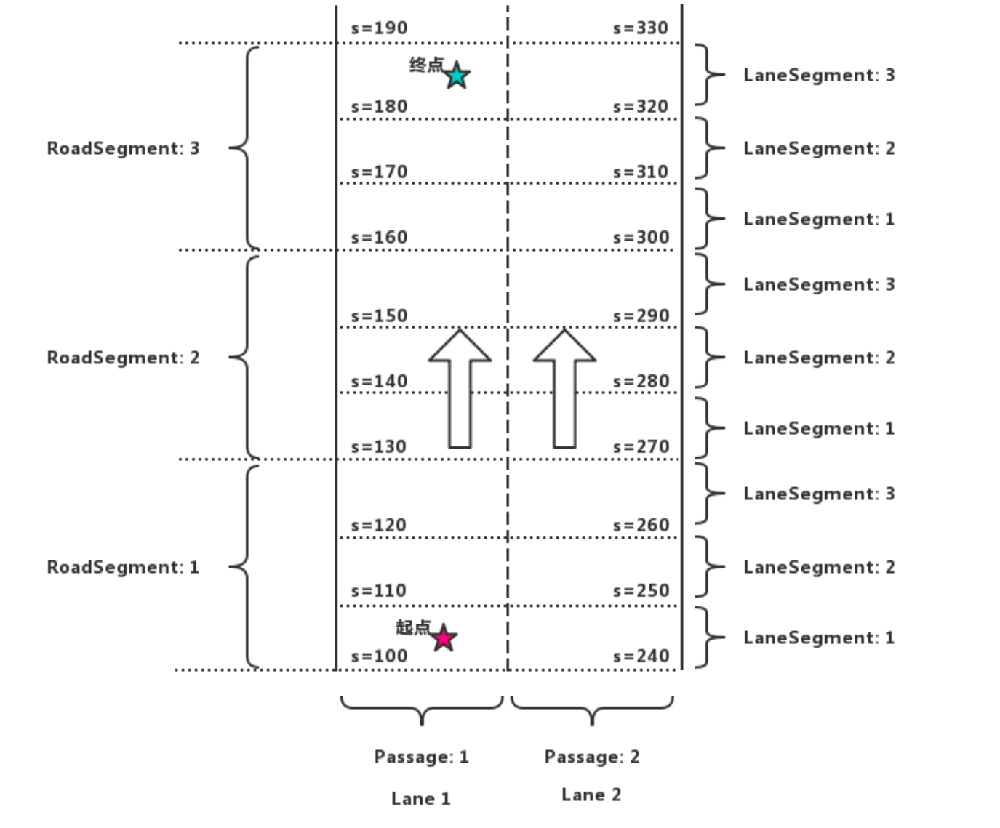
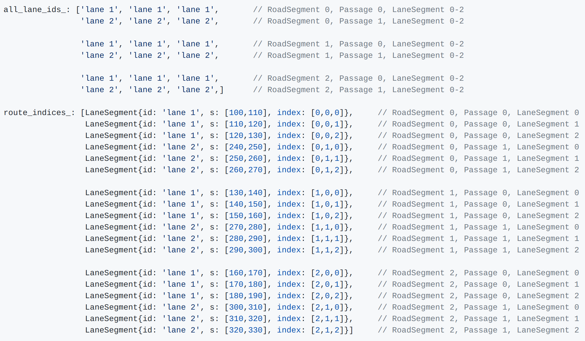

# 地图相关数据类型

## Map 

```protobuf
message Map {
  optional Header header = 1;        //上面所说的地图基本信息

  repeated Crosswalk crosswalk = 2;  //人行横道
  repeated Junction junction = 3;    //交叉路口
  repeated Lane lane = 4;           //车道
  repeated StopSign stop_sign = 5;  //停车标志
  repeated Signal signal = 6;       //信号灯
  repeated YieldSign yield = 7;     //让车标志
  repeated Overlap overlap = 8;     //重叠区域
  repeated ClearArea clear_area = 9;  //禁止停车区域
  repeated SpeedBump speed_bump = 10;  //减速带
  repeated Road road = 11;             //道路
  repeated ParkingSpace parking_space = 12; //停车区域
 	repeated PNCJunction pnc_junction = 13;
  repeated RSU rsu = 14;
}  
```

## Lane

```protobuf
// Most public roads (include highways) have more than two lanes.
message Lane {
  optional Id id = 1;         //编号
  // Central lane as reference trajectory, not necessary to be the geometry central.
  optional Curve central_curve = 2;     //中心曲线
  // Lane boundary curve.
  optional LaneBoundary left_boundary = 3;          //左边界
  optional LaneBoundary right_boundary = 4;         //右边界
  // in meters.
  optional double length = 5;                       //长度
  // Speed limit of the lane, in meters per second.
  optional double speed_limit = 6;           //速度限制
  repeated Id overlap_id = 7;                //重叠区域id
  // All lanes can be driving into (or from).
  repeated Id predecessor_id = 8;           //前任id
  repeated Id successor_id = 9;             //继任者id
  // Neighbor lanes on the same direction.
  repeated Id left_neighbor_forward_lane_id = 10;    //左边相邻前方车道id
  repeated Id right_neighbor_forward_lane_id = 11;   //右边相邻前方车道id
  enum LaneType {               //车道类型
    NONE = 1;                  //无
    CITY_DRIVING = 2;           //城市道路
    BIKING = 3;                 //自行车
    SIDEWALK = 4;               //人行道
    PARKING = 5;                //停车
  };
  optional LaneType type = 12;         //车道类型
  enum LaneTurn {
    NO_TURN = 1;        //直行
    LEFT_TURN = 2;      //左转弯
    RIGHT_TURN = 3;     //右转弯
    U_TURN = 4;         //掉头
  };
  optional LaneTurn turn = 13;          //转弯类型
  repeated Id left_neighbor_reverse_lane_id = 14;       //左边相邻反方向车道id
  repeated Id right_neighbor_reverse_lane_id = 15;      //右边相邻反方向车道id
  optional Id junction_id = 16;
  // Association between central point to closest boundary.
  repeated LaneSampleAssociation left_sample = 17;      //中心点与最近左边界之间的关联
  repeated LaneSampleAssociation right_sample = 18;     //中心点与最近右边界之间的关联
  enum LaneDirection {
    FORWARD = 1;     //前
    BACKWARD = 2;    //后，潮汐车道借用的情况？
    BIDIRECTION = 3;  //双向
  }
  optional LaneDirection direction = 19;   //车道方向
  // Association between central point to closest road boundary.
  repeated LaneSampleAssociation left_road_sample = 20;    //中心点与最近左路边界之间的关联
  repeated LaneSampleAssociation right_road_sample = 21;    //中心点与最近右路边界之间的关联
}
```

## Graph

```protobuf
message Graph {
  optional string hdmap_version = 1;
  optional string hdmap_district = 2;
  repeated Node node = 3;
  repeated Edge edge = 4;
}

message CurvePoint {
  optional double s = 1;
}

message CurveRange {
  optional CurvePoint start = 1;
  optional CurvePoint end = 2;
}

message Node {
  optional string lane_id = 1;
  optional double length = 2;
  repeated CurveRange left_out = 3;
  repeated CurveRange right_out = 4;
  optional double cost = 5;
  optional apollo.hdmap.Curve central_curve = 6;
  optional bool is_virtual = 7 [default = true];
  optional string road_id = 8;
}

message Edge {
  enum DirectionType {
    FORWARD = 0;
    LEFT = 1;
    RIGHT = 2;
  }

  optional string from_lane_id = 1;
  optional string to_lane_id = 2;
  optional double cost = 3;
  optional DirectionType direction_type = 4;
}
```

## TopoGraph

```c++
class TopoGraph {
 public:
  TopoGraph() = default;
  ~TopoGraph() = default;

  bool LoadGraph(const Graph& filename);

  const std::string& MapVersion() const;
  const std::string& MapDistrict() const;
  const TopoNode* GetNode(const std::string& id) const;
  void GetNodesByRoadId(
      const std::string& road_id,
      std::unordered_set<const TopoNode*>* const node_in_road) const;

 private:
  void Clear();
  bool LoadNodes(const Graph& graph);
  bool LoadEdges(const Graph& graph);

 private:
  std::string map_version_;
  std::string map_district_;
  std::vector<std::shared_ptr<TopoNode> > topo_nodes_;
  std::vector<std::shared_ptr<TopoEdge> > topo_edges_;
  std::unordered_map<std::string, int> node_index_map_;
  std::unordered_map<std::string, std::unordered_set<const TopoNode*> >
      road_node_map_;
};
```

## RoutingRequest

**modules/routing/proto/routing.proto**

```protobuf
message RoutingRequest {
  optional apollo.common.Header header = 1;
  // at least two points. The first is start point, the end is final point.
  // The routing must go through each point in waypoint.
  repeated LaneWaypoint waypoint = 2;
  repeated LaneSegment blacklisted_lane = 3;
  repeated string blacklisted_road = 4;
  optional bool broadcast = 5 [default = true];
  optional apollo.hdmap.ParkingSpace parking_space = 6 [deprecated = true];
  optional ParkingInfo parking_info = 7;
}

message LaneWaypoint {
  optional string id = 1;
  optional double s = 2;
  optional apollo.common.PointENU pose = 3;
}
```

RoutingRequest填充的数据

```json
header {
    timestamp_sec: 1173545118.51
    module_name: "routing"
    sequence_num: 1
}
waypoint {
    pose {
        x: 587696.82286
        y: 4141446.66696
    }
}
waypoint {
    pose {
        x: 586948.740120
        y: 4141171.118641
    }
}
```


## RoutingResponse

**modules/routing/proto/routing.proto**

```protobuf
message RoutingResponse {
  optional apollo.common.Header header = 1;
  repeated RoadSegment road = 2;
  optional Measurement measurement = 3;
  optional RoutingRequest routing_request = 4;

  // the map version which is used to build road graph
  optional bytes map_version = 5;
  optional apollo.common.StatusPb status = 6;
}

message Measurement {
  optional double distance = 1;
}

message RoadSegment {
  optional string id = 1;
  repeated Passage passage = 2;
}


message Passage {
  repeated LaneSegment segment = 1;
  optional bool can_exit = 2;
  optional ChangeLaneType change_lane_type = 3 [default = FORWARD];
}

message LaneSegment {
  optional string id = 1;
  optional double start_s = 2;
  optional double end_s = 3;
}
```


# HDMap

modules/map/hdmap/hdmap.h

modules/map/hdmap/hdmap_impl.h

HDMap的具体实现在HDMapImpl中，包含成员变量:

```cpp
Map map_;
LaneTable lane_table_;
JunctionTable junction_table_;
CrosswalkTable crosswalk_table_;
SignalTable signal_table_;
StopSignTable stop_sign_table_;
YieldSignTable yield_sign_table_;
ClearAreaTable clear_area_table_;
SpeedBumpTable speed_bump_table_;
OverlapTable overlap_table_;
RoadTable road_table_;
ParkingSpaceTable parking_space_table_;
PNCJunctionTable pnc_junction_table_;
RSUTable rsu_table_;

// 上述每一个Table都是一个std::unordered_map类型
using LaneTable = std::unordered_map<std::string, std::shared_ptr<LaneInfo>>;
```

分别对应Map中的数据元素:

modules/map/proto/map.proto

```protobuf
message Map {
  optional Header header = 1;        //上面所说的地图基本信息

  repeated Crosswalk crosswalk = 2;  //人行横道
  repeated Junction junction = 3;    //交叉路口
  repeated Lane lane = 4;           //车道
  repeated StopSign stop_sign = 5;  //停车标志
  repeated Signal signal = 6;       //信号灯
  repeated YieldSign yield = 7;     //让车标志
  repeated Overlap overlap = 8;     //重叠区域
  repeated ClearArea clear_area = 9;  //禁止停车区域
  repeated SpeedBump speed_bump = 10;  //减速带
  repeated Road road = 11;             //道路
  repeated ParkingSpace parking_space = 12; //停车区域
 	repeated PNCJunction pnc_junction = 13;
  repeated RSU rsu = 14;
}  
```


# PncMap

modules/map/pnc_map/pnc_map.h

PncMap包含的成员变量:

```c++
routing::RoutingResponse routing_;
struct RouteIndex {
  LaneSegment segment;
  std::array<int, 3> index;
};
std::vector<RouteIndex> route_indices_;
std::unordered_set<std::string> range_lane_ids_;
std::unordered_set<std::string> all_lane_ids_;
const hdmap::HDMap *hdmap_ = nullptr;
common::VehicleState adc_state_;
LaneWaypoint adc_waypoint_;
```

规划算法直接从地图中读到的道路信息过于粗糙，需要经过一系列处理才能给到规划使用，便想要在地图与规划之间再加上一层地图数据处理模块，也使得规划算法更加独立。

**pnc map**在Apollo中属于相对独立的一块内容，作为**hd map与planning的中间层**，在生成**reference_line**即规划参考线的时候会使用到。**pnc map就是解析routing结果，再由每个路由段转换为reference_line的数据形式**，这是它的主要功能。实现这一模块的目的也是为了让规划模块的独立性更高，避免与高精地图的数据格式所耦合。

pnc map目前被封装在**参考线提供器ReferenceLineProvider**中。规划控制地图pnc map主要的功能有三个：

1. **更新路由信息**。这部分接受Routing模块的路径查询响应，将其响应信息处理存储到地图类中。
2. **短期路径段查询**。根据Routing规划路径以及当前车辆的位置，计算当前车辆可行驶的车道区域。
3. **路径段生成最终路径**。针对2中每个可行驶的车道路由段，生成一条路径Path，可以后续生成参考线Reference Line。

## UpdateRoutingResponse

```c++
bool UpdateRoutingResponse(const routing::RoutingResponse &routing_response);
```

根据Routing模块反馈的RoutingResponse信息,更新PncMap中的成员变量:

```c++
bool PncMap::UpdateRoutingResponse(const routing::RoutingResponse &routing) {
  range_lane_ids_.clear();
  route_indices_.clear();
  all_lane_ids_.clear();
  
  for (int road_index = 0; road_index < routing.road_size(); ++road_index) {
    const auto &road_segment = routing.road(road_index);
    for (int passage_index = 0; passage_index < road_segment.passage_size();
         ++passage_index) {
      const auto &passage = road_segment.passage(passage_index);
      for (int lane_index = 0; lane_index < passage.segment_size();
           ++lane_index) {
        all_lane_ids_.insert(passage.segment(lane_index).id());
        route_indices_.emplace_back();
        route_indices_.back().segment =
            ToLaneSegment(passage.segment(lane_index));
        if (route_indices_.back().segment.lane == nullptr) {
          AERROR << "Failed to get lane segment from passage.";
          return false;
        }
        route_indices_.back().index = {road_index, passage_index, lane_index};
      }
    }
  }
  ......
}
```

对这条完整路径进行RoadSegment，Passage，LaneSegment的存储.




