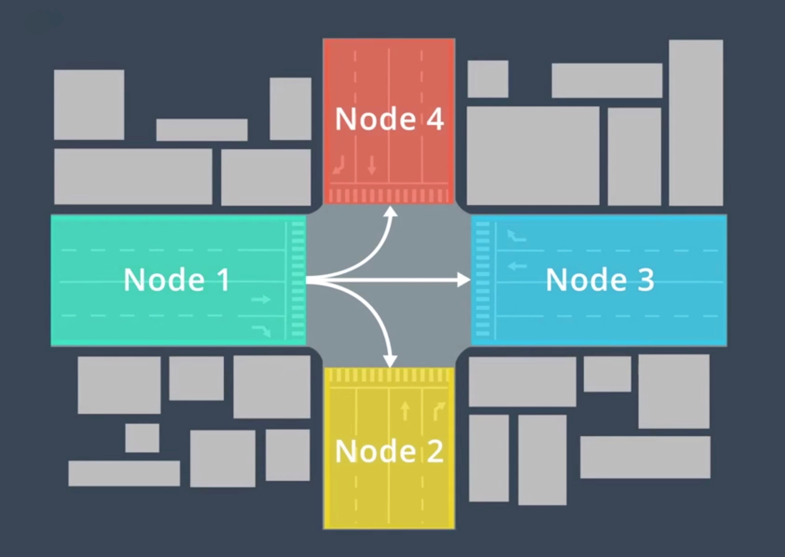
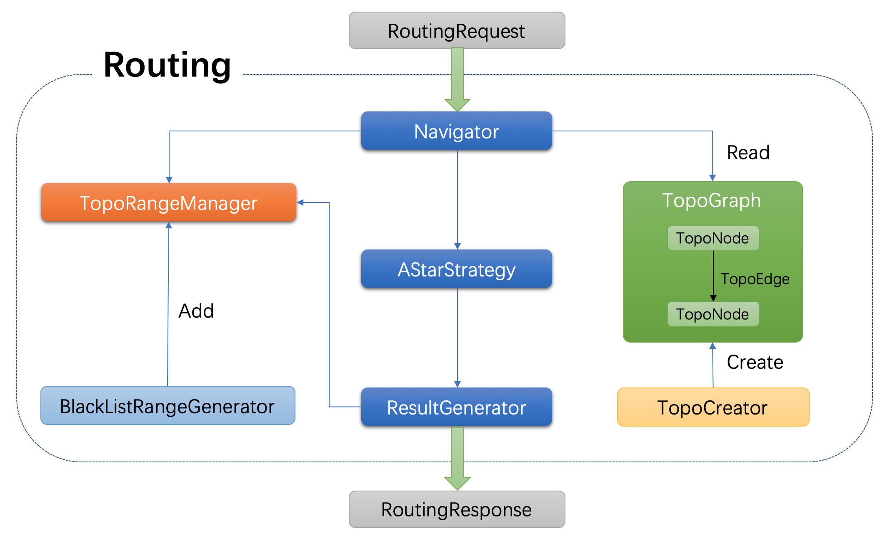

# Routing概要说明

## Routing模块简介

> Routing类似于现在开车时用到的导航模块，通常考虑的是起点到终点的最优路径（通常是最短路径），Routing考虑的是起点到终点的最短路径，而Planning则是行驶过程中，当前一小段时间如何行驶，需要考虑当前路况，是否有障碍物。Routing模块则不需要考虑这些信息，只需要做一个长期的规划路径即可，过程如下：

> 这也和我们开车类似，上车之后，首先搜索目的地，打开导航（Routing所做的事情），而开始驾车之后，则会根据当前路况，行人车辆信息来适当调整直到到达目的地（Planning所做的事情）。

- **Routing** - 主要关注起点到终点的长期路径，根据起点到终点之间的道路，选择一条最优路径。

- **Planning** - 主要关注几秒钟之内汽车的行驶路径，根据当前行驶过程中的交通规则，车辆行人等信息，规划一条短期路径。


## 拓扑地图

### Topo地图

routing需要的是一个拓扑结构的图，要想做outing，第一步就是要把原始的地图转换成包含拓扑结构的图，apollo中也实现了类似的操作，把base_map转换为routing_map，这里的base_map就是高精度地图，而routing_map则是导航地图，routing_map的结构为一个有向图。对应的例子在"modules/map/data/demo"中，这个例子比较简陋，因为routing_map.txt中只包含一个节点(Node)，没有边(Edge)信息。

apollo建图的实现在"routing/topo_creator"中，首先apollo的拓扑图中的节点和上面介绍的传统的节点不一样，apollo中引用的新的概念，**apollo中的点就是一条车道，而边则是车道和车道之间的连接，点对应具体的车道，而边则是一个虚拟的概念，表示车道之间的关系**。下面我们可以先看下apollo中道路(road)和车道(lane)的概念。


为了计算路由路径，在Routing模块中包含一系列的类用来描述Topo地图的详细结构。

这些类的定义位于[modules/routing/graph/](https://github.com/ApolloAuto/apollo/tree/master/modules/routing/graph)目录下。它们的说明如下：

| 类名             | 描述                                                         |
| :--------------- | :----------------------------------------------------------- |
| TopoNode         | Topo地图中的一个节点。包含了**所属Lane和Road**等信息。 很显然，这是Topo地图中的核心数据结构。 |
| TopoEdge         | 连接TopoNode之间的边，该结构中包含了起止TopoNode等信息。     |
| NodeSRange       | 描述节点的某一段范围。一个TopoNode可以分为若干个NodeSRange。 |
| NodeWithRange    | 描述节点及其范围，该类是NodeSRange的子类。                   |
| TopoRangeManager | NodeSRange的管理器。可以进行查找，添加，排序和合并操作。     |
| SubTopoGraph     | Topo子图，由搜索算法所用（目前是A*搜索算法）。               |
| TopoGraph        | 对应了整个Topo地图。其构造函数需要一个Proto结构导出的地图文件， 它将从地图文件中读取完整的Topo结构。 |

简单来说，Topo地图中最重要的就是节点和边，节点对应了道路，边对应了道路的连接关系。如下图所示：



### TopoCreator

与人类开车时所使用的导航系统不一样，自动驾驶需要包含更加细致信息的高精地图，高精地图描述了整个行驶过程中物理世界的详细信息，例如：道路的方向，宽度，曲率，红绿灯的位置等等。而物理世界的这些状态是很容易会发生改变的，例如，添加了一条新的道路，或者是新的红绿灯。这就要求高精地图也要频繁的更新。

那么Routing模块需要的地图文件也需要一起配套的跟着变化，这就很自然的需要有一个模块能够完成从原先的高精地图生成Routing模块的Proto格式地图这一转换工作。而完成这一工作的，就是`TopoCreator`模块。


TopoCreator的源码位于`modules/routing/topo_creator/`目录下，这是一个可执行程序:

`modules/routing/topo_creator/topo_creator.cc`

## Routing流程



把一些主要的流程摘要如下：

1. 接收request请求，响应请求结果response

2. 读取routing_map并且建图graph

3. 获取request中的routing请求节点

4. 根据black_map生成子图sub_graph

5. 通过astar算法查找最短路径

6. 合并请求结果并且返回

## Routing模块初始化

Routing模块初始化主要包含:

1. `RoutingComponent`初始化

```c++
bool RoutingComponent::Init(){.....}
```

2. `Routing`初始化
```c++
apollo::common::Status Routing::Init(){...}
```

3. Navigator初始化

```c++
Navigator::Navigator(const std::string& topo_file_path){...}
```

## 路由请求

处理路由请求的接口是下面这个：

```c++
bool Routing::Process(const std::shared_ptr<RoutingRequest> &routing_request,
                      RoutingResponse* const routing_response);
```

这个接口只有很简洁的两个参数：一个是描述请求的输入参数`routing_request`，一个是包含结果的输出参数`routing_response`。它们都是在proto文件中定义的:`modules/routing/proto/routing.proto`

## 路由搜索

```c++
bool SearchRoute(const RoutingRequest& request,RoutingResponse* const response)
```

主体逻辑是很清晰的，主要包含了这么几个步骤：

1. 对请求参数进行检查；
2. 判断自身是否处于就绪状态；
3. 初始化请求需要的参数；
4. 执行搜索算法(A*)；
5. 组装搜索结果；


# 参考

[apollo介绍之map模块（二）](https://zhuanlan.zhihu.com/p/58491204)

[解析百度Apollo之Routing模块](https://paul.pub/apollo-routing/)
