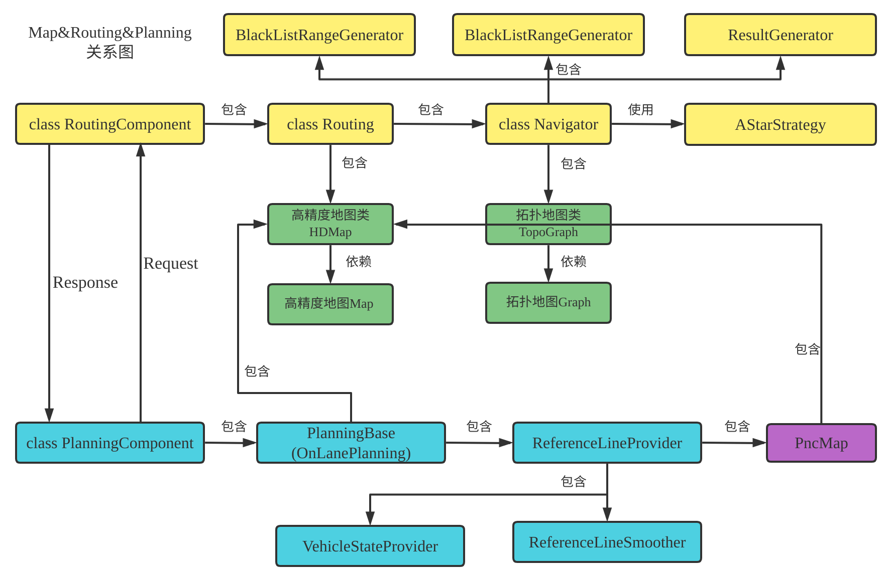
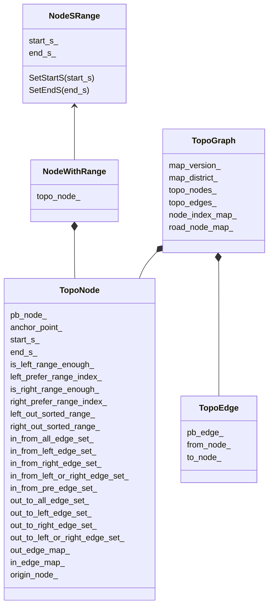
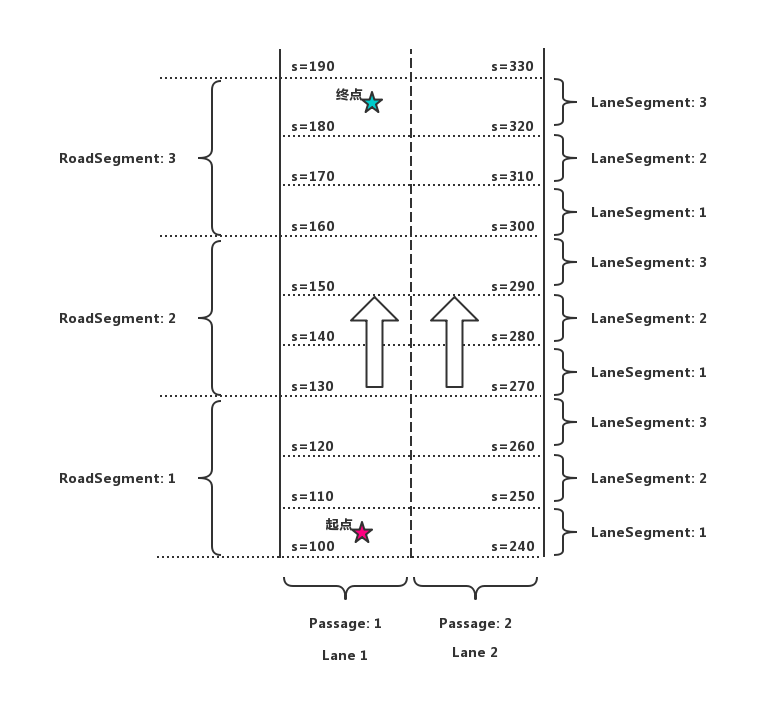
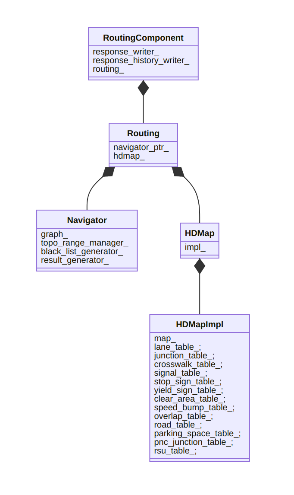
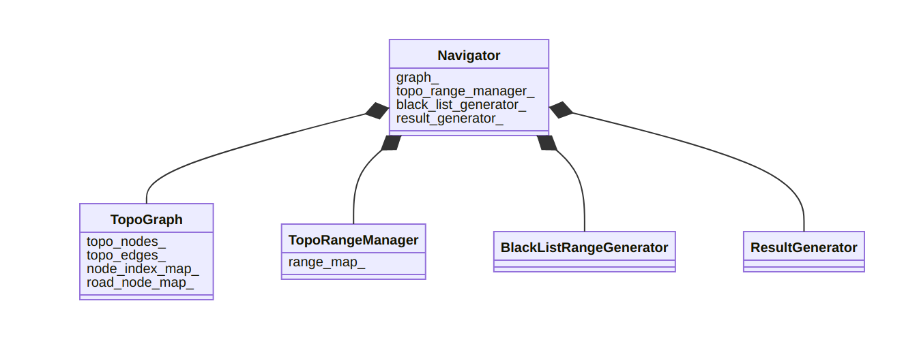
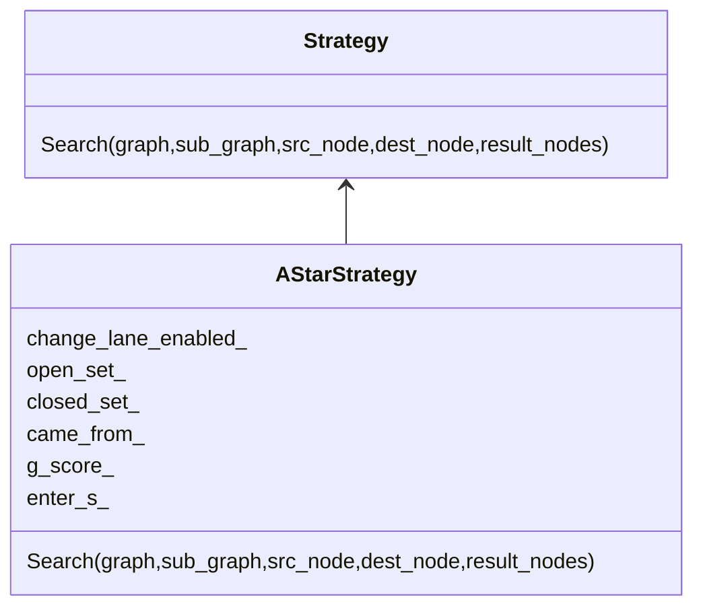
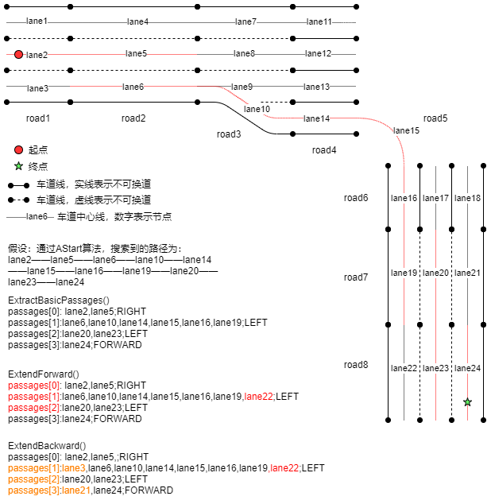
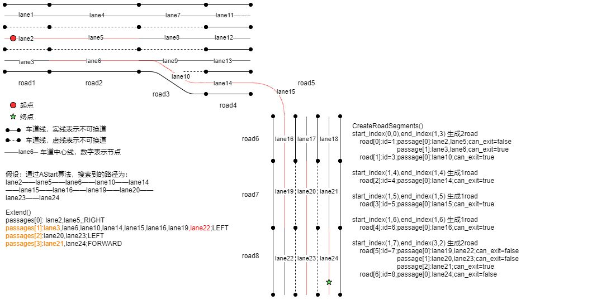

# 导航篇

项目地址 https://github.com/HaiYangLib/ApolloAnnotation

本文会将**map, routing, planning**三大模块结合在一起讲解

绿色部分是Map模块,黄色部分是Routing模块,蓝色部分是Planning模块

Routing模块和Planning模块通过**RoutingResponse和RoutingRequest**完成数据交互



## 地图相关数据类型

apollo有四种map数据类型:

**高精度地图Map (Protobuf或opendrive格式, 主要实现在modules/map/文件夹中)**

**高精度地图类HDMap (C++类，主要实现在modules/map/hdmap/文件夹中)**

**拓扑地图Graph (Protobuf格式，主要实现在modules/routing/proto/文件夹中)**

**拓扑地图类TopoGraph (C++类，主要实现在modules/routing/graph/文件夹中)**

四者之间的关系(绿色部分):


拓扑地图由高精度地图产生,拓扑地图类对拓扑地图进行了封装，提供一些便于使用的方法。


建图指的是从高精地图到拓扑地图的过程,建好的地图最后会保存起来，routing_map.txt是其中一个保存的拓扑地图，他是由高精地图(base_map.txt)生成的。

routing需要的是一个拓扑结构的图，要想做routing，第一步就是要把原始的地图转换成包含拓扑结构的图，apollo中也实现了类似的操作。根据opendirve地图或自定protobuf地图(modules/map/data/demo/base_map.txt)，产生路由拓扑地图(modules/map/data/demo/routing_map.txt)。apollo建图的实现在"routing/topo_creator"中，首先apollo的拓扑图中的节点和上面介绍的传统的节点不一样。**apollo中的点就是一条车道，而边则是车道和车道之间的连接，点对应具体的车道，而边则是一个虚拟的概念，表示车道之间的关系**。


**Lane是高精地图, 对应的protobuf文件(modules/map/proto/map_lane.proto)**

```c++
// 以lane2举例子
id                              = 2
predecessor_id                  = null // 上一车道id，不考虑变道的情况
successor_id                    = 5    // 下一车道id，不考虑变道的情况
left_neighbor_forward_lane_id   = 1    // 左边邻居车道
right_neighbor_forward_lane_id  = 3    // 右边邻居车道
type                            = CITY_DRIVING
turn                            = NO_TURN  // 没有拐弯，有些车道本身是曲线，如路口的左拐弯，右拐弯车道
direction                       = FORWARD  // 前向，反向，或者双向
speed_limit                     = 30       // 限速30km/h

// 以lane5举例子
id                              = 5
predecessor_id                  = 2 // 上一车道id，不考虑变道的情况
successor_id                    = null    // 下一车道id，不考虑变道的情况
left_neighbor_forward_lane_id   = 4    // 左边邻居车道
right_neighbor_forward_lane_id  = 6    // 右边邻居车道
type                            = CITY_DRIVING
turn                            = NO_TURN  // 没有拐弯，有些车道本身是曲线，如路口的左拐弯，右拐弯车道
direction                       = FORWARD  // 前向，反向，或者双向
speed_limit                     = 30       // 限速30km/h
```

可以看到一条道路(road)，包含多个车道(lane)，图中一条道路分成了2段，每一段包含3条车道(lane)，车道的信息见图中，主要标识了车道唯一id，左边界，右边界，参考线，长度，前车道，后车道，左边相邻的车道，右边相邻的车道等，通过这些结构化的信息，我们就知道车道之间的相互关系，也就知道了我们能否到达下一个车道，从而规划出一条到达目的地的车道线级别的路线，Planning模块在根据规划好的线路进行行驶，因为已经到车道线级别了，所以相对规划起来就简单很多。最后我们会建立一张如下的图，其中**节点是一个个的lane，而边则代表lane之间的连接**。

**Edge和Nodes拓扑地图, 对应的prorobuf文件(modules/routing/proto/topo_graph.proto)**


上文中讲到四种地图: **高精度地图,高精度地图类,拓扑地图,拓扑地图类**


### 高精度地图

#### Map&Road&Lane

* **Map**

modules/map/proto/map.proto

```protobuf
message Map {
  optional Header header = 1;        //上面所说的地图基本信息

  repeated Crosswalk crosswalk = 2;  //人行横道
  repeated Junction junction = 3;    //交叉路口
  repeated Lane lane = 4;           //车道
  repeated StopSign stop_sign = 5;  //停车标志
  repeated Signal signal = 6;       //信号灯
  repeated YieldSign yield = 7;     //让车标志
  repeated Overlap overlap = 8;     //重叠区域
  repeated ClearArea clear_area = 9;  //禁止停车区域
  repeated SpeedBump speed_bump = 10;  //减速带
  repeated Road road = 11;             //道路
  repeated ParkingSpace parking_space = 12; //停车区域
 	repeated PNCJunction pnc_junction = 13;
  repeated RSU rsu = 14;
}  
```

* **Road**

modules/map/proto/map_road.proto

```protobuf
message BoundaryEdge {
  optional Curve curve = 1;
  enum Type {
    UNKNOWN = 0;
    NORMAL = 1;
    LEFT_BOUNDARY = 2;
    RIGHT_BOUNDARY = 3;
  };
  optional Type type = 2;
}

message BoundaryPolygon {
  repeated BoundaryEdge edge = 1;
}

// boundary with holes
message RoadBoundary {
  optional BoundaryPolygon outer_polygon = 1;
  // if boundary without hole, hole is null
  repeated BoundaryPolygon hole = 2;
}

message RoadROIBoundary {
  optional Id id = 1;
  repeated RoadBoundary road_boundaries = 2;
}

// road section defines a road cross-section, At least one section must be
// defined in order to
// use a road, If multiple road sections are defined, they must be listed in
// order along the road
message RoadSection {
  optional Id id = 1;
  // lanes contained in this section
  repeated Id lane_id = 2;
  // boundary of section
  optional RoadBoundary boundary = 3;
}

// The road is a collection of traffic elements, such as lanes, road boundary
// etc.
// It provides general information about the road.
message Road {
  optional Id id = 1;
  repeated RoadSection section = 2;

  // if lane road not in the junction, junction id is null.
  optional Id junction_id = 3;

  enum Type {
    UNKNOWN = 0;
    HIGHWAY = 1;
    CITY_ROAD = 2;
    PARK = 3;
  };
  optional Type type = 4;
}

```

* **Lane**

modules/map/proto/map_lane.proto

```protobuf
// Most public roads (include highways) have more than two lanes.
message Lane {
  optional Id id = 1;         //编号
  // Central lane as reference trajectory, not necessary to be the geometry central.
  optional Curve central_curve = 2;     //中心曲线
  // Lane boundary curve.
  optional LaneBoundary left_boundary = 3;          //左边界
  optional LaneBoundary right_boundary = 4;         //右边界
  // in meters.
  optional double length = 5;                       //长度
  // Speed limit of the lane, in meters per second.
  optional double speed_limit = 6;           //速度限制
  repeated Id overlap_id = 7;                //重叠区域id
  // All lanes can be driving into (or from).
  repeated Id predecessor_id = 8;           //前任id
  repeated Id successor_id = 9;             //继任者id
  // Neighbor lanes on the same direction.
  repeated Id left_neighbor_forward_lane_id = 10;    //左边相邻前方车道id
  repeated Id right_neighbor_forward_lane_id = 11;   //右边相邻前方车道id
  enum LaneType {               //车道类型
    NONE = 1;                  //无
    CITY_DRIVING = 2;           //城市道路
    BIKING = 3;                 //自行车
    SIDEWALK = 4;               //人行道
    PARKING = 5;                //停车
  };
  optional LaneType type = 12;         //车道类型
  enum LaneTurn {
    NO_TURN = 1;        //直行
    LEFT_TURN = 2;      //左转弯
    RIGHT_TURN = 3;     //右转弯
    U_TURN = 4;         //掉头
  };
  optional LaneTurn turn = 13;          //转弯类型
  repeated Id left_neighbor_reverse_lane_id = 14;       //左边相邻反方向车道id
  repeated Id right_neighbor_reverse_lane_id = 15;      //右边相邻反方向车道id
  optional Id junction_id = 16;
  // Association between central point to closest boundary.
  repeated LaneSampleAssociation left_sample = 17;      //中心点与最近左边界之间的关联
  repeated LaneSampleAssociation right_sample = 18;     //中心点与最近右边界之间的关联
  enum LaneDirection {
    FORWARD = 1;     //前
    BACKWARD = 2;    //后，潮汐车道借用的情况？
    BIDIRECTION = 3;  //双向
  }
  optional LaneDirection direction = 19;   //车道方向
  // Association between central point to closest road boundary.
  repeated LaneSampleAssociation left_road_sample = 20;    //中心点与最近左路边界之间的关联
  repeated LaneSampleAssociation right_road_sample = 21;    //中心点与最近右路边界之间的关联
}
```


#### 创建高精地图Map

高精度地图有第三方厂商制作,

一种是opendrive格式，另一种是protobuf定义(modules/map/data/demo/base_map.txt, 是百度自定义的)

#### 高精地图结果

modules/map/data/demo/base_map.txt

```json
header {
  version: "03/10/17_22.46.20"
  date: "20161124"
  projection {
    proj: "+proj=tmerc +lat_0={37.413082} +lon_0={-122.013332} +k={0.9999999996} +ellps=WGS84 +no_defs"
  }
}

lane {
  id {
    id: "1_-1"
  }
  central_curve {
    segment {
      line_segment {
        point {
          x: 586392.84003
          y: 4140673.01232
        }
        point {
          x: 586392.64623335819
          y: 4140673.061791297
        }
  	...........................
      }
    }
  }
  left_boundary {
    curve {
      segment {
        line_segment {
          point {
            x: 586392.40718075773
            y: 4140671.3166957693
          }
          point {
            x: 586392.21339513129
            y: 4140671.366164254
          }
      ..............................
        }
        heading: -0.24993649105035462
        length: 156.61603286829296
      }
    }
    boundary_type {
      s: 0
      types: DOTTED_YELLOW
    }
    length: 156.61603286829296
  }
  right_boundary { 
    curve {
      segment {
        line_segment {
          point {
            x: 586393.2728792422
            y: 4140674.7079442316
          }
          point {
            x: 586393.07907158509
            y: 4140674.75741834
          }
        ...................................
   
        }
        heading: -0.24993649105040971
        length: 151.14875772478879
      }
    }
    boundary_type {
      s: 0
      types: CURB
    }
    length: 151.14875772478879
  }
  length: 153.87421245705966
  speed_limit: 4.5
  overlap_id {
    id: "1_-1_and_2"
  }
  type: CITY_DRIVING
  turn: NO_TURN
  left_sample {
    s: 0
    width: 1.7499999999999969
  }
  left_sample {
    s: 0.20001136855364768
    width: 1.7499999999999132
  }
  ...................
 	right_sample {
    s: 153.25237841450328
    width: 1.7499796448954572
  }
  right_sample {
    s: 153.45134503031719
    width: 1.7499859082165838
  }
  ............................................
}
stop_sign {
  id {
    id: "2"
  }
  stop_line {
    segment {
      line_segment {
        point {
          x: 586365.90892295539
          y: 4140785.417460287
        }
        point {
          x: 586367.59595983266
          y: 4140784.9523852509
        }
        point {
          x: 586369.28299449442
          y: 4140784.4873108254
        }
      }
    }
  }
  overlap_id {
    id: "1_-1_and_2"
  }
}
overlap {
  id {
    id: "1_-1_and_2"
  }
  object {
    id {
      id: "1_-1"
    }
    lane_overlap_info {
      start_s: 152.57964692253393
      end_s: 152.57964692253393
    }
  }
  object {
    id {
      id: "2"
    }
  }
}

```


### 高精地图类

#### HDMap&HDMapImpl

* **HDMap**

HDMap的具体实现由HDMapImpl定义

modules/map/hdmap/hdmap.h

```c++
class HDMap{
   HDMapImpl impl_;
}
```

* **HDMapImpl**

modules/map/hdmap/hdmap_impl.h

```c++
class HDMapImpl {
  Map map_;
  
  LaneTable lane_table_;
  JunctionTable junction_table_;
  CrosswalkTable crosswalk_table_;
  SignalTable signal_table_;
  StopSignTable stop_sign_table_;
  YieldSignTable yield_sign_table_;
  ClearAreaTable clear_area_table_;
  SpeedBumpTable speed_bump_table_;
  OverlapTable overlap_table_;
  RoadTable road_table_;
  ParkingSpaceTable parking_space_table_;
  PNCJunctionTable pnc_junction_table_;
  RSUTable rsu_table_;

  std::vector<LaneSegmentBox> lane_segment_boxes_;
  std::unique_ptr<LaneSegmentKDTree> lane_segment_kdtree_;

  std::vector<JunctionPolygonBox> junction_polygon_boxes_;
  std::unique_ptr<JunctionPolygonKDTree> junction_polygon_kdtree_;

  std::vector<CrosswalkPolygonBox> crosswalk_polygon_boxes_;
  std::unique_ptr<CrosswalkPolygonKDTree> crosswalk_polygon_kdtree_;

  std::vector<SignalSegmentBox> signal_segment_boxes_;
  std::unique_ptr<SignalSegmentKDTree> signal_segment_kdtree_;

  std::vector<StopSignSegmentBox> stop_sign_segment_boxes_;
  std::unique_ptr<StopSignSegmentKDTree> stop_sign_segment_kdtree_;

  std::vector<YieldSignSegmentBox> yield_sign_segment_boxes_;
  std::unique_ptr<YieldSignSegmentKDTree> yield_sign_segment_kdtree_;

  std::vector<ClearAreaPolygonBox> clear_area_polygon_boxes_;
  std::unique_ptr<ClearAreaPolygonKDTree> clear_area_polygon_kdtree_;

  std::vector<SpeedBumpSegmentBox> speed_bump_segment_boxes_;
  std::unique_ptr<SpeedBumpSegmentKDTree> speed_bump_segment_kdtree_;

  std::vector<ParkingSpacePolygonBox> parking_space_polygon_boxes_;
  std::unique_ptr<ParkingSpacePolygonKDTree> parking_space_polygon_kdtree_;

  std::vector<PNCJunctionPolygonBox> pnc_junction_polygon_boxes_;
  std::unique_ptr<PNCJunctionPolygonKDTree> pnc_junction_polygon_kdtree_;
};

// using LaneTable = std::unordered_map<std::string, std::shared_ptr<LaneInfo>>;
```

#### 创建高精地图类HDMap

Routing的初始化过程中会创建HDmap

使用/apollo/modules/map/data/demo/base_map.txt填充Map map_;(HDMapImpl成员变量)

Map数据类型在上文中有定义。

modules/routing/routing.cc

```c++
apollo::common::Status Routing::Init() {
  /**
   * 默认情况下：
   * 使用/apollo/modules/map/data/demo/base_map.txt填充Map map_;(HDMapImpl成员变量)
   * 
   * 用来查找routing request请求的点距离最近的lane，
   * 并且返回对应的lane id，这里很好理解，比如你在小区里面，需要打车，
   * 需要找到最近的乘车点，说直白点，就是找到最近的路。
   * **/
  hdmap_ = apollo::hdmap::HDMapUtil::BaseMapPtr();
}
```

初始化HDMapImpl成员变量,方便查询

```c++
int HDMapImpl::LoadMapFromProto(const Map& map_proto) {
  if (&map_proto != &map_) {  // avoid an unnecessary copy
    Clear();
    map_ = map_proto;
  }
  // 根据map_proto中的数据填充各种table成员变量
  ..................................
  for (const auto& road_ptr_pair : road_table_) {
    const auto& road_id = road_ptr_pair.second->id();
    for (const auto& road_section : road_ptr_pair.second->sections()) {
      const auto& section_id = road_section.id();
      for (const auto& lane_id : road_section.lane_id()) {
        auto iter = lane_table_.find(lane_id.id());
        if (iter != lane_table_.end()) {
          iter->second->set_road_id(road_id);
          iter->second->set_section_id(section_id);
        } else {
          AFATAL << "Unknown lane id: " << lane_id.id();
        }
      }
    }
  }
  for (const auto& lane_ptr_pair : lane_table_) {
    lane_ptr_pair.second->PostProcess(*this);
  }
  for (const auto& junction_ptr_pair : junction_table_) {
    junction_ptr_pair.second->PostProcess(*this);
  }
  for (const auto& stop_sign_ptr_pair : stop_sign_table_) {
    stop_sign_ptr_pair.second->PostProcess(*this);
  }
  BuildLaneSegmentKDTree();
  BuildJunctionPolygonKDTree();
  BuildSignalSegmentKDTree();
  BuildCrosswalkPolygonKDTree();
  BuildStopSignSegmentKDTree();
  BuildYieldSignSegmentKDTree();
  BuildClearAreaPolygonKDTree();
  BuildSpeedBumpSegmentKDTree();
  BuildParkingSpacePolygonKDTree();
  BuildPNCJunctionPolygonKDTree();
  return 0;
}
```


### 拓扑地图

#### Node&Edge&Graph

**apollo中的点就是一条车道，而边则是车道和车道之间的连接，点对应具体的车道，而边则是一个虚拟的概念，表示车道之间的关系**。

modules/map/proto/map_geometry.proto

```protobuf
// Polygon, not necessary convex.
message Polygon {
  repeated apollo.common.PointENU point = 1;
}

// Straight line segment.
message LineSegment {
  repeated apollo.common.PointENU point = 1;
}

// Generalization of a line.
message CurveSegment {
  oneof curve_type {
    LineSegment line_segment = 1;
  }
  optional double s = 6;  // start position (s-coordinate)
  optional apollo.common.PointENU start_position = 7;
  optional double heading = 8;  // start orientation
  optional double length = 9;
}

// An object similar to a line but that need not be straight.
message Curve {
  repeated CurveSegment segment = 1;
}
```

modules/routing/proto/topo_graph.proto

```protobuf
//- Node - 包括车道唯一id，长度，左边出口，右边出口（这里的出口对应车道虚线的部分，或者自己定义的一段允许变道的路段），路段代价（限速或者拐弯的路段会增加成本，代价系数在routing_config.pb.txt中定义)，中心线（虚拟的，用于生成参考线），是否可见，车道所属的道路id。

message CurvePoint {
  optional double s = 1;
}

message CurveRange {
  optional CurvePoint start = 1;
  optional CurvePoint end = 2;
}

//- Edge - 则包括起始车道id，到达车道id，切换代价，方向（向前，向左，向右）。
message Node {
  optional string lane_id = 1;
  optional double length = 2;
  repeated CurveRange left_out = 3;
  repeated CurveRange right_out = 4;
  optional double cost = 5;
  optional apollo.hdmap.Curve central_curve = 6;
  optional bool is_virtual = 7 [default = true];
  optional string road_id = 8;
}

message Edge {
  enum DirectionType {
    FORWARD = 0;
    LEFT = 1;
    RIGHT = 2;
  }

  optional string from_lane_id = 1;
  optional string to_lane_id = 2;
  optional double cost = 3;
  optional DirectionType direction_type = 4;
}
```

* **Graph**

modules/routing/proto/topo_graph.proto

```protobuf
message Graph {
  optional string hdmap_version = 1;
  optional string hdmap_district = 2;
  repeated Node node = 3;
  repeated Edge edge = 4;
}
```

#### 创建拓扑地图Graph

对比高精度结构中的lane，拓扑地图graph中的节点和边省去了很多信息，主要关注的是lane之间的关系。在理解了上述数据结构之后，理解建图的过程就轻松多了，下面我们结合代码来分析具体的建图流程。建图的代码目录为"routing/topo_creator"，其文件结构如下：

```
.
├── BUILD
├── edge_creator.cc            // 建边 
├── edge_creator.h
├── graph_creroadator.cc           // 建图
├── graph_creator.h
├── graph_creator_test.cc
├── node_creator.cc            // 建节点
├── node_creator.h
└── topo_creator.cc           // main函数
```

编译生成可执行文件"topo_creator"，地图需要事先通过"topo_creator"把base_map转换为routing_map。

modules/map/data/demo/routing_map.txt就是转换得到的一个routing_map

其中建图的主流程在"graph_creator.cc，并且创建节点和边。建图的主流程在函数"GraphCreator::Create()"中，下面我们具体分析这个函数。

```c++
class GraphCreator {
  std::string base_map_file_path_;
  std::string dump_topo_file_path_;
  // 高精地图,数据类型modules/map/proto/map.proto,
  // 填充的数据如modules/map/data/demo/base_map.txt
  hdmap::Map pbmap_;  
  // 拓扑地图,数据类型modules/routing/proto/topo_graph.proto
  // 拓扑地图如modules/map/data/demo/routing_map.txt
  // graph_为最后得到结果
  Graph graph_;  
  std::unordered_map<std::string, int> node_index_map_;
  std::unordered_map<std::string, std::string> road_id_map_;
  std::unordered_set<std::string> showed_edge_id_set_;
  std::unordered_set<std::string> forbidden_lane_id_set_;
  const RoutingConfig& routing_conf_;
};
```

```c++
/**
 * 对于定义的GraphCreator类对象的构造函数初始化，定义输入、输出地图路径及
 * routing_conf配置
 * **/
GraphCreator::GraphCreator(const std::string& base_map_file_path,
                           const std::string& dump_topo_file_path,
                           const RoutingConfig& routing_conf)
    : base_map_file_path_(base_map_file_path),
      dump_topo_file_path_(dump_topo_file_path),
      routing_conf_(routing_conf) {}

/**
 * 核心函数：建立拓扑地图函数Create()
 * **/
bool GraphCreator::Create() {
  /**
   * 这里注意，有2种格式，一种是Opendrive格式，通过OpendriveAdapter来读取
   * 另外一种是apollo自己定义的格式(protobuf格式)。
   *
   * 成员变量pbmap_在下面文件中定义：
   *
   *
   * modules/map/proto/map.proto
   * message Map {
   * optional Header header = 1;
   *
   * repeated Crosswalk crosswalk = 2;
   * repeated Junction junction = 3;
   * repeated Lane lane = 4;
   * repeated StopSign stop_sign = 5;
   * repeated Signal signal = 6;
   * repeated YieldSign yield = 7;
   * repeated Overlap overlap = 8;
   * repeated ClearArea clear_area = 9;
   * repeated SpeedBump speed_bump = 10;
   * repeated Road road = 11;
   * repeated ParkingSpace parking_space = 12;
   * repeated PNCJunction pnc_junction = 13;
   * repeated RSU rsu = 14;
   * }
   * **/
  if (absl::EndsWith(base_map_file_path_, ".xml")) {
    if (!hdmap::adapter::OpendriveAdapter::LoadData(base_map_file_path_,
                                                    &pbmap_)) {
      AERROR << "Failed to load base map file from " << base_map_file_path_;
      return false;
    }
  } else {
    /**
     * 从输入路径加载protobuf格式地图到pbmap_
     * **/
    if (!cyber::common::GetProtoFromFile(base_map_file_path_, &pbmap_)) {
      AERROR << "Failed to load base map file from " << base_map_file_path_;
      return false;
    }
  }

  AINFO << "Number of lanes: " << pbmap_.lane_size();

  /**
   * 成员成员变量在下面文件中定义:
   * modules/routing/proto/topo_graph.proto
   *
   * graph_为最后得到的图，消息格式在topo_graph.proto中申明
   *
   * message Graph {
   * optional string hdmap_version = 1;
   * optional string hdmap_district = 2;
   * repeated Node node = 3;
   * repeated Edge edge = 4;
   * }
   *
   * **/
  graph_.set_hdmap_version(pbmap_.header().version());
  graph_.set_hdmap_district(pbmap_.header().district());

  /**
   * 用来储存道路，车道，节点之间的对应关系
   * **/
  node_index_map_.clear();
  road_id_map_.clear();
  showed_edge_id_set_.clear();

  /**
   * 遍历base_map中的lane,将lane与road id对应起来
   * **/
  for (const auto& road : pbmap_.road()) {
    for (const auto& section : road.section()) {
      for (const auto& lane_id : section.lane_id()) {
        road_id_map_[lane_id.id()] = road.id().id();
      }
    }
  }

  /**
   * 初始化禁止车道，将类型不为city_driving的车道设置放入set容器里
   * **/
  InitForbiddenLanes();

  /**
   * 从配置文件中读取最小掉头半径
   * 加载最小转弯半径\apollo\modules\common\configs\proto\vehicle_config.proto
   *
   * **/
  const double min_turn_radius =
      VehicleConfigHelper::GetConfig().vehicle_param().min_turn_radius();

  /**
   * 遍历pbmap_中的车道,创建节点。
   * **/
  for (const auto& lane : pbmap_.lane()) {
    const auto& lane_id = lane.id().id();
    /**
     * 跳过不是城市道路(CITY_DRIVING)的车道
     * **/
    if (forbidden_lane_id_set_.find(lane_id) != forbidden_lane_id_set_.end()) {
      ADEBUG << "Ignored lane id: " << lane_id
             << " because its type is NOT CITY_DRIVING.";
      continue;
    }

    /**
     * 转弯半径过小则跳过
     * **/
    if (lane.turn() == hdmap::Lane::U_TURN &&
        !IsValidUTurn(lane, min_turn_radius)) {
      ADEBUG << "The u-turn lane radius is too small for the vehicle to turn";
      continue;
    }

    AINFO << "Current lane id: " << lane_id;
    // 存储node index和lane id的关系
    node_index_map_[lane_id] = graph_.node_size();

    /**
     * 从road_id_map里找lane id，在创建节点时指定道路id,没找到则道路id为空，
     * 创建节点引用
     * **/
    const auto iter = road_id_map_.find(lane_id);
    if (iter != road_id_map_.end()) {
      node_creator::GetPbNode(lane, iter->second, routing_conf_,
                              graph_.add_node());
    } else {
      AWARN << "Failed to find road id of lane " << lane_id;
      node_creator::GetPbNode(lane, "", routing_conf_, graph_.add_node());
    }
  }

  /**
   * 再次遍历pbmap_中的车道,创建边
   * **/
  for (const auto& lane : pbmap_.lane()) {
    const auto& lane_id = lane.id().id();
    if (forbidden_lane_id_set_.find(lane_id) != forbidden_lane_id_set_.end()) {
      ADEBUG << "Ignored lane id: " << lane_id
             << " because its type is NOT CITY_DRIVING.";
      continue;
    }

    /**
     * 对于遍历的每一个车道其对应的节点去创建边
     * **/
    const auto& from_node = graph_.node(node_index_map_[lane_id]);

    /**
     * 增加当前节点向前的边
     * **/
    AddEdge(from_node, lane.successor_id(), Edge::FORWARD);

    /**
     * 
     * DEFINE_double(min_length_for_lane_change, 1.0,
     *         "meters, which is 100 feet.  Minimum distance needs to travel on "
     *         "a lane before making a lane change. Recommended by "
     *         "https://www.oregonlaws.org/ors/811.375");
     * 
     * 如果车道长度小于最小变道长度，则直接进入下一个循环
     * 
     * **/
    if (lane.length() < FLAGS_min_length_for_lane_change) {
      continue;
    }

    /**
     * 如果该车道有左边界且允许变道，增加向左边邻居变道的边
     * **/
    if (lane.has_left_boundary() && IsAllowedToCross(lane.left_boundary())) {
      AddEdge(from_node, lane.left_neighbor_forward_lane_id(), Edge::LEFT);
    }

    /**
     * 如果该车道有右边界且允许变道，增加向右边邻居变道的边
     * **/
    if (lane.has_right_boundary() && IsAllowedToCross(lane.right_boundary())) {
      AddEdge(from_node, lane.right_neighbor_forward_lane_id(), Edge::RIGHT);
    }
  }
  ................
}
```

#### 拓扑地图结果

modules/map/data/demo/routing_map.txt

拓扑地图中的node，代表高精地图中的lane

下面的内容用来填充Graph

```json
hdmap_version: "03/10/17_22.46.20"
hdmap_district: ""
node {
  lane_id: "1_-1"
  length: 30.347678575236987
  left_out {
    start {
      s: 0
    }
    end {
      s: 30.347678575236987
    }
  }
  cost: 29.203235383821113
  central_curve {
    segment {
      line_segment {
        point {
          x: 586392.84003
          y: 4140673.01232
        }
        point {
          x: 586392.64623335819
          y: 4140673.061791297
        }
      }
      s: 0
      start_position {
        x: 586392.84003
        y: 4140673.01232
      }
      length: 30.34767
    }
  }
  is_virtual: false
  road_id: ""
}
```


### 拓扑地图类

#### TopoGraph&TopoNode&TopoEdge

Routing模块并不直接使用Graph进行路由寻径，而使用了细节信息更丰富的TopoGraph
TopoGraph的全部信息都来源于Graph，但由于对原始的节点(Node)和连接边(Edge)信息进行了加工和整合，提供了许多额外的数据结构来方便后续的查找和搜索。
通过TopoGraph，你可以查找一个Lane ID对应的TopoNode,然后找到TopoNode的相邻边和 node.举个例子，在TopoGraph中TopoNode A(对应Lane A)有一条类型为LEFT的OutEdge连接到TopoNodeB(对应Lane B)，表示在地图中Lane A的左边紧邻的就是Lane B。

* **TopoGraph**

modules/routing/graph/topo_graph.h

```c++
class TopoGraph {
  std::string map_version_;
  std::string map_district_;
  std::vector<std::shared_ptr<TopoNode> > topo_nodes_;
  std::vector<std::shared_ptr<TopoEdge> > topo_edges_;
  std::unordered_map<std::string, int> node_index_map_;
  std::unordered_map<std::string, std::unordered_set<const TopoNode*> >
      road_node_map_;
};
```

* **TopoNode**

modules/routing/graph/topo_node.h

```c++
class TopoNode {
  ...........
  Node pb_node_;
  common::PointENU anchor_point_;

  double start_s_;
  double end_s_;
  bool is_left_range_enough_;
  int left_prefer_range_index_;
  bool is_right_range_enough_;
  int right_prefer_range_index_;

  std::vector<NodeSRange> left_out_sorted_range_;
  std::vector<NodeSRange> right_out_sorted_range_;

  std::unordered_set<const TopoEdge*> in_from_all_edge_set_;
  std::unordered_set<const TopoEdge*> in_from_left_edge_set_;
  std::unordered_set<const TopoEdge*> in_from_right_edge_set_;
  std::unordered_set<const TopoEdge*> in_from_left_or_right_edge_set_;
  std::unordered_set<const TopoEdge*> in_from_pre_edge_set_;
  std::unordered_set<const TopoEdge*> out_to_all_edge_set_;
  std::unordered_set<const TopoEdge*> out_to_left_edge_set_;
  std::unordered_set<const TopoEdge*> out_to_right_edge_set_;
  std::unordered_set<const TopoEdge*> out_to_left_or_right_edge_set_;
  std::unordered_set<const TopoEdge*> out_to_suc_edge_set_;

  std::unordered_map<const TopoNode*, const TopoEdge*> out_edge_map_;
  std::unordered_map<const TopoNode*, const TopoEdge*> in_edge_map_;

  const TopoNode* origin_node_;
};
```

使用 Node构造

```c++
TopoNode::TopoNode(const Node& node)
    : pb_node_(node), start_s_(0.0), end_s_(pb_node_.length()) {
  ACHECK(pb_node_.length() > kLenghtEpsilon)
      << "Node length is invalid in pb: " << pb_node_.DebugString();
  Init();
  origin_node_ = this;
}

void TopoNode::Init() {
  // AnchorPoint的位置大概在StartS()和EndS()中间
  if (!FindAnchorPoint()) {
    AWARN << "Be attention!!! Find anchor point failed for lane: " << LaneId();
  }

  ConvertOutRange(pb_node_.left_out(), start_s_, end_s_,
                  &left_out_sorted_range_, &left_prefer_range_index_);

  is_left_range_enough_ =
      (left_prefer_range_index_ >= 0) &&
      left_out_sorted_range_[left_prefer_range_index_].IsEnoughForChangeLane();

  ConvertOutRange(pb_node_.right_out(), start_s_, end_s_,
                  &right_out_sorted_range_, &right_prefer_range_index_);
                  
  is_right_range_enough_ = (right_prefer_range_index_ >= 0) &&
                           right_out_sorted_range_[right_prefer_range_index_]
                               .IsEnoughForChangeLane();
}
```

* **TopoEdge**

modules/routing/graph/topo_node.h

```c++
enum TopoEdgeType {
  TET_FORWARD,
  TET_LEFT,
  TET_RIGHT,
};

class TopoEdge {
  .............
  Edge pb_edge_;
  const TopoNode* from_node_ = nullptr;
  const TopoNode* to_node_ = nullptr;
};
```




#### 创建拓扑地图类TopoGrap

TopoGrap在类Navigator使用,Navigator初始化的时候，也会初始化TopoGrap类

```c++
Navigator::Navigator(const std::string& topo_file_path) {
	// Graph是protobuf格式的拓扑地图,默认情况下由modules/map/data/demo/routing_map.txt填充
  Graph graph;
  cyber::common::GetProtoFromFile(topo_file_path, &graph)
  // graph_是拓扑地图类,由Graph(protobuf格式)进行初始化
  graph_.reset(new TopoGraph());
  graph_->LoadGraph(graph)；
	...............................
}
```

```c++
bool TopoGraph::LoadGraph(const Graph& graph) {
  ..............
  LoadNodes(graph);
  LoadEdges(graph);
..................
}
```

TopoGraph成员变量:

```c++
std::vector<std::shared_ptr<TopoEdge>> topo_edges_;

std::vector<std::shared_ptr<TopoNode>> topo_nodes_;
std::unordered_map<std::string, int> node_index_map_;
std::unordered_map<std::string, std::unordered_set<const TopoNode*>> road_node_map_;
```

```c++
bool TopoGraph::LoadNodes(const Graph& graph) {
  if (graph.node().empty()) {
    AERROR << "No nodes found in topology graph.";
    return false;
  }
  for (const auto& node : graph.node()) {
    node_index_map_[node.lane_id()] = static_cast<int>(topo_nodes_.size());
    std::shared_ptr<TopoNode> topo_node;
    topo_node.reset(new TopoNode(node));
    road_node_map_[node.road_id()].insert(topo_node.get());
    topo_nodes_.push_back(std::move(topo_node));
  }
  return true;
}

bool TopoGraph::LoadEdges(const Graph& graph) {
  if (graph.edge().empty()) {
    AINFO << "0 edges found in topology graph, but it's fine";
    return true;
  }
  for (const auto& edge : graph.edge()) {
    const std::string& from_lane_id = edge.from_lane_id();
    const std::string& to_lane_id = edge.to_lane_id();
    if (node_index_map_.count(from_lane_id) != 1 ||
        node_index_map_.count(to_lane_id) != 1) {
      return false;
    }
    std::shared_ptr<TopoEdge> topo_edge;
    TopoNode* from_node = topo_nodes_[node_index_map_[from_lane_id]].get();
    TopoNode* to_node = topo_nodes_[node_index_map_[to_lane_id]].get();
    topo_edge.reset(new TopoEdge(edge, from_node, to_node));
    from_node->AddOutEdge(topo_edge.get());
    to_node->AddInEdge(topo_edge.get());
    topo_edges_.push_back(std::move(topo_edge));
  }
  return true;
}

void TopoNode::AddOutEdge(const TopoEdge* edge) {
  if (edge->FromNode() != this) {
    return;
  }
  if (out_edge_map_.count(edge->ToNode()) != 0) {
    return;
  }
  switch (edge->Type()) {
    case TET_LEFT:
      out_to_left_edge_set_.insert(edge);
      out_to_left_or_right_edge_set_.insert(edge);
      break;
    case TET_RIGHT:
      out_to_right_edge_set_.insert(edge);
      out_to_left_or_right_edge_set_.insert(edge);
      break;
    default:
      out_to_suc_edge_set_.insert(edge);
      break;
  }
  out_to_all_edge_set_.insert(edge);
  out_edge_map_[edge->ToNode()] = edge;
}


void TopoNode::AddInEdge(const TopoEdge* edge) {
  if (edge->ToNode() != this) {
    return;
  }
  if (in_edge_map_.count(edge->FromNode()) != 0) {
    return;
  }
  switch (edge->Type()) {
    case TET_LEFT:
      in_from_right_edge_set_.insert(edge);
      in_from_left_or_right_edge_set_.insert(edge);
      break;
    case TET_RIGHT:
      in_from_left_edge_set_.insert(edge);
      in_from_left_or_right_edge_set_.insert(edge);
      break;
    default:
      in_from_pre_edge_set_.insert(edge);
      break;
  }
  in_from_all_edge_set_.insert(edge);
  in_edge_map_[edge->FromNode()] = edge;
}
```


## Request&Response

### 数据类型

**modules/routing/proto/routing.proto**

首先，我们需要了解路由输出的结果的数据结构，在apollo中，它们被定义在modules/routing/proto/routing.proto文件中，挑选了比较重要的数据展示在下面。

```protobuf
message LaneWaypoint { 
  optional string id = 1; //表示的是 lane id
  optional double s = 2; // pose在对应lane上投影的s
  optional apollo.common.PointENU pose = 3;
}

message LaneSegment { //对应一条车道，等同于高精地图中的一条车道。
  optional string id = 1; //车道id
  //起始位置与车道起始点的距离。
  //（毕竟规划出的路径并不一定刚好是一个完整的车道，
  //意思就是规划出的路径中的某个车道，并不一定与地图数据中的车道打断长度是一样的。）
  optional double start_s = 2; 
  //终止位置与车道起始点的距离。
  optional double end_s = 3;  
}

message RoutingRequest {//记录了规划请求的信息，不做介绍
  optional apollo.common.Header header = 1;
  // at least two points. The first is start point, the end is final point.
  // The routing must go through each point in waypoint.
  // 至少有两点,第一个是起点，终点是终点。
  // 路由必须通过航路点中的每个点。
  repeated LaneWaypoint waypoint = 2;
  
  repeated LaneSegment blacklisted_lane = 3;
  // 这里设置规划规避车道。
  repeated string blacklisted_road = 4;
  optional bool broadcast = 5 [default = true];
  optional apollo.hdmap.ParkingSpace parking_space = 6;
}

message Measurement {
  optional double distance = 1; //规划路径长度
}

enum ChangeLaneType {//这里表示一个passage的变道方向。
  FORWARD = 0;
  LEFT = 1;
  RIGHT = 2;
};

message Passage {//由多个前后相连的segment组成一个passage。
  repeated LaneSegment segment = 1;
  optional bool can_exit = 2;//表示当前passage是否可退出。如果是false，则表示 
//1. passage是最后一个passage了（也就是要到终点了）。
//2. 不能继续前行了，必须要按照change_lane_type进行变道。
// 多发生在路口停止线前，在进入实线区域前有时必须要完成变道才能抵达目的地。
// 如果是true，则表示可以通过直行或者变道离开当前passage。
  optional ChangeLaneType change_lane_type = 3 [default = FORWARD];
//怎么理解呢，假如值是left，则表示在该passage内车辆要完成向左变道抵达左侧相邻的下一个passage。
//如果是forward，则表示无需变道，继续向前行驶。
//由此可见，不存在can_exit==false && change_lane_type ==forward的情况
}

message RoadSegment {//道路段，passages按照道路区分。
  optional string id = 1;
  repeated Passage passage = 2;
}

message RoutingResponse {
  optional apollo.common.Header header = 1;
  repeated RoadSegment road = 2;
  optional Measurement measurement = 3;
  optional RoutingRequest routing_request = 4;

  // the map version which is used to build road graph
  optional bytes map_version = 5;
  optional apollo.common.StatusPb status = 6;
}

```

而其中最重要的为RoadSegment，路由模块将道路结构分解为多个RoadSegment，每个RoadSegment又包括多个通道：Passage，每个Passage又由多个LaneSegment组成。

如图所示，为双车道中的一个例子。红色点为Routing起点，橙色为终点。

则RoutingResponse中给我们的结果就是RoadSegment1, 2, 3。

RoadSegment1中包括两个Passage（即每个车道为一个通道），每个Passage又包括三个LaneSegment。

这样做有什么好处呢？

当我们为RoadSegment，Passage，LaneSegment编号时，就可以将Routing模块输出的地图道路信息中每个车道中的每个LaneSegment快速的索引出来。代表左下角红圈所在的LaneSegment。


另外需要注意的是Passage中的两个属性:

`can_exit` : 代表能否从当前通道去下一个通道。用于判断将来是否需要变道。例如Passage1中can_exit为false， Passage2中为true。

`change_lane_type` : 代表当前通道是直行（FORWARD），左转（LEFT）还是右转（RIGHT）。 图中Passage1为RIGHT， 因为需要右转才能到终点。Passage2为FORWARD。

**RoadSegment，Passage，LaneSegment**图解：




RoutingRequest最关键的信息就是下面这个：

```
repeated LaneWaypoint waypoint = 2;
```

它描述了一次路由请求的路径点(途经点)，`repeated`表示这个数据可以出现多次，因此是Routing模块是支持一次搜索多个途经点的。

RoutingRequest填充的数据举例

```json
header {
    timestamp_sec: 1173545118.51
    module_name: "routing"
    sequence_num: 1
}
waypoint {
    pose {
        x: 587696.82286
        y: 4141446.66696
    }
}
waypoint {
    pose {
        x: 586948.740120
        y: 4141171.118641
    }
}
```


## Routing模块实现

### Routing模块相关Topic

Routing模块**订阅**的话题:

| 成员变量 | 话题名称                  | 消息类型       |
| -------- | ------------------------- | -------------- |
| 配置Proc | "/apollo/routing_request" | RoutingRequest |

Routing模块**发布**的话题:

| 成员变量                 | 话题名称                           | 消息类型        |
| ------------------------ | ---------------------------------- | --------------- |
| response_writer_         | "/apollo/routing_response"         | RoutingResponse |
| response_history_writer_ | "/apollo/routing_response_history" | RoutingResponse |

### Routing模块关系图







### Routing模块实现

RoutingComponent主要的实现在类Routing中

####  类Routing初始化

modules/routing/routing.cc

类Routing成员变量:

```c++
  std::unique_ptr<Navigator> navigator_ptr_;
  common::monitor::MonitorLogBuffer monitor_logger_buffer_;
  const hdmap::HDMap *hdmap_ = nullptr;
```

类Routing初始化

```c++
apollo::common::Status Routing::Init() {
  /**
   * 默认情况下：
   * routing_map_file=modules/map/data/demo/routing_map.txt
   * **/
  const auto routing_map_file = apollo::hdmap::RoutingMapFile();
  AINFO << "Use routing topology graph path: " << routing_map_file;
  navigator_ptr_.reset(new Navigator(routing_map_file));

  /**
   * 默认情况下：
   * 使用odules/map/data/demo/routing_map.txt填充Map map_;(HDMapImpl成员变量)
   * 
   * 用来查找routing request请求的点距离最近的lane，
   * 并且返回对应的lane id，这里很好理解，比如你在小区里面，需要打车，
   * 需要找到最近的乘车点，说直白点，就是找到最近的路。
   * **/
  hdmap_ = apollo::hdmap::HDMapUtil::BaseMapPtr();
  ACHECK(hdmap_) << "Failed to load map file:" << apollo::hdmap::BaseMapFile();

  return apollo::common::Status::OK();
}
```

####  Routing具体实现

modules/routing/routing.cc

```c++
 bool Process(const std::shared_ptr<RoutingRequest> &routing_request,
               RoutingResponse *const routing_response);
```

* **步骤1：**

```c++
bool Routing::Process(const std::shared_ptr<RoutingRequest>& routing_request,
                      RoutingResponse* const routing_response) {
  /**
   * 找到routing_request节点最近的路
   * **/
  const auto& fixed_requests = FillLaneInfoIfMissing(*routing_request);
  .................
}
```

* **步骤2：进行搜索,找到最优路径**

```c++
bool Routing::Process(const std::shared_ptr<RoutingRequest>& routing_request,
                      RoutingResponse* const routing_response) {
  ......................................
  double min_routing_length = std::numeric_limits<double>::max();
  for (const auto& fixed_request : fixed_requests) {
    RoutingResponse routing_response_temp;

    /**
     * 找到一条路径
     * **/
    if (navigator_ptr_->SearchRoute(fixed_request, &routing_response_temp)) {
      const double routing_length =
          routing_response_temp.measurement().distance();

      /**
       * 更新最短路径
       * **/    
      if (routing_length < min_routing_length) {
        routing_response->CopyFrom(routing_response_temp);
        min_routing_length = routing_length;
      }
    }
    FillParkingID(routing_response);
  }
  ............
}
```

### 进行搜索

modules/routing/core/navigator.cc

* **步骤1： 对请求参数进行检查**

```c++
/**
 * 步骤1： 对请求参数进行检查；
 * 步骤2:  判断自身是否处于就绪状态；
 * 步骤3： 初始化请求需要的参数；
 * 步骤4： 执行搜索算法；
 * 步骤5： 组装搜索结果；
 * **/
bool Navigator::SearchRoute(const RoutingRequest& request,
                            RoutingResponse* const response) {
  // 步骤1
  if (!ShowRequestInfo(request, graph_.get())) {
    SetErrorCode(ErrorCode::ROUTING_ERROR_REQUEST,
                 "Error encountered when reading request point!",
                 response->mutable_status());
    return false;
  }
  .................
}
```

* **步骤2:  判断自身是否处于就绪状态**

```c++
bool Navigator::SearchRoute(const RoutingRequest& request,
                            RoutingResponse* const response) {
  .................
  // 步骤2
  if (!IsReady()) {
    SetErrorCode(ErrorCode::ROUTING_ERROR_NOT_READY, "Navigator is not ready!",
                 response->mutable_status());
    return false;
  }
  .................
}  
```

* **步骤3： 初始化请求需要的参数**

```c++
std::vector<const TopoNode*> way_nodes;
  std::vector<double> way_s;
  // 步骤3
  if (!Init(request, graph_.get(), &way_nodes, &way_s)) {
    SetErrorCode(ErrorCode::ROUTING_ERROR_NOT_READY,
                 "Failed to initialize navigator!", response->mutable_status());
    return false;
  }

```

* **步骤4： 执行搜索算法**

```c++
 std::vector<NodeWithRange> result_nodes;
  // 步骤4
  if (!SearchRouteByStrategy(graph_.get(), way_nodes, way_s, &result_nodes)) {
    SetErrorCode(ErrorCode::ROUTING_ERROR_RESPONSE,
                 "Failed to find route with request!",
                 response->mutable_status());
    return false;
  }

```

* **步骤5： 组装搜索结果**

```c++
result_nodes.front().SetStartS(request.waypoint().begin()->s());
  result_nodes.back().SetEndS(request.waypoint().rbegin()->s());
  // 步骤5
  if (!result_generator_->GeneratePassageRegion(
          graph_->MapVersion(), request, result_nodes, topo_range_manager_,
          response)) {
    SetErrorCode(ErrorCode::ROUTING_ERROR_RESPONSE,
                 "Failed to generate passage regions based on result lanes",
                 response->mutable_status());
    return false;
  }
```

## 搜索策略

### A*算法基本原理

**A\*算法基于代价函数f(n)=g(n)+h(n)计算最短路径，其中f(n)是结点n的总代价函数，g(n)是从初始结点到结点n的移动代价，h(n)是从结点n到目标结点的启发代价。**
如果不考虑具体实现代码，A*算法是相当简单的。有两个集合，OPEN集和CLOSED集。其中OPEN集保存待考察的结点。开始时，OPEN集只包含一个元素：初始结点。CLOSED集保存已考查过的结点。开始时，CLOSED集是空的。如果绘成图，OPEN集就是被访问区域的边境（frontier），而CLOSED集则是被访问区域的内部（interior）。每个结点同时保存其父结点的指针，以便反向溯源。
在主循环中重复地从OPEN集中取出最好的结点n（f值最小的结点）并检查之。如果n是目标结点，则我们的任务完成了。否则，从OPEN集中删除结点n并将其加入CLOSED集。然后检查它的邻居n’。如果邻居n’在CLOSED集中，表明该邻居已被检查过，不必再次考虑（若你确实需要检查结点n’的g值是否更小，可进行相关检查，若其g值更小，则将该结点从CLOSED集中删除）；如果n’在OPEN集中，那么该结点今后肯定会被考察，现在不必考虑它。否则，把它加入OPEN集，把它的父结点设为n。到达n’的路径的代价g(n’)，设定为g(n) + movementcost(n, n’)。


### A*算法源码实现



```c++
/**
 * routing模块的路径搜索功是通过AStart算法完成的，
 * 输入修正后的起点、终点、读取的拓扑地图以及根据起点终点生成的子拓扑图，得到起点到达终点的点集
 * **/
bool AStarStrategy::Search(const TopoGraph* graph,
                           const SubTopoGraph* sub_graph,
                           const TopoNode* src_node, const TopoNode* dest_node,
                           std::vector<NodeWithRange>* const result_nodes) {
  /**
   * 优先级队列openlist,用priority_queue实现.std::priority_queue是一种容器适配器，
   * 它提供常数时间的最大元素查找功能，亦即其栈顶元素top永远输出队列中的最大元素。
   * 但SearchNode内部重载了<运算符，对小于操作作了相反的定义
   * 因此std::priority_queue<SearchNode>的栈顶元素永远输出队列中的最小元素。
   * **/
  std::priority_queue<SearchNode> open_set_detail;
  // 将源结点设置为检查结点
  SearchNode src_search_node(src_node);
  // 计算检查结点的启发式代价值f
  src_search_node.f = HeuristicCost(src_node, dest_node);
  // 将检查结点压入OPEN集优先级队列
  open_set_detail.push(src_search_node);
  // 将源结点加入OPEN集
  open_set_.insert(src_node);
  // 源结点到自身的移动代价值g为0
  g_score_[src_node] = 0.0;
  // 设置源结点的进入s值
  enter_s_[src_node] = src_node->StartS();

  SearchNode current_node;
  std::unordered_set<const TopoEdge*> next_edge_set;
  std::unordered_set<const TopoEdge*> sub_edge_set;
  // 只要OPEN集优先级队列不为空，就不断循环检查
  while (!open_set_detail.empty()) {
    // 取出栈顶元素（f值最小）
    current_node = open_set_detail.top();
    // 设置起始结点
    const auto* from_node = current_node.topo_node;
    // 若起始结点已抵达最终的目标结点，则反向回溯输出完整的路由，返回。
    if (current_node.topo_node == dest_node) {
      if (!Reconstruct(came_from_, from_node, result_nodes)) {
        AERROR << "Failed to reconstruct route.";
        return false;
      }
      return true;
    }

    // 从OPEN集中删除起始结点
    open_set_.erase(from_node);
    // 从OPEN集队列中删除起始结点
    open_set_detail.pop();

    // 若起始结点from_node在CLOSED集中的计数不为0，表明之前已被检查过，直接跳过
    if (closed_set_.count(from_node) != 0) {
      // if showed before, just skip...
      continue;
    }

    // 将起始结点加入关闭集
    closed_set_.emplace(from_node);

    // if residual_s is less than FLAGS_min_length_for_lane_change, only move
    // forward

    /**
     * DEFINE_double(min_length_for_lane_change, 1.0,
     *         "meters, which is 100 feet.  Minimum distance needs to travel on
     * " "a lane before making a lane change. Recommended by "
     *         "https://www.oregonlaws.org/ors/811.375");
     *
     * **/

    // 获取起始结点from_node的所有相邻边
    // 若起始结点from_node到终点的剩余距离s比FLAGS_min_length_for_lane_change要短，
    // 则不考虑变换车道，即只考虑前方结点而不考虑左右结点。
    // 反之，若s比FLAGS_min_length_for_lane_change要长，则考虑前方及左右结点。

    //先通过判断用不用变道,再获取当前节点的所有相邻边
    // GetResidualS 为当前节点到终点的剩余距离s
    //若s<min_length则不变道,若s > min_length 则变道
    const auto& neighbor_edges =
        (GetResidualS(from_node) > FLAGS_min_length_for_lane_change &&
         change_lane_enabled_)
            ? from_node->OutToAllEdge()
            : from_node->OutToSucEdge();

    // 当前测试的移动代价值
    double tentative_g_score = 0.0;
    next_edge_set.clear();
    // 从相邻边neighbor_edges中获取其内部包含的边，将所有相邻边全部加入集合：next_edge_set
    for (const auto* edge : neighbor_edges) {
      sub_edge_set.clear();
      sub_graph->GetSubInEdgesIntoSubGraph(edge, &sub_edge_set);
      next_edge_set.insert(sub_edge_set.begin(), sub_edge_set.end());
    }

    // 所有相邻边的目标结点就是我们需要逐一测试的相邻结点，对相结点点逐一测试，寻找
    // 总代价f = g + h最小的结点，该结点就是起始结点所需的相邻目标结点。
    for (const auto* edge : next_edge_set) {
      const auto* to_node = edge->ToNode();
      if (closed_set_.count(to_node) == 1) {
        continue;
      }

      // 若当前边到相邻结点to_node的距离小于FLAGS_min_length_for_lane_change，表明不能
      // 通过变换车道的方式从当前边切换到相邻结点to_node，直接忽略。
      if (GetResidualS(edge, to_node) < FLAGS_min_length_for_lane_change) {
        continue;
      }

      tentative_g_score =
          g_score_[current_node.topo_node] + GetCostToNeighbor(edge);

      // 如果边类型不是前向，而是左向或右向，表示变换车道的情形，则更改移动代价值g
      // 的计算方式
      if (edge->Type() != TopoEdgeType::TET_FORWARD) {
        tentative_g_score -=
            (edge->FromNode()->Cost() + edge->ToNode()->Cost()) / 2;
      }

      // 总代价 f = g + h
      double f = tentative_g_score + HeuristicCost(to_node, dest_node);

      // 若相邻结点to_node在OPEN集且当前总代价f大于源结点到相邻结点to_node的移动代价g，表明现有情形下
      // 从当前结点到相邻结点to_node的路径不是最优，直接忽略。
      // 因为相邻结点to_node在OPEN集中，后续还会对该结点进行考察。
      // open_set_.count(to_node) != 0修改为open_set_.count(to_node) > 0似乎更好
      if (open_set_.count(to_node) != 0 && f >= g_score_[to_node]) {
        continue;
      }

      // if to_node is reached by forward, reset enter_s to start_s
      // 如果是以向前（而非向左或向右）的方式抵达相邻结点to_node，则将to_node的进入距离更新为
      // to_node的起始距离。
      if (edge->Type() == TopoEdgeType::TET_FORWARD) {
        enter_s_[to_node] = to_node->StartS();
      } else {
        // else, add enter_s with FLAGS_min_length_for_lane_change
        // 若是以向左或向右方式抵达相邻结点to_node，则将to_node的进入距离更新为
        // 当前结点from_node的进入距离加上最小换道长度，并乘以相邻结点to_node长度
        // 与当前结点from_node长度的比值（这么做的目的是为了归一化，以便最终的代价量纲一致）。
        double to_node_enter_s =
            (enter_s_[from_node] + FLAGS_min_length_for_lane_change) /
            from_node->Length() * to_node->Length();
        // enter s could be larger than end_s but should be less than length
        to_node_enter_s = std::min(to_node_enter_s, to_node->Length());
        // if enter_s is larger than end_s and to_node is dest_node
        if (to_node_enter_s > to_node->EndS() && to_node == dest_node) {
          continue;
        }
        enter_s_[to_node] = to_node_enter_s;
      }
      // 更新从源点移动到结点to_node的移动代价（因为找到了一条代价更小的路径，必须更新它）
      g_score_[to_node] = f;
      // 将相邻结点to_node设置为下一个待考察结点
      SearchNode next_node(to_node);
      next_node.f = f;
      // 当下一个待考察结点next_node加入到OPEN优先级队列
      open_set_detail.push(next_node);
      // 将to_node的父结点设置为from_node
      came_from_[to_node] = from_node;
      // 若相邻结点不在OPEN集中，则将其加入OPEN集，以便后续考察
      if (open_set_.count(to_node) == 0) {
        open_set_.insert(to_node);
      }
    }
  }
}
```

完成从起点到达终点的路径搜索后，还需要从中规划出一条完整的轨迹，然后生成可通行区域和Road。

**1）规划起始点到达终点路径**

在Reconstruct()函数中，从终点到起点进行反向搜索，获取轨迹点：

```c++
bool Reconstruct(
    const std::unordered_map<const TopoNode*, const TopoNode*>& came_from,
    const TopoNode* dest_node, std::vector<NodeWithRange>* result_nodes) {
  std::vector<const TopoNode*> result_node_vec;
  result_node_vec.push_back(dest_node);

  auto iter = came_from.find(dest_node);
  while (iter != came_from.end()) {
    result_node_vec.push_back(iter->second);
    iter = came_from.find(iter->second);
  }
  std::reverse(result_node_vec.begin(), result_node_vec.end());
  if (!AdjustLaneChange(&result_node_vec)) {
    AERROR << "Failed to adjust lane change";
    return false;
  }
  result_nodes->clear();
  for (const auto* node : result_node_vec) {
    result_nodes->emplace_back(node->OriginNode(), node->StartS(),
                               node->EndS());
  }
  return true;
}
```


**2）提取基础可通行区域**

将重组得到的一条完整轨迹按照是否需要换道，生成基础可通行区域：

```c++
bool ResultGenerator::ExtractBasicPassages(
    const std::vector<NodeWithRange>& nodes,
    std::vector<PassageInfo>* const passages) {
  ACHECK(!nodes.empty());
  passages->clear();
  std::vector<NodeWithRange> nodes_of_passage;
  nodes_of_passage.push_back(nodes.at(0));
  for (size_t i = 1; i < nodes.size(); ++i) {
    auto edge =
        nodes.at(i - 1).GetTopoNode()->GetOutEdgeTo(nodes.at(i).GetTopoNode());
    if (edge == nullptr) {
      AERROR << "Get null pointer to edge from " << nodes.at(i - 1).LaneId()
             << " to " << nodes.at(i).LaneId();
      return false;
    }
    // 根据是否需要便道,将完整的区域分为不同的可行驶区域
    if (edge->Type() == TET_LEFT || edge->Type() == TET_RIGHT) {
      auto change_lane_type = LEFT;
      if (edge->Type() == TET_RIGHT) {
        change_lane_type = RIGHT;
      }
      // 根据edge属性,将其添加到passage
      passages->emplace_back(nodes_of_passage, change_lane_type);
      nodes_of_passage.clear();
    }
    nodes_of_passage.push_back(nodes.at(i));
  }
  passages->emplace_back(nodes_of_passage, FORWARD);
  return true;
}
```


红色的laneID为具有换道属性节点，依据这些特殊节点，将可通行路径进行划分，可通行路径的换道属性为图中标注的属性。

**3) 对提取的可通行区域进行扩展**

AStart算法搜索得到的是一条唯一可通行路径，路径上存在可以通过换道到达相同目的地的路径，因此需要对得到的路径进行向前、向后两个方向的扩展：

```c++
// 向前扩展搜索(前进方向)
void ResultGenerator::ExtendForward(const TopoRangeManager& range_manager,
                                    const PassageInfo& next_passage,
                                    PassageInfo* const curr_passage)
  
// 向后扩展搜索(后退方向)
void ResultGenerator::ExtendBackward(const TopoRangeManager& range_manager,
                                     const PassageInfo& prev_passage,
                                     PassageInfo* const curr_passage)  
```



红色laneID为向前搜索新增的节点，橙色laneID为向后搜索新增的节点。

### 生成RoadSegments

遍历扩展得到的可通行区域，依据是否可以通过换道到到达该节点，对扩展的可性行进行道路段构建：

```c++
void ResultGenerator::CreateRoadSegments(
    const std::vector<PassageInfo>& passages, RoutingResponse* result) {
  ACHECK(!passages.empty()) << "passages empty";
  NodeWithRange fake_node_range(passages.front().nodes.front());
  bool in_change_lane = false;
  //  start_index第一个参数为passage索引,第二个参数为node索引
  std::pair<std::size_t, std::size_t> start_index(0, 0);
  for (std::size_t i = 0; i < passages.size(); ++i) {
    const auto& curr_nodes = passages[i].nodes;
    for (std::size_t j = 0; j < curr_nodes.size(); ++j) {

      // 如果可以通过换道到达则继续搜索,直到节点不能通过换道到达为止
      if ((i + 1 < passages.size() &&
           IsReachableToWithChangeLane(curr_nodes[j].GetTopoNode(),
                                       passages[i + 1], &fake_node_range)) ||
          (i > 0 &&
           IsReachableFromWithChangeLane(curr_nodes[j].GetTopoNode(),
                                         passages[i - 1], &fake_node_range))) {
        if (!in_change_lane) {
          start_index = {i, j};
          in_change_lane = true;
        }
      } else {
        if (in_change_lane) {
          ADEBUG << "start_index(" << start_index.first << ", "
                 << start_index.second
                 << ") end_index(" << i << ", " << j - 1 << ")";
          // 将可换道到达的节点作为一段road       
          AddRoadSegment(passages, start_index, {i, j - 1}, result);
        }

        ADEBUG << "start_index(" << i << ", " << j
               << ") end_index(" << i << ", " << j << ")";
        // 将不可换道到达的节点作为单独一段road        
        AddRoadSegment(passages, {i, j}, {i, j}, result);
        in_change_lane = false;
      }
    }
  }

  if (in_change_lane) {
    ADEBUG << "start_index(" << start_index.first << ", " << start_index.second
           << ") end_index(" << passages.size() - 1 << ", "
           << passages.back().nodes.size() - 1 << ")";
    // 如果最后一个节点仍可通过换道到达,也将其单独作为road创建       
    AddRoadSegment(passages, start_index,
                   {passages.size() - 1, passages.back().nodes.size() - 1},
                   result);
  }
}
```



生成的Response中，包含road，passage，segment信息，为一条指引从起点到达终点的行驶路径的**节点索引**，roadID为第一个节点对应的道路ID，不包含车道中心线每个位置点信息，所以不能直接用于Planning模块。

将生成的Rosponse信息发送出去，Planning模块接受导航信息，然后生成PNC_Map，指引生成参考线轨迹，用于规划控制。


## PncMap

modules/map/pnc_map/pnc_map.h

pnc全称是Planning And Control, PncMap包含的成员变量:

```c++
routing::RoutingResponse routing_;
struct RouteIndex {
  LaneSegment segment;
  std::array<int, 3> index;
};
std::vector<RouteIndex> route_indices_;
std::unordered_set<std::string> range_lane_ids_;
std::unordered_set<std::string> all_lane_ids_;
const hdmap::HDMap *hdmap_ = nullptr;
common::VehicleState adc_state_;
LaneWaypoint adc_waypoint_;
```

规划算法直接从地图中读到的道路信息过于粗糙，需要经过一系列处理才能给到规划使用，便想要在地图与规划之间再加上一层地图数据处理模块，也使得规划算法更加独立。

**pnc map**在Apollo中属于相对独立的一块内容，作为**hd map与planning的中间层**，在生成**reference_line**即规划参考线的时候会使用到。**pnc map就是解析routing结果，再由每个路由段转换为reference_line的数据形式**，这是它的主要功能。实现这一模块的目的也是为了让规划模块的独立性更高，避免与高精地图的数据格式所耦合。

pnc map目前被封装在**参考线提供器ReferenceLineProvider**中。规划控制地图pnc map主要的功能有三个：

1. **更新路由信息**。这部分接受Routing模块的路径查询响应，将其响应信息处理存储到地图类中。
2. **短期路径段查询**。根据Routing规划路径以及当前车辆的位置，计算当前车辆可行驶的车道区域。
3. **路径段生成最终路径**。针对2中每个可行驶的车道路由段，生成一条路径Path，可以后续生成参考线Reference Line。

### 更新路由信息

**UpdateRoutingResponse**

可以看到，其**输入为RoutingResponse成员**，即routing模块的输出。

```c++
bool UpdateRoutingResponse(const routing::RoutingResponse &routing_response);
```

根据Routing模块反馈的RoutingResponse信息,更新PncMap中的成员变量:

```c++
bool PncMap::UpdateRoutingResponse(const routing::RoutingResponse &routing) {
  range_lane_ids_.clear();
  route_indices_.clear();
  all_lane_ids_.clear();
  
  for (int road_index = 0; road_index < routing.road_size(); ++road_index) {
    const auto &road_segment = routing.road(road_index);
    for (int passage_index = 0; passage_index < road_segment.passage_size();
         ++passage_index) {
      const auto &passage = road_segment.passage(passage_index);
      for (int lane_index = 0; lane_index < passage.segment_size();
           ++lane_index) {
        all_lane_ids_.insert(passage.segment(lane_index).id());
        route_indices_.emplace_back();
        route_indices_.back().segment =
            ToLaneSegment(passage.segment(lane_index));
        if (route_indices_.back().segment.lane == nullptr) {
          AERROR << "Failed to get lane segment from passage.";
          return false;
        }
        route_indices_.back().index = {road_index, passage_index, lane_index};
      }
    }
  }
  ......
}
```

对这条完整路径进行RoadSegment，Passage，LaneSegment的存储.


### GetRouteSegments

```c++
bool GetRouteSegments(const common::VehicleState &vehicle_state,
                        const double backward_length,
                        const double forward_length,
                        std::list<RouteSegments> *const route_segments);
```

这是pnc map最重要的功能，从函数参数分析，可以看到GetRouteSegments接受的参数最重要的是车辆的状态(包含车辆的位置，速度，偏航角，加速度等信息)，backward_length和forward_length是路径短生成过程中前向与后向修正距离而返回的是短期内(注意是短期内，长期不确定因素太多，无法实现)车辆的运动轨迹route_segments每个元素都是代表当前车辆的一种运动方案。

默认情况下：

​	look_forward_distance=180或250 (与车速相关)

   look_backward_distance=50

* **步骤1：更新pnc map中无人车状态**

```c++
 	/**
   * 这里的无人车状态不是无人车自身坐标，速度等信息，
   * 而是在上述更新路由信息过程中得到的route_indices_中，
   * 无人车在哪个LaneSegment中，距离无人车最近的下一个查询点waypoint的信息。
   *
   * 步骤1：更新pnc map中无人车状态
   * **/
  if (!UpdateVehicleState(vehicle_state)) {
    AERROR << "Failed to update vehicle state in pnc_map.";
    return false;
  }
```

* **步骤2：计算临近通道**

```c++
auto drive_passages = GetNeighborPassages(road, passage_index);
```

* **步骤3：创建车辆当前可行驶区域**

```c++
for (const int index : drive_passages) {
    ...
}
```

* **步骤3.1: 将当前车辆的坐标投影到Passage**

```c++
// 步骤3.1: 将当前车辆的坐标投影到Passage
const PointENU nearest_point =index == passage_index
            ? adc_waypoint_.lane->GetSmoothPoint(adc_waypoint_.s)
            : PointFactory::ToPointENU(adc_state_);
```

* **步骤3.2: 检查Passage是否可驶入**

```c++
// 步骤3.2: 检查Passage是否可驶入
if (index != passage_index) {
  if (!segments.CanDriveFrom(adc_waypoint_)) {
    ADEBUG << "You cannot drive from current waypoint to passage: "
           << index;
    continue;
  }
}
```

* **步骤3.3: 生成RouteSegmens**

```c++
// 步骤3.3: 生成RouteSegmens
route_segments->emplace_back();
const auto last_waypoint = segments.LastWaypoint();
/**
 * 原本车辆在passage中的投影点累计距离为sl.s
 * (注意这个s是投影点在passage段起点的累计距离，而非整个road的累计距离)，
 * 扩展后前向增加forward_length，后向增加backward_length
 * **/
if (!ExtendSegments(segments, sl.s() - backward_length,
                    sl.s() + forward_length, &route_segments->back())) {
  AERROR << "Failed to extend segments with s=" << sl.s()
         << ", backward: " << backward_length
         << ", forward: " << forward_length;
  return false;
}
```

* **步骤3.4:设置RouteSegments属性**

```c++
/**
 * 在Step 3.1-3.3中，我们已经完成了一条passage对应的路由段生成，
 * 最终就需要添加这个路由段的一些属性**/
// 步骤3.4:设置RouteSegments属性
if (route_segments->back().IsWaypointOnSegment(last_waypoint)) {
  route_segments->back().SetRouteEndWaypoint(last_waypoint);
// 是否可以退出通道(最后一段Segment决定)
route_segments->back().SetCanExit(passage.can_exit());
// 下一步的动作(最后一段Segment决定)
route_segments->back().SetNextAction(passage.change_lane_type());
// RouteSegments的id和是否是目的地
const std::string route_segment_id = absl::StrCat(road_index, "_", index);
route_segments->back().SetId(route_segment_id);
route_segments->back().SetStopForDestination(stop_for_destination_);
// 设置上时刻的状态
if (index == passage_index) {
  route_segments->back().SetIsOnSegment(true);
  route_segments->back().SetPreviousAction(routing::FORWARD);
} else if (sl.l() > 0) {
  route_segments->back().SetPreviousAction(routing::RIGHT);
} else {
  route_segments->back().SetPreviousAction(routing::LEFT);
}
```


## ReferenceLineProvider


## 参考

[规划与控制地图: Pnc Map](https://github.com/YannZyl/Apollo-Note/blob/master/docs/planning/pnc_map.md)

[Apollo 6.0 参考线 ReferenceLine 生成](https://www.codenong.com/cs122233589/)

[解析百度Apollo之参考线与轨迹](https://paul.pub/apollo-reference-line/)
