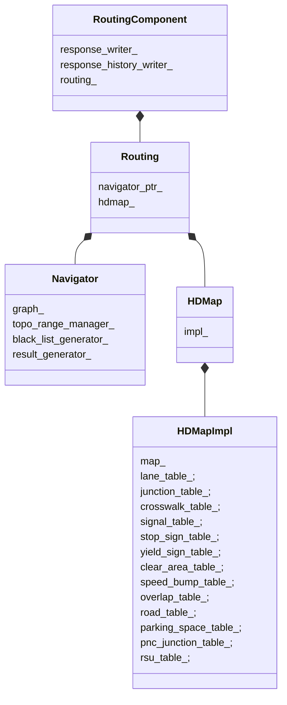
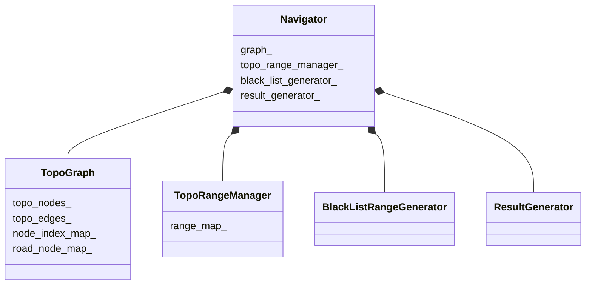

```mermaid
classDiagram

class RoutingComponent{
	response_writer_
  response_history_writer_
  routing_
}

RoutingComponent*--Routing
class Routing{
	navigator_ptr_
	hdmap_
}

Routing*--Navigator
class Navigator{
	graph_
	topo_range_manager_
	black_list_generator_
	result_generator_
}


Routing*--HDMap
class HDMap{
	impl_
}

HDMap*--HDMapImpl
class HDMapImpl {
	map_
  lane_table_;
  junction_table_;
  crosswalk_table_;
  signal_table_;
  stop_sign_table_;
  yield_sign_table_;
  clear_area_table_;
  speed_bump_table_;
  overlap_table_;
  road_table_;
  parking_space_table_;
  pnc_junction_table_;
  rsu_table_;

}
```

```mermaid
classDiagram

class Navigator{
	graph_
	topo_range_manager_
	black_list_generator_
	result_generator_
}

Navigator*--TopoGraph
class TopoGraph{
	topo_nodes_
	topo_edges_
	node_index_map_
	road_node_map_
}

Navigator*--TopoRangeManager
class TopoRangeManager{
	range_map_
}

Navigator*--BlackListRangeGenerator
class BlackListRangeGenerator{
	
}

Navigator*--ResultGenerator
class ResultGenerator{
	
}
```

