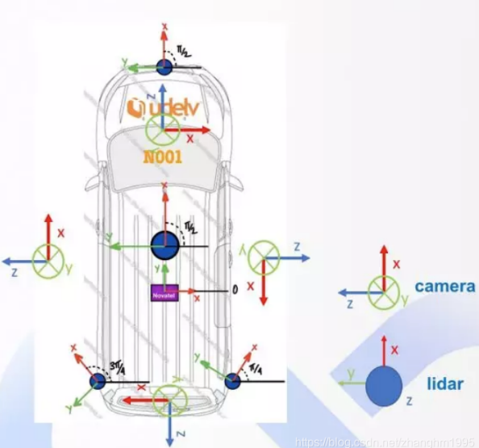
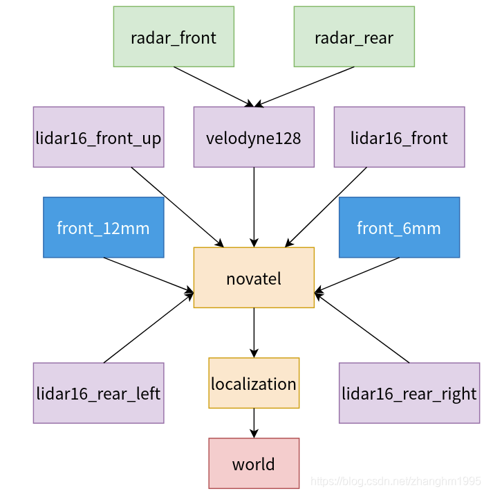

# Transform篇

对于一个自动驾驶系统来说，一般都会有激光雷达、毫米波雷达、超声波雷达、相机、IMU/GPS等各种传感器，而每个传感器都有自己的坐标系定义，为了描述自动驾驶车辆在地图中的位置，一般还涉及到全局定位，这就还会包含全局坐标系，也称为世界坐标系。这些错综复杂的坐标系定义，不仅涉及到了不同传感器之间的内外参标定关系，也包含了许多与坐标系转换之间的操作，需要我们重点掌握和理解。

由于来自不同传感器的数据都是带有坐标系，即数据的表示其实都是某个特定的坐标系的，不同传感器之间的外参标定等内容本博客暂时不说，本篇博客的主要目的是带大家整体理解和掌握Apollo中涉及到的各种坐标系定义和使用注意事项，这能帮我们在阅读Apollo源码特别是感知部分代码时快速理解各种坐标变换的含义和目的。

 

## 车辆传感器布局

首先我们整体来看一下Apollo官方提供的传感器布置图：




意区分其中相机坐标系和激光雷达坐标系的方向定义，其中**激光雷达坐标系X轴向前，Y轴向左，Z轴向上**，而**相机坐标系Z轴向前，X轴向右，Y轴向下**。另外在车的中间位置有一个紫色的传感器，上面写着**Novatel**，其实是诺瓦泰的GPS接收机，这个传感器的坐标系非常关键，因为Apollo中大部分传感器都是标定在该传感器坐标系下，**Novatel坐标系定义为X轴向右、Y轴向前、Z轴向上。**

modules/drivers/velodyne/params/velodyne128_novatel_extrinsics_example.yaml

```yaml
header:
  stamp:
    secs: 1422601952
    nsecs: 288805456
  seq: 0
  frame_id: novatel
transform:
  translation:
    x: -0.1941689746184177
    y: 1.438544324620427
    z: 0
  rotation:
    x: -0.00971305
    y: 0.00327669
    z: 0.7157
    w: 0.698332
child_frame_id: velodyne128
```

## 传感器外参标定关系

了解了Apollo自动驾驶车辆上整体的传感器布局后，接下来我们就来看下这些传感器所定义的坐标系以及他们的之间的转换关系，其实也就是标定结果中的**frame_id和child_frame_id**关系。

对于标定结果的描述，常用刚体变换中的旋转变换和平移变换来表示，其中涉及到child_frame_id表示该传感器数据所在的坐标系，frame_id则表示该标定结果描述了从child_frame_id到frame_id的变换关系。

下面的坐标系变换关系图中箭头起点表示child_frame_id、箭头所指的为frame_id。


 

从图中可以看出，**Apollo将激光雷达、相机都标定到了novatel坐标系下，将毫米波雷达坐标系标定到了velodyne128坐标系下**，将novatel坐标系标定到了localization坐标系下，最终通过localization模块发布了从localization到world坐标系的变换，即发布了车辆的全局位姿，这样这些坐标系变换关系就构成了一个变换树**（tf_tree）**，我们可以从这颗变换树中查询任意两个坐标系之间的变换关系，从而完成坐标转换工作。

## 具体实现细节

理解了传感器的布局以及Apollo中对这些传感器所完成的标定任务之后，下一个关键的问题就是Apollo中是如何管理和维护这些传感器外参的标定关系以及本车的全局位姿信息呢？又是如何在程序中实现方便查询这些变换关系，完成我们想要的坐标变换呢？

### 外参标定结果的管理与维护

我们知道对于不同传感器之间的外参变换关系来说，由于它们都是固连在自动驾驶车辆上而且在车辆运动过程中它们的相对位置并没有发生变化，所以它们的变换关系是固定不变的。对于拥有这种特征的变换关系，在ROS中我们可以发布tf_static话题，在Apollo中也借用了ROS的这种机制。


Apollo中使用**transform**模块完成对传感器外参标定结果的发布工作。`Component`组件类为`StaticTransformComponent`，配置参数为`modules/transform/conf/static_transform_conf.pb.txt`文件。 

为了方便分析，下面贴出`static_transform_conf.pb.txt`文件的内容：

```json
extrinsic_file {
    frame_id: "novatel"
    child_frame_id: "velodyne128"
    file_path: "/apollo/modules/drivers/velodyne/params/velodyne128_novatel_extrinsics.yaml"
    enable: true
}

extrinsic_file {
    frame_id: "localization"
    child_frame_id: "novatel"
    file_path: "/apollo/modules/localization/msf/params/novatel_localization_extrinsics.yaml"
    enable: true
}

extrinsic_file {
    frame_id: "velodyne128"
    child_frame_id: "front_6mm"
    file_path: "/apollo/modules/perception/data/params/front_6mm_extrinsics.yaml"
    enable: true
}

extrinsic_file {
    frame_id: "velodyne128"
    child_frame_id: "front_12mm"
    file_path: "/apollo/modules/perception/data/params/front_12mm_extrinsics.yaml"
    enable: true
}

extrinsic_file {
    frame_id: "novatel"
    child_frame_id: "lidar16_front_up"
    file_path: "/apollo/modules/drivers/velodyne/params/lidar16_front_up_novatel_extrinsics.yaml"
    enable: true
}

extrinsic_file {
    frame_id: "novatel"
    child_frame_id: "lidar16_front"
    file_path: "/apollo/modules/drivers/velodyne/params/lidar16_front_novatel_extrinsics.yaml"
    enable: true
}

extrinsic_file {
    frame_id: "novatel"
    child_frame_id: "lidar16_rear_left"
    file_path: "/apollo/modules/drivers/velodyne/params/lidar16_rear_left_novatel_extrinsics.yaml"
    enable: true
}

extrinsic_file {
    frame_id: "novatel"
    child_frame_id: "lidar16_rear_right"
    file_path: "/apollo/modules/drivers/velodyne/params/lidar16_rear_right_novatel_extrinsics.yaml"
    enable: true
}

extrinsic_file {
    frame_id: "velodyne128"
    child_frame_id: "radar_front"
    file_path: "/apollo/modules/perception/data/params/radar_front_extrinsics.yaml"
    enable: true
}

extrinsic_file {
    frame_id: "velodyne128"
    child_frame_id: "radar_rear"
    file_path: "/apollo/modules/perception/data/params/radar_rear_extrinsics.yaml"
    enable: true
}

```

从中可以看出该配置文件定义了StaticTransformComponent类需要发布的所有传感器外参标定关系，并指明了这些具体标定参数yaml文件所在路径。

在StaticTransformComponent类中依次对这些yaml文件进行解析，并发布所有这些静态变换，从而建立起了一棵变换树（tf_tree）

 


 ###  本车全局位姿的发布

除了transform模块中的StaticTransformComponent类发布所有传感器的外参变换关系外，还有一个很重要的变换关系需要发布，那就是本车的全局位姿变换关系，这也是定位模块localization主要的任务。

Apollo中通过localization模块中的LocalizationMsgPublisher类（modules/localization/msf/msf_localization_component.cc）完成本车全局位姿的发布工作，其实发布的是localization到world坐标系的变换关系。

发布函数LocalizationMsgPublisher::PublishPoseBroadcastTF定义：


```c++
void LocalizationMsgPublisher::PublishPoseBroadcastTF(
    const LocalizationEstimate& localization) {
  // broadcast tf message
  apollo::transform::TransformStamped tf2_msg;

  auto mutable_head = tf2_msg.mutable_header();
  mutable_head->set_timestamp_sec(localization.measurement_time());
  mutable_head->set_frame_id(broadcast_tf_frame_id_);
  tf2_msg.set_child_frame_id(broadcast_tf_child_frame_id_);

  auto mutable_translation = tf2_msg.mutable_transform()->mutable_translation();
  mutable_translation->set_x(localization.pose().position().x());
  mutable_translation->set_y(localization.pose().position().y());
  mutable_translation->set_z(localization.pose().position().z());

  auto mutable_rotation = tf2_msg.mutable_transform()->mutable_rotation();
  mutable_rotation->set_qx(localization.pose().orientation().qx());
  mutable_rotation->set_qy(localization.pose().orientation().qy());
  mutable_rotation->set_qz(localization.pose().orientation().qz());
  mutable_rotation->set_qw(localization.pose().orientation().qw());

  tf2_broadcaster_.SendTransform(tf2_msg);
}

```

其中`broadcast_tf_frame_id_`和`broadcast_tf_child_frame_id_`定义在`modules/localization/common/localization_gflags.cc`文件中：

```c++
DEFINE_string(broadcast_tf_frame_id, "world", "world frame id in tf");
DEFINE_string(broadcast_tf_child_frame_id, "localization",
              "localization frame id in tf");

```

### 坐标变换树的应用

此处以感知模块为例，在感知模块中定义了TransformWrapper类（modules/perception/onboard/transform_wrapper/transform_wrapper.h），用来查询不同坐标系之间的变换矩阵，从而完成坐标变换。

在`TransformWrapper`类中，主要是通过成员变量`Buffer* tf2_buffer_ = Buffer::Instance();`在`TransformWrapper::QueryTrans`函数中完成坐标的查询工作，而Buffer类定义在transform模块下的modules/transform/buffer.h文件中，该类继承自`tf2::BufferCore`，到这就可以大概清楚了，Apollo其实是借鉴了ROS中tf2的部分实现，来完成对坐标变换关系的缓存和查询工作的。

下面以radar感知来看下`TransformWrapper`类的具体应用：
`RadarDetectionComponent`类（modules/perception/onboard/component/radar_detection_component.h）中定义了如下成员变量：

 ```c++
TransformWrapper radar2world_trans_;
TransformWrapper radar2novatel_trans_;
 ```

分别用来查询`radar`到`world`坐标系之间的变换，以及`radar`到`novatel`坐标系之间的变换；

在`RadarDetectionComponent::Init`函数中初始化该类：

```c++
radar2world_trans_.Init(tf_child_frame_id_);
radar2novatel_trans_.Init(tf_child_frame_id_);
```

其中tf_child_frame_id_为radar_front或radar_rear，这就与上述的Apollo建立的外参标定关系图对应上了，最后我们在RadarDetectionComponent::InternalProc函数中调用TransformWrapper类的相关成员函数根据当前消息的时间戳进行坐标变换矩阵的获取。


```c++
Eigen::Affine3d radar_trans;
if (!radar2world_trans_.GetSensor2worldTrans(timestamp, &radar_trans)) {
    out_message->error_code_ = apollo::common::ErrorCode::PERCEPTION_ERROR_TF;
    AERROR << "Failed to get pose at time: " << timestamp;
    return true;
}
Eigen::Affine3d radar2novatel_trans;
if (!radar2novatel_trans_.GetTrans(timestamp, &radar2novatel_trans, "novatel",
                                    tf_child_frame_id_)) {
    out_message->error_code_ = apollo::common::ErrorCode::PERCEPTION_ERROR_TF;
    AERROR << "Failed to get radar2novatel trans at time: " << timestamp;
    return true;
}
```


## 参考文献

[Apollo 5.5 源码学习笔记（五） | transform模块 | Apollo中的坐标系统详解](https://blog.csdn.net/zhanghm1995/article/details/106151288)


