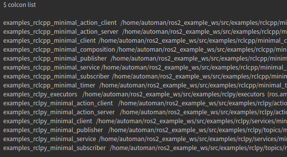
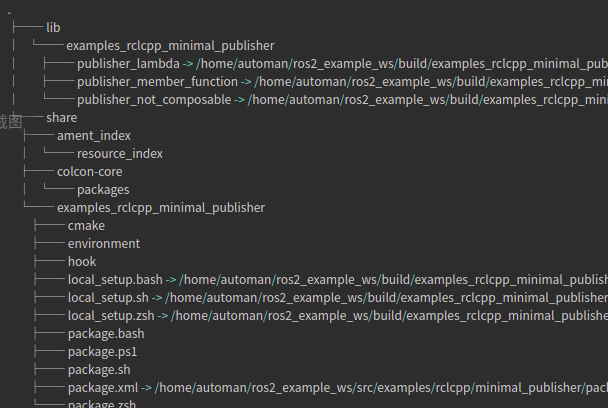
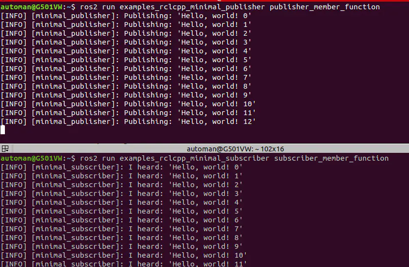

# 实用工具篇

## 构建工具

### ninja

Ninja 是一个构建系统，与 Make 类似。作为输入，你需要描述将源文件处理为目标文件这一过程所需的命令。 Ninja 使用这些命令保持目标处于最新状态。与其它一些构建系统不同，**Ninja 的主要设计目标是速度**（亲测很快）。ninja可以与cmake连用,只需要在cmake 命令中加入` -G "Ninja"`,在接下来的编译时,用`ninja`命令代替`make`

* 安装

```bash
 sudo apt install ninja-build
```

### cmake

[cmake使用](https://www.bilibili.com/video/BV16V411k7eF?from=search&seid=14755829595112057287&spm_id_from=333.337.0.0)


**protobuf,glog,gflags在cyber篇会用到, 在cyber的cmake版本中有这些第三方库的详细用法**

## protobuf安装及使用

> protocol buffers 是一种语言无关、平台无关、可扩展的序列化结构数据的方法，它可用于（数据）通信协议、数据存储等。
>
> Protocol Buffers 是一种灵活，高效，自动化机制的结构数据序列化方法－可类比 XML，但是比 XML 更小（3 ~ 10倍）、更快（20 ~ 100倍）、更为简单。
>
> 你可以定义数据的结构，然后使用特殊生成的源代码轻松的在各种数据流中使用各种语言进行编写和读取结构数据。你甚至可以更新数据结构，而不破坏由旧数据结构编译的已部署程序。

### protobuf安装

1. 安装脚本

**get_protobuf.sh** 

```bash
CXX_TAG=gcc
export CC=/usr/bin/gcc
export CXX=/usr/bin/g++

# CXX_TAG=c8
# export CC=/usr/bin/clang-8
# export CXX=/usr/bin/clang++-8

VERSION=v3.18.1 # 版本
BASENAME=protobuf-${VERSION}-${CXX_TAG}

RM_SOURCE="false" # 是否删除源码
RM_BUILD="true"  # 是否删除build文件夹
INSTALL="true"    # 是否编译及安装

SOURCE_DIR=${BASENAME}-source   # 源代码文件夹
BUILD_DIR=${BASENAME}-build    # build文件夹
INSTALL_DIR=${BASENAME}-install # 安装文件夹

if [ -d "${INSTALL_DIR}" ]; then
  echo "${BASENAME} already installed."
else
  rm -Rf ${BUILD_DIR} ${INSTALL_DIR}

  if [ -d ${SOURCE_DIR} ]; then
    echo "${SOURCE_DIR} already existence"
  else
    echo "============= Retrieving Protobu. ================"
    git clone --depth=1 -b ${VERSION} \
      https://github.com/google/protobuf.git ${SOURCE_DIR}
  fi

  if [ "${INSTALL}" == "true" ]; then
    echo "========== Building Google Protobuf with libstdc++. ========"
    mkdir -p ${BUILD_DIR}
    pushd ${BUILD_DIR} >/dev/null

    cmake -G "Ninja" \
      -DCMAKE_POSITION_INDEPENDENT_CODE=ON \
      -DCMAKE_BUILD_TYPE=Release \
      -Dprotobuf_BUILD_TESTS=OFF \
      -DCMAKE_CXX_FLAGS="-std=c++14" \
      -DCMAKE_INSTALL_PREFIX="../${INSTALL_DIR}" \
      ../${SOURCE_DIR}/cmake

    ninja
    ninja install

    popd >/dev/null

  fi

  if [ "${RM_BUILD}" == "true" ]; then
    rm -Rf ${BUILD_DIR}
  fi

  if [ "${RM_SOURCE}" == "true" ]; then
    rm -Rf ${SOURCE_DIR}
  fi

fi
```

2. 安装

```bash
bash get_protobuf.sh
```

```bash
➜  tools tree -L 1
.
├── get_protobuf.sh # 安装脚本
├── protobuf-v3.18.1-gcc-build # build文件夹
├── protobuf-v3.18.1-gcc-install # 安装目录
└── protobuf-v3.18.1-gcc-source # protobuf源码


➜  protobuf-v3.18.1-gcc-install tree -L 1 
.
├── bin # protoc编译工具
├── include # protobuf头文件
└── lib # protobuf库文件
```

### protobuf使用

1. protobuf基础使用

https://blog.csdn.net/qq_38966867/article/details/113344727

2. protobuf读写文件

使用protobuf读写文件可以很方便地**利用protobuf充当配置文件**，这个用法在apollo很常见, 函数`GetProtoFromASCIIFile`用以替代json充当配置文件

```c++
#include "google/protobuf/io/zero_copy_stream_impl.h"
#include "google/protobuf/text_format.h"
#include "log.hpp"
#include <fcntl.h>

namespace ecloud {
namespace common {

// 将proto对象序列化到文件中(ascii格式)
inline bool SetProtoToASCIIFile(const google::protobuf::Message &message,
                                int file_descriptor) {
  using google::protobuf::TextFormat;
  using google::protobuf::io::FileOutputStream;
  using google::protobuf::io::ZeroCopyOutputStream;
  if (file_descriptor < 0) {
    LOG_ERROR << "Invalid file descriptor.";
    return false;
  }
  ZeroCopyOutputStream *output = new FileOutputStream(file_descriptor);
  bool success = TextFormat::Print(message, output);
  delete output;
  close(file_descriptor);
  return success;
}

// 将proto对象序列化到文件中(ascii格式)
inline bool SetProtoToASCIIFile(const google::protobuf::Message &message,
                                const std::string &file_name) {
  int fd = open(file_name.c_str(), O_WRONLY | O_CREAT | O_TRUNC, S_IRWXU);
  if (fd < 0) {
    LOG_ERROR << "Unable to open file " << file_name << " to write.";
    return false;
  }
  return SetProtoToASCIIFile(message, fd);
}

// 从文件中读取内容填充proto对象, 这个用法可以替代json充当配置文件
inline bool GetProtoFromASCIIFile(const std::string &file_name,
                                  google::protobuf::Message *message) {
  using google::protobuf::TextFormat;
  using google::protobuf::io::FileInputStream;
  using google::protobuf::io::ZeroCopyInputStream;
  int file_descriptor = open(file_name.c_str(), O_RDONLY);
  if (file_descriptor < 0) {
    LOG_ERROR << "Failed to open file " << file_name << " in text mode.";
    return false;
  }

  ZeroCopyInputStream *input = new FileInputStream(file_descriptor);
  bool success = TextFormat::Parse(input, message);
  if (!success) {
    LOG_ERROR << "Failed to parse file " << file_name << " as text proto.";
  }
  delete input;
  close(file_descriptor);
  return success;
}

} // namespace common
} // namespace ecloud
```


## glog安装及使用

### glog安装

**get_glog.sh**

```bash
CXX_TAG=gcc
export CC=/usr/bin/gcc
export CXX=/usr/bin/g++

# CXX_TAG=c8
# export CC=/usr/bin/clang-8
# export CXX=/usr/bin/clang++-8

VERSION=v0.3.5 # 版本
BASENAME=glog-${VERSION}-${CXX_TAG}

RM_SOURCE="false" # 是否删除源码
RM_BUILD="true"  # 是否删除build文件夹
INSTALL="true"    # 是否编译及安装

SOURCE_DIR=${BASENAME}-source   # 源代码文件夹
BUILD_DIR=${BASENAME}-build     # build文件夹
INSTALL_DIR=${BASENAME}-install # 安装文件夹

if [ -d "${INSTALL_DIR}" ]; then
  echo "${BASENAME} already installed."
else
  rm -Rf ${BUILD_DIR} ${INSTALL_DIR}

  if [ -d ${SOURCE_DIR} ]; then
    echo "${SOURCE_DIR} already existence"
  else
    echo "============= Retrieving Glog. ================"
    git clone --depth=1 -b ${VERSION} \
        https://github.com/google/glog.git ${SOURCE_DIR}
  fi

  if [ "${INSTALL}" == "true" ]; then
    echo "========== Building Google Glog with libstdc++. ========"
    mkdir -p ${BUILD_DIR}
    pushd ${BUILD_DIR} >/dev/null

    cmake -G "Ninja" \
      -DGFLAGS_NAMESPACE=google \
      -DBUILD_SHARED_LIBS=ON \
      -DCMAKE_CXX_FLAGS="-fPIC -std=c++14" \
      -DCMAKE_INSTALL_PREFIX="../${INSTALL_DIR}" \
      ../${SOURCE_DIR}

    ninja
    ninja install

    popd >/dev/null

  fi

  if [ "${RM_BUILD}" == "true" ]; then
    rm -Rf ${BUILD_DIR}
  fi

  if [ "${RM_SOURCE}" == "true" ]; then
    rm -Rf ${SOURCE_DIR}
  fi

fi
```

### glog使用

1. [glog使用](https://blog.csdn.net/qq_38966867/article/details/113386941)

2. 调试模式

> [google glog调试模式](https://blog.csdn.net/dyzhen/article/details/103185790)
>
> [Glog剖析之DLOG](https://blog.csdn.net/zx_cplusplus/article/details/21476793#comments)
>
> 参考一些网上资料，了解到glog通过NDEBUG宏控制是否打开调试模式，如果在编译时定义了该宏，则关闭了调试模式，相应的DLOG()等函数就不输出内容了，因为宏是在编译时展开的，所以按道理应该是在编译glog库的时候定义或不定义该宏。但实际上，通过查看Makefile，glog默认是定义了该宏的，即关闭了调试模式，可是在应用程序中调用DLOG()依然输出日志了。后来发现，是需要在应用程序编译的时候定义该宏，即CXXFLAGS += -DNDEBUG，这样就可以了。
>
> 有了该方法，平时调试就方便了，调试类的日志可以用DLOG记，编译应用程序时，发布release版的时候加上CXXFLAGS += -DNDEBUG，平时这些日志就不会输出，需要调试的时候再去掉该宏，从而发布debug版，这些日志就输出了。而glog本身无需编译两个版本。

 

## gflags安装及使用

### gflags安装

**get_gflasg.sh**

```bash
CXX_TAG=gcc
export CC=/usr/bin/gcc
export CXX=/usr/bin/g++

# CXX_TAG=c8
# export CC=/usr/bin/clang-8
# export CXX=/usr/bin/clang++-8

VERSION=v2.2.0
BASENAME=gflags-${VERSION}-${CXX_TAG}

RM_SOURCE="false" # 是否删除源码
RM_BUILD="true"   # 是否删除build文件夹
INSTALL="true"    # 是否编译及安装

SOURCE_DIR=${BASENAME}-source   # 源代码文件夹
BUILD_DIR=${BASENAME}-build     # build文件夹
INSTALL_DIR=${BASENAME}-install # 安装文件夹

if [ -d "${INSTALL_DIR}" ]; then
  echo "${BASENAME} already installed."
else
  rm -Rf ${BUILD_DIR} ${INSTALL_DIR}

  if [ -d ${SOURCE_DIR} ]; then
    echo "${SOURCE_DIR} already existence"
  else
    echo "============= Retrieving gflags. ================"
    git clone --depth=1 -b ${VERSION} \
      https://github.com/gflags/gflags.git ${SOURCE_DIR}
  fi

  if [ "${INSTALL}" == "true" ]; then
    echo "========== Building Google gflags with libstdc++. ========"
    mkdir -p ${BUILD_DIR}
    pushd ${BUILD_DIR} >/dev/null

    cmake -G "Ninja" \
      -DBUILD_SHARED_LIBS=ON \
      -DBUILD_STATIC_LIBS=ON \
      -DINSTALL_HEADERS=ON \
      -DINSTALL_SHARED_LIBS=ON \
      -DINSTALL_STATIC_LIBS=ON \
      -DCMAKE_CXX_FLAGS="-std=c++14" \
      -DCMAKE_INSTALL_PREFIX="../${INSTALL_DIR}" \
      ../${SOURCE_DIR}

    ninja
    ninja install

    popd >/dev/null

  fi

  if [ "${RM_BUILD}" == "true" ]; then
    rm -Rf ${BUILD_DIR}
  fi

  if [ "${RM_SOURCE}" == "true" ]; then
    rm -Rf ${SOURCE_DIR}
  fi

fi

```


### gflags使用

[gflags中的 --flagfile= 用法](https://blog.csdn.net/u011754972/article/details/118387767?ops_request_misc=%257B%2522request%255Fid%2522%253A%2522164093328716780357250635%2522%252C%2522scm%2522%253A%252220140713.130102334.pc%255Fall.%2522%257D&request_id=164093328716780357250635&biz_id=0&utm_medium=distribute.pc_search_result.none-task-blog-2~all~first_rank_ecpm_v1~rank_v31_ecpm-1-118387767.pc_search_insert_es_download&utm_term=gflags+%E9%85%8D%E7%BD%AE%E6%96%87%E4%BB%B6&spm=1018.2226.3001.4187)

如果要把代码中的变量做成可通过配置文件进行配置的，可以使用`gflag`来实现。
如，想要通过代码运行
`FLAGS_apple_nums`可以这样定义：

```c++
DECLARE_int32(apple_nums); //定义在 .h文件
---------------------------------------------------------
DEFINE_int32(apple_nums, 0, "num of apple"); //定义在 .cc文件

```

对于gflags中的--flagfile用法，不管二进制节点后面接几个--flagfile=的配置文件,他们之间的关系是衔接的。但是对于几个文件中都有的flag， 哪个--flagfile=文件在后面，哪个变量就是最终代码使用的值。
如：

```shell
./app_node --flagfile=app_1.conf --flagfile=app_2.conf 
```

在app_1.conf中有一句--system_version=1.0.0.0；
在app_2.conf文件中有一句--system_version=2.0.0.0；
那么由于--flagfile=app_2.conf写在后面，所以代码最终FLAGS_system_version使用的值是2.0.0.0

## boost 安装及使用

### boost 安装

1. 安装脚本

**get_boost.sh**

```bash
CXX_TAG=gcc

BUILD_CONCURRENCY=$(nproc --all) # 指定编译使用的线程数量
BOOST_TOOLSET="gcc"
BOOST_CFLAGS="-fPIC -std=c++14 -DBOOST_ERROR_CODE_HEADER_ONLY"

VERSION=1.72.0
BASENAME="boost-${VERSION}-${CXX_TAG}"

RM_SOURCE="false" # 是否删除源码
INSTALL="true"    # 是否编译及安装

SOURCE_DIR=${BASENAME}-source   # 源代码文件夹
INSTALL_DIR=${BASENAME}-install # 安装文件夹

if [ "${INSTALL}" == "true" ]; then

  BOOST_PACKAGE_BASENAME=boost_${VERSION//./_} 
  echo ${BOOST_PACKAGE_BASENAME}.tar.gz

  if [ -f ${BOOST_PACKAGE_BASENAME}.tar.gz ]; then
    echo "${BOOST_PACKAGE_BASENAME}.tar.gz already existence"
  else
    echo "Retrieving boost."
    wget "https://boostorg.jfrog.io/artifactory/main/release/${VERSION}/source/${BOOST_PACKAGE_BASENAME}.tar.gz" || true

  fi

  rm -Rf ${SOURCE_DIR} 
  tar -xvzf ${BOOST_PACKAGE_BASENAME}.tar.gz
  mv ${BOOST_PACKAGE_BASENAME} ${SOURCE_DIR}

  pushd ${SOURCE_DIR} >/dev/null

  bash bootstrap.sh \
    --with-toolset=${BOOST_TOOLSET} \
    --prefix=../${INSTALL_DIR} \
    --with-libraries=python,filesystem,system,program_options

  ./b2 toolset="${BOOST_TOOLSET}" cxxflags="${BOOST_CFLAGS}" \
    --prefix="../${INSTALL_DIR}" -j "${BUILD_CONCURRENCY}" install

  popd >/dev/null

  if [ "${RM_SOURCE}" == "true" ]; then
    rm ${BOOST_PACKAGE_BASENAME}.tar.gz
  fi

fi
```

2. 安装

```bash
bash get_boost.sh  
```

```bash
.
├── boost-1.72.0-gcc-install # 安装目录
├── boost-1.72.0-gcc-source  # 源码
├── boost_1_72_0.tar.gz   # 源码
└── get_boost.sh
```

```bash
➜  boost-1.72.0-gcc-install tree -L 1
.
├── include
└── lib
```


### boost 使用

[Boost C++ 库 使用](https://www.bookstack.cn/read/boost/ch0.md)

## poco安装及使用

POCO库是强大的的跨平台C++库，可以用来编写多平台的网络应用程序，这些平台包括桌面端、服务端、移动端、IOT(物联网)、嵌入式系统等。总的来说是一个非常强大的综合性库。**Cyber使用了Poco的SharedLibrary 模块，实现了类加载功能(在Cyber篇会介绍)**

### poco安装

**get_poco.sh**

```bash
CXX_TAG=gcc
export CC=/usr/bin/gcc
export CXX=/usr/bin/g++

# CXX_TAG=c8
# export CC=/usr/bin/clang-8
# export CXX=/usr/bin/clang++-8

VERSION=poco-1.11.1-release # 版本
BASENAME=poco-${VERSION}-${CXX_TAG}
echo $BASENAME

RM_SOURCE="false" # 是否删除源码
RM_BUILD="true"   # 是否删除build文件夹
INSTALL="true"    # 是否编译及安装

SOURCE_DIR=${BASENAME}-source   # 源代码文件夹
BUILD_DIR=${BASENAME}-build     # build文件夹
INSTALL_DIR=${BASENAME}-install # 安装文件夹

if [ -d "${INSTALL_DIR}" ]; then
  echo "${BASENAME} already installed."
else
  rm -Rf ${BUILD_DIR} ${INSTALL_DIR}

  if [ -d ${SOURCE_DIR} ]; then
    echo "${SOURCE_DIR} already existence"
  else
    echo "=====================Retrieving POCO.========================"
    git clone --depth=1 -b ${VERSION} \
         https://github.com/pocoproject/poco.git ${SOURCE_DIR}
  fi

  if [ "${INSTALL}" == "true" ]; then
    echo "========== Building POCO with libstdc++. ========"
    mkdir -p ${BUILD_DIR}
    pushd ${BUILD_DIR} >/dev/null

    cmake -G "Ninja" \
      -DCMAKE_CXX_FLAGS="-std=c++14" \
      -DCMAKE_INSTALL_PREFIX="../${INSTALL_DIR}" \
      ../${SOURCE_DIR}

    ninja
    ninja install

    popd >/dev/null

  fi

  if [ "${RM_BUILD}" == "true" ]; then
    rm -Rf ${BUILD_DIR}
  fi

  if [ "${RM_SOURCE}" == "true" ]; then
    rm -Rf ${SOURCE_DIR}
  fi

f
```

### poco使用

[SharedLibrary 模块使用](https://blog.csdn.net/qq_38966867/article/details/120128133)


## ros安装及使

### ros安装

在ubuntu18.04上安装ros

1. 安装准备

```bash
sudo apt-get update
sudo apt-get upgrade
```

2. 添加ROS的镜像源

```bash
sudo sh -c '. /etc/lsb-release && echo "deb http://mirrors.ustc.edu.cn/ros/ubuntu/ `lsb_release -cs` main" > /etc/apt/sources.list.d/ros-latest.list'
```

3. 配置密钥

```bash
sudo apt-key adv --keyserver 'hkp://keyserver.ubuntu.com:80' --recv-key C1CF6E31E6BADE8868B172B4F42ED6FBAB17C654
```

> 备选地址
> hkp://pgp.mit.edu:80
> hkp://keyserver.ubuntu.com:80 

4. 更新源

```c++
sudo apt-get update
```

5. 安装melodic

```bash
sudo apt install ros-melodic-desktop-full
```

> 库文件安装在 /opt/ros/melodic

6. ROS初始化

```bash
echo "source /opt/ros/melodic/setup.bash" >> ~/.bashrc
source ~/.bashrc
```

7. 安装工具依赖

```bash
sudo apt install python-rosdep python-rosinstall python-rosinstall-generator python-wstool build-essential
```

8. 初始化rosdep

```bash
sudo rosdep init
rosdep update
```

9. 启动ROS

```bash
roscore
```

### ros2 安装

选择的平台：

- Ubuntu 18.04
- ROS 2 (Dashing 版本)

**步骤：**

1. 设置环境变量 LC_ALL 和 LANG (我尝试了一下，不设置这两个变量也行)

```bash
sudo locale-gen en_US en_US.UTF-8

sudo update-locale LC_ALL=en_US.UTF-8 LANG=en_US.UTF-8

export LANG=en_US.UTF-8
```

2. 添加 ROS 2 的 repo 以及对应的 key

```bash
sudo apt update

sudo apt install curl gnupg2 lsb-release

curl -s https://raw.githubusercontent.com/ros/rosdistro/master/ros.asc | sudo apt-key add -

sudo sh -c 'echo "deb [arch=amd64,arm64] http://packages.ros.org/ros2/ubuntu `lsb_release -cs` main" > /etc/apt/sources.list.d/ros2-latest.list'
```

3. 安装 ROS 2

```bash
sudo apt update

sudo apt install ros-dashing-desktop
```

4. 添加命令自动补全功能，即在命令行中用 TAB 键可以自动补全 ROS 2 的命令。

```bash
sudo apt install python3-argcomplete
```

5. 添加环境变量。这样每次打开 Terminal 就可以自动加载 ROS 2 相关的环境变量，进而使用 ROS 2 相关的命令

```bash
echo "source /opt/ros/dashing/setup.bash" >> ~/.bashrc
```

如果使用的是zsh，可以写成

```bash
echo "source /opt/ros/dashing/setup.zsh" >> ~/.bashrc
```

6. 如果涉及到 ROS 节点与 ROS 2 节点通讯，还要安装 ros1_bridge

```bash
sudo apt install ros-dashing-ros1-bridge
```

**colcon 编译工具:**

> 跟 ROS 相同，ROS 2 也是建议创建一个工作空间 workspace，方便管理同一个项目的  packages，而且也是将 package 源文件都放在 src 文件夹中。这里我们用 [ROS 2 tutorial](https://links.jianshu.com/go?to=https%3A%2F%2Findex.ros.org%2Fdoc%2Fros2%2FTutorials%2FColcon-Tutorial%2F) 中的例子，创建工作空间 ros2_example_ws 并进入 src

```bash
mkdir -p ~/ros2_example_ws/src   

cd ~/ros2_example_ws/src
```

现在我们先关注 colcon 的编译过程，所以 package 源文件就先借用官网的。

```bash
git clone https://github.com/ros2/examples 

git checkout $ROS_DISTRO     # 切换到与本机版本对应的 branch 上
```

目前文件路径结构如下：

```bash
$ tree -L 3
.
└── src
    └── examples
        ├── CONTRIBUTING.md
        ├── LICENSE
        ├── rclcpp
        ├── rclpy
        └── README.md

4 directories, 3 files
```

可以用 `colcon list` 命令列出 src 文件夹中的所有 packages，即所有包含 `package.xml` 和 `setup.py`/`CMakeLists.txt` 的文件夹。



 用 colcon 编译下载的 package

```bash
colcon build --symlink-install
```

上边命令中 `--symlink-install` 表示编译时如果 install 中文件已经存在于  src 或者 build 文件夹中，就用超链接指向该文件，避免浪费空间，也可以实现同步更新。
 例如，在 install 文件夹的 examples_rclcpp_minimal_publisher 中有如下超链接：



如果去掉 `--symlink-install` 参数，仅用命令 `colcon build` 来编译，则上述超链接文件全都变成实体拷贝的文件，得到如下结果： 

```bash
.
├── lib
│   └── examples_rclcpp_minimal_publisher
│       ├── publisher_lambda
│       ├── publisher_member_function
│       └── publisher_not_composable
└── share
    ├── ament_index
    │   └── resource_index
    ├── colcon-core
    │   └── packages
    └── examples_rclcpp_minimal_publisher
        ├── cmake
        ├── environment
        ├── hook
        ├── local_setup.bash
        ├── local_setup.sh
        ├── local_setup.zsh
        ├── package.bash
        ├── package.ps1
        ├── package.sh
        ├── package.xml
        └── package.zsh
```

编译之后，得到的文档结构如下:

```bash
.
├── build
├── install
├── log
└── src
```

编译之后还可以测试一下 packages

```bash
$ colcon test-result --all

build/examples_rclpy_executors/pytest.xml: 3 tests, 0 errors, 0 failures, 0 skipped
build/examples_rclpy_minimal_action_client/pytest.xml: 0 tests, 0 errors, 0 failures, 0 skipped
build/examples_rclpy_minimal_action_server/pytest.xml: 0 tests, 0 errors, 0 failures, 0 skipped
build/examples_rclpy_minimal_client/pytest.xml: 3 tests, 0 errors, 0 failures, 0 skipped
build/examples_rclpy_minimal_publisher/pytest.xml: 3 tests, 0 errors, 0 failures, 0 skipped
build/examples_rclpy_minimal_service/pytest.xml: 3 tests, 0 errors, 0 failures, 0 skipped
build/examples_rclpy_minimal_subscriber/pytest.xml: 3 tests, 0 errors, 0 failures, 0 skipped

Summary: 15 tests, 0 errors, 0 failures, 0 skipped
```

如果要单独编译某一个 package，可以用如下命令：

```bash
colcon build --packages-select  PACKAGE_NAME
```

如果不希望编译某一个 package，可以在该 package中创建名为 `COLCON_IGNORE` 的空文件，colcon 就会忽略掉该 package，不但不编译，连 `colcon list` 都不显示，这个 package 对 colcon 就是透明的。

完成编译之后，要 source 一下 setup.bash 文件，确保系统能够找到当前编译生成的可执行文件和库

```bash
source install/setup.bash
```

 或者将 source 命令放入 .bashrc 文件，这样每次打开 terminal 就可以自动加载路径信息

```bash
echo "source ~/ros2_example_ws/install/setup.bash" >> ~/.bashrc
```

实例测试：
首先启动一个 publisher

```bash
ros2 run examples_rclcpp_minimal_publisher publisher_member_function
```

再启动一个 subscriber

```bash
 ros2 run examples_rclcpp_minimal_subscriber subscriber_member_function 
```

如果一切顺利，应该会有如下的界面：



**terminal 命令:**

ROS 2 根据命令的作用对象划分成多个类别，其中常用的几个类别：

```bash
Commands:
  launch     Run a launch file
  node       Various node related sub-commands
  param      Various param related sub-commands
  pkg        Various package related sub-commands
  run        Run a package specific executable
  service    Various service related sub-commands
  srv        Various srv related sub-commands
  topic      Various topic related sub-commands
```

在调用时都是采用如下命令格式：

```bash
ros2 COMMAND ...
```

我们可以对比 ROS 和 ROS 2 中的几个命令，应该很容易找到其中的规律

- 运行 ROS node
  \-  ROS： `rosrun <package> <executive>`
  \- ROS 2：`ros2 run <package> <executive>`
- 查看当前运行的 node
  \-  ROS ：  `rosnode list`
  \- ROS 2： `ros2 node list`

### ros使用

[古月·ROS入门21讲](https://www.bilibili.com/video/BV1zt411G7Vn?from=search&seid=11195565935207931281&spm_id_from=333.337.0.0)


## 参考文献

[ROS 2 基本命令总结](https://www.jianshu.com/p/29cca79d343c)