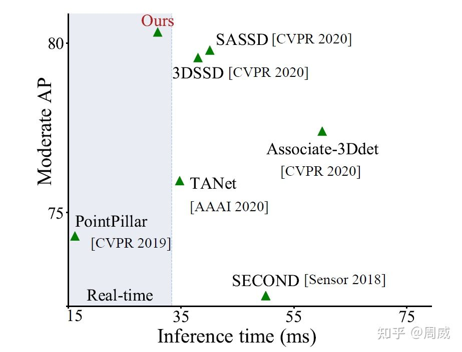
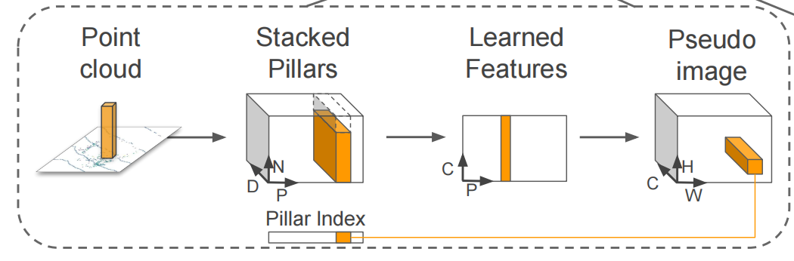
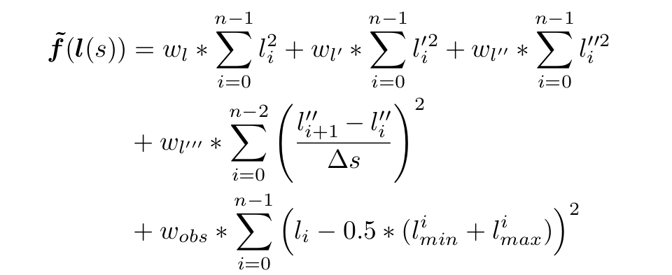
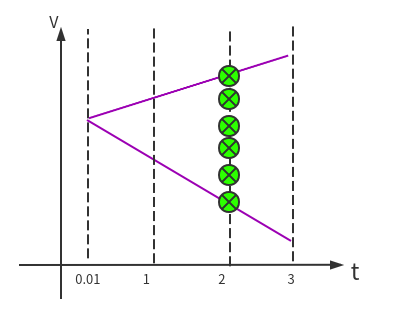

# 简介


该项目**基于百度Apollo**对自动驾驶各个模块分别介绍: 

**坐标转换，感知，预测，高精地图及导航，决策规划，运动控制，车辆动力学**

该项目的大多数资料来源于Apollo。大部分内容是对[**Apollo-v6.0.0**](https://github.com/ApolloAuto/apollo/releases/tag/v6.0.0)各模块及 **Cyber框架** 的解析和注释，属于源码阅读笔记。

---

**作者邮箱：hanhy20@mai ls.jlu.edu.cn** **欢迎交流**。

项目地址 https://github.com/HaiYangLib/ApolloAnnotation

* 在代码上传时，某些大文件(**主要是某些模型文件**)没有上传,下面给出了这些文件的详细路径，如果有需要的，可以去Apollo的github上下载，对应版本**[apollo-v6.0.0](https://github.com/ApolloAuto/apollo/releases/tag/v6.0.0)**


```c
*.caffemodel
*.model
*.caffemodel.metadata
*.onnx

modules/planning/data/model/*.pt

modules/perception/production/data/perception/camera/models/lane_detector/darkSCNN/params
modules/perception/production/data/perception/camera/models/lane_detector/darkSCNN/params
modules/perception/production/data/perception/camera/models/yolo_obstacle_detector/3d-r4-half/params
modules/perception/production/data/perception/camera/models/yolo_obstacle_detector/3d-yolo/params
modules/perception/production/data/perception/camera/models/lane_detector/darkSCNN/params
```

**模块关系**


**橙色的部分是正在做的工作。**与注释相关的文档，全部保存在**doc文件夹**中。


各个模块订阅及发布的Topic

**Routing模块订阅的话题:**

| 成员变量 | 话题名称                  | 消息类型       |
| -------- | ------------------------- | -------------- |
| 配置Proc | "/apollo/routing_request" | RoutingRequest |

**Routing模块发布的话题:**

| 成员变量                 | 话题名称                           | 消息类型        |
| ------------------------ | ---------------------------------- | --------------- |
| response_writer_         | "/apollo/routing_response"         | RoutingResponse |
| response_history_writer_ | "/apollo/routing_response_history" | RoutingResponse |

**Planning模块订阅的话题:**

| 成员变量              | 话题名称                           | 消息类型              |
| --------------------- | ---------------------------------- | --------------------- |
| 配置Proc              | "/apollo/prediction"               | PredictionObstacles   |
| 配置Proc              | "/apollo/canbus/chassis"           | Chassis               |
| 配置Proc              | "/apollo/localization/pose"        | LocalizationEstimate  |
| routing_reader_       | "/apollo/routing_response"         | RoutingResponse       |
| traffic_light_reader_ | "/apollo/perception/traffic_light" | TrafficLightDetection |
| pad_msg_reader_       | "/apollo/planning/pad"             | PadMessage            |
| story_telling_reader_ | "/apollo/storytelling"             | Stories               |

**Planning模块发布的话题:**

| 成员变量                       | 话题名称                         | 消息类型             |
| ------------------------------ | -------------------------------- | -------------------- |
| planning_writer_               | "/apollo/planning"               | ADCTrajectory        |
| rerouting_writer_              | "/apollo/routing_request"        | RoutingRequest       |
| planning_learning_data_writer_ | "/apollo/planning/learning_data" | PlanningLearningData |

[实用工具篇概要](#实用工具篇)

介绍Cpp常用的一些开源库,如**protobuf glog gflags poco boost ros** 等, 主要涉及他们的安装及基础使用，更加具体的使用在Cyber篇的cyber_cmake源码中会体现。

这些第三方库很多在apollo中会用到, 属于比较常用的实用工具。

[Cyber篇概要](#Cyber篇)

完成了**Cyber的cmake版移植**，详细代码见**cyber_cmake**

提供了Cyber所需的第三方库的安装脚本,在thritd_party目录下

[Transform篇](#Transform篇)

[感知篇概要](#感知篇)

针对**感知模块(Perception)**,   [ApolloAnnotation](https://github.com/HaiYangLib/ApolloAnnotation)做了以下工作：

* **Radar子模块**的注释工作主要涉及：Radar**数据预处理**，**IDMatch**和**匈牙利匹配**算法的讲解
* **Liadr子模块**的注释工作主要涉及：Lidar**数据预处理**，**Pointpillars算法**实现过程的分析与代码注释
* **Camera子模块**的注释工作暂时未做

[预测篇概要](#感知篇)

[导航篇概要](#导航篇) 

导航篇包含两个模块：Map和Routing

介绍了**Apollo Map模块**,主要包含**高精地图类对高精地图的封装**，**拓扑地图类对拓扑地图的封装**，**基于高精地图创建拓扑地图**。

介绍了**Apollo Routing模块**，主要包含Routing模块的具体实现，**拓扑子图的生成**和**基于拓扑子图A*搜索**，**组装搜索结果并整合成RoutingResponse**。

介绍了PncMap和ReferenceLineProvider，其中后者依赖前者, ReferenceLineProvider小节分析了**参考线生成及平滑**

[规划篇概要](#规划篇)

针对**规划模块(Planning)**,   [ApolloAnnotation](https://github.com/HaiYangLib/ApolloAnnotation)做了以下工作：

* 对**Frenet坐标系**做了推导

推到了**笛卡尔坐标系和Frenet坐标系**之间的转换关系

* 对**Lattice Planner**做了介绍

详细介绍了LatticPlanner的原理以及实现过程,其中包括**计算障碍物的S-T图**，**巡航模式下纵向4次多项式轨迹生成**,**存在障碍物停或止点时纵向5次多项式轨迹生成**，**基于二次规划的横向轨迹生成**。还介绍了对每组横纵向**轨迹代价**的计算。

* 对**OpenSpacePlanner**做了介绍

介绍了**OpenSpaceROI区域的生成**，**混合A***，**ReedShepp轨迹生成**

* 对Scenario的执行流程做了介绍

介绍了**Scenario的切换原理**，**Scenario--->Stage--->Task的执行流程**

[汽车动力学篇概要](#汽车动力学篇)

主要讲解了**Frenet坐标系**，车辆**运动学模型**，**动力学模型**， **PID，LQR, MPC**控制方法

[控制篇概要](#控制篇)

介绍了纵向控制,主要涉及**纵向串级PID**，**横向LQR**, **横纵向MPC**

[传感器篇概要](#传感器篇)

[仿真及V2X篇概要](#仿真及V2X篇)

 


向一些愿意分享自动驾驶经验的博主表示感谢：

* **Apollo系列经验**  知乎博主  [王方浩 无人驾驶](https://www.zhihu.com/column/self-driving) 
* **Lattice Planner** B站UP主 [读书思过](https://space.bilibili.com/325034144)
* **路径规划与轨迹跟踪** B站UP主 [小黎的Ally](https://space.bilibili.com/477041559)
* **LQR控制** B站UP主 [忠厚老实的老王](https://space.bilibili.com/287989852?from=search&seid=125495911078972296&spm_id_from=333.337.0.0)
* **官方系列文档** [Apollo开放平台文档](https://apollo.auto/Apollo-Homepage-Document/Apollo_Doc_CN_6_0/)
* **Apollo 3.0阅读笔记**  Github [YannZyl](https://github.com/YannZyl)
* **Apollo开发者中心** [网址](https://developer.apollo.auto/developer/index_cn.html#/)


# [实用工具篇](utilities/实用工具篇.md)

**详细内容存放于doc/utilities文件夹中**

# [CyberRT篇](cyber/Cyber篇.md)

**详细内容存放于doc/cyber文件夹中** 


 

# [Transform篇](transform/Transform篇.md)

**详细内容存放于doc/transform文件夹中**

# 感知篇

## 感知模块简介

### 数据元素

**PerceptionObstacle**

`modules\perception\proto\perception_obstacle.proto`

| 成员变量                                            | 说明                                                         |
| --------------------------------------------------- | ------------------------------------------------------------ |
| `optional int32 id = 1;`                            | 障碍物id                                                     |
| `optional apollo.common.Point3D position = 2;`      | 障碍物在世界坐标系中的位置                                   |
| `optional double theta = 3;`                        | 世界坐标系中的航向                                           |
| `optional apollo.common.Point3D velocity = 4;`      | 障碍物速度                                                   |
| `optional double height = 7;`                       | 障碍物高度。                                                 |
| `optional double length = 5;`                       | 障碍物长度。                                                 |
| `optional double width = 6;`                        | 障碍物宽度。                                                 |
| `repeated apollo.common.Point3D polygon_point = 8;` | 障碍物形状角点。                                             |
| `optional double tracking_time = 9;`                | 检测到障碍物后的持续时间。                                   |
| `optional Type type = 10;`                          | UNKNOWN，UNKNOWN_MOVABLE，UNKNOWN_UNMOVABLE，<br/> PEDESTRIAN，BICYCLE，VEHICLE |
| `optional double timestamp = 11;`                   | GPS time in seconds.                                         |


## 视觉感知


感知模块的主要作用是接受传感器的输入，通过该模块中检测->跟踪->融合算法的处理，输出最终的感知结果给下游。

## 激光雷达感知

 **因为激光雷达传感器具备准确的障碍物定位能力等优点，Apollo 目前采取以其为主的自动驾驶感知方案。**

激光雷达感知模块接受来自激光雷达驱动的点云信息，利用这些点云信息进行障碍物的检测以及跟踪，得到的结果会被输出到感知融合模块进行下一步处理。

激光雷达感知模块接受来自激光雷达驱动的点云信息，利用这些点云信息进行障碍物的检测以及跟踪，得到的结果会被输出到感知融合模块进行下一步处理。


激光雷达感知模块接收到点云数据之后，通过高精度地图 ROI（The Region of Interest）过滤器过滤 ROI 之外的点云，去除背景对象，例如：路边建筑物、树木等，过滤后的点云数据通过障碍物检测深度学习模型进行 3D 障碍物的检测和分类，然后对得到的障碍物进行跟踪，最终得到障碍物的形状、位置、类别、速度等信息。


* 激光雷达感知模块的输入输出

**输入**

| 话题名称                                              | 数据类型                       | 说明                                    |
| ----------------------------------------------------- | :----------------------------- | :-------------------------------------- |
| /apollo/sensor/lidar128/compensator/PointCloud2       | drivers/proto/pointcloud.proto | 128 线激光雷达运动补偿之后的点云输入    |
| /apollo/sensor/lidar16/fusion/compensator/PointCloud2 | drivers/proto/pointcloud.proto | 16 线激光雷达融合运动补偿之后的点云输入 |


**输出**

| 话题名称                          | 数据类型          | 说明                                   |
| --------------------------------- | ----------------- | -------------------------------------- |
| /perception/inner/PrefusedObjects | LidarFrameMessage | 激光雷达输出给融合感知模块的障碍物信息 |


* 激光雷达感知流程


`DetectionComponent`是激光雷达感知的入口, 主要是对话题进行订阅和发布。


### DetectionComponent

`DetectionComponent` 是整个激光雷达感知的入口,无论是128线还是16线都使用相同的模型`pointpillar` 通过配置文件订阅不同的话题。

模块入口配置文件`modules\perception\production\dag\dag_streaming_perception.dag`

可以看到其中包含`Velodyne128Detection`和`Velodyne16Detection` 分别对应不同channel:`channel: "/apollo/sensor/lidar128/compensator/PointCloud2"`和`"/apollo/sensor/lidar16/compensator/PointCloud2"` 。

`DetectionComponent` 模块入口

```c++
// modules\perception\onboard\component\detection_component.cc
bool DetectionComponent::InternalProc(
    const std::shared_ptr<const drivers::PointCloud>& in_message,
    const std::shared_ptr<LidarFrameMessage>& out_message){
  bool status = InternalProc(message, out_message);
  writer_->Write(out_message); 
}
```

该模块的**输入数据类型**`modules/drivers/proto/pointcloud.proto`

```protobuf
  message PointXYZIT {
     optional float x = 1 [default = nan];
     optional float y = 2 [default = nan];
     optional float z = 3 [default = nan];
     optional uint32 intensity = 4 [default = 0];
     optional uint64 timestamp = 5 [default = 0];
  }
  
  message PointCloud {
     optional apollo.common.Header header = 1;
     optional string frame_id = 2;
     optional bool is_dense = 3;
     repeated PointXYZIT point = 4;
     optional double measurement_time = 5;
     optional uint32 width = 6;
     optional uint32 height = 7;
  }
```

该模块的**输出数据类型**`LidarFrameMessage`

```c++
// modules/perception/onboard/component/lidar_inner_component_messages.h
class LidarFrameMessage {
public:
  double timestamp_ = 0.0;
  uint64_t lidar_timestamp_ = 0；
  uint32_t seq_num_ = 0;
  std::string type_name_;
  ProcessStage process_stage_ = ProcessStage::UNKNOWN_STAGE;
  apollo::common::ErrorCode error_code_ = apollo::common::ErrorCode::OK;
  std::shared_ptr<lidar::LidarFrame> lidar_frame_
};
```

`LidarFrameMessage`中的主要成员变量： `lidar_frame_ `在下面文件中定义

` modules/perception/lidar/common/lidar_frame.h`

```c++
struct LidarFrame {
  std::shared_ptr<base::AttributePointCloud<base::PointF>> cloud;
  std::shared_ptr<base::AttributePointCloud<base::PointD>> world_cloud;
  double timestamp = 0.0;
  Eigen::Affine3d lidar2world_pose = Eigen::Affine3d::Identity();
  Eigen::Affine3d novatel2world_pose = Eigen::Affine3d::Identity();
  std::shared_ptr<base::HdmapStruct> hdmap_struct = nullptr;
  std::vector<std::shared_ptr<base::Object>> segmented_objects;
  std::vector<std::shared_ptr<base::Object>> tracked_objects;
  base::PointIndices roi_indices;
  base::PointIndices non_ground_indices;
  base::PointIndices secondary_indices;
  base::SensorInfo sensor_info;
 .......................
} 
```

```c++
bool DetectionComponent::InternalProc(
    const std::shared_ptr<const drivers::PointCloud>& in_message,
    const std::shared_ptr<LidarFrameMessage>& out_message) 
```

`DetectionComponent`流程分以下步骤:

* 步骤1：为out_message赋初值

* 步骤2：得到lidar2world的坐标变换关系pose

* 步骤3：得到传感器到自车的外参转换矩阵

* 步骤4：开始检测

步骤1：

```c++
out_message->timestamp_ = timestamp;
out_message->lidar_timestamp_ = in_message->header().lidar_timestamp();
out_message->seq_num_ = seq_num;
out_message->process_stage_ = ProcessStage::LIDAR_DETECTION;
out_message->error_code_ = apollo::common::ErrorCode::OK;
```

步骤2:得到`lidar2world`的坐标变换关系`pose`, `Eigen::Affine3d pose`实际上是一个4*4齐次矩阵变换

` Eigen::Affine3d`仿射变换矩阵,`Eigen::Affine3d affine3f = translation*quater.toRotationMatrix();`

```c++
lidar2world_trans_.GetSensor2worldTrans(lidar_query_tf_timestamp,
                                               &pose)
```

 步骤3: 传感器转自车的外参转换矩阵,注意novatel代表的是自车坐标系

```c++
lidar2world_trans_.GetExtrinsics(&detect_opts.sensor2novatel_extrinsics);
```

步骤4: 进行检测

`detector_`在`InitAlgorithmPlugin()`函数中被初始化成 `LidarObstacleDetection`, 具体的检测流程在 `LidarObstacleDetection`实现

 `frame->cloud`保存lidar坐标系下筛选后的点云

`frame->world_cloud`保存世界坐标系下筛选后的点云

`frame->segmented_objects`保存检测结果

```c++
lidar::LidarProcessResult ret =
      detector_->Process(detect_opts, in_message, frame.get());
```

### LidarObstacleDetection

`LidarObstacleDetection` 是激光雷达目标检测的核心类。

入口:

```c++
// modules\perception\lidar\app\lidar_obstacle_detection.cc
LidarProcessResult LidarObstacleDetection::Process(
    const LidarObstacleDetectionOptions& options,
    const std::shared_ptr<apollo::drivers::PointCloud const>& message,
    LidarFrame* frame){
  cloud_preprocessor_.Preprocess(preprocessor_options, message, frame);
  return ProcessCommon(options, frame);   
}
```

`LidarObstacleDetection::Process`  函数主要分为两个步骤:

* 步骤1： 预处理

* 步骤2 ：进行检测

**步骤1**： 预处理, `preprocessor_options`只包含了`sensor2novatel_extrinsics`传感器到车自身的位置变换关系。`cloud_preprocessor_.Preprocess`筛选点,并变换到世界坐标系下

```c++
cloud_preprocessor_.Preprocess(preprocessor_options, message, frame)
```

```c++
// perception\lidar\lib\pointcloud_preprocessor\pointcloud_preprocessor.cc
bool PointCloudPreprocessor::Preprocess(
    const PointCloudPreprocessorOptions& options,
    const std::shared_ptr<apollo::drivers::PointCloud const>& message,
    LidarFrame* frame) const {}
```

**步骤2** ：进行检测,使用`PointPillarsDetection`进行检测, 具体的实现过程由`PointPillarsDetection`提供

```c++
 return ProcessCommon(options, frame);
```

```c++
// modules\perception\lidar\app\lidar_obstacle_detection.cc
LidarProcessResult LidarObstacleDetection::ProcessCommon(
    const LidarObstacleDetectionOptions& options, LidarFrame* frame) {
 detector_->Detect(detection_options, frame)
}
```

### PointCloudPreprocessor

在执行检测之前需要对点云进行预处理，主要是筛选掉不在合理范围内的点。

入口:

```c++
// perception\lidar\lib\pointcloud_preprocessor\pointcloud_preprocessor.cc
bool PointCloudPreprocessor::Preprocess(
    const PointCloudPreprocessorOptions& options,
    const std::shared_ptr<apollo::drivers::PointCloud const>& message,
    LidarFrame* frame) const{}
```

`frame->cloud`保存lidar坐标系下的点云, `frame->world_cloud`保存世界坐标系下的点云。

`PointCloudPreprocessor::Preprocess` 包含以下步骤:

* 步骤1： 经过坐标系变换得到每个点在车自身坐标系下的位置

* 步骤2： 对经过坐标变换的点进行筛选

* 步骤3： 将筛选后的点变换到世界坐标系下

**步骤1**: 将激光雷达自身自身坐标系下的一个点`vec3d_lidar`,转换到车自身坐标系`vec3d_novatel`

```
Eigen::Vector3d vec3d_lidar(pt.x(), pt.y(), pt.z());\
Eigen::Vector3d vec3d_novatel =
          options.sensor2novatel_extrinsics * vec3d_lidar;
```

**步骤2**: 对经过坐标变换的点进行筛选

车体包围框以内(box以内)的点会被筛选掉

```c++
if (filter_nearby_box_points_ && vec3d_novatel[0] < box_forward_x_ &&
          vec3d_novatel[0] > box_backward_x_ &&
          vec3d_novatel[1] < box_forward_y_ &&
          vec3d_novatel[1] > box_backward_y_) {
        continue;
}
```

 超过5.0米的点将会被筛选掉

```c++
if (filter_high_z_points_ && pt.z() > z_threshold_) {
        continue;
}
```

**步骤3**:将筛选后的点变换到世界坐标系下

对每个点进行坐标系变换得到每个点在世界坐标系下的位置，将结果存放在`frame->world_cloud`

```c++
TransformCloud(frame->cloud, frame->lidar2world_pose, frame->world_cloud);
```

###  PointPillarsDetection

使用PointPillar模型对激光雷达点云进行推理。

入口:

```c++
// perception\lidar\lib\detection\lidar_point_pillars\point_pillars_detection.cc
bool PointPillarsDetection::Detect(const DetectionOptions& options,
                                   LidarFrame* frame) 
```

`PointPillarsDetection::Detect` 包含以下步骤: 

* 步骤1： 判断是否启用带系数的点云光束下采样。否

* 步骤2： 判断启用将点云向下采样到体素网格的质心。否

* 步骤3： 判断是否启用将前一帧的点云融合到当前帧中。否

* 步骤4： 判断是否在预处理之前启用洗牌点。否

* 步骤5： 根据阈值再次筛选点云，同时将强度信息归一化

* 步骤6： 进行推理，得到目标box的坐标以及分类

**步骤5**： 根据阈值筛选再次点云，同时将强度信息归一化。与`PointCloudPreprocessor`不同的是，该次筛选是针对`pointpillar` 模型进行的。

```c++
CloudToArray(cur_cloud_ptr_, points_array, FLAGS_normalizing_factor);
```

 只做一件事：根据系列阈值筛选点云 , 并将结果保存在`out_points_array`中，强度信息进行归一化。

```c++
// perception\lidar\lib\detection\lidar_point_pillars\point_pillars_detection.cc
void PointPillarsDetection::CloudToArray(const base::PointFCloudPtr& pc_ptr,
                                         float* out_points_array,
                                         const float normalizing_factor)
```

**步骤6**： 进行推理，得到目标box的坐标以及分类,将结果写在`frame->segmented_objects`中。

```c++
point_pillars_ptr_->DoInference(points_array, num_points, &out_detections,
                                  &out_labels);
GetObjects(&frame->segmented_objects, frame->lidar2world_pose,
             &out_detections, &out_labels);
```

`pointpillars` 输出每个检测框box的位置及标签信息

`out_detections` 保存每个box的$(x,y,z,w,l,h,theta)$

`out_labels` 保存每个box的$label$，一共9种类型

### [PointPillars讲解](https://zhuanlan.zhihu.com/p/357626425)

PointPillars，是2019年出自工业界的一篇[Paper](https://openaccess.thecvf.com/content_CVPR_2019/papers/Lang_PointPillars_Fast_Encoders_for_Object_Detection_From_Point_Clouds_CVPR_2019_paper.pdf)。该模型最主要的特点是检测**速度和精度的平衡**。该模型的平均检测速度达到了62Hz，最快速度达到了105Hz，确实遥遥领先了其他的模型。这里引入CIA-SSD模型中的**精度-速度图**，具体对比如下所示。



可以看出，截止CIA-SSD论文发表前，PointPillars的检测速度都是遥遥领先的，而且精度也不低。

现有的一些研究喜欢将**不规则、稀疏**的点云数据按照以下两种方式进行处理，然后引入RPN层进行3D Bbox Proposal，这两种方法为：

（1）将点云数据划纳入一个个**体素**（Voxel）中，构成规则的、密集分布的**体素集。**常见的有VoxelNet和SECOND，这在之前的文章中已经解析过了；

（2）从**俯视**角度将点云数据进行处理，获得一个个**伪图片**的数据。常见的模型有MV3D和AVOD，这也说过了。

本文采用了一种不同于上述两种思路的点云建模方法。从模型的名称PointPillars可以看出，该方法将Point转化成一个个的Pillar（柱体），从而构成了**伪图片**的数据。

* **数据处理和网络结构**

前面说到本文的一大亮点是将点云划分为一个个的Pillar，从而构成了**伪图片**的数据。

如何构成这个伪图片呢？作者在论文中是给出了这样的图，如下。



按照点云数据所在的XY平面（不考虑Z轴）将点云数据划分为**一个个的网格**，凡是落入到一个网格的点云数据被视为其处在**一个pillar**里，或者理解为它们构成了一个Pillar。

每个点云用一个 $D=9$**维的向量**表示，分别为$(x,y,z,r,x_c,y_c,z_c,x_p,y_p)$ ,其中$x,y,z,r$ 为该点云的真实坐标信息（三维）和反射强度；$x_c,y_c,z_c$ 为该点云所处Pillar中所有点的几何中心; $x_p,y_p$ 为$x-x_c,y-y_c$,反应了点与几何中心的相对位置。

假设每个样本中有 $P$ 个非空的pillars，每个pillar中有 $N$个点云数据，那么这个样本就可以用一个 $(D,P,N)$  张量表示。

如果每个pillar中的点云数据数据超过N个，那么我们就随机采样至N个；如果每个pillar中的点云数据数据少于N个，少于的部分我们就填充为0；

这样的话，作者很容易就实现了点云数据的张量化，具体过程如下。


实现张量化后，作者利用简化版本的PointNet对张量化的点云数据进行处理和**特征提取**。

特征提取可以理解为对点云的维度进行处理，原来的点云维度为$D=9$ 处理后的维度为$C$,,那么我们就获得了一个$(C,P,N)$ 的张量。

接着，我们按照Pillar所在维度进行Max Pooling操作，即获得了$(C,P)$  维度的特征图。

为了获得伪图片特征，作者将$P$转化为$(H,W)$,即$P=H\times W$ ,那么将获得形如$(C,H,W)$ 的伪图片


至此，有关PointPillars中的点云数据的**伪图片化**就结束了。接下来我们简单聊聊PointPillars的网络结构，具体如下：


伪图片作为$2D CNN$ 的输入,用来进一步提取图片特征。

从图中可以看出，该2D CNN采用了两个网络。其中一个网络**不断缩小特征图的分辨率**，同时提升特征图的维度，因此获得了**三个**不同分辨率的特征图。

另一个网络对三个特征图进行**上采样至相同大小**，然后进行concatenation。

之所以选择这样架构，是因为**不同分辨率的特征图负责不同大小物体的检测**。比如分辨率大的特征图往往感受野较小，适合捕捉小物体（在KITTI中就是行人）。

PointPillars的损失函数也是一样的简单哈。作者采用了SECOND中类似的损失函数，每个3D BBox用一个7维的向量表示，分别为 $(x,y,z,w,h,l,\theta)$ 

其中$(x,y,z)$ 为中心,$(w,h,l)$ 为尺寸数据,$\theta$ 为方向角。

## 毫米波雷达感知

百度使用的是大陆的毫米波雷达产品(推测是Ars408), **雷达不输出目标的高度/俯仰角信息.**

毫米波传感器坐标系

```c
                  x axis  ^
                          | longitude_dist
                          |
                          |
                          |
            lateral_dist  |
            y axis        |
         <----------------
```

* **输入**

| 话题名称                   | 数据类型   | 说明               |
| -------------------------- | :--------- | :----------------- |
| /apollo/sensor/radar/front | ContiRadar | 前方毫米波雷达输入 |
| /apollo/sensor/radar/rear  | ContiRadar | 后方毫米波雷达输入 |

* **输出**

| 话题名称                          | 数据类型           | 说明                                 |
| --------------------------------- | ------------------ | ------------------------------------ |
| /perception/inner/PrefusedObjects | SensorFrameMessage | 毫米波检测输出结果,是系列track到的点 |

* 毫米波雷达感知流程


### RadarDetectionComponent

入口:

```c++
// modules\perception\onboard\component\radar_detection_component.cc
bool RadarDetectionComponent::Proc(const std::shared_ptr<ContiRadar>& message){
  InternalProc(message, out_message);
  /**
   * Radar子模块的输出Topic
   * output_channel_name: "/perception/inner/PrefusedObjects"
   * out_message是系列track到的点
   * **/
  writer_->Write(out_message);
} 
```

```c++
// modules\perception\onboard\component\radar_detection_component.cc
bool RadarDetectionComponent::InternalProc(
    const std::shared_ptr<ContiRadar>& in_message,
    std::shared_ptr<SensorFrameMessage> out_message)
```

`RadarDetectionComponent::InternalProc` 包含这些步骤:

* 步骤1：预处理筛选掉不符合要求的点

* 步骤2：得到radar2world的转换矩阵

* 步骤3：得到传感器到自车的转换矩阵

* 步骤4：得到自车线速度和角速度：`car_linear_speed，car_angular_speed`

* 步骤5：得到radar到world的T矩阵偏移量，实际上是Radar的是世界坐标系下的x,y,z

* 步骤6：

* 步骤7：核心工作，对预处理修正后的点云运行匹配算法

* 步骤8：整理输出结果

**步骤1**: 预处理筛选掉不符合要求的点

```c++
radar_preprocessor_->Preprocess(raw_obstacles, preprocessor_options,
                                  &corrected_obstacles);
```

**步骤2**：得到radar2world的转换矩阵

```c++
radar2world_trans_.GetSensor2worldTrans(timestamp, &radar_trans)
```


**步骤3**：得到传感器到自车的转换矩阵

```c++
radar2novatel_trans_.GetTrans(timestamp, &radar2novatel_trans, "novatel",
                                     tf_child_frame_id_)
```

**步骤4**：得到自车线速度和角速度：`car_linear_speed，car_angular_speed`

```c++
GetCarLocalizationSpeed(timestamp,
                               &(options.detector_options.car_linear_speed),
                               &(options.detector_options.car_angular_speed))
```

**步骤5**：得到radar到world的T矩阵偏移量，实际上是Radar的是世界坐标系下的x,y,z

```c++
base::PointD position;
position.x = radar_trans(0, 3);
position.y = radar_trans(1, 3);
position.z = radar_trans(2, 3);
```

**步骤7**：核心工作，对预处理修正后的点云运行匹配算法

```c++
std::vector<base::ObjectPtr> radar_objects;
radar_perception_->Perceive(corrected_obstacles, options,
                                   &radar_objects)
```


### ContiArsPreprocessor

1.筛选掉时间上不符合的点

2.重新分配各个点的id

3.矫正该帧时间

```c++
//radar\lib\preprocessor\conti_ars_preprocessor\conti_ars_preprocessor.cc
bool ContiArsPreprocessor::Preprocess(
    const drivers::ContiRadar& raw_obstacles,
    const PreprocessorOptions& options,
    drivers::ContiRadar* corrected_obstacles) {
  // 筛选掉时间上不符合的点  
  SkipObjects(raw_obstacles, corrected_obstacles);
  // 重新分配各个点的id
  ExpandIds(corrected_obstacles);
  // 矫正该帧时间
  CorrectTime(corrected_obstacles);
  return true;
}
```


### RadarObstaclePerception


## 参考文献

1. [PointPillars: Fast Encoders for Object Detection from Point Clouds](https://openaccess.thecvf.com/content_CVPR_2019/papers/Lang_PointPillars_Fast_Encoders_for_Object_Detection_From_Point_Clouds_CVPR_2019_paper.pdf)
2. [PointPillars论文和代码解析](https://zhuanlan.zhihu.com/p/357626425)
3. [Apollo视觉感知能力介绍](https://apollo.auto/Apollo-Homepage-Document/Apollo_Doc_CN_6_0/%E4%B8%8A%E6%9C%BA%E4%BD%BF%E7%94%A8%E6%95%99%E7%A8%8B/%E4%B8%8A%E6%9C%BA%E5%AE%9E%E8%B7%B5Apollo%E8%A7%86%E8%A7%89%E6%84%9F%E7%9F%A5%E8%83%BD%E5%8A%9B/Apollo%E8%A7%86%E8%A7%89%E6%84%9F%E7%9F%A5%E8%83%BD%E5%8A%9B%E4%BB%8B%E7%BB%8D/)
4. [Apollo激光雷达感知介绍](https://apollo.auto/Apollo-Homepage-Document/Apollo_Doc_CN_6_0/%E4%B8%8A%E6%9C%BA%E4%BD%BF%E7%94%A8%E6%95%99%E7%A8%8B/%E4%B8%8A%E6%9C%BA%E5%AE%9E%E8%B7%B5Apollo%E6%BF%80%E5%85%89%E9%9B%B7%E8%BE%BE%E6%84%9F%E7%9F%A5%E8%83%BD%E5%8A%9B/Apollo%E6%BF%80%E5%85%89%E9%9B%B7%E8%BE%BE%E6%84%9F%E7%9F%A5%E4%BB%8B%E7%BB%8D/)
5. 


# 预测篇

## 预测模简介

预测模块通过障碍物的历史状态信息，来预测障碍物的未来轨迹。感知模块作为预测模块的上游，提供障碍物的位置、朝向、速度、加速度等信息，预测模块根据这些信息，给出障碍物未来的预测轨迹，供下游规划模块进行自车轨迹的规划。

>  首先，在整个自动驾驶系统中，它是一个承上启下的模块，上面的是**原始的输入信息**，像感知、定位、高精地图。下面是**规划模块**，把动态的预测数据给规划模块，指导无人车路径、速度方面的规划。
>
> 在做行为轨迹预测的时候，有几点需要注意。首先是预测一个物体未来轨迹的时候，要考虑物体不同的特征，比如说周围的障碍物分为两类，一类是**机动车障碍物**，另一类是**行人障碍物**，它们有不同行为特征，要用不同的模型分别预测各自的轨迹。
>
> 其次，因为预测模块用了**很多模型**或者**机器学习**，对于不同类型的输入需要选择比较合适的模型分别提取特征。比如说对于障碍物自身，要提取包括形状、长、宽、高以及感知到的历史运动状态。对于障碍物周围静态环境，要提取**道路信息、路权**等特征。对于障碍物周围动态环境，要把其它障碍物的信息提取出来。
>
> 最后是应用和算力上的考量，我们要结合实际的算力采用合适的算法，这就需要对预测做优先级的划分。

  

**输入**

| 话题名称                     | 数据类型                           | 说明                 |
| ---------------------------- | :--------------------------------- | :------------------- |
| /apollo/perception/obstacles | PerceptionObstacles                | 感知模块输出的障碍物 |
| /apollo/planning             | ADCTrajectory                      | 规划模块输出的轨迹   |
| /apollo/localization/pose    | localization::LocalizationEstimate | 定位数据             |
| /apollo/storytelling         | storytelling::Stories              |                      |


**输出**

| 话题名称           | 数据类型            | 说明             |
| ------------------ | ------------------- | ---------------- |
| /apollo/prediction | PredictionObstacles | 预测模块输出结果 |

### 相关数据

**PredictionObstacles**

预测模块障碍物数据类型，可以类别感知模块障碍物数据类型。

` modules/prediction/proto/prediction_obstacle.proto`

| 成员变量                                                    | 说明 |
| ----------------------------------------------------------- | ---- |
| optional apollo.common.Header header = 1;                   |      |
| repeated PredictionObstacle prediction_obstacle = 2;        |      |
| optional apollo.common.ErrorCode perception_error_code = 3; |      |
| optional double start_timestamp = 4;                        |      |
| optional double end_timestamp = 5;                          |      |
| optional Intent intent = 6;                                 |      |
| optional Scenario scenario = 7;                             |      |


**PredictionObstacle** 

` modules/prediction/proto/prediction_obstacle.proto`

| 成员变量                                                     | 说明                                                         |
| ------------------------------------------------------------ | ------------------------------------------------------------ |
| optional apollo.perception.PerceptionObstacle perception_obstacle = 1; |                                                              |
| optional double timestamp = 2;                               |                                                              |
| optional double predicted_period = 3;                        |                                                              |
| repeated Trajectory trajectory = 4;                          |                                                              |
| optional ObstacleIntent intent = 5;                          |                                                              |
| optional ObstaclePriority priority = 6;                      | 描述障碍物的级别，是否需要谨慎处理：CAUTION，  NORMAL ， IGNORE 。 |
| optional bool is_static = 7 [default = false];               |                                                              |
| repeated Feature feature = 8;                                |                                                              |

```protobuf
message Trajectory {
  optional double probability = 1;  // probability of this trajectory
  repeated apollo.common.TrajectoryPoint trajectory_point = 2;
}
```


**Feature** 

障碍物特征，Feature是以protobuf的形式声明。

`modules\prediction\proto\feature.proto`

```protobuf
message Feature {
  // Obstacle ID
    optional int32 id = 1;

    // Obstacle features
    optional apollo.common.Point3D position = 2;        // 物体位置，矢量
    optional apollo.common.Point3D velocity = 3;        // 物体速度，矢量  
    optional apollo.common.Point3D acceleration = 4;    // 物体加速度，矢量
    optional double velocity_heading = 5;      // 物体速度方向，
                                 
    optional double speed = 6;                          // 物体速度，标量
    optional double acc = 7;                            // 物体加速度，标量
    optional double theta = 8; // 物体偏航角
    optional double length = 9;                         // 物体长、宽、高
    optional double width = 10;                         
    optional double height = 11;
    optional double tracking_time = 12;                 // 跟踪时间
    optional double timestamp = 13;                     // 时间戳

    // Obstacle type-specific features
    optional Lane lane = 14;                            // 物体所在车道
    optional ObstaclePriority priority = 25;         // 警戒级别
 
}

message Lane {
  repeated LaneFeature current_lane_feature = 1;
  repeated LaneFeature nearby_lane_feature = 3;

  // Lane graph
  optional LaneGraph lane_graph = 4;
  optional LaneGraph lane_graph_ordered = 5;
}
```


**预测模块的组成**

预测模块主要有四个子模块组成，分别是：**数据容器（container）、场景选择（scenario）、评估器（evaluator）和预测器（predictor）**。

- 数据容器：储存上游数据，为之后的轨迹预测提供输入，当期储存的主要有：感知信息、定位信息以及自车轨迹规划信息。
- 场景分析：预测模块针对不同的场景采用不同的预测方法（如巡航、路口等场景），便于后续扩展，提高算法的泛化能力。
- 评估器：评估器基于障碍物的状态信息，结合预测模型，给出障碍物预测轨迹的概率或短预测时域的轨迹信息。
- 预测器：预测器直接或结合评估器的结果给出障碍物的完整预测时域的预测轨迹。


预测模块入口:

```c++
// modules\prediction\prediction_component.cc
bool PredictionComponent::Proc(
    const std::shared_ptr<PerceptionObstacles>& perception_obstacles) {
  return PredictionEndToEndProc(perception_obstacles);
}
```

## 数据容器(候选车道生成)

- **PoseContainer（自动驾驶车辆当前的位置信息）**
- **ADCTrajectoryContainer（自动驾驶车辆规划的轨迹信息）**
- **ObstaclesContainer（感知到的障碍物信息）**

```sh
➜  container git:(dev) ✗ tree -L 2
.        
├── BUILD
├── adc_trajectory
│   ├── adc_trajectory_container.h
├── container.h
├── container_manager.h
├── obstacles
│   ├── obstacles_container.h
├── pose
│   ├── pose_container.h
└── storytelling
    └── storytelling_container.h
```

### **PoseContainer**

PoseContainer相对比较简单，主要是保持自动驾驶车自身的位置和速度信息。

```c++
// modules\prediction\prediction_component.cc
bool PredictionComponent::PredictionEndToEndProc(
    const std::shared_ptr<PerceptionObstacles>& perception_obstacles){
  MessageProcess::OnLocalization(container_manager_.get(),
 												*ptr_localization_msg);
}
 
// modules\prediction\common\message_process.cc
void MessageProcess::OnLocalization(
    ContainerManager* container_manager,
    const localization::LocalizationEstimate& localization){
  ptr_ego_pose_container->Insert(localization);
}
```

### **ADCTrajectoryContainer**

ADCTrajectoryContainer主要保存自动驾驶车规划好的轨迹，也就是说自动驾驶汽车自身的驾驶意图。和PoseContainer一样是用来考虑障碍物和自动驾驶汽车本身的交互。

```c++
// modules\prediction\prediction_component.cc
bool PredictionComponent::PredictionEndToEndProc(
    const std::shared_ptr<PerceptionObstacles>& perception_obstacles){
  MessageProcess::OnLocalization(container_manager_.get(),
 												*ptr_localization_msg);
}
// modules\prediction\common\message_process.cc
void MessageProcess::OnPlanning(ContainerManager* container_manager,
                                const planning::ADCTrajectory& adc_trajectory){
   ptr_ego_trajectory_container->Insert(adc_trajectory);
   ptr_ego_trajectory_container->SetJunction(
      ptr_storytelling_container->ADCJunctionId(),
      ptr_storytelling_container->ADCDistanceToJunction());
} 
```

ADCTrajectoryContainer中用到的各种数据类型在规划篇会介绍。


### **ObstaclesContainer**

`ObstaclesContainer`主要用来保存障碍物信息，采用了一个`LRUcache`来保持障碍物，并且定期淘汰过期的障碍物。同时还会对障碍物进行聚类，找出同一条车道上的所有障碍物，组成障碍物簇。

障碍物容器除了保存障碍物的特征信息，**还有一个关键作用是计算障碍物的候选车道集，也就是未来有可能去车道集合，这个候选车道集包括两部分：当前所在车道和邻近车道。**

障碍物信息部分来源于Perception感知模块，而车道信息来源于HD map高精地图模块。通过候选车道集相应的障碍物可以产生LaneGraph、LaneSequence，我们可以得到以下信息：

- LaneGraph其实是根据障碍物的速度，预测一个运动的范围($s=vt$)，通过对这个范围内的当前车道CurrentLane和邻接车道NearByLane进行截取，得到一个LaneGraphe，每个LaneGraph是以唯一标识符id来识别的，这个id就是Obstacle.lane_id(障碍物所在车道id)，**LaneGraph又是由多个LaneSequence组成。**

- LaneSequence是这个预测时间段内，障碍物可能的运动路径。

  

```ObstaclesContainer`` 的成员变量`ptr_obstacles_` ,其中`Obstacle` 中的成员变量`feature_history_` 保存这该障碍物的历史信息(当前位置,所在车道等)。通过这些历史信息完成轨迹预测。

`ObstaclesContainer`成员变量:

```c++
// modules\prediction\container\obstacles\obstacles_container.h
common::util::LRUCache<int, std::unique_ptr<Obstacle>> ptr_obstacles_;
```

`Obstacle` 成员变量:

```c++
// modules\prediction\container\obstacles\obstacle.h
int id_ = FLAGS_ego_vehicle_id;
perception::PerceptionObstacle::Type type_ =
      perception::PerceptionObstacle::UNKNOWN_UNMOVABLE;
std::deque<Feature> feature_history_;
std::vector<std::shared_ptr<const hdmap::LaneInfo>> current_lanes_;
```

**插入障碍物过程：**

包含以下步骤:

步骤1：添加障碍物,即将PerceptionObstacle类型封装成prediction::Obstacle类型

 步骤2：设置路网

步骤3：为障碍物指定警戒级别

步骤4：分析警告障碍的通行权

```c++
// modules\prediction\common\message_process.cc
void MessageProcess::OnPerception(
    const perception::PerceptionObstacles& perception_obstacles,
    const std::shared_ptr<ContainerManager>& container_manager,
    EvaluatorManager* evaluator_manager, PredictorManager* predictor_manager,
    ScenarioManager* scenario_manager,
    PredictionObstacles* const prediction_obstacles) {
  ContainerProcess(container_manager, perception_obstacles, scenario_manager);
}
// modules\prediction\common\message_process.cc
void MessageProcess::ContainerProcess(
    const std::shared_ptr<ContainerManager>& container_manager,
    const perception::PerceptionObstacles& perception_obstacles,
    ScenarioManager* scenario_manager) {
   // 步骤1：添加障碍物,即将PerceptionObstacle类型封装成prediction::Obstacle类型
   ptr_obstacles_container->Insert(perception_obstacles);
   // 步骤2：设置路网
   ptr_obstacles_container->BuildLaneGraph(); 
   // 步骤3：为障碍物指定警戒级别
   obstacles_prioritizer.AssignCautionLevel();
   // 步骤4：分析警告障碍的通行权
   RightOfWay::Analyze(container_manager.get());
}
// modules\prediction\container\obstacles\obstacles_container.cc
void ObstaclesContainer::Insert(const ::google::protobuf::Message& message){
  InsertPerceptionObstacle(perception_obstacle, timestamp_);  
}
// modules\prediction\container\obstacles\obstacles_container.cc 
void ObstaclesContainer::InsertPerceptionObstacle(
    const PerceptionObstacle& perception_obstacle, const double timestamp){
  auto obstacle_ptr = GetObstacleWithLRUUpdate(id);
  // 将该障碍物的特征(当前位置,所在车道等)插入到历史队列中      
  obstacle_ptr->Insert(perception_obstacle, timestamp, id);  
}
```

<font color=Green>步骤1：添加障碍物,即将PerceptionObstacle类型封装成prediction::Obstacle类型</font> 

存储障碍物Obstacle使用的是LRU数据结构(Least Recently Used 近期最少使用算法,应用于缓存中的数据淘汰， 其核心思想是"如果数据最近被访问过，那么将来被访问的几率也更高")。

> 额外补充一下,LRU的实现在文件`modules\common\util\lru_cache.h`
>
>  Apollo中LRU存储机制实现的工具是哈希map(` std::map<K, Node<K, V>> map_;`)。里面的元素对是<障碍物id, 障碍物节点node>，node的里面有k(障碍物id)和V(Obstacle对象)。每个障碍物都以键值对的形式存储在map中。那么如何体现LRU的形式呢，就是Node是以双向链(prev ptr, next ptr)的形式连接在一起的，双向链最前的节点是最早访问的，最末的节点是最近访问的。
>
> LRU存储的更新方式：
>
> 1. 当障碍物没有出现过，即首次出现。那么使用`obstacles_.Put`函数，将Obstacle封装成Node，然后加入map中，同时节点放在双向链的最受端，表示最近刚访问过。如果LRU缓存满了，那么就解绑/删除双向链最后一个节点(最早访问的节点)，同时删除map中该节点的键值对。
> 2. 当障碍物出现过了，只要进行更新就行。首先更新map中的val值，然后找到双向链中node的位置，先解绑，然后绑到双向链最首端即可。

在这里我们额外分析一个知识点，就是上述` obstacle_ptr->Insert(perception_obstacle, timestamp, id);`过程，代码如何将`PerceptionObstacle`类型封装成`prediction::Obstacle`类型中？确切的说如何获取`PerceptionObstacle`的特征`Feature`类型中。


接下来我们查看`void Obstacle::Insert(const PerceptionObstacle& , const double)`函数流程。

```c++
// modules\prediction\container\obstacles\obstacle.cc
bool Obstacle::Insert(const PerceptionObstacle& perception_obstacle,
                      const double timestamp,
                      const int prediction_obstacle_id) {
   SetId(perception_obstacle, &feature, prediction_obstacle_id)；
   SetType(perception_obstacle, &feature);   
   SetStatus(perception_obstacle, timestamp, &feature);
    // 非行人
   if (type_ != PerceptionObstacle::PEDESTRIAN) {
    SetCurrentLanes(&feature);
    SetNearbyLanes(&feature);
   }
   InsertFeatureToHistory(feature);
   SetMotionStatus();
   DiscardOutdatedHistory();
}
```

这里内容比较多，主要是车道信息插入比较繁琐，主要函数有：

- SetId： 插入id信息
- SetType： 插入物体类别信息
- SetStatus： 插入物体状态信息
  - SetTimestamp： 插入时间戳信息
  - SetPosition： 插入位置信息
  - SetVelocity： 插入速度信息
  - SetAcceleration：插入加速度信息
  - SetTheta: 设置偏航角信息
  - SetLengthWidthHeight： 设置长宽高属性
- SetCurrentLanes： 设置当前车道信息
- SetNearbyLanes：设置附近邻接车道信息
- InsertFeatureToHistory： 缓存Feature
- SetMotionStatus： 设置物体运动状态信息

上述函数中，由于PerceptionObstacle中已经带有了位置、速度等信息，因此前半部分设置比较简单；我们重点介绍关于车道线与车道图的设置，包含`SetCurrentLanes`，`SetNearbyLanes`函数，在正式讲解车道信息插入之前, 首先简单的介绍车道在Apollo中的存储形式，具体的存储过程会在**地图篇**详细讲解。

车道是一个二维的平面，它具有一定长度，也有不等的宽度，可能是直线段，也可能是弧线。如果存储一条车道，我们使用的思想跟积分类似--分段存储，每段近似一个矩形(其实说梯形更合适，因为宽度可能不一致)。只要给定一条车道的中心线central_curve，两侧道路线就可以大致描述车道形状


从上述图中我们可以看到原始的车道是连续的，但是在程序中无法存储连续的车道，因此Apollo采用最常用的离散采样存储，将原始的左右边界和中心线离散化保存，其中每个片段即为一个`LineSegment2d`(对应途图中的Segment2d)形式的结构体，最终`LaneInfo`可以使用向量来保存所有的`LineSegment2d`段。在保存过程中还有一个比较重要的属性，就是每个`LineSegment2d`都有一个start(x1,y1)和end(x2,y2)成员，这是记录该段起始点和结束点的世界坐标系坐标。(这些内容地图篇也会讲到)


下面介绍`SetCurrentLanes`，`SetNearbyLanes`函数，通过这两个函数获取**候选车道集**。

**SetCurrentLanes当前车道设置**

```c++
// modules\prediction\container\obstacles\obstacle.cc
void Obstacle::SetCurrentLanes(Feature* feature) {
    // junction_search_radius:1.0
   PredictionMap::InJunction(point, FLAGS_junction_search_radius)；
   std::vector<std::shared_ptr<const LaneInfo>> current_lanes;    
   PredictionMap::OnLane(current_lanes_, point, heading, lane_search_radius,
                        true, max_num_lane, max_angle_diff, &current_lanes);
  for (std::shared_ptr<const LaneInfo> current_lane : current_lanes) {
    LaneFeature* lane_feature = lane.add_current_lane_feature();
    lane_feature->set_lane_turn_type(turn_type);
    lane_feature->set_lane_id(lane_id);
    lane_feature->set_lane_s(s);
    lane_feature->set_lane_l(l);
  }
}
```

1. 检查是否在路口中 `PredictionMap::InJunction`

根据物体的位置(x,y)去高精地图HD Map查询该点坐标附近的路口区域。

2. 检查是否在车道上 `PredictionMap::OnLane`

检查物体是够在车道线上，同样地，根据物体的位置(x,y)去高精地图HD Map查询该点坐标附近的车道信息，在`PredictionMap::OnLane`函数中，使用:

```
HDMapUtil::BaseMap().GetLanesWithHeading(hdmap_point, radius, heading, max_lane_angle_diff, &candidate_lanes)
```

函数参数解释：

- hdmap_point: 物体坐标，根据这个坐标去查询
- radius： 查询半径，物体到车道中心线小于3米的车道都将被保存下来
- heading： 物体运动方向，
- max_lane_angle_diff: 最大允许偏差方向，车道方向(更准确的说是物体在车道上的投影点方向)和物体运动方向夹角在该值以内，那么这个车道就被保存，夹角过大的车道被删除，
- candidate_lanes： 最终得到的候选车道

GetLanesWithHeading函数完成查询，这个查询的过程很简单：

Step1. 先根据物体当前位置(x,y)，以及设定的查询半径radius去高精地图查询，得到符合条件的所有车道

Step2. 对上述所有的车道，检查物体坐标(x,y)到车道的距离，如果比radius大，则删除，否则进行Step3

Step3. 对Step2中合格(距离小于radius)的车道进行二次筛选，物体坐标投影到车道上得到投影点(x',y')，计算和(x,y)两个点各自方向的夹角，如果大于max_lane_angle_diff，车道被删除。

Step4. 删除物体不在车道上的那些车道，最后根据夹角由小到大排序，取最前面的max_num_lane条车道作为最终物体车道集合。

**SetNearbyLanes邻接车道设置**

邻接车道设置与当前候选车道设置很相似，由`PredictionMap::NearbyLanesByCurrentLanes`完成原始的车道获取，获取的方式很简单

```c++
void Obstacle::SetNearbyLanes(Feature* feature){
    PredictionMap::NearbyLanesByCurrentLanes(point, theta, lane_search_radius,
                                           current_lanes_, max_num_lane,
                                           &nearby_lanes);
    // 和SetCurrentLanes操作类似
	for (std::shared_ptr<const LaneInfo> nearby_lane : nearby_lanes) {
       	LaneFeature* lane_feature =
        		feature->mutable_lane()->add_nearby_lane_feature();
        lane_feature->set_lane_turn_type(turn_type);
        lane_feature->set_lane_id(nearby_lane->id().id());
        lane_feature->set_lane_s(s);
        lane_feature->set_lane_l(l);
    }
}
```

`NearbyLanesByCurrentLanes`函数的处理过程：

如果传入的传输lanes为空，那么与调用OnLane函数或者半径radius以内，夹角不超过FLAGS_max_lane_angle_diff的所有lane；否者就直接从hdmap的Lane结构中获取左右两边车道。因为Lane这个protobuf具有

```
repeated Id left_neighbor_forward_lane_id = 10;
repeated Id right_neighbor_forward_lane_id = 11;
```


<font color=Green> 步骤2：设置路网</font> 

车道**候选集**已经由`SetCurrentLanes`和`SetNearbyLanes`确定了，但是这两个部分只能得到车道的id，我们在接下来要计算每个车道的概率，所以就需要一些车道的数值化特征，最简单的方法是将这些车道离散化，采样N个点，使用这N个点的信息来代替车道信息进行概率计算。

**每个候选车道离散化采样可能得到若干条LaneSequence路径离散化序列，为什么一条候选车道会对应若干条离散化的路径序列？因为该候选车道有可能有许多后继车道，每条后继车道就产生一条不同的采样序列。**

```c++
// modules\prediction\common\message_process.cc
void MessageProcess::ContainerProcess(
    const std::shared_ptr<ContainerManager>& container_manager,
    const perception::PerceptionObstacles& perception_obstacles,
    ScenarioManager* scenario_manager) {
   ptr_obstacles_container->BuildLaneGraph();
}
// modules\prediction\container\obstacles\obstacles_container.cc
void ObstaclesContainer::BuildLaneGraph() {
  for (const int id : curr_frame_considered_obstacle_ids_) {
     Obstacle* obstacle_ptr = GetObstacle(id);
     obstacle_ptr->BuildLaneGraph();
     obstacle_ptr->BuildLaneGraphFromLeftToRight(); 
     obstacle_ptr->SetNearbyObstacles(); 
  }
  Obstacle* ego_vehicle_ptr = GetObstacle(FLAGS_ego_vehicle_id);
  ego_vehicle_ptr->BuildLaneGraph();
  ego_vehicle_ptr->SetNearbyObstacles();  
}
```

车道图结构体设置，主要是讲当前车道和邻接车道信息进行整合，得到当前路况下的一个完整的车道序列。我们通过其定义的protobuf结构了解一下车道序列LaneSequence的一些内容：

```protobuf
// modules\prediction\proto\lane_graph.proto
message LanePoint {
    optional apollo.common.Point3D position = 1;
    optional double heading = 2 [default = 0.0];
    optional double width = 3 [default = 0.0];
    optional double relative_s = 4 [default = 0.0];
    optional double relative_l = 5 [default = 0.0];
    optional double angle_diff = 6 [default = 0.0];
}

message LaneSegment {
    optional string lane_id = 1;
    optional double start_s = 2 [default = 0.0];
    optional double end_s = 3 [default = 0.0];
    optional uint32 lane_turn_type = 4 [default = 0];
    repeated LanePoint lane_point = 5;
    optional double total_length = 6 [default = 0.0];
}

message NearbyObstacle {
    optional int32 id = 1;
    optional double s = 2;
}

message LaneSequence {                             
    optional int32 lane_sequence_id = 1;     // 自身id
    repeated LaneSegment lane_segment = 2;   // 某一段车道
    repeated NearbyObstacle nearby_obstacle = 3; // 附近物体信息

    message Features {
        repeated double mlp_features = 1;
    }
    optional Features features = 4;
    optional int32 label = 5 [default = 0];
    optional double probability = 6 [default = 0.0];
    optional double acceleration = 7 [default = 0.0];
    repeated apollo.common.PathPoint path_point = 8;
}

message LaneGraph {
	// 车道图有一系列车道序列组成，一个车道序列即为一个Lane
    repeated LaneSequence lane_sequence = 1;   
}

```

` Obstacle::BuildLaneGraph()`函数的作用其实就是把原先的当前车道current_lane和邻接车道nearby_lane经过离散化采样得到一系列的LaneSequence，**其实这些LaneSequence才是真正的障碍物候选轨迹，后面的所有处理都是基于这里生成的LaneSequence完成的。**

下面是一个简单的例子，障碍物有2种路径选择，一种是直行，对应的车道分别是：l20,l98,l95；一种是右拐，对应的车道分别是：l20,l31,l29。


可以看到预测的距离由障碍物的速度决定计算方式为：$s=vt$ (` auto estimated_move_distance = speed * t_max;`)，最基本的物理上的距离计算方式，速度越大，预测的轨迹LaneSequence越长（也就是在候选车道上采样的距离越大）

```c++
// modules\prediction\container\obstacles\obstacle.cc
void Obstacle::BuildLaneGraph() {
     auto estimated_move_distance = speed * t_max;
 	 // min_prediction_trajectory_spatial_length:100
  	 double road_graph_search_distance = std::fmax(
      estimated_move_distance, FLAGS_min_prediction_trajectory_spatial_length);
     // 当前车道
     for (auto& lane : feature->lane().current_lane_feature()) {
       std::shared_ptr<const LaneInfo> lane_info =
                     PredictionMap::LaneById(lane.lane_id());
       LaneGraph lane_graph = clusters_ptr_->GetLaneGraph(
           lane.lane_s(), road_graph_search_distance, true, lane_info);  
       for (const auto& lane_seq : lane_graph.lane_sequence()) { 
        LaneSequence* lane_seq_ptr =
          feature->mutable_lane()->mutable_lane_graph()->add_lane_sequence();
      	lane_seq_ptr->CopyFrom(lane_seq);
        lane_seq_ptr->set_lane_sequence_id(seq_id++);
       }
     }
    // 相邻车道
    for (auto& lane : feature->lane().nearby_lane_feature()) {}
}
```

离散化过程由函数`ObstacleClusters::GetLaneGraph`完成，主要的工作是根据要被离散化的候选车道以及预测的长度s，将车道分成一段段的Segment并且每隔2m采样一个点，得到一条有若干段Segment(每段若干点LanePoint)的离散化车道或者叫轨迹序列。**如果预测长度超过车道的剩余长度，需要继续在其后继车道上采样，故可以得到若干条LaneSequence**。其实说白了LaneSequence就是当前情况下物体可能的前进方案。

在LaneSequence截取和分割的过程中，代码也相对比较简单。

```c++
// modules\prediction\container\obstacles\obstacle_clusters.cc
LaneGraph ObstacleClusters::GetLaneGraph(
    const double start_s, const double length, const bool consider_lane_split,
    std::shared_ptr<const LaneInfo> lane_info_ptr) {
  std::string lane_id = lane_info_ptr->id().id();
  RoadGraph road_graph(start_s, length, consider_lane_split, lane_info_ptr);
  LaneGraph lane_graph;
  road_graph.BuildLaneGraph(&lane_graph);
  return lane_graph;
}

// modules\prediction\common\road_graph.cc
Status RoadGraph::BuildLaneGraph(LaneGraph* const lane_graph_ptr) {
  // Run the recursive function to perform DFS.
  std::list<LaneSegment> lane_segments;
  double accumulated_s = 0.0;
  // road_graph_max_search_horizon:20
  ConstructLaneSequence(accumulated_s, start_s_, lane_info_ptr_,
                        FLAGS_road_graph_max_search_horizon, consider_divide_,
                        &lane_segments, lane_graph_ptr);
}
```

<font color=Green> 步骤3：为障碍物指定警戒级别</font> 

设置`Feature`的警戒级别 ` optional ObstaclePriority priority;`

共有三种级别：`CAUTION,NORMAL,IGNORE` ，指定警戒级别是有必要的，**因为不同的级别会影响评估器和预测器的选取**。


> 障碍物行为轨迹预测的优先级划分如上图所示。目前采用一些相对简单的系统，完全**基于优先级划分。**举几个例子简单介绍一下，如左边图示的白色车是主车，当它要变道的时候，行驶道路的前车，目标车道的后车和前车对主车的影响都比较大。 
>
> 对这三辆车，以及其它区域的车和人，任何障碍物都采取比较谨慎的模型进行预测，相当于对它做一个正常处理。而远处的车做忽略处理。中间的图是在路口里面主车即将进入路口的时候，路口内所有的车辆我们都认为是要**谨慎处理（`CAUTION`）**的车辆，也包括人，同样也要考虑。最右边的图是主车从小路口汇入到大路口，在没有信号灯的情况下，要考虑主车规划轨迹最近的车，不仅对它作为一个**谨慎处理（`CAUTION`)**，还会对T型区域做一个**谨慎处理（`CAUTION`）**。

为障碍物指定警戒级别通过下面两个函数进行`AssignIgnoreLevel`,`AssignCautionLevel`。 

`AssignIgnoreLevel`根据障碍物是否在车辆前方扫描区域(`is_in_scan_area `),是否在车道上(`is_on_lane`),是否在路口内(`is_near_junction`),是否在车辆前方(`is_pedestrian_like_in_front_near_lanes`)来判该障碍物是正常的(`NORMAL`),还是可以忽略的(`IGNORE`)。

`AssignCautionLevel`根据障碍物的具体情况，判断其是否需要**谨慎处理**(`CAUTION`级别)。


 ```c++
 // modules\prediction\common\message_process.cc
 void MessageProcess::ContainerProcess(
     const std::shared_ptr<ContainerManager>& container_manager,
     const perception::PerceptionObstacles& perception_obstacles,
     ScenarioManager* scenario_manager) {
  // 步骤3：为障碍物指定警戒级别
   obstacles_prioritizer.AssignIgnoreLevel();  
   obstacles_prioritizer.AssignCautionLevel();
 }
 void ObstaclesPrioritizer::AssignIgnoreLevel() {
     bool need_consider = is_in_scan_area || is_on_lane || is_near_junction ||
                          is_pedestrian_like_in_front_near_lanes;
 
     if (!need_consider) {
       latest_feature_ptr->mutable_priority()->set_priority(
           ObstaclePriority::IGNORE);
     } else {
       latest_feature_ptr->mutable_priority()->set_priority(
           ObstaclePriority::NORMAL);
     }
 }
 
 // modules\prediction\scenario\prioritization\obstacles_prioritizer.cc
 void ObstaclesPrioritizer::AssignCautionLevel() {
   AssignCautionLevelCruiseKeepLane(*ego_vehicle, obstacles_container);
   AssignCautionLevelCruiseChangeLane(*ego_vehicle, obstacles_container);
   AssignCautionLevelByEgoReferenceLine(*ego_vehicle, obstacles_container);
   AssignCautionLevelPedestrianByEgoReferenceLine(*ego_vehicle,
                                                  obstacles_container);
   RankingCautionLevelObstacles(*ego_vehicle, obstacles_container);  
 
 ```

<font color=Green> 步骤4：分析警告障碍的通行权</font> 

 ```c++
 // modules\prediction\common\message_process.cc
 void MessageProcess::ContainerProcess(
     const std::shared_ptr<ContainerManager>& container_manager,
     const perception::PerceptionObstacles& perception_obstacles,
     ScenarioManager* scenario_manager) {
   // 步骤4：分析警告障碍的通行权
   RightOfWay::Analyze(container_manager.get());
 }
 ```

  

## 评估器(车道概率评估)

大部分都是深度学习模型，有少量的基于规则的模型。

- **cyclist_keep_lane_evaluator**
- **pedestrian_interaction_evaluator**
- **mlp_evaluator**
- **cruise_mlp_evaluator**
- **junction_mlp_evaluator**
- **junction_map_evaluator**

```
➜  evaluator git:(dev) ✗ tree -L 2
.
├── cyclist
│   |── cyclist_keep_lane_evaluator.h
├── evaluator.h
├── evaluator_manager.cc
├── evaluator_manager.h
├── evaluator_manager_test.cc
├── pedestrian
│   └── pedestrian_interaction_evaluator.h
└── vehicle
    ├── cost_evaluator.h
    ├── cruise_mlp_evaluator.h
    ├── junction_map_evaluator.h
    ├── junction_mlp_evaluator.h
    ├── lane_aggregating_evaluator.h
    ├── lane_scanning_evaluator.h
    ├── mlp_evaluator.h
    └── semantic_lstm_evaluator.h
```

障碍物大致可以分为4类: 车辆 , 行人, 自行车, 其他。根据这些障碍物所处场景的不同(是否在车道上等)，选择不同的评估器,有以下组合:

JUNCTION_MAP_EVALUATOR：

1. `车辆`需要谨慎处理(`IsCaution=true`)，非低速(`IsSlow=true`)且靠近路口(`IsNearJunction=true`)

CRUISE_MLP_EVALUATOR:

1. `车辆`需要谨慎处理((`IsCaution=true`),非低速(`IsSlow=true`)且在车道上(`IsOnLane=true`),但不靠近路口

2. `车辆`在车道上(`IsOnLane=true`)

SEMANTIC_LSTM_EVALUATOR:

1. `车辆`需要谨慎处理((`IsCaution=true`),非低速(`IsSlow=true`),且不在车道上(`IsOnLane=false`)
2. `行人` 

JUNCTION_MLP_EVALUATOR：

1. `车辆`不需要谨慎处理((`IsCaution=false`),且(`HasJunctionFeatureWithExits=true&&IsCloseToJunctionExit=false`)

CYCLIST_KEEP_LANE_EVALUATOR:

1. `自行车`且在车道上(`IsOnLane=true`）

MLP_EVALUATOR：

1. `其他`且在车道上(`IsOnLane=true`）的障碍物


**评估入口**

```c++
// modules\prediction\evaluator\evaluator_manager.cc
void EvaluatorManager::Run(ObstaclesContainer* obstacles_container){
   Obstacle* obstacle = obstacles_container->GetObstacle(id);
   EvaluateObstacle(obstacle, obstacles_container, dynamic_env); 
}

// modules\prediction\evaluator\evaluator_manager.cc
void EvaluatorManager::EvaluateObstacle(Obstacle* obstacle,
                                        ObstaclesContainer* obstacles_container,
                                        std::vector<Obstacle*> dynamic_env) {
  // 根据障碍物类型，选择不同的  
}
```

### **CyclistKeepLaneEvaluator**

用于`自行车`且在车道上(`IsOnLane=true`）。

该评估器是基于规则的模型，只要当前的自行车在之前生成好的车道序列（自行车可能的行驶路径）上，那么就认为单车会保持当前车道。

Input: curr_lane_id, lane_sequence
Output: Probability(0或1)
作用: 判断自行车每条可能路径mutable_lane_sequence的第一个lane的id是否为当前自行车所在的lane_id, 是则将该条mutable_lane_sequence的概率设为1

```c++
// modules\prediction\evaluator\cyclist\cyclist_keep_lane_evaluator.cc
bool CyclistKeepLaneEvaluator::Evaluate(
    Obstacle* obstacle_ptr, ObstaclesContainer* obstacles_container){
   Feature* latest_feature_ptr = obstacle_ptr->mutable_latest_feature();
   LaneGraph* lane_graph_ptr =
      latest_feature_ptr->mutable_lane()->mutable_lane_graph();
  for (auto& lane_sequence : *lane_graph_ptr->mutable_lane_sequence()) {
    const double probability = ComputeProbability(curr_lane_id, lane_sequence);
    lane_sequence.set_probability(probability);
  } 
}
```

### **SemanticLSTMEvaluator**

用于

1. `车辆`需要谨慎处理((`IsCaution=true`),非低速(`IsSlow=true`),且不在车道上(`IsOnLane=false`)
2. `行人` 

Input: 道路的semantic_map，202 = 40 个障碍物历史位置信息特征值 + 202 = 40 个障碍物历史位置信息改变特征值，一共一个map图加80个特征值。
Output: 未来轨迹trajectory，长度为30。
作用: 将map图和80个特征值一起输入网路，网络输出一个1305的张量，处理得到一条长度为30的预测轨迹。。
疑问： 深度学习网络输出数据后如何处理成轨迹的？

### **CruiseMLPEvaluator**

Input: 23 + 5 * 9 + 4 * 20 = 148 个特征值
Output: probability, time_to_lane_center
作用: 根据障碍车的每条可能路径mutable_lane_sequence的148个特征值输入进mlp中，得到该条路径的probability和障碍物的time_to_lane_center，通过判断障碍物是否on lane， 采用两个不同的模型分别预测。
网络参数:
OBSTACLE_FEATURE_SIZE = 23 + 5 * 9;
INTERACTION_FEATURE_SIZE = 8;
SINGLE_LANE_FEATURE_SIZE = 4;
LANE_POINTS_SIZE = 20;

### **PedestrianInteractionEvaluator**

接下来介绍行人，行人的预测采用的是`LSTM`的模型，**最多预测2s的轨迹**，行人没有区分在不在路上，默认为行人是一个自由移动的模型。（该评估器实际上并没有用到，实际使用的对行人的轨迹评估用的是`SemanticLSTMEvaluator`）。

Input: pos_x, pos_y, rel_x, rel_y
Output: trajectory
作用: 将rel_x, rel_y输入`LSTM`网络中, 网络输出的是每一次新的rel_x和rel_y的值，设置predicted trajectory的初始位置为pos_x, pos_y 通过上一个位置的坐标叠加一次LSTM生成的rel_x和rel_y的值获得一个新的点，计算出这个点和上一个点的位置差值得到新的rel_x和rel_y输入网络。

网络参数:
`kGridSize = 2;
kEmbeddingSize = 64;
kHiddenSize = 128;
kShortTermPredictionTimeResolution = 0.4;
kShortTermPredictionPointNum = 5;
kHiddenStateUpdateCycle = 4;`
social_embedding暂时没有用到。

```c++
// modules\prediction\evaluator\pedestrian\pedestrian_interaction_evaluator.cc
bool PedestrianInteractionEvaluator::Evaluate(
    Obstacle* obstacle_ptr, ObstaclesContainer* obstacles_container) {
  // kShortTermPredictionPointNum=5
  for (int i = 1; i <= kShortTermPredictionPointNum; ++i) {
    torch_position[0][0] = curr_rel_x;
    torch_position[0][1] = curr_rel_y;
    std::vector<torch::jit::IValue> position_embedding_inputs;
    position_embedding_inputs.push_back(std::move(torch_position.to(device_)));
    // step1
    torch::Tensor position_embedding =
        torch_position_embedding_.forward(position_embedding_inputs).toTensor()
            .to(torch::kCPU);
    ///////////////////////////////////////////////////
    std::vector<torch::jit::IValue> lstm_inputs;
    lstm_inputs.push_back(std::move(lstm_input.to(device_)));
    // step2
    auto lstm_out_tuple = torch_single_lstm_.forward(lstm_inputs).toTuple();
    ///////////////////////////////////////////////////
    ht = lstm_out_tuple->elements()[0].toTensor();
    ct = lstm_out_tuple->elements()[1].toTensor();
    std::vector<torch::jit::IValue> prediction_inputs;
    prediction_inputs.push_back(ht[0]);
    // step3
    auto pred_out_tensor = torch_prediction_layer_.forward(prediction_inputs)
                               .toTensor()
                               .to(torch::kCPU);
    ///////////////////////////////////////////////////  
    auto pred_out = pred_out_tensor.accessor<float, 2>();
    TrajectoryPoint* point = trajectory->add_trajectory_point();
    double curr_x = prev_x + static_cast<double>(pred_out[0][0]);
    double curr_y = prev_y + static_cast<double>(pred_out[0][1]);
    point->mutable_path_point()->set_x(curr_x);
    point->mutable_path_point()->set_y(curr_y);
    point->set_v(latest_feature_ptr->speed());
    point->mutable_path_point()->set_theta(
        latest_feature_ptr->velocity_heading());
    // kShortTermPredictionTimeResolution:0.4    
    point->set_relative_time(kShortTermPredictionTimeResolution *
                             static_cast<double>(i));
  }
}
```

### **CruiseMLPEvaluator**

用于

在路上的车辆模型，在路上的车辆模型是神经网络，和mlp_evaluator的区别不是很大，主要是输入特征的选取有细微差别。

Input: 23 + 5 * 9 + 4 * 20 = 148 个特征值
Output: probability, time_to_lane_center
作用: 根据障碍车的每条可能路径mutable_lane_sequence的148个特征值输入进mlp(多层感知机)中，得到该条路径的probability和障碍物的time_to_lane_center，通过判断障碍物是否on lane， 采用两个不同的模型分别预测。
网络参数:
`OBSTACLE_FEATURE_SIZE = 23 + 5 * 9;
INTERACTION_FEATURE_SIZE = 8;
SINGLE_LANE_FEATURE_SIZE = 4;
LANE_POINTS_SIZE = 20;`

```c++
// modules\prediction\evaluator\vehicle\cruise_mlp_evaluator.cc
bool CruiseMLPEvaluator::Evaluate(Obstacle* obstacle_ptr,
                                  ObstaclesContainer* obstacles_container) {
    
}
```


### LSTM讲解

## 预测器(预测轨迹生成)

> `ContainerManager`管理器得到了每个障碍物的`LaneGraph`，里面包含了若干`LaneSequence`，每个`LaneSequence`指代障碍物运动的轨迹，或者叫做运动方案。 
>
> `EvaluatorManager`管理器对每个障碍物的每条运动路线(`LaneSequence`)进行评估，最后得到每个LaneSequence的概率。
>
> 当经过`EvaluatorManager`评估以后，就可以根据规则得到障碍物有可能的运动轨迹(运动方案)，这时候我们就可以针对每个障碍物生成一条短时间内的运动轨迹。这些运动轨迹可以交由Planning模块进行路径重规划。 
>
> 预测器最后的输出是一系列的轨迹点。

各种预测器：·	

- **move_sequence_predictor**
- **interaction_predictor**
- **lane_sequence_predictor**
- **free_move_predictor**

```
➜  predictor git:(dev) ✗ tree -L 1
.
├── empty
├── extrapolation
├── free_move
├── interaction
├── junction
├── lane_sequence
├── move_sequence
├── predictor.cc
├── predictor.h
├── predictor_manager.cc
├── predictor_manager.h
├── sequence
└── single_lane
```

障碍物大致可以分为4类: 车辆 , 行人, 自行车, 其他。根据这些障碍物所处场景的不同(是否在车道上等)，选择不同的预测器,有以下组合:
INTERACTION_PREDICTOR: 

1. `车辆`需要谨慎处理(`IsCaution=true`)且靠近路口(`IsNearJunction=true`)

MOVE_SEQUENCE_PREDICTOR:

1. `车辆`慎处理(`IsCaution=true`)且在车道上(`IsOnLane=true`),但不靠近路口

EXTRAPOLATION_PREDICTOR：

1. `车辆`需要谨慎处理(`IsCaution=true`)但不在车道上且不靠近路口

FREE_MOVE_PREDICTOR：

1. 所有不在车道生的障碍物(包括`车辆 , 行人, 自行车`)

LANE_SEQUENCE_PREDICTOR：

1. `车辆`需要不谨慎处理(`IsCaution=false`)且在车道上(`IsOnLane=true`)
2. `自行车`且在车道上(`IsOnLane=true`)


**预测入口**

```c++
// modules\prediction\common\message_process.cc
void MessageProcess::OnPerception(
    const perception::PerceptionObstacles& perception_obstacles,
    const std::shared_ptr<ContainerManager>& container_manager,
    EvaluatorManager* evaluator_manager, PredictorManager* predictor_manager,
    ScenarioManager* scenario_manager,
    PredictionObstacles* const prediction_obstacles) {
  // Make predictions
  predictor_manager->Run(perception_obstacles, ptr_ego_trajectory_container,
                         ptr_obstacles_container);
}

// modules\prediction\predictor\predictor_manager.cc
void PredictorManager::Run(
    const PerceptionObstacles& perception_obstacles,
    const ADCTrajectoryContainer* adc_trajectory_container,
    ObstaclesContainer* obstacles_container) {
    PredictObstacles(perception_obstacles, adc_trajectory_container,
                     obstacles_container);
}
```

### **FreeMovePredictor**

用于预测**所有不在车道生的障碍物(包括车辆 , 行人, 自行车)**，之前**行人**通过`PedestrianInteractionEvaluator`评估之后，只有**2s**的预测轨迹，后面会通过`FreeMovePredictor`补充**6s**的轨迹，一共预测8s。`FreeMovePredictor`是通过当前的**速度和朝向拟合的8s轨迹**，因此变化非常大，表现为预测线会甩来甩去的。

Input： 障碍物的`latest_feature`
output： 预测得到的轨迹 trajectory
作用： 如果`latest_feature`里面有已经预测得到的轨迹，按**运动模型**将轨迹延长至符合要求，如果`latest_feature`里面没有符合要求的轨迹，则按照`latest_feature`里面最后一帧的信息，直接按**运动模型**生成预测轨迹。

> 举个例子
>
> - 障碍物当前时刻坐标： P(x,y)
> - 障碍物当前时刻速度(矢量)： (v_x, v_y)
> - 障碍物当前时刻速度(标量)： speed=sqrt(v_x\*v_x+v_y*v_y)
> - 障碍物当前时刻加速度(矢量)： (acc_x, acc_y)
> - 障碍物当前时刻加速度： acc
> - 障碍物当前时刻偏航角: theta(因为不知道上时刻的障碍物位置，所以不知道偏航角，计算第一个点时时暂时保留)
>
> 当经过period时刻以后：
>
> - 障碍物x方向运动的距离：s_x = v_x * period + 0.5 * acc_x * period * period
> - 障碍物x方向运动的距离：s_y = v_y * period + 0.5 * acc_y * period * period
> - 障碍物坐标: P2(x+s_x, y+s_y)
> - 障碍物速度(矢量)： (v_x+acc_x*period, v_y+acc_y\*period)
> - 障碍物当前时刻速度(标量)： speed_t=sqrt(v_x\*v_x+v_y*v_y)
> - 障碍物当前时刻加速度(矢量)： (acc_x, acc_y) (假设这个短时间内，加速度不变)
> - 障碍物当前时刻加速度： acc = (speed_t - speed) / period
>
> - 上时刻障碍物偏航角: theta = actan(P2.y-P.y, P2.x-P.x) (利用本次位置和上一次位置，可以计算上一次的偏航角)

```c++
// modules\prediction\predictor\free_move\free_move_predictor.cc
bool FreeMovePredictor::Predict(
    const ADCTrajectoryContainer* adc_trajectory_container, Obstacle* obstacle,
    ObstaclesContainer* obstacles_container) {
   const Feature& feature = obstacle->latest_feature();
  /**
   * 由于PedestrianInteractionEvaluator已经预测了两秒的轨迹,且只给出了一条轨迹
   * 所以predicted_trajectory不为空
   * 且predicted_trajectory_size=1
   * **/
  if (feature.predicted_trajectory().empty()) {
    // 如果latest_feature里面没有符合要求的轨迹，
    // 则按照latest_feature里面最后一帧的信息，直接按运动模型生成预测轨迹.  
	..................
  } else {
    for (int i = 0; i < feature.predicted_trajectory_size(); ++i) {
      Trajectory* trajectory =
          obstacle->mutable_latest_feature()->mutable_predicted_trajectory(i);
      DrawFreeMoveTrajectoryPoints(
          position, velocity, acc, theta, last_relative_time,
          prediction_total_time - last_relative_time,
          FLAGS_prediction_trajectory_time_resolution, &points);
      for (size_t i = 1; i < points.size(); ++i) {
        trajectory->add_trajectory_point()->CopyFrom(points[i]);
      }
    }
  }
}
```

### **MoveSequencePredictor**

用于预测`车辆`**谨慎处理**(`IsCaution=true`)且在车道上(`IsOnLane=true`),但不靠近路口。

Input: `latest_feature`。
Output: 对筛选后的每个`lane_sequence`生成预测轨迹。

整个过程相对来说比较简单，这里我们简单地可以将Predict函数分为2个过程：

1. **筛选过程**：对各个`LaneSequence`根据其上阶段`evalute`的结果(每个运动方案的概率)进行筛选，首先障碍物是智能体，他运动的轨迹也要参考别的障碍物，如果他运动的轨迹和主车当前位置过近，那么是很危险的，所以正常思维判断，这个`LaneSequence`是不可行的。举个例子，主车在车道1上行驶，障碍物在车道2行驶，两车相距2米，下时刻突然障碍物变道到主车的车道1是不太可能的。
2. **轨迹生成过程**：对于筛选得到的`lane_sequence`，先判断是否有stop sign 判断是否需要减速至0，如果有stop sign则根据stop sign的距离算出最佳减速度，用`DrawConstantAccelerationTrajectory`匀减速运动模型生成轨迹，如果没有stop sign，则用`DrawMoveSequenceTrajectoryPoints`一步一步生成轨迹。

**筛选过程**使用`FilterLaneSequences`筛选`lane_sequence`。

1. 先按照`lane_sequence`类型进行筛选，去除所有`type = PARKING`的`lane_sequence `。

2. 如果 `lane_sequence`为`LEFT`,`RIGHT`,`ONTO_LANE` 中的一种，再按照`LaneSequence`与该主车轨迹`ADCTrajectory`距离的距离`distance`进行筛选，若`distance`小于阈值(10)，再判断障碍物轮廓是否与`lane_sequence`交集(即是否在该`lane_sequence`)，若**有交集**则去除该`lane_sequence`。
3. 最后按照`lane_sequence`的`probability`进行筛选,去除`probability`小于阈值（默认0.5）的`lane_sequence `。

 ```c++
 // modules\prediction\predictor\move_sequence\move_sequence_predictor.cc
 bool MoveSequencePredictor::Predict(
     const ADCTrajectoryContainer* adc_trajectory_container, Obstacle* obstacle,
     ObstaclesContainer* obstacles_container) {
   FilterLaneSequences(feature, lane_id, ego_vehicle_ptr,
                       adc_trajectory_container, &enable_lane_sequence);
   // 对筛选后的每个`lane_sequence`生成预测轨迹。  
   for (int i = 0; i < num_lane_sequence; ++i) {
        if (is_about_to_stop) {
       // prediction_trajectory_time_length:8
       // prediction_trajectory_time_resolution:0.1
       DrawConstantAccelerationTrajectory(
           *obstacle, sequence, FLAGS_prediction_trajectory_time_length,
           FLAGS_prediction_trajectory_time_resolution, acceleration, &points);
       } else {
           DrawMoveSequenceTrajectoryPoints(
               *obstacle, sequence, FLAGS_prediction_trajectory_time_length,
               FLAGS_prediction_trajectory_time_resolution, &points);
       }   
    }  
 }
 ```

**轨迹生成过程** 主要介绍`DrawMoveSequenceTrajectoryPoints`函数

轨迹曲线的生成比较繁琐，主要是分别建立**纵方向和横方向**的多项式函数，然后每个时刻在多项式上插值就可以得到采样点的累积距离s和侧方相对距离l主要的计算过程分为：

1. 计算障碍物到车道中心线的时间

```c++
Eigen::Vector2d position(feature.position().x(), feature.position().y());
// default_time_to_lat_end_state:5
double time_to_lat_end_state = std::max(FLAGS_default_time_to_lat_end_state, 				ComputeTimeToLatEndConditionByVelocity(obstacle, lane_sequence))                
```

这个相对来说不难理解，因为障碍物当前位置由s和l方向的速度v_s和v_l，同时可以计算得到障碍物到LaneSequence的之后最近LanePoint所在Lane的侧面距离lane_l，障碍物到车道中心线的时间 `std::fabs(lane_l / v_l);`

2. 计算横向(Lateral)的多项式表达式

在侧方向上代码中构建了3次多项式来拟合这个曲线:

$$ lateral = f(t) = a_0 + a_1t + a_2t^2 + a_3t^3$$

计算多项式函数第一个点信息，也就是障碍物当前位置信息：

- 与原点距离，也就是$f(0)$，也是代码中的l0
- 侧方轴速度，也就是$\dot{f}(0)$，也是代码中的dl0

```c++
// modules\prediction\predictor\move_sequence\move_sequence_predictor.cc 
GetLateralPolynomial(obstacle, lane_sequence, time_to_lat_end_state,
                       &lateral_coeffs);
// modules\prediction\predictor\sequence\sequence_predictor.cc
double l0 = (cross_prod > 0) ? shift : -shift;
double dl0 = v * std::sin(theta - start_lane_point.heading());
double l1 = 0.0;
double dl1 = 0.0;
```

3. 计算纵向(Lateral)的多项式表达式

具体的计算方法与2中一致，但是Longitudinal方向构建的是4次多项式。

```c++
// modules\prediction\predictor\move_sequence\move_sequence_predictor.cc 
std::pair<double, double> lon_end_vt =
      ComputeLonEndState({s0, ds0, dds0}, lane_sequence);
GetLongitudinalPolynomial(obstacle, lane_sequence, lon_end_vt,
                            &longitudinal_coeffs);
```

4. 最后一步就是根据两个多项式进行插值，可以看到Apollo对这段短时间的轨迹一共插值80个点`total_num = static_cast<size_t>(total_time / period)`，并且分装成PathPoint

```c++
 size_t total_num = static_cast<size_t>(total_time / period);
 for (size_t i = 0; i < total_num; ++i) {}
```


### **LaneSequencePredictor**

用于预测

1. `车辆`不需要谨慎处理(`IsCaution=false`)且在车道上(`IsOnLane=true`)
2. `自行车`且在车道上(`IsOnLane=true`)

 `LaneSequencePredictor`和`MoveSequencePredictor` 处理流程是一样的，只是`DrawMoveSequenceTrajectoryPoints`函数的具体实现方式不同。相比Move Sequence类型的预测器，Lane Sequence预测的`DrawMoveSequenceTrajectoryPoints`函数就比较简单，额外看一下他的轨迹计算方法。**LaneSequence预测策略是假设障碍物会沿着车道(先中心线)并逐渐靠近车道线运动，**那么短时间内从当前位置P(x,y)到LaneSequence的第一个LanePoint(x',y')的运动轨迹，可以参考下图


计算方法为：

1. 首先将当前位置坐标P(x,y)投影到LaneSequence的第一个最近的LanePoint对应的车道中心线上，得到对应车道上的点，此时车道上的投影点有累计距离lane_s和对应的投影距离lane_l，这里需要注意lane_l(对应上图中的realitive_l)是有正负(方向)的，若P2在P1下方，lane_l为负数；否则在上方为正数。
2. 然后根据上述的period和speed可以计算每两次采样前进的距离，`lane_s+=period*speed`
3. 最后将车道中心线上的lane_s对应的点根据lane_l投影到真实障碍物运动路径上(左图中的虚线), `lane_l *= approach_rate;` `approach_rate=0.95或0.995`

```c++
 size_t total_num = static_cast<size_t>(total_time / period);
 for (size_t i = 0; i < total_num; ++i) {
    PredictionMap::SmoothPointFromLane(lane_id, lane_s, lane_l, &point,&theta);
    
    lane_s += speed * period;
    lane_l *= approach_rate;
 }
```


### **InteractionPredictor**

用于预测`车辆`**谨慎处理**(`IsCaution=true`)且靠近路口(`IsNearJunction=true`)

Input: `latest_feature`。
Output: 对筛选后的每个`lane_sequence`生成预测轨迹。


作用:

先获得自车的规划轨迹ADCtrajectory，再获得last feature中的lane sequence数目，对每条lane sequence 初始化一个最佳加速度，储存在向量best_lon_accelerations中，设置加速度的候选范围：candidate_lon_accelerations = {0.0, -0.5, -1.0, -1.5, -2.0, -2.5, -3.0}
历遍每条lane sequence和每个候选加速度，根据该条lane sequence ，该候选加速度值，自车规划轨迹来计算一个cost，如果这个cost为当前所有cost中的最小值，则更新smallest cost，并将该候选加速度更新到该条lane sequence的best_lon_accelerations中。根据当前的smallest cost计算一个likelihood，根据likelihood和该条轨迹的probability得到该条轨迹的posterior并保存在一个向量中。
根据posterior计算每条lane sequence的normalized_posterior并将其设为该条lane sequence的probability，然后选出probability最大的那条lane sequence，保存其索引值best_seq_idx，并将其probability记录。
设置一个probability_threshold = 0.5，如果存在一条lane sequence的probability大于0.5，则对于每条大于0.5的lane sequence，根据是否有stop sign 计算一个新的最佳加速度，根据该加速度和lane sequence生成该条lane sequence的预测轨迹。如果所有lane sequence的probability都小于0.5，则对于probability最大的那一条lane sequence按照上述方式生成预测轨迹。。
疑问： DrawTrajectory的具体实现方法？

 ```c++
 // modules\prediction\predictor\interaction\interaction_predictor.cc
 bool InteractionPredictor::Predict(
     const ADCTrajectoryContainer* adc_trajectory_container, Obstacle* obstacle,
     ObstaclesContainer* obstacles_container) {}
 ```


##  参考文献

1. [Apollo预测能力介绍](https://developer.apollo.auto/document_cn.html?target=/Apollo-Homepage-Document/Apollo_Doc_CN_6_0/%E5%BF%AB%E9%80%9F%E4%B8%8A%E6%89%8B/%E4%BD%BF%E7%94%A8Dreamview%E6%9F%A5%E7%9C%8B%E6%95%B0%E6%8D%AE%E5%8C%85)
2. [Apollo6.0轨迹预测算法分析](https://blog.csdn.net/weixin_44537097/article/details/122596674)
3. **[ Apollo-Note](https://github.com/YannZyl/Apollo-Note)**
4. [Apollo行为轨迹预测技术](https://mp.weixin.qq.com/s/Q4me1G9B8uwwRIr6dfETEA)


# 地图篇

## 高精地图简介

### 高精地图是什么

> 现阶段的高精度地图更多地被定义为：服务于无人驾驶的地图。相比于传统地图的“定性”描述来说，高精度地图是一种“**定量**”的描述。高精度电子地图也称为高分辨率地图（HD Map，High Definition Map），是一种专门为无人驾驶服务的地图。与传统导航地图不同的是，高精度地图除了能提供**道路（Road）级别**的导航信息外，还能够提供**车道（Lane）级别**的导航信息。无论是在信息的丰富度还是信息的精度方面，都是远远高于传统导航地图的。
>
> 以**坡度**为例，传统地图能提供的仅仅是前方有上（下）坡这个信息，但无法提供上（下）坡的角度；
>
> 以**弯道**为例，传统地图提供的仅仅是前方有个比较“急”的弯道，但无法提供弯道的曲率半径；
>
> 以**路口**为例，传统地图提供的仅仅是前方路口有红绿灯这个信息，并不知道红绿灯的具体位置在哪。

**车道级道路信息:**

> 传统导航地图只能提供道路级（Road）的导航信息，如下图最左侧所示。道路R1连接着R2，R2同时连接着R3和R4。而高精度地图能够提供车道级（Lane）的导航信息，这种导航信息能够精确到车道的连接关系。如下图中间图所示Lane1连着Lane4，Lane4连着Lane8；Lane3连着Lane6和Lane7，Lane7连着Lane10。


> 车道级别的道路信息能够解决在路口转弯时，无人车不知道需要转多大的角度和保持多高车速的问题。如下图右侧绿虚线即为高精度地图为无人车提供的虚拟车道线中心，只要提前变道到正确车道，并沿着虚拟车道线所在的车道行驶，即可顺利通过路口。


**道路先验信息：**

> 验信息是指某些可以提前采集且短时间内不会改变的信息。
>
> 仅依靠传感器的信息是很难感知车辆现在是处在高速公路上，还是处在**普通城市道路上的；无限速牌的路段，车速最高可以开多快；前方道路的曲率**。这些都是传感器遇到性能瓶颈时，无法实时得到的信息。而这些信息却都是客观存在，不会随外部事物的变化而变化，因此可以提前采集，并作为先验信息传给无人车做决策。
>
> 图为高精度地图可以为无人车提供的某些先验信息。包括道路**曲率、航向、坡度和横坡角。**这些信息对于无人车的安全性和舒适性都至关重要。


**感兴趣点：**

>  感兴趣点是POI（Point of Interest）的直译。在交通场景中能成为POI的东西有很多，比如：用中心点和多个外包络点描述的交通标志牌、地面标志、灯杆、红绿灯、收费站等；用一系列连续点所组成的链状信息描述的路沿、护栏、隧道、龙门架、桥等。
>
> 高精度地图精确记录了这些POI的经纬度和高度，只要给定无人车的精确位置（经纬高），即可将各个POI相对于自车的位置计算出来。将这些POI信息的相对位置逆向投影到车载前视图像上，如下图所示。


>  到这个时候，肯定有人问：高精度地图比传统地图多出如此多的信息，容量肯定很大吧？不大，现阶段的高精度地图容量并不比传统地图大多少，为什么呢？
>
> 因为现阶段的高精度地图完全是为无人驾驶服务的，而传统地图是为人类服务的。高精度地图只用关心与驾驶有关（道路、POI）的信息，并不关心周边的商场有几层、超市的面积有多大、小饭馆有多少家。而这类信息刚好是人类更关心的。正是因为侧重点不一样，所以在容量方面并不会有太大的差别。

 下图从要素、系统、用途方面更为清晰地囊括了传统地图和高精度地图的侧重点：


**高精地图的应用:**

> 高精度地图的应用需要配合高精度的定位。
>
> 高精度定位，至少包含无人车当前的**位置**和**航向角**。位置是指无人车GPS天线安装位置所在的经度、纬度、高度；航向角，是指无人车车头的朝向与正北方向的夹角。
>
> 理论上，已知两个点的经纬高，即可计算出两个点的相对位置。那为什么还需要提供精确的航向信息呢？
>
> 如下图所示，如果无人车想要实现沿高精度地图车道线**直线行驶**，在有正确的经纬高和航向角情况下，车道线上的一系列点在无人车坐标系下的相对关系如下图（图中黑点）。根据车道线规划出来的轨迹（绿线）是与车道平行的直线。


> 试想一下，如果这时候航向值变得不准，比如偏了几十度。由于经纬高没有变化，因此车道线上的所有点距离无人车中心的距离是保持不变的，但这些点会以中心旋转。得到的车道线在无人车坐标系下的相对关系如下图。


>  根据此车道线规划出来的轨迹，会让无人车认为必须要转一个角度才能实现车道保持。最终造成的控制结果就是，无人车一直在原地打转。由此可见无人车的**航向角**是很重要的定位信息。


在Apollo中**地图模块类似于一个库，不像其他模块使用发布与订阅机制，它频繁的被其他模块调用用来检索相关道路的结构信息。**

Map的代码目录结构如下：

```c++
├── data           // 生成好的地图
│   └── demo
├── hdmap          // 高精度地图
│   ├── adapter   // 从xml文件读取地图(opendrive保存格式为xml)
│   ├── hdmap.cc
│   ├── hdmap.h
│   ├── hdmap_common.cc
│   ├── hdmap_common.h
│   ├── hdmap_impl.cc
│   ├── hdmap_impl.h
│   ├── hdmap_util.cc
│   ├── hdmap_util.h
│   └── test-data
├── pnc_map        // 给规划控制模块用的地图
├── proto // 地图各元素的消息格式(人行横道，车道线等,重点介绍)
│   ├── map.proto
│   ├── map_clear_area.proto
│   ├── map_crosswalk.proto
│   ├── map_geometry.proto
│   ├── map_id.proto
│   ├── map_junction.proto
│   ├── map_lane.proto
│   ├── map_overlap.proto
│   ├── map_parking_space.proto
│   ├── map_pnc_junction.proto
│   ├── map_road.proto
│   ├── map_rsu.proto
│   ├── map_signal.proto
│   ├── map_speed_bump.proto
│   ├── map_speed_control.proto
│   ├── map_stop_sign.proto
│   └── map_yield_sign.proto    
├── relative_map   // 相对地图
├── testdata       // 测试数据
└── tools          // 工具
```

Apollo有2种与高精地图相关的数据类型:

1. **高精度地图Map (Protobuf格式, 主要实现在modules/map/文件夹中)**

Apollo的高精度地图采用了两种格式：

一种是opendrive格式，另一种是protobuf定义(modules/map/data/demo/base_map.txt, 是百度自定义的)

Opendrive(xml格式)是一个统一的地图标准，这样保证了地图的通用性。其中Map模块主要提供的功能是读取高精度地图，并且转换成Apollo程序中的Map对象（protobuf格式）。直白一点就是说把Xml格式的Opendrive高精度地图，读取为程序能够识别的格式。

Map模块没有实现的功能是高精度地图的制作。

地图的读取在**adapter** 目录中，其中xml_parser目录提供解析xml的能力。而opendrive_adapter.cc则实现了地图的加载，转换为程序中的Map对象。 

2. **高精度地图调用接口HDMap (C++类，主要实现在modules/map/hdmap/文件夹中)**

`HDMap` 对上文的Map对象进行了封装，在`HDMap`中提供一系列API接口给其他模块使用。其他模块通过调用`HDMap `查询地图信息。可以说`HDMap`是`Map`（proto格式）的在线形式。

**高精地图(Map)和高精地图类(HDMap)的各个元素存在对应关系（如Lane对应LaneInfo), 高精地图类提供了检索相关道路的结构信息的常用API**


 

### 标准地图openDrive


### Apollo高精地图元素

下面先介绍下地图消息格式，主要在**proto目录下**

Map（proto） 分为地图头部信息和结构体，头部信息主要介绍了地图的基本信息**“版本，时间，投影方法，地图大小，厂家等”**。结构体主要是道路的不同组成部分，包括**“人行横道，路口区域，车道，停车观察，信号灯，让路标志，重叠区域，禁止停车，减速带，道路，停车区域，路边的小路，或者行人走的路”。**

Map以protobuf的形式存储:


```protobuf
// modules/map/data/demo/base_map.txt
header {
  version: "03/10/17_22.46.20"
  date: "20161124"
  projection {
    proj: "+proj=tmerc +lat_0={37.413082} +lon_0={-122.013332} 
                           +k={0.9999999996} +ellps=WGS84 +no_defs"
  }
}
```

首先是地图的头部基本信息：

**header**

`modules\map\proto\map.proto`

| 元素                                     | 说明                          |
| ---------------------------------------- | ----------------------------- |
| ` optional bytes version = 1;`           | 地图版本                      |
| `optional bytes date = 2;`               | 地图时间                      |
| `  optional Projection projection = 3; ` | 投影方法                      |
| `optional bytes district = 4;`           | 分区（apollo的地图采用6分区） |
| `optional bytes generation = 5;`         |                               |
| `optional bytes rev_major = 6;         ` |                               |
| ` optional bytes rev_minor = 7;      `   |                               |
| `optional double left = 8;`              | 左                            |
| `optional double top = 9;   `            |                               |
| ` optional double right = 10;   `        |                               |
| `optional double bottom = 11;  `         |                               |
| `  optional bytes vendor = 12;   `       | 供应商                        |

完整的地图信息:

**Map**

`modules/map/proto/map.proto`

| 成员                                         | 说明                   |
| -------------------------------------------- | ---------------------- |
| ` optional Header header = 1; `              | 上面所说的地图基本信息 |
| ` repeated Crosswalk crosswalk = 2;`         | 人行横道               |
| ` repeated Junction junction = 3; `          | 交叉路口               |
| `repeated Lane lane = 4; `                   | 车道                   |
| `repeated StopSign stop_sign = 5; `          | 停车标志               |
| `repeated Signal signal = 6;       `         | 信号灯                 |
| `repeated YieldSign yield = 7; `             | 让车标志               |
| `repeated Overlap overlap = 8; `             | 重叠区域               |
| `repeated ClearArea clear_area = 9;`         | 禁止停车区域           |
| `repeated SpeedBump speed_bump = 10; `       | 减速带                 |
| ` repeated Road road = 11;  `                | 道路                   |
| ` repeated ParkingSpace parking_space = 12;` | 停车区域               |
| `repeated PNCJunction pnc_junction = 13;`    |                        |
| `repeated RSU rsu = 14;`                     |                        |

>  下面是地图的道路信息，其中有2个标志(StopSign，YieldSign)是美国才有的，对应到国内是(停，让)，具体的含义都是一样，停车的意思是到路口先停止，看下有没有车，然后再开始启动，让车就是先让行，比如交汇路口，理应让直行的车辆先通过，然后再汇入道路。

人行横道:

```c++
// modules\map\proto\map_crosswalk.proto
message Crosswalk {
  optional Id id = 1;        //编号
  optional Polygon polygon = 2;  //多边形
  repeated Id overlap_id = 3;   //重叠ID
}
```

交叉路口:

```protobuf
// modules\map\proto\map_junction.proto
message Junction {
  optional Id id = 1;
  optional Polygon polygon = 2;
  repeated Id overlap_id = 3;
}
```

**车道**，介绍的比较复杂：


**Lane**

` modules/map/proto/map_lane.proto`

| 成员                                                     | 说明                                                         |
| -------------------------------------------------------- | ------------------------------------------------------------ |
| `optional Id id = 1;`                                    | 车道编号                                                     |
| `optional Curve central_curve = 2;`                      | 中心曲线                                                     |
| `optional LaneBoundary left_boundary = 3;`               | 左边界                                                       |
| `optional LaneBoundary right_boundary = 4;`              | 右边界                                                       |
| `optional double length = 5; `                           | 长度                                                         |
| `optional double speed_limit = 6;`                       | 速度限制in meters per second.                                |
| `repeated Id overlap_id = 7;              `              | 重叠区域id                                                   |
| `repeated Id predecessor_id = 8; `                       | 前驱车道id                                                   |
| `repeated Id successor_id = 9;           `               | 后继车道id                                                   |
| `repeated Id left_neighbor_forward_lane_id = 10;   `     | 左边相邻前方车道id                                           |
| `repeated Id right_neighbor_forward_lane_id = 11;   `    | 右边相邻前方车道id                                           |
| `optional LaneType type = 12;       `                    | 车道类型 NONE: 无;    CITY_DRIVING:城市道路; BIKING : 自行车; SIDEWALK:人行道 ;   PARKING:  停车 |
| `optional LaneTurn turn = 13; `                          | 转弯类型 NO_TURN:直行;    LEFT_TURN:左转弯;     RIGHT_TURN:右转弯    U_TURN: 掉头 |
| `repeated Id left_neighbor_reverse_lane_id = 14;    `    | 左边相邻反方向车道id                                         |
| `repeated Id right_neighbor_reverse_lane_id = 15;   `    | 右边相邻反方向车道id                                         |
| `optional Id junction_id = 16;`                          |                                                              |
| `repeated LaneSampleAssociation left_sample = 17;  `     | 中心点与最近左边界之间的关联                                 |
| `repeated LaneSampleAssociation right_sample = 18;  `    | 中心点与最近右边界之间的关联                                 |
| `optional LaneDirection direction = 19;   `              | 车道方向: FORWARD: 前    BACKWARD: 后  BIDIRECTION: 双向     |
| `repeated LaneSampleAssociation left_road_sample = 20;`  | 中心点与最近左路边界之间的关联                               |
| `repeated LaneSampleAssociation right_road_sample = 21;` | 中心点与最近右路边界之间的关联                               |


停止信号:

```c++
// modules\map\proto\map_stop_sign.proto
message StopSign {
  optional Id id = 1;         //编号
  repeated Curve stop_line = 2;    //停止线，Curve曲线应该是基础类型
  repeated Id overlap_id = 3;     //重叠id
  enum StopType {
    UNKNOWN = 0;        //未知
    ONE_WAY = 1;        //只有一车道可以停
    TWO_WAY = 2;
    THREE_WAY = 3;
    FOUR_WAY = 4;
    ALL_WAY = 5;
  };
  optional StopType type = 4;
}
```

交通信号标志:

```c++
// modules\map\proto\map_signal.proto
message Subsignal {
  enum Type {
    UNKNOWN = 1;    //未知
    CIRCLE = 2;     //圈???
    ARROW_LEFT = 3;  //左边
    ARROW_FORWARD = 4;  //前面
    ARROW_RIGHT = 5;    //右边
    ARROW_LEFT_AND_FORWARD = 6;   //左前
    ARROW_RIGHT_AND_FORWARD = 7;  //右前
    ARROW_U_TURN = 8;   //掉头
  };

  optional Id id = 1;
  optional Type type = 2;

  // Location of the center of the bulb. now no data support.
  optional apollo.common.PointENU location = 3;    //也是基础类型？
}

message Signal {
  enum Type {
    UNKNOWN = 1;
    MIX_2_HORIZONTAL = 2;
    MIX_2_VERTICAL = 3;
    MIX_3_HORIZONTAL = 4;
    MIX_3_VERTICAL = 5;
    SINGLE = 6;
  };

  optional Id id = 1;
  optional Polygon boundary = 2;    //多边形
  repeated Subsignal subsignal = 3;   //子信号
  // TODO: add orientation. now no data support.
  repeated Id overlap_id = 4;   //重叠id
  optional Type type = 5;      //这里的类型是主要指交通标识的个数及位置？？
  // stop line
  repeated Curve stop_line = 6;     //在哪里结束？
}
```

让行标志（美国才有）:

```protobuf
message YieldSign {
  optional Id id = 1;       //编号
  repeated Curve stop_line = 2;    //在哪里结束
  repeated Id overlap_id = 3;     //重叠id
}
```

下面再介绍下Overlap，**Overlap在注释里的解释是“任何一对在地图上重合的东西，包括（车道，路口，人行横道）”**，比如路口的人行横道和道路是重叠的，还有一些交通标志和道路也是重叠的，这是根据认知逻辑创造的概念,该区域没有具体的规则显示。这里只介绍了**LaneOverlapInfo**，其他的还没有对应的格式。

```protobuf
message LaneOverlapInfo {
  optional double start_s = 1;  //position (s-coordinate)
  optional double end_s = 2;    //position (s-coordinate)
  optional bool is_merge = 3;
}
// Information about one object in the overlap.
message ObjectOverlapInfo {
  optional Id id = 1;

  oneof overlap_info {
    LaneOverlapInfo lane_overlap_info = 3;
    SignalOverlapInfo signal_overlap_info = 4;
    StopSignOverlapInfo stop_sign_overlap_info = 5;
    CrosswalkOverlapInfo crosswalk_overlap_info = 6;
    JunctionOverlapInfo junction_overlap_info = 7;
    YieldOverlapInfo yield_sign_overlap_info = 8;
    ClearAreaOverlapInfo clear_area_overlap_info = 9;
    SpeedBumpOverlapInfo speed_bump_overlap_info = 10;
    ParkingSpaceOverlapInfo parking_space_overlap_info = 11;
    SidewalkOverlapInfo sidewalk_overlap_info = 12;
  }
}

// Here, the "overlap" includes any pair of objects on the map
// (e.g. lanes, junctions, and crosswalks).
message Overlap {
  optional Id id = 1;

  // Information about one overlap, include all overlapped objects.
  repeated ObjectOverlapInfo object = 2;
}
```

禁止停车:

```protobuf
message ClearArea {
  optional Id id = 1;            //编号
  repeated Id overlap_id = 2;    //重叠id
  optional Polygon polygon = 3;  //多边形
}
```

减速带:

```c++
message SpeedBump {
    optional Id id = 1;          //编号
    repeated Id overlap_id = 2;   //重叠区域
    repeated Curve position = 3;  //曲线位置
}
```

道路的信息,由`RoadSection`组成:

```protobuf
// modules/map/proto/map_road.proto 
message Road {
  repeated RoadSection section = 2;
  enum Type {
    UNKNOWN = 0;
    HIGHWAY = 1;
    CITY_ROAD = 2;
    PARK = 3;
  };
  optional Type type = 4;
}
```

停车位:

```protobuf
// map/proto/map_parking_space.proto
message ParkingSpace {
  optional Id id = 1;
  optional Polygon polygon = 2;
  repeated Id overlap_id = 3;
  optional double heading = 4;
}
```


## 高精地图调用接口

在Apollo中地图模块类似于一个库，不像其他模块使用发布与订阅机制，它频繁的被其他模块调用用来检索相关道路的结构信息。 HDMap对上文介绍的地图元素进行了 **封装**，提供了可供调用的API, 下面是该库包含的常见API（详见apollo::hdmap::HDMapImpl）。下面会介绍API和封装后的元素。

### 高精地图API

**HDMap**

HDMap的具体实现由HDMapImpl定义

```c++
// modules/map/hdmap/hdmap.h
class HDMap{
   HDMapImpl impl_;
}
// modules/map/hdmap/hdmap_impl.h
class HDMapImpl {
  Map map_;
}
```

`HDMap`成员变量及函数说明:

| 成员变量及函数                                               | 说明                       |
| ------------------------------------------------------------ | -------------------------- |
| `int LoadMapFromProto(const Map& map_proto); `               | 从本地文件加载地图         |
| 根据id获取地图元素                                           |                            |
| `LaneInfoConstPtr GetLaneById(const Id& id) const;`          |                            |
| `JunctionInfoConstPtr GetJunctionById(const Id& id) const;`  |                            |
| ` SignalInfoConstPtr GetSignalById(const Id& id) const;`     |                            |
| ` CrosswalkInfoConstPtr GetCrosswalkById(const Id& id) const;` |                            |
| `StopSignInfoConstPtr GetStopSignById(const Id& id) const;`  |                            |
| ` YieldSignInfoConstPtr GetYieldSignById(const Id& id) const;` |                            |
| ` ClearAreaInfoConstPtr GetClearAreaById(const Id& id) const;` |                            |
| ` SpeedBumpInfoConstPtr GetSpeedBumpById(const Id& id) const;` |                            |
| ` OverlapInfoConstPtr GetOverlapById(const Id& id) const;`   |                            |
| ` RoadInfoConstPtr GetRoadById(const Id& id) const;`         |                            |
| ` ParkingSpaceInfoConstPtr GetParkingSpaceById(const Id& id) const;` |                            |
| `PNCJunctionInfoConstPtr GetPNCJunctionById(const Id& id) const;` |                            |
| `RSUInfoConstPtr GetRSUById(const Id& id) const;`            |                            |
| 获取一定范围内的地图元素                                     |                            |
| ` int GetLanes(const PointENU& point, double distance,        std::vector<LaneInfoConstPtr>* lanes) const;` | 在确定范围获取所有车道     |
| `GetJunctions (const PointENU &point, double distance, std::vector< JunctionInfoConstPtr > *junctions) const ` | 在确定范围获取所有路口区域 |
| `GetCrosswalks (const PointENU &point, double distance, std::vector< CrosswalkInfoConstPtr > *crosswalks) const ` | 在确定范围内获取所有人行道 |
| `GetSignals (const PointENU &point, double distance,          std::vector< SignalInfoConstPtr > *signals) const` | 获取确定范围的所有信号灯   |
| `GetNearestLane (const PointENU &point, LaneInfoConstPtr *nearest_lane, double *nearest_s, double *nearest_l) const` | 获取距离目标点的最近车道   |

```c++
 
// 判断车辆姿态，获取在一定范围内最近的车道
GetNearestLaneWithHeading (const apollo::common::PointENU &point, 
                 const double distance, const double central_heading, 
                 const double max_heading_difference, 
                 LaneInfoConstPtr *nearest_lane, 
                 double *nearest_s, double *nearest_l) const
// 判断车辆姿态，获取所有车道
GetLanesWithHeading (const apollo::common::PointENU &point, 
                     const double distance, const double central_heading,
                     const double max_heading_difference, 
                     std::vector< LaneInfoConstPtr > *lanes) const
// 获取确定范围内的所有道路和路口边界
GetRoadBoundaries (const apollo::common::PointENU &point, double radius, 
                   std::vector< RoadROIBoundaryPtr > *road_boundaries, 
                   std::vector< JunctionBoundaryPtr > *junctions) const
// 如果有两个与一条停止线相关的信号，则在车道上的某个范围内前进最近的信号，返回两个信号。
GetForwardNearestSignalsOnLane (const apollo::common::PointENU &point, 
   const double distance,std::vector< SignalInfoConstPtr > *signals) const
```

### 高精地图封装元素

`modules\map\hdmap\hdmap_common.h`中定义的数据类型与高精地图元素相对应

```c++
// modules\map\hdmap\hdmap_common.h
class LaneInfo;
class JunctionInfo;
class CrosswalkInfo;
class SignalInfo;
class StopSignInfo;
class YieldSignInfo;
class OverlapInfo;
class ClearAreaInfo;
class SpeedBumpInfo;
class RoadInfo;
class ParkingSpaceInfo;
class PNCJunctionInfo;
class RSUInfo;
class HDMapImpl;
```

下面介绍一些常用元素的封装

**LaneInfo**


`LaneInfo`使用上文高精度地图元素`Lane`构造，其成员变量及函数:

| 成员变量及函数                                               | 说明                                                         |
| ------------------------------------------------------------ | ------------------------------------------------------------ |
| `const Lane &lane_;`                                         | 原始地图元素                                                 |
| `std::vector<apollo::common::math::Vec2d> points_;`          | 车道中心线离散的点（上图红色点）                             |
| `std::vector<apollo::common::math::Vec2d> unit_directions_;` | 两个点(`points_`)确定一个`unit_directions_`                  |
| ` std::vector<double> headings_;`                            | `unit_directions_` 的角度形式                                |
| ` std::vector<apollo::common::math::LineSegment2d> segments_;` | 两个点(`points_`)确定一个`segments_`，`LineSegment2d`是一条包含起点和终点的折线,LaneInfo由很多这样的折线组成 |
| ` std::vector<double> accumulated_s_;`                       | `segments_` 的累积和                                         |
| ` std::vector<std::string> overlap_ids_;`                    | 该车道上所有重叠区域的id                                     |
| ` double total_length_;`                                     | 车道总长度                                                   |
| `std::vector<SampledWidth> sampled_left_width_;`             | 中心线左侧车道宽度                                           |
| `std::vector<SampledWidth> sampled_right_width_;`            | 中心线右侧车道宽度                                           |
| `std::vector<SampledWidth> sampled_left_road_width_;`        | 中心线左侧道路宽度                                           |
| ` std::vector<SampledWidth> sampled_right_road_width_;`      | 中心线右侧道路宽度                                           |
| `std::vector<LaneSegmentBox> segment_box_list_;`             | 与`segments_`相对应，由`segments_`创建                       |
| ` std::unique_ptr<LaneSegmentKDTree> lane_segment_kdtree_;`  | 由`segment_box_list_` 创建，提高查找速度                     |
| ` std::vector<std::string> overlap_ids_;`                    |                                                              |
| 下面是重叠区域                                               | 该车道经过重叠区域                                           |
| `std::vector<OverlapInfoConstPtr> overlaps_;`                |                                                              |
| ` std::vector<OverlapInfoConstPtr> cross_lanes_;`            |                                                              |
| ` std::vector<OverlapInfoConstPtr> signals_;`                |                                                              |
| `std::vector<OverlapInfoConstPtr> yield_signs_;`             |                                                              |
| `std::vector<OverlapInfoConstPtr> stop_signs_;`              |                                                              |
| `std::vector<OverlapInfoConstPtr> crosswalks_;`              |                                                              |
| ` std::vector<OverlapInfoConstPtr> junctions_;`              |                                                              |
| `std::vector<OverlapInfoConstPtr> clear_areas_;`             |                                                              |
| ` std::vector<OverlapInfoConstPtr> speed_bumps_;`            |                                                              |
| `std::vector<OverlapInfoConstPtr>parking_spaces_;`           |                                                              |
| 下面是常用到的函数                                           |                                                              |
| `double Heading(const double s) const;`                      | 车道中心线`s` 处的车道方向                                   |
| `double Curvature(const double s) const;`                    | 车道中心线`s`处的曲率                                        |
| `void GetWidth(const double s, double *left_width, double *right_width) const;` | 车道中心线`s` 处的车道宽度                                   |
| `double GetWidth(const double s) const;`                     |                                                              |
| `void GetRoadWidth(const double s, double *left_width,`      | 车道中心线`s` 处的道路宽度                                   |
| ` double GetRoadWidth(const double s) const;`                |                                                              |
| `bool IsOnLane(const apollo::common::math::Vec2d &point) const;` | 点`point` 是否在该车道上                                     |
| `bool IsOnLane(const apollo::common::math::Box2d &box) const;` | 多边形`box` 的点是否**都在**该车道上                         |
| ` apollo::common::PointENU GetSmoothPoint(double s) const;`  | 车道中心线`s` 处的一点                                       |
| ` double DistanceTo(const apollo::common::math::Vec2d &point) const;` | 点到车道中心线的距离                                         |
| `double DistanceTo(const Vec2d &point, Vec2d *map_point,    double *s_offset, int *s_offset_index)` | 点到车道中心线的距离,及对应的s和索引                         |
| ` PointENU GetNearestPoint(   const Vec2d &point, double *distance) const;` | 点到车道中心线的距离，及对应车道中心线上最近点               |
| ` bool GetProjection(const Vec2d &point,       double *accumulate_s, double *lateral) const;` | 点在车道中心线上的投影                                       |

**JunctionInfo**

`JunctionInfo` 使用上文高精度地图元素`Junction`构造，其成员变量及函数:

| 成员变量及函数                              | 说明            |
| ------------------------------------------- | --------------- |
| `const Junction &junction_;`                | 原始`Junction ` |
| `apollo::common::math::Polygon2d polygon_;` | 多边形          |
| `std::vector<Id> overlap_stop_sign_ids_;`   | 停止点          |
| `std::vector<Id> overlap_ids_;`             | 重叠区域        |


**StopSignInfo**

`StopSignInfo`使用上文高精度地图元素`StopSign`构造, 其成员变量及函数:

| 成员变量及函数                                               | 说明                   |
| ------------------------------------------------------------ | ---------------------- |
| `const StopSign &stop_sign_;`                                | 原始`StopSign `        |
| `std::vector<apollo::common::math::LineSegment2d> segments_;` | 停止线                 |
| 下面是重叠区域                                               | 停止标志涉及的重叠区域 |
| `std::vector<Id> overlap_lane_ids_;`                         |                        |
| `std::vector<Id> overlap_junction_ids_;`                     |                        |
| `std::vector<Id> overlap_ids_;`                              |                        |


`HDMapImpl`通过`LoadMapFromProto`通过解析Map完成对上述数据的初始化。

```c++
// modules\map\hdmap\hdmap_impl.cc
int HDMapImpl::LoadMapFromProto(const Map& map_proto) {}
```

`HDMapImpl` 在初始化的时候也会初始化下面成员变量，方便查找

```c++
// modules\map\hdmap\hdmap_impl.h
Map map_;  
LaneTable lane_table_;
JunctionTable junction_table_;
CrosswalkTable crosswalk_table_;
SignalTable signal_table_;
StopSignTable stop_sign_table_;
YieldSignTable yield_sign_table_;
ClearAreaTable clear_area_table_;
SpeedBumpTable speed_bump_table_;
OverlapTable overlap_table_;
RoadTable road_table_;
ParkingSpaceTable parking_space_table_;
PNCJunctionTable pnc_junction_table_;
RSUTable rsu_table_;
```

`HDMapImpl`的`overlap_table_`保存整整地图所有的重叠区域，而`LaneInfo`,`StopSignInfo`和`JunctionInfo` 只会保存与自身相关的重叠区域。

在`HDMapImpl` 中通过下面代码实现:

```c++
  // modules\map\hdmap\hdmap_impl.cc
  for (const auto& lane_ptr_pair : lane_table_) {
    lane_ptr_pair.second->PostProcess(*this);
  }
  for (const auto& junction_ptr_pair : junction_table_) {
    junction_ptr_pair.second->PostProcess(*this);
  }
  for (const auto& stop_sign_ptr_pair : stop_sign_table_) {
    stop_sign_ptr_pair.second->PostProcess(*this);
  }
```


## PncMap简介

### PncMap是什么

**Pnc全称是Planning And Control。**

规划算法直接从地图中读到的道路信息过于粗糙，需要经过一系列处理才能给到规划使用，便想要在地图与规划之间再加上一层地图数据处理模块，也使得规划算法更加独立。

**pnc map**在Apollo中属于相对独立的一块内容，作为**hd map与planning的中间层**，在生成**reference_line**即规划参考线的时候会使用到(PncMap是生成ReferenceLine的依据)。**pnc map就是解析routing结果，再由每个路由段转换为reference_line的数据形式**，这是它的主要功能。实现这一模块的目的也是为了让规划模块的独立性更高，避免与高精地图的数据格式所耦合。

pnc map目前被封装在**参考线提供器ReferenceLineProvider**中。规划控制地图pnc map主要的功能有三个：

1. **更新路由信息**。路由信息是由Routing模块产生的，这部分接受Routing模块的路径查询响应，将其响应信息处理存储到地图类中。
2. **短期路径段查询**。根据Routing规划路径以及当前车辆的位置，计算当前车辆可行驶的车道区域。
3. **路径段生成最终路径**。针对2中每个可行驶的车道路由段，生成一条路径Path，可以后续生成参考线Reference Line。

Apollo中PncMap目录结构：

```c
├── data           // 生成好的地图
│   └── demo
├── hdmap          // 高精度地图
│   ├── adapter    // 从xml文件读取地图(opendrive保存格式为xml)
│   │   └── xml_parser
│   └── test-data
├── pnc_map  //  给规划控制模块用的地图
│   ├── path.cc
│   ├── path.h
│   ├── pnc_map.cc
│   ├── pnc_map.h
│   ├── route_segments.cc
│   ├── route_segments.h
│   └── testdata
├── proto          // 地图各元素的消息格式(人行横道，车道线等,重点介绍)
├── relative_map   // 相对地图
├── testdata       // 测试数据
└── tools          // 工具  
```


**`PncMap`使用`Routing`模块的反馈`RoutingResponse `和高精地图API`HDMap`进行更新。**

### RoutingResponse相关元素

`RoutingResponse`相关元素定义在文件`modules\routing\proto\routing.proto` 中。

**LaneWaypoint**

```protobuf
message LaneWaypoint {
  optional string id = 1;
  optional double s = 2;
  optional apollo.common.PointENU pose = 3;
}
```

**LaneSegment**

等同于高精地图中的一条车道的一部分。

```protobuf
message LaneSegment { 
  optional string id = 1; //车道id
  //起始位置与车道起始点的距离。
  //（毕竟规划出的路径并不一定刚好是一个完整的车道，
  //意思就是规划出的路径中的某个车道，并不一定与地图数据中的车道打断长度是一样的。）
  optional double start_s = 2; 
  //终止位置与车道起始点的距离。
  optional double end_s = 3;  
}
```

**Passage**

```protobuf
message Passage {//由多个前后相连的LaneSegment组成一个passage。
  repeated LaneSegment segment = 1;
  optional bool can_exit = 2;
  //表示当前passage是否可退出。如果是false，则表示 
  //1. passage是最后一个passage了（也就是要到终点了）。
  //2. 不能继续前行了，必须要按照change_lane_type进行变道。
  // 多发生在路口停止线前，在进入实线区域前有时必须要完成变道才能抵达目的地。
  // 如果是true，则表示可以通过直行或者变道离开当前passage。
  optional ChangeLaneType change_lane_type = 3 [default = FORWARD];
  //假如值是left，则表示在该passage内车辆要完成向左变道抵达左侧相邻的下一个passage。
  //如果是forward，则表示无需变道，继续向前行驶。
  //由此可见，不存在can_exit==false && change_lane_type ==forward的情况
}
```

**RoadSegment**

```protobuf
message RoadSegment {
  optional string id = 1;
  repeated Passage passage = 2;
}
```

路由模块将道路结构分解为多个RoadSegment，每个RoadSegment又包括多个通道：Passage，每个Passage又由多个LaneSegment组成。

**RoadSegment，Passage，LaneSegment**图解：


如下图所示，为双车道中的一个例子。红色点为Routing起点，橙色为终点。

则`RoutingResponse`中给我们的结果就是`RoadSegment1, 2, 3`。

`RoadSegment1`中包括两个`Passage`，每个`Passage`又包括三个`LaneSegment`。

这样做有什么好处呢？

当我们为`RoadSegment`，`Passage`，`LaneSegment`编号时，就可以将`Routing`模块输出的地图道路信息中每个车道中的每个`LaneSegment`快速的索引出来。代表左下角红圈所在的`LaneSegment`。


另外需要注意的是Passage中的两个属性:

`can_exit` : 代表能否从当前通道去下一个通道。用于判断将来是否需要变道。例如Passage1中can_exit为false， Passage2中为true。

`change_lane_type` : 代表当前通道是直行（FORWARD），左转（LEFT）还是右转（RIGHT）。 图中Passage1为RIGHT， 因为需要右转才能到终点。Passage2为FORWARD。


**RoutingRequest**

**RoutingRequest中的航点`waypoint`是该请求需要经过的点,至少包含两个点(起点和终点)**

它描述了一次路由请求的路径点(途经点)，`repeated`表示这个数据可以出现多次，因此是Routing模块是支持一次搜索多个途经点的。

```protobuf
message RoutingRequest {//记录了规划请求的信息
  optional apollo.common.Header header = 1;
  repeated LaneWaypoint waypoint = 2;
  repeated LaneSegment blacklisted_lane = 3;
  // 这里设置规划规避车道。
  repeated string blacklisted_road = 4;
  optional bool broadcast = 5 [default = true];
  optional apollo.hdmap.ParkingSpace parking_space = 6;
}
```

**RoutingResponse**

```protobuf
message RoutingResponse {
  optional apollo.common.Header header = 1;
  repeated RoadSegment road = 2;
  optional Measurement measurement = 3;
  optional RoutingRequest routing_request = 4;

  // the map version which is used to build road graph
  optional bytes map_version = 5;
  optional apollo.common.StatusPb status = 6;
}
```


### PncMap相关元素


**LaneWaypoint**

`modules\map\pnc_map\path.h`

车道上的某点

| 成员变量及函数           | 说明                    |
| ------------------------ | ----------------------- |
| `LaneInfoConstPtr lane ` | `LaneInfoConstPtr lane` |
| ` double s = 0.0;`       |                         |
| ` double l = 0.0;`       |                         |

**MapPathPoint**

`modules\map\pnc_map\path.h`

地图上某一点

`MapPathPoint`包含了一系列`LaneWaypoint`

| 成员变量及函数                                               | 说明                                |
| ------------------------------------------------------------ | ----------------------------------- |
| `double x_;`                                                 |                                     |
| ` double y_;`                                                |                                     |
| ` double heading_;`                                          |                                     |
| `std::vector<LaneWaypoint> lane_waypoints_;`                 |                                     |
| `vector<MapPathPoint> GetPointsFromSegment(const LaneSegment& segment)` | 得到`segment`上的所有`MapPathPoint` |


**PathOverlap**

`modules\map\pnc_map\path.h`

车道生的某个重叠区域

| 成员变量及函数           | 说明     |
| ------------------------ | -------- |
| `std::string object_id;` |          |
| `double start_s;`        | 起始位置 |
| `double end_s;`          | 结束位置 |


**LaneSegment**

`modules\map\pnc_map\path.h`

`LaneSegment`指的是`LaneInfo`的一段，，区间为（`[start_s,end_s ]`）。

| 成员变量及函数                                          | 说明                                       |
| ------------------------------------------------------- | ------------------------------------------ |
| `LaneInfoConstPtr lane`                                 | 相关`LaneInfo`                             |
| ` double start_s = 0.0;`                                | 起始位置                                   |
| ` double end_s = 0.0;`                                  | 结束位置                                   |
| `double Length() ;`                                     | 该段长度` end_s - start_s`                 |
| `static void Join(std::vector<LaneSegment>* segments);` | 连接相邻车道段（如果它们具有相同的车道id） |

**RouteSegments**

`modules\map\pnc_map\route_segments.h`

注意: RouteSegments与`RoutingResponse`中的`RouteSegment`是不一样的,` RouteSegments`是对上文`LaneSegment`的封装`class RouteSegments : public std::vector<LaneSegment> `。

| 成员变量及函数                                               | 说明                                                         |
| ------------------------------------------------------------ | ------------------------------------------------------------ |
| `LaneWaypoint route_end_waypoint_;`                          | 终点                                                         |
| ` bool can_exit_ = false;`                                   |                                                              |
| `bool is_on_segment_;`                                       |                                                              |
| `ChangeLaneType NextAction() const;`                         | 获取车辆需要采取的下一个变道操作（如果车辆在此路线分段上）。FORWARD：车辆不需要更改车道；LEFT：车辆需要根据路线改为左车道；RIGHT：车辆需要根据路线改为右车道。 |
| `bool CanExit() const;`                                      | 生成该路线段的通道区域是否可以引导到路线中的另一个通道区域。 |
| ` bool GetProjection(const PointENU &point_enu, SLPoint *sl_point, LaneWaypoint *waypoint) const;` | s返回相对于路线段的纵向距离。l返回相对于路线段的横向距离。`waypoint`返回对应的车道。 |
| ` bool GetWaypoint(const double s, LaneWaypoint *waypoint) const;` | s处的`waypoint`                                              |
| ` bool CanDriveFrom(const LaneWaypoint &waypoint) const;`    | 该点`waypoint`是否可驶入，如果点在该`RouteSegments`则可驶入；如果点在`RouteSegments`上有投影，且投影的横向距离不太大，则可驶入。 |
| ` const LaneWaypoint &RouteEndWaypoint() const;`             | 返回`RouteSegments`终点。                                    |
| ` bool Stitch(const RouteSegments &other);`                  | 拼接连个`RouteSegments`                                      |
| ` bool Shrink(const double s, const double look_backward,const double look_forward);` | 筛选掉segments中不在范围内的LaneSegment                      |
| ` bool IsWaypointOnSegment(const LaneWaypoint &waypoint) const;` | 点`waypoint` 是否在该`RouteSegments`                         |
| `bool WithinLaneSegment(const LaneSegment &lane_segment,                                   const LaneWaypoint &waypoint)` | 点`waypoint` 是否在该`LaneSegment `,  waypoint和lane_segment的所在的车道lane的id必须一致 ,waypoint的累计距离s必须在lane_segment的start_s和end_s之间。 |


## PncMap调用接口

`modules/map/pnc_map/pnc_map.h`

| 成员及函数                                                   | 说明                |
| ------------------------------------------------------------ | ------------------- |
| `routing::RoutingResponse routing_;`                         | `Routing`模块的反馈 |
| `const hdmap::HDMap *hdmap_`                                 | 高精地图API         |
| `LaneWaypoint adc_waypoint_;`                                |                     |
| `bool stop_for_destination_;`                                |                     |
| ` std::vector<WaypointIndex> routing_waypoint_index_;`       |                     |
| `std::unordered_set\<std::string> all_lane_ids_;`            |                     |
| `std::vector<RouteIndex> route_indices_;`                    |                     |
| `bool UpdateRoutingResponse(const RoutingResponse &routing_response);` | 更新路由信息        |
| `bool GetRouteSegments(const VehicleState &vehicle_state,                        const double backward_length,const double forward_length,                      std::list<RouteSegments> *const route_segments);` | 短期路径段查询      |
|                                                              |                     |
|                                                              |                     |
|                                                              |                     |


### 更新路由信息

**UpdateRoutingResponse**

可以看到，其**输入为RoutingResponse成员**，即routing模块的输出。

```c++
bool UpdateRoutingResponse(const routing::RoutingResponse &routing_response);
```

根据Routing模块反馈的RoutingResponse信息,更新PncMap中的成员变量:

```c++
// modules/map/pnc_map/pnc_map.cc
bool PncMap::UpdateRoutingResponse(const routing::RoutingResponse &routing) {
  range_lane_ids_.clear();
  route_indices_.clear();
  all_lane_ids_.clea.clear();
  
  for (int road_index = 0; road_index < routing.road_size(); ++road_index) {
    const auto &road_segment = routing.road(road_index);
    for (int passage_index = 0; passage_index < road_segment.passage_size();
         ++passage_index) {
      const auto &passage = road_segment.passage(passage_index);
      for (int lane_index = 0; lane_index < passage.segment_size();
           ++lane_index) {
        all_lane_ids_.insert(passage.segment(lane_index).id());
        route_indices_.emplace_back();
        route_indices_.back().segment =
            ToLaneSegment(passage.segment(lane_index));
        route_indices_.back().index = {road_index, passage_index, lane_index};
      }
    }
  }
}
```

对这条完整路径进行RoadSegment，Passage，LaneSegment的存储.


最终得到的结果：

```c++
routing_waypoint_index_: [
      LaneWaypoint{id: 'lane 1', s: 105, j: 0},      
      LaneWaypoint{id: 'lane 1', s: 185, j: 14}
                         ]    
```

### 短期路径段查询 

**GetRouteSegments**

Planning模块的短期路径查询是根据当前主车的位置，去查询无人驾驶汽车可以行使的车道段(Passage && LaneSegment)。在这个查询阶段，必须要保证已经存在`RoutingResponse`，所以在`GetRouteSegments`函数运行前，必须保证在之前已经更新过路由信息`UpdateRoutingResponse`。

```c++
bool GetRouteSegments(const common::VehicleState &vehicle_state,
                        const double backward_length,
                        const double forward_length,
                        std::list<RouteSegments> *const route_segments);
```

这是pnc map最重要的功能，从函数参数分析，可以看到`GetRouteSegments`接受的参数最重要的是车辆的状态(包含车辆的位置，速度，偏航角，加速度等信息)，`backward_length`和`forward_length`是路径短生成过程中前向与后向修正距离而返回的是短期内(注意是短期内，长期不确定因素太多，无法实现)车辆的运动轨迹`route_segments(std::list<RouteSegments> )`每个元素都是代表当前车辆的一种运动方案。

额外补充一下，在指引线提供器中，调用该函数，后向查询距离`FLAGs_look_backward_distance`默认为30m，前向查询距离取决于主车速度，若速度很大 `linear_velocity() * FLAGS_look_forward_time_sec > FLAGS_look_forward_short_distance`，其中`FLAGS_look_forward_time_sec`默认8s，`FLAGS_look_forward_short_distance`默认150m)，前向查询设置为`look_forward_long_distance`，默认250m；否者速度小时设置为`FLAGS_look_forward_short_distance`，150m。

默认情况下：

	look_forward_distance=180或250 (与车速相关)
	look_backward_distance=50

在主车路径查询问题中，我们简单地将过程分为几个子流程，分别为：

**步骤1：更新PncMap中无人车状态**

```c++
 	/**
   * 这里的无人车状态不是无人车自身坐标，速度等信息，
   * 而是在上述更新路由信息过程中得到的route_indices_中，
   * 无人车在哪个LaneSegment中，距离无人车最近的下一个查询点waypoint的信息。
   *
   * 步骤1：更新pnc map中无人车状态
   * **/
  if (!UpdateVehicleState(vehicle_state)) {
    AERROR << "Failed to update vehicle state in pnc_map.";
    return false;
  }
```

这部分由`UpdateVehicleState`函数完成，这个函数完成的工作就是计算上图中的红色部分：包括当前车辆在对应车道上的投影`adc_waypoint_`，车辆投影点所在LaneSegment在`route_indices_`中的索引`adc_route_index_`，下一个最近查询点在`routing_waypoint_index_`中的索引`next_routing_waypoint_index_`。


**这里纠正一下，上图中的`adc_route_index_`写错了，不是6，而是15**

计算车辆在对应车道上的投影`adc_waypoint_`

```c++
bool PncMap::UpdateVehicleState(const VehicleState &vehicle_state){
  /**
   * 计算当前车辆在对应车道上的投影adc_waypoint_
   * **/
  adc_state_ = vehicle_state;
  if (!GetNearestPointFromRouting(vehicle_state, &adc_waypoint_)) {
    return false;
  }
}
```

`GetNearestPointFromRouting`函数：

1. 根据当前车辆坐标(x,y)以及速度方向heading，去高精地图hd map查询车辆附近的车道(车道方向必须与heading方向夹角在90度以内，意味着都是相同方向的车道，超过90度可能是反向车道)
2. 计算查询得到的车道和`range_lane_ids_`或者`all_lane_ids_`的交集，也就是查找RoutingResponse.road().passage()中的附近的车道。
3. 对2中过滤得到的车道进行车辆坐标投影，可计算车辆到各个车道的距离，去最小距离的车道作为最终的投影车道，得到`adc_waypoint_`的车道id和累积距离s，其实也可以计算投影点，但是这里没有计算。

- 计算索引`adc_route_index_`和`next_routing_waypoint_index_`

```c++
  /**
   * 计算车辆投影点所在LaneSegment在route_indices_的索引adc_route_index_
   * **/
  int route_index = GetWaypointIndex(adc_waypoint_);
  if (route_index < 0 ||
      route_index >= static_cast<int>(route_indices_.size())) {
    AERROR << "Cannot find waypoint: " << adc_waypoint_.DebugString();
    return false;
  }
```

`GetWaypointIndex`函数也是比较简单，只要根据`adc_waypoint_`的车道id和累计距离前向或者后向查询`route_indices_`，如果某个LaneSegment和`adc_waypoint_`的车道id一致，并且累计距离s在LaneSegment的[start_s, end_s]区间，就可以得到投影点所在的索引`adc_route_index_`。

`UpdateNextRoutingWaypointIndex`是从当前车辆的索引开始，向后查找最近的查询点waypoint(必须是同一个LaneSegment)，得到这个查询点所在的LaneSegment索引`next_routing_waypoint_index_`。这个过程代码稍微有点难理解，这里简单地做一个说明。

```c++
/// file in apollo/modules/map/pnc_map/pnc_map.cc
void PncMap::UpdateNextRoutingWaypointIndex(int cur_index) {}
```

**举例1**

现在有以下这么个情况：


其中vp为当前车辆在LaneSegment中的投影，wp0, wp1, wp2, wp3分别是路径查询的4个waypoint(必须经过的点。现在我们要查询车辆下一个最近的必经点waypoint，那么结果应该是wp1！假设车辆当前是前进状态，`cur_index`值为k，那么：

可以判断，函数执行前，`next_routing_waypoint_index_`值为0(查找wp0时)

第1步，查找最近包含有waypoint的LaneSegment，最终得到的结果`next_routing_waypoint_index_`仍然为0，因为`routing_waypoint_index_[next_routing_waypoint_index_].index`就是wp0.index，值为k，与`cur_index`相等。

第2步，查找下一个最近的waypoint对应的索引，最终的结果`next_routing_waypoint_index_`变为1，因为`adc_waypoint_.s >= wp0.s`。

**举例2**

现在有以下这么个情况(车辆行驶到了LaneSegment k+2，并且已经经过了wp1，wp2和wp3)：


其中vp为当前车辆在LaneSegment中的投影，wp0, wp1, wp2, wp3分别是路径查询的4个waypoint(必须经过的点)，其中wp0，wp1，wp2和wp3已经经过了，wp4待车辆经过。现在我们要查询车辆下一个最近的必经点waypoint，那么结果应该是wp4！假设车辆当前是前进状态，`cur_index`值为k+2，那么：

可以判断，函数执行前，`next_routing_waypoint_index_`值为3(查询wp3时得到)

第1步，查找最近包含有waypoint的LaneSegment，最终得到的结果`next_routing_waypoint_index_`变为4，因为`routing_waypoint_index_[next_routing_waypoint_index_].index`就是wp3.index，值为k+1，`wp3.index < cur_index`。

第2步，查找下一个最近的waypoint对应的索引，`next_routing_waypoint_index_`仍然为4，因为`adc_waypoint_.s < wp4.s`

**到达目的地标志**

如果`next_routing_waypoint_index_`是终点的索引，表示已经到达目的地。

```c++
/// file in apollo/modules/map/pnc_map/pnc_map.cc
bool PncMap::UpdateVehicleState(const VehicleState &vehicle_state) {
  // 如果next_routing_waypoint_index_是终点的索引，表示已经到达目的地。
  if (next_routing_waypoint_index_ == routing_waypoint_index_.size() - 1) {
    stop_for_destination_ = true;
  }
}
```

**步骤2：计算临近通道**

在上一步更新车辆状态中，根据路由查询响应以及车辆状态可以得到当前车辆在规划路径中的位置`adc_waypoint_`，以及下一个必经查询点的索引`next_routing_waypoint_index_`。接下来这一步就是查询当前位置下，附近的通道。这部分功能由函数`GetNeighborPassages`实现。

```c++
// modules/map/pnc_map/pnc_map.cc
std::vector<int> PncMap::GetNeighborPassages(const routing::RoadSegment &road,
                                             int start_passage) const；
 
```

**步骤3：创建车辆当前可行驶区域**

在上一步中，找到了当前车辆在规划轨迹中的邻接车道。这一步就对每个邻接车道做一个是否可驶入的检查，并做道路段截取。也就是制定出无人车在当前情况下可能行驶的区域，每个可行驶通道将划分出一个道路区间，上面已经提到过，道路区间的长度由前向查询距离`forward_length`和后向查询距离`backward_length`决定，短期内规划的可行驶道路段长度为`forward_length+backward_length`。

最终的路由段RouteSegments生成只需要对每个邻接可驶入的通道进行Segments生成即可。

```c++
for (const int index : drive_passages) {
    ...
}
return !route_segments->empty();
```

**Step 3.1 将当前车辆的坐标投影到Passage**

```c++
const PointENU nearest_point =
        index == passage_index
            ? adc_waypoint_.lane->GetSmoothPoint(adc_waypoint_.s)
            : PointFactory::ToPointENU(adc_state_);
segments.GetProjection(nearest_point, &sl, &segment_waypoint)
```

**Step 3.2 检查Passage是否可驶入**

在计算临近通道时，我们根据当前的位置以及车道变道情况得到了一系列临近车道，但是这些邻接车道是否可驶入没有被检查，这部分就对车道行驶的合法进行检查。

```c++
segments.CanDriveFrom(adc_waypoint_)
```

合法性检查代码也比较简单，我们这里用规则来总一下，当前车辆所在车道(lane a)的位置为`adc_waypoint_`，要判断能否行驶到passage，规则制定如下:

1. 如果这个点`adc_waypoint_`就在passage对应的LaneSegments中，那么合法可驶入。
2. 如果这个点投影到passage中，发现投影点均不在passage对应的LaneSegments中，那么就说明当前车辆已经不再这个passage道路段中了，不可驶入；如果满足以上条件，但是点到这个passage的投影距离过大，说明车辆横向距离太大，可能垮了好几个车道，那么不可驶入。
3. 检测当前车辆所在车道和投影到passage中对应的LaneSegment所属的车道方向是否一致。必须小于90度，否则就是反向车道，不能直接驶入。
4. 当前车辆所在车道和投影到passage中对应的LaneSegment所属车道必须是相邻的，不能跨车道驶入(每次只能变道一次，无法连续变道)。

```c++
bool RouteSegments::CanDriveFrom(const LaneWaypoint &waypoint) const{
double waypoint_left_width = 0.0;	
double waypoint_right_width = 0.0;
waypoint.lane->GetWidth(waypoint.s, &waypoint_left_width,
                         &waypoint_right_width);
double segment_left_width = 0.0;
double segment_right_width = 0.0;
segment_waypoint.lane->GetWidth(segment_waypoint.s, &segment_left_width,
                                  &segment_right_width);
auto segment_projected_point =
      segment_waypoint.lane->GetSmoothPoint(segment_waypoint.s);
double dist = common::util::DistanceXY(point, segment_projected_point);
const double kLaneSeparationDistance = 0.3;

if (route_sl.l() < 0) {  
   if (dist >
       waypoint_left_width + segment_right_width + kLaneSeparationDistance) {
      AERROR << "waypoint is too far to reach: " << dist;
      return false;
    }
} else {  // waypoint at left side
   if (dist >
        waypoint_right_width + segment_left_width + kLaneSeparationDistance) {
      AERROR << "waypoint is too far to reach: " << dist;
      return false;
   }
}
}    
```

这个过程也是比较简单，`waypoint`是车辆在他当前车道中心线的投影点；`segment_waypoint`是车辆在passage中某个LaneSegment所属车道中心线上的投影点，`route_sl.l`是投影距离，小于0车辆在右侧，大于0车辆在左侧。判断条件比较简单：

- 如果车辆在passage右边，`route_sl.l()<0`，那么可以近似的使用`waypoint_left_width+segment_right_width+kLaneSeparationDistance`来估计当前车辆所在车道和投影到passage中对应的LaneSegment所属车道中心线之间的距离，`kLaneSeparationDistance`是中间分割线宽度。如果投影距离dist大于这个距离，则设置为无法变道，因为距离太大，无法一次性变道完成。
- 如果车辆在passage左边，`route_sl.l()>0`，那么可以近似的使用`waypoint_right_width+segment_left_width+kLaneSeparationDistance`来估计当前车辆所在车道和投影到passage中对应的LaneSegment所属车道中心线之间的距离，`kLaneSeparationDistance`是中间分割线宽度。同理。如果投影距离dist大于这个距离，则设置为无法变道，因为距离太大，无法一次性变道完成。


**Step 3.3 生成RouteSegmens**

这部分就是对上述通过可驶入合法性检查的车道进行道路段的生成，同时使用`backward_length`和`backward_length`前后扩展道路段。从代码可以看到，原本车辆在passage中的投影点累计距离为sl.s(**注意这个s是投影点在passage段起点的累计距离，而非整个road的累计距离**)，扩展后前向增加`forward_length`，后向增加`backward_length`，扩展的代码也比较简单。主要是针对：

```c++
ExtendSegments(segments, sl.s() - backward_length,
                        sl.s() + forward_length, &route_segments->back());  
```

1. 前置车道处理

当车辆投影点所在车道的后向查询起始点小于0，即`s1.s() - backward_length < 0`，此时就需要查询`first_lane_segment`对应的车道前置部分进行截取，如果车道前置部分仍然不够长度`fabs(s1.s() + backward_length)`，那么就需要加入这条车道的前置车道继续截取。

注意这里为什么是`s1.s() - backward_length < 0`，而不是`s1.s() - backward_length < first_lane_segment.s`？

因为sl.s是投影点相对于passage(first_lane_segment.start_s)的累计距离，而不是相对于整个规划路径road(first_passage.first_lane_segment.start_s)的累计距离。所以用小于0来判断，后向查询起始点是否在第一个LaneSegment之前。

2. 后接车道处理

在1中常规的passage中LaneSegment截取结束后，如果router_s仍然小于end_s，就说明车道截取还未结束，还有一段长度`end_s - router_s`的道路段未被截取，此时passage中的LaneSegment已经全部截取完了，所以需要访问最后一个LaneSegment对应的lane，需要继续截取这条lane的后续部分，如果后续部分长度仍然不够，就需要加入这条lane的后接车道继续截取。

**Step 3.4 设置RouteSegments属性**

```c++

    // 是否可以退出通道(最后一段Segment决定)
    route_segments->back().SetCanExit(passage.can_exit());
    // 下一步的动作(最后一段Segment决定)
    route_segments->back().SetNextAction(passage.change_lane_type());
    // RouteSegments的id和是否是目的地
    const std::string route_segment_id = absl::StrCat(road_index, "_", index);
    route_segments->back().SetId(route_segment_id);
    route_segments->back().SetStopForDestination(stop_for_destination_);
    // 设置上时刻的状态,车辆如何运行才能到达这个RouteSegments
    if (index == passage_index) {
      route_segments->back().SetIsOnSegment(true);
      route_segments->back().SetPreviousAction(routing::FORWARD);
    } else if (sl.l() > 0) {
      route_segments->back().SetPreviousAction(routing::RIGHT);
    } else {
      route_segments->back().SetPreviousAction(routing::LEFT);
    }
```


### 路径段生成

路径段生成指的是使用上文的`RouteSegments` 生成 `Path`

> 在上一个功能产生无人车短期规划路径，也就是行驶区域后，得到一个list的类型的结果，**其中list中每个元素都是一个可能的形式路径（`std::list<RouteSegments> *const route_segments`）**。而最终路径的生成就是将上述的RouteSegments各个段，整合在一起并且拼接出一条完整的路径。**这条最终的路径(Path类型)**与HD Map中的车道Lane属性有点相似，不光是包含了各个LaneSegment，还有路径上的采样点，每个点的方向heading，以及减速带，交叉口，停车区的覆盖区域。

`RouteSegments`中的每个段`LaneSegment`包含的属性有：

- 所属车道id
- 起始点累积距离start_s
- 结束点累积距离end_s

> 而在高精地图HD Map中，车道Lane的结构存储是拆分成若干LineSegment2d段，每个段都有上述三个属性(lane_id, start_s, end_s)，也包含这个段的方向(unit_direction)。此外，还采样了这条Lane中的若干路径点point作为轨迹来保存，所以每个段LineSegment2d中都包含有一些采样点。采样点机制可以更加细节化刻画这条车道的属性。
>
> 但是**RouteSegments中的段与HD Map中Lane的LineSegment2d又是不一样的。虽然两者都有上述三个属性，但是前者仅仅为了存储道路段，可以是很长的曲线道路段，因此只需要有lane_id, start_s和end_s即可，表示这条路起始到最终的路段，没有路段的细节信息；而后者是为了将Lane离散化采样存储，所以LineSegment2d是很短的道路段，长度不会太长(否则会丢失信息)，而且只能是直线段，同时额外包含细节信息，比如段的方向heading，段起始点坐标start_pos，段终点坐标end_pos等**。
>
> RouteSegments路径点生成的主要目的，是查询HD Map，根据其车道Lane段内的采样点point，将这个大而宏观的的RouteSegment划分成小的离散的轨迹点MapPathPoint，然后这些点两两组合成一个小的LineSegment2d，顺便计算这个段的方向heading(结束点坐标-起始点坐标)，这样就可以将行驶区域与Lane一样，利用更小的"LineSegment2d"来保存。

**创建`hdmap::Path `**

`Path`在`ReferenceLineProvider`中得到初始化, `Path`形成参考线的主要依据。

```c++
// modules/planning/reference_line/reference_line_provider.cc
bool ReferenceLineProvider::SmoothRouteSegment(const RouteSegments &segments,
                                               ReferenceLine *reference_line) {
  hdmap::Path path(segments);
  return SmoothReferenceLine(ReferenceLine(path), reference_line);
}
```

`Path`使用`RouteSegments`进行构造。


 Path包含的成员：

`modules\map\pnc_map\path.h`

| 成员变量                                                | 功能                                                         |
| ------------------------------------------------------- | ------------------------------------------------------------ |
| `std::vector<MapPathPoint> path_points_`                | 原始RouteSegments的MapPathPoint数量，共num_points\_个路径点， num_points_=6，一共6个MapPathPoint |
| `std::vector<common::math::LineSegment2d> segments_`    | MapPathPoint两两构成一个LaneSegment2d，离散化保存RouteSegments，长度为num_points_-1=5 |
| `std::vector<double> accumulated_s_`                    | 每个MapPathPoint的累积距离，长度为`num_points_=6`            |
| `std::vector<common::math::Vec2d> unit_directions_`     | segments\_中每个LaneSegment2d的方向，段终点-段起点，正则化长度1，长度为num_points_-1=6 |
| `std::vector<LaneSegment> lane_segments_`               | MapPathPoint两两构成一个LaneSegment，但必须保证起点和终点所属车道id一致，最后经过拼接Join可以重构RouteSegments，经过拼接Join,上图中lane_segments_一共两个. |
| `std::vector<LaneSegment> lane_segments_to_next_point_` | MapPathPoint两两构成一个LaneSegment，允许起点和终点车道不一致，用于后期路径采样时平滑插值。长度为num_points_-1=6 |
| `double length_`                                        | 路径总长度                                                   |
| `int num_sample_points_`                                | 采样点数量，length_ / kSampleDistance(0.25)                  |
| `std::vector<int> last_point_index_`                    | 记录每个采样点累积距离s对应的上界MapPathPoint，长度为num_sample_points_ |
| `std::vector<double> left_width_`                       | 每个采样点距离左车道边界距离，长度为`num_sample_points_`     |
| `std::vector<double> right_width_`                      | 每个采样点距离右车道边界距离，长度为`num_sample_points_`     |
| `std::vector<PathOverlap> lane_overlaps_`               | 车道交叉覆盖区域，元素形式{id, start_s, end_s}，由start_s从小到大排列，即距离主车最近的覆盖区域最靠前存储 |


**Path提供的方法:**

| 成员函数                                                     | 说明                            |
| ------------------------------------------------------------ | ------------------------------- |
| `MapPathPoint GetSmoothPoint(const InterpolatedIndex& index) const;` |                                 |
| `MapPathPoint GetSmoothPoint(double s) const;`               | 返回s处的MapPathPoint，经过插值 |
| `bool GetNearestPoint(const common::math::Vec2d& point, double* accumulate_s,  double* lateral) const;` |                                 |
| `bool GetProjection(const common::math::Vec2d& point, double* accumulate_s,double* lateral) const;` |                                 |
| `bool Path::GetHeadingAlongPath(const Vec2d& point, double* heading)` | 获取point点出对应的路径方向     |
| `double GetLaneLeftWidth(const double s) const;`             |                                 |
| `double GetLaneRightWidth(const double s) const;`            |                                 |
| `bool GetLaneWidth(const double s, double* lane_left_width, double* lane_right_width) const;` | 获取s处车道宽度                 |
| `double GetRoadLeftWidth(const double s) const;`             |                                 |
| `double GetRoadRightWidth(const double s) const;`            |                                 |
| `bool GetRoadWidth(const double s, double* road_left_width, double* road_ight_width) const;` | 获取s处道路宽度                 |
| `bool IsOnPath(const common::math::Vec2d& point) const;`     | 判断点point是否在该path上       |
| `bool OverlapWith(const common::math::Box2d& box, double width) const;` |                                 |


> 上图如果没有考虑到前向查询和后向查询的路径段扩充，最终得到的**RouteSegments就包含了2段。每段都有所属车道编号lane_id, 段起始累计距离start_s, 段结束累积距离end_s，每个段都可以很长！为了更加细致的描述这条路由路径，我们取每个段所述的车道Lane中的采样点point。**
>
> 图中红色point是HD Map中保存的Lane采样点point。 **RouteSegments就被离散化6个点进行保存。实际点可能更加密集，效果会更加好。每个点都可计算其点坐标，方向heading，以及该车道的累积距离。这些点就是被封装好的MapPathPoint。**

所以总结一下：下面的工作主要有：

A. RouteSegments离散化生成MapPathPoint

```c++
// modules\map\pnc_map\path.cc
for (const auto& segment : lane_segments_) {
    const auto points = MapPathPoint::GetPointsFromLane(
        segment.lane, segment.start_s, segment.end_s);
    path_points_.insert(path_points_.end(), points.begin(), points.end());
}
```

B. 离散LaneSegment2d 及LaneSegment

```c++
InitPoints();
InitLaneSegments();
```

C. 初始化车道宽度，道路宽度。

```c++
InitWidth();
```

D. 覆盖区域设置

对RouteSegment产生的路径上的覆盖区域，如交叉口车道、停车区域、人行横道等区域加入到这条路径的相关变量中。

```c++
InitOverlaps() ;
```

## 参考文献

1. [开发者说 | 看不见的“传感器”——高精度地图](https://mp.weixin.qq.com/s/ew6SwU4I_KIHPBZECMa0nQ)
2. [开发者说 |Apollo介绍之Map模块](https://mp.weixin.qq.com/s/6pQZkvxN-eJi-ZjJLn1sYQ)
2. [规划与控制地图: Pnc Map](https://github.com/YannZyl/Apollo-Note/blob/master/docs/planning/pnc_map.md)
2. [Apollo高精地图(hdmap)](https://github.com/chucklqsun/apollo_learning/blob/master/opendrive_adapter.md)
2. [一文读懂opendrive的xodr文件内容](https://blog.csdn.net/weixin_44108388/article/details/111303985)

# 路由篇

## 拓扑地图简介

### 拓扑地图是什么

**拓扑地图由高精度地图产生,拓扑地图类对拓扑地图进行了封装，提供一些便于使用的方法**。

此处的建图指的是从高精地图到拓扑地图的过程,建好的地图最后会保存起来，routing_map.txt是其中一个保存的拓扑地图，他是由高精地图(base_map.txt)生成的。

**拓扑地图是为Routing模块服务的，Routing模块需要的是一个拓扑结构的图**，要想做routing，第一步就是要把原始的地图转换成包含拓扑结构的图，apollo中也实现了类似的操作。根据opendirve地图或自定protobuf地图(modules/map/data/demo/base_map.txt)，产生路由拓扑地图(modules/map/data/demo/routing_map.txt)。apollo建图的实现在"routing/topo_creator"中，首先apollo的拓扑图中的节点和上面介绍的传统的节点不一样。**apollo中的点就是一条车道，而边则是车道和车道之间的连接，点对应具体的车道，而边则是一个虚拟的概念，表示车道之间的关系**。


**Lane是高精地图, 对应的protobuf文件(modules/map/proto/map_lane.proto)**

```c
// 以lane2举例子
id                              = 2
predecessor_id                  = null // 上一车道id，不考虑变道的情况
successor_id                    = 5    // 下一车道id，不考虑变道的情况
left_neighbor_forward_lane_id   = 1    // 左边邻居车道
right_neighbor_forward_lane_id  = 3    // 右边邻居车道
type                            = CITY_DRIVING
turn                            = NO_TURN  // 没有拐弯，有些车道本身是曲线，如路口的左拐弯，右拐弯车道
direction                       = FORWARD  // 前向，反向，或者双向
speed_limit                     = 30       // 限速30km/h

// 以lane5举例子
id                              = 5
predecessor_id                  = 2 // 上一车道id，不考虑变道的情况
successor_id                    = null    // 下一车道id，不考虑变道的情况
left_neighbor_forward_lane_id   = 4    // 左边邻居车道
right_neighbor_forward_lane_id  = 6    // 右边邻居车道
type                            = CITY_DRIVING
turn                            = NO_TURN  // 没有拐弯，有些车道本身是曲线，如路口的左拐弯，右拐弯车道
direction                       = FORWARD  // 前向，反向，或者双向
speed_limit                     = 30       // 限速30km/h
```

可以看到一条道路(road)，包含多个车道(lane)，图中一条道路分成了2段，每一段包含3条车道(lane)，车道的信息见图中，主要标识了车道唯一id，左边界，右边界，参考线，长度，前车道，后车道，左边相邻的车道，右边相邻的车道等，通过这些结构化的信息，我们就知道车道之间的相互关系，也就知道了我们能否到达下一个车道，从而规划出一条到达目的地的车道线级别的路线，Planning模块在根据规划好的线路进行行驶，因为已经到车道线级别了，所以相对规划起来就简单很多。最后我们会建立一张如下的图，其中**节点是一个个的lane，而边则代表lane之间的连接**。

**Edge和Nodes拓扑地图, 对应的prorobuf文件(modules/routing/proto/topo_graph.proto)**


Apollo有2种与拓扑地图相关的数据类型:

1. **拓扑地图Graph (Protobuf格式，主要实现在modules/routing/proto/文件夹中)**
2. **拓扑地图调用接口TopoGraph (C++类，主要实现在modules/routing/graph/文件夹中)**

拓扑地图的实现在Routing模块中，目录结构

```
➜  routing git:(dev) ✗ tree -L 2
.
├── graph
│   ├── node_with_range.cc
│   ├── node_with_range.h
│   ├── range_utils.h
│   ├── sub_topo_graph.cc
│   ├── sub_topo_graph.h
│   ├── topo_graph.cc
│   ├── topo_graph.h
│   ├── topo_node.cc
│   ├── topo_node.h
│   ├── topo_range.cc
│   ├── topo_range.h
│   ├── topo_range_manager.cc
│   ├── topo_range_manager.h
│   ├── topo_range_test.cc
│   ├── topo_test_utils.cc
│   └── topo_test_utils.h
├── proto
│   ├── poi.proto
│   ├── routing.proto
│   ├── routing_config.proto
│   └── topo_graph.proto
├── routing_component.cc
├── routing_component.h
└── topo_creator
    ├── edge_creator.cc
    ├── edge_creator.h
    ├── graph_creator.cc
    ├── graph_creator.h
    ├── node_creator.cc
    ├── node_creator.h
    └── topo_creator.cc
```


### 拓扑地图元素

**apollo中的点就是一条车道，而边则是车道和车道之间的连接，点对应具体的车道，而边则是一个虚拟的概念，表示车道之间的关系**。 

拓扑地图元素主要集中在目录`modules\routing\proto`。

```
➜  proto git:(dev) ✗ tree -L 1
.
├── poi.proto
├── routing.proto
├── routing_config.proto
└── topo_graph.proto
```


**Node**

`modules\routing\proto\topo_graph.proto`

 Node : 包括车道唯一id，长度，左边出口，右边出口（这里的出口对应车道虚线的部分，或者自己定义的一段允许变道的路段），路段代价（限速或者拐弯的路段会增加成本，代价系数在routing_config.pb.txt中定义)，中心线（虚拟的，用于生成参考线），是否可见，车道所属的道路id。

`modules/routing/proto/topo_graph.proto`

| 成员                                              | 说明             |
| ------------------------------------------------- | ---------------- |
| `optional string lane_id`                         | 与车道相对应的id |
| ` optional double length`                         | 该车道的长度     |
| ` repeated CurveRange left_out = 3;`              | 左边出口         |
| `repeated CurveRange right_out = 4;`              | 右边出口         |
| `  optional double cost = 5;`                     |                  |
| ` optional apollo.hdmap.Curve central_curve = 6;` | 车道中心线       |
| `optional bool is_virtual = 7 [default = true];`  |                  |
| `optional string road_id = 8;`                    |                  |

**Edge** 

`modules\routing\proto\topo_graph.proto`

| 成员                                         | 说明                     |
| -------------------------------------------- | ------------------------ |
| `optional string from_lane_id = 1;`          | 包括起始车道id           |
| ` optional string to_lane_id = 2;`           | 到达车道id               |
| `  optional double cost = 3;`                | 切换代价                 |
| `optional DirectionType direction_type = 4;` | 方向（向前，向左，向右） |

**Graph**

`modules/routing/proto/topo_graph.proto`

 拓扑地图Graph包含Node和Edge。

| 成员                                   | 说明 |
| -------------------------------------- | ---- |
| `optional string hdmap_version = 1;`   |      |
| ` optional string hdmap_district = 2;` |      |
| ` repeated Node node = 3;`             |      |
| ` repeated Edge edge = 4;`             |      |

### 创建拓扑地图

对比高精度结构中的lane，拓扑地图graph中的节点和边省去了很多信息，主要关注的是lane之间的关系。在理解了上述数据结构之后，理解建图的过程就轻松多了，下面我们结合代码来分析具体的建图流程。建图的代码目录为"routing/topo_creator"，其文件结构如下：

```
.
├── BUILD
├── edge_creator.cc            // 建边 
├── edge_creator.h
├── graph_creroadator.cc           // 建图
├── graph_creator.h
├── graph_creator_test.cc
├── node_creator.cc            // 建节点
├── node_creator.h
└── topo_creator.cc           // main函数
```

编译生成可执行文件"topo_creator"，地图需要事先通过"topo_creator"把base_map转换为routing_map。

modules/map/data/demo/routing_map.txt就是转换得到的一个routing_map

其中建图的主流程在"graph_creator.cc，并且创建节点和边。建图的主流程在函数"GraphCreator::Create()"中，下面我们具体分析这个函数。

```c++
class GraphCreator {
  std::string base_map_file_path_;
  std::string dump_topo_file_path_;
  // 高精地图,数据类型modules/map/proto/map.proto,
  // 填充的数据如modules/map/data/demo/base_map.txt
  hdmap::Map pbmap_;  
  // 拓扑地图,数据类型modules/routing/proto/topo_graph.proto
  // 拓扑地图如modules/map/data/demo/routing_map.txt
  // graph_为最后得到结果
  Graph graph_;  
};
```

```c++
/**
 * 对于定义的GraphCreator类对象的构造函数初始化，定义输入、输出地图路径及
 * routing_conf配置
 * **/
GraphCreator::GraphCreator(const std::string& base_map_file_path,
                           const std::string& dump_topo_file_path,
                           const RoutingConfig& routing_conf)
    : base_map_file_path_(base_map_file_path),
      dump_topo_file_path_(dump_topo_file_path),
      routing_conf_(routing_conf) {}
 
// 核心函数：建立拓扑地图函数Create()
bool GraphCreator::Create() {
  /**
   * 这里注意，有2种格式，一种是Opendrive格式，通过OpendriveAdapter来读取
   * 另外一种是apollo自己定义的格式(protobuf格式)。
   * 成员变量高精地图pbmap_在下面文件中定义：
   * modules/map/proto/map.proto
   * **/
  // hdmap::adapter::OpendriveAdapter::LoadData(base_map_file_path_,&pbmap_)
  cyber::common::GetProtoFromFile(base_map_file_path_, &pbmap_)

  /**
   * 成员成员变量在下面文件中定义:
   * modules/routing/proto/topo_graph.proto
   * graph_为最后得到的图，消息格式在topo_graph.proto中申明
   * **/
  graph_.set_hdmap_version(pbmap_.header().version());
  graph_.set_hdmap_district(pbmap_.header().district());
  ................
}
```

拓扑地图中的node，代表高精地图中的lane

下面的内容用来填充Graph

```json
// modules/map/data/demo/routing_map.txt
hdmap_version: "03/10/17_22.46.20"
hdmap_district: 
...........................
```

## 拓扑地图调用接口

### 封装元素

Routing模块并不直接使用Graph进行路由寻径，而使用了细节信息更丰富的TopoGraph。
TopoGraph的全部信息都来源于Graph，但由于对原始的节点(Node)和连接边(Edge)信息进行了加工和整合，提供了许多额外的数据结构来方便后续的查找和搜索。
通过TopoGraph，你可以查找一个Lane ID对应的TopoNode,然后找到TopoNode的相邻边和 node.举个例子，在TopoGraph中TopoNode A(对应Lane A)有一条类型为LEFT的OutEdge连接到TopoNodeB(对应Lane B)，表示在地图中Lane A的左边紧邻的就是Lane B。

封装元素主要集中在`modules\routing\graph`。

```
➜  graph git:(dev) ✗ tree -L 1
.
├── node_with_range.cc    
├── node_with_range.h     
├── range_utils.h
├── sub_topo_graph.cc     
├── sub_topo_graph.h      
├── topo_graph.cc
├── topo_graph.h 
├── topo_node.cc
├── topo_node.h  
├── topo_range.cc
├── topo_range.h
├── topo_range_manager.cc 
├── topo_range_manager.h     
├── topo_test_utils.cc    
└── topo_test_utils.h     
```


**NodeSRange**

`modules\routing\graph\topo_range.h`

车道的某一段

| 成员变量及函数                                    | 说明                     |
| ------------------------------------------------- | ------------------------ |
| `double start_s_;`                                | 起始位置                 |
| `double end_s_;`                                  | 终止位置                 |
| `bool IsEnoughForChangeLane`                      | 其长度是否足够变道       |
| `double Length() const;`                          | `end_s_ - start_s_`      |
| `bool MergeRangeOverlap(const NodeSRange& other)` | 将两个部分重叠的区域合并 |

**NodeWithRange**

`modules\routing\graph\node_with_range.h`

继承关系`class NodeWithRange : public NodeSRange`

| 成员变量及函数               | 说明 |
| ---------------------------- | ---- |
| `const TopoNode* topo_node_` |      |

**TopoNode**

`modules\routing\graph\topo_node.h`

`TopoNode` 和`NodeSRange` 结合可以形成子节点。

| 成员变量及函数                                               | 说明                           |
| ------------------------------------------------------------ | ------------------------------ |
| `Node pb_node_;`                                             | `TopoNode`使用原始拓扑节点构造 |
| ` bool IsSubNode() const;`                                   | 是否是子节点                   |
| ` bool IsInFromPreEdgeValid() const;`                        |                                |
| `bool IsOutToSucEdgeValid() const;`                          |                                |
| `bool IsOverlapEnough(const TopoNode* sub_node,const TopoEdge* edge_for_type) const;` |                                |
| ` void AddInEdge(const TopoEdge* edge);`                     | 添加入边                       |
| ` void AddOutEdge(const TopoEdge* edge);`                    | 添加出边                       |

**TopoEdge**

`modules/routing/graph/topo_node.h`

| 成员变量及函数               | 说明                                      |
| ---------------------------- | ----------------------------------------- |
| ` Edge pb_edge_`             | `TopoEdge`使用过原始拓扑边构造            |
| `TopoEdgeType Type() const;` | 边的类型`TET_FORWARD, TET_LEFT,TET_RIGHT` |


**TopoGraph**

`modules/routing/graph/topo_graph.h`

| 成员变量                                                     | 说明                   |
| ------------------------------------------------------------ | ---------------------- |
| `std::string map_version_;`                                  |                        |
| `std::string map_district_;`                                 |                        |
| ` std::vector<std::shared_ptr<TopoNode> > topo_nodes_;`      |                        |
| `std::vector<std::shared_ptr<TopoEdge> > topo_edges_;`       |                        |
| `std::unordered_map<std::string, int> node_index_map_;`      |                        |
| `bool LoadGraph(const Graph& filename);`                     | 使用`Graph`进行初始化  |
| `void GetNodesByRoadId(const std::string& road_id,unordered_set<const TopoNode*>* const node_in_road) const; ` | 获取特定路上的所有节点 |


**SubTopoGraph**

`modules\routing\graph\sub_topo_graph.h`

| 成员变量及函数                                               | 说明 |
| ------------------------------------------------------------ | ---- |
| `std::vector\<std::shared_ptr<TopoNode>> topo_nodes_;`       |      |
| `std::vector\<std::shared_ptr<TopoEdge>> topo_edges_;`       |      |
| `std::unordered_map<const TopoNode*, std::vector<NodeWithRange>>   sub_node_range_sorted_map_;` |      |
| `std::unordered_map<const TopoNode\*, std::unordered_set<TopoNode*>>  sub_node_map_;` |      |

### 生成子图

**创建拓扑地图类**

TopoGrap在类Navigator使用,Navigator初始化的时候，也会初始化TopoGrap类

```c++
Navigator::Navigator(const std::string& topo_file_path) {
  // Graph是protobuf格式的拓扑地图,默认情况下
  // 由modules/map/data/demo/routing_map.txt填充
  Graph graph;
  cyber::common::GetProtoFromFile(topo_file_path, &graph)
  // graph_是拓扑地图类,由Graph(protobuf格式)进行初始化
  graph_.reset(new TopoGraph());
  graph_->LoadGraph(graph)；
  ...............................
}
```

```c++
bool TopoGraph::LoadGraph(const Graph& graph) {
  ..............
  LoadNodes(graph);
  LoadEdges(graph);
  ..................
}
```

**创建拓扑子图类**

在进行A*算法路径搜索前，需要对车道进行分割，创建更加细致的拓扑子图，这样做是为了能得到更加细粒度的搜索结果。比如在创建拓扑子图前，某条路可能在某一路段不能行使，如果不进行分割，那么这条路就不能行使。经过车道分割，可以将这条路分割成多段，得到的搜索结果会更加精确。

**节点切分**

```c++
    // modules/routing/core/navigator.cc    
    TopoRangeManager full_range_manager = topo_range_manager_;
    
    /**
     * 添加黑名单，这里主要是把车道根据起点和终点做分割。
     * 
     * "AddBlackMapFromTerminal"中会把节点(这里的节点就是lane)切分，
     * 切分之后的数据保存在"TopoRangeManager"中，
     * 而"SubTopoGraph"会根据"TopoRangeManager"中的数据初始化子图
     * 节点就是一条lane，而子节点是对lane做了切割，把一条lane根据黑名单区域，生成几个子节点。
     * **/
    black_list_generator_->AddBlackMapFromTerminal(
        way_start, way_end, way_start_s, way_end_s, &full_range_manager);

    /**
     * 因为对车道做了分割，这里会创建子图，
     * 比如一个车道分成2个子节点，2个子节点会创建一张子图。
     * **/
    SubTopoGraph sub_graph(full_range_manager.RangeMap());
```

在`AddBlackMapFromTerminal`**输入参数为routing_request的开始lane，结束的lane，开始位置，结束位置，输出参数为分段好的区间(range)**，在"range_map_"中保存lane和lane中range的关系，其中key为节点，value为区间(range)。我们还是先看一张图，来描述这个过程：


可以看到上图中有2条lane，lane1为[0, length1]，lan2为[0, length2]，routing_request的起点为start_s，终点为end_s（注意这里的起点和终点都是**在对应lane中的位置，而不是整条路的长度**）。之后会生成一个**range_map，其中的键为node即对应的lane，值为切分好的range**，只是这里的range比较特殊，拿lane1举例子，这里range的起点和终点都是start_s。之后再通过"GetSortedValidRange"找到合法的区间，这里就看到找到range为[0,start_s],[start_s,length1]。这样这个节点就切分成2个子节点。

实际上上述特殊的例子只是为了把routing请求的起点和终点对lane做切分，这样做的好处可能是模块的功能能够统一，方便计算节点的代价。实际上真正的功能没用到，我们还是根据图来解释这个过程：


上述的过程是根据一段range[a,b]，即[a,b]为黑名单，或者禁止停车区域，那么最后生成的range_map，其中的键为node即对应的lane，值为黑名单的range[a,b]，和上面的例子不一样的地方在于，这里起点和终点不是一个点，而是一个range，这样生成的valid_range则为[0,a],[b,length1]，生成的2个子节点就是可以通过的区域，而这2个节点不是连续的，不能直接通过。也就是说routing_request是这种情况的特例，即黑名单range的起点和终点都是一个点，生成的2个子节点也就是连续的。apollo的代码做了冗余设计，但是实际没有用到，我们在总结下2种添加黑名单的设计:

1. **GenerateBlackMapFromRequest** - 通过request请求传入黑名单lane和road，每次直接屏蔽一整条road或者lane。
2. **AddBlackMapFromTerminal** - 虽然range_manager支持传入range，但是这种场景只是针对routing_request传入的点对lane做切割，方便计算，**每次切割的区间的起点和终点重合**，是一个特殊场景，后续应该有用到比如在一条lane里，有某一段不能行驶的功能。

```c++
/**
 * 虽然range_manager支持传入range，
 * 但是这种场景只是针对routing_request传入的点对lane做切割，
 * 方便计算，每次切割的区间的起点和终点重合，是一个特殊场景，后续应该有用到比如在一条lane里，
 * 有某一段不能行驶的功能
 * **/
void BlackListRangeGenerator::AddBlackMapFromTerminal(
    const TopoNode* src_node, const TopoNode* dest_node, double start_s,
    double end_s, TopoRangeManager* const range_manager) const {
  double start_length = src_node->Length();
  double end_length = dest_node->Length();

  double start_cut_s = MoveSBackward(start_s_adjusted, 0.0);

  // 注意这里range的起点和终点是同一个点，为routing的起点
  range_manager->Add(src_node, start_cut_s, start_cut_s);
  // 把平行的节点也按照比例做相同的切分
  AddBlackMapFromOutParallel(src_node, start_cut_s / start_length,
                             range_manager);

  double end_cut_s = MoveSForward(end_s_adjusted, end_length);
  // 注意这里range的起点和终点是同一个点，为routing的终点
  range_manager->Add(dest_node, end_cut_s, end_cut_s);

  AddBlackMapFromInParallel(dest_node, end_cut_s / end_length, range_manager);
  // 排序并且合并
  range_manager->SortAndMerge();
}

```

**创建子图** 

```c++
/**
 * 在全局地图中，有一些车道有一段路不能走，或者有些点不能走，
 * 一般的考虑方式是把这些点和线段删掉，
 * 重新规划全局规划，也可以按照apollo的方式把这段路切开，
 * 分成几个subline，突然遇到不能走的地方，
 * 在这一段按照subline重新规划这一条段，一般都是在黑名单一定区域内重新导航，
 * 这样就不用全局重新规划了
 * **/
SubTopoGraph::SubTopoGraph(
    const std::unordered_map<const TopoNode*, std::vector<NodeSRange> >&
        black_map) {
  std::vector<NodeSRange> valid_range;
  for (const auto& map_iter : black_map) {
    valid_range.clear();
    // 经过转换后： lane [0,start_s], [start,end_s],[end_s,length]
    GetSortedValidRange(map_iter.first, map_iter.second, &valid_range);
    // 生成子节点,长度小于0.01的会被忽略掉
    InitSubNodeByValidRange(map_iter.first, valid_range);
  }

  for (const auto& map_iter : black_map) {
    // 生成子边
    InitSubEdge(map_iter.first);
  }

  for (const auto& map_iter : black_map) {
    AddPotentialEdge(map_iter.first);
  }
}
```

接着就是根据上面的range生成valid_range，在`GetSortedValidRange`中实现：

```c++
/**
 * 初始状态 origin_range中的成员 start_s和end_s相等: lane [start_s,end_s]
 * 经过转换后： lane [0,start_s], [start,end_s],[end_s,length]
 * **/
void GetSortedValidRange(const TopoNode* topo_node,
                         const std::vector<NodeSRange>& origin_range,
                         std::vector<NodeSRange>* valid_range) {
  std::vector<NodeSRange> block_range;
  MergeBlockRange(topo_node, origin_range, &block_range);
  double start_s = topo_node->StartS();
  double end_s = topo_node->EndS();
  std::vector<double> all_value;
  // 添加node起点，边界和node终点
  all_value.push_back(start_s);
  for (const auto& range : block_range) {
    all_value.push_back(range.StartS());
    all_value.push_back(range.EndS());
  }
  all_value.push_back(end_s);
  
  // **核心在这里，每次i+2，即跳过balck_range，生成valid_range**
  for (size_t i = 0; i < all_value.size(); i += 2) {
    NodeSRange new_range(all_value[i], all_value[i + 1]);
    valid_range->push_back(std::move(new_range));
  }
}
```

**生成子边**

```c++
void SubTopoGraph::InitSubEdge(const TopoNode* topo_node) {
  std::unordered_set<TopoNode*> sub_nodes;
  if (!GetSubNodes(topo_node, &sub_nodes)) {
    return;
  }

  for (auto* sub_node : sub_nodes) {
    InitInSubNodeSubEdge(sub_node, topo_node->InFromAllEdge());
    InitOutSubNodeSubEdge(sub_node, topo_node->OutToAllEdge());
  }
}
```

以`InitInSubNodeSubEdge`函数为例，该函数会初始化子节点的连接关系：

`topo_node`是原始节点,`in_edge->FromNode()`是与`topo_node`连接的原始节点。绿色箭头线是`InitInSubNodeSubEdge`函数建立的子节点的连接关系


## Routing模块实现

**Routing模块关系图**


**RoutingComponent主要的实现在类Routing中**


**Routing**

`modules\routing\routing.h`

| 成员变量及函数                                               | 说明     |
| ------------------------------------------------------------ | -------- |
| `std::unique_ptr<Navigator> navigator_ptr_;`                 | 导航类   |
| `common::monitor::MonitorLogBuffer monitor_logger_buffer_;`  |          |
| ` const hdmap::HDMap *hdmap_;`                               | 高精地图 |
| ` bool Process(const std::shared_ptr<RoutingRequest> &routing_request,     RoutingResponse *const routing_response);` | 入口函数 |


**Navigator**

`modules\routing\core\navigator.h`

| 成员变量及函数                                               | 说明 |
| ------------------------------------------------------------ | ---- |
| bool is_ready_ = false;                                      |      |
| std::unique_ptr<TopoGraph> graph_;                           |      |
| TopoRangeManager topo_range_manager_;                        |      |
| std::unique_ptr<BlackListRangeGenerator> black_list_generator_; |      |
| std::unique_ptr<ResultGenerator> result_generator_;          |      |
| bool SearchRoute(const RoutingRequest& request, RoutingResponse* const response); |      |


**Routing模块流程**


**Routing入口：**

```c++
// modules/routing/routing.cc
bool Routing::Process(const std::shared_ptr<RoutingRequest>& routing_request,
                      RoutingResponse* const routing_response) {
  ......................................
  double min_routing_length = std::numeric_limits<double>::max();
  for (const auto& fixed_request : fixed_requests) {
    RoutingResponse routing_response_temp;
    // 进行搜索  
    navigator_ptr_->SearchRoute(fixed_request, &routing_response_temp)  
  }
}
```

`Navigator::SearchRoute ` 函数包含以下步骤:

 * 步骤1： 对请求参数进行检查；
 * 步骤2:  判断自身是否处于就绪状态；
 * 步骤3： 初始化请求需要的参数；
 * 步骤4： **执行搜索算法A*；**
 * 步骤5： 组装搜索结果；


* **步骤1： 对请求参数进行检查**

```c++
// modules/routing/core/navigator.cc
ShowRequestInfo(request, graph_.get())
```

* **步骤2:  判断自身是否处于就绪状态**

```c++
IsReady() 
```

* **步骤3： 初始化请求需要的参数**

```c++
std::vector<const TopoNode*> way_nodes;
std::vector<double> way_s;
Init(request, graph_.get(), &way_nodes, &way_s)
```

* **步骤4： 执行搜索算法A***

```c++
std::vector<NodeWithRange> result_nodes;
SearchRouteByStrategy(graph_.get(), way_nodes, way_s, &result_nodes)
```

* **步骤5： 组装搜索结果**

```c++
result_nodes.front().SetStartS(request.waypoint().begin()->s());
result_nodes.back().SetEndS(request.waypoint().rbegin()->s());
result_generator_->GeneratePassageRegion(
    graph_->MapVersion(), request, result_nodes, topo_range_manager_,response);
```

### A*搜索策略

**A*算法基本原理**

**A\*算法基于代价函数f(n)=g(n)+h(n)计算最短路径，其中f(n)是结点n的总代价函数，g(n)是从初始结点到结点n的移动代价，h(n)是从结点n到目标结点的启发代价。**

> 如果不考虑具体实现代码，A*算法是相当简单的。有两个集合，OPEN集和CLOSED集。其中OPEN集保存待考察的结点。开始时，OPEN集只包含一个元素：初始结点。CLOSED集保存已考查过的结点。开始时，CLOSED集是空的。如果绘成图，OPEN集就是被访问区域的边境（frontier），而CLOSED集则是被访问区域的内部（interior）。每个结点同时保存其父结点的指针，以便反向溯源。
> 在主循环中重复地从OPEN集中取出最好的结点n（f值最小的结点）并检查之。如果n是目标结点，则我们的任务完成了。否则，从OPEN集中删除结点n并将其加入CLOSED集。然后检查它的邻居n’。如果邻居n’在CLOSED集中，表明该邻居已被检查过，不必再次考虑（若你确实需要检查结点n’的g值是否更小，可进行相关检查，若其g值更小，则将该结点从CLOSED集中删除）；如果n’在OPEN集中，那么该结点今后肯定会被考察，现在不必考虑它。否则，把它加入OPEN集，把它的父结点设为n。到达n’的路径的代价g(n’)，设定为g(n) + movementcost(n, n’)。

**A*算法源码实现**

| 成员变量及函数                                               | 说明                     |
| ------------------------------------------------------------ | ------------------------ |
| `bool change_lane_enabled_;`                                 | 允许变换车道             |
| `std::unordered_set<const TopoNode*> open_set_;`             | OPEN集                   |
| `std::unordered_set<const TopoNode*> closed_set_;`           | CLOSED集                 |
| `std::unordered_map<const TopoNode*, const TopoNode*> came_from_;` | 子父结点键值对           |
| `std::unordered_map<const TopoNode*, double> g_score_;`      | 从源结点移动到Node的代价 |
| `std::unordered_map<const TopoNode*, double> enter_s_;`      | 结点的进入距离键值对     |
| `bool Search(...);`                                          | 算法入口                 |

 routing模块的路径搜索功是通过AStart算法完成的，输入修正后的起点、终点、读取的拓扑地图以及根据起点终点生成的子拓扑图，得到起点到达终点的点集。

```c++
// modules\routing\strategy\a_star_strategy.cc
bool AStarStrategy::Search(const TopoGraph* graph,
                           const SubTopoGraph* sub_graph,
                           const TopoNode* src_node, const TopoNode* dest_node,
                           std::vector<NodeWithRange>* const result_nodes)
```

完成从起点到达终点的路径搜索后，还需要从中规划出一条完整的轨迹，然后生成可通行区域和Road。

**规划起始点到达终点路径**

在Reconstruct()函数中，从终点到起点进行反向搜索，获取轨迹点：

```c++
bool Reconstruct(
    const std::unordered_map<const TopoNode*, const TopoNode*>& came_from,
    const TopoNode* dest_node, std::vector<NodeWithRange>* result_nodes)；
```


### 生成搜索结果

类`ResultGenerator`负责组装生成路由结果：

**ResultGenerator**

```c++
// modules/routing/core/result_generator.cc
bool GeneratePassageRegion(const std::string& map_version,
                             const RoutingRequest& request,
                             const std::vector<NodeWithRange>& nodes,
                             const TopoRangeManager& range_manager,
                             RoutingResponse* const result){
  std::vector<PassageInfo> passages;
  // 根据系列节点nodes是否需要变道，将nodes分割成多个passages
  ExtractBasicPassages(nodes, &passages);
  ExtendPassages(range_manager, &passages);
  CreateRoadSegments(passages, result);
  return true;
}
```

**提取基础可通行区域`ExtractBasicPassages`**

将重组得到的一条完整轨迹按照是否需要换道，生成基础可通行区域：

```c++
bool ResultGenerator::ExtractBasicPassages(
    const std::vector<NodeWithRange>& nodes,
    std::vector<PassageInfo>* const passages) {
  return true;
}
```


**红色的laneID为具有换道属性节点，依据这些特殊节点，将可通行路径进行划分**，可通行路径的换道属性为图中标注的属性。

**对提取的可通行区域进行扩展`ExtendPassages`**

AStart算法搜索得到的是一条唯一可通行路径，路径上存在可以通过换道到达相同目的地的路径，因此需要对得到的路径进行向前、向后两个方向的扩展：

 

```c++
// modules/routing/core/result_generator.cc
void ResultGenerator::ExtendPassages(const TopoRangeManager& range_manager,
                                     std::vector<PassageInfo>* const passages) {
  ExtendForward(range_manager, passages->at(i + 1), &(passages->at(i)));
  ExtendBackward(range_manager, passages->at(i - 1), &(passages->at(i)));
}

// 向前扩展搜索(前进方向)
void ResultGenerator::ExtendForward(const TopoRangeManager& range_manager,
                                    const PassageInfo& next_passage,
                                    PassageInfo* const curr_passage)
  
// 向后扩展搜索(后退方向)
void ResultGenerator::ExtendBackward(const TopoRangeManager& range_manager,
                                     const PassageInfo& prev_passage,
                                     PassageInfo* const curr_passage)  
```


红色laneID为向前搜索新增的节点，橙色laneID为向后搜索新增的节点。

**生成RoadSegment`(CreateRoadSegments)`**

遍历扩展得到的可通行区域，依据是否可以通过换道到到达该节点，对扩展的可性行进行道路段构建：

```c++
// modules/routing/core/result_generator.cc
void ResultGenerator::CreateRoadSegments(
    const std::vector<PassageInfo>& passages, RoutingResponse* result)
```


生成的**Response中，包含road，passage，segment信息**，为一条指引从起点到达终点的行驶路径的**节点索引**，roadID为第一个节点对应的道路ID，不包含车道中心线每个位置点信息，所以不能直接用于Planning模块。

将生成的Rosponse信息发送出去，Planning模块接受导航信息，然后生成PncMap，指引生成参考线轨迹，用于规划控制。

# 参考线篇

## VehicleStateProvider


首先我们可以看一下VehicleStateProvider成员，其实很简单，只有两个成员变量:

1. 车辆状态信息`vehicle_state_`
2. 定位信息`original_localization_`

**VehicleStateProvider**

`modules/common/vehicle_state/vehicle_state_provider.h`

| 成员变量及函数                                               | 说明                                                         |
| ------------------------------------------------------------ | ------------------------------------------------------------ |
| `common::VehicleState vehicle_state_;`                       |                                                              |
| `localization::LocalizationEstimate original_localization_;` |                                                              |
| `Status Update(const localization::LocalizationEstimate& localization,      const canbus::Chassis& chassis);` |                                                              |
| ` math::Vec2d EstimateFuturePosition(const double t) const;` | 这个时间t必须是短时间内的预测，如果t过大，预测将不会准确(因为预测前提是假定这个时间段内，车辆的速度、角速度等指标不变)。 |
| ` math::Vec2d ComputeCOMPosition(const double rear_to_com_distance) const;` | 返回质心位置      |                      

这两个成员对应的类型都是以protobuf的形式定义，第二项`original_localization_`其实并不是主要成员，仅仅是记录上一次更新的Localization而已。

`modules/localization/proto/localization.proto`

| 成员变量                                                     | 说明 |
| ------------------------------------------------------------ | ---- |
| `optional apollo.common.Header header = 1;`                  |      |
| `optional apollo.localization.Pose pose = 2;`                |      |
| `optional Uncertainty uncertainty = 3;`                      |      |
| ` optional double measurement_time = 4;  `                   |      |
| `repeated apollo.common.TrajectoryPoint trajectory_point = 5;` |      |
| `optional MsfStatus msf_status = 6;`                         |      |
| `optional MsfSensorMsgStatus sensor_status = 7;`             |      |


第一项`vehicle_state_`才是完整保存车辆状态的载体，下面我们可以看一下`VehicleState`的定义：

`modules/common/vehicle_state/proto/vehicle_state.proto`

| 成员变量                                                     | 说明                                                         |
| ------------------------------------------------------------ | ------------------------------------------------------------ |
| `optional double x = 1 [default =0.0]; `                     | 车辆世界ENU坐标系x坐标                                       |
| `optional double y = 2 [default =0.0]; `                     | 车辆世界ENU坐标系y坐标                                       |
| `optional double z = 3 [default =0.0]; `                     | 车辆世界ENU坐标系z坐标                                       |
| `optional double timestamp = 4 [default =0.0]; `             | 时间戳信息                                                   |
| ` optional double roll = 5 [default =0.0];`                  | 车辆姿态相对于世界坐标系x轴旋转角度                          |
| `optional double pitch = 6 [default =0.0];`                  | 车辆姿态相对于世界坐标系y轴旋转角度                          |
| `optional double yaw = 7 [default =0.0]; `                   | 车辆姿态相对于世界坐标系z轴旋转角度                          |
| ` optional double heading = 8 [default =0.0]; `              | 车辆速度方向                                                 |
| `optional double kappa = 9 [default =0.0]; `                 | 车辆半径倒数1/R                                              |
| `optional double linear_velocity = 10 [default =0.0]; `      | 车辆线速度                                                   |
| `optional double angular_velocity = 11 [default =0.0];   `   | 车辆角速度                                                   |
| `optional double linear_acceleration = 12 [default =0.0];`   | 车辆线加速度                                                 |
| ` optional apollo.canbus.Chassis.GearPosition gear = 13;  `  | 车辆齿轮状态，包含前进、倒车。停车、低速等状态               |
| ` optional apollo.canbus.Chassis.DrivingMode driving_mode = 14;  ` | 驾驶状态，包含手动驾驶、自动驾驶、转向、刹车与油门等状态     |
| `optional apollo.localization.Pose pose = 15; `              | 车辆姿态，包含坐标，局部到世界坐标系变换矩阵，线速度(矢量)，线加速度(矢量)等信息。 |

从上述可以看到，`VehicleState`基本包含了车辆的定位、姿态与底盘信息。由`VehicleStateProvider::Update`函数可以看到`VehicleState`的更新过程，需要定位信息与底盘信息。

```c++
// modules/common/vehicle_state/vehicle_state_provider.cc
Status VehicleStateProvider::Update(
    const localization::LocalizationEstimate &localization,
    const canbus::Chassis &chassis)

math::Vec2d VehicleStateProvider::EstimateFuturePosition(const double t) const
```

车辆状态提供器有两个比较重要的函数或者功能，一个是上述的车辆状态更新函数`VehicleStateProvider::Update`；另一个则是根据当前车辆状态，给定一个时间t，来预测t时间后的车辆状态`VehicleStateProvider::EstimateFuturePosition`，注意，这个时间t必须是短时间内的预测，如果t过大，预测将不会准确(因为预测前提是假定这个时间段内，车辆的速度、角速度等指标不变)。


**车辆未来时刻预测**

`VehicleStateProvider::EstimateFuturePosition`

预测未来短时间内车辆的位置与姿态信息，其实这是对车辆状态的一种修正。主要是在使用`VehicleStateProvider::Update`更新状态以后，当需要使用`vehicle_state_`时，经过了一定的时间差t，外加车辆运动就造成车辆状态的偏差，所以可以使用该函数来对车辆状态进行一次修正，但是修正必须要满足一个条件：当前时间与update时间(`vehicle_state_.timestamp`)与之间的时间差必须小于一个阈值，代码中设置为20ms，可以对这个时间差进行车辆姿态矫正。

以下是一个矫正的例子：

```c++
if (FLAGS_estimate_current_vehicle_state && start_timestamp - vehicle_state.timestamp() < 0.020) {
    auto future_xy = VehicleStateProvider::instance()->EstimateFuturePosition(
        start_timestamp - vehicle_state.timestamp());
    vehicle_state.set_x(future_xy.x());
    vehicle_state.set_y(future_xy.y());
    vehicle_state.set_timestamp(start_timestamp);
  }
```

## ReferenceLineProvider

### 参考线是什么

> 参考线是根据routing规划的路线，生成一系列参考轨迹，提供给规划算法做为参考，从而生成最终的规划轨迹。
>
> 为什么要提供参考呢？
>
> 因为道路是结构化道路，在没有参考的情况下，需要通过搜索算法来查找路线，这种场景在机器人路径规划中比较普遍，**机器人在一个开放空间只要没有障碍物它就可以行走，而车不一样，车是在道路上行驶的，在提供参考的情况下，节省了查找的时间和复杂度，降低了算法的难度，**这也就是参考线的意义。

> 参考线的生成，其实类似于开卡丁车时别人教你的过弯的最优路线，它也是一个优化问题，当然也要保证安全性和舒适性。方便的是，有了高精地图辅助后，参考线可以通过离线去进行，所以可以用一些开销比较大的算法做到最优。参考线的约束在于其需要在车道线内，并且在控制上可实现。优化目标则是参考线需接近车道中心，曲率不能太大，曲率变化率也不大。
>
> 参考路径(Reference Line) 在 Apollo 决策中起着非常重要和关键的作用。 首先，参考路径是在没有障碍物路况下的默认行车路径。 其次，后续的交规决策，路径决策，和速度决策都是基于参考路径或者参考路径下的 Frenet Frame 完成的。 最后，参考路径也用于表达换道的需求，一般换道时会有两条参考路径，分别有不同的优先级。其中，优先级高的路径表示目标路径，优先级低的路径为当前路径。参考路径的获取可以有多种方式。 在 Apollo 里，参考路径的计算是根据 routing 的线路，找到相应的高精地图中的道路中心线，然后进行平滑。 有了参考路径之后，我们会沿着该路径找到所有在该路径上的交通标示和交通信号灯，并根据一系列的交通规则来决定是否在需要停止在交通标示或者交通信号灯的停止线前。
>

`ReferenceLine`和`ReferenceLineInfo`的关系？

`ReferenceLine`提供的是轨迹信息，而`ReferenceLineInfo`在`ReferenceLine`的基础上新添加了决策信息。`ReferenceLineInfo`在`OnLanePlanning::InitFrame`生成。


参考线提供器主要完成的工作是计算车辆在规划路径上的短期可行路径。在控制规划地图Pnc Map中，有一个功能是路径段RouteSegments生成最终路径Path，这个Path就是车辆在规划路径上的可行路径，但是路径是以`std::vector<common::math::LineSegment2d> segments_`和`std::vector<MapPathPoint> path_points_`的离散形式存在的，如果还不了解，可以参考**PncMap小节**进行了解。而本节参考线提供器就是对上述的Path进行样条函数Spline插值，得到平滑的路径曲线。

ReferenceLineProvider 包含两个核心功能

**功能1：样条函数插值**

​	对path_points_中的离散点进行样条函数插值，得到连续平滑的路径函数，主要的步骤包含有:

1. 路径点采样与轨迹点矫正
2. knots分段与二次规划进行参考线平滑

**功能2：参考线拼接**

​	参考线拼接是针对不同时刻的RawReference，如果两条原始的RawReference是相连并且有覆盖的，那么可以不需要重新去进行平滑，只要直接使用上时刻的平滑参考线，或者仅仅平滑部分anchor point即可。


**ReferenceLineProvider初始化**

**ReferenceLineProvider的初始化在OnLanePlanning初始化函数中进行**(`NaviPlanning` 不需要`ReferenceLineProvider`)

```c++
// modules/planning/on_lane_planning.cc
Status OnLanePlanning::Init(const PlanningConfig& config){  
  reference_line_provider_ = std::make_unique<ReferenceLineProvider>(
      injector_->vehicle_state(), hdmap_);
  reference_line_provider_->Start();
}
```

### 参考线元素及API

**ReferenceLineProvider**

` modules/planning/reference_line/reference_line_provider.h`

| 成员变量及函数                                               | 说明 |
| ------------------------------------------------------------ | ---- |
| std::unique_ptr<ReferenceLineSmoother> smoother_;            |      |
| ReferenceLineSmootherConfig smoother_config_;                |      |
| std::unique_ptr\<hdmap::PncMap> pnc_map_;                    |      |
| std::shared_ptr\<relative_map::MapMsg> relative_map_;        |      |
| common::VehicleState vehicle_state_;                         |      |
| routing::RoutingResponse routing_;                           |      |
| `std::list<ReferenceLine> reference_lines_;`                 |      |
| `std::list<hdmap::RouteSegments> route_segments_;`           |      |
| std::queue\<std::list<ReferenceLine>> reference_line_history_; |      |
| std::queue\<std::list\<hdmap::RouteSegments>> route_segments_history_; |      |
| const common::VehicleStateProvider* vehicle_state_provider_; |      |


**ReferencePoint**

参考线中的点(ReferencePoint)

`class ReferencePoint : public hdmap::MapPathPoint`

参考线中的点继承至hdmap::MapPathPoint，而hdmap::MapPathPoint又继承至common::math::Vec2d，也就是说参考线中的点实际上包含了路径点的信息，它有原来路径点中的朝向和坐标信息，同时还新增加了曲率信息，通过下图我们可以清楚的看出上述关系。

`modules\planning\reference_line\reference_point.h`

| 成员变量及函数                                   | 说明       |
| ------------------------------------------------ | ---------- |
| ` double kappa_ ;`                               | 曲率       |
| ` double dkappa_ ;`                              | 曲率的导数 |
| `common::PathPoint ToPathPoint(double s) const;` |            |


**PathPoint**

`modules\common\proto\pnc_point.proto`

```protobuf
message PathPoint {
  // coordinates
  optional double x = 1;
  optional double y = 2;
  optional double z = 3;

  // direction on the x-y plane
  optional double theta = 4;
  // curvature on the x-y planning
  optional double kappa = 5;
  // accumulated distance from beginning of the path
  optional double s = 6;

  // derivative of kappa w.r.t s.
  optional double dkappa = 7;
  // derivative of derivative of kappa w.r.t s.
  optional double ddkappa = 8;
  // The lane ID where the path point is on
  optional string lane_id = 9;

  // derivative of x and y w.r.t parametric parameter t in CosThetareferenceline
  optional double x_derivative = 10;
  optional double y_derivative = 11;
}
```

**ReferenceLine**

`modules\planning\reference_line\reference_line.h`

| 成员变量\|                                        | 说明       |
| ------------------------------------------------- | ---------- |
| `std::vector<SpeedLimit> speed_limit_; `          | 速度限制   |
| `std::vector<ReferencePoint> reference_points_; ` | 参考线的点 |
| `hdmap::Path map_path_; `                         | 路径       |
| `uint32_t priority_ = 0;  `                       | 优先级     |

` SpeedLimit`在`ReferenceLine` 中声明:

| 成员变量及函数                         | 说明 |
| -------------------------------------- | ---- |
| double start_s = 0.0;                  |      |
| double end_s = 0.0;                    |      |
| double speed_limit = 0.0;  // unit m/s |      |


函数`ReferenceLineProvider::SmoothRouteSegment`中创建了`hdmap::Path `，通过`hdmap::Path`初始化`ReferenceLine`

```c++
// modules/planning/reference_line/reference_line_provider.cc
bool ReferenceLineProvider::SmoothRouteSegment(const RouteSegments &segments,
                                               ReferenceLine *reference_line) {
  hdmap::Path path(segments);
  return SmoothReferenceLine(ReferenceLine(path), reference_line);
}
```

> `ReferenceLine `成员变量中速度限制主要标明参考线中哪些段有速度限制，因为是一个数组，因此一个参考线中可以有多段不同的限速。优先级则表示了当前参考线的优先级，用于后面有多个参考线的时候进行挑选。
>
> 参考线中的点也是一个数组，也就是说参考线是由参考点组成的，而map_path\_则是最不好理解的，实际上map_path\_就是地图中参考线，把参考线中的点转换到地图中，因此map_path_中的点和参考点数组的大小是一致的。
>

除此之外，参考线还提供了一些方法，通过这些方法我们可以拼接参考线，也可以判断参考线所在位置的路的宽度，以及是否在路上等信息。 

**ReferenceLine其它方法介绍**

`ReferenceLine`的方法大多由`hdmap::Path`实现

`modules/planning/reference_line/reference_line.h  `

| 成员函数                                                     | 说明                                         |
| ------------------------------------------------------------ | -------------------------------------------- |
| bool Stitch(const ReferenceLine& other);                     | 拼接                                         |
| ReferencePoint GetReferencePoint(const double s) const;      | 根据s值获取参考点（会根据s进行插值）         |
| ReferencePoint GetReferencePoint(const double x, const double y) const; | 根据x,y找到最近的点，并且进行插值            |
| FrenetFramePoint GetFrenetPoint( const common::PathPoint& path_point) const; | PathPoint转换为FrenetFramePoint              |
| std::vector<ReferencePoint> GetReferencePoints(double start_s,                                    double end_s) const; | 查找起点和终点分别为start_s和end_s的参考点   |
| size_t GetNearestReferenceIndex(const double s) const;       | 获取离s最近的索引                            |
| ReferencePoint GetNearestReferencePoint(const common::math::Vec2d& xy) const; | 离s最近的ReferencePoint                      |
| ReferencePoint GetNearestReferencePoint(const double s) const; |                                              |
| std::vector\<hdmap::LaneSegment> GetLaneSegments(const double start_s,                                                  const double end_s) const; | 根据起点s和终点s获取LaneSegment              |
| bool GetApproximateSLBoundary(const common::math::Box2d& box,                                const double start_s, const double end_s, SLBoundary* const sl_boundary) const; | 获取box在参考线上的投影框                    |
| bool GetSLBoundary(const common::math::Box2d& box,                     SLBoundary* const sl_boundary) const; |                                              |
| bool GetSLBoundary(const hdmap::Polygon& polygon, SLBoundary* const sl_boundary) const; |                                              |
| bool SLToXY(const common::SLPoint& sl_point, common::math::Vec2d* const xy_point) const; | SL坐标到XY坐标相互转换                       |
| bool XYToSL(const common::math::Vec2d& xy_point, common::SLPoint* const sl_point) const; |                                              |
| bool GetLaneWidth(const double s, double* const lane_left_width, double* const lane_right_width) const; | 获取s距离处路的宽度                          |
| bool GetOffsetToMap(const double s, double* l_offset) const; | 获取s距离处的偏移                            |
| bool GetRoadWidth(const double s, double* const road_left_width, double* const road_right_width) const; | 获取s距离处路的宽度                          |
| hdmap::Road::Type GetRoadType(const double s) const;         | 获取s距离处路的类型                          |
| void GetLaneFromS(const double s, std::vector\<hdmap::LaneInfoConstPtr>* lanes) const; | 获取s距离处道路                              |
| double GetDrivingWidth(const SLBoundary& sl_boundary) const; | 获取乘车宽度                                 |
| bool IsOnLane(const common::SLPoint& sl_point) const;        | 是否在路上                                   |
| bool IsOnLane(const common::math::Vec2d& vec2d_point) const; |                                              |
| bool IsBlockRoad(const common::math::Box2d& box2d, double gap) const; | 是否堵路了                                   |
| bool HasOverlap(const common::math::Box2d& box) const;       | 是否有重叠                                   |
| double GetSpeedLimitFromS(const double s) const;             | 查找s处的速度限制                            |
| void AddSpeedLimit(double start_s, double end_s, double speed_limit); | 添加start_s到end_s处的速度限制，并且进行排序 |

## 参考线具体实现

### 创建参考线

**开始线程**

`ReferenceLineProvider`通过`Start()`方法开始启动新的线程并且执行，通过`Stop()`方法停止。

```c++
// modules/planning/reference_line/reference_line_provider.cc
bool ReferenceLineProvider::Start() {
  task_future_ = cyber::Async(&ReferenceLineProvider::GenerateThread, this);
}
```

```c++
// modules/planning/reference_line/reference_line_provider.cc
void ReferenceLineProvider::GenerateThread() {
  while (!is_stop_) {
    ............
    //步骤1: 创建ReferenceLine
    CreateReferenceLine(&reference_lines, &segments);
    
    //步骤2：更新ReferenceLine
    UpdateReferenceLine(reference_lines, segments);
		  .............
  }
}
```

**创建ReferenceLine**

```c++
// modules/planning/reference_line/reference_line_provider.cc
bool ReferenceLineProvider::CreateReferenceLine(
    std::list<ReferenceLine> *reference_lines,
    std::list<hdmap::RouteSegments> *segments) {
  ...................
  vehicle_state = vehicle_state_;
  routing = routing_;
  // 调用pnc_map_->GetRouteSegments(vehicle_state, segments)
  CreateRouteSegments(vehicle_state, segments)
		for (auto iter = segments->begin(); iter != segments->end();) {
      reference_lines->emplace_back();
      // 参考线平滑      
      SmoothRouteSegment(*iter, &reference_lines->back());
      common::SLPoint sl;
        if (!reference_lines->back().XYToSL(vehicle_state, &sl)) {
          AWARN << "Failed to project point: {" << vehicle_state.x() << ","
                << vehicle_state.y() << "} to stitched reference line";
        }
        /**
         * 调整reference_line长度
         * 筛选掉segments中不在范围内的LaneSegment
         * **/
        Shrink(sl, &reference_lines->back(), &(*iter));
        ++iter;
    }
 
}
```

函数`ReferenceLineProvider::CreateRouteSegments`会调用函数` PncMap::GetRouteSegments`,在PncMap中有定义

```c++
bool ReferenceLineProvider::CreateRouteSegments(
    const common::VehicleState &vehicle_state,
    std::list<hdmap::RouteSegments> *segments) {
	pnc_map_->GetRouteSegments(vehicle_state, segments)
 .....................
}
```

### 参考线平滑

**平滑操作**

平滑器的主要作用是对参考线做平滑，一共有3种类型的平滑器。

- `DiscretePointsReferenceLineSmoother`
- `QpSplineReferenceLineSmoother`
- `SpiralReferenceLineSmoother`

它们都继承至`ReferenceLineSmoother`，需要提供设置锚点`SetAnchorPoints`和`Smooth`2个接口。

**路径点采样与轨迹点矫正**

控制规划地图Pnc Map根据当前车辆状态与Routing模块规划路径响应可以得到当前情况下，车辆的可行驶方案Path的集合(每个RouteSegments生成对应的一个Path)。在Path中路径以`std::vector<common::math::LineSegment2d> segments_`和`std::vector<MapPathPoint> path_points_`存在，前者是段的形式，而后者是原始离散点的形式。那么这个Path其实就是路径的离散形式表示，在本节中，我们需要行驶路径(参考线)的连续表示法，也就是根据这些离散点拟合一个合理的连续函数。

路径点采样与轨迹点矫正阶段工作就是对路径做一个离散点采样，为什么不用知道的path_points_或者sample_points_，因为该阶段需要的条件不同，所以其实就是重新采样的过程，与sample_points_采样其实没太大区别，仅仅是采样的间隔不同。

```c++
class ReferenceLineSmoother{
   ReferenceLineSmootherConfig config_;
}
```


**参考线平滑入口:**

modules/planning/reference_line/reference_line_provider.cc

```c++
bool ReferenceLineProvider::SmoothReferenceLine(
    const ReferenceLine &raw_reference_line, ReferenceLine *reference_line) {
  std::vector<AnchorPoint> anchor_points;
  GetAnchorPoints(raw_reference_line, &anchor_points);
  smoother_->SetAnchorPoints(anchor_points);
  smoother_->Smooth(raw_reference_line, reference_line)
}
```

首先，已知路径的长度length_，只需要给出采样的间距interval，就能完成采样。

```c++
void ReferenceLineProvider::GetAnchorPoints(
    const ReferenceLine &reference_line,
    std::vector<AnchorPoint> *anchor_points) const {
  // 采样间隔，默认max_constraint_interval=5.0，即路径累积距离每5m采样一个点。
  const double interval = smoother_config_.max_constraint_interval();
  // 路径采样点数量计算
  int num_of_anchors =
      std::max(2, static_cast<int>(reference_line.Length() / interval + 0.5));
  std::vector<double> anchor_s;
  /**
   * uniform_slice函数就是对[0.0, reference_line.Length()]区间等间隔采样，
   * 每两个点之间距离为(length_-0.0)/(num_of_anchors - 1)
   * **/
  common::util::uniform_slice(0.0, reference_line.Length(), num_of_anchors - 1,
                              &anchor_s);

  /**
   * 根据每个采样点的累积距离s，以及Path的lane_segments_to_next_point_进行平滑插值，
   * 得到累积距离为s的采样点的坐标(x,y)，并进行轨迹点矫正
   *
   * struct AnchorPoint {
   * common::PathPoint path_point;
   * double lateral_bound = 0.0;
   * double longitudinal_bound = 0.0;
   * bool enforced = false;
   * };
   * **/
  for (const double s : anchor_s) {
    AnchorPoint anchor = GetAnchorPoint(reference_line, s);
    anchor_points->emplace_back(anchor);
  }
}
```


## 参考文献

[Apollo 6.0 参考线 ReferenceLine 生成](https://www.codenong.com/cs122233589/)

[解析百度Apollo之参考线与轨迹](https://paul.pub/apollo-reference-line/)

 # 规划篇

本篇地址 https://github.com/HaiYangLib/ApolloAnnotation

## 规划模块简介

> 在包括Apollo 3.0在内的前序版本中，都使用相同的配置和参数对不同的驾驶场景进行规划。这种方法虽然是线性的且易于实现, 但并不灵活或者没有面向特定的场景优化。随着Apollo系统的成熟，在不同的路况和驾驶用例中使用，开发更加模块化、场景指定和全局的方法更有必要。在该方法中，每个驾驶用例都被视为不同驾驶场景。这种设计方法是很有用的，因为在当前这种方式下，修复一个特定场景下的问题不会像以前版本中出现的影响那样影响其他场景的情况。在以前版本中，所有的驾驶用例都被认为是一个驾驶场景，导致一个问题的修复会影响其他的驾驶用例。
>
> 随着Apollo的成熟并承担不同的道路条件和驾驶用例，Apollo项目组采用了更加模块化、适用于特定场景和整体的方法来规划其轨迹。在这个方法中，每个驾驶用例都被当作不同的驾驶场景。这样做非常有用，因为与先前的版本相比，现在在特定场景中报告的问题可以在不影响其他场景的工作的情况下得到修复，其中问题修复影响其他驾驶用例，因为它们都被当作单个驾驶场景处理。


**Planning功能**

基于预测的结果、路由模块的全局路线指引和地图信息，生成安全舒适的驾驶轨迹。

这里有两个关键词，第一个关键词是安全，在第二个关键词是舒适。后面的算法，很多都是基于安全和舒适来考虑的。

> - **安全：**什么叫安全？我们至少要防止碰撞，如果前面有障碍物，我们能够避免撞上，需要有道路边际线的限制，不能撞到路肩（马路牙子），这就是安全。
> - **舒适：**我们的自动驾驶还有一个很重要的应用场景是Robotaxi（自动驾驶出租车），需要搭载乘客，所以舒适也是很重要的。


上图描述了Apollo Planning模块是如何跟其他模块交互的：

首先输入来自3个模块，包括**Prediction**、**Chassis**、**Localization**，目前Palnning模块是由这3个消息来触发的，触发之后我们会创建几个reader来读取Traffic Light和Routing信息，最后的输出是ADC Trajectory，也就是Planning的轨迹线。

**Planning的场景和任务管理**

 


在Apollo中，Planning的场景和任务管理是如何实现的？有一个双层的状态管理机，上层是一个场景管理器，叫做Scenario Manager，这里举了3个场景的例子，Pull Over、Parking、Junction，每个场景的配置文件/参数是不一样的。

有了场景之后，会基于不同的规划器（Planner）进行规划，Apollo中目前有俩个Planner，一个是On Lane Planning Tasks，一个是Open Space Planning Tasks。

On Lane Planning Tasks是默认的规划器，接下来会重点介绍。

有了规划器之后，会通过Path decision，把道路边界测出来。主要是通过不同脚本的task拆分完成的，比如Path decision，可以拆分成Lane Borrow和Lane Change。当decision做好之后，还会进行Path Planning。

有了轨迹后，可以再进行速度决策，速度决策也是通过小的task进行的。有了Speed decision之后，用Speed的Optimizer ，来进行速度的规划。

**Frenet坐标系下的路径和速度解耦**


首先为什么要进行Frenet Frame？可以将笛卡尔坐标系下的运动状态进行了横纵向的分解。横向是指车辆l离我们的reference line的距离，纵向是沿着reference line走了多远，用s来表示。

通过这样的拆分，相当于把Planning降维了，可以大大的降低计算的复杂度。


**基于规则的路径和速度规划**

来看一下Path Bound Decision是如何做的


如图所示，存在这样一个场景：车辆在正常行驶，在它的前方停了一个障碍车。

首先，车在起始状态时，会判断需不需要进行换道：

- 如果不需要进行换道，还需要判断是否需要借道（向左变道，再变回来），如果不需要借道，boundary就会限制在本车道内。如果我们需要借道，需要判断借道是否安全，如果不安全，boundary还会限制在本车道内。如果判断是安全的，就会进行借道路径的限制。
- 如果需要换道，首先还需要进行安全性判断。如果不安全，依然限制在本车道内，如果安全，就会进行换道的路径限制。

讲完Path Bound Decision，来看一下Speed Bound Decision是如何生成的。


先来看一下速度的v-s图，也就是道路限速：当车辆行驶时会保持一个速度，当遇到减速带时会进行一个速度的限制，当侧向比较接近行人时，也会进行速度的限制。

还有ST限制，以上面这个场景为例，我们车辆正常向前行驶，蓝色的障碍车想要进行一个切入的操作，在我们的ST限制图中反映的是蓝色区域。当我们进行Speed Bound Decision时，我们要考虑主车的ST线，不能跟蓝色区域有交汇，一旦交汇，就意味着发生了碰撞。

当我们有了道路限速与ST限制之后，就可以得到Speed Bound Decision。


**基于数值优化的路径和速度规划**

Piecewise Jerk Path Optimization主要思想是将车辆横向位置运动当作一个三阶系统，应用模型预测的方法求解二次规划问题。这个方法的单帧运算时间大概是10ms。Piecewise Jerk Path Optimization来自论文:[Optimal Vehicle Path Planning Using Quadratic Optimization for Baidu Apollo Open Platform](https://arxiv.org/abs/2112.02132)


上图为Piecewise Jerk Path Optimization的全貌，左边为状态空间，右边第一部分为Cost Function，第二部分是Cost Function的展开，最下方是限制条件。

下面介绍速度规划，Piecewise Jerk Speed Optimization算法的主要思想是将车辆纵向位置运动当做一个三阶系统，应用模型预测的方法求解非线性优化问题，单帧的运算时间大概是40ms。Piecewise Jerk Speed Optimization来自论文:[Optimal Trajectory Generation for Autonomous Vehicles Under Centripetal Acceleration Constraints for In-lane Driving Scenarios](https://arxiv.org/abs/2112.02133)


图中依然是我们的算法全貌，左边是状态空间，右上为目标函数，然后是限制条件。


**规划模块所需要的详细信息**

```c++
struct LocalView {
  prediction_obstacles;//预测模块输出的障碍物轨迹
  chassis;//车辆底盘信息，速度，加速度，是否正在倒车
  localization_estimate;//经纬度,航向角
  traffic_light; //交通信号灯
  routing; //路由模块输出的RoutingResponse，根据RoutingResponse建立参考线
  relative_map;//导航模式下需要的相对地图
  pad_msg; //人机交互的信息
};
```

**规划模块的输入话题**

| channel 名称                     | 输入 | channel 说明      |
| -------------------------------- | ---- | ----------------- |
| /apollo/canbus/chassis           | 输入 | 车身底盘反馈信息  |
| /apollo/localization/pose        | 输入 | 车辆定位信息      |
| /apollo/perception/traffic_light | 输入 | 感知红绿灯信息    |
| /apollo/prediction               | 输入 | 预测障碍物信息    |
| /apollo/relative_map             | 输入 | 局部地图信息      |
| /apollo/routing_response         | 输入 | 导航 routing 信息 |

**规划模块的输出话题**

| channel 名称     | 输出 | channel 说明           |
| ---------------- | ---- | ---------------------- |
| /apollo/planning | 输出 | 自动驾驶车辆的轨迹信息 |

**规划模块和其他模块的关系**


在Apollo的平台上，规划分为三种模式：

**OnLanePlanning（车道规划，可用于城区及高速公路各种复杂道路，在Apollo3.5中StdPlanning）**

**NaviPlanning（导航规划，主要用于高速公路）**

**OpenSpacePlanning （自主泊车和狭窄路段的掉头，Apollo6.0没有）**

apollo6.0包含四种具体规划算法：

**PublicRoadPlanner（默认规划器,实现了EM算法）**

**LatticePlanner、NaviPlanner（主要用于高速公路场景）**

**RTKPlanner（循迹算法，一般不用）**

**OpenSpacePlanner(专门用于自主泊车，Apollo6.0不单独提供)**

EM Planner和Lattice Planner对比：

| EM Planner                    | Lattice Planner    |
| :---------------------------- | :----------------- |
| 横向纵向分开求解              | 横向纵向同时求解   |
| 参数较多（DP/QP, Path/Speed） | 参数较少且统一     |
| 流程复杂                      | 流程简单           |
| 单周期解空间受限              | 简单场景解空间较大 |
| 能适应复杂场景                | 适合简单场景       |
| 适合城市道路                  | 适合高速场景       |


每个规划器针对不同的场景和问题。在这4个规划器中，都实现了继承自 Planner 类的 Plan() 函数和继承自PlannerWithReferenceLine 类的 PlanOnReferenceLine() 函数。在执行具体的规划任务时，都是在 Plan() 中调用PlanOnReferenceLine()，从而获得规划的轨迹结果。也就是说，最底层的规划方法，是在各规划器的PlanOnReferenceLine() 中实现


apollo曾经用到的Planner

| 名称              | 加入版本 | 类型        | 说明                                                         |
| :---------------- | :------- | :---------- | :----------------------------------------------------------- |
| RTKReplayPlanner  | 1.0      | RTK         | 根据录制的轨迹来规划行车路线。                               |
| PublicRoadPlanner | 1.5      | PUBLIC_ROAD | 实现了[EM算法](https://arxiv.org/abs/1807.08048)的规划器，这是目前的默认Planner。 |
| LatticePlanner    | 2.5      | LATTICE     | 基于网格算法的轨迹规划器。                                   |
| NaviPlanner       | 3.0      | NAVI        | 基于实时相对地图的规划器。                                   |
| OpenSpacePlanner  | 3.5      | OPEN_SPACE  | 算法源于论文：[《Optimization-Based Collision Avoidance》](https://arxiv.org/pdf/1711.03449.pdf)。 |

  


 ## 规划模块实现

### 数据元素

Planning模块是一个比较大的模块，因此这其中有很多的数据结构需要在内部实现中流转。

这些数据结构集中定义在两个地方：

- `proto`目录：该目录下都是通过[Protocol Buffers](https://developers.google.com/protocol-buffers/)格式定义的结构。这些结构会在编译时生成C++需要的文件。这些结构没有业务逻辑，就是专门用来存储数据的。（实际上不只是Planning，几乎每个大的模块都会有自己的proto文件夹。）
- `common`目录：这里是C++定义的数据结构。很显然，通过C++定义数据结构的好处是这些类的实现中可以包含一定的处理逻辑。

| 名称                  | 说明                                                         |
| :-------------------- | :----------------------------------------------------------- |
| `EgoInfo`类           | 包含了自车信息，例如：当前位置点，车辆状态，外围Box等。      |
| `Frame`类             | 包含了一次Planning计算循环中的所有信息。                     |
| `FrameManager`类      | Frame的管理器，每个Frame会有一个整数型id。                   |
| `LocalView`类         | Planning计算需要的输入，下文将看到其定义。                   |
| `Obstacle`类          | 描述一个特定的障碍物。障碍物会有一个唯一的id来区分。         |
| `PlanningContext`类   | Planning全局相关的信息，例如：是否正在变道。这是一个[单例](https://en.wikipedia.org/wiki/Singleton_pattern)。 |
| `ReferenceLineInfo`类 | 车辆行驶的参考线，下文会专门讲解。                           |
| `path`文件夹          | 描述车辆路线信息。包含：PathData，DiscretizedPath，FrenetFramePath三个类。 |
| `speed`文件夹         | 描述车辆速度信息。包含SpeedData，STPoint，StBoundary三个类。 |
| `trajectory`文件夹    | 描述车辆轨迹信息。包含DiscretizedTrajectory，PublishableTrajectory，TrajectoryStitcher三个类。 |
| `planning_gflags.h`   | 定义了模块需要的许多常量，例如各个配置文件的路径。           |
| `PredictionObstacles` | 预测模块的输出结果,也是规划模块的输入之一，详情参考预测模块  |
| `ADCTrajectory`       | 规划模块的输出结果                                           |


**LocalView**

`LocalView类` 包含障碍物信息, 车辆自身状态, 当前位置等信息

`modules/planning/common/local_view.h`

| 成员变量及函数                                               | 说明 |
| ------------------------------------------------------------ | ---- |
| `std::shared_ptr<prediction::PredictionObstacles> prediction_obstacles;` |      |
| `std::shared_ptr<canbus::Chassis> chassis;`                  |      |
| `std::shared_ptr<localization::LocalizationEstimate> localization_estimate;` |      |
| ` std::shared_ptr<perception::TrafficLightDetection> traffic_light;` |      |
| `std::shared_ptr<routing::RoutingResponse> routing;`         |      |
| `std::shared_ptr<relative_map::MapMsg> relative_map;`        |      |
| `std::shared_ptr<PadMessage> pad_msg;`                       |      |
| `std::shared_ptr<storytelling::Stories> stories;`            |      |


**SLBoundary**

`modules\planning\proto\sl_boundary.proto`

```protobuf
message SLBoundary {
  optional double start_s = 1;
  optional double end_s = 2;
  optional double start_l = 3;
  optional double end_l = 4;
  repeated apollo.common.SLPoint boundary_point = 5;
}
```

**STBoundary**

`class STBoundary : public common::math::Polygon2d`

| 成员变量及函数                          | 说明                                      |
| --------------------------------------- | ----------------------------------------- |
| `BoundaryType boundary_type_`           | UNKNOWN,STOP,  YIELD, OVERTAKE,KEEP_CLEAR |
| `std::vector<STPoint> upper_points_;`   |                                           |
| `std::vector<STPoint> lower_points_;`   | STOP,                                     |
| `double characteristic_length_ = 1.0;`  | YIELD,                                    |
| `double min_s_；`                       |                                           |
| `double max_s_；`                       |                                           |
| `double min_t_；`                       |                                           |
| `double max_t_；`                       |                                           |
| `STPoint bottom_left_point_;`           |                                           |
| `STPoint bottom_right_point_;`          |                                           |
| `STPoint upper_left_point_;`            |                                           |
| `STPoint upper_right_point_;`           |                                           |
| `double obstacle_road_right_ending_t_;` |                                           |


**StGraphData**

`modules\planning\common\st_graph_data.h`

| 成员元素及函数                                   | 说明 |
| ------------------------------------------------ | ---- |
| `std::vector<const STBoundary*> st_boundaries_;` |      |
| ` double min_s_on_st_boundaries_ = 0.0;`         |      |
| `apollo::common::TrajectoryPoint init_point_;`   |      |
| `SpeedLimit speed_limit_;`                       |      |
| `double cruise_speed_ = 0.0;`                    |      |
| ` double path_data_length_ = 0.0;`               |      |
| `double path_length_by_conf_ = 0.0;`             |      |
| ` double total_time_by_conf_ = 0.0;`             |      |
| `STDrivableBoundary st_drivable_boundary_;`      |      |

**STDrivableBoundaryInstance**

```c++
// modules\planning\proto\st_drivable_boundary.proto
message STDrivableBoundaryInstance {
  optional double t = 1;
  optional double s_lower = 2;
  optional double s_upper = 3;
  optional double v_obs_lower = 4;
  optional double v_obs_upper = 5;
}

message STDrivableBoundary {
  repeated STDrivableBoundaryInstance st_boundary = 1;
}
```

`STGraphData`

`STGraphData`即是以时间t为横轴，以纵向位移s为纵轴的直角坐标系，将`PredictionObstacles`和`Speed limit`等投影在坐标系上，计算出ADC在每个采样时间的边界。`class StGraphData`的成员变量有`st_boundaries_`和`st_drivable_boundary_`，两者的区别是`st_boundaries_`是障碍物在ST图上的投影区域，是ADC的不可通行区域，如下图中的浅黄色区域。`st_drivable_boundary_`是ADC在ST图中的可通行区域，如下图中的浅蓝色区域。


**PathBoundary**

`PathBoundary` 由决策器`PathBoundsDecider`生成

`modules\planning\common\path_boundary.h`

| 成员变量及函数                                      | 说明             |
| --------------------------------------------------- | ---------------- |
| ` double start_s_ = 0.0;`                           |                  |
| `double delta_s_ = 0.0;`                            |                  |
| `std::vector<std::pair<double, double>> boundary_;` | （l_min, l_max） |
| `std::string label_ = "regular";`                   |                  |
| ` std::string blocking_obstacle_id_ = "";`          |                  |


**PathData**

`PathData`由优化器`PiecewiseJerkPathOptimizer` 生成

`modules\planning\common\path\path_data.h`

| 成员变量及函数                                     | 说明 |
| -------------------------------------------------- | ---- |
| ` const ReferenceLine *reference_line_ = nullptr;` |      |
| `DiscretizedPath discretized_path_;`               |      |
| ` FrenetFramePath frenet_path_;`                   |      |
| `std::vector<common::PathPoint> path_reference_;`  |      |


**ObjectDecisionType**

与决策相关的数据元素

```protobuf
// modules\planning\proto\decision.proto
message ObjectDecisionType {
  oneof object_tag {
    ObjectIgnore ignore = 1;
    ObjectStop stop = 2;
    ObjectFollow follow = 3;
    ObjectYield yield = 4;
    ObjectOvertake overtake = 5;
    ObjectNudge nudge = 6;
    ObjectAvoid avoid = 7;
    ObjectSidePass side_pass = 8;
  }
}
```

**ObjectStop**

| 成员变量                                          | 说明         |
| ------------------------------------------------- | ------------ |
| `optional StopReasonCode reason_code = 1;`        |              |
| `optional double distance_s = 2;   `              | 离定制点具体 |
| `optional apollo.common.PointENU stop_point = 3;` | 停止点位置   |
| ` optional double stop_heading = 4;`              |              |
| ` repeated string wait_for_obstacle = 5;`         |              |


**Obstacle**

规划模块障碍物数据类型，可以类别预测，感知模块障碍物数据类型。

`modules\planning\common\obstacle.h`

| 成员变量及函数                                               | 说明                     |
| ------------------------------------------------------------ | ------------------------ |
| `std::string id_;`                                           |                          |
| `int32_t perception_id_ = 0;`                                |                          |
| `bool is_static_ = false;`                                   |                          |
| `bool is_virtual_ = false;`                                  |                          |
| `double speed_ = 0.0;`                                       |                          |
| `prediction::Trajectory trajectory_;`                        |                          |
| `perception::PerceptionObstacle perception_obstacle_;`       | 感知模块障碍物           |
| `common::math::Box2d perception_bounding_box_;`              |                          |
| `common::math::Polygon2d perception_polygon_;`               |                          |
| `SLBoundary sl_boundary_;`                                   |                          |
| `STBoundary reference_line_st_boundary_;`                    | 障碍物在参考线上的投影   |
| `STBoundary path_st_boundary_;`                              |                          |
| `std::vector<ObjectDecisionType> decisions_;`                |                          |
| `ObjectDecisionType lateral_decision_;`                      |                          |
| `ObjectDecisionType longitudinal_decision_;`                 |                          |
| `s_lateral_decision_safety_sorter_;`                         |                          |
| `s_longitudinal_decision_safety_sorter_;`                    |                          |
| `common::TrajectoryPoint GetPointAtTime(const double time) const;` | 该障碍物在某时刻的轨迹点 |
| `common::math::Box2d GetBoundingBox( const common::TrajectoryPoint& point) const;` | 该障碍物在点的包围框     |
| `bool HasTrajectory() const`                                 | 障碍物轨迹是否空         |
| `static std::list<std::unique_ptr<Obstacle>> CreateObstacles(   const prediction::PredictionObstacles& predictions);` |                          |
| ` static std::unique_ptr<Obstacle> CreateStaticVirtualObstacles(  const std::string& id, const common::math::Box2d& obstacle_box);` |                          |
| ` const ObjectDecisionType& LateralDecision() const;`        |                          |
| ` const ObjectDecisionType& LongitudinalDecision() const;`   |                          |
| ` void AddLongitudinalDecision(const std::string& decider_tag,   const ObjectDecisionType& decision);` |                          |
| ` void AddLateralDecision(const std::string& decider_tag,   const ObjectDecisionType& decision);` |                          |
| `double MinRadiusStopDistance(const common::VehicleParam& vehicle_param) const; ` |                          |
| ` bool IsIgnore() const;`                                    | 是否可忽略               |


**PathDecision**

`modules\planning\common\path_decision.h`

| 成员变量及函数                                               | 说明 |
| ------------------------------------------------------------ | ---- |
| ` IndexedList<std::string, Obstacle> obstacles_;`            |      |
| `MainStop main_stop_;`                                       |      |
| `double stop_reference_line_s_；`                            |      |
| `Obstacle *AddObstacle(const Obstacle &obstacle);`           |      |
| ` bool AddLateralDecision(const std::string &tag, const std::string &object_id,const ObjectDecisionType &decision);` |      |
| `bool AddLongitudinalDecision(const std::string &tag, const std::string &object_id,const ObjectDecisionType &decision);` |      |
| ` const perception::PerceptionObstacle *FindPerceptionObstacle( const std::string &perception_obstacle_id) const;` |      |
| `void SetSTBoundary(const std::string &id, const STBoundary &boundary);` |      |
|                                                              |      |


**ReferenceLineInfo** 

`ReferenceLineInfo`类  车辆行驶的参考线

`modules/planning/common/reference_line_info.h`

| 成员变量及函数                                               | 说明                         |
| ------------------------------------------------------------ | ---------------------------- |
| `const common::VehicleState vehicle_state_;`                 |                              |
| `const common::TrajectoryPoint adc_planning_point_;`         |                              |
| `ReferenceLine reference_line_;`                             | 参考线                       |
| `PathDecision path_decision_;`                               |                              |
| `Obstacle* blocking_obstacle_;`                              |                              |
| `std::vector<PathBoundary> candidate_path_boundaries_;`      |                              |
| `std::vector<PathData> candidate_path_data_;`                |                              |
| `PathData path_data_;`                                       |                              |
| `PathData fallback_path_data_;`                              |                              |
| `SpeedData speed_data_;`                                     |                              |
| `DiscretizedTrajectory discretized_trajectory_;`             |                              |
| `SLBoundary adc_sl_boundary_;`                               | 车辆在该参考线上的投影       |
| `hdmap::RouteSegments lanes_;`                               |                              |
| `bool is_on_reference_line_;`                                | 车辆是否在参考线对应的车道上 |
| ` PlanningTarget planning_target_;`                          |                              |
| `std::vector<std::pair<OverlapType, hdmap::PathOverlap>> first_encounter_overlaps_;` | 按顺序保存500米内的重叠区域  |
| `StGraphData st_graph_data_;`                                |                              |
|                                                              |                              |
|                                                              |                              |
|                                                              |                              |
|                                                              |                              |
|                                                              |                              |


`ReferenceLineInfo`在`Frame::CreateReferenceLineInfo`函数构造

```c++
ReferenceLineInfo::ReferenceLineInfo(const common::VehicleState& vehicle_state,
                                     const TrajectoryPoint& adc_planning_point,
                                     const ReferenceLine& reference_line,
                                     const hdmap::RouteSegments& segments)
    : vehicle_state_(vehicle_state),
      adc_planning_point_(adc_planning_point),
      reference_line_(reference_line),
      lanes_(segments) {}
```

**Frame**

`Frame`类  包含了一次Planning计算循环中的所有信息。

`modules/planning/common/frame.h`

| 成员变量及函数                                               | 说明                         |
| ------------------------------------------------------------ | ---------------------------- |
| `LocalView local_view_;`                                     |                              |
| `const hdmap::HDMap *hdmap_;`                                |                              |
| `common::TrajectoryPoint planning_start_point_;`             |                              |
| `common::VehicleState vehicle_state_;`                       |                              |
| `std::list<ReferenceLineInfo> reference_line_info_;`         |                              |
| `const ReferenceLineInfo *drive_reference_line_info`         | 车辆最终选择行驶的参考线信息 |
| ` ThreadSafeIndexedObstacles obstacles_; `                   | 障碍物                       |
| `std::unordered_map<std::string, const perception::TrafficLight *> traffic_lights_;` | 交通信号灯                   |
| `ADCTrajectory current_frame_planned_trajectory_;`           |                              |
| `DiscretizedPath current_frame_planned_path_;`               |                              |
| `const ReferenceLineProvider *reference_line_provider_`      |                              |
| `OpenSpaceInfo open_space_info_;`                            |                              |
| `std::vector<routing::LaneWaypoint> future_route_waypoints_;` |                              |


**PlanningStatus**

`PlanningContext`成员变量`PlanningStatus`

`modules/planning/proto/planning_status.proto`

| 成员变量                                                 | 说明 |
| -------------------------------------------------------- | ---- |
| `optional BareIntersectionStatus bare_intersection = 1;` |      |
| `optional ChangeLaneStatus change_lane = 2;`             |      |
| `optional CreepDeciderStatus creep_decider = 3;`         |      |
| `optional CrosswalkStatus crosswalk = 4;`                |      |
| `optional DestinationStatus destination = 5;`            |      |
| `optional EmergencyStopStatus emergency_stop = 6;`       |      |
| `optional OpenSpaceStatus open_space = 7;`               |      |
| `optional ParkAndGoStatus park_and_go = 8;`              |      |
| `optional PathDeciderStatus path_decider = 9;`           |      |
| `optional PullOverStatus pull_over = 10;`                |      |
| `optional ReroutingStatus rerouting = 11;`               |      |
| `optional ScenarioStatus scenario = 12;`                 |      |
| `optional SpeedDeciderStatus speed_decider = 13;`        |      |
| `optional StopSignStatus stop_sign = 14;`                |      |
| `optional TrafficLightStatus traffic_light = 15;`        |      |
| `optional YieldSignStatus yield_sign = 16;`              |      |


**PredictionObstacles**

预测模块的输出结果,也是规划模块的输入之一。

`modules/prediction/proto/prediction_obstacle.proto`

| 成员变量                                                     | 说明 |
| ------------------------------------------------------------ | ---- |
| `optional apollo.common.Header header = 1;`                  |      |
| `repeated PredictionObstacle prediction_obstacle = 2;`       |      |
| `optional apollo.common.ErrorCode perception_error_code = 3;` |      |
| `optional double start_timestamp = 4;`                       |      |
| `optional double end_timestamp = 5;`                         |      |
| `optional Intent intent = 6;`                                |      |
| `optional Scenario scenario = 7;`                            |      |


**PathPoint**

` apollo/modules/common/proto/pnc_point.proto`

| 属性名    | protobuf关键字类型 | 说明                              |
| --------- | ------------------ | --------------------------------- |
| `x`       | `optional`         | 路径点x坐标(世界坐标系ENU)        |
| `y`       | `optional`         | 路径点y坐标(世界坐标系ENU)        |
| `z`       | `optional`         | 路径点z坐标(世界坐标系ENU)        |
| `theta`   | `optional`         | x-y平面方向/角度                  |
| `kappa`   | `optional`         | x-y平面曲线                       |
| `s`       | `optional`         | 与起始点的累计距离                |
| `dkappa`  | `optional`         | x-y平面曲线一次导数，用于计算曲率 |
| `ddkappa` | `optional`         | x-y平面曲线二次倒数，用于计算曲率 |
| `lane_id` | `optional`         | PathPoint点所在道路线id           |

**TrajectoryPoint**

` apollo/modules/common/proto/pnc_point.proto`

| 属性名          | protobuf关键字类型 | 说明                                 |
| --------------- | ------------------ | ------------------------------------ |
| `PathPoint`     | `optional`         | PathPoint类型，常规的PathPoint路径点 |
| `v`             | `optional`         | 轨迹点速度                           |
| `a`             | `optional`         | 轨迹点加速度                         |
| `relative_time` | `optional`         | 从轨迹起始点的累计相对时间           |

**ADCTrajectory **

`apollo/modules/planning/proto/planning.proto`

| 属性名                 | protobuf关键字类型 | 说明                                                         |
| ---------------------- | ------------------ | ------------------------------------------------------------ |
| `header`               | `optional`         | message头部                                                  |
| `total_path_length`    | `optional`         | 路径总长度                                                   |
| `trajectory_point`     | `repeated`         | TrajectoryPoint类型，路径轨迹点集合，数据带速度              |
| `estop`                | `optional`         | 紧急停车标志，包含是紧急停车标志位与停车理由                 |
| `path_point`           | `repeated`         | PathPoint类型，路径轨迹点集合，数据不带速度，有冗余性        |
| `is_replan`            | `optional`         | 轨迹是否需要重新规划                                         |
| `gear`                 | `optional`         | 特定轨迹齿轮(这里不做了解Canbus模块)                         |
| `decision`             | `optional`         | 车联决策结果，包含沿车道线前进、停车、倒车、车道线变换、车辆信号等信息 |
| `latency_stats`        | `optional`         | 延时状态信息                                                 |
| `adc_path_point`       | `repeated`         | 现由path_point代替                                           |
| `adc_trajectory_point` | `repeated`         | 现由trajectory_point代替                                     |
| `signal`               | `optional`         | 车辆信号，左转、右转or保持不变，近光灯、远光灯、喇叭、双闪等信号灯指令 |
| `right_of_way_status`  | `optional`         | 当前车道车辆是否有权通行                                     |
| `lane_id`              | `repeated`         | 当前点位置所有车道线id(相对于参考车道)                       |
| `engage_advice`        | `optional`         | 根据当前的计划结果设置合作建议。                             |
| `critical_region`      | `optional`         | 关心的区域，当对路况不确定时，该项内容为空                   |

从上述三个protobuf的message形式可以看到：

- PathPoint是最基本的点表示形式，包含点的坐标，方向曲率等信息；
- TrajectoryPoint是轨迹表示的基本点，封装了PathPoint的基础上，加入了改点的速度与加速度信息，以及距离起始点的累计时间；
- ADCTrajectory就是完整的Planning输出轨迹信息，不仅包含了轨迹中等时间的轨迹点，也包含了车辆的决策信息，控制信号，车道线信息等。

总体上讲一个ADCTrajectory就是当前位置到目标位置的一条路径，起点是当前位置，重点是目标位置，里面的信息都是当前时刻的信息，例如lane_id就是当前点(起始点)车辆附近的车道线信息；decision是当前时刻，车辆的一些决策信息。当车辆前进过程中，ADCTrajectory会实时更新，里面的信息都是当前时刻的一些路况和决策信息。 


**ScenarioConfig**

场景配置数据类型，使用`modules\planning\conf\scenario\lane_follow_config.pb.txt`等文件初始化。

`modules\planning\proto\planning_config.proto`

| 数据成员                                   | 说明 |
| ------------------------------------------ | ---- |
| `optional ScenarioType scenario_type = 1;` |      |
| `repeated StageType stage_type = 16;`      |      |
| `repeated StageConfig stage_config = 17;`  |      |

```protobuf
// modules\planning\proto\planning_config.proto  
  message StageConfig {
    optional StageType stage_type = 1;
    optional bool enabled = 2 [default = true];
    repeated TaskConfig.TaskType task_type = 3;
    repeated TaskConfig task_config = 4;
  }
```


### 规划流程

Planing模块首先获取规划需要的信息，检查是否需要重新`Routing`。然后进行交通决策`TrafficDecider`,将某些交通规则(如停止线)视为虚拟障碍物,并加入障碍物列表中。

根据配置文件可以选择具体的规划器`LatticePlanner`或者`PublicRoadPlanner` 。

`LatticePlanner` 是单独的一部分，根据参考线和障碍物时空轨迹建立`PathTimeGraph`,然后采样得到系列轨迹，根据代价函数选择一条最优的轨迹。

`PublicRoadPlanner`是基于场景实现的，`ScenarioManager` 会根据当前状态更新场景(可以基于学习机制，也可以通过人机交互的`pad_msg`) ,让场景选定后，每个场景又分各个**阶段**`stage`，每个阶段又分为各个**任务**`task`。这里需要讲一下`task`，它实际上是一共接口,最终会**被实例化成决策器**`Decider`或优化器`Optimizer`

常见的决策器有: 路径边界决策`PathBoundsDecider`和速度边界决策`SpeedBoundsDecider`。

常见的优化器有: 分段路径优化器`PiecewiseJerkPathOptimizer`分段加速度优化器`PiecewiseJerkSpeedOptimizer` 主要是对路径曲线或速度曲线进行平滑。


总体流程图以[lane follow](https://github.com/ApolloAuto/apollo/blob/r6.0.0/modules/planning/conf/scenario/lane_follow_config.pb.txt)场景为例子进行说明


**Planning关系图**

`PlanningBase`是`OnLanePlanning`和`NaviPlanning`的基类,`OnLanePlanning`和`NaviPlanning`都实现了`RunOnce`接口，本文会着重介绍`OnLanePlanning`


**Planning模块入口函数**

```c++
// modules/planning/planning_component.cc
bool PlanningComponent::Proc(
    const std::shared_ptr<prediction::PredictionObstacles>&
        prediction_obstacles,
    const std::shared_ptr<canbus::Chassis>& chassis,
    const std::shared_ptr<localization::LocalizationEstimate>&
        localization_estimate){
  ADCTrajectory adc_trajectory_pb;
  planning_base_->RunOnce(local_view_, &adc_trajectory_pb);
}
```

`OnLanePlanning`入口函数

```c++
void OnLanePlanning::RunOnce(const LocalView& local_view,
                             ADCTrajectory* const ptr_trajectory_pb) 
```

`OnLanePlanning::RunOnce`包含以下步骤:

* 步骤1：根新车辆状态,包括位姿,速度等

* 步骤2： 判断车辆状态是否有效

* 步骤3：  如果当前时间与车辆状态时间戳比较接近(<0.02),则更新当前车辆状态(主要是位置)

* 步骤4： 判断当前收到的routing是否和上一次相同

* 步骤5： 判断reference_line是否更新

* 步骤6：更新reference_line_provider_ 的 vehicle_state_成员变量

* 步骤7：计planning周期,默认0.1秒

* 步骤8：**轨迹拼接**

* 步骤9：根新ego车辆包围框

* 步骤10: **初始化Frame(核心代码)**

* 步骤11: **交通决策**，根据交通规则产生一些plan target如停止点，虚拟障碍物，巡航速度等

* 步骤12: **进行规划**

  

```c++
void OnLanePlanning::RunOnce(const LocalView& local_view,
                             ADCTrajectory* const ptr_trajectory_pb){
    // 步骤1：根新车辆状态,包括位姿,速度等
    Status status = injector_->vehicle_state()->Update(
      *local_view_.localization_estimate, *local_view_.chassis);
    // 步骤2： 判断车辆状态是否有效
    if (!status.ok() || !util::IsVehicleStateValid(vehicle_state)) {...}
    // 步骤3：  如果当前时间与车辆状态时间戳比较接近(<0.02),则更新当前车辆状态(主要是位置)
    if (start_timestamp - vehicle_state_timestamp <
      FLAGS_message_latency_threshold) {
      vehicle_state = AlignTimeStamp(vehicle_state, start_timestamp);
	}
    // 步骤4： 判断当前收到的routing是否和上一次相同
    // 如果是不同的routing，则清空injector_ 历史, 
    // 根据新的routing，更新Reference_line_provider_
    if (util::IsDifferentRouting(last_routing_, *local_view_.routing)) {
        last_routing_ = *local_view_.routing;
        injector_->history()->Clear();
        injector_->planning_context()->mutable_planning_status()->Clear();
        reference_line_provider_->UpdateRoutingResponse(*local_view_.routing);
        planner_->Init(config_);
	}
    // 步骤5： 判断reference_line是否更新
    failed_to_update_reference_line =
      (!reference_line_provider_->UpdatedReferenceLine());
    // 步骤6：更新reference_line_provider_ 的 vehicle_state_成员变量
    reference_line_provider_->UpdateVehicleState(vehicle_state);
    // 步骤7：计planning周期,默认0.1秒
    const double planning_cycle_time =
      1.0 / static_cast<double>(FLAGS_planning_loop_rate);
    // 步骤8：轨迹拼接
    std::vector<TrajectoryPoint> stitching_trajectory =
      TrajectoryStitcher::ComputeStitchingTrajectory(
          vehicle_state, start_timestamp, planning_cycle_time,
          FLAGS_trajectory_stitching_preserved_length, true,
          last_publishable_trajectory_.get(), &replan_reason);
    // 步骤9：根新ego车辆包围框
    injector_->ego_info()->Update(stitching_trajectory.back(), vehicle_state);
    // 步骤10：初始化Frame(核心代码)
    status = InitFrame(frame_num, stitching_trajectory.back(), vehicle_state);
    // 步骤11：交通决策，根据交通规则产生一些plan target如停止点，虚拟障碍物，巡航速度等
    for (auto& ref_line_info : *frame_->mutable_reference_line_info()) {
        TrafficDecider traffic_decider;
        traffic_decider.Init(traffic_rule_configs_);
        traffic_decider.Execute(frame_.get(), &ref_line_info, injector_);
  	}
    // 步骤12. 进行规划
    status = Plan(start_timestamp, stitching_trajectory, ptr_trajectory_pb);
}


```

**轨迹拼接**

**使用上一帧规划的结果，找到离当前位置最近的点，然后进行规划。相当于是对上一帧规划结果的延续，可以减少轨迹摆动，因为使用了历史结果。**

```c++
std::vector<TrajectoryPoint> stitching_trajectory =
      TrajectoryStitcher::ComputeStitchingTrajectory(
          vehicle_state, start_timestamp, planning_cycle_time,
          FLAGS_trajectory_stitching_preserved_length, true,
          last_publishable_trajectory_.get(), &replan_reason)
```

###  初始化Frame

在Frame类中，**主要的工作还是对障碍物轨迹(由Predition模块得到的未来障碍物运动轨迹)、参考线(ReferenceLineProvider 类提供)以及当前路况(停车标志、人行横道、减速带等)信息进行融合。**

```c++
// modules/planning/on_lane_planning.cc
status = InitFrame(frame_num, stitching_trajectory.back(), vehicle_state);
```

`InitFrame`包含以下步骤:

* 步骤1：构造Frame对象
* 步骤2：获取ReferenceLine
* 步骤3：调整reference_lines长度，筛选掉segments中不在范围内的LaneSegment, 调整ReferenceLine和RouteSegments长度,筛选掉segments中不在范围内的LaneSegment,这些操作实际上在ReferenceLineProvider生成参考线的时候就已经做了
* 步骤4：初始化Frame


* **步骤1：构造Frame对象**

```c++
// modules/planning/on_lane_planning.cc
status = InitFrame(frame_num, stitching_trajectory.back(), vehicle_state){
    // 步骤1：构造Frame对象
	frame_.reset(new Frame(sequence_num, local_view_, planning_start_point,
                         vehicle_state, reference_line_provider_.get()));
    std::list<ReferenceLine> reference_lines;
    std::list<hdmap::RouteSegments> segments;
    // 步骤2：获取ReferenceLine
    // 参看线生成步骤在上文ReferenceLineProvider小节介绍
    reference_line_provider_->GetReferenceLines(&reference_lines,
                                                       &segments);
     // 步骤3：调整reference_lines长度，筛选掉segments中不在范围内的LaneSegment
     for (auto& ref_line : reference_lines) {
     // 调整reference_points_和map_path_长度
        ref_line.Segment(Vec2d(vehicle_state.x(), vehicle_state.y()),
                              FLAGS_look_backward_distance, forward_limit)
     }
     for (auto& seg : segments) {
        // 筛选掉segments中不在范围内的LaneSegment
        seg.Shrink(Vec2d(vehicle_state.x(), vehicle_state.y()),
                        FLAGS_look_backward_distance, forward_limit);
     }
     // 步骤4：初始化Frame,核心步骤下面会详细介绍
     auto status = frame_->Init(
      injector_->vehicle_state(), reference_lines, segments,
      reference_line_provider_->FutureRouteWaypoints(), injector_->ego_info()); 
}

 
```

下面详细介绍**步骤4:初始化Frame**

Frame初始化入口函数:

```c++
// modules/planning/common/frame.cc
Status Frame::Init(
    const common::VehicleStateProvider *vehicle_state_provider,
    const std::list<ReferenceLine> &reference_lines,
    const std::list<hdmap::RouteSegments> &segments,
    const std::vector<routing::LaneWaypoint> &future_route_waypoints,
    const EgoInfo *ego_info) {
  auto status = InitFrameData(vehicle_state_provider, ego_info);
  CreateReferenceLineInfo(reference_lines, segments); 
}
```

`InitFrameData`用于初始化一些数据，过程比较简单:

```c++
// modules\planning\common\frame.cc
Status Frame::InitFrameData(
    const common::VehicleStateProvider *vehicle_state_provider,
    const EgoInfo *ego_info) {
  // 创建planning::Obstacle障碍物，并存储于obstacles_
  for (auto &ptr :
       Obstacle::CreateObstacles(*local_view_.prediction_obstacles)) {
    AddObstacle(*ptr);
  }
  // 获取获取local_view_.traffic_light保存在traffic_lights_
  ReadTrafficLights();
  // 获取local_view_.pad_msg 保存在pad_msg_driving_action_
  // pad_msg.action用来确定场景类型
  ReadPadMsgDrivingAction();

}
```

下面介绍`CreateReferenceLineInfo`函数

**创建ReferenceLineInfo**

`ReferenceLineInfo`在函数`Frame::CreateReferenceLineInfo`构造,`ReferenceLineInfo`在`ReferenceLine`的基础上增加了障碍物信息(主要是ST图信息)

入口函数:`Frame::CreateReferenceLineInfo`函数包含两个主要步骤

* 步骤1：构造ReferenceLineInfo
* 步骤2：初始化ReferenceLineInfo

```c++
// modules/planning/common/frame.cc
bool Frame::CreateReferenceLineInfo(
    const std::list<ReferenceLine> &reference_lines,
    const std::list<hdmap::RouteSegments> &segments){
  auto ref_line_iter = reference_lines.begin();
  auto segments_iter = segments.begin();
  // 步骤1：构造ReferenceLineInfo
  while (ref_line_iter != reference_lines.end()) {
    reference_line_info_.emplace_back(vehicle_state_, planning_start_point_,
                                      *ref_line_iter, *segments_iter);
    ++ref_line_iter;
    ++segments_iter;
  }
 
  for (auto &ref_info : reference_line_info_) {
    // 步骤2：初始化ReferenceLineInfo
    ref_info.Init(obstacles())；
  }  
}
```

**初始化ReferenceLineInfo**

障碍物信息被保存在`ReferenceLineInfo`中的`path_decision`:

```c++
// modules/planning/common/reference_line_info.cc
bool ReferenceLineInfo::Init(const std::vector<const Obstacle*>& obstacles) {
  // 车辆当前位置的LBoundary
  reference_line_.GetSLBoundary(box, &adc_sl_boundary_)
  // 按顺序保存500米内的重叠区域,first_encounter_overlaps_
  InitFirstOverlaps();    
  // 车辆当前位置是否在车道上
  is_on_reference_line_ = reference_line_.IsOnLane(adc_sl_boundary_);
  AddObstacles(obstacles);
  return true;
}

// modules/planning/common/reference_line_info.cc
bool ReferenceLineInfo::AddObstacles(
    const std::vector<const Obstacle*>& obstacles) {
  for (const auto* obstacle : obstacles) {
    AddObstacle(obstacle);
    }
}

Obstacle* ReferenceLineInfo::AddObstacle(const Obstacle* obstacle) {
  auto* mutable_obstacle = path_decision_.AddObstacle(*obstacle); 
   // 创建该障碍物对应的SLBoundary 
  SLBoundary perception_sl;
  reference_line_.GetSLBoundary(obstacle->PerceptionBoundingBox(),
                                     &perception_sl)
  mutable_obstacle->SetPerceptionSlBoundary(perception_sl);
  // 判断该障碍物是否阻塞车道
  mutable_obstacle->CheckLaneBlocking(reference_line_);
  // 创建该障碍物对应的StBoundary
  mutable_obstacle->BuildReferenceLineStBoundary(reference_line_,
                                                   adc_sl_boundary_.start_s());
}
```

`Obstacle::BuildReferenceLineStBoundary`会添加障碍物的`StBoundary`(分动态障碍物和静态障碍物)

```c++
// modules/planning/common/obstacle.cc
void Obstacle::BuildReferenceLineStBoundary(const ReferenceLine& reference_line,
                                            const double adc_start_s) {
  const auto& adc_param =
      VehicleConfigHelper::Instance()->GetConfig().vehicle_param();
  const double adc_width = adc_param.width();
  if (is_static_ || trajectory_.trajectory_point().empty()) {// 静态障碍物
    std::vector<std::pair<STPoint, STPoint>> point_pairs;
    double start_s = sl_boundary_.start_s();
    double end_s = sl_boundary_.end_s();
    if (!reference_line.IsBlockRoad(perception_bounding_box_, adc_width)) {
      return;
    }
    point_pairs.emplace_back(STPoint(start_s - adc_start_s, 0.0),
                             STPoint(end_s - adc_start_s, 0.0));
    // DEFINE_double(st_max_t, 8, "the maximum t of st boundary");                       
    point_pairs.emplace_back(STPoint(start_s - adc_start_s, FLAGS_st_max_t),
                             STPoint(end_s - adc_start_s, FLAGS_st_max_t));
    reference_line_st_boundary_ = STBoundary(point_pairs);
  } else { // 动态障碍物
    BuildTrajectoryStBoundary(reference_line, adc_start_s,
                                  &reference_line_st_boundary_);
  }
}
```

* 静态障碍物`STBoundary`

  静态障碍物对应的`STBoundary`为一矩形


* 动态障碍物`STBoundary`

```c++
// modules/planning/common/reference_line_info.cc
bool Obstacle::BuildTrajectoryStBoundary(const ReferenceLine& reference_line,
                                         const double adc_start_s,
                                         STBoundary* const st_boundary){
   std::vector<std::pair<STPoint, STPoint>> polygon_points;
   for (int i = 1; i < trajectory_points.size(); ++i){
      double low_t =
          (first_traj_point.relative_time() +
           std::fabs((low_s - object_boundary.start_s()) / object_s_diff) *
               delta_t);
      polygon_points.emplace_back(
          std::make_pair(STPoint{low_s - adc_start_s, low_t},
                         STPoint{high_s - adc_start_s, low_t}));
      double high_t =
          (first_traj_point.relative_time() +
           std::fabs((high_s - object_boundary.start_s()) / object_s_diff) *
               delta_t);
      if (high_t - low_t > 0.05) {
        polygon_points.emplace_back(
            std::make_pair(STPoint{low_s - adc_start_s, high_t},
                           STPoint{high_s - adc_start_s, high_t}));
      }
    }
   }
  *st_boundary = STBoundary(polygon_points);
}
```

动态障碍物对应的`STBoundary`为一多边形


### 交通决策

**交通决策TrafficDecider**

`TrafficDecider`交通决策，`TrafficDecider`需要考虑很多交通规则`TrafficRule`，如停止信号`StopSign`，交通灯`TrafficLight` 等，根据这些交通规则产生一些plan target如停止点，虚拟障碍物，巡航速度等。


`TrafficDecider`在函数`OnLanePlanning::RunOnce`中构造，并初始化。对应的配置文件`traffic_rule_configs_`：

```json
// modules/planning/conf/traffic_rule_config.pb.txt
config: {
  rule_id: BACKSIDE_VEHICLE
  enabled: false
  backside_vehicle {
    backside_lane_width: 4.0
  }
}

config: {
  rule_id: CROSSWALK
  enabled: true
  crosswalk {
    stop_distance: 1.0
 	...................
  }
}
.................................
```

`TrafficDecider`在函数` OnLanePlanning::RunOnce`中被调用

```c++
// modules/planning/on_lane_planning.cc
void OnLanePlanning::RunOnce(const LocalView& local_view,
                             ADCTrajectory* const ptr_trajectory_pb) {
  for (auto& ref_line_info : *frame_->mutable_reference_line_info()) {
    TrafficDecider traffic_decider;
    traffic_decider.Init(traffic_rule_configs_);
    auto traffic_status =
        traffic_decider.Execute(frame_.get(), &ref_line_info, injector_);
  }
  
}
```

`TrafficDecider`入口函数`TrafficDecider::Execute`, 该函数会执行具体的`TrafficRule`

```c++
Status TrafficDecider::Execute(
    Frame *frame, ReferenceLineInfo *reference_line_info,
    const std::shared_ptr<DependencyInjector> &injector) {
  for (const auto &rule_config : rule_configs_.config()) {
    auto rule = s_rule_factory.CreateObject(rule_config.rule_id(), rule_config,
                                            injector);
    rule->ApplyRule(frame, reference_line_info);
  }

  BuildPlanningTarget(reference_line_info);
  return Status::OK();
}
```

`TrafficRule`包含很多交通规则,以目的地`Destination`为例

**Destination**

配置文件:

```json
// modules/planning/conf/traffic_rule_config.pb.txt
config: {
  rule_id: DESTINATION
  enabled: true
  destination {
    stop_distance: 0.5
  }
}
```

入口:

```c++
// modules/planning/traffic_rules/destination.cc
Status Destination::ApplyRule(Frame* frame,
                              ReferenceLineInfo* const reference_line_info) {
  MakeDecisions(frame, reference_line_info);
}


int Destination::MakeDecisions(Frame* frame,
                               ReferenceLineInfo* const reference_line_info) {
  if (!frame->is_near_destination()) { //只有靠近目的地是才会触发
    return 0;
  }
   //创建停止点
  util::BuildStopDecision(stop_wall_id, routing_end.id(), dest_lane_s,
                          config_.destination().stop_distance(),
                          StopReasonCode::STOP_REASON_DESTINATION,
                          wait_for_obstacle_ids,
                          TrafficRuleConfig::RuleId_Name(config_.rule_id()),
                          frame, reference_line_info);

  return 0;
}
```

## PublicRoadPlanner

`PublicRoadPlanner` 只是提供了一个入口，真正的规划实现在`ScenarioManager`及其中的各个`Scenario` 。

**规划流程**

下图是`PublicRoadPlanner`的执行流程**,绿线**表示执行步骤:

* 步骤1:确定当前的场景
* 步骤2:获取当前场景,并执行
* 步骤3:执行具体的Stage


```c++
// modules/planning/planner/public_road/public_road_planner.cc
Status PublicRoadPlanner::Plan(const TrajectoryPoint& planning_start_point,
                               Frame* frame,
                               ADCTrajectory* ptr_computed_trajectory) {
  // 步骤1:确定当前的场景                              
  scenario_manager_.Update(planning_start_point, *frame);
  // 步骤2:获取当前场景,并执行
  scenario_ = scenario_manager_.mutable_scenario();
  auto result = scenario_->Process(planning_start_point, frame);
}  
```

```c++
// modules/planning/scenarios/scenario.cc
Scenario::ScenarioStatus Scenario::Process(
    const common::TrajectoryPoint& planning_init_point, Frame* frame) {
  auto ret = current_stage_->Process(planning_init_point, frame);
 	...................................
}
```

执行当前的stage

```c++
// modules/planning/scenarios/lane_follow/lane_follow_stage.cc
Stage::StageStatus LaneFollowStage::Process(
    const TrajectoryPoint& planning_start_point, Frame* frame) {
  auto cur_status =
        PlanOnReferenceLine(planning_start_point, frame, &reference_line_info);
}
```

```c++
// modules/planning/scenarios/lane_follow/lane_follow_stage.cc
Status LaneFollowStage::PlanOnReferenceLine(
    const TrajectoryPoint& planning_start_point, Frame* frame,
    ReferenceLineInfo* reference_line_info) {
  
}
```

## 场景Scenario

**ScenarioManager**

`ScenarioManager` 中会根据配置文件注册多个场景信息。根据成员函数`Update` 支持Learning和NonLearning两种方式确定当前场景类型,在NonLearning方式下,使用`pad_msg->action()` 确定当前场景类型。


* **初始化**

`ScenarioManager`在函数`PublicRoadPlanner::Init`中构造

```c++
// modules/planning/planner/public_road/public_road_planner.cc
Status PublicRoadPlanner::Init(const PlanningConfig& config) {
  /**
   * config对应的配置文件：
   * modules/planning/conf/planning_config.pb.txt
   * **/
  config_ = config;
  scenario_manager_.Init(config);
  return Status::OK();
}
```

`ScenarioManager` 根据配置文件创建具体的场景。默认场景是车道线保持。

```c++
// modules/planning/scenarios/scenario_manager.cc
ScenarioManager::ScenarioManager(
    const std::shared_ptr<DependencyInjector>& injector)
    : injector_(injector) {}

bool ScenarioManager::Init(const PlanningConfig& planning_config) {
  planning_config_.CopyFrom(planning_config);
  /**
   * 根据配置文件填充config_map_， 得到场景配置信息
   * 场景类型在下面文件中定义：
   * modules/planning/proto/planning_config.proto
   * 默认是车道线保持LANE_FOLLOW
   * **/
  RegisterScenarios();
  // 默认场景:  ScenarioConfig::LANE_FOLLOW
  default_scenario_type_ = ScenarioConfig::LANE_FOLLOW;
  current_scenario_ = CreateScenario(default_scenario_type_);
  return true;
}
```

* **Update**

函数`ScenarioManager::Update`负责更新当前的场景,由函数`PublicRoadPlanner::Plan`调用，在实际进行规划前先更新当前场景,根据不同场景调用不同的规划方案。

```c++
// modules/planning/planner/public_road/public_road_planner.cc
Status PublicRoadPlanner::Plan(const TrajectoryPoint& planning_start_point,
                               Frame* frame,
                               ADCTrajectory* ptr_computed_trajectory) {
  // 步骤1:更新场景                               
  scenario_manager_.Update(planning_start_point, *frame);
  // 步骤2:获取当前场景,并执行
  scenario_ = scenario_manager_.mutable_scenario();
  auto result = scenario_->Process(planning_start_point, frame);
}
```

 ` ScenarioManager::Update`会根据`scenario_type`更新当前场景

modules/planning/scenarios/scenario_manager.cc

```c++
void ScenarioManager::Update(const common::TrajectoryPoint& ego_point,
                             const Frame& frame) {
  Observe(frame);
  ScenarioDispatch(frame);
}
```

modules/planning/scenarios/scenario_manager.cc

```c++
ScenarioConfig::ScenarioType ScenarioManager::ScenarioDispatchNonLearning(
    const Frame& frame) {
 
  ScenarioConfig::ScenarioType scenario_type = default_scenario_type_;
  scenario_type = SelectPadMsgScenario(frame);
}  
```

**TaskFactory**


`TaskFactory`根据配置文件创建相应的Task

```c++
// modules/planning/tasks/task_factory.h
// config： modules/planning/conf/planning_config.pb.txt
void TaskFactory::Init(const PlanningConfig& config,
                       const std::shared_ptr<DependencyInjector>& injector) {
  // deciders
  task_factory_.Register(
      TaskConfig::CREEP_DECIDER,
      [](const TaskConfig& config,
         const std::shared_ptr<DependencyInjector>& injector) -> Task* {
        return new CreepDecider(config, injector);
      });
.......................................
}

std::unique_ptr<Task> TaskFactory::CreateTask(
    const TaskConfig& task_config,
    const std::shared_ptr<DependencyInjector>& injector) {
 .............................................
  return task_factory_.CreateObject(task_config.task_type(), merged_config,
                                    injector);
}
```

**具体场景Scenario**

### LaneFollowScenario

车道线保持场景流程图:


 

 

车道线保持场景对应的配置文件:`modules/planning/conf/scenario/lane_follow_config.pb.txt`

`LaneFollowScenario`采用**路径规划 和 速度规划解耦的方式，先进行路径规划，在得到的规划路径上再进行速度规划**。利用`ST Graph`，将障碍物、限速等投影在`ST`图上，利用全局搜索方法`DP`算法得到决策，在利用最优化方法进行速度规划。

**路径规划**的实现流程如下：

```json
// modules/planning/conf/scenario/lane_follow_config.pb.txt
task_type: LANE_CHANGE_DECIDER
task_type: PATH_REUSE_DECIDER
task_type: PATH_LANE_BORROW_DECIDER
task_type: PATH_BOUNDS_DECIDER
task_type: PIECEWISE_JERK_PATH_OPTIMIZER
task_type: PATH_ASSESSMENT_DECIDER
task_type: PATH_DECIDER
```


**速度规划**的实现流程如下:

```json
// modules/planning/conf/scenario/lane_follow_config.pb.txt
task_type: ST_BOUNDS_DECIDER
task_type: SPEED_BOUNDS_PRIORI_DECIDER
task_type: SPEED_HEURISTIC_OPTIMIZER
task_type: SPEED_DECIDER
task_type: SPEED_BOUNDS_FINAL_DECIDER
task_type: PIECEWISE_JERK_NONLINEAR_SPEED_OPTIMIZER
```

1. **ST_BOUNDS_DECIDER**：根据对于障碍物的决策以及道路限速来构建ST图中每一时刻的上下限范围；

2. **SPEED_BOUNDS_PRIORI_DECIDER**：对应`SpeedBoundsDecider`

   1. 根据道路限速，曲率，障碍物信息计算对于path每个点的限速

   1. 对上一task生成的ST boundary进行更细致的调整

3. **SPEED_HEURISTIC_OPTIMIZER**：对应`PathTimeHeuristicOptimizer`, 利用动态规划&回溯的方法在ST图中搜索出一系列可行的速度点集

4. **SPEED_DECIDER**：对障碍物再做一次决策

6. **PIECEWISE_JERK_NONLINEAR_SPEED_OPTIMIZER**：对第三步的速度点集进行线性插值得到折线轨迹，再进行二次平滑优化；对轨迹点上的speed_limit和curvature进行二次优化，最终对速度点集进行非线性优化


上面图中的Decider和Optimizer会在Task小节中介绍。

`LaneFollowScenario`在函数`ScenarioManager::CreateScenario`中构造

```c++
// modules/planning/scenarios/lane_follow/lane_follow_scenario.h 
LaneFollowScenario(const ScenarioConfig& config,
                     const ScenarioContext* context,
                     const std::shared_ptr<DependencyInjector>& injector)
      : Scenario(config, context, injector) {}
```

```c++
// modules/planning/scenarios/scenario.cc
Scenario::Scenario(const ScenarioConfig& config, const ScenarioContext* context,
                   const std::shared_ptr<DependencyInjector>& injector)
    : config_(config), scenario_context_(context), injector_(injector) {
  name_ = ScenarioConfig::ScenarioType_Name(config.scenario_type());
}

void Scenario::Init() {
  current_stage_ =
      CreateStage(*stage_config_map_[config_.stage_type(0)], injector_);
}
```

```c++
// modules/planning/scenarios/lane_follow/lane_follow_scenario.cc
std::unique_ptr<Stage> LaneFollowScenario::CreateStage(
    const ScenarioConfig::StageConfig& stage_config,
    const std::shared_ptr<DependencyInjector>& injector) {
  return std::unique_ptr<Stage>(new LaneFollowStage(stage_config, injector));
}
```

### ValetParkingScenario

`ValetParkingScenario`包含两个`Stage`：`StageApproachingParkingSpot`和`StageParking`

 代客泊车配置文件:

```json
// modules/planning/conf/scenario/valet_parking_config.pb.txt
stage_type: VALET_PARKING_APPROACHING_PARKING_SPOT
stage_type: VALET_PARKING_PARKING 
```

## 阶段Stage


`Stage`成员变量

```c++
// modules/planning/scenarios/stage.cc
class Stage {
  std::map<TaskConfig::TaskType, std::unique_ptr<Task>> tasks_;
  std::vector<Task*> task_list_;
  ScenarioConfig::StageConfig config_;
  ScenarioConfig::StageType next_stage_;
  void* context_ = nullptr;
  std::string name_;
  std::shared_ptr<DependencyInjector> injector_;
};
```

构造函数:

```c++
Stage::Stage(const ScenarioConfig::StageConfig& config,
             const std::shared_ptr<DependencyInjector>& injector)
    : config_(config), injector_(injector) {
  // set stage_type in PlanningContext
  injector->planning_context()
      ->mutable_planning_status()
      ->mutable_scenario()
      ->set_stage_type(stage_type());
	  // 填充tasks_, task_list_
}
```

### LaneFollowStage

```c++
// modules/planning/scenarios/lane_follow/lane_follow_stage.h
class LaneFollowStage : public Stage {
  ScenarioConfig config_;
  std::unique_ptr<Stage> stage_;
}

LaneFollowStage::LaneFollowStage(
    const ScenarioConfig::StageConfig& config,
    const std::shared_ptr<DependencyInjector>& injector)
    : Stage(config, injector) {}
```

`LaneFollowStage`选择一个`task`进行执行

```c++
Status LaneFollowStage::PlanOnReferenceLine(
    const TrajectoryPoint& planning_start_point, Frame* frame,
    ReferenceLineInfo* reference_line_info){
  // 选择一个task进行执行
  for (auto* task : task_list_) {
    const double start_timestamp = Clock::NowInSeconds();
    ret = task->Execute(frame, reference_line_info);
  }
}
```

从`LaneFollowStage`的配置文件**modules/planning/conf/scenario/lane_follow_config.pb.txt**可以看到，其包含很多**task**，每一种task都是一种Decider或Optimizer,如 LANE_CHANGE_DECIDER，PATH_ASSESSMENT_DECIDER

```c++
// modules/planning/tasks/deciders/decider.cc
apollo::common::Status Decider::Execute(
    Frame* frame, ReferenceLineInfo* reference_line_info) {
  Task::Execute(frame, reference_line_info);
  return Process(frame, reference_line_info);
}
```

## 决策器及优化器Task

> 使用不同`task`对规划路径进行优化，这是planning里精髓中的精髓，后面会详细讲述。这里的task主要分为两类：
>
> - `decider`：我的理解主要包含两类，一种是离散的，比如说停止、超车、避让、换道等等；另一类是依据交通要素，给SL图和ST图加上一些`Boundary`。前者是后者的基础，不过后者更加具体。比如说有两个和Path有关的Decider,一个是`PathDecider`，一个是`PathBoundsDecider`。PathDecider主要是针对障碍物做一些Overtake、Nudge之类的大致的决策；`PathBoundsDecider`却要在这些决策的基础上直接决策出SL图上对应的边界。同理，`SpeedDecider`和`SpeedBoundsDecider`也是一样，只不是在ST图上。
> - `optimizer`：主要是在已确定的边界的基础上，优化出所需要的曲线。主要包括DP和QP两种,分别代表路径搜素和优化两种。
>
> 经过上述优化后最终会生成相应的SpeedData和PathData,**通过调用`ReferenceLineInfo::CombinePathAndSpeedProfile`即可将二者融合起来，生成期望的规划曲线。**

 

### LaneChangeDecider

LaneChangeDecider 是lanefollow 场景下，所调用的第一个task，它的作用主要有两点：

- 判断当前是否进行变道，以及变道的状态，并将结果存在变量lane_change_status中；
- 变道过程中将目标车道的reference line放置到首位，变道结束后将当前新车道的reference line放置到首位。

入口函数:

```c++
// modules\planning\tasks\deciders\lane_change_decider\lane_change_decider.cc
Status LaneChangeDecider::Process(
    Frame* frame, ReferenceLineInfo* const current_reference_line_info) 
```

主要用来处理refer_line_info,内部有一个状态机，根据换道成功时间和换道失败时间以及当前位置与目标位置来切换状态，以此来处理refer_line_info的changelane信息。如果强制换道，把要换道的参考线放到第一个

```c++
if (lane_change_decider_config.reckless_change_lane()) {
    PrioritizeChangeLane(true, reference_line_info);
    return Status::OK();
}
```

此task中最重要的一个函数就是IsClearToChangeLane(),用来判断动态障碍物对换道的影响来判断目标车道的参考线是否安全，不考虑虚拟障碍物或者静态障碍物

```c++
prev_status->set_is_clear_to_change_lane(false);
if (current_reference_line_info->IsChangeLanePath()) {
    prev_status->set_is_clear_to_change_lane(
        IsClearToChangeLane(current_reference_line_info));
}
```

关于IsClearToChangeLane()的内部处理流程，后面会做详细介绍。

根据前一时刻的换道状态以及当前的参考线信息（current_reference_line_info）进行强制换道（PrioritizeChangeLane）的处理，并更新换道状态：

没有换道参考线（参考线数量小于1条）时：如果上个周期状态是已经换道完成或者换道失败，则返回进入下个task或者下个周期；如果上个周期状态是正在换道，更新换道状态。

```c++
  bool has_change_lane = reference_line_info->size() > 1;
  if (!has_change_lane) {
 	if (prev_status->status() == ChangeLaneStatus::IN_CHANGE_LANE) {
      UpdateStatus(now, ChangeLaneStatus::CHANGE_LANE_FINISHED, path_id);
    }    
  }
```

有换道参考线（参考线数量大于2条）：处理逻辑为下图流程图


里面调用最多的就是`PrioritizeChangeLane(false, reference_line_info);`和 `PrioritizeChangeLane(true, reference_line_info);`
首先获取第一条参考线的迭代器，然后遍历所有的参考线，根据第一个参数选择下面一个逻辑执行：**更新当前迭代器里面最先查到的可换道参考线为第一条参考线**。更新当前迭代器里面最先查到的非换道参考线为第一条参考线。IsChangeLanePath的判断标准就是当前车辆是否在该参考线所在的车道里。迭代器里都是按照顺序排放参考线的。


下面来详细介绍此task中比较重要的函数`IsClearToChangeLane()`的内部处理流程:

a) 只对动态障碍物进行处理，忽略虚拟障碍物和静态障碍物；

```c++
   if (obstacle->IsVirtual() || obstacle->IsStatic()) {
      continue;
    }
```

b) 对于动态障碍物，先进行投影，获取S和L值；

```c++
 for (const auto& p : obstacle->PerceptionPolygon().points()) {
      SLPoint sl_point;
      reference_line_info->reference_line().XYToSL(p, &sl_point);
      start_s = std::fmin(start_s, sl_point.s());
      end_s = std::fmax(end_s, sl_point.s());

      start_l = std::fmin(start_l, sl_point.l());
      end_l = std::fmax(end_l, sl_point.l());
 }
```

c) 忽略换道目标参考线上2.5米之外的障碍物;

```c++
  if (reference_line_info->IsChangeLanePath()) {
      static constexpr double kLateralShift = 2.5;
      if (end_l < -kLateralShift || start_l > kLateralShift) {
        continue;
      }
  }
```

d) 对于需要考虑的障碍物进行方向粗略计算，评估是否和自车同向；

```c++
 if (obstacle->HasTrajectory()) {
      double obstacle_moving_direction =
          obstacle->Trajectory().trajectory_point(0).path_point().theta();
      const auto& vehicle_state = reference_line_info->vehicle_state();
      double vehicle_moving_direction = vehicle_state.heading();
      if (vehicle_state.gear() == canbus::Chassis::GEAR_REVERSE) {
        vehicle_moving_direction =
            common::math::NormalizeAngle(vehicle_moving_direction + M_PI);
      }
      double heading_difference = std::abs(common::math::NormalizeAngle(
          obstacle_moving_direction - vehicle_moving_direction));
      same_direction = heading_difference < (M_PI / 2.0);
  }
```

e) 根据方向，计算纵向上的安全距离，考虑了速度差，比较直观。分为前方和后方两个维度。

```c++
    double kForwardSafeDistance = 0.0;
    double kBackwardSafeDistance = 0.0;
    if (same_direction) {
      kForwardSafeDistance =
          std::fmax(kForwardMinSafeDistanceOnSameDirection,
                    (ego_v - obstacle->speed()) * kSafeTimeOnSameDirection);
      kBackwardSafeDistance =
          std::fmax(kBackwardMinSafeDistanceOnSameDirection,
                    (obstacle->speed() - ego_v) * kSafeTimeOnSameDirection);
    } else {
      kForwardSafeDistance =
          std::fmax(kForwardMinSafeDistanceOnOppositeDirection,
                    (ego_v + obstacle->speed()) * kSafeTimeOnOppositeDirection);
      kBackwardSafeDistance = kBackwardMinSafeDistanceOnOppositeDirection;
    }
```

f) 根据前面计算的阈值，判断障碍物是否安全，采用的是滞回区间的方法，如果障碍物小于安全距离，laneChangeBlocking为true。如果障碍物大于安全距离，laneChangeBlocking为false。通过滞回区间进行滤波。一旦发现有block的障碍物，函数就返回，就认为该Reference 非clear(安全)。

```c++
if (HysteresisFilter(ego_start_s - end_s, kBackwardSafeDistance,
                         kDistanceBuffer, obstacle->IsLaneChangeBlocking()) &&
        HysteresisFilter(start_s - ego_end_s, kForwardSafeDistance,
                         kDistanceBuffer, obstacle->IsLaneChangeBlocking())) {
      reference_line_info->path_decision()
          ->Find(obstacle->Id())
          ->SetLaneChangeBlocking(true);
      ADEBUG << "Lane Change is blocked by obstacle" << obstacle->Id();
      return false;
    } else {
      reference_line_info->path_decision()
          ->Find(obstacle->Id())
          ->SetLaneChangeBlocking(false);
    }
```

### PathReuseDecider

​	对于轨迹规划而言，主要包含横向路径以及纵向位置、速度、加速度规划。当前主流算法，主要都是轨迹规划问题拆解为横向和纵向两个部分进行独立规划，以达到复杂问题的降维解耦，减小对运行平台资源的算力需求。

​	每一次横向路径规划，都会涉及约束边界、坐标转化等计算工作，这些都会带来时间复杂度上的开销;但在某些场景下，对于横向轨迹的生成，有时并不需要高频的定周期或触发式的重新计算生成。因此有必要设计判断是否可以对前周期的轨迹重复利用。比如在换道场景下，周边没有障碍物工况，如果基于实时的最优化生成轨迹，因某一时刻换道跟踪上产生轨迹轨迹偏差，相同引导线、车速等约束下，则每一次换道轨迹都很难做到相对一致，也很难较好的通过参数实现换道总时长相对一致的把控;甚至出现因优化代价权重代价些许差异，导致换道轨迹很难在相对固定时间内快速收敛至目标车道，最终体现在换道时常不一致、每次换道轨迹都不尽相同。

使用PathReuse的好处：

* 黑色轨迹为采用path_reuse，假设横纵向跟踪偏差不大，不涉及重规划，整个换道过程，轨迹完全一致;
* 红色、黄色轨迹为实时规划示意图，采用trajectory_stitcher 拼接(实际上，从上帝视角看，整个换道轨迹每周期都由一段段轨迹拼接而成，前后段轨迹位置、一阶、二阶连续)，此处为了示意清晰，并未绘制很多段曲线拼接;


PathReuseDecider 只对外暴露了Process() 一个接口

入口函数:

```c++
// modules\planning\tasks\deciders\path_reuse_decider\path_reuse_decider.cc
Status PathReuseDecider::Process(Frame* const frame,
                                 ReferenceLineInfo* const reference_line_info);
```

主要就是枚举哪些能启用、停止path_reuse功能,它的主要逻辑如下：

a) 配置文件禁用path_reuse功能，置位fals

b) 非LaneFollow_Scenario场景，置位false

c) 未处于IN_CHANGE_LANE状态，置位false;

d) 参考引导线有效，则置位false;

e) 存在可变车道，且为完成换道轨迹生成，则置位false;

f) 前一时刻采用path_reuse, 若轨迹重规划、轨迹与静态障碍物发生碰撞、轨迹长度过短以及纵向求解失败，则置位false; 否则，只有前方静止障碍物走开(或大于阈值)、纵向求解成功、未与静态障碍物发生碰撞且轨迹长度大于阈值，才可置位true;


 

 当前处于非LaneFollow_Scenario场景，置位false

```c++
 const auto scenario_type = injector_->planning_context()
                                 ->planning_status()
                                 .scenario()
                                 .scenario_type();
  if (scenario_type != ScenarioConfig::LANE_FOLLOW) {
    ADEBUG << "skipping reusing path: not in LANE_FOLLOW scenario";
    reference_line_info->set_path_reusable(false);
    return Status::OK();
  }
```

当前未处于IN_CHANGE_LANE状态，置位false;

```c++
 auto* lane_change_status = injector_->planning_context()
                                 ->mutable_planning_status()
                                 ->mutable_change_lane();
  if (lane_change_status->status() != ChangeLaneStatus::IN_CHANGE_LANE &&
      !FLAGS_enable_reuse_path_in_lane_follow) {
    ADEBUG << "skipping reusing path: not in lane_change";
    reference_line_info->set_path_reusable(false);
    return Status::OK();
  }
```

如果存在可变车道，且已经完成换道轨迹生成，则置位false;


d) 前一时刻采用path_reuse, 若轨迹重规划、轨迹与静态障碍物发生碰撞、轨迹长度过短以及纵向求解失败，则置位false;


e) 只有前方静止障碍物走开(或大于阈值)、纵向求解成功、未与静态障碍物发生碰撞且轨迹长度大于阈值，才可置位true;


 ### PathLaneBorrowDecider

PathLaneBorrowDecider 是lanefollow 场景下，所调用的第 3 个 task，它的作用主要是换道时：

- 已处于借道场景下判断是否退出避让；
- 未处于借道场景下判断是否具备借道能力。

经过借道决策模块计算输出的借道能力仅表示为当前车辆有借道需求且满足借道条件，但是否真的借道仍需要下游的路径生成、路径选优决定。

入口函数:

```c++
Status PathLaneBorrowDecider::Process(
    Frame* const frame, ReferenceLineInfo* const reference_line_info);
```

借道决策器的主要功能为判断当前车辆是否具备借道能力，其实现在类PathLaneBorrowDecider的成员函数process()中。process()函数的功能一共分为三部分：检查输入、如果路径复用则跳过借道决策、判断当前车道状态。

与借道相关的决策状态

```protobuf
// modules\planning\proto\planning_status.proto
message PathDeciderStatus {
  enum LaneBorrowDirection {
    LEFT_BORROW = 1;   // borrow left neighbor lane
    RIGHT_BORROW = 2;  // borrow right neighbor lane
  }
  optional int32 front_static_obstacle_cycle_counter = 1 [default = 0];
  optional int32 able_to_use_self_lane_counter = 2 [default = 0];
  optional bool is_in_path_lane_borrow_scenario = 3 [default = false];
  optional string front_static_obstacle_id = 4 [default = ""];
  repeated LaneBorrowDirection decided_side_pass_direction = 5;
}
```

**借道判断IsNecessaryToBorrowLane()**

借道判断主要通过核心函数`IsNecessaryToBorrowLane()`判断是否借道，主要涉及一些rules，包括距离信号交叉口的距离，与静态障碍物的距离，是否是单行道，是否所在车道左右车道线是虚线等规则。主要有两个功能：

1.已处于借道场景下判断是否退出避让；

2.未处于借道场景下判断是否具备借道能力。

已处于借道场景下:

已处于避让场景下，根据数值优化求解轨迹后的信息计算是否退出借道场景（如：避让输出轨迹无解时退出借道），滤波周期为6，条件满足后`is_path_lane_borrow_`标志、is_in_path_lane_borrow_scenario_标志均为false。

```c++
 if (mutable_path_decider_status->is_in_path_lane_borrow_scenario()) {
    // 如果最初借用邻居车道：
    if (mutable_path_decider_status->able_to_use_self_lane_counter() >= 6) {
      // 如果已经能够使用自身车道一段时间，则切换到非车道借用。
      mutable_path_decider_status->set_is_in_path_lane_borrow_scenario(false);
      mutable_path_decider_status->clear_decided_side_pass_direction();
      AINFO << "Switch from LANE-BORROW path to SELF-LANE path.";
    }
  }
```

未处于借道场景下：

在车辆未借道时输出车辆当前的借道状态:左借道、右借道 、不借道。

**避让约束条件如下**

当下面这些条件必须全部满足，才能借道:
只有一条参考线，才能借道; 

起点速度小于最大借道允许速度; 

阻塞障碍物必须远离路口; 

阻塞障碍物会一直存在; 

阻塞障碍物与终点位置满足要求; 

为可侧面通过的障碍物;

```c++
if (!HasSingleReferenceLine(frame)) {
      return false;
}
if (!IsWithinSidePassingSpeedADC(frame)) {
      return false;
}

// Obstacle condition check for lane-borrowing:
if (!IsBlockingObstacleFarFromIntersection(reference_line_info)) {
      return false;
}
if (!IsLongTermBlockingObstacle()) {
      return false;
}
if (!IsBlockingObstacleWithinDestination(reference_line_info)) {
      return false;
}
if (!IsSidePassableObstacle(reference_line_info)) {
      return false;
}
```


**避让方向**

在无避让方向时重新计算避让方向，若左、右借道空间均不满足则不借道，`is_in_path_lane_borrow_scenario_`标志为false；左借道条件满足左借道、右借道条件满足右借道，`is_in_path_lane_borrow_scenario_`为true。

```c++
const auto& path_decider_status =
        injector_->planning_context()->planning_status().path_decider();
if (path_decider_status.decided_side_pass_direction().empty()) {}
```

重要子函数

**CheckLaneBorrow（）**

在此函数中2m间隔一个点遍历车前100m参考线或全部参考线，如果车道线类型为黄实线、白实线则不借道。

```c++
void CheckLaneBorrow(const ReferenceLineInfo& reference_line_info,
                       bool* left_neighbor_lane_borrowable,
                       bool* right_neighbor_lane_borrowable);
```

**IsSidePassableObstacle（）**

`IsSidePassableObstacle（）`的实现主要在`IsNonmovableObstacle（）`函数中实现。

`IsNonmovableObstacle（）`函数中障碍物距离车辆很远不借道、前方障碍物停车借道、障碍物是被其他障碍物阻塞不借道。

```c++
bool IsSidePassableObstacle(const ReferenceLineInfo& reference_line_info);
```


### PathBoundsDecider

PathBoundsDecider 是lanefollow 场景下，所调用的第 4 个 task，它的作用主要是：

- 根据借道信息、道路宽度生成FallbackPathBound
- 根据借道信息、道路宽度生成、障碍物边界生成PullOverPathBound、LaneChangePathBound、RegularPathBound中的一种


`PathBoundsDecider`的具体逻辑如下:

`PathBoundsDecider`根据lane borrow决策器的输出、本车道以及相邻车道的宽度、障碍物的左右边界，来计算path 的boundary，从而将path 搜索的边界缩小，将复杂问题转化为凸空间的搜索问题，方便后续使用QP算法求解；

`PathBoundsDecider`计算path上可行使区域边界，其输出是对纵向s等间距采样，横向s对应的左右边界，以此来作为下一步路径搜索的边界约束；与其他task一样，`PathBoundsDecider`的主要逻辑在`Process()` 方法中。

**路径边界数据类型:**

```c++
// PathBoundPoint contains: (s, l_min, l_max).
using PathBoundPoint = std::tuple<double, double, double>;  
// PathBound contains a vector of PathBoundPoints.
using PathBound = std::vector<PathBoundPoint>;
// ObstacleEdge contains: (is_start_s, s, l_min, l_max, obstacle_id).
using ObstacleEdge = std::tuple<int, double, double, double, std::string>;
```

**入口函数:**

```c++
// modules/planning/tasks/deciders/path_bounds_decider/path_bounds_decider.cc
Status PathBoundsDecider::Process(
    Frame* const frame, ReferenceLineInfo* const reference_line_info) 
```

在一个函数中分四种情况对pathBound进行计算，按照处理顺序分别是fallback、pullover、lanechange、regular，不同的boundary对应不同的应用场景，其中fallback对应的path bound一定会生成，其余3个只有一个被激活，即按照顺序一旦有有效的boundary生成，就结束该task。

**fallback boundary生成**

fallback boundary通过函数`GenerateFallbackPathBound（）`生成，主要分为两步：

```c++
// modules/planning/tasks/deciders/path_bounds_decider/path_bounds_decider.cc
Status PathBoundsDecider::GenerateFallbackPathBound(
    const ReferenceLineInfo& reference_line_info, PathBound* const path_bound) {
  InitPathBoundary(reference_line_info, path_bound);
  GetBoundaryFromLanesAndADC(reference_line_info,
                                  LaneBorrowInfo::NO_BORROW, 0.5, path_bound,
                                  &dummy_borrow_lane_type, true);
}
```

1）通过函数`InitPathBoundary（）`沿着参考线初始化一个**横向无穷大的区域**，该区域的纵向距离取决于车速和参考线的长度，fallback boundary的初始值就是基于这个区域，纵向间隔为0.5米生成的一系列边界点；

```c++
// modules/planning/tasks/deciders/path_bounds_decider/path_bounds_decider.cc
bool PathBoundsDecider::InitPathBoundary(
    const ReferenceLineInfo& reference_line_info, PathBound* const path_bound){
  const auto& reference_line = reference_line_info.reference_line();
  for (double curr_s = adc_frenet_s_;
       curr_s < std::fmin(adc_frenet_s_ +
                              std::fmax(kPathBoundsDeciderHorizon,
                                        reference_line_info.GetCruiseSpeed() *
                                            FLAGS_trajectory_time_length),
                          reference_line.Length());
       curr_s += kPathBoundsDeciderResolution) {
    path_bound->emplace_back(curr_s, std::numeric_limits<double>::lowest(),
                             std::numeric_limits<double>::max());
  }
}
```

2）调用函数`GetBoundaryFromLanesAndADC（）`遍历（1）中生成的边界点根据自车状态及道路信息生成boundary，其中入参里的是否借道设置为不借道，ADC_buffer固定设置为0.5米，根据中心线各个S上的宽度生成;

```c++
// modules/planning/tasks/deciders/path_bounds_decider/path_bounds_decider.cc
bool PathBoundsDecider::GetBoundaryFromLanesAndADC(
    const ReferenceLineInfo& reference_line_info,
    const LaneBorrowInfo& lane_borrow_info, double ADC_buffer,
    PathBound* const path_bound, std::string* const borrow_lane_type,
    bool is_fallback_lanechange){
    
}
```

2-1）获取每一点boundary处对应的车道宽度及道路宽度，然后比较左右车道及道路宽度的值，判断车道边界是否就是道路边界，最后根据相对地图的偏移量计算当前边界点所对应的车道宽度；

计算结果为 车道的左右宽度curr_lane_left_width， curr_lane_right_width

```c++
double curr_lane_left_width = 0.0;
double curr_lane_right_width = 0.0;
reference_line.GetLaneWidth(curr_s, &curr_lane_left_width,
                                     &curr_lane_right_width);
reference_line.GetOffsetToMap(curr_s, &offset_to_lane_center);
curr_lane_left_width += offset_to_lane_center;
curr_lane_right_width -= offset_to_lane_center;
```


2-2） 根据借道类型获取左右相邻车道，生成fallback boundary时，不借道，所以这里就先不对这块展开介绍；

2-3） 根据横向刹停距离以及基于车道的左右边界值计算左右边界

首先看一下计算时边界值时需要用到的几个变量

a） ADC_speed_buffer

对ADC_speed_buffer的理解是按照最大横向加速度车辆横向速度降为0所需要的横向距离；

```c++
double ADC_speed_buffer = (adc_frenet_ld_ > 0 ? 1.0 : -1.0) *
                              adc_frenet_ld_ * adc_frenet_ld_ /
                              kMaxLateralAccelerations / 2.0;
```

b） curr_left_bound_lane、curr_right_bound_lane基于车道边界的左右边界，如果需要借道，则为当前车道宽度加上相邻车道宽度；

```c++
 double curr_left_bound_lane =
        curr_lane_left_width + (lane_borrow_info == LaneBorrowInfo::LEFT_BORROW
                                    ? curr_neighbor_lane_width : 0.0);
double curr_right_bound_lane =
     -curr_lane_right_width -(lane_borrow_info == LaneBorrowInfo::RIGHT_BORROW
             ? curr_neighbor_lane_width : 0.0);
```

c）curr_left_bound_adc、curr_right_bound_adc，基于自车信息的左右边界，根据ADC_speed_buffer，ADC_buffer（0.5，可以认为是横向安全区间）,半车宽，adc_l_to_lane_center_（自车相对于车道中心的偏移量）计算

```c++
double curr_left_bound_adc =
          std::fmax(adc_l_to_lane_center_,
                    adc_l_to_lane_center_ + ADC_speed_buffer) +
          GetBufferBetweenADCCenterAndEdge() + ADC_buffer;
double curr_right_bound_adc =
          std::fmin(adc_l_to_lane_center_,
                    adc_l_to_lane_center_ + ADC_speed_buffer) -
          GetBufferBetweenADCCenterAndEdge() - ADC_buffer;
```

接下来根据配置文件中的is_extend_lane_bounds_to_include_adc（计算的边界值是否需要考虑自车状态）以及上述三组变量计算左右边界值。

如果需要考虑自车状态，则在计算时边界值为同时考虑 基于自车信息的左右边界和基于车道边界的左右边界，取两者的边界较大值；若不需要考虑自车状态，则只需以基于车道边界的左右边界作为边界值。

另外需要注意的是，得到的边界值curr_left_bound、 curr_right_bound是基于参考线的，**因此需要考虑参考线相对map的偏移量offset_to_map。**

2-4）调用函数`UpdatePathBoundaryWithBuffer（）`根据上述得到的边界值curr_left_bound、 curr_right_bound，以及车道边界是否是道路边界的判定结果is_left_lane_boundary，is_right_lane_boundary更新boundary

```c++
UpdatePathBoundaryWithBuffer(i, curr_left_bound, curr_right_bound,
                                      path_bound, is_left_lane_boundary,
                                      is_right_lane_boundary)
```

a）计算边界缓冲系数left_adc_buffer_coeff、right_adc_buffer_coeff

这里的缓冲值的实际意义就是在上述boundary的基础上左右收缩半个车宽。

```c++
  const double default_adc_buffer_coeff = 1.0;
  double left_adc_buffer_coeff =
      (is_left_lane_bound
           ? config_.path_bounds_decider_config().adc_buffer_coeff()
           : default_adc_buffer_coeff);
  double right_adc_buffer_coeff =
      (is_right_lane_bound
           ? config_.path_bounds_decider_config().adc_buffer_coeff()
           : default_adc_buffer_coeff);

  // Update the right bound (l_min):
  double new_l_min =
      std::fmax(std::get<1>((*path_boundaries)[idx]),
                right_bound + right_adc_buffer_coeff *
                                  GetBufferBetweenADCCenterAndEdge());
  // Update the left bound (l_max):
  double new_l_max = std::fmin(
      std::get<2>((*path_boundaries)[idx]),
      left_bound - left_adc_buffer_coeff * GetBufferBetweenADCCenterAndEdge());
```

b）判断道路是否被截断

如果计算出来的右边界大于左边界，则道路被截断

```c++
  if (new_l_min > new_l_max) {
    ADEBUG << "Path is blocked at idx = " << idx;
    return false;
  }
```

c）从boundary中删除被截断之后的边界点

```c++
TrimPathBounds(path_blocked_idx, path_bound);
```

fallback boundary是一定要会生成的，因此需要确保有有效的fallback boundary生成，并将最后生成的有效boundary存入candidate_path_boundaries中

```c++
 if (!fallback_path_bound.empty()) {
    CHECK_LE(adc_frenet_l_, std::get<2>(fallback_path_bound[0]));
    CHECK_GE(adc_frenet_l_, std::get<1>(fallback_path_bound[0]));
  }
  std::vector<std::pair<double, double>> fallback_path_bound_pair;
  for (size_t i = 0; i < fallback_path_bound.size(); ++i) {
    fallback_path_bound_pair.emplace_back(std::get<1>(fallback_path_bound[i]),
                                          std::get<2>(fallback_path_bound[i]));
  }
  candidate_path_boundaries.emplace_back(std::get<0>(fallback_path_bound[0]),
                                         kPathBoundsDeciderResolution,
                                         fallback_path_bound_pair);
  candidate_path_boundaries.back().set_label("fallback");
```


### PiecewiseJerkPathOptimizer

优化的思想来自这篇文献，使用

[Optimal Vehicle Path Planning Using Quadratic Optimization for Baidu Apollo Open Platform](https://arxiv.org/abs/2112.02132)


**分段加加速度路径优化**的流程如下图：


- 入口

  ```c++
  // tasks/optimizers/piecewise_jerk_path/piecewise_jerk_path_optimizer.cc
  common::Status Process(const SpeedData& speed_data,
                           const ReferenceLine& reference_line,
                           const common::TrajectoryPoint& init_point,
                           const bool path_reusable,
                           PathData* const path_data) 
  ```

  

  其中包括参考线，起始点等。

- 输出

  OptimizePath函数得到最优的路径，信息包括opt_l, opt_dl, opt_ddl。在Process函数中最终结果保存到了Task基类的变量reference_line_info_中。

**分段加加速度路径优化**代码的流程图如下：


待优化目标函数，由于`PathBoundsDecider`已经产生了$l$ 的限制条件，该限制条件是为了避免path与障碍物相撞,其中$w_{obs}=0$,下面的目标函数实际上是**线性二次规划**




### PathAssessmentDecider

**路径评估决策代码流程及框架**

代码主体流程如下图：


- 入口

```c++
Status PathAssessmentDecider::Process(Frame* const 	frame, ReferenceLineInfo* const reference_line_info)
```

输入:  Frame，reference_line_info。 

输出：路径排序之后，选择第一个路径。结果保存在reference_line_info中。

### PathDecider

### STBoundsDecider

对于纵向决策与规划而言，需要依据障碍物的预测轨迹、类型等，构建其st_boundary映射至planned_path上，并对其进行决策打标签(yield,overtake…);轨迹规划模块再依据决策信息，添加对应求解目标、约束条件，求解处"最优"轨迹。

StBoundsDecider模块内容很多，该模块主要的工作就是：

* 生成DrivableSTBoundary;

* 对不影响纵向规划的障碍物设置IGNORE属性;

本模块障碍物的ST图计算耗时也较高，但st_boundary精度较低;同理最终生成的st_drivable_boundary_边界精度也较低。如果在下游gridded_path_time_graph模块中FLAGS_use_st_drivable_boundary不置位时,则无需使用该模块输出的st_drivable_boundary；因此可结合实际项目需求，来精简该模块的冗余计算。

**STBoundsDecider入口函数:**

```c++
// modules\planning\tasks\deciders\st_bounds_decider\st_bounds_decider.cc
Status STBoundsDecider::Process(Frame* const frame,
                                ReferenceLineInfo* const reference_line_info){
   InitSTBoundsDecider(*frame, reference_line_info);
   Status ret = GenerateRegularSTBound(&regular_st_bound, &regular_vt_bound,
                                      &st_guide_line);
}
```

**ST边界相关元素**

```c++
// STBoundPoint contains (t, s_min, s_max)
using STBoundPoint = std::tuple<double, double, double>;
// STBound is a vector of STBoundPoints
using STBound = std::vector<STBoundPoint>;
// ObsDecSet is a set of decision for new obstacles.
using ObsDecSet = std::vector<std::pair<std::string, ObjectDecisionType>>;
```

**InitSTBoundsDecider()函数**

基于优化求解后的横向路径path_data,构建障　碍物映射至该路径上的st图,见`STObstaclesProcessor::MapObstaclesToSTBoundary`函数:

**GenerateRegularSTBound()函数**

`GenerateRegularSTBound`:生成常规可通行st_bound和vt_bound边界，遍历st_bound:

* 依据运动学driving_limits更新s_lower, s_upper;
* 依据障碍物st_boundary约束，更新可通行s_bounds以及对应的决策(GetBoundsFromDecisions),对于同一障碍物的st_boundary可能存在多个决策，比如overtake或yield,见GetSBoundsFromDecisions函数;


### SpeedBoundsDecider

**SpeedBoundsDecider入口函数**

```c++
// modules/planning/tasks/deciders/speed_bounds_decider/speed_bounds_decider.cc
Status SpeedBoundsDecider::Process(
    Frame *const frame, ReferenceLineInfo *const reference_line_info) {
  // Load generated st graph data back to frame
  StGraphData *st_graph_data = reference_line_info_->mutable_st_graph_data();
  st_graph_data->LoadData(boundaries, min_s_on_st_boundaries, init_point,
                          speed_limit, reference_line_info->GetCruiseSpeed(),
                          path_data_length, total_time_by_conf, st_graph_debug);
}  
```

**用于产生`StGraphData`**,该成员变量是进行动态规划的。

`STBoundaryMapper::GetOverlapBoundaryPoints`函数与lattice planner中的`PathTimeGraph::SetupObstacles函数` 实现的功能相似，都是创建障碍物的st图

```c++
// planning/tasks/deciders/speed_bounds_decider/st_boundary_mapper.cc
bool STBoundaryMapper::GetOverlapBoundaryPoints(
    const std::vector<PathPoint>& path_points, const Obstacle& obstacle,
    std::vector<STPoint>* upper_points,
    std::vector<STPoint>* lower_points) const 
```

### PathTimeHeuristicOptimizer

该小节的核心思想来自Apollo的EM Planner中的动态规划规程

论文链接  [Baidu Apollo EM Motion Planner](https://arxiv.org/abs/1807.08048)

> `PathTimeHeuristicOptimizer`是速度规划的**动态规划DP**过程。速度规划需要在凸空间内求解，然而由于障碍物等原因会使求解空间变成非凸的，因此需要DP算法得到对不同障碍物的决策，从而得到一个凸空间,实际上是筛选了决策空间。另一方面，最优化问题一般都仅有局部寻优能力，可能会收敛到某个局部最优解。为了保障优化问题的求解质量，使用全局“视野”的DP算法快速生成粗糙的初始解，并从该初始解的领域开展局部优化可以使最优化问题收敛到全局近似解。

下图蓝色部分是DP得到的曲线，QP在此基础上得到了绿色曲线

总结来看，这个task的目的就是先在粗粒度上来进行（s，t）点集的搜索，比直接进行细粒度的速度规划效率高出许多，为之后的速度平滑做铺垫。

**DP图(planning/tasks/optimizers/path_time_heuristic/dp_st_cost.h)**


**PathTimeHeuristicOptimizer入口函数:**

`PathTimeHeuristicOptimizer::Process`会生成` SpeedData` 保存在`ReferenceLineInfo`中

```c++
// planning/tasks/optimizers/path_time_heuristic/path_time_heuristic_optimizer.cc
Status PathTimeHeuristicOptimizer::Process(
    const PathData& path_data, const common::TrajectoryPoint& init_point,
    SpeedData* const speed_data){
    SearchPathTimeGraph(speed_data);
}

bool PathTimeHeuristicOptimizer::SearchPathTimeGraph(
    SpeedData* speed_data) const {
  GriddedPathTimeGraph st_graph(
      reference_line_info_->st_graph_data(), dp_st_speed_optimizer_config,
      reference_line_info_->path_decision()->obstacles().Items(), init_point_);
  st_graph.Search(speed_data).ok()；
}
```

 **PathTimeHeuristicOptimizer相关元素:**

**GriddedPathTimeGraph**

`modules\planning\tasks\optimizers\path_time_heuristic\gridded_path_time_graph.h`

| 成员变量及函数                                        | 说明                   |
| ----------------------------------------------------- | ---------------------- |
| `const StGraphData& st_graph_data_;`                  |                        |
| `std::vector<double> speed_limit_by_index_;`          |                        |
| `std::vector<double> spatial_distance_by_index_;`     |                        |
| `const std::vector<const Obstacle*>& obstacles_;`     | 基于当前参考线的障碍物 |
| `common::TrajectoryPoint init_point_;`                | 初始状态               |
| `DpStCost dp_st_cost_;`                               | 负责产生上面的DP图     |
| `std::vector<std::vector<StGraphPoint>> cost_table_;` |                        |


**StGraphPoint**

`modules\planning\tasks\optimizers\path_time_heuristic\st_graph_point.h`

| 成员变量及函数                           | 说明 |
| ---------------------------------------- | ---- |
| `STPoint point_;`                        |      |
| `const StGraphPoint* pre_point_`         |      |
| `std::uint32_t index_s_ = 0;`            |      |
| ` std::uint32_t index_t_ = 0;`           |      |
| `double optimal_speed_ = 0.0;`           |      |
| ` double reference_cost_ = 0.0;`         |      |
| ` double obstacle_cost_ = 0.0;`          |      |
| ` double spatial_potential_cost_ = 0.0;` |      |
| `double total_cost_;`                    |      |

**SpeedData**

`class SpeedData : public std::vector<common::SpeedPoint> `

`modules\planning\common\speed\speed_data.h`

| 成员变量及函数                                               | 说明 |
| ------------------------------------------------------------ | ---- |
| `bool EvaluateByTime(const double time, common::SpeedPoint* const speed_point) const;` |      |
| `bool EvaluateByS(const double s, common::SpeedPoint* const speed_point) const;` |      |

`SpeedPoint`

```protobuf
// modules/common/proto/pnc_point.proto
message SpeedPoint {
  optional double s = 1;
  optional double t = 2;
  optional double v = 3;  // speed (m/s)
  optional double a = 4;  // acceleration (m/s^2)
  optional double da = 5; // jerk (m/s^3)
}
```


`GriddedPathTimeGraph`负责具体的动态规划过程,入口函数:

```c++
// planning\tasks\optimizers\path_time_heuristic\gridded_path_time_graph.cc
Status GriddedPathTimeGraph::Search(SpeedData* const speed_data){
    InitCostTable();
    InitSpeedLimitLookUp();
    CalculateTotalCost();
    RetrieveSpeedProfile(speed_data);
}
```

`DpStCost`负责产生上面的DP图

**初始化cost_table**

```c++
// planning/tasks/optimizers/path_time_heuristic/gridded_path_time_graph.cc
Status GriddedPathTimeGraph::InitCostTable() {
	cost_table_ = std::vector<std::vector<StGraphPoint>>(
      dimension_t_, std::vector<StGraphPoint>(dimension_s_, StGraphPoint()));  
}
```


初始化cost_table这个二维数组，具体形式如下：
$$
[s_0,s_1,s_2...,s_{n-1}] ->t_0 \\
    [s_0,s_1,s_2...,s_{n-1}] ->t_1 \\
    [s_0,s_1,s_2...,s_{n-1}] ->t_2 \\
    ....
$$
s的维度和规划出path的长度一致，t的维度目前为8s。unit_t设置为1s，unit_s则分为两部分，s值较小的区域unit_s为0.1， s值较大的区域unit_s为1.0，将这张二维表可视化出来如下图所示。这种构建方法的目的是因为距离自车位置比较近的范围需要进行精细考虑，而较远的地方则不需这么精细，提高算法效率


**初始化speedlimit列表**

```c++
// planning/tasks/optimizers/path_time_heuristic/gridded_path_time_graph.cc
Status GriddedPathTimeGraph::InitSpeedLimitLookUp() {
}
```

由上游决策输出的speed_limit值，根据s值来查找当前位置的限速信息。这个列表主要是为了后续计算速度相关的cost值时，提供一个速度参考，即当前点的速度越接近当前格的speed_limit则cost值越小。

 

**计算总体cost值**

```c++
// planning/tasks/optimizers/path_time_heuristic/gridded_path_time_graph.cc
Status GriddedPathTimeGraph::CalculateTotalCost() {
    auto msg = std::make_shared<StGraphMessage>(c, r);
    CalculateCostAt(msg);
}
```

这一步会根据当前点的速度，以最大加速度和最小减速度来计算得到下一时刻的s范围，然后在对范围内的单元格进行total_cost值的计算。total_cost值包含四部分：

1. 障碍物相关cost，由跟障碍物的距离决定
2. 距离path终点距离的cost，距离终点越近，cost值越小
3. 上一时刻的total_cost
4. 速度、加速度、加加速度相关的cost

这里用到了动态规划的算法，即计算每一格的total_cost都会依赖上一时刻的total_cost值，将一个问题拆分成了一系列的子问题来处理。最后两类cost值，**由于需要依赖上一时刻的单元格，因此是对上一时刻的单元格进行遍历，找到使当前单元格total_cost值最小的那个作为最优pre_point。**这里其实运用了一个链表的数据结构，这样每一列的单元格，都会连接着前一列中，使其total_cost值最小的那个单元格，这样最终只用找到终点最优单元格，就可以回溯得到一整条轨迹。

`CalculateCostAt`负责计算`c`列(也就是某个时刻),`r`行(也就是某个s的位置)的代价

```c++
// planning/tasks/optimizers/path_time_heuristic/gridded_path_time_graph.cc
void GriddedPathTimeGraph::CalculateCostAt(
    const std::shared_ptr<StGraphMessage>& msg){}
```

`CalculateCostAt`分三种情况讨论,分别是0时刻,1时刻,2时刻，大于2的时刻

```c++
// planning/tasks/optimizers/path_time_heuristic/gridded_path_time_graph.cc
// 0时刻
if (c == 0) {}
// 1时刻
if (c == 1) {}
// 2时刻
if (c == 2) {}
// >2时刻
```

```c++
// planning/tasks/optimizers/path_time_heuristic/gridded_path_time_graph.cc 
const double cost = cost_cr.obstacle_cost() +
          cost_cr.spatial_potential_cost() + pre_col[r_pre].total_cost() +
          CalculateEdgeCostForThirdCol(r, r_pre, curr_speed_limit, cruise_speed);
```

总的代价包含：障碍物代价(`cost_cr.obstacle_cost()`), 距离终点的代价(` cost_cr.spatial_potential_cost()`), 前一个节点的总代价(` pre_col[r_pre].total_cost() `)

前一节点到当前节点的代价(` CalculateEdgeCostForThirdCol(r, r_pre, curr_speed_limit, cruise_speed)`)

```c++
double GriddedPathTimeGraph::CalculateEdgeCost(
    const STPoint& first, const STPoint& second, const STPoint& third,
    const STPoint& forth, const double speed_limit, const double cruise_speed) {
  return dp_st_cost_.GetSpeedCost(third, forth, speed_limit, cruise_speed) +
         dp_st_cost_.GetAccelCostByThreePoints(second, third, forth) +
         dp_st_cost_.GetJerkCostByFourPoints(first, second, third, forth);
}
```

`CalculateEdgeCost`使用下面的公式分别计算速度、加速度、加加速度
$$
\begin{array}{rlc}
s_{i}^{\prime} & =v_{i} \approx & \frac{s_{i}-s_{i-1}}{d t} \\
s_{i}^{\prime \prime} & =a_{i} \approx & \frac{s_{i}-2 s_{i-1}+s_{i-2}}{(d t)^{2}} \\
s_{i}^{\prime \prime \prime} & =j_{i} \approx & \frac{s_{i}-3 s_{i-1}-3 s_{i-2}+s_{i-3}}{(d t)^{3}}
\end{array}
$$


- **回溯得到速度点集**

```c++
// planning/tasks/optimizers/path_time_heuristic/gridded_path_time_graph.cc
Status GriddedPathTimeGraph::RetrieveSpeedProfile(SpeedData* const speed_data){}
```

这一步首先对cost_table的最后一行和最后一列进行遍历，得到total_cost值最小的那个单元格，在利用链表的结构进行回溯，从而获取一系列的（s,t）点集，然后再反转（反转的原因是回溯得来的速度点集时间上是反的）。最终得到的折线状的速度轨迹如下图所示，之后的task会基于这个结果来进行优化平滑。

### SpeedDecider


### PiecewiseJerkSpeedOptimizer

```c++
//tasks/optimizers/piecewise_jerk_speed/piecewise_jerk_speed_optimizer.cc
Status PiecewiseJerkSpeedOptimizer::Process(const PathData& path_data,
                                            const TrajectoryPoint& init_point,
                                            SpeedData* const speed_data) {}
```

使用二次规划对`PathTimeHeuristicOptimizer`得到的$s(t)$ 曲线进行平滑

二次规划基本形式
$$
minimize \ f=\frac 12x^TPx+q^Tx \\
l\leq Ax\leq u
$$
$s,\dot{s},\ddot{s},\dddot{s}$ 之间的关系帮助建立二次规划的A矩阵
$$
\begin{aligned}
\ddot{s}_{i+1} &=\ddot{s}_{i}+\int_{0}^{\Delta t} \dddot{s}_{i} d t \\
&=\ddot{s}_{i}+\dddot{s}_{i} * \Delta t \\
\dot{s}_{i+1} &=\dot{s}_{i}+\int_{0}^{\Delta t} \ddot{s}_{i+1} d t \\
&=\dot{s}_{i}+\ddot{s}_{i} * \Delta t+\frac{1}{2} * \dddot{s}_{i} * \Delta t^{2} \\
s_{i+1} &=s_{i}+\int_{0}^{\Delta t} \dot{s}_{i} d t \\
&=s_{i}+\dot{s}_{i} * \Delta t+\frac{1}{2} * \ddot{s}_{i} * \Delta t^{2}+\frac{1}{6} * \dddot{s}_{i \rightarrow i+1} * \Delta t^{3}
\end{aligned}
$$


## LatticePlanner简介

 

> LatticePlanner算法属于一种**局部轨迹规划器**，输出轨迹将直接输入到控制器，由控制器完成对局部轨迹的跟踪控制。因此，Lattice Planner输出的轨迹是一条光滑无碰撞满足车辆运动学约束和速度约束的平稳安全的局部轨迹。Lattice Planner的输入端主要由四部分组成，**车辆状态信息，障碍物信息、参考线信息，定位信息**。
>
> 局部规划模块的输出是**带有速度信息**的一系列轨迹点组成的轨迹，其保证了车辆控制器在车辆跟踪控制过程中的平稳性和安全性。

* **Lattice规划算法实现过程**

Lattice规划算法是一种**基于采样**的运动规划算法，通过将车辆坐标系转换到参考线坐标系，也就是**frenet坐标系**下，然后在frenet坐标系下分别对frenet的d轴和s轴进行规划，形成frenet坐标系下的规划轨迹，然后将frenet坐标系下的轨迹合成到世界坐标系下还原为世界坐标系下的轨迹。算法实现过程大概可以分为以下几步：

1. 将车辆当前位姿信息转换到frenet坐标系下，获得车辆在frenet坐标系的初始状态；**根据当前速度计算前瞻距离，获得前瞻点**，获得车辆在前瞻点位置frenet坐标系下的目标状态。
2. **状态采样**，采用**横纵向(路径速度)**解耦的方式，分别采样横纵向状态。构建横纵向多项式规划函数，进行时间插值就可以获得参考线frenet坐标系下的轨迹点。
3. **代价评估**，利用代价函数评估每组横纵向轨迹(假如纵向50条轨迹，横向采样产生12条轨迹，需要对600种组合进行评估)，将评估结果按照代价排序。
4. **轨迹组合**，将横纵向轨迹组合，同时将轨迹点从**frenet坐标系转换到cartesian坐标**系。由于横向和纵向都是通过高次多项式插值获得，以此cartesian坐标系下的轨迹也是光滑的。
5. **有效性判断**, 判断速度，加速度，加加速度是否出超出边界。
4. **碰撞检测**，遍历每个障碍物的每个轨迹点、遍历自车规划轨迹的每个轨迹点，分别构造轮廓box（近似bounding box），查看box是否重叠（overlap。


* **Lattice规划器状态采样与轨迹生成**

  1. 横向采样

  沿着S方向[10, 20, 40, 80]米进行采样，横向采样偏差-0.5，0.0和0.5。

  **横向轨迹求解**

  横向拟合函数是以纵向位移$s$为自变量，其拟合函数用 $d(s)$ 表示。

  约束变量有:
  $d_{0}$ 初始状态的横向偏移量。$\dot{d_{0}}$ 初始状态的横向偏移速度。$\ddot{d_{0}}$ 初始状态的横向偏移加速度。
  $d_{1}$ 采样状态的横向偏移量。$\dot{d_{1}}$ 采样状态的横向偏移速度。$\ddot{d_{1}}$ 采样状态的横向偏移加速度。
  $s_{0}$ 初始状态下的纵向位移。$s_{1}$ 采样状态下的纵向位移。

  横向拟合5次多项式函数为:
  $$
  \begin{aligned}
  &d(s)=k_{1} s^{5}+k_{2} s^{4}+k_{3} s^{3}+k_{4} s^{2}+k_{5} s+k_{6} \\
  &\dot{d}_(s)=5 k_{1} s^{4}+4 k_{2} s^{3}+3 k_{3} s^{2}+2 k_{4} s+k_{5} \\
  &\ddot{d}_(s)=20 k_{1} s^{3}+12 k_{2} s^{2}+6 k_{3} s+2 k_{4}
  \end{aligned}
  $$
  约束函数：
  $$
  \begin{aligned}
  &d_{0}=k_{1} s_{0}^{5}+k_{2} s_{0}^{4}+k_{3} s_{0}^{3}+k_{4} s_{0}^{2}+k_{5} s_{0}+k_{6} \\
  &\dot{d}_{0}=5 k_{1} s_{0}^{4}+4 k_{2} s_{0}^{3}+3 k_{3} s_{0}^{2}+2 k_{4} s_{0}+k_{5} \\
  &\ddot{d}_{0} =20 k_{1} s_{0}^{3}+12 k_{2} s_{0}^{2}+6 k_{3} s_{0}+2 k_{4} \\
  &d_{1}=k_{1} s_{1}^{5}+k_{2} s_{1}^{4}+k_{3} s_{1}^{3}+k_{4} s_{1}^{2}+k_{5} s_{1}+k_{6} \\
  &\dot{d}_{1}=5 k_{1} s_{1}^{4}+4 k_{2} s_{1}^{3}+3 k_{3} s_{1}^{2}+2 k_{4} s_{1}+k_{5} \\
  &\ddot{d}_{1}=20 k_{1} s_{1}^{3}+12 k_{2} s_{1}^{2}+6 k_{3} s_{1}+2 k_{4} 
  \end{aligned}
  $$
  解方程组, 即可得到多项式系数，从而得到横向轨迹。

  2. 纵向采样

  纵向采样分为**巡航**,**超车,跟车,停车**等情况。

  **巡航**模式下的纵向采样，**采样间隔1s，对不同时刻速度和加速度(默认为0)的边界条件进行采样**，由于采样状态的纵向位移$s$是变化的、不受约束的，因此少了一个约束条件，因此为了饱和约束，**采用了4次多项式拟合**。

  纵向拟合4次多项式函数为:
  $$
  \begin{aligned}
  &s(t)=b_{1} t^{4}+b_{2} t^{3}+b_{3} t^{2}+b_{4} t+b_{5} \\
  &\dot{s}(t)=4 b_{1} t^{3}+3 b_{2} t^{2}+2 b_{3} t+b_{4} \\
  &\ddot{s}(t)=12 b_{1} t^{2}+6 b_{2} t+2 b_{3}
  \end{aligned}
  $$
  约束函数
  $$
  \begin{aligned}
  &b_{5}=s_{0} \\
  &b_{4}=\dot{s}_{0} \\
  &2b_{3}=\ddot{s}_{0} \\
  &4 b_{1} t_{1}^{3}+3 b_{2} t_{1}^{2}+2 b_{3} t_{1}+b_{4}=\dot{s}_{1} \\
  &12 b_{1} t_{1}^{2}+6 b_{2} t_{1}+2 b_{3}=\ddot{s}_{1}
  \end{aligned}
  $$
  解方程组, 即可得到多项式系数,从而得到巡航模式下的纵向轨迹
  
  **超车,跟车,停车**情况，都是五次多项式
  
  约束变量为:
  $s_{0}$ 初始状态的纵向位移，$\dot{s}_{0}$ 初始状态的纵向速度,$\ddot{s}_{0}$ 初始状态的纵向加速度
  $s_{1}$ 采样状态的纵向位移,$\dot{s}_{1}$ 采样状态的纵向速度,$\ddot{s}_{1}$ 采样状态的纵向加速度
  
  纵向拟合 5 次多项式函数为:
  $$
  \begin{aligned}
  &s(t)=c_{1} t^{5}+c_{2} t^{4}+c_{3} t^{3}+c_{4} t^{2}+c_{5} t+c_{6} \\
  &v(t)=5 c_{1} t^{4}+4 c_{2} t^{3}+3 c_{3} t^{2}+2 c_{4} t+c_{5} \\
  &a(t)=20 c_{1} t^{3}+12 c_{2} t^{2}+6 c_{3} t+2 c_{4}
  \end{aligned}
  $$
  约束函数
  $$
  \begin{aligned}
  &c_{6}=s_{0}\\
  &c_{5}=t s_{0} \\
  &2 c_{4}=t t s_{0} \\
  &c_{1} t_{1}^{5}+c_{2} t_{1}^{4}+c_{3} t_{1}^{3}+c_{4} t_{1}^{2}+c_{5} t_{1}+c_{6}=s_{1} \\
  &5 c_{1} t_{1}^{4}+4 c_{2} t_{1}^{3}+3 c_{3} t_{1}^{2}+2 c_{4} t_{1}+c_{5}=t s_{1} \\
  &20 c_{1} t_{1}^{3}+12 c_{2} t_{1}^{2}+6 c_{3} t_{1}+2 c_{4}=t t s_{1}
  \end{aligned}
  $$
  解方程组, 即可得到多项式系数。
  


* **轨迹代价评价**

 需要从轨迹簇中选出一组最优的运行轨迹。这时就需要引入轨迹评价函数，用来对候选轨迹进行打分。

轨迹评价函数主要为了使得目标轨迹尽量靠近静态参考线轨迹运行，同时，速度尽量不发生大突变，满足舒适性要求，且尽量远离障碍物。 

```text
return  lon_objective_cost * FLAGS_weight_lon_objective +
         lon_jerk_cost * FLAGS_weight_lon_jerk +
         lon_collision_cost * FLAGS_weight_lon_collision +
         centripetal_acc_cost * FLAGS_weight_centripetal_acceleration +
         lat_offset_cost * FLAGS_weight_lat_offset +
         lat_comfort_cost * FLAGS_weight_lat_comfort;
```

将评估结果按照代价排序。

## LatticePlanner流程

`LatticePlanner`规划流程:


 

`LatticePlanner`在函数`OnLanePlanning::Init`中创建。

```c++
// modules/planning/on_lane_planning.cc
Status OnLanePlanning::Init(const PlanningConfig& config) {
    planner_dispatcher_->Init();
					planner_ = planner_dispatcher_->DispatchPlanner(config_, injector_);
}
```

`LatticePlanner`构造函数 

```c++
// modules/planning/planner/lattice/lattice_planner.h
class LatticePlanner : public PlannerWithReferenceLine {
  explicit LatticePlanner(const std::shared_ptr<DependencyInjector>& injector)
      : PlannerWithReferenceLine(injector) {}
  
  common::Status Init(const PlanningConfig& config) override {
    return common::Status::OK();
  }
}
```


`LatticePlanner`入口函数`LatticePlanner::Plan`,具体算法步骤在函数`LatticePlanner::PlanOnReferenceLine`

```c++
// modules/planning/planner/lattice/lattice_planner.h
Status LatticePlanner::Plan(const TrajectoryPoint& planning_start_point,
                            Frame* frame,
                            ADCTrajectory* ptr_computed_trajectory) {
  for (auto& reference_line_info : *frame->mutable_reference_line_info()) {
    auto status =
        PlanOnReferenceLine(planning_start_point, frame, &reference_line_info);
  }
}  
  
 
Status LatticePlanner::PlanOnReferenceLine(
    const TrajectoryPoint& planning_init_point, Frame* frame,
    ReferenceLineInfo* reference_line_info){
 ...................................................
}
```

函数`LatticePlanner::PlanOnReferenceLine`包含如下步骤：

1. 离散化参考线的点

```c++
 auto ptr_reference_line =
      std::make_shared<std::vector<PathPoint>>(ToDiscretizedReferenceLine(
          reference_line_info->reference_line().reference_points()));
```

2. 在参考线上计算匹配点

```c++
//  返回(x,y)距离reference_line最近的点
PathPoint matched_point = PathMatcher::MatchToPath(
      *ptr_reference_line, planning_init_point.path_point().x(),
      planning_init_point.path_point().y());
```

3. 根据匹配点，计算Frenet坐标系下的S-L值

```c++
  std::array<double, 3> init_s;
  std::array<double, 3> init_d;
  ComputeInitFrenetState(matched_point, planning_init_point, &init_s, &init_d);
```

4. 计算障碍物的S-T图(只考虑200米，8秒内的范围),具体实现下文会讲解

```c++

  /**
   * DEFINE_double(speed_lon_decision_horizon, 200.0,
   *           "Longitudinal horizon for speed decision making (meter)");
   * 
   * DEFINE_double(trajectory_time_length, 8.0, "Trajectory time length");
   * **/
  auto ptr_path_time_graph = std::make_shared<PathTimeGraph>(
      ptr_prediction_querier->GetObstacles(), *ptr_reference_line,
      reference_line_info, init_s[0],
      init_s[0] + FLAGS_speed_lon_decision_horizon, 0.0,
      FLAGS_trajectory_time_length, init_d);
```

5. 生成横纵向采样,具体实现下文会讲解

```c++
  std::vector<std::shared_ptr<Curve1d>> lon_trajectory1d_bundle;
  std::vector<std::shared_ptr<Curve1d>> lat_trajectory1d_bundle;
  trajectory1d_generator.GenerateTrajectoryBundles(
      planning_target, &lon_trajectory1d_bundle, &lat_trajectory1d_bundle);
```

6. 评估代价,具体实现下文会讲解

```c++
 TrajectoryEvaluator trajectory_evaluator(
      init_s, planning_target, lon_trajectory1d_bundle, lat_trajectory1d_bundle,
      ptr_path_time_graph, ptr_reference_line);
```

7. 生成最终结果,具体实现下文会讲解

```c++
while (trajectory_evaluator.has_more_trajectory_pairs()) {
..........................
}
```

### 计算障碍物的S-T图

**PathTimeGraph**

`PathTimeGraph`是 `LatticePlanner`规划的依据,成员变量`std::unordered_map<std::string, STBoundary> path_time_obstacle_map_`包含了所有障碍物的`STBoundary`

* `PathTimeGraph`构造

``PathTimeGraph`在函数`LatticePlanner::PlanOnReferenceLine`构造

```c++
// modules/planning/planner/lattice/lattice_planner.cc
Status LatticePlanner::PlanOnReferenceLine(
    const TrajectoryPoint& planning_init_point, Frame* frame,
    ReferenceLineInfo* reference_line_info){
  auto ptr_path_time_graph = std::make_shared<PathTimeGraph>(
      ptr_prediction_querier->GetObstacles(), *ptr_reference_line,
      reference_line_info, init_s[0],
      init_s[0] + FLAGS_speed_lon_decision_horizon, 0.0,
      FLAGS_trajectory_time_length, init_d);
  ......................
}
```

`PathTimeGraph`构造函数 

```c++
// modules/planning/lattice/behavior/path_time_graph.cc
PathTimeGraph::PathTimeGraph(
    const std::vector<const Obstacle*>& obstacles,
    const std::vector<PathPoint>& discretized_ref_points,
    const ReferenceLineInfo* ptr_reference_line_info, const double s_start,
    const double s_end, const double t_start, const double t_end,
    const std::array<double, 3>& init_d) {
  path_range_.first = s_start;
  path_range_.second = s_end;
  time_range_.first = t_start;
  time_range_.second = t_end;
  ptr_reference_line_info_ = ptr_reference_line_info;
  init_d_ = init_d;

  SetupObstacles(obstacles, discretized_ref_points);
}

void PathTimeGraph::SetupObstacles(
    const std::vector<const Obstacle*>& obstacles,
    const std::vector<PathPoint>& discretized_ref_points) {
  
  // 创建静态障碍物的ST图
  SetStaticObstacle(obstacle, discretized_ref_points);
  // 创建动态障碍物的ST图
  SetDynamicObstacle(obstacle, discretized_ref_points);
 
}

```

* `SetStaticObstacle`创建静态障碍物的ST图

静态障碍物的ST图创建很简单，考虑始末时间，在ST图上显示的是一个矩形。


* ` SetDynamicObstacle`创建动态障碍物的ST图

`SetDynamicObstacle`**只考虑参考线附近的障碍物**,动态障碍物的ST图时间轴的分辨率为0.1s，沿着时间轴方向拓展

```c++
// modules/planning/lattice/behavior/path_time_graph.cc
void PathTimeGraph::SetDynamicObstacle(
    const Obstacle* obstacle,
    const std::vector<PathPoint>& discretized_ref_points) {
  double relative_time = time_range_.first;

  while (relative_time < time_range_.second) {
    /**
     * path_range_.second-path_range_.first=200米
     * left_width=right_width=2米
     * 只考虑参考线附近的障碍物
     * **/
    if (sl_boundary.start_s() > path_range_.second ||
        sl_boundary.end_s() < path_range_.first ||
        sl_boundary.start_l() > left_width ||
        sl_boundary.end_l() < -right_width) {
      if (path_time_obstacle_map_.find(obstacle->Id()) !=
          path_time_obstacle_map_.end()) {
        break;
      }  
      relative_time += FLAGS_trajectory_time_resolution;
      continue;
    }
    // 边界延时间方向拓展
    path_time_obstacle_map_[obstacle->Id()].set_bottom_right_point(
        SetPathTimePoint(obstacle->Id(), sl_boundary.start_s(), relative_time));
    path_time_obstacle_map_[obstacle->Id()].set_upper_right_point(
        SetPathTimePoint(obstacle->Id(), sl_boundary.end_s(), relative_time));
    // FLAGS_trajectory_time_resolution:0.1
    relative_time += FLAGS_trajectory_time_resolution;
  }
}
```

由若干个微小时间段内的静态ST图，组成动态ST图


 ### 横纵向采样


`Curve1d`是所有轨迹曲线的基础类

```c++
// modules/planning/math/curve1d/curve1d.h
class Curve1d{}
// modules/planning/lattice/trajectory_generation/trajectory1d_generator.cc
typedef std::vector<std::shared_ptr<Curve1d>> Trajectory1DBundle;
// modules/planning/lattice/trajectory_generation/trajectory_evaluator.cc
using Trajectory1d = Curve1d;
using PtrTrajectory1d = std::shared_ptr<Trajectory1d>;
using Trajectory1dPair =
    std::pair<std::shared_ptr<Curve1d>, std::shared_ptr<Curve1d>>;
```


`Trajectory1dGenerator`负责生成横纵向采样


`Trajectory1dGenerator`构造函数,`init_lon_state_`={$s$,$\dot{s}$,$\ddot{s}$}; `init_lat_state_`={$l$,$l^`$,$l^{``}$}

```c++
// modules/planning/lattice/trajectory_generation/trajectory1d_generator.cc
typedef std::array<double, 3> State;
Trajectory1dGenerator::Trajectory1dGenerator(
    const State& lon_init_state, const State& lat_init_state,
    std::shared_ptr<PathTimeGraph> ptr_path_time_graph,
    std::shared_ptr<PredictionQuerier> ptr_prediction_querier)
    : init_lon_state_(lon_init_state),
      init_lat_state_(lat_init_state),
      end_condition_sampler_(lon_init_state, lat_init_state,
                             ptr_path_time_graph, ptr_prediction_querier),
      ptr_path_time_graph_(ptr_path_time_graph) {}
```

 **生成横,纵向采样**

```c++
// modules/planning/lattice/trajectory_generation/trajectory1d_generator.cc
// planning_target包含停止点和巡航速度
typedef std::vector<std::shared_ptr<Curve1d>> Trajectory1DBundle;
void Trajectory1dGenerator::GenerateTrajectoryBundles(
    const PlanningTarget& planning_target,
    Trajectory1DBundle* ptr_lon_trajectory_bundle,
    Trajectory1DBundle* ptr_lat_trajectory_bundle) {
  GenerateLongitudinalTrajectoryBundle(planning_target,
                                       ptr_lon_trajectory_bundle);
  GenerateLateralTrajectoryBundle(ptr_lat_trajectory_bundle);
}
```

**纵向采样**

```c++
void Trajectory1dGenerator::GenerateLongitudinalTrajectoryBundle(
    const PlanningTarget& planning_target,
    Trajectory1DBundle* ptr_lon_trajectory_bundle) const {
  // 巡航模式下的纵向拟合函数
  GenerateSpeedProfilesForCruising(planning_target.cruise_speed(),
                                   ptr_lon_trajectory_bundle);
  // 根据障碍物进行纵向拟合函数的求解
  GenerateSpeedProfilesForPathTimeObstacles(ptr_lon_trajectory_bundle);
		// 根据停止点进行纵向拟合函数的求解
  if (planning_target.has_stop_point()) {
    GenerateSpeedProfilesForStopping(planning_target.stop_point().s(),
                                     ptr_lon_trajectory_bundle);
  }
}
```

* **巡航模式下的纵向采样**

```c++
// modules/planning/lattice/trajectory_generation/trajectory1d_generator.cc
void Trajectory1dGenerator::GenerateSpeedProfilesForCruising(
    const double target_speed,
    Trajectory1DBundle* ptr_lon_trajectory_bundle) const {
  // 对不同时刻速度和加速度的边界条件进行采样
  auto end_conditions =
      end_condition_sampler_.SampleLonEndConditionsForCruising(target_speed);
}
```

 **对不同时刻速度和加速度(默认为0)的边界条件进行采样，采样的结果保存在end_conditions**

每个采样时刻进行6次采样，**采样间隔1s** ，车辆的加、减速度最大值（更像是非剧烈驾驶下的最大值）以及最大巡航速度，计算该时刻车速的范围，然后均匀插入4个点，实际采样过程示意图：



* 基于障碍物(**超车或跟随**)的纵向采样，**采样间隔1s**

```c++
// modules/planning/lattice/trajectory_generation/trajectory1d_generator.cc
void Trajectory1dGenerator::GenerateSpeedProfilesForPathTimeObstacles(
    Trajectory1DBundle* ptr_lon_trajectory_bundle) const {
  auto end_conditions =
      end_condition_sampler_.SampleLonEndConditionsForPathTimePoints();
}

// modules/planning/lattice/trajectory_generation/end_condition_sampler.cc
std::vector<Condition>
EndConditionSampler::SampleLonEndConditionsForPathTimePoints() const {
  std::vector<Condition> end_s_conditions;
  std::vector<SamplePoint> sample_points = QueryPathTimeObstacleSamplePoints();
  return end_s_conditions;
}

// modules/planning/lattice/trajectory_generation/end_condition_sampler.cc
std::vector<SamplePoint>
EndConditionSampler::QueryPathTimeObstacleSamplePoints() const {
  const auto& vehicle_config =
      common::VehicleConfigHelper::Instance()->GetConfig();
  std::vector<SamplePoint> sample_points;
  // 根车
  QueryFollowPathTimePoints(vehicle_config, obstacle_id, &sample_points);
  // 超车
  QueryOvertakePathTimePoints(vehicle_config, obstacle_id, &sample_points);
 
  return sample_points;
}
```

根据障碍物的ST图进行纵向ST采样，以跟车为例,绿色为采样点


* 基于**停止点的纵向采样**

```c++
// modules/planning/lattice/trajectory_generation/trajectory1d_generator.cc
void Trajectory1dGenerator::GenerateSpeedProfilesForStopping(
    const double stop_point,
    Trajectory1DBundle* ptr_lon_trajectory_bundle) const {
  ADEBUG << "stop point is " << stop_point;
  auto end_conditions =
      end_condition_sampler_.SampleLonEndConditionsForStopping(stop_point);
}
```

**基于多项式纵向轨迹生成**

* 巡航模式下轨迹生成

巡航模式下由于采样状态的**纵向位移s是变化的、不受约束的，因此少了一个约束条件**，因此为了饱和约束，采用了**4次多项式**拟合。

```c++
// modules/planning/lattice/trajectory_generation/trajectory1d_generator.cc
void Trajectory1dGenerator::GenerateSpeedProfilesForCruising(
    const double target_speed,
    Trajectory1DBundle* ptr_lon_trajectory_bundle) const {
  // 根据边界条件和初始状态生成四次多项式，初始条件:{s,ds,dds},结束状态:{ds,dds=0}
  GenerateTrajectory1DBundle<4>(init_lon_state_, end_conditions,
                                ptr_lon_trajectory_bundle);
}
```

* 基于障碍物(超车或跟随)的纵向轨迹生成

采样**五次多项式**拟合

```c++
// modules/planning/lattice/trajectory_generation/trajectory1d_generator.cc
void Trajectory1dGenerator::GenerateSpeedProfilesForPathTimeObstacles(
    Trajectory1DBundle* ptr_lon_trajectory_bundle) const {
  // 根据边界条件和初始状态生成五式，初始条件:{s,ds,dds},结束状态:{s,ds,dds=0}
  GenerateTrajectory1DBundle<5>(init_lon_state_, end_conditions,
                                ptr_lon_trajectory_bundle);
}

```

* 基于停止点的纵向采样

  采样**五次多项式**拟合

```c++
// modules/planning/lattice/trajectory_generation/trajectory1d_generator.cc
void Trajectory1dGenerator::GenerateSpeedProfilesForStopping(
    const double stop_point,
    Trajectory1DBundle* ptr_lon_trajectory_bundle) const {
  GenerateTrajectory1DBundle<5>(init_lon_state_, end_conditions,
                                ptr_lon_trajectory_bundle);
}
```

**横向采样**

```c++
// modules/planning/lattice/trajectory_generation/trajectory1d_generator.cc
auto end_conditions = end_condition_sampler_.SampleLatEndConditions();

// modules/planning/lattice/trajectory_generation/end_condition_sampler.cc
std::vector<Condition> EndConditionSampler::SampleLatEndConditions() const {
  std::vector<Condition> end_d_conditions;
  std::array<double, 3> end_d_candidates = {0.0, -0.5, 0.5};
  std::array<double, 4> end_s_candidates = {10.0, 20.0, 40.0, 80.0};
  for (const auto& s : end_s_candidates) {
    for (const auto& d : end_d_candidates) {
      State end_d_state = {d, 0.0, 0.0};
      end_d_conditions.emplace_back(end_d_state, s);
    }
  }
  return end_d_conditions;
}
```

**沿着S方向分别在`{10.0, 20.0, 40.0, 80.0}`位置采样`{0.0, -0.5, 0.5}`**


横向轨迹生成包含两种方式`if (!FLAGS_lateral_optimization) {}else {}`：基于多项式的横向轨迹生成和基于二次规划的横向轨迹生成.

**基于多项式横向轨迹生成**

根据上文采集得到的边界条件，生成5次多项式，方式与**基于多项式纵向轨迹生成**相似

```c++
// modules/planning/lattice/trajectory_generation/trajectory1d_generator.cc
GenerateTrajectory1DBundle<5>(init_lat_state_, end_conditions,
                                  ptr_lat_trajectory_bundle);
```

**基于二次规划横向轨迹生成**

`GetLateralBounds`函数进行**横向道路边界生成(生成上下界),为二次规划横向轨迹生成作准备**

```c++
// modules/planning/lattice/trajectory_generation/trajectory1d_generator.cc
void Trajectory1dGenerator::GenerateLateralTrajectoryBundle(
    Trajectory1DBundle* ptr_lat_trajectory_bundle) const {
    double s_min = init_lon_state_[0];
    // FLAGS_max_s_lateral_optimization:60
    double s_max = s_min + FLAGS_max_s_lateral_optimization;
    // FLAGS_default_delta_s_lateral_optimization:1
    double delta_s = FLAGS_default_delta_s_lateral_optimization;
    auto lateral_bounds =
        ptr_path_time_graph_->GetLateralBounds(s_min, s_max, delta_s);
  }
}
```

从当前位置`s_min = init_lon_state_[0]`，延伸60米`s_max = s_min + FLAGS_max_s_lateral_optimization` ，沿着参考线(也是车道线)作横向采样，采样间隔`delta_s=1`。

采样函数:

```c++
// modules/planning/lattice/behavior/path_time_graph.cc
std::vector<std::pair<double, double>> PathTimeGraph::GetLateralBounds(
    const double s_start, const double s_end, const double s_resolution)
```

`GetLateralBounds`函数根据车道线宽度和障碍物位置离散化地生成上下边界(遍历每个采样点的横向可达范围，即每个点的横向约束)，并存储在`std::pair<double, double>`中


```c++
// modules/planning/lattice/trajectory_generation/trajectory1d_generator.cc
void Trajectory1dGenerator::GenerateLateralTrajectoryBundle(
    Trajectory1DBundle* ptr_lat_trajectory_bundle) const {
    std::unique_ptr<LateralQPOptimizer> lateral_optimizer(
        new LateralOSQPOptimizer);
  	// lateral_bounds上文采样得到的横向边界限制
    lateral_optimizer->optimize(init_lat_state_, delta_s, lateral_bounds);
    auto lateral_trajectory = lateral_optimizer->GetOptimalTrajectory();
    ptr_lat_trajectory_bundle->push_back(
        std::make_shared<PiecewiseJerkTrajectory1d>(lateral_trajectory));
  }
}
```

函数`LateralOSQPOptimizer::optimize`用来构造出二次规划问题的框架，再调用osqp库进行求解，从而求出最优path。 需要注意的是，二次规划问题的求解方式有许多种，包括拉格朗日法，梯度下降等等，Apollo 采用的**osqp**这个第三方库

```c++
// modules/planning/lattice/trajectory_generation/lateral_osqp_optimizer.cc
bool LateralOSQPOptimizer::optimize(
    const std::array<double, 3>& d_state, const double delta_s,
    const std::vector<std::pair<double, double>>& d_bounds) 
```

* 二次规划的基本形式
  $$
  \begin{array}{ll}
  \operatorname{minimize} & \frac{1}{2} x^{T} P x+q^{T} x \\
  \text { subject to } & l \leq A x \leq u
  \end{array}
  $$
  

二次规划的一般形式如上式所示，第一行为代价函数，第二行为约束条件。二次优化的目标就是在满足约束条件的基础上，找到优化变量使得代价函数的值最小。许多的优化问题都是以二次优化的形式出现的，因此对二次规划的理解是非常必要的。**需要注意的是，二次规划只在代价函数为凸函数的时候能够收敛到最优解，因此这需要P矩阵为半正定矩阵，这是非常重要的一个条件。**

* LateralOSQPOptimizer二次规划的目标函数以及限制条件:

$$
\begin{equation}
minimize \ \ \   f=\frac 12l^TPl+q^Tl
\end{equation}
$$

$$
\begin{equation} 
sbt \ \ l\leq Al\leq u
\end{equation}
$$

`LateralOSQPOptimizer::CalculateKernel`用于构造代价函数即P矩阵

```c++
// modules/planning/lattice/trajectory_generation/lateral_osqp_optimizer.cc
void LateralOSQPOptimizer::CalculateKernel(
    const std::vector<std::pair<double, double>>& d_bounds,
    std::vector<c_float>* P_data, std::vector<c_int>* P_indices,
    std::vector<c_int>* P_indptr) 
```
### 代价评估及生成最终结果

**代价评估**

**通过代价函数对每组横纵向轨迹进行评估，将他们排序保存**

```c++
// modules/planning/planner/lattice/lattice_planner.cc 
TrajectoryEvaluator trajectory_evaluator(
      init_s, planning_target, lon_trajectory1d_bundle, lat_trajectory1d_bundle,
      ptr_path_time_graph, ptr_reference_line);

// modules/planning/lattice/trajectory_generation/trajectory_evaluator.cc
TrajectoryEvaluator::TrajectoryEvaluator(
    const std::array<double, 3>& init_s, const PlanningTarget& planning_target,
    const std::vector<PtrTrajectory1d>& lon_trajectories,
    const std::vector<PtrTrajectory1d>& lat_trajectories,
    std::shared_ptr<PathTimeGraph> path_time_graph,
    std::shared_ptr<std::vector<PathPoint>> reference_line){
  // 逐条筛选候选轨迹    
  for (const auto& lon_trajectory : lon_trajectories) {
    double lon_end_s = lon_trajectory->Evaluate(0, end_time);
    for (const auto& lat_trajectory : lat_trajectories) {
      double cost = Evaluate(planning_target, lon_trajectory, lat_trajectory);
      cost_queue_.emplace(Trajectory1dPair(lon_trajectory, lat_trajectory),
                          cost);
      //  cost_queue_是一个优先级队列
    }
  }
}
```

即设上文中经过采样，纵向生成50条结果，横向采样产生12条结果，至此，便拥有了50条纵向×12条横向=600种组合。`TrajectoryEvaluator`会对这些组合进行cost计算。

具体的计算过程在函数`TrajectoryEvaluator::Evaluate`，该函数会计算6项代价，并对他们进行加权求和

```c++
// modules/planning/lattice/trajectory_generation/trajectory_evaluator.cc
double TrajectoryEvaluator::Evaluate(
    const PlanningTarget& planning_target,
    const PtrTrajectory1d& lon_trajectory,
    const PtrTrajectory1d& lat_trajectory,
    std::vector<double>* cost_components) const {
  // 1.与参考值的偏移代价(希望接近参考值)
  double lon_objective_cost =
      LonObjectiveCost(lon_trajectory, planning_target, reference_s_dot_);
  // 2.舒适性相关，加加速度代价(希望较小的加加速度)
  double lon_jerk_cost = LonComfortCost(lon_trajectory);
  // 3.与障碍物(ST图中)的距离代价(希望远离障碍物)
  double lon_collision_cost = LonCollisionCost(lon_trajectory);
  // 4.向心加速度(希望较小的向心加速度)
  double centripetal_acc_cost = CentripetalAccelerationCost(lon_trajectory);
  // 5.横向偏移参考线代价(希望规划的轨迹距离参考线较近)
  double lat_offset_cost = LatOffsetCost(lat_trajectory, s_values);
  // 6.舒适性相关,dddl(l的三阶导数)
  double lat_comfort_cost = LatComfortCost(lon_trajectory, lat_trajectory);
  // 对代价作加权求和，权重系数：
  // weight_lon_objective, 10.0
  // weight_lon_jerk, 1.0
  // weight_lon_collision, 5.0
  // weight_centripetal_acceleration, 1.5 详细加速度权重系数
  // weight_lat_offset, 2.0
  // weight_lat_comfort, 10.0
  return lon_objective_cost * FLAGS_weight_lon_objective +
         lon_jerk_cost * FLAGS_weight_lon_jerk +
         lon_collision_cost * FLAGS_weight_lon_collision +
         centripetal_acc_cost * FLAGS_weight_centripetal_acceleration +
         lat_offset_cost * FLAGS_weight_lat_offset +
         lat_comfort_cost * FLAGS_weight_lat_comfort;
}
```

**生成最终结果**

获取代价最小的一组轨迹，将横,纵向采样生成的轨迹整合成一条轨迹，如果该轨迹是有效的且与其他障碍物无碰撞，便跳出循环。结果保存在`ReferenceLineInfo* reference_line_info`中

```c++
// modules/planning/planner/lattice/lattice_planner.cc
Status LatticePlanner::PlanOnReferenceLine(
    const TrajectoryPoint& planning_init_point, Frame* frame,
    ReferenceLineInfo* reference_line_info) {
	while (trajectory_evaluator.has_more_trajectory_pairs()) {
  	// 1.获取代价最小的一组轨迹(trajectory_evaluator事先已排序)
    double trajectory_pair_cost =
        trajectory_evaluator.top_trajectory_pair_cost();
    auto trajectory_pair = trajectory_evaluator.next_top_trajectory_pair();
    // 2.将横,纵向采样生成的轨迹合并，主要是按时间采样，
    // 得到横纵坐标，然后做Frenet坐标向笛卡尔坐标转换
    auto combined_trajectory = TrajectoryCombiner::Combine(
        *ptr_reference_line, *trajectory_pair.first, *trajectory_pair.second,
        planning_init_point.relative_time());
    // 3.检查合并后的轨迹是否有效,判断速度，加速度，加加速度是否出超出边界
    auto result = ConstraintChecker::ValidTrajectory(combined_trajectory);
    switch (result) {.........}
    // 4.检查合并后的轨迹是否与其他障碍物碰撞
    if (collision_checker.InCollision(combined_trajectory)) {
      ++collision_failure_count;
      continue;
    }
    // 5.保存结果
    reference_line_info->SetTrajectory(combined_trajectory);
    reference_line_info->SetCost(reference_line_info->PriorityCost() +
                                 trajectory_pair_cost);
    reference_line_info->SetDrivable(true);
		reference_line_info->SetDrivable(true);
    
    // 只要能寻找到一条符合要求的轨迹，便推出循环
    break;
  }
}
```

* 将横,纵向采样生成的轨迹合并

```c++
// modules/planning/planner/lattice/lattice_planner.cc
auto combined_trajectory = TrajectoryCombiner::Combine(
        *ptr_reference_line, *trajectory_pair.first, *trajectory_pair.second,
        planning_init_point.relative_time());
// modules/planning/lattice/trajectory_generation/trajectory_combiner.cc
DiscretizedTrajectory TrajectoryCombiner::Combine(
    const std::vector<PathPoint>& reference_line, const Curve1d& lon_trajectory,
    const Curve1d& lat_trajectory, const double init_relative_time) 
```

`TrajectoryCombiner::Combine`对时间进行采样[0,8s],采样间隔0.1s，根据`lon_trajectory`得到$t_i$时刻的纵向距离$s_i,\dot{s_i}, \ddot{s_i}$,根据`lat_trajectory`求得$s_i$ 时的纵向坐标$l_i ,l_i^`, l_i^{``}$，最终将其转换为笛卡尔坐标

```c++
// modules/planning/lattice/trajectory_generation/trajectory_combiner.cc
DiscretizedTrajectory TrajectoryCombiner::Combine(
    const std::vector<PathPoint>& reference_line, const Curve1d& lon_trajectory,
    const Curve1d& lat_trajectory, const double init_relative_time) {
 	...................
  	CartesianFrenetConverter::frenet_to_cartesian(
        rs, rx, ry, rtheta, rkappa, rdkappa, s_conditions, d_conditions, &x, &y,
        &theta, &kappa, &v, &a);
    TrajectoryPoint trajectory_point;
    trajectory_point.mutable_path_point()->set_x(x);
    trajectory_point.mutable_path_point()->set_y(y);
    trajectory_point.mutable_path_point()->set_s(accumulated_trajectory_s);
    trajectory_point.mutable_path_point()->set_theta(theta);
    trajectory_point.mutable_path_point()->set_kappa(kappa);
    trajectory_point.set_v(v);
    trajectory_point.set_a(a);
    trajectory_point.set_relative_time(t_param + init_relative_time);

    combined_trajectory.AppendTrajectoryPoint(trajectory_point); 
}
```

* 检查合并后的轨迹是否有效

`ConstraintChecker::ValidTrajectory`检查速度,加速度,加加速度，曲率等是否超出范围

```c++
// modules/planning/planner/lattice/lattice_planner.cc
// 检查合并后的轨迹是否有效
auto result = ConstraintChecker::ValidTrajectory(combined_trajectory);
```

* 检查合并后的轨迹是否与其他障碍物碰撞

 ```c++
 // modules/planning/planner/lattice/lattice_planner.cc
 // 检查合并后的轨迹是否与其他障碍物碰撞
 if (collision_checker.InCollision(combined_trajectory)) {
    ++collision_failure_count;
    continue;
 }
 
 // modules/planning/constraint_checker/collision_checker.cc
 bool CollisionChecker::InCollision(
     const DiscretizedTrajectory& discretized_trajectory){
   for (size_t i = 0; i < discretized_trajectory.NumOfPoints(); ++i) {
     // ego_box为车的占据平面空间
     for (const auto& obstacle_box : predicted_bounding_rectangles_[i]) {
       if (ego_box.HasOverlap(obstacle_box)) {
         return true;
       }
     }
   }
 }
 ```

`CollisionChecker::InCollision`**碰撞检测主要是遍历每个障碍物的每个轨迹点、遍历自车规划轨迹的每个轨迹点，分别构造轮廓box（近似bounding box），查看box是否重叠（overlap）**

在进行`InCollision`之前会初始化`predicted_bounding_rectangles_`,保存着不同时刻障碍物的位置信息。该成员变量由函数`CollisionChecker::BuildPredictedEnvironment`初始化。

```c++
// modules/planning/constraint_checker/collision_checker.cc
// 选择感兴趣的障碍物，并为每个障碍物的在每个时刻构建边界框
void CollisionChecker::BuildPredictedEnvironment(
    const std::vector<const Obstacle*>& obstacles, const double ego_vehicle_s,
    const double ego_vehicle_d,
    const std::vector<PathPoint>& discretized_reference_line) {
  // 如果ego车辆在车道上，则忽略ego车辆后面同一车道上的所有障碍物。
  bool ego_vehicle_in_lane = IsEgoVehicleInLane(ego_vehicle_s, ego_vehicle_d);
  std::vector<const Obstacle*> obstacles_considered;
  // 1.选择感兴趣的障碍物，
  for (const Obstacle* obstacle : obstacles) {
  	................
    obstacles_considered.push_back(obstacle);
  }
  double relative_time = 0.0;
  // 2.为每个障碍物的在每个时刻构建边界框
  while (relative_time < FLAGS_trajectory_time_length) {
    std::vector<Box2d> predicted_env;
    for (const Obstacle* obstacle : obstacles_considered) {
      TrajectoryPoint point = obstacle->GetPointAtTime(relative_time);
      Box2d box = obstacle->GetBoundingBox(point);
      // 出于安全距离的考虑
      box.LongitudinalExtend(2.0 * FLAGS_lon_collision_buffer);
      box.LateralExtend(2.0 * FLAGS_lat_collision_buffer);
      predicted_env.push_back(std::move(box));
    }
    predicted_bounding_rectangles_.push_back(std::move(predicted_env));
    // 0.1s
    relative_time += FLAGS_trajectory_time_resolution;
  }
}

```

## OpenSpacePlanner


Apollo6.0是没有`OpenSpacePlanner`,下面是对Apollo3.5的介绍

**Apollo6.0:**

```c++
// modules/planning/planning_component.cc
bool PlanningComponent::Init() {
  injector_ = std::make_shared<DependencyInjector>();
	// 默认情况下：planning_base_指向OnLanePlanning
 	if (FLAGS_use_navigation_mode) {
    planning_base_ = std::make_unique<NaviPlanning>(injector_);
  } else {
    planning_base_ = std::make_unique<OnLanePlanning>(injector_);
  }
  ...............
  return true;
}
```

**Apollo3.5:**

```c++
// modules/planning/planning_component.cc
bool PlanningComponent::Init() {
  if (FLAGS_open_space_planner_switchable) {
    planning_base_ = std::unique_ptr<PlanningBase>(new OpenSpacePlanning());
  } else {
    planning_base_ = std::unique_ptr<PlanningBase>(new StdPlanning());
  }
  // 对应的配置文件:
  // modules/planning/conf/planning.conf
  planning_base_->Init(config_);

  .......................
}  
```

`OpenSpacePlanner`在`OpenSpacePlanning`中初始化

```c++
// planning/open_space_planning.cc
Status OpenSpacePlanning::Init(const PlanningConfig& config) {
  planner_ = planner_dispatcher_->DispatchPlanner();
  planner_->Init(config);
}
```

```c++
// planning/planner/open_space/open_space_planner.cc
Status OpenSpacePlanner::Init(const PlanningConfig& planning_confgs) {
  // initialize open space trajectory generator
  open_space_trajectory_generator_.reset(new OpenSpaceTrajectoryGenerator());
  // lanner_open_space_config_对应的配置文件:
  //  modules/planning/conf/planner_open_space_config.pb.txt
  open_space_trajectory_generator_->Init(planner_open_space_config_);
}
```

**InitFrame**

```c++
// modules/planning/open_space_planning.cc
Status OpenSpacePlanning::InitFrame(const uint32_t sequence_num,
                                    const TrajectoryPoint& planning_start_point,
                                    const double start_time,
                                    const VehicleState& vehicle_state,
                                    ADCTrajectory* output_trajectory) {
  frame_.reset(new Frame(sequence_num, local_view_, planning_start_point,
                         start_time, vehicle_state, output_trajectory));
  auto status = frame_->InitForOpenSpace();
 	..........................
}

```

**OpenSpaceROI**

```c++
// modules/planning/open_space/constraints_formulation/open_space_ROI.h


```

**OpenSpaceTrajectoryGenerator**


* **配置文件**

```json
//  modules/planning/conf/planner_open_space_config.pb.txt
delta_t : 0.5
max_position_error_to_end_point : 0.05
max_theta_error_to_end_point : 0.05
is_near_destination_threshold : 0.05

roi_config : {
  roi_longitudinal_range : 15.0
  parking_start_range : 12.0
  parking_inwards : false
}

warm_start_config : {
  xy_grid_resolution : 0.3
  phi_grid_resolution : 0.1
  next_node_num : 20
  step_size : 0.5
  traj_forward_penalty : 1.0
  traj_back_penalty : 1.0
  traj_gear_switch_penalty : 10.0
  traj_steer_penalty : 0.0
  traj_steer_change_penalty : 0.0
  heu_rs_forward_penalty : 1.0
  heu_rs_back_penalty : 1.0
  heu_rs_gear_switch_penalty : 10.0
  heu_rs_steer_penalty : 1.0
  heu_rs_steer_change_penalty : 1.0
}
```

* **初始化**

```c++
Status OpenSpaceTrajectoryGenerator::Init(
    const PlannerOpenSpaceConfig& planner_open_space_config) {
  // nominal sampling time
  ts_ = planner_open_space_config.delta_t();
  ego_ << front_to_center, right_to_center, back_to_center, left_to_center;
  warm_start_.reset(new HybridAStar(planner_open_space_config));
  dual_variable_warm_start_.reset(
      new DualVariableWarmStartProblem(planner_open_space_config));
  distance_approach_.reset(
      new DistanceApproachProblem(planner_open_space_config));
}
```

* **规划Plan**

```c++
// planning/planner/open_space/open_space_planner.cc
apollo::common::Status OpenSpacePlanner::Plan(
    const std::vector<common::TrajectoryPoint>& stitching_trajectory,
    Frame* frame) {
  			// Generate Trajectory;
    Status status = open_space_trajectory_generator_->Plan(
        stitching_trajectory_, vehicle_state_, XYbounds_, rotate_angle_,
        translate_origin_, end_pose_, obstacles_edges_num_, obstacles_A_,
        obstacles_b_, obstacles_vertices_vec_);
}		 
```

使用HybridAStar进行进行轨迹规划

```c++
// planning/open_space/open_space_trajectory_generator.cc
apollo::common::Status OpenSpaceTrajectoryGenerator::Plan(
    const std::vector<common::TrajectoryPoint>& stitching_trajectory,
    const VehicleState& vehicle_state, const std::vector<double>& XYbounds,
    const double& rotate_angle, const Vec2d& translate_origin,
    const std::vector<double>& end_pose,
    const Eigen::MatrixXi& obstacles_edges_num,
    const Eigen::MatrixXd& obstacles_A, const Eigen::MatrixXd& obstacles_b,
    const std::vector<std::vector<common::math::Vec2d>>&
        obstacles_vertices_vec){
  warm_start_->Plan(x0(0, 0), x0(1, 0), x0(2, 0), xF(0, 0), xF(1, 0),
                        xF(2, 0), XYbounds_, obstacles_vertices_vec, &result)
}

struct HybridAStartResult {
  std::vector<double> x;
  std::vector<double> y;
  std::vector<double> phi;
  std::vector<double> v;
  std::vector<double> a;
  std::vector<double> steer;
};
```


### HybridAStar


### 轨迹平滑

```c++
// modules/planning/open_space/open_space_trajectory_generator.cc
apollo::common::Status OpenSpaceTrajectoryGenerator::Plan(
    const std::vector<common::TrajectoryPoint>& stitching_trajectory,
    const VehicleState& vehicle_state, const std::vector<double>& XYbounds,
    const double& rotate_angle, const Vec2d& translate_origin,
    const std::vector<double>& end_pose,
    const Eigen::MatrixXi& obstacles_edges_num,
    const Eigen::MatrixXd& obstacles_A, const Eigen::MatrixXd& obstacles_b,
    const std::vector<std::vector<common::math::Vec2d>>&
        obstacles_vertices_vec) {
  bool distance_approach_status = distance_approach_->Solve(
      x0, xF, last_time_u, horizon_, ts_, ego_, xWS, uWS, l_warm_up, n_warm_up,
      XYbounds_, obstacles_num, obstacles_edges_num, obstacles_A, obstacles_b,
      &state_result_ds, &control_result_ds, &time_result_ds, &dual_l_result_ds,
      &dual_n_result_ds);
}

void OpenSpaceTrajectoryGenerator::LoadTrajectory(
    const Eigen::MatrixXd& state_result_ds,
    const Eigen::MatrixXd& control_result_ds,
    const Eigen::MatrixXd& time_result_ds) {
  trajectory_to_end_.Clear();
  double relative_time = 0.0;
  for (size_t i = 0; i < horizon_ + 1; i++) {
    auto* point = trajectory_to_end_.add_trajectory_point();
    point->mutable_path_point()->set_x(state_result_ds(0, i));
    point->mutable_path_point()->set_y(state_result_ds(1, i));
    point->mutable_path_point()->set_theta(state_result_ds(2, i));
    point->set_relative_time(relative_time);
    relative_time += time_result_ds(0, i);
    point->set_v(state_result_ds(3, i));
    point->set_steer(control_result_ds(0, i));
    point->set_a(control_result_ds(1, i));
  }
}
```

## 参考文献

1. [Cartesian 坐标系与Frenet坐标系的转换](https://www.jianshu.com/p/630c19f2bb9a)
2. [Frenet坐标系与Cartesian坐标系互转](https://blog.csdn.net/u013468614/article/details/108748016)
3. [Baidu Apollo代码解析之path_bounds_decider](https://zhuanlan.zhihu.com/p/112571436)
4. [Lattice Planner规划算法原理](https://zhuanlan.zhihu.com/p/399545248)
5. [Planning 基于动态规划的速度规划](https://zhuanlan.zhihu.com/p/451664790)
6. [Planning 基于二次规划的速度规划](https://zhuanlan.zhihu.com/p/455350969)
7. [Optimal Trajectory Generation for Dynamic Street Scenarios in a Frenet Frame](https://www.researchgate.net/publication/224156269_Optimal_Trajectory_Generation_for_Dynamic_Street_Scenarios_in_a_Frenet_Frame)
8. [Baidu Apollo EM Motion Planner](https://arxiv.org/abs/1807.08048)
9. [Optimal Vehicle Path Planning Using Quadratic Optimization for Baidu Apollo Open Platform](https://arxiv.org/abs/2112.02132)
10. [Optimal Trajectory Generation for Autonomous Vehicles Under Centripetal Acceleration Constraints for In-lane Driving Scenarios](https://arxiv.org/abs/2112.02133)
11. [Autonomous Driving Trajectory Optimization With Dual-Loop Iterative Anchoring Path Smoothing and Piecewise-Jerk Speed Optimization](https://www.researchgate.net/publication/347804104_Autonomous_Driving_Trajectory_Optimization_With_Dual-Loop_Iterative_Anchoring_Path_Smoothing_and_Piecewise-Jerk_Speed_Optimization?_sg=RtvmDRBlbjfzp6EMz_f97CbB5DTfT_Rj_X5kf2PESw3kIlsuuwQmQcPUHTtN5qhgZFMNXHOmjZ72kaI)
12. [Frenet坐标系与Cartesian坐标系互转](https://blog.csdn.net/u013468614/article/details/108748016) 推导了两种坐标系的转换关系
13. [Baidu Apollo代码解析之path_bounds_decider](https://zhuanlan.zhihu.com/p/112571436)
14. [Lattice Planner规划算法原理](https://zhuanlan.zhihu.com/p/399545248)
15. [Planning 基于动态规划的速度规划](https://zhuanlan.zhihu.com/p/451664790)
16. [Planning 基于二次规划的速度规划](https://zhuanlan.zhihu.com/p/455350969)
17. [Optimal Trajectory Generation for Dynamic Street Scenarios in a Frenet Frame](https://www.researchgate.net/publication/224156269_Optimal_Trajectory_Generation_for_Dynamic_Street_Scenarios_in_a_Frenet_Frame)
18. [Baidu Apollo EM Motion Planner ](https://arxiv.org/abs/1807.08048) 百度提出的EM轨迹规划算法   
19. [Optimal Vehicle Path Planning Using Quadratic Optimization for Baidu Apollo Open Platform](https://arxiv.org/abs/2112.02132)
20. [Optimal Trajectory Generation for Autonomous Vehicles Under Centripetal Acceleration Constraints for In-lane Driving Scenarios](https://arxiv.org/abs/2112.02133)
21. [DL-IAPS and PJSO: A Path/Speed Decoupled Trajectory Optimization and its Application in Autonomous Driving](https://www.researchgate.net/publication/344359868_DL-IAPS_and_PJSO_A_PathSpeed_Decoupled_Trajectory_Optimization_and_its_Application_in_Autonomous_Driving)
22. [DL-AMP and DBTO: An Automatic Merge Planning and Trajectory Optimization and its Application in Autonomous Driving](https://www.researchgate.net/publication/355601437_DL-AMP_and_DBTO_An_Automatic_Merge_Planning_and_Trajectory_Optimization_and_its_Application_in_Autonomous_Driving)
23. [Planning-Apollo路径决策规划及问题](https://blog.csdn.net/mpt0816/article/details/121518174)
24. [Planning-Apollo速度决策规划](https://blog.csdn.net/mpt0816/article/details/122009754)
25. [Apollo 6.0 速度规划算法解析](https://zhuanlan.zhihu.com/p/358053880)
26. [Apollo EM Planner阅读笔记](https://blog.csdn.net/qq_35503971/article/details/106337900)
27. [apollo规划能力介绍](https://apollo.auto/Apollo-Homepage-Document/Apollo_Doc_CN_6_0/%E4%B8%8A%E6%9C%BA%E4%BD%BF%E7%94%A8%E6%95%99%E7%A8%8B/%E4%B8%8A%E6%9C%BA%E5%AE%9E%E8%B7%B5Apollo%E8%A7%84%E5%88%92%E8%83%BD%E5%8A%9B/apollo%E8%A7%84%E5%88%92%E8%83%BD%E5%8A%9B%E4%BB%8B%E7%BB%8D) 官方文档
28. [技术文档丨Apollo规划模块技术指导](https://mp.weixin.qq.com/s/ou1Sot_CmpsQ5R5cP0hkVw)
28. [Apollo规划模块详解（五）：算法实现-lane change decider](https://zhuanlan.zhihu.com/p/439010910)
28. [Apollo Planning决策规划代码详细解析 (7): PathReuseDecider](https://zhuanlan.zhihu.com/p/497489782)
28. [Apollo规划模块详解（六）：算法实现-path lane borrow decider](https://zhuanlan.zhihu.com/p/441721310)
28. [Apollo Planning决策规划代码详细解析 (8): PathLaneBorrowDecider](https://zhuanlan.zhihu.com/p/497503888)
28. [Apollo规划模块详解（七）：算法实现-path bounds decider 上篇](https://zhuanlan.zhihu.com/p/444687011)
28. [Apollo Planning决策规划代码详细解析 (9): PathBoundsDecider](https://zhuanlan.zhihu.com/p/497513085)
28. [Apollo6.0 StBoundsDecider流程与代码解析](https://blog.csdn.net/xl_courage/article/details/121652943#:~:text=%E6%B5%81%E7%A8%8B%E4%B8%8E%E4%BB%A3%E7%A0%81%E8%A7%A3%E6%9E%90)
28. [Lattice Planner从学习到放弃（二）：二次规划的应用与调试](https://zhuanlan.zhihu.com/p/266901715)

# 汽车动力学篇

## Frenet坐标系

**坐标系简介**

大家最熟悉的坐标系应该是横向和纵向垂直的笛卡尔坐标系。但是在自动驾驶领域，最常用的却是Frenet坐标系。基于Frenet坐标系的动作规划方法由于是由BMW的[Moritz Werling提出的](https://www.researchgate.net/profile/Moritz_Werling/publication/224156269_Optimal_Trajectory_Generation_for_Dynamic_Street_Scenarios_in_a_Frenet_Frame/links/54f749df0cf210398e9277af/Optimal-Trajectory-Generation-for-Dynamic-Street-Scenarios-in-a-Frenet-Frame.pdf)。

之所以这么做，最主要的原因是因为大部分的道路都不是笔直的，而是具有一定弯曲度的弧线。


在Frenet坐标系中，我们使用道路的中心线作为参考线，使用参考线的切线向量t和法线向量n建立一个坐标系，如上图的右图所示，它以车辆自身为原点，坐标轴相互垂直，分为s方向（即沿着参考线的方向，通常被称为纵向，Longitudinal）和d方向（即参考线当前的法向，被称为横向，Lateral），相比于笛卡尔坐标系（上图的左图），Frenet坐标系明显地简化了问题。因为在公路行驶中，我们总是能够简单的找到道路的参考线（即道路的中心线），那么基于参考线的位置的表示就可以简单的使用纵向距离（即沿着道路方向的距离）和横向距离（即偏离参考线的距离）来描述。

下面这幅图描述了同样一个路段，分别在笛卡尔坐标系和Frenet坐标系下的描述结果。很显然，Frenet坐标系要更容易理解和处理。


**[Cartesian坐标系互转](https://blog.csdn.net/u013468614/article/details/108748016)**

Apollo提供了笛卡尔坐标系和Frenet坐标系相互转换的代码:

```c++
// modules/common/math/cartesian_frenet_conversion.h
static void cartesian_to_frenet(const double rs, const double rx,
                                  const double ry, const double rtheta,
                                  const double rkappa, const double rdkappa,
                                  const double x, const double y,
                                  const double v, const double a,
                                  const double theta, const double kappa,
                                  std::array<double, 3>* const ptr_s_condition,
                                  std::array<double, 3>* const ptr_d_condition);

 static void frenet_to_cartesian(const double rs, const double rx,
                                  const double ry, const double rtheta,
                                  const double rkappa, const double rdkappa,
                                  const std::array<double, 3>& s_condition,
                                  const std::array<double, 3>& d_condition,
                                  double* cons t ptr_x, double* const ptr_y,
                                  double* const ptr_theta,
                                  double* const ptr_kappa, double* const ptr_v,
                                  double* const ptr_a);
```


 引博客[Apollo项目坐标系研究](https://blog.csdn.net/davidhopper/article/details/79162385)中的图如下：


## 动力学模型

 ## PID控制算法

## LQR控制算法

黎卡提方程
$$
P=Q+A^{\top} P A-A^{\top} P B\left(R+B^{\top} P B\right)^{-1} B^{\top} P A
$$

$$
A=\left(\begin{array}{cccc}
0 & 1 & 0 & 0 \\
0 & \frac{c_{\alpha f}+C_{d r}}{m v_{x}} & -\frac{C_{\alpha f}+C_{d r}}{m} & \frac{a C_{\alpha f}+b C_{d r}}{m v_{x}} \\
0 & 0 & 0 & 1 \\
0 & \frac{a C_{d f}-b C_{d r}}{m v_{x}} & -\frac{C_{\alpha f}+C_{d r}}{I_{d}} & \frac{a^{2} C_{\alpha f}+b^{2} C_{\alpha r}}{I_{j} v_{x}}
\end{array}\right) \quad B=\left(\begin{array}{c}
0 \\
-\frac{C_{\alpha f}}{m} \\
0 \\
-\frac{a C_{f f}}{I_{\delta}}
\end{array}\right)
$$

$$
\delta_{f}=k\left[a+b-b k_{3}-\frac{m v_{x}^{2}}{a+b}\left(\frac{b}{c_{\alpha f}}+\frac{a}{c_{\alpha r}} k_{3}-\frac{a}{c_{\alpha r}}\right)\right]
$$


## MPC控制算法


# 控制篇


控制模块输入:

`canbus.Chassis`(车辆状态信息),

`planning.ADCTrajectory`(规划的轨迹),

`localization.LocalizationEstimate`(位置信息)

控制模块输出:`ControlCommand`(油门，刹车，方向盘)

## 数据类型

### LocalView 

控制模块所需要的数据

```protobuf
// modules/control/proto/local_view.proto
message LocalView {
  optional apollo.common.Header header = 1;
  optional apollo.canbus.Chassis chassis = 2;
  optional apollo.planning.ADCTrajectory trajectory = 3;
  optional apollo.localization.LocalizationEstimate localization = 4;
  optional PadMessage pad_msg = 5;
}
```

### ControlCommand

控制命令

```protobuf
// modules/control/proto/control_cmd.proto
message ControlCommand {
  optional apollo.common.Header header = 1;
  // target throttle in percentage [0, 100]
  optional double throttle = 3;

  // target brake in percentage [0, 100]
  optional double brake = 4;

  // target non-directional steering rate, in percentage of full scale per
  // second [0, 100]
  optional double steering_rate = 6;

  // target steering angle, in percentage of full scale [-100, 100]
  optional double steering_target = 7;

  // parking brake engage. true: engaged
  optional bool parking_brake = 8;

  // target speed, in m/s
  optional double speed = 9;

  // target acceleration in m`s^-2
  optional double acceleration = 10;

  // model reset
  optional bool reset_model = 16 [deprecated = true];
  // engine on/off, true: engine on
  optional bool engine_on_off = 17;
  // completion percentage of trajectory planned in last cycle
  optional double trajectory_fraction = 18;
  optional apollo.canbus.Chassis.DrivingMode driving_mode = 19
      [deprecated = true];
  optional apollo.canbus.Chassis.GearPosition gear_location = 20;

  optional Debug debug = 22;
  optional apollo.common.VehicleSignal signal = 23;
  optional LatencyStats latency_stats = 24;
  optional PadMessage pad_msg = 25;
  optional apollo.common.EngageAdvice engage_advice = 26;
  optional bool is_in_safe_mode = 27 [default = false];
}
```

## ControlComponent流程


ControlComponent通过ControllerAgent与各个Controller建立联系。


控制模块配置文件可知该模块以10HZ的频率运行

```json
// modules\control\dag\control.dag
timer_components {
        class_name : "ControlComponent"
        config {
            name: "control"
            flag_file_path: "/apollo/modules/control/conf/control.conf"
            interval: 10
        }
    }
```

ControlComponent包含一下几个步骤:

1.  步骤1：收集输入信息

2. 步骤2：将输入信息保存
3. 步骤3：计算控制指令
4. 步骤4：输出控制

 **步骤1：收集输入信息**

控制模块输入信息:

`canbus.Chassis`(车辆状态信息),

`planning.ADCTrajectory`(规划的轨迹),

`localization.LocalizationEstimate`(位置信息)

```c++
// modules\control\control_component.cc
bool ControlComponent::Proc() {
  chassis_reader_->Observe();
  const auto &chassis_msg = chassis_reader_->GetLatestObserved();
  OnChassis(chassis_msg);

  trajectory_reader_->Observe();
  const auto &trajectory_msg = trajectory_reader_->GetLatestObserved();
  OnPlanning(trajectory_msg);

  localization_reader_->Observe();
  const auto &localization_msg = localization_reader_->GetLatestObserved();
  OnLocalization(localization_msg);
}
```

**步骤2：将输入信息保存**

```c++
  // 步骤2：将输入信息保存
  {
    // TODO(SHU): to avoid redundent copy
    std::lock_guard<std::mutex> lock(mutex_);
    local_view_.mutable_chassis()->CopyFrom(latest_chassis_);
    local_view_.mutable_trajectory()->CopyFrom(latest_trajectory_);
    local_view_.mutable_localization()->CopyFrom(latest_localization_);
    if (pad_msg != nullptr) {
      local_view_.mutable_pad_msg()->CopyFrom(pad_msg_);
    }
  }
```

**步骤3：计算控制指令,下面会详细介绍**

```c++
// 步骤3：计算控制指令
ControlCommand control_command;
Status status = ProduceControlCommand(&control_command);
```

**步骤4：输出控制**

```c
// 步骤4：输出控制
control_cmd_writer_->Write(control_command);
```


 ### 计算控制指令

```c++
// modules\control\control_component.cc
Status ControlComponent::ProduceControlCommand(
    ControlCommand *control_command) {
     // controller agent
    Status status_compute = controller_agent_.ComputeControlCommand(
        &local_view_.localization(), &local_view_.chassis(),
        &local_view_.trajectory(), control_command);
}
```

```c++
// modules\control\controller\controller_agent.cc
Status ControllerAgent::ComputeControlCommand(
    const localization::LocalizationEstimate *localization,
    const canbus::Chassis *chassis, const planning::ADCTrajectory *trajectory,
    control::ControlCommand *cmd) {
  for (auto &controller : controller_list_) {
    controller->ComputeControlCommand(localization, chassis, trajectory, cmd);
  }
}
```

通过` ControllerAgent::ComputeControlCommand` 调用具体的Controller

## LonController

### LonController简介

**纵向控制**

纵向控制主要通过控制汽车的刹车/油门来实现对汽车速度的控制。它主要由一个级联控制器和一个标定表构成。

- 级联控制器由 位置PID闭环控制器 和 速度PID闭环控制器 构成；
- 标定表是指 速度-加速度-刹车/油门命令 标定表。

说到底对纵向控制的根本就是对车辆的加速度进行控制，但是每辆车的线控接口都是不一样的，当然有加速度就更完美了，Apollo中使用的Lincoln估计是按照油门踏板、刹车踏板的开度进行车辆控制的，因此就有了标定表，这个表的主要功能就是在不同车速下，油门或者刹车不同开度下，获得车辆的加速度(会取一些比较特殊的点，在使用到标定表中没有的加速度数值时，会对标定表进行二维插值)，最终还是用加速度对车辆进行控制。

**标定表的生成**
车辆加速度的标定表生成的方法，参考文档路径：
Apollo/docs/howto/how_to_update_vehicle_calibration.md

并不是所有的车都需要进行这个标定，只有通过油门刹车控制的车辆才需要这个标定，车辆底盘如果有加速度这个控制接口的话，那这个标定表就没有任何意义，控制最重要的思想还是要根据实际情况，调整自己的控制算法，并不是一套就可以通用的。

`LonController`入口函数:

```c++
// modules/control/controller/lon_controller.cc
Status LonController::ComputeControlCommand(
    const localization::LocalizationEstimate *localization,
    const canbus::Chassis *chassis,
    const planning::ADCTrajectory *planning_published_trajectory,
    control::ControlCommand *cmd)
```

**输入变量**：

1. localization 车辆定位，主要包括车辆 x,y,yaw
2. chassis 底盘信息，主要包括车辆 v, 前轮转角 angle
3. planning_published_trajectory 规划轨迹，规划层给出的规划结果，路点，对应路点上的期望速度，加速度，加速度变化量等其他信息 

**输出变量：**

- cmd 车辆的控制信息，Lincoln是油门/刹车，有的接口是加速度，扭矩等，根据实际情况来，这里并不一定就是Apollo的好用

Apollo纵向控制的工作原理框图如下所示：


Apollo中纵向控制的核心，就是做了双层的PID：

1. 控制位置-速度PID：计算出**期望速度补偿**

2. 速度-加速度PID：**根据上一层的期望速度补偿，加上当前的速度误差，计算出期望加速度补偿**

   出期望加速度补偿加上规划加速度得到加速度，并将其代入事先准备好的标定表

3. 速度-加速度-刹车/油门命令标定表：这部分是一个开环控制，根据采到的数据，进行一个二维插值后，下发成油门、刹车的控制命令

主要这么做的目的就是为了在保持速度的基础上，能尽量的保持纵向位置的精度，保证停车的精准度。另外，在每个闭环控制的PID，还可以再加上一层 lead/lag 控制，使能方式在配置文件中。

纵向控制中，纵向误差计算部分很重要：

```c++
// modules/control/controller/lon_controller.cc
void LonController::ComputeLongitudinalErrors(
    const TrajectoryAnalyzer *trajectory_analyzer, const double preview_time,
    const double ts, SimpleLongitudinalDebug *debug)
```


**位置PID闭环控制器**

| 模块 | 变量                  |
| :--- | :-------------------- |
| 输入 | 期望位置+当前实际位置 |
| 输出 | **速度补偿量**        |

**速度PID闭环控制器**

| 模块 | 变量                      |
| :--- | :------------------------ |
| 输入 | 速度补偿+当前位置速度偏差 |
| 输出 | **加速度补偿量**          |

**速度-加速度-刹车/油门命令标定表**

| 模块 | 变量                        |
| :--- | :-------------------------- |
| 输入 | 车速, 加速度补偿+规划加速度 |
| 输出 | **油门/刹车控制量**         |

### LonController流程

入口函数:

`LonController::ComputeControlCommand` 包以下步骤:

步骤1：计算纵向误差，包括位置误差，速度误差等

步骤2：根据位置误差 计算出期望速度补偿

步骤3：根据期望速度补偿，速度误差，计算出期望的加速度

步骤4:  计算加速度，加速度补偿+参考加速度

步骤5：根据加速度，通过标定表插值得到节气门(油门)开度

```c++
Status LonController::ComputeControlCommand(
    const localization::LocalizationEstimate *localization,
    const canbus::Chassis *chassis,
    const planning::ADCTrajectory *planning_published_trajectory,
    control::ControlCommand *cmd){
  // 步骤1：计算纵向误差，包括位置误差，速度误差等  preview_time:20*0.01, ts: 0.01
  ComputeLongitudinalErrors(trajectory_analyzer_.get(), preview_time, ts,
                            debug);
  // 步骤2：根据位置误差 计算出期望速度补偿
  double speed_offset =
      station_pid_controller_.Control(station_error_limited, ts);
    
  // 步骤3：根据上一层的期望速度补偿，加上当前的速度误差，PID计算出期望的加速度
  acceleration_cmd_closeloop =
      speed_pid_controller_.Control(speed_controller_input_limited, ts);
    
  // 步骤4: 计算加速度，加速度补偿+参考加速度
  double acceleration_cmd =
      acceleration_cmd_closeloop + debug->preview_acceleration_reference() +
      FLAGS_enable_slope_offset * debug->slope_offset_compensation(); 
    
  // 步骤5：根据加速度，通过标定表插值得到节气门(油门)开度   
  calibration_value = control_interpolation_->Interpolate(
        std::make_pair(debug->preview_speed_reference(), acceleration_lookup));
    
}
```

## LatController

### LatController简介

**横向控制**

横向控制主要通过调节方向盘转角来实现对航向以及横向偏差的控制。它主要由一个**LQR控制器**和**前馈控制器**组成。Apollo中采用车辆模型是动力学模型。

`LatController`入口函数:

```c++
// modules/control/controller/lat_controller.cc
Status LatController::ComputeControlCommand(
    const localization::LocalizationEstimate *localization,
    const canbus::Chassis *chassis,
    const planning::ADCTrajectory *planning_published_trajectory,
    ControlCommand *cmd)
```

**输入变量：**

1. 定位信息（localization）
2. 自车底盘信息（chassis）
3. 规划信息（planning_published_trajectory）

**输出变量：**

- 方向盘控制量（cmd）

Apollo横向控制的工作原理框图如下所示：


**前馈控制器**

| 模块 | 变量             |
| :--- | :--------------- |
| 输入 | 道路曲率         |
| 输出 | 方向盘前馈控制量 |

前馈控制量为了补偿道路曲率对稳态误差的影响，实现零稳态误差。

$$
\delta_{f}=\frac{L}{R}+K_{v}a_{y}-k_3[\frac{\ell_r}{R}-\frac{\ell_f}{2C_{ar}}\frac{mV^{2}_{x}}{RL}]
$$


**反馈控制器**

| 模块 | 变量                 |
| :--- | :------------------- |
| 输入 | 期望航向角，横向偏差 |
| 输出 | 方向盘反馈控制量     |

$$
\frac{d}{dt} \begin{bmatrix}
e_1 \\
\dot{e_1} \\
e_2 \\
\dot{e_2} \\
\end{bmatrix} = \begin{bmatrix}
0 & 1 & 0 & 0 \\
0 &-\frac{2C_{af}+2C_{ar}}{mV_x} & \frac{2C_{af}+2C_{ar}}{m} & \frac{-2C_{af}\ell_f+2C_{ar}\ell_r}{mV_x} \\
0 & 0 & 0 & 1 \\
0 &-\frac{-2C_{af}\ell_f-2C_{ar}\ell_r}{I_zV_x} & \frac{2C_{af}\ell_f-2C_{ar}\ell_r}{I_z} & -\frac{2C_{af}\ell^2_f+2C_{ar}\ell^2_r}{I_zV_x} \\
\end{bmatrix} \begin{bmatrix}
e_1 \\
\dot{e_1} \\
e_2 \\
\dot{e_2} \\
\end{bmatrix} \\
+\begin{bmatrix}
0 \\
\frac{2C_{af}}{m} \\
0 \\
\frac{2C_{af}\ell_f}{I_z} \\
\end{bmatrix} \delta + \begin{bmatrix}
0 \\
-\frac{2C_{af}\ell_f-2C_{ar}\ell_r}{mV_x}-V_x \\
0 \\
-\frac{2C_{af}\ell^2_f+2C_{ar}\ell^2_r}{I_zV_x} \\
\end{bmatrix} \dot{\psi}_{des}
$$

其中 $[e_1 \ \dot{e_1} \  e_2 \ \dot{e_2}]^T =[e_d,\dot{e_d},e_{\varphi},\dot{e_{\varphi}}]^T$表示横向误差，航向角误差及导数

### LatController流程

入口函数:

```c++
// modules\control\controller\lat_controller.cc
Status LatController::ComputeControlCommand(
    const localization::LocalizationEstimate *localization,
    const canbus::Chassis *chassis,
    const planning::ADCTrajectory *planning_published_trajectory,
    ControlCommand *cmd){
  // 步骤1
  UpdateState(debug);
  // 更新A矩阵
  UpdateMatrix();
  // 得到离散后的A,B: matrix_adc_和matrix_bdc_
  UpdateMatrixCompound();
    
  / 步骤2：
  common::math::SolveLQRProblem(matrix_adc_, matrix_bdc_, matrix_q_updated_,
                                  matrix_r_, lqr_eps_, lqr_max_iteration_,
                                  &matrix_k_);
   // 步骤3
  const double steer_angle_feedback = -(matrix_k_ * matrix_state_)(0, 0) * 180 /
                                      M_PI * steer_ratio_ /
                                      steer_single_direction_max_degree_ * 100;
  // 通过前馈控制器计算得到一个前馈控制量
  // 步骤4
  const double steer_angle_feedforward = ComputeFeedForward(debug->curvature());  
}
```

横向控制经过以下步骤:

步骤1：初始化矩阵 $\overline{A},\overline{B},Q,R$ 在代码中分别对应`matrix_adc_，matrix_bdc_,matrix_q_updated_,matrix_r_`

步骤1.1：计算横向误差 ` matrix_state_`$=[e_d,\dot{e_d},e_{\varphi},\dot{e_{\varphi}}]$ 

步骤2：求解黎卡提方程得到增益矩阵$K$ 在代码中对应`matrix_k_`

步骤3：通过LQR控制器得到一个反馈控制量 `steer_angle_feedback`

步骤4：通过前馈控制器计算得到一个前馈控制量 `steer_angle_feedforward`

## MPCController

### MPCController简介

汽车动力学模型


MPC控制模型


将上式化简


### MPCController流程

`MPCController`入口函数:

```c++
// modules/control/controller/mpc_controller.cc
Status MPCController::ComputeControlCommand(
    const localization::LocalizationEstimate *localization,
    const canbus::Chassis *chassis,
    const planning::ADCTrajectory *planning_published_trajectory,
    ControlCommand *cmd){
    
  // 步骤1：计算纵向误差
  ComputeLongitudinalErrors(&trajectory_analyzer_, debug);
  // 步骤2：计算横向误差 [lateral_error,lateral_error_rate,heading_error,
  //              heading_error_rate,station_error,speed_error]
  UpdateState(debug);  
  // 步骤3：使用Osqp求解MPC问题，
  apollo::common::math::MpcOsqp mpc_osqp(
      matrix_ad_, matrix_bd_, matrix_q_updated_, matrix_r_updated_,
      matrix_state_, lower_bound, upper_bound, lower_state_bound,
      upper_state_bound, reference_state, mpc_max_iteration_, horizon_,
      mpc_eps_);  
  // 得到 前轮转角和纵向加速度
  mpc_osqp.Solve(&control_cmd)
}
```

## 参考文献

[apollo介绍之Control模块(九)](https://zhuanlan.zhihu.com/p/86185911)

[Apollo学习笔记（6）module control](https://www.codenong.com/cs107047365/)

[离散LQR原理](https://www.bilibili.com/video/BV1P54y1m7CZ?spm_id_from=333.999.0.0)

[模型预测控制(MPC)](https://blog.csdn.net/u013914471/article/details/83824490)

[Apollo学习笔记（11）MPC](https://blog.csdn.net/qq_24649627/article/details/108377490)


 
