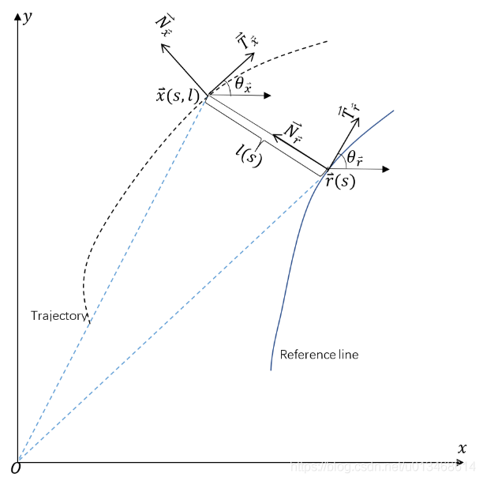
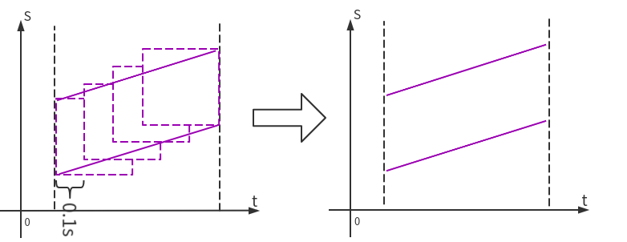

# 导论

该项目**基于百度Apollo**对自动驾驶各个模块分别介绍: 

**坐标转换, 感知，预测，高精地图及导航，决策规划，运动控制，传感器，仿真及V2X，车辆动力学**

该项目的大多数资料来源于Apollo。大部分内容是对[**Apollo-v6.0.0**](https://github.com/ApolloAuto/apollo/releases/tag/v6.0.0)各模块及 **Cyber框架** 的解析和注释，属于源码阅读笔记。

---

**作者邮箱：hanhy20@mai ls.jlu.edu.cn** **欢迎交流**。

项目地址 https://github.com/HaiYangLib/ApolloAnnotation

* 在代码上传时，某些大文件(**主要是某些模型文件**)没有上传,下面给出了这些文件的详细路径，如果有需要的，可以去Apollo的github上下载，对应版本**[apollo-v6.0.0](https://github.com/ApolloAuto/apollo/releases/tag/v6.0.0)**


```c
*.caffemodel
*.model
*.caffemodel.metadata
*.onnx

modules/planning/data/model/*.pt

modules/perception/production/data/perception/camera/models/lane_detector/darkSCNN/params
modules/perception/production/data/perception/camera/models/lane_detector/darkSCNN/params
modules/perception/production/data/perception/camera/models/yolo_obstacle_detector/3d-r4-half/params
modules/perception/production/data/perception/camera/models/yolo_obstacle_detector/3d-yolo/params
modules/perception/production/data/perception/camera/models/lane_detector/darkSCNN/params
```

## 模块关系


**橙色的部分是正在做的工作。**与注释相关的文档，全部保存在**doc文件夹**中。

**各个模块订阅及发布的Topic**

**Routing模块订阅的话题:**

| 成员变量 | 话题名称                  | 消息类型       |
| -------- | ------------------------- | -------------- |
| 配置Proc | "/apollo/routing_request" | RoutingRequest |

**Routing模块发布的话题:**

| 成员变量                 | 话题名称                           | 消息类型        |
| ------------------------ | ---------------------------------- | --------------- |
| response_writer_         | "/apollo/routing_response"         | RoutingResponse |
| response_history_writer_ | "/apollo/routing_response_history" | RoutingResponse |

**Planning模块订阅的话题:**

| 成员变量              | 话题名称                           | 消息类型              |
| --------------------- | ---------------------------------- | --------------------- |
| 配置Proc              | "/apollo/prediction"               | PredictionObstacles   |
| 配置Proc              | "/apollo/canbus/chassis"           | Chassis               |
| 配置Proc              | "/apollo/localization/pose"        | LocalizationEstimate  |
| routing_reader_       | "/apollo/routing_response"         | RoutingResponse       |
| traffic_light_reader_ | "/apollo/perception/traffic_light" | TrafficLightDetection |
| pad_msg_reader_       | "/apollo/planning/pad"             | PadMessage            |
| story_telling_reader_ | "/apollo/storytelling"             | Stories               |

**Planning模块发布的话题:**

| 成员变量                       | 话题名称                         | 消息类型             |
| ------------------------------ | -------------------------------- | -------------------- |
| planning_writer_               | "/apollo/planning"               | ADCTrajectory        |
| rerouting_writer_              | "/apollo/routing_request"        | RoutingRequest       |
| planning_learning_data_writer_ | "/apollo/planning/learning_data" | PlanningLearningData |

## [实用工具篇概要](#实用工具篇)

介绍Cpp常用的一些开源库,如**protobuf glog gflags poco boost ros** 等, 主要涉及他们的安装及基础使用，更加具体的使用在Cyber篇的cyber_cmake源码中会体现。

这些第三方库很多在apollo中会用到, 属于比较常用的实用工具。

## [Cyber篇概要](#Cyber篇)

完成了**Cyber的cmake版移植**，详细代码见**cyber_cmake**

提供了Cyber所需的第三方库的安装脚本,在thritd_party目录下

## [Transform篇](#Transform篇)

## [感知篇概要](#感知篇)

针对**感知模块(Perception)**,   [ApolloAnnotation](https://github.com/HaiYangLib/ApolloAnnotation)做了以下工作：

* **Radar子模块**的注释工作主要涉及：Radar**数据预处理**，**IDMatch**和**匈牙利匹配**算法的讲解
* **Liadr子模块**的注释工作主要涉及：Lidar**数据预处理**，**Pointpillars算法**实现过程的分析与代码注释
* **Camera子模块**的注释工作暂时未做

## [预测篇概要](#感知篇)

暂时未做工作

##  [导航篇概要](#导航篇) 

导航篇包含两个模块：Map和Routing

介绍了**Apollo Map模块**,主要包含**高精地图类对高精地图的封装**，**拓扑地图类对拓扑地图的封装**，**基于高精地图创建拓扑地图**。

介绍了**Apollo Routing模块**，主要包含Routing模块的具体实现，**拓扑子图的生成**和**基于拓扑子图A*搜索**，**组装搜索结果并整合成RoutingResponse**。

介绍了PncMap和ReferenceLineProvider，其中后者依赖前者, ReferenceLineProvider小节分析了**参考线生成及平滑**

## [规划篇概要](#规划篇)


针对**规划模块(Planning)**,   [ApolloAnnotation](https://github.com/HaiYangLib/ApolloAnnotation)做了以下工作：

* 对**Frenet坐标系**做了推导

推到了**笛卡尔坐标系和Frenet坐标系**之间的转换关系

* 对**Lattice Planner**做了介绍

详细介绍了LatticPlanner的原理以及实现过程,其中包括**计算障碍物的S-T图**，**巡航模式下纵向4次多项式轨迹生成**,**存在障碍物停或止点时纵向5次多项式轨迹生成**，**基于二次规划的横向轨迹生成**。还介绍了对每组横纵向**轨迹代价**的计算。

* 对**OpenSpacePlanner**做了介绍

介绍了**OpenSpaceROI区域的生成**，**混合A***，**ReedShepp轨迹生成**

* 对Scenario的执行流程做了介绍

介绍了**Scenario的切换原理**，**Scenario--->Stage--->Task的执行流程**

## [控制篇概要](#控制篇)

介绍了纵向控制,主要涉及在**纵向位置PID**和**纵向速度PID**

## [传感器篇概要](#传感器篇)

## [仿真及V2X篇概要](#仿真及V2X篇)

## [汽车动力学篇概要](#汽车动力学篇)

 


向一些愿意分享自动驾驶经验的博主表示感谢：

* **Apollo系列经验**  知乎博主  [王方浩 无人驾驶](https://www.zhihu.com/column/self-driving) 
* **Lattice Planner** B站UP主 [读书思过](https://space.bilibili.com/325034144)
* **路径规划与轨迹跟踪** B站UP主 [小黎的Ally](https://space.bilibili.com/477041559)
* **LQR控制** B站UP主 [忠厚老实的老王](https://space.bilibili.com/287989852?from=search&seid=125495911078972296&spm_id_from=333.337.0.0)
* **官方系列文档** [Apollo开放平台文档](https://apollo.auto/Apollo-Homepage-Document/Apollo_Doc_CN_6_0/)
* **Apollo 3.0阅读笔记**  Github [YannZyl](https://github.com/YannZyl)

 


# 实用工具篇

## 构建工具

### ninja

Ninja 是一个构建系统，与 Make 类似。作为输入，你需要描述将源文件处理为目标文件这一过程所需的命令。 Ninja 使用这些命令保持目标处于最新状态。与其它一些构建系统不同，**Ninja 的主要设计目标是速度**（亲测很快）。ninja可以与cmake连用,只需要在cmake 命令中加入` -G "Ninja"`,在接下来的编译时,用`ninja`命令代替`make`

* 安装

```bash
 sudo apt install ninja-build
```

### cmake

[cmake使用](https://www.bilibili.com/video/BV16V411k7eF?from=search&seid=14755829595112057287&spm_id_from=333.337.0.0)


**protobuf,glog,gflags在cyber篇会用到, 在cyber的cmake版本中有这些第三方库的详细用法**

## protobuf安装及使用

> protocol buffers 是一种语言无关、平台无关、可扩展的序列化结构数据的方法，它可用于（数据）通信协议、数据存储等。
>
> Protocol Buffers 是一种灵活，高效，自动化机制的结构数据序列化方法－可类比 XML，但是比 XML 更小（3 ~ 10倍）、更快（20 ~ 100倍）、更为简单。
>
> 你可以定义数据的结构，然后使用特殊生成的源代码轻松的在各种数据流中使用各种语言进行编写和读取结构数据。你甚至可以更新数据结构，而不破坏由旧数据结构编译的已部署程序。

### protobuf安装

1. 安装脚本

**get_protobuf.sh** 

```bash
CXX_TAG=gcc
export CC=/usr/bin/gcc
export CXX=/usr/bin/g++

# CXX_TAG=c8
# export CC=/usr/bin/clang-8
# export CXX=/usr/bin/clang++-8

VERSION=v3.18.1 # 版本
BASENAME=protobuf-${VERSION}-${CXX_TAG}

RM_SOURCE="false" # 是否删除源码
RM_BUILD="true"  # 是否删除build文件夹
INSTALL="true"    # 是否编译及安装

SOURCE_DIR=${BASENAME}-source   # 源代码文件夹
BUILD_DIR=${BASENAME}-build    # build文件夹
INSTALL_DIR=${BASENAME}-install # 安装文件夹

if [ -d "${INSTALL_DIR}" ]; then
  echo "${BASENAME} already installed."
else
  rm -Rf ${BUILD_DIR} ${INSTALL_DIR}

  if [ -d ${SOURCE_DIR} ]; then
    echo "${SOURCE_DIR} already existence"
  else
    echo "============= Retrieving Protobu. ================"
    git clone --depth=1 -b ${VERSION} \
      https://github.com/google/protobuf.git ${SOURCE_DIR}
  fi

  if [ "${INSTALL}" == "true" ]; then
    echo "========== Building Google Protobuf with libstdc++. ========"
    mkdir -p ${BUILD_DIR}
    pushd ${BUILD_DIR} >/dev/null

    cmake -G "Ninja" \
      -DCMAKE_POSITION_INDEPENDENT_CODE=ON \
      -DCMAKE_BUILD_TYPE=Release \
      -Dprotobuf_BUILD_TESTS=OFF \
      -DCMAKE_CXX_FLAGS="-std=c++14" \
      -DCMAKE_INSTALL_PREFIX="../${INSTALL_DIR}" \
      ../${SOURCE_DIR}/cmake

    ninja
    ninja install

    popd >/dev/null

  fi

  if [ "${RM_BUILD}" == "true" ]; then
    rm -Rf ${BUILD_DIR}
  fi

  if [ "${RM_SOURCE}" == "true" ]; then
    rm -Rf ${SOURCE_DIR}
  fi

fi
```

2. 安装

```bash
bash get_protobuf.sh
```

```bash
➜  tools tree -L 1
.
├── get_protobuf.sh # 安装脚本
├── protobuf-v3.18.1-gcc-build # build文件夹
├── protobuf-v3.18.1-gcc-install # 安装目录
└── protobuf-v3.18.1-gcc-source # protobuf源码


➜  protobuf-v3.18.1-gcc-install tree -L 1 
.
├── bin # protoc编译工具
├── include # protobuf头文件
└── lib # protobuf库文件
```

### protobuf使用

1. protobuf基础使用

https://blog.csdn.net/qq_38966867/article/details/113344727

2. protobuf读写文件

使用protobuf读写文件可以很方便地**利用protobuf充当配置文件**，这个用法在apollo很常见, 函数`GetProtoFromASCIIFile`用以替代json充当配置文件

```c++
#include "google/protobuf/io/zero_copy_stream_impl.h"
#include "google/protobuf/text_format.h"
#include "log.hpp"
#include <fcntl.h>

namespace ecloud {
namespace common {

// 将proto对象序列化到文件中(ascii格式)
inline bool SetProtoToASCIIFile(const google::protobuf::Message &message,
                                int file_descriptor) {
  using google::protobuf::TextFormat;
  using google::protobuf::io::FileOutputStream;
  using google::protobuf::io::ZeroCopyOutputStream;
  if (file_descriptor < 0) {
    LOG_ERROR << "Invalid file descriptor.";
    return false;
  }
  ZeroCopyOutputStream *output = new FileOutputStream(file_descriptor);
  bool success = TextFormat::Print(message, output);
  delete output;
  close(file_descriptor);
  return success;
}

// 将proto对象序列化到文件中(ascii格式)
inline bool SetProtoToASCIIFile(const google::protobuf::Message &message,
                                const std::string &file_name) {
  int fd = open(file_name.c_str(), O_WRONLY | O_CREAT | O_TRUNC, S_IRWXU);
  if (fd < 0) {
    LOG_ERROR << "Unable to open file " << file_name << " to write.";
    return false;
  }
  return SetProtoToASCIIFile(message, fd);
}

// 从文件中读取内容填充proto对象, 这个用法可以替代json充当配置文件
inline bool GetProtoFromASCIIFile(const std::string &file_name,
                                  google::protobuf::Message *message) {
  using google::protobuf::TextFormat;
  using google::protobuf::io::FileInputStream;
  using google::protobuf::io::ZeroCopyInputStream;
  int file_descriptor = open(file_name.c_str(), O_RDONLY);
  if (file_descriptor < 0) {
    LOG_ERROR << "Failed to open file " << file_name << " in text mode.";
    return false;
  }

  ZeroCopyInputStream *input = new FileInputStream(file_descriptor);
  bool success = TextFormat::Parse(input, message);
  if (!success) {
    LOG_ERROR << "Failed to parse file " << file_name << " as text proto.";
  }
  delete input;
  close(file_descriptor);
  return success;
}

} // namespace common
} // namespace ecloud
```


## glog安装及使用

### glog安装

**get_glog.sh**

```bash
CXX_TAG=gcc
export CC=/usr/bin/gcc
export CXX=/usr/bin/g++

# CXX_TAG=c8
# export CC=/usr/bin/clang-8
# export CXX=/usr/bin/clang++-8

VERSION=v0.3.5 # 版本
BASENAME=glog-${VERSION}-${CXX_TAG}

RM_SOURCE="false" # 是否删除源码
RM_BUILD="true"  # 是否删除build文件夹
INSTALL="true"    # 是否编译及安装

SOURCE_DIR=${BASENAME}-source   # 源代码文件夹
BUILD_DIR=${BASENAME}-build     # build文件夹
INSTALL_DIR=${BASENAME}-install # 安装文件夹

if [ -d "${INSTALL_DIR}" ]; then
  echo "${BASENAME} already installed."
else
  rm -Rf ${BUILD_DIR} ${INSTALL_DIR}

  if [ -d ${SOURCE_DIR} ]; then
    echo "${SOURCE_DIR} already existence"
  else
    echo "============= Retrieving Glog. ================"
    git clone --depth=1 -b ${VERSION} \
        https://github.com/google/glog.git ${SOURCE_DIR}
  fi

  if [ "${INSTALL}" == "true" ]; then
    echo "========== Building Google Glog with libstdc++. ========"
    mkdir -p ${BUILD_DIR}
    pushd ${BUILD_DIR} >/dev/null

    cmake -G "Ninja" \
      -DGFLAGS_NAMESPACE=google \
      -DBUILD_SHARED_LIBS=ON \
      -DCMAKE_CXX_FLAGS="-fPIC -std=c++14" \
      -DCMAKE_INSTALL_PREFIX="../${INSTALL_DIR}" \
      ../${SOURCE_DIR}

    ninja
    ninja install

    popd >/dev/null

  fi

  if [ "${RM_BUILD}" == "true" ]; then
    rm -Rf ${BUILD_DIR}
  fi

  if [ "${RM_SOURCE}" == "true" ]; then
    rm -Rf ${SOURCE_DIR}
  fi

fi
```

### glog使用

1. [glog使用](https://blog.csdn.net/qq_38966867/article/details/113386941)

2. 调试模式

> [google glog调试模式](https://blog.csdn.net/dyzhen/article/details/103185790)
>
> [Glog剖析之DLOG](https://blog.csdn.net/zx_cplusplus/article/details/21476793#comments)
>
> 参考一些网上资料，了解到glog通过NDEBUG宏控制是否打开调试模式，如果在编译时定义了该宏，则关闭了调试模式，相应的DLOG()等函数就不输出内容了，因为宏是在编译时展开的，所以按道理应该是在编译glog库的时候定义或不定义该宏。但实际上，通过查看Makefile，glog默认是定义了该宏的，即关闭了调试模式，可是在应用程序中调用DLOG()依然输出日志了。后来发现，是需要在应用程序编译的时候定义该宏，即CXXFLAGS += -DNDEBUG，这样就可以了。
>
> 有了该方法，平时调试就方便了，调试类的日志可以用DLOG记，编译应用程序时，发布release版的时候加上CXXFLAGS += -DNDEBUG，平时这些日志就不会输出，需要调试的时候再去掉该宏，从而发布debug版，这些日志就输出了。而glog本身无需编译两个版本。

 

## gflags安装及使用

### gflags安装

**get_gflasg.sh**

```bash
CXX_TAG=gcc
export CC=/usr/bin/gcc
export CXX=/usr/bin/g++

# CXX_TAG=c8
# export CC=/usr/bin/clang-8
# export CXX=/usr/bin/clang++-8

VERSION=v2.2.0
BASENAME=gflags-${VERSION}-${CXX_TAG}

RM_SOURCE="false" # 是否删除源码
RM_BUILD="true"   # 是否删除build文件夹
INSTALL="true"    # 是否编译及安装

SOURCE_DIR=${BASENAME}-source   # 源代码文件夹
BUILD_DIR=${BASENAME}-build     # build文件夹
INSTALL_DIR=${BASENAME}-install # 安装文件夹

if [ -d "${INSTALL_DIR}" ]; then
  echo "${BASENAME} already installed."
else
  rm -Rf ${BUILD_DIR} ${INSTALL_DIR}

  if [ -d ${SOURCE_DIR} ]; then
    echo "${SOURCE_DIR} already existence"
  else
    echo "============= Retrieving gflags. ================"
    git clone --depth=1 -b ${VERSION} \
      https://github.com/gflags/gflags.git ${SOURCE_DIR}
  fi

  if [ "${INSTALL}" == "true" ]; then
    echo "========== Building Google gflags with libstdc++. ========"
    mkdir -p ${BUILD_DIR}
    pushd ${BUILD_DIR} >/dev/null

    cmake -G "Ninja" \
      -DBUILD_SHARED_LIBS=ON \
      -DBUILD_STATIC_LIBS=ON \
      -DINSTALL_HEADERS=ON \
      -DINSTALL_SHARED_LIBS=ON \
      -DINSTALL_STATIC_LIBS=ON \
      -DCMAKE_CXX_FLAGS="-std=c++14" \
      -DCMAKE_INSTALL_PREFIX="../${INSTALL_DIR}" \
      ../${SOURCE_DIR}

    ninja
    ninja install

    popd >/dev/null

  fi

  if [ "${RM_BUILD}" == "true" ]; then
    rm -Rf ${BUILD_DIR}
  fi

  if [ "${RM_SOURCE}" == "true" ]; then
    rm -Rf ${SOURCE_DIR}
  fi

fi

```


### gflags使用

[gflags中的 --flagfile= 用法](https://blog.csdn.net/u011754972/article/details/118387767?ops_request_misc=%257B%2522request%255Fid%2522%253A%2522164093328716780357250635%2522%252C%2522scm%2522%253A%252220140713.130102334.pc%255Fall.%2522%257D&request_id=164093328716780357250635&biz_id=0&utm_medium=distribute.pc_search_result.none-task-blog-2~all~first_rank_ecpm_v1~rank_v31_ecpm-1-118387767.pc_search_insert_es_download&utm_term=gflags+%E9%85%8D%E7%BD%AE%E6%96%87%E4%BB%B6&spm=1018.2226.3001.4187)

如果要把代码中的变量做成可通过配置文件进行配置的，可以使用`gflag`来实现。
如，想要通过代码运行
`FLAGS_apple_nums`可以这样定义：

```c++
DECLARE_int32(apple_nums); //定义在 .h文件
---------------------------------------------------------
DEFINE_int32(apple_nums, 0, "num of apple"); //定义在 .cc文件

```

对于gflags中的--flagfile用法，不管二进制节点后面接几个--flagfile=的配置文件,他们之间的关系是衔接的。但是对于几个文件中都有的flag， 哪个--flagfile=文件在后面，哪个变量就是最终代码使用的值。
如：

```shell
./app_node --flagfile=app_1.conf --flagfile=app_2.conf 
```

在app_1.conf中有一句--system_version=1.0.0.0；
在app_2.conf文件中有一句--system_version=2.0.0.0；
那么由于--flagfile=app_2.conf写在后面，所以代码最终FLAGS_system_version使用的值是2.0.0.0

## boost 安装及使用

### boost 安装

1. 安装脚本

**get_boost.sh**

```bash
CXX_TAG=gcc

BUILD_CONCURRENCY=$(nproc --all) # 指定编译使用的线程数量
BOOST_TOOLSET="gcc"
BOOST_CFLAGS="-fPIC -std=c++14 -DBOOST_ERROR_CODE_HEADER_ONLY"

VERSION=1.72.0
BASENAME="boost-${VERSION}-${CXX_TAG}"

RM_SOURCE="false" # 是否删除源码
INSTALL="true"    # 是否编译及安装

SOURCE_DIR=${BASENAME}-source   # 源代码文件夹
INSTALL_DIR=${BASENAME}-install # 安装文件夹

if [ "${INSTALL}" == "true" ]; then

  BOOST_PACKAGE_BASENAME=boost_${VERSION//./_} 
  echo ${BOOST_PACKAGE_BASENAME}.tar.gz

  if [ -f ${BOOST_PACKAGE_BASENAME}.tar.gz ]; then
    echo "${BOOST_PACKAGE_BASENAME}.tar.gz already existence"
  else
    echo "Retrieving boost."
    wget "https://boostorg.jfrog.io/artifactory/main/release/${VERSION}/source/${BOOST_PACKAGE_BASENAME}.tar.gz" || true

  fi

  rm -Rf ${SOURCE_DIR} 
  tar -xvzf ${BOOST_PACKAGE_BASENAME}.tar.gz
  mv ${BOOST_PACKAGE_BASENAME} ${SOURCE_DIR}

  pushd ${SOURCE_DIR} >/dev/null

  bash bootstrap.sh \
    --with-toolset=${BOOST_TOOLSET} \
    --prefix=../${INSTALL_DIR} \
    --with-libraries=python,filesystem,system,program_options

  ./b2 toolset="${BOOST_TOOLSET}" cxxflags="${BOOST_CFLAGS}" \
    --prefix="../${INSTALL_DIR}" -j "${BUILD_CONCURRENCY}" install

  popd >/dev/null

  if [ "${RM_SOURCE}" == "true" ]; then
    rm ${BOOST_PACKAGE_BASENAME}.tar.gz
  fi

fi
```

2. 安装

```bash
bash get_boost.sh  
```

```bash
.
├── boost-1.72.0-gcc-install # 安装目录
├── boost-1.72.0-gcc-source  # 源码
├── boost_1_72_0.tar.gz   # 源码
└── get_boost.sh
```

```bash
➜  boost-1.72.0-gcc-install tree -L 1
.
├── include
└── lib
```


### boost 使用

[Boost C++ 库 使用](https://www.bookstack.cn/read/boost/ch0.md)

## poco安装及使用

POCO库是强大的的跨平台C++库，可以用来编写多平台的网络应用程序，这些平台包括桌面端、服务端、移动端、IOT(物联网)、嵌入式系统等。总的来说是一个非常强大的综合性库。**Cyber使用了Poco的SharedLibrary 模块，实现了类加载功能(在Cyber篇会介绍)**

### poco安装

**get_poco.sh**

```bash
CXX_TAG=gcc
export CC=/usr/bin/gcc
export CXX=/usr/bin/g++

# CXX_TAG=c8
# export CC=/usr/bin/clang-8
# export CXX=/usr/bin/clang++-8

VERSION=poco-1.11.1-release # 版本
BASENAME=poco-${VERSION}-${CXX_TAG}
echo $BASENAME

RM_SOURCE="false" # 是否删除源码
RM_BUILD="true"   # 是否删除build文件夹
INSTALL="true"    # 是否编译及安装

SOURCE_DIR=${BASENAME}-source   # 源代码文件夹
BUILD_DIR=${BASENAME}-build     # build文件夹
INSTALL_DIR=${BASENAME}-install # 安装文件夹

if [ -d "${INSTALL_DIR}" ]; then
  echo "${BASENAME} already installed."
else
  rm -Rf ${BUILD_DIR} ${INSTALL_DIR}

  if [ -d ${SOURCE_DIR} ]; then
    echo "${SOURCE_DIR} already existence"
  else
    echo "=====================Retrieving POCO.========================"
    git clone --depth=1 -b ${VERSION} \
         https://github.com/pocoproject/poco.git ${SOURCE_DIR}
  fi

  if [ "${INSTALL}" == "true" ]; then
    echo "========== Building POCO with libstdc++. ========"
    mkdir -p ${BUILD_DIR}
    pushd ${BUILD_DIR} >/dev/null

    cmake -G "Ninja" \
      -DCMAKE_CXX_FLAGS="-std=c++14" \
      -DCMAKE_INSTALL_PREFIX="../${INSTALL_DIR}" \
      ../${SOURCE_DIR}

    ninja
    ninja install

    popd >/dev/null

  fi

  if [ "${RM_BUILD}" == "true" ]; then
    rm -Rf ${BUILD_DIR}
  fi

  if [ "${RM_SOURCE}" == "true" ]; then
    rm -Rf ${SOURCE_DIR}
  fi

f
```

### poco使用

[SharedLibrary 模块使用](https://blog.csdn.net/qq_38966867/article/details/120128133)


## ros安装及使

### ros安装

在ubuntu18.04上安装ros

1. 安装准备

```bash
sudo apt-get update
sudo apt-get upgrade
```

2. 添加ROS的镜像源

```bash
sudo sh -c '. /etc/lsb-release && echo "deb http://mirrors.ustc.edu.cn/ros/ubuntu/ `lsb_release -cs` main" > /etc/apt/sources.list.d/ros-latest.list'
```

3. 配置密钥

```bash
sudo apt-key adv --keyserver 'hkp://keyserver.ubuntu.com:80' --recv-key C1CF6E31E6BADE8868B172B4F42ED6FBAB17C654
```

> 备选地址
> hkp://pgp.mit.edu:80
> hkp://keyserver.ubuntu.com:80 

4. 更新源

```c++
sudo apt-get update
```

5. 安装melodic

```bash
sudo apt install ros-melodic-desktop-full
```

> 库文件安装在 /opt/ros/melodic

6. ROS初始化

```bash
echo "source /opt/ros/melodic/setup.bash" >> ~/.bashrc
source ~/.bashrc
```

7. 安装工具依赖

```bash
sudo apt install python-rosdep python-rosinstall python-rosinstall-generator python-wstool build-essential
```

8. 初始化rosdep

```bash
sudo rosdep init
rosdep update
```

9. 启动ROS

```bash
roscore
```

### ros2 安装

选择的平台：

- Ubuntu 18.04
- ROS 2 (Dashing 版本)

**步骤：**

1. 设置环境变量 LC_ALL 和 LANG (我尝试了一下，不设置这两个变量也行)

```bash
sudo locale-gen en_US en_US.UTF-8

sudo update-locale LC_ALL=en_US.UTF-8 LANG=en_US.UTF-8

export LANG=en_US.UTF-8
```

2. 添加 ROS 2 的 repo 以及对应的 key

```bash
sudo apt update

sudo apt install curl gnupg2 lsb-release

curl -s https://raw.githubusercontent.com/ros/rosdistro/master/ros.asc | sudo apt-key add -

sudo sh -c 'echo "deb [arch=amd64,arm64] http://packages.ros.org/ros2/ubuntu `lsb_release -cs` main" > /etc/apt/sources.list.d/ros2-latest.list'
```

3. 安装 ROS 2

```bash
sudo apt update

sudo apt install ros-dashing-desktop
```

4. 添加命令自动补全功能，即在命令行中用 TAB 键可以自动补全 ROS 2 的命令。

```bash
sudo apt install python3-argcomplete
```

5. 添加环境变量。这样每次打开 Terminal 就可以自动加载 ROS 2 相关的环境变量，进而使用 ROS 2 相关的命令

```bash
echo "source /opt/ros/dashing/setup.bash" >> ~/.bashrc
```

如果使用的是zsh，可以写成

```bash
echo "source /opt/ros/dashing/setup.zsh" >> ~/.bashrc
```

6. 如果涉及到 ROS 节点与 ROS 2 节点通讯，还要安装 ros1_bridge

```bash
sudo apt install ros-dashing-ros1-bridge
```

**colcon 编译工具:**

> 跟 ROS 相同，ROS 2 也是建议创建一个工作空间 workspace，方便管理同一个项目的  packages，而且也是将 package 源文件都放在 src 文件夹中。这里我们用 [ROS 2 tutorial](https://links.jianshu.com/go?to=https%3A%2F%2Findex.ros.org%2Fdoc%2Fros2%2FTutorials%2FColcon-Tutorial%2F) 中的例子，创建工作空间 ros2_example_ws 并进入 src

```bash
mkdir -p ~/ros2_example_ws/src   

cd ~/ros2_example_ws/src
```

现在我们先关注 colcon 的编译过程，所以 package 源文件就先借用官网的。

```bash
git clone https://github.com/ros2/examples 

git checkout $ROS_DISTRO     # 切换到与本机版本对应的 branch 上
```

目前文件路径结构如下：

```bash
$ tree -L 3
.
└── src
    └── examples
        ├── CONTRIBUTING.md
        ├── LICENSE
        ├── rclcpp
        ├── rclpy
        └── README.md

4 directories, 3 files
```

可以用 `colcon list` 命令列出 src 文件夹中的所有 packages，即所有包含 `package.xml` 和 `setup.py`/`CMakeLists.txt` 的文件夹。


 用 colcon 编译下载的 package

```bash
colcon build --symlink-install
```

上边命令中 `--symlink-install` 表示编译时如果 install 中文件已经存在于  src 或者 build 文件夹中，就用超链接指向该文件，避免浪费空间，也可以实现同步更新。
 例如，在 install 文件夹的 examples_rclcpp_minimal_publisher 中有如下超链接：


如果去掉 `--symlink-install` 参数，仅用命令 `colcon build` 来编译，则上述超链接文件全都变成实体拷贝的文件，得到如下结果： 

```bash
.
├── lib
│   └── examples_rclcpp_minimal_publisher
│       ├── publisher_lambda
│       ├── publisher_member_function
│       └── publisher_not_composable
└── share
    ├── ament_index
    │   └── resource_index
    ├── colcon-core
    │   └── packages
    └── examples_rclcpp_minimal_publisher
        ├── cmake
        ├── environment
        ├── hook
        ├── local_setup.bash
        ├── local_setup.sh
        ├── local_setup.zsh
        ├── package.bash
        ├── package.ps1
        ├── package.sh
        ├── package.xml
        └── package.zsh
```

编译之后，得到的文档结构如下:

```bash
.
├── build
├── install
├── log
└── src
```

编译之后还可以测试一下 packages

```bash
$ colcon test-result --all

build/examples_rclpy_executors/pytest.xml: 3 tests, 0 errors, 0 failures, 0 skipped
build/examples_rclpy_minimal_action_client/pytest.xml: 0 tests, 0 errors, 0 failures, 0 skipped
build/examples_rclpy_minimal_action_server/pytest.xml: 0 tests, 0 errors, 0 failures, 0 skipped
build/examples_rclpy_minimal_client/pytest.xml: 3 tests, 0 errors, 0 failures, 0 skipped
build/examples_rclpy_minimal_publisher/pytest.xml: 3 tests, 0 errors, 0 failures, 0 skipped
build/examples_rclpy_minimal_service/pytest.xml: 3 tests, 0 errors, 0 failures, 0 skipped
build/examples_rclpy_minimal_subscriber/pytest.xml: 3 tests, 0 errors, 0 failures, 0 skipped

Summary: 15 tests, 0 errors, 0 failures, 0 skipped
```

如果要单独编译某一个 package，可以用如下命令：

```bash
colcon build --packages-select  PACKAGE_NAME
```

如果不希望编译某一个 package，可以在该 package中创建名为 `COLCON_IGNORE` 的空文件，colcon 就会忽略掉该 package，不但不编译，连 `colcon list` 都不显示，这个 package 对 colcon 就是透明的。

完成编译之后，要 source 一下 setup.bash 文件，确保系统能够找到当前编译生成的可执行文件和库

```bash
source install/setup.bash
```

 或者将 source 命令放入 .bashrc 文件，这样每次打开 terminal 就可以自动加载路径信息

```bash
echo "source ~/ros2_example_ws/install/setup.bash" >> ~/.bashrc
```

实例测试：
首先启动一个 publisher

```bash
ros2 run examples_rclcpp_minimal_publisher publisher_member_function
```

再启动一个 subscriber

```bash
 ros2 run examples_rclcpp_minimal_subscriber subscriber_member_function 
```

如果一切顺利，应该会有如下的界面：


**terminal 命令:**

ROS 2 根据命令的作用对象划分成多个类别，其中常用的几个类别：

```bash
Commands:
  launch     Run a launch file
  node       Various node related sub-commands
  param      Various param related sub-commands
  pkg        Various package related sub-commands
  run        Run a package specific executable
  service    Various service related sub-commands
  srv        Various srv related sub-commands
  topic      Various topic related sub-commands
```

在调用时都是采用如下命令格式：

```bash
ros2 COMMAND ...
```

我们可以对比 ROS 和 ROS 2 中的几个命令，应该很容易找到其中的规律

- 运行 ROS node
   \-  ROS： `rosrun <package> <executive>`
   \- ROS 2：`ros2 run <package> <executive>`
- 查看当前运行的 node
   \-  ROS ：  `rosnode list`
   \- ROS 2： `ros2 node list`

### ros使用

[古月·ROS入门21讲](https://www.bilibili.com/video/BV1zt411G7Vn?from=search&seid=11195565935207931281&spm_id_from=333.337.0.0)


## 参考文献

[ROS 2 基本命令总结](https://www.jianshu.com/p/29cca79d343c)


# Cyber篇

## cyber移植

cyber本身与apollo项目绑定,而且是通过bazel构建,使用不太方便。现**对cyber使用cmake重新构建,**并提供安装脚本,简化安装步骤,该版本的cyber完全脱离apollo及其docker环境。

项目地址 https://github.com/HaiYangLib/ApolloAnnotation 代码在cyber_cmake目录下。


# Transform篇

对于一个自动驾驶系统来说，一般都会有激光雷达、毫米波雷达、超声波雷达、相机、IMU/GPS等各种传感器，而每个传感器都有自己的坐标系定义，为了描述自动驾驶车辆在地图中的位置，一般还涉及到全局定位，这就还会包含全局坐标系，也称为世界坐标系。这些错综复杂的坐标系定义，不仅涉及到了不同传感器之间的内外参标定关系，也包含了许多与坐标系转换之间的操作，需要我们重点掌握和理解。

由于来自不同传感器的数据都是带有坐标系，即数据的表示其实都是某个特定的坐标系的，不同传感器之间的外参标定等内容本博客暂时不说，本篇博客的主要目的是带大家整体理解和掌握Apollo中涉及到的各种坐标系定义和使用注意事项，这能帮我们在阅读Apollo源码特别是感知部分代码时快速理解各种坐标变换的含义和目的。

 

## 车辆传感器布局

首先我们整体来看一下Apollo官方提供的传感器布置图：


意区分其中相机坐标系和激光雷达坐标系的方向定义，其中**激光雷达坐标系X轴向前，Y轴向左，Z轴向上**，而**相机坐标系Z轴向前，X轴向右，Y轴向下**。另外在车的中间位置有一个紫色的传感器，上面写着**Novatel**，其实是诺瓦泰的GPS接收机，这个传感器的坐标系非常关键，因为Apollo中大部分传感器都是标定在该传感器坐标系下，**Novatel坐标系定义为X轴向右、Y轴向前、Z轴向上。**

modules/drivers/velodyne/params/velodyne128_novatel_extrinsics_example.yaml

```yaml
header:
  stamp:
    secs: 1422601952
    nsecs: 288805456
  seq: 0
  frame_id: novatel
transform:
  translation:
    x: -0.1941689746184177
    y: 1.438544324620427
    z: 0
  rotation:
    x: -0.00971305
    y: 0.00327669
    z: 0.7157
    w: 0.698332
child_frame_id: velodyne128
```

## 传感器外参标定关系

了解了Apollo自动驾驶车辆上整体的传感器布局后，接下来我们就来看下这些传感器所定义的坐标系以及他们的之间的转换关系，其实也就是标定结果中的**frame_id和child_frame_id**关系。

对于标定结果的描述，常用刚体变换中的旋转变换和平移变换来表示，其中涉及到child_frame_id表示该传感器数据所在的坐标系，frame_id则表示该标定结果描述了从child_frame_id到frame_id的变换关系。

下面的坐标系变换关系图中箭头起点表示child_frame_id、箭头所指的为frame_id。


 

从图中可以看出，**Apollo将激光雷达、相机都标定到了novatel坐标系下，将毫米波雷达坐标系标定到了velodyne128坐标系下**，将novatel坐标系标定到了localization坐标系下，最终通过localization模块发布了从localization到world坐标系的变换，即发布了车辆的全局位姿，这样这些坐标系变换关系就构成了一个变换树**（tf_tree）**，我们可以从这颗变换树中查询任意两个坐标系之间的变换关系，从而完成坐标转换工作。

## 具体实现细节

理解了传感器的布局以及Apollo中对这些传感器所完成的标定任务之后，下一个关键的问题就是Apollo中是如何管理和维护这些传感器外参的标定关系以及本车的全局位姿信息呢？又是如何在程序中实现方便查询这些变换关系，完成我们想要的坐标变换呢？

### 外参标定结果的管理与维护

我们知道对于不同传感器之间的外参变换关系来说，由于它们都是固连在自动驾驶车辆上而且在车辆运动过程中它们的相对位置并没有发生变化，所以它们的变换关系是固定不变的。对于拥有这种特征的变换关系，在ROS中我们可以发布tf_static话题，在Apollo中也借用了ROS的这种机制。


Apollo中使用**transform**模块完成对传感器外参标定结果的发布工作。`Component`组件类为`StaticTransformComponent`，配置参数为`modules/transform/conf/static_transform_conf.pb.txt`文件。 

为了方便分析，下面贴出`static_transform_conf.pb.txt`文件的内容：

```json
extrinsic_file {
    frame_id: "novatel"
    child_frame_id: "velodyne128"
    file_path: "/apollo/modules/drivers/velodyne/params/velodyne128_novatel_extrinsics.yaml"
    enable: true
}

extrinsic_file {
    frame_id: "localization"
    child_frame_id: "novatel"
    file_path: "/apollo/modules/localization/msf/params/novatel_localization_extrinsics.yaml"
    enable: true
}

extrinsic_file {
    frame_id: "velodyne128"
    child_frame_id: "front_6mm"
    file_path: "/apollo/modules/perception/data/params/front_6mm_extrinsics.yaml"
    enable: true
}

extrinsic_file {
    frame_id: "velodyne128"
    child_frame_id: "front_12mm"
    file_path: "/apollo/modules/perception/data/params/front_12mm_extrinsics.yaml"
    enable: true
}

extrinsic_file {
    frame_id: "novatel"
    child_frame_id: "lidar16_front_up"
    file_path: "/apollo/modules/drivers/velodyne/params/lidar16_front_up_novatel_extrinsics.yaml"
    enable: true
}

extrinsic_file {
    frame_id: "novatel"
    child_frame_id: "lidar16_front"
    file_path: "/apollo/modules/drivers/velodyne/params/lidar16_front_novatel_extrinsics.yaml"
    enable: true
}

extrinsic_file {
    frame_id: "novatel"
    child_frame_id: "lidar16_rear_left"
    file_path: "/apollo/modules/drivers/velodyne/params/lidar16_rear_left_novatel_extrinsics.yaml"
    enable: true
}

extrinsic_file {
    frame_id: "novatel"
    child_frame_id: "lidar16_rear_right"
    file_path: "/apollo/modules/drivers/velodyne/params/lidar16_rear_right_novatel_extrinsics.yaml"
    enable: true
}

extrinsic_file {
    frame_id: "velodyne128"
    child_frame_id: "radar_front"
    file_path: "/apollo/modules/perception/data/params/radar_front_extrinsics.yaml"
    enable: true
}

extrinsic_file {
    frame_id: "velodyne128"
    child_frame_id: "radar_rear"
    file_path: "/apollo/modules/perception/data/params/radar_rear_extrinsics.yaml"
    enable: true
}

```

从中可以看出该配置文件定义了StaticTransformComponent类需要发布的所有传感器外参标定关系，并指明了这些具体标定参数yaml文件所在路径。

在StaticTransformComponent类中依次对这些yaml文件进行解析，并发布所有这些静态变换，从而建立起了一棵变换树（tf_tree）

 


 ###  本车全局位姿的发布

除了transform模块中的StaticTransformComponent类发布所有传感器的外参变换关系外，还有一个很重要的变换关系需要发布，那就是本车的全局位姿变换关系，这也是定位模块localization主要的任务。

Apollo中通过localization模块中的LocalizationMsgPublisher类（modules/localization/msf/msf_localization_component.cc）完成本车全局位姿的发布工作，其实发布的是localization到world坐标系的变换关系。

发布函数LocalizationMsgPublisher::PublishPoseBroadcastTF定义：


```c++
void LocalizationMsgPublisher::PublishPoseBroadcastTF(
    const LocalizationEstimate& localization) {
  // broadcast tf message
  apollo::transform::TransformStamped tf2_msg;

  auto mutable_head = tf2_msg.mutable_header();
  mutable_head->set_timestamp_sec(localization.measurement_time());
  mutable_head->set_frame_id(broadcast_tf_frame_id_);
  tf2_msg.set_child_frame_id(broadcast_tf_child_frame_id_);

  auto mutable_translation = tf2_msg.mutable_transform()->mutable_translation();
  mutable_translation->set_x(localization.pose().position().x());
  mutable_translation->set_y(localization.pose().position().y());
  mutable_translation->set_z(localization.pose().position().z());

  auto mutable_rotation = tf2_msg.mutable_transform()->mutable_rotation();
  mutable_rotation->set_qx(localization.pose().orientation().qx());
  mutable_rotation->set_qy(localization.pose().orientation().qy());
  mutable_rotation->set_qz(localization.pose().orientation().qz());
  mutable_rotation->set_qw(localization.pose().orientation().qw());

  tf2_broadcaster_.SendTransform(tf2_msg);
}

```

其中`broadcast_tf_frame_id_`和`broadcast_tf_child_frame_id_`定义在`modules/localization/common/localization_gflags.cc`文件中：

```c++
DEFINE_string(broadcast_tf_frame_id, "world", "world frame id in tf");
DEFINE_string(broadcast_tf_child_frame_id, "localization",
              "localization frame id in tf");

```

### 坐标变换树的应用

此处以感知模块为例，在感知模块中定义了TransformWrapper类（modules/perception/onboard/transform_wrapper/transform_wrapper.h），用来查询不同坐标系之间的变换矩阵，从而完成坐标变换。

在`TransformWrapper`类中，主要是通过成员变量`Buffer* tf2_buffer_ = Buffer::Instance();`在`TransformWrapper::QueryTrans`函数中完成坐标的查询工作，而Buffer类定义在transform模块下的modules/transform/buffer.h文件中，该类继承自`tf2::BufferCore`，到这就可以大概清楚了，Apollo其实是借鉴了ROS中tf2的部分实现，来完成对坐标变换关系的缓存和查询工作的。

下面以radar感知来看下`TransformWrapper`类的具体应用：
`RadarDetectionComponent`类（modules/perception/onboard/component/radar_detection_component.h）中定义了如下成员变量：

 ```c++
TransformWrapper radar2world_trans_;
TransformWrapper radar2novatel_trans_;
 ```

分别用来查询`radar`到`world`坐标系之间的变换，以及`radar`到`novatel`坐标系之间的变换；

在`RadarDetectionComponent::Init`函数中初始化该类：

```c++
radar2world_trans_.Init(tf_child_frame_id_);
radar2novatel_trans_.Init(tf_child_frame_id_);
```

其中tf_child_frame_id_为radar_front或radar_rear，这就与上述的Apollo建立的外参标定关系图对应上了，最后我们在RadarDetectionComponent::InternalProc函数中调用TransformWrapper类的相关成员函数根据当前消息的时间戳进行坐标变换矩阵的获取。


```c++
Eigen::Affine3d radar_trans;
if (!radar2world_trans_.GetSensor2worldTrans(timestamp, &radar_trans)) {
    out_message->error_code_ = apollo::common::ErrorCode::PERCEPTION_ERROR_TF;
    AERROR << "Failed to get pose at time: " << timestamp;
    return true;
}
Eigen::Affine3d radar2novatel_trans;
if (!radar2novatel_trans_.GetTrans(timestamp, &radar2novatel_trans, "novatel",
                                    tf_child_frame_id_)) {
    out_message->error_code_ = apollo::common::ErrorCode::PERCEPTION_ERROR_TF;
    AERROR << "Failed to get radar2novatel trans at time: " << timestamp;
    return true;
}
```


## 参考文献

[Apollo 5.5 源码学习笔记（五） | transform模块 | Apollo中的坐标系统详解](https://blog.csdn.net/zhanghm1995/article/details/106151288)


# 感知篇


# 预测篇

## Prediction模块相关数据

* PredictionObstacles


```protobuf
// modules/prediction/proto/prediction_obstacle.proto
message PredictionObstacles {
  // timestamp is included in header
  optional apollo.common.Header header = 1;
  // make prediction for multiple obstacles
  repeated PredictionObstacle prediction_obstacle = 2;
  // perception error code
  optional apollo.common.ErrorCode perception_error_code = 3;
  // start timestamp
  optional double start_timestamp = 4;
  // end timestamp
  optional double end_timestamp = 5;
  // self driving car intent
  optional Intent intent = 6;
  // Scenario
  optional Scenario scenario = 7;
}
```


* PredictionObstacle 

modules/prediction/proto/prediction_obstacle.proto

```protobuf
message PredictionObstacle {
  optional apollo.perception.PerceptionObstacle perception_obstacle = 1;
  optional double timestamp = 2;  //
  optional double predicted_period = 3;
  repeated Trajectory trajectory = 4;
  optional ObstacleIntent intent = 5;
  optional ObstaclePriority priority = 6;
  optional bool is_static = 7 [default = false];
  repeated Feature feature = 8;
}
```

* Trajectory

modules/prediction/proto/feature.proto

```protobuf
message Trajectory {
  optional double probability = 1;  // probability of this trajectory
  repeated apollo.common.TrajectoryPoint trajectory_point = 2;
}
```

* TrajectoryPoint

modules/common/proto/pnc_point.proto

```protobuf
message PathPoint {
  // coordinates
  optional double x = 1;
  optional double y = 2;
  optional double z = 3;

  // direction on the x-y plane
  optional double theta = 4;
  // curvature on the x-y planning
  optional double kappa = 5;
  // accumulated distance from beginning of the path
  optional double s = 6;

  // derivative of kappa w.r.t s.
  optional double dkappa = 7;
  // derivative of derivative of kappa w.r.t s.
  optional double ddkappa = 8;
  // The lane ID where the path point is on
  optional string lane_id = 9;

  // derivative of x and y w.r.t parametric parameter t in CosThetareferenceline
  optional double x_derivative = 10;
  optional double y_derivative = 11;
}
 
message TrajectoryPoint {
  // path point
  optional PathPoint path_point = 1;
  // linear velocity
  optional double v = 2;  // in [m/s]
  // linear acceleration
  optional double a = 3;
  // relative time from beginning of the trajectory
  optional double relative_time = 4;
  // longitudinal jerk
  optional double da = 5;
  // The angle between vehicle front wheel and vehicle longitudinal axis
  optional double steer = 6;

  // Gaussian probability information
  optional GaussianInfo gaussian_info = 7;
}
```


# 导航篇

项目地址 https://github.com/HaiYangLib/ApolloAnnotation

本文会将**map, routing, planning**三大模块结合在一起讲解

绿色部分是Map模块,黄色部分是Routing模块,蓝色部分是Planning模块

Routing模块和Planning模块通过**RoutingResponse和RoutingRequest**完成数据交互


## 地图相关数据类型

apollo有四种map数据类型:

**高精度地图Map (Protobuf或opendrive格式, 主要实现在modules/map/文件夹中)**

**高精度地图类HDMap (C++类，主要实现在modules/map/hdmap/文件夹中)**

**拓扑地图Graph (Protobuf格式，主要实现在modules/routing/proto/文件夹中)**

**拓扑地图类TopoGraph (C++类，主要实现在modules/routing/graph/文件夹中)**

四者之间的关系(绿色部分):


拓扑地图由高精度地图产生,拓扑地图类对拓扑地图进行了封装，提供一些便于使用的方法。


建图指的是从高精地图到拓扑地图的过程,建好的地图最后会保存起来，routing_map.txt是其中一个保存的拓扑地图，他是由高精地图(base_map.txt)生成的。

routing需要的是一个拓扑结构的图，要想做routing，第一步就是要把原始的地图转换成包含拓扑结构的图，apollo中也实现了类似的操作。根据opendirve地图或自定protobuf地图(modules/map/data/demo/base_map.txt)，产生路由拓扑地图(modules/map/data/demo/routing_map.txt)。apollo建图的实现在"routing/topo_creator"中，首先apollo的拓扑图中的节点和上面介绍的传统的节点不一样。**apollo中的点就是一条车道，而边则是车道和车道之间的连接，点对应具体的车道，而边则是一个虚拟的概念，表示车道之间的关系**。


**Lane是高精地图, 对应的protobuf文件(modules/map/proto/map_lane.proto)**

```c++
// 以lane2举例子
id                              = 2
predecessor_id                  = null // 上一车道id，不考虑变道的情况
successor_id                    = 5    // 下一车道id，不考虑变道的情况
left_neighbor_forward_lane_id   = 1    // 左边邻居车道
right_neighbor_forward_lane_id  = 3    // 右边邻居车道
type                            = CITY_DRIVING
turn                            = NO_TURN  // 没有拐弯，有些车道本身是曲线，如路口的左拐弯，右拐弯车道
direction                       = FORWARD  // 前向，反向，或者双向
speed_limit                     = 30       // 限速30km/h

// 以lane5举例子
id                              = 5
predecessor_id                  = 2 // 上一车道id，不考虑变道的情况
successor_id                    = null    // 下一车道id，不考虑变道的情况
left_neighbor_forward_lane_id   = 4    // 左边邻居车道
right_neighbor_forward_lane_id  = 6    // 右边邻居车道
type                            = CITY_DRIVING
turn                            = NO_TURN  // 没有拐弯，有些车道本身是曲线，如路口的左拐弯，右拐弯车道
direction                       = FORWARD  // 前向，反向，或者双向
speed_limit                     = 30       // 限速30km/h
```

可以看到一条道路(road)，包含多个车道(lane)，图中一条道路分成了2段，每一段包含3条车道(lane)，车道的信息见图中，主要标识了车道唯一id，左边界，右边界，参考线，长度，前车道，后车道，左边相邻的车道，右边相邻的车道等，通过这些结构化的信息，我们就知道车道之间的相互关系，也就知道了我们能否到达下一个车道，从而规划出一条到达目的地的车道线级别的路线，Planning模块在根据规划好的线路进行行驶，因为已经到车道线级别了，所以相对规划起来就简单很多。最后我们会建立一张如下的图，其中**节点是一个个的lane，而边则代表lane之间的连接**。

**Edge和Nodes拓扑地图, 对应的prorobuf文件(modules/routing/proto/topo_graph.proto)**


上文中讲到四种地图: **高精度地图,高精度地图类,拓扑地图,拓扑地图类**

### 高精度地图

#### Map&Road&Lane

* **Map**

modules/map/proto/map.proto

```protobuf
message Map {
  optional Header header = 1;        //上面所说的地图基本信息

  repeated Crosswalk crosswalk = 2;  //人行横道
  repeated Junction junction = 3;    //交叉路口
  repeated Lane lane = 4;           //车道
  repeated StopSign stop_sign = 5;  //停车标志
  repeated Signal signal = 6;       //信号灯
  repeated YieldSign yield = 7;     //让车标志
  repeated Overlap overlap = 8;     //重叠区域
  repeated ClearArea clear_area = 9;  //禁止停车区域
  repeated SpeedBump speed_bump = 10;  //减速带
  repeated Road road = 11;             //道路
  repeated ParkingSpace parking_space = 12; //停车区域
 	repeated PNCJunction pnc_junction = 13;
  repeated RSU rsu = 14;
}  
```

* **Road**

modules/map/proto/map_road.proto

```protobuf
message BoundaryEdge {
  optional Curve curve = 1;
  enum Type {
    UNKNOWN = 0;
    NORMAL = 1;
    LEFT_BOUNDARY = 2;
    RIGHT_BOUNDARY = 3;
  };
  optional Type type = 2;
}

message BoundaryPolygon {
  repeated BoundaryEdge edge = 1;
}

// boundary with holes
message RoadBoundary {
  optional BoundaryPolygon outer_polygon = 1;
  // if boundary without hole, hole is null
  repeated BoundaryPolygon hole = 2;
}

message RoadROIBoundary {
  optional Id id = 1;
  repeated RoadBoundary road_boundaries = 2;
}

// road section defines a road cross-section, At least one section must be
// defined in order to
// use a road, If multiple road sections are defined, they must be listed in
// order along the road
message RoadSection {
  optional Id id = 1;
  // lanes contained in this section
  repeated Id lane_id = 2;
  // boundary of section
  optional RoadBoundary boundary = 3;
}

// The road is a collection of traffic elements, such as lanes, road boundary
// etc.
// It provides general information about the road.
message Road {
  optional Id id = 1;
  repeated RoadSection section = 2;

  // if lane road not in the junction, junction id is null.
  optional Id junction_id = 3;

  enum Type {
    UNKNOWN = 0;
    HIGHWAY = 1;
    CITY_ROAD = 2;
    PARK = 3;
  };
  optional Type type = 4;
}

```

* **Lane**

modules/map/proto/map_lane.proto

```protobuf
// Most public roads (include highways) have more than two lanes.
message Lane {
  optional Id id = 1;         //编号
  // Central lane as reference trajectory, not necessary to be the geometry central.
  optional Curve central_curve = 2;     //中心曲线
  // Lane boundary curve.
  optional LaneBoundary left_boundary = 3;          //左边界
  optional LaneBoundary right_boundary = 4;         //右边界
  // in meters.
  optional double length = 5;                       //长度
  // Speed limit of the lane, in meters per second.
  optional double speed_limit = 6;           //速度限制
  repeated Id overlap_id = 7;                //重叠区域id
  // All lanes can be driving into (or from).
  repeated Id predecessor_id = 8;           //前任id
  repeated Id successor_id = 9;             //继任者id
  // Neighbor lanes on the same direction.
  repeated Id left_neighbor_forward_lane_id = 10;    //左边相邻前方车道id
  repeated Id right_neighbor_forward_lane_id = 11;   //右边相邻前方车道id
  enum LaneType {               //车道类型
    NONE = 1;                  //无
    CITY_DRIVING = 2;           //城市道路
    BIKING = 3;                 //自行车
    SIDEWALK = 4;               //人行道
    PARKING = 5;                //停车
  };
  optional LaneType type = 12;         //车道类型
  enum LaneTurn {
    NO_TURN = 1;        //直行
    LEFT_TURN = 2;      //左转弯
    RIGHT_TURN = 3;     //右转弯
    U_TURN = 4;         //掉头
  };
  optional LaneTurn turn = 13;          //转弯类型
  repeated Id left_neighbor_reverse_lane_id = 14;       //左边相邻反方向车道id
  repeated Id right_neighbor_reverse_lane_id = 15;      //右边相邻反方向车道id
  optional Id junction_id = 16;
  // Association between central point to closest boundary.
  repeated LaneSampleAssociation left_sample = 17;    //中心点与最近左边界之间的关联
  repeated LaneSampleAssociation right_sample = 18;   //中心点与最近右边界之间的关联
  enum LaneDirection {
    FORWARD = 1;     //前
    BACKWARD = 2;    //后，潮汐车道借用的情况？
    BIDIRECTION = 3;  //双向
  }
  optional LaneDirection direction = 19;   //车道方向
  // Association between central point to closest road boundary.
  repeated LaneSampleAssociation left_road_sample = 20;//中心点与最近左路边界之间的关联
  repeated LaneSampleAssociation right_road_sample = 21;//中心点与最近右路边界之间的关联
}
```

* **ParkingSpace** 停车位

```protobuf
// map/proto/map_parking_space.proto
message ParkingSpace {
  optional Id id = 1;
  optional Polygon polygon = 2;
  repeated Id overlap_id = 3;
  optional double heading = 4;
}

// map/proto/map_geometry.proto
message Polygon {
  repeated apollo.common.PointENU point = 1;
}
```


#### 创建高精地图Map

高精度地图有第三方厂商制作,

一种是opendrive格式，另一种是protobuf定义(modules/map/data/demo/base_map.txt, 是百度自定义的)

#### 高精地图结果

modules/map/data/demo/base_map.txt

```json
header {
  version: "03/10/17_22.46.20"
  date: "20161124"
  projection {
    proj: "+proj=tmerc +lat_0={37.413082} +lon_0={-122.013332} +k={0.9999999996} +ellps=WGS84 +no_defs"
  }
}

lane {
  id {
    id: "1_-1"
  }
  central_curve {
    segment {
      line_segment {
        point {
          x: 586392.84003
          y: 4140673.01232
        }
        point {
          x: 586392.64623335819
          y: 4140673.061791297
        }
  	...........................
      }
    }
  }
  left_boundary {
    curve {
      segment {
        line_segment {
          point {
            x: 586392.40718075773
            y: 4140671.3166957693
          }
          point {
            x: 586392.21339513129
            y: 4140671.366164254
          }
      ..............................
        }
        heading: -0.24993649105035462
        length: 156.61603286829296
      }
    }
    boundary_type {
      s: 0
      types: DOTTED_YELLOW
    }
    length: 156.61603286829296
  }
  right_boundary { 
    curve {
      segment {
        line_segment {
          point {
            x: 586393.2728792422
            y: 4140674.7079442316
          }
          point {
            x: 586393.07907158509
            y: 4140674.75741834
          }
        ...................................
   
        }
        heading: -0.24993649105040971
        length: 151.14875772478879
      }
    }
    boundary_type {
      s: 0
      types: CURB
    }
    length: 151.14875772478879
  }
  length: 153.87421245705966
  speed_limit: 4.5
  overlap_id {
    id: "1_-1_and_2"
  }
  type: CITY_DRIVING
  turn: NO_TURN
  left_sample {
    s: 0
    width: 1.7499999999999969
  }
  left_sample {
    s: 0.20001136855364768
    width: 1.7499999999999132
  }
  ...................
 	right_sample {
    s: 153.25237841450328
    width: 1.7499796448954572
  }
  right_sample {
    s: 153.45134503031719
    width: 1.7499859082165838
  }
  ............................................
}
stop_sign {
  id {
    id: "2"
  }
  stop_line {
    segment {
      line_segment {
        point {
          x: 586365.90892295539
          y: 4140785.417460287
        }
        point {
          x: 586367.59595983266
          y: 4140784.9523852509
        }
        point {
          x: 586369.28299449442
          y: 4140784.4873108254
        }
      }
    }
  }
  overlap_id {
    id: "1_-1_and_2"
  }
}
overlap {
  id {
    id: "1_-1_and_2"
  }
  object {
    id {
      id: "1_-1"
    }
    lane_overlap_info {
      start_s: 152.57964692253393
      end_s: 152.57964692253393
    }
  }
  object {
    id {
      id: "2"
    }
  }
}

```


### 高精地图类

#### HDMap&HDMapImpl

* **HDMap**

HDMap的具体实现由HDMapImpl定义

modules/map/hdmap/hdmap.h

```c++
class HDMap{
   HDMapImpl impl_;
}
```

* **HDMapImpl**

modules/map/hdmap/hdmap_impl.h

```c++
class HDMapImpl {
  Map map_;
  
  LaneTable lane_table_;
  JunctionTable junction_table_;
  CrosswalkTable crosswalk_table_;
  SignalTable signal_table_;
  StopSignTable stop_sign_table_;
  YieldSignTable yield_sign_table_;
  ClearAreaTable clear_area_table_;
  SpeedBumpTable speed_bump_table_;
  OverlapTable overlap_table_;
  RoadTable road_table_;
  ParkingSpaceTable parking_space_table_;
  PNCJunctionTable pnc_junction_table_;
  RSUTable rsu_table_;

  std::vector<LaneSegmentBox> lane_segment_boxes_;
  std::unique_ptr<LaneSegmentKDTree> lane_segment_kdtree_;

  std::vector<JunctionPolygonBox> junction_polygon_boxes_;
  std::unique_ptr<JunctionPolygonKDTree> junction_polygon_kdtree_;

  std::vector<CrosswalkPolygonBox> crosswalk_polygon_boxes_;
  std::unique_ptr<CrosswalkPolygonKDTree> crosswalk_polygon_kdtree_;

  std::vector<SignalSegmentBox> signal_segment_boxes_;
  std::unique_ptr<SignalSegmentKDTree> signal_segment_kdtree_;

  std::vector<StopSignSegmentBox> stop_sign_segment_boxes_;
  std::unique_ptr<StopSignSegmentKDTree> stop_sign_segment_kdtree_;

  std::vector<YieldSignSegmentBox> yield_sign_segment_boxes_;
  std::unique_ptr<YieldSignSegmentKDTree> yield_sign_segment_kdtree_;

  std::vector<ClearAreaPolygonBox> clear_area_polygon_boxes_;
  std::unique_ptr<ClearAreaPolygonKDTree> clear_area_polygon_kdtree_;

  std::vector<SpeedBumpSegmentBox> speed_bump_segment_boxes_;
  std::unique_ptr<SpeedBumpSegmentKDTree> speed_bump_segment_kdtree_;

  std::vector<ParkingSpacePolygonBox> parking_space_polygon_boxes_;
  std::unique_ptr<ParkingSpacePolygonKDTree> parking_space_polygon_kdtree_;

  std::vector<PNCJunctionPolygonBox> pnc_junction_polygon_boxes_;
  std::unique_ptr<PNCJunctionPolygonKDTree> pnc_junction_polygon_kdtree_;
};

// using LaneTable = std::unordered_map<std::string, std::shared_ptr<LaneInfo>>;
```

* **LaneInfo**

```c++
class LaneInfo{
  const Lane &lane_;
  std::vector<apollo::common::math::Vec2d> points_;
  std::vector<apollo::common::math::Vec2d> unit_directions_;
  std::vector<double> headings_;
  std::vector<apollo::common::math::LineSegment2d> segments_;
  std::vector<double> accumulated_s_;
  std::vector<std::string> overlap_ids_;
  std::vector<OverlapInfoConstPtr> overlaps_;
  std::vector<OverlapInfoConstPtr> cross_lanes_;
  std::vector<OverlapInfoConstPtr> signals_;
  std::vector<OverlapInfoConstPtr> yield_signs_;
  std::vector<OverlapInfoConstPtr> stop_signs_;
  std::vector<OverlapInfoConstPtr> crosswalks_;
  std::vector<OverlapInfoConstPtr> junctions_;
  std::vector<OverlapInfoConstPtr> clear_areas_;
  std::vector<OverlapInfoConstPtr> speed_bumps_;
  std::vector<OverlapInfoConstPtr> parking_spaces_;
  std::vector<OverlapInfoConstPtr> pnc_junctions_;
  double total_length_ = 0.0;
  std::vector<SampledWidth> sampled_left_width_;
  std::vector<SampledWidth> sampled_right_width_;

  std::vector<SampledWidth> sampled_left_road_width_;
  std::vector<SampledWidth> sampled_right_road_width_;

  std::vector<LaneSegmentBox> segment_box_list_;
  std::unique_ptr<LaneSegmentKDTree> lane_segment_kdtree_;

  Id road_id_;
  Id section_id_;
}
```

`LaneInfo`使用上文的Lane构造

modules/map/hdmap/hdmap_common.cc

```c++
LaneInfo::LaneInfo(const Lane &lane) : lane_(lane) { Init(); }

void LaneInfo::Init() {
  // 填充std::vector<apollo::common::math::Vec2d> points_;
  PointsFromCurve(lane_.central_curve(), &points_);
  // 填充：
  // segments_
  // accumulated_s_
  // total_length_
  // unit_directions_
  // headings_
  // overlap_ids_
  // sampled_left_width_
  // sampled_right_width_
  // sampled_left_road_width_
  // sampled_right_road_width_
  CreateKDTree();
}
```

*  **RoadInfo**

```c++
class RoadInfo {
  Road road_;
  std::vector<RoadSection> sections_;
  std::vector<RoadBoundary> road_boundaries_;
}
```


高精地图类与高精地图关系


`class LineSegment2d`是一条包含起点和终点的折线,LaneInfo由很多这样的折线组成


#### 创建高精地图类HDMap

Routing的初始化过程中会创建HDmap

使用/apollo/modules/map/data/demo/base_map.txt填充Map map_;(HDMapImpl成员变量)

Map数据类型在上文中有定义。

modules/routing/routing.cc

```c++
apollo::common::Status Routing::Init() {
  /**
   * 默认情况下：
   * 使用/apollo/modules/map/data/demo/base_map.txt填充Map map_;(HDMapImpl成员变量)
   * 
   * 用来查找routing request请求的点距离最近的lane，
   * 并且返回对应的lane id，这里很好理解，比如你在小区里面，需要打车，
   * 需要找到最近的乘车点，说直白点，就是找到最近的路。
   * **/
  hdmap_ = apollo::hdmap::HDMapUtil::BaseMapPtr();
}
```

初始化HDMapImpl成员变量,方便查询

```c++
int HDMapImpl::LoadMapFromProto(const Map& map_proto) {
  if (&map_proto != &map_) {  // avoid an unnecessary copy
    Clear();
    map_ = map_proto;
  }
  // 根据map_proto中的数据填充各种table成员变量
  ..................................
  for (const auto& road_ptr_pair : road_table_) {
    const auto& road_id = road_ptr_pair.second->id();
    for (const auto& road_section : road_ptr_pair.second->sections()) {
      const auto& section_id = road_section.id();
      for (const auto& lane_id : road_section.lane_id()) {
        auto iter = lane_table_.find(lane_id.id());
        if (iter != lane_table_.end()) {
          iter->second->set_road_id(road_id);
          iter->second->set_section_id(section_id);
        } else {
          AFATAL << "Unknown lane id: " << lane_id.id();
        }
      }
    }
  }
  for (const auto& lane_ptr_pair : lane_table_) {
    lane_ptr_pair.second->PostProcess(*this);
  }
  for (const auto& junction_ptr_pair : junction_table_) {
    junction_ptr_pair.second->PostProcess(*this);
  }
  for (const auto& stop_sign_ptr_pair : stop_sign_table_) {
    stop_sign_ptr_pair.second->PostProcess(*this);
  }
  BuildLaneSegmentKDTree();
  BuildJunctionPolygonKDTree();
  BuildSignalSegmentKDTree();
  BuildCrosswalkPolygonKDTree();
  BuildStopSignSegmentKDTree();
  BuildYieldSignSegmentKDTree();
  BuildClearAreaPolygonKDTree();
  BuildSpeedBumpSegmentKDTree();
  BuildParkingSpacePolygonKDTree();
  BuildPNCJunctionPolygonKDTree();
  return 0;
}
```


### 拓扑地图

#### Node&Edge&Graph

**apollo中的点就是一条车道，而边则是车道和车道之间的连接，点对应具体的车道，而边则是一个虚拟的概念，表示车道之间的关系**。

modules/map/proto/map_geometry.proto

```protobuf
// Polygon, not necessary convex.
message Polygon {
  repeated apollo.common.PointENU point = 1;
}

// Straight line segment.
message LineSegment {
  repeated apollo.common.PointENU point = 1;
}

// Generalization of a line.
message CurveSegment {
  oneof curve_type {
    LineSegment line_segment = 1;
  }
  optional double s = 6;  // start position (s-coordinate)
  optional apollo.common.PointENU start_position = 7;
  optional double heading = 8;  // start orientation
  optional double length = 9;
}

// An object similar to a line but that need not be straight.
message Curve {
  repeated CurveSegment segment = 1;
}
```

modules/routing/proto/topo_graph.proto

```protobuf
//- Node - 包括车道唯一id，长度，左边出口，右边出口（这里的出口对应车道虚线的部分，或者自己定义的一段允许变道的路段），路段代价（限速或者拐弯的路段会增加成本，代价系数在routing_config.pb.txt中定义)，中心线（虚拟的，用于生成参考线），是否可见，车道所属的道路id。

message CurvePoint {
  optional double s = 1;
}

message CurveRange {
  optional CurvePoint start = 1;
  optional CurvePoint end = 2;
}

//- Edge - 则包括起始车道id，到达车道id，切换代价，方向（向前，向左，向右）。
message Node {
  optional string lane_id = 1;
  optional double length = 2;
  repeated CurveRange left_out = 3;
  repeated CurveRange right_out = 4;
  optional double cost = 5;
  optional apollo.hdmap.Curve central_curve = 6;
  optional bool is_virtual = 7 [default = true];
  optional string road_id = 8;
}

message Edge {
  enum DirectionType {
    FORWARD = 0;
    LEFT = 1;
    RIGHT = 2;
  }

  optional string from_lane_id = 1;
  optional string to_lane_id = 2;
  optional double cost = 3;
  optional DirectionType direction_type = 4;
}
```

* **Graph**

modules/routing/proto/topo_graph.proto

```protobuf
message Graph {
  optional string hdmap_version = 1;
  optional string hdmap_district = 2;
  repeated Node node = 3;
  repeated Edge edge = 4;
}
```

#### 创建拓扑地图Graph

对比高精度结构中的lane，拓扑地图graph中的节点和边省去了很多信息，主要关注的是lane之间的关系。在理解了上述数据结构之后，理解建图的过程就轻松多了，下面我们结合代码来分析具体的建图流程。建图的代码目录为"routing/topo_creator"，其文件结构如下：

```
.
├── BUILD
├── edge_creator.cc            // 建边 
├── edge_creator.h
├── graph_creroadator.cc           // 建图
├── graph_creator.h
├── graph_creator_test.cc
├── node_creator.cc            // 建节点
├── node_creator.h
└── topo_creator.cc           // main函数
```

编译生成可执行文件"topo_creator"，地图需要事先通过"topo_creator"把base_map转换为routing_map。

modules/map/data/demo/routing_map.txt就是转换得到的一个routing_map

其中建图的主流程在"graph_creator.cc，并且创建节点和边。建图的主流程在函数"GraphCreator::Create()"中，下面我们具体分析这个函数。

```c++
class GraphCreator {
  std::string base_map_file_path_;
  std::string dump_topo_file_path_;
  // 高精地图,数据类型modules/map/proto/map.proto,
  // 填充的数据如modules/map/data/demo/base_map.txt
  hdmap::Map pbmap_;  
  // 拓扑地图,数据类型modules/routing/proto/topo_graph.proto
  // 拓扑地图如modules/map/data/demo/routing_map.txt
  // graph_为最后得到结果
  Graph graph_;  
  std::unordered_map<std::string, int> node_index_map_;
  std::unordered_map<std::string, std::string> road_id_map_;
  std::unordered_set<std::string> showed_edge_id_set_;
  std::unordered_set<std::string> forbidden_lane_id_set_;
  const RoutingConfig& routing_conf_;
};
```

```c++
/**
 * 对于定义的GraphCreator类对象的构造函数初始化，定义输入、输出地图路径及
 * routing_conf配置
 * **/
GraphCreator::GraphCreator(const std::string& base_map_file_path,
                           const std::string& dump_topo_file_path,
                           const RoutingConfig& routing_conf)
    : base_map_file_path_(base_map_file_path),
      dump_topo_file_path_(dump_topo_file_path),
      routing_conf_(routing_conf) {}

/**
 * 核心函数：建立拓扑地图函数Create()
 * **/
bool GraphCreator::Create() {
  /**
   * 这里注意，有2种格式，一种是Opendrive格式，通过OpendriveAdapter来读取
   * 另外一种是apollo自己定义的格式(protobuf格式)。
   *
   * 成员变量pbmap_在下面文件中定义：
   *
   *
   * modules/map/proto/map.proto
   * message Map {
   * optional Header header = 1;
   *
   * repeated Crosswalk crosswalk = 2;
   * repeated Junction junction = 3;
   * repeated Lane lane = 4;
   * repeated StopSign stop_sign = 5;
   * repeated Signal signal = 6;
   * repeated YieldSign yield = 7;
   * repeated Overlap overlap = 8;
   * repeated ClearArea clear_area = 9;
   * repeated SpeedBump speed_bump = 10;
   * repeated Road road = 11;
   * repeated ParkingSpace parking_space = 12;
   * repeated PNCJunction pnc_junction = 13;
   * repeated RSU rsu = 14;
   * }
   * **/
  if (absl::EndsWith(base_map_file_path_, ".xml")) {
    if (!hdmap::adapter::OpendriveAdapter::LoadData(base_map_file_path_,
                                                    &pbmap_)) {
      AERROR << "Failed to load base map file from " << base_map_file_path_;
      return false;
    }
  } else {
    /**
     * 从输入路径加载protobuf格式地图到pbmap_
     * **/
    if (!cyber::common::GetProtoFromFile(base_map_file_path_, &pbmap_)) {
      AERROR << "Failed to load base map file from " << base_map_file_path_;
      return false;
    }
  }

  AINFO << "Number of lanes: " << pbmap_.lane_size();

  /**
   * 成员成员变量在下面文件中定义:
   * modules/routing/proto/topo_graph.proto
   *
   * graph_为最后得到的图，消息格式在topo_graph.proto中申明
   *
   * message Graph {
   * optional string hdmap_version = 1;
   * optional string hdmap_district = 2;
   * repeated Node node = 3;
   * repeated Edge edge = 4;
   * }
   *
   * **/
  graph_.set_hdmap_version(pbmap_.header().version());
  graph_.set_hdmap_district(pbmap_.header().district());

  /**
   * 用来储存道路，车道，节点之间的对应关系
   * **/
  node_index_map_.clear();
  road_id_map_.clear();
  showed_edge_id_set_.clear();

  /**
   * 遍历base_map中的lane,将lane与road id对应起来
   * **/
  for (const auto& road : pbmap_.road()) {
    for (const auto& section : road.section()) {
      for (const auto& lane_id : section.lane_id()) {
        road_id_map_[lane_id.id()] = road.id().id();
      }
    }
  }

  /**
   * 初始化禁止车道，将类型不为city_driving的车道设置放入set容器里
   * **/
  InitForbiddenLanes();

  /**
   * 从配置文件中读取最小掉头半径
   * 加载最小转弯半径\apollo\modules\common\configs\proto\vehicle_config.proto
   *
   * **/
  const double min_turn_radius =
      VehicleConfigHelper::GetConfig().vehicle_param().min_turn_radius();

  /**
   * 遍历pbmap_中的车道,创建节点。
   * **/
  for (const auto& lane : pbmap_.lane()) {
    const auto& lane_id = lane.id().id();
    /**
     * 跳过不是城市道路(CITY_DRIVING)的车道
     * **/
    if (forbidden_lane_id_set_.find(lane_id) != forbidden_lane_id_set_.end()) {
      ADEBUG << "Ignored lane id: " << lane_id
             << " because its type is NOT CITY_DRIVING.";
      continue;
    }

    /**
     * 转弯半径过小则跳过
     * **/
    if (lane.turn() == hdmap::Lane::U_TURN &&
        !IsValidUTurn(lane, min_turn_radius)) {
      ADEBUG << "The u-turn lane radius is too small for the vehicle to turn";
      continue;
    }

    AINFO << "Current lane id: " << lane_id;
    // 存储node index和lane id的关系
    node_index_map_[lane_id] = graph_.node_size();

    /**
     * 从road_id_map里找lane id，在创建节点时指定道路id,没找到则道路id为空，
     * 创建节点引用
     * **/
    const auto iter = road_id_map_.find(lane_id);
    if (iter != road_id_map_.end()) {
      node_creator::GetPbNode(lane, iter->second, routing_conf_,
                              graph_.add_node());
    } else {
      AWARN << "Failed to find road id of lane " << lane_id;
      node_creator::GetPbNode(lane, "", routing_conf_, graph_.add_node());
    }
  }

  /**
   * 再次遍历pbmap_中的车道,创建边
   * **/
  for (const auto& lane : pbmap_.lane()) {
    const auto& lane_id = lane.id().id();
    if (forbidden_lane_id_set_.find(lane_id) != forbidden_lane_id_set_.end()) {
      ADEBUG << "Ignored lane id: " << lane_id
             << " because its type is NOT CITY_DRIVING.";
      continue;
    }

    /**
     * 对于遍历的每一个车道其对应的节点去创建边
     * **/
    const auto& from_node = graph_.node(node_index_map_[lane_id]);

    /**
     * 增加当前节点向前的边
     * **/
    AddEdge(from_node, lane.successor_id(), Edge::FORWARD);

    /**
     * 
     * DEFINE_double(min_length_for_lane_change, 1.0,
     *         "meters, which is 100 feet.  Minimum distance needs to travel on "
     *         "a lane before making a lane change. Recommended by "
     *         "https://www.oregonlaws.org/ors/811.375");
     * 
     * 如果车道长度小于最小变道长度，则直接进入下一个循环
     * 
     * **/
    if (lane.length() < FLAGS_min_length_for_lane_change) {
      continue;
    }

    /**
     * 如果该车道有左边界且允许变道，增加向左边邻居变道的边
     * **/
    if (lane.has_left_boundary() && IsAllowedToCross(lane.left_boundary())) {
      AddEdge(from_node, lane.left_neighbor_forward_lane_id(), Edge::LEFT);
    }

    /**
     * 如果该车道有右边界且允许变道，增加向右边邻居变道的边
     * **/
    if (lane.has_right_boundary() && IsAllowedToCross(lane.right_boundary())) {
      AddEdge(from_node, lane.right_neighbor_forward_lane_id(), Edge::RIGHT);
    }
  }
  ................
}
```

#### 拓扑地图结果

modules/map/data/demo/routing_map.txt

拓扑地图中的node，代表高精地图中的lane

下面的内容用来填充Graph

```json
hdmap_version: "03/10/17_22.46.20"
hdmap_district: ""
node {
  lane_id: "1_-1"
  length: 30.347678575236987
  left_out {
    start {
      s: 0
    }
    end {
      s: 30.347678575236987
    }
  }
  cost: 29.203235383821113
  central_curve {
    segment {
      line_segment {
        point {
          x: 586392.84003
          y: 4140673.01232
        }
        point {
          x: 586392.64623335819
          y: 4140673.061791297
        }
      }
      s: 0
      start_position {
        x: 586392.84003
        y: 4140673.01232
      }
      length: 30.34767
    }
  }
  is_virtual: false
  road_id: ""
}
```


### 拓扑地图类

#### TopoGraph&TopoNode&TopoEdge

Routing模块并不直接使用Graph进行路由寻径，而使用了细节信息更丰富的TopoGraph
TopoGraph的全部信息都来源于Graph，但由于对原始的节点(Node)和连接边(Edge)信息进行了加工和整合，提供了许多额外的数据结构来方便后续的查找和搜索。
通过TopoGraph，你可以查找一个Lane ID对应的TopoNode,然后找到TopoNode的相邻边和 node.举个例子，在TopoGraph中TopoNode A(对应Lane A)有一条类型为LEFT的OutEdge连接到TopoNodeB(对应Lane B)，表示在地图中Lane A的左边紧邻的就是Lane B。

* **TopoGraph**

modules/routing/graph/topo_graph.h

```c++
class TopoGraph {
  std::string map_version_;
  std::string map_district_;
  std::vector<std::shared_ptr<TopoNode> > topo_nodes_;
  std::vector<std::shared_ptr<TopoEdge> > topo_edges_;
  std::unordered_map<std::string, int> node_index_map_;
  std::unordered_map<std::string, std::unordered_set<const TopoNode*> >
      road_node_map_;
};
```

* **TopoNode**

modules/routing/graph/topo_node.h

```c++
class TopoNode {
  ...........
  Node pb_node_;
  common::PointENU anchor_point_;

  double start_s_;
  double end_s_;
  bool is_left_range_enough_;
  int left_prefer_range_index_;
  bool is_right_range_enough_;
  int right_prefer_range_index_;

  std::vector<NodeSRange> left_out_sorted_range_;
  std::vector<NodeSRange> right_out_sorted_range_;

  std::unordered_set<const TopoEdge*> in_from_all_edge_set_;
  std::unordered_set<const TopoEdge*> in_from_left_edge_set_;
  std::unordered_set<const TopoEdge*> in_from_right_edge_set_;
  std::unordered_set<const TopoEdge*> in_from_left_or_right_edge_set_;
  std::unordered_set<const TopoEdge*> in_from_pre_edge_set_;
  std::unordered_set<const TopoEdge*> out_to_all_edge_set_;
  std::unordered_set<const TopoEdge*> out_to_left_edge_set_;
  std::unordered_set<const TopoEdge*> out_to_right_edge_set_;
  std::unordered_set<const TopoEdge*> out_to_left_or_right_edge_set_;
  std::unordered_set<const TopoEdge*> out_to_suc_edge_set_;

  std::unordered_map<const TopoNode*, const TopoEdge*> out_edge_map_;
  std::unordered_map<const TopoNode*, const TopoEdge*> in_edge_map_;

  const TopoNode* origin_node_;
};
```

使用 Node构造

```c++
TopoNode::TopoNode(const Node& node)
    : pb_node_(node), start_s_(0.0), end_s_(pb_node_.length()) {
  ACHECK(pb_node_.length() > kLenghtEpsilon)
      << "Node length is invalid in pb: " << pb_node_.DebugString();
  Init();
  origin_node_ = this;
}

void TopoNode::Init() {
  // AnchorPoint的位置大概在StartS()和EndS()中间
  if (!FindAnchorPoint()) {
    AWARN << "Be attention!!! Find anchor point failed for lane: " << LaneId();
  }

  ConvertOutRange(pb_node_.left_out(), start_s_, end_s_,
                  &left_out_sorted_range_, &left_prefer_range_index_);

  is_left_range_enough_ =
      (left_prefer_range_index_ >= 0) &&
      left_out_sorted_range_[left_prefer_range_index_].IsEnoughForChangeLane();

  ConvertOutRange(pb_node_.right_out(), start_s_, end_s_,
                  &right_out_sorted_range_, &right_prefer_range_index_);
                  
  is_right_range_enough_ = (right_prefer_range_index_ >= 0) &&
                           right_out_sorted_range_[right_prefer_range_index_]
                               .IsEnoughForChangeLane();
}
```

* **TopoEdge**

modules/routing/graph/topo_node.h

```c++
enum TopoEdgeType {
  TET_FORWARD,
  TET_LEFT,
  TET_RIGHT,
};

class TopoEdge {
  .............
  Edge pb_edge_;
  const TopoNode* from_node_ = nullptr;
  const TopoNode* to_node_ = nullptr;
};
```


#### 创建拓扑地图类TopoGrap

TopoGrap在类Navigator使用,Navigator初始化的时候，也会初始化TopoGrap类

```c++
Navigator::Navigator(const std::string& topo_file_path) {
	// Graph是protobuf格式的拓扑地图,默认情况下由modules/map/data/demo/routing_map.txt填充
  Graph graph;
  cyber::common::GetProtoFromFile(topo_file_path, &graph)
  // graph_是拓扑地图类,由Graph(protobuf格式)进行初始化
  graph_.reset(new TopoGraph());
  graph_->LoadGraph(graph)；
	...............................
}
```

```c++
bool TopoGraph::LoadGraph(const Graph& graph) {
  ..............
  LoadNodes(graph);
  LoadEdges(graph);
..................
}
```

TopoGraph成员变量:

```c++
std::vector<std::shared_ptr<TopoEdge>> topo_edges_;

std::vector<std::shared_ptr<TopoNode>> topo_nodes_;
std::unordered_map<std::string, int> node_index_map_;
std::unordered_map<std::string, std::unordered_set<const TopoNode*>> road_node_map_;
```

```c++
bool TopoGraph::LoadNodes(const Graph& graph) {
  if (graph.node().empty()) {
    AERROR << "No nodes found in topology graph.";
    return false;
  }
  for (const auto& node : graph.node()) {
    node_index_map_[node.lane_id()] = static_cast<int>(topo_nodes_.size());
    std::shared_ptr<TopoNode> topo_node;
    topo_node.reset(new TopoNode(node));
    road_node_map_[node.road_id()].insert(topo_node.get());
    topo_nodes_.push_back(std::move(topo_node));
  }
  return true;
}

bool TopoGraph::LoadEdges(const Graph& graph) {
  if (graph.edge().empty()) {
    AINFO << "0 edges found in topology graph, but it's fine";
    return true;
  }
  for (const auto& edge : graph.edge()) {
    const std::string& from_lane_id = edge.from_lane_id();
    const std::string& to_lane_id = edge.to_lane_id();
    if (node_index_map_.count(from_lane_id) != 1 ||
        node_index_map_.count(to_lane_id) != 1) {
      return false;
    }
    std::shared_ptr<TopoEdge> topo_edge;
    TopoNode* from_node = topo_nodes_[node_index_map_[from_lane_id]].get();
    TopoNode* to_node = topo_nodes_[node_index_map_[to_lane_id]].get();
    topo_edge.reset(new TopoEdge(edge, from_node, to_node));
    from_node->AddOutEdge(topo_edge.get());
    to_node->AddInEdge(topo_edge.get());
    topo_edges_.push_back(std::move(topo_edge));
  }
  return true;
}

void TopoNode::AddOutEdge(const TopoEdge* edge) {
  if (edge->FromNode() != this) {
    return;
  }
  if (out_edge_map_.count(edge->ToNode()) != 0) {
    return;
  }
  switch (edge->Type()) {
    case TET_LEFT:
      out_to_left_edge_set_.insert(edge);
      out_to_left_or_right_edge_set_.insert(edge);
      break;
    case TET_RIGHT:
      out_to_right_edge_set_.insert(edge);
      out_to_left_or_right_edge_set_.insert(edge);
      break;
    default:
      out_to_suc_edge_set_.insert(edge);
      break;
  }
  out_to_all_edge_set_.insert(edge);
  out_edge_map_[edge->ToNode()] = edge;
}


void TopoNode::AddInEdge(const TopoEdge* edge) {
  if (edge->ToNode() != this) {
    return;
  }
  if (in_edge_map_.count(edge->FromNode()) != 0) {
    return;
  }
  switch (edge->Type()) {
    case TET_LEFT:
      in_from_right_edge_set_.insert(edge);
      in_from_left_or_right_edge_set_.insert(edge);
      break;
    case TET_RIGHT:
      in_from_left_edge_set_.insert(edge);
      in_from_left_or_right_edge_set_.insert(edge);
      break;
    default:
      in_from_pre_edge_set_.insert(edge);
      break;
  }
  in_from_all_edge_set_.insert(edge);
  in_edge_map_[edge->FromNode()] = edge;
}
```


## Request&Response

### 数据类型

**modules/routing/proto/routing.proto**

首先，我们需要了解路由输出的结果的数据结构，在apollo中，它们被定义在modules/routing/proto/routing.proto文件中，挑选了比较重要的数据展示在下面。

**RoutingRequest中的waypoint是该请求需要经过的点,至少包含两个点(起点和终点)**

```protobuf
message LaneWaypoint { 
  optional string id = 1; //表示的是 lane id
  optional double s = 2; // pose在对应lane上投影的s
  optional apollo.common.PointENU pose = 3;
}

message LaneSegment { //对应一条车道，等同于高精地图中的一条车道。
  optional string id = 1; //车道id
  //起始位置与车道起始点的距离。
  //（毕竟规划出的路径并不一定刚好是一个完整的车道，
  //意思就是规划出的路径中的某个车道，并不一定与地图数据中的车道打断长度是一样的。）
  optional double start_s = 2; 
  //终止位置与车道起始点的距离。
  optional double end_s = 3;  
}

message RoutingRequest {//记录了规划请求的信息，不做介绍
  optional apollo.common.Header header = 1;
  // at least two points. The first is start point, the end is final point.
  // The routing must go through each point in waypoint.
  // 至少有两点,第一个是起点，第二个是终点。
  // 路由必须通过航路点中的每个点。
  repeated LaneWaypoint waypoint = 2;
  
  repeated LaneSegment blacklisted_lane = 3;
  // 这里设置规划规避车道。
  repeated string blacklisted_road = 4;
  optional bool broadcast = 5 [default = true];
  optional apollo.hdmap.ParkingSpace parking_space = 6;
}

message Measurement {
  optional double distance = 1; //规划路径长度
}

enum ChangeLaneType {//这里表示一个passage的变道方向。
  FORWARD = 0;
  LEFT = 1;
  RIGHT = 2;
};

message Passage {//由多个前后相连的segment组成一个passage。
  repeated LaneSegment segment = 1;
  optional bool can_exit = 2;//表示当前passage是否可退出。如果是false，则表示 
//1. passage是最后一个passage了（也就是要到终点了）。
//2. 不能继续前行了，必须要按照change_lane_type进行变道。
// 多发生在路口停止线前，在进入实线区域前有时必须要完成变道才能抵达目的地。
// 如果是true，则表示可以通过直行或者变道离开当前passage。
  optional ChangeLaneType change_lane_type = 3 [default = FORWARD];
//怎么理解呢，假如值是left，则表示在该passage内车辆要完成向左变道抵达左侧相邻的下一个passage。
//如果是forward，则表示无需变道，继续向前行驶。
//由此可见，不存在can_exit==false && change_lane_type ==forward的情况
}

message RoadSegment {//道路段，passages按照道路区分。
  optional string id = 1;
  repeated Passage passage = 2;
}

message RoutingResponse {
  optional apollo.common.Header header = 1;
  repeated RoadSegment road = 2;
  optional Measurement measurement = 3;
  optional RoutingRequest routing_request = 4;

  // the map version which is used to build road graph
  optional bytes map_version = 5;
  optional apollo.common.StatusPb status = 6;
}

```

### RoadSegment


而其中最重要的为RoadSegment，路由模块将道路结构分解为多个RoadSegment，每个RoadSegment又包括多个通道：Passage，每个Passage又由多个LaneSegment组成。

如下图所示，为双车道中的一个例子。红色点为Routing起点，橙色为终点。

则RoutingResponse中给我们的结果就是RoadSegment1, 2, 3。

RoadSegment1中包括两个Passage（即**每个车道为一个通道**），每个Passage又包括三个LaneSegment。

这样做有什么好处呢？

当我们为RoadSegment，Passage，LaneSegment编号时，就可以将Routing模块输出的地图道路信息中每个车道中的每个LaneSegment快速的索引出来。代表左下角红圈所在的LaneSegment。


另外需要注意的是Passage中的两个属性:

`can_exit` : 代表能否从当前通道去下一个通道。用于判断将来是否需要变道。例如Passage1中can_exit为false， Passage2中为true。

`change_lane_type` : 代表当前通道是直行（FORWARD），左转（LEFT）还是右转（RIGHT）。 图中Passage1为RIGHT， 因为需要右转才能到终点。Passage2为FORWARD。

**RoadSegment，Passage，LaneSegment**图解：


RoutingRequest最关键的信息就是下面这个：

```
repeated LaneWaypoint waypoint = 2;
```

它描述了一次路由请求的路径点(途经点)，`repeated`表示这个数据可以出现多次，因此是Routing模块是支持一次搜索多个途经点的。

RoutingRequest填充的数据举例

```json
header {
    timestamp_sec: 1173545118.51
    module_name: "routing"
    sequence_num: 1
}
waypoint {
    pose {
        x: 587696.82286
        y: 4141446.66696
    }
}
waypoint {
    pose {
        x: 586948.740120
        y: 4141171.118641
    }
}
```


## Routing模块实现

### Routing模块关系图


### Routing模块实现

RoutingComponent主要的实现在类Routing中

Routing模块流程


####  类Routing初始化

modules/routing/routing.cc

类Routing成员变量:

```c++
  std::unique_ptr<Navigator> navigator_ptr_;
  common::monitor::MonitorLogBuffer monitor_logger_buffer_;
  const hdmap::HDMap *hdmap_ = nullptr;
```

类Routing初始化

```c++
apollo::common::Status Routing::Init() {
  /**
   * 默认情况下：
   * routing_map_file=modules/map/data/demo/routing_map.txt
   * **/
  const auto routing_map_file = apollo::hdmap::RoutingMapFile();
  AINFO << "Use routing topology graph path: " << routing_map_file;
  navigator_ptr_.reset(new Navigator(routing_map_file));

  /**
   * 默认情况下：
   * 使用odules/map/data/demo/routing_map.txt填充Map map_;(HDMapImpl成员变量)
   * 
   * 用来查找routing request请求的点距离最近的lane，
   * 并且返回对应的lane id，这里很好理解，比如你在小区里面，需要打车，
   * 需要找到最近的乘车点，说直白点，就是找到最近的路。
   * **/
  hdmap_ = apollo::hdmap::HDMapUtil::BaseMapPtr();
  ACHECK(hdmap_) << "Failed to load map file:" << apollo::hdmap::BaseMapFile();

  return apollo::common::Status::OK();
}
```

####  Routing具体实现

modules/routing/routing.cc

```c++
 bool Process(const std::shared_ptr<RoutingRequest> &routing_request,
               RoutingResponse *const routing_response);
```

* **步骤1：**

```c++
bool Routing::Process(const std::shared_ptr<RoutingRequest>& routing_request,
                      RoutingResponse* const routing_response) {
  /**
   * 找到routing_request节点最近的路
   * **/
  const auto& fixed_requests = FillLaneInfoIfMissing(*routing_request);
  .................
}
```

* **步骤2：进行搜索,找到最优路径**

```c++
bool Routing::Process(const std::shared_ptr<RoutingRequest>& routing_request,
                      RoutingResponse* const routing_response) {
  ......................................
  double min_routing_length = std::numeric_limits<double>::max();
  for (const auto& fixed_request : fixed_requests) {
    RoutingResponse routing_response_temp;

    /**
     * 找到一条路径
     * **/
    if (navigator_ptr_->SearchRoute(fixed_request, &routing_response_temp)) {
      const double routing_length =
          routing_response_temp.measurement().distance();

      /**
       * 更新最短路径
       * **/    
      if (routing_length < min_routing_length) {
        routing_response->CopyFrom(routing_response_temp);
        min_routing_length = routing_length;
      }
    }
    FillParkingID(routing_response);
  }
  ............
}
```

### 进行搜索

modules/routing/core/navigator.cc

* **步骤1： 对请求参数进行检查**

```c++
/**
 * 步骤1： 对请求参数进行检查；
 * 步骤2:  判断自身是否处于就绪状态；
 * 步骤3： 初始化请求需要的参数；
 * 步骤4： 执行搜索算法；
 * 步骤5： 组装搜索结果；
 * **/
bool Navigator::SearchRoute(const RoutingRequest& request,
                            RoutingResponse* const response) {
  // 步骤1
  if (!ShowRequestInfo(request, graph_.get())) {
    SetErrorCode(ErrorCode::ROUTING_ERROR_REQUEST,
                 "Error encountered when reading request point!",
                 response->mutable_status());
    return false;
  }
  .................
}
```

* **步骤2:  判断自身是否处于就绪状态**

```c++
bool Navigator::SearchRoute(const RoutingRequest& request,
                            RoutingResponse* const response) {
  .................
  // 步骤2
  if (!IsReady()) {
    SetErrorCode(ErrorCode::ROUTING_ERROR_NOT_READY, "Navigator is not ready!",
                 response->mutable_status());
    return false;
  }
  .................
}  
```

* **步骤3： 初始化请求需要的参数**

```c++
std::vector<const TopoNode*> way_nodes;
  std::vector<double> way_s;
  // 步骤3
  if (!Init(request, graph_.get(), &way_nodes, &way_s)) {
    SetErrorCode(ErrorCode::ROUTING_ERROR_NOT_READY,
                 "Failed to initialize navigator!", response->mutable_status());
    return false;
  }

```

* **步骤4： 执行搜索算法**

```c++
 std::vector<NodeWithRange> result_nodes;
  // 步骤4
  if (!SearchRouteByStrategy(graph_.get(), way_nodes, way_s, &result_nodes)) {
    SetErrorCode(ErrorCode::ROUTING_ERROR_RESPONSE,
                 "Failed to find route with request!",
                 response->mutable_status());
    return false;
  }

```

* **步骤5： 组装搜索结果**

```c++
result_nodes.front().SetStartS(request.waypoint().begin()->s());
  result_nodes.back().SetEndS(request.waypoint().rbegin()->s());
  // 步骤5
  if (!result_generator_->GeneratePassageRegion(
          graph_->MapVersion(), request, result_nodes, topo_range_manager_,
          response)) {
    SetErrorCode(ErrorCode::ROUTING_ERROR_RESPONSE,
                 "Failed to generate passage regions based on result lanes",
                 response->mutable_status());
    return false;
  }
```

### 初始化请求需要的参数

```c++
bool Navigator::Init(const RoutingRequest& request, const TopoGraph* graph,
                     std::vector<const TopoNode*>* const way_nodes,
                     std::vector<double>* const way_s) {
  Clear();
  if (!GetWayNodes(request, graph_.get(), way_nodes, way_s)) {
    AERROR << "Failed to find search terminal point in graph!";
    return false;
  }
  black_list_generator_->GenerateBlackMapFromRequest(request, graph_.get(),
                                                     &topo_range_manager_);
  return true;
}
```

```c++

bool GetWayNodes(const RoutingRequest& request, const TopoGraph* graph,
                 std::vector<const TopoNode*>* const way_nodes,
                 std::vector<double>* const way_s) {
  for (const auto& point : request.waypoint()) {
    const auto* cur_node = graph->GetNode(point.id());
    if (cur_node == nullptr) {
      AERROR << "Cannot find way point in graph! Id: " << point.id();
      return false;
    }
    way_nodes->push_back(cur_node);
    way_s->push_back(point.s());
  }
  return true;
}
```

```c++
const TopoNode* TopoGraph::GetNode(const std::string& id) const {
  const auto& iter = node_index_map_.find(id);
  if (iter == node_index_map_.end()) {
    return nullptr;
  }
  return topo_nodes_[iter->second].get();
}
```


## 生成子图

### 节点切分

modules/routing/core/navigator.cc

```c++
    TopoRangeManager full_range_manager = topo_range_manager_;
    
    /**
     * 添加黑名单，这里主要是把车道根据起点和终点做分割。
     * 
     * "AddBlackMapFromTerminal"中会把节点(这里的节点就是lane)切分，
     * 切分之后的数据保存在"TopoRangeManager"中，
     * 而"SubTopoGraph"会根据"TopoRangeManager"中的数据初始化子图
     * 节点就是一条lane，而子节点是对lane做了切割，把一条lane根据黑名单区域，生成几个子节点。
     * **/
    black_list_generator_->AddBlackMapFromTerminal(
        way_start, way_end, way_start_s, way_end_s, &full_range_manager);

    /**
     * 因为对车道做了分割，这里会创建子图，
     * 比如一个车道分成2个子节点，2个子节点会创建一张子图。
     * **/
    SubTopoGraph sub_graph(full_range_manager.RangeMap());
```

在`AddBlackMapFromTerminal`**输入参数为routing_request的开始lane，结束的lane，开始位置，结束位置，输出参数为分段好的区间(range)**，在"range_map_"中保存lane和lane中range的关系，其中key为节点，value为区间(range)。我们还是先看一张图，来描述这个过程：


可以看到上图中有2条lane，lane1为[0, length1]，lan2为[0, length2]，routing_request的起点为start_s，终点为end_s（注意这里的起点和终点都是**在对应lane中的位置，而不是整条路的长度**）。之后会生成一个**range_map，其中的键为node即对应的lane，值为切分好的range**，只是这里的range比较特殊，拿lane1举例子，这里range的起点和终点都是start_s。之后再通过"GetSortedValidRange"找到合法的区间，这里就看到找到range为[0,start_s],[start_s,length1]。这样这个节点就切分成2个子节点。

实际上上述特殊的例子只是为了把routing请求的起点和终点对lane做切分，这样做的好处可能是模块的功能能够统一，方便计算节点的代价。实际上真正的功能没用到，我们还是根据图来解释这个过程：


上述的过程是根据一段range[a,b]，即[a,b]为黑名单，或者禁止停车区域，那么最后生成的range_map，其中的键为node即对应的lane，值为黑名单的range[a,b]，和上面的例子不一样的地方在于，这里起点和终点不是一个点，而是一个range，这样生成的valid_range则为[0,a],[b,length1]，生成的2个子节点就是可以通过的区域，而这2个节点不是连续的，不能直接通过。也就是说routing_request是这种情况的特例，即黑名单range的起点和终点都是一个点，生成的2个子节点也就是连续的。apollo的代码做了冗余设计，但是实际没有用到，我们在总结下2种添加黑名单的设计:

1. **GenerateBlackMapFromRequest** - 通过request请求传入黑名单lane和road，每次直接屏蔽一整条road或者lane。
2. **AddBlackMapFromTerminal** - 虽然range_manager支持传入range，但是这种场景只是针对routing_request传入的点对lane做切割，方便计算，**每次切割的区间的起点和终点重合**，是一个特殊场景，后续应该有用到比如在一条lane里，有某一段不能行驶的功能。

```c++
/**
 * 虽然range_manager支持传入range，但是这种场景只是针对routing_request传入的点对lane做切割，
 * 方便计算，每次切割的区间的起点和终点重合，是一个特殊场景，后续应该有用到比如在一条lane里，
 * 有某一段不能行驶的功能
 * **/
void BlackListRangeGenerator::AddBlackMapFromTerminal(
    const TopoNode* src_node, const TopoNode* dest_node, double start_s,
    double end_s, TopoRangeManager* const range_manager) const {
  double start_length = src_node->Length();
  double end_length = dest_node->Length();

  static constexpr double kEpsilon = 1e-2;
  const double start_s_adjusted =
      (start_s > start_length && start_s - start_length <= kEpsilon)
          ? start_length
          : start_s;
  const double end_s_adjusted =
      (end_s > end_length && end_s - end_length <= kEpsilon) ? end_length
                                                             : end_s;

  double start_cut_s = MoveSBackward(start_s_adjusted, 0.0);

  // 注意这里range的起点和终点是同一个点，为routing的起点
  range_manager->Add(src_node, start_cut_s, start_cut_s);
  // 把平行的节点也按照比例做相同的切分
  AddBlackMapFromOutParallel(src_node, start_cut_s / start_length,
                             range_manager);

  double end_cut_s = MoveSForward(end_s_adjusted, end_length);
  // 注意这里range的起点和终点是同一个点，为routing的终点
  range_manager->Add(dest_node, end_cut_s, end_cut_s);

  AddBlackMapFromInParallel(dest_node, end_cut_s / end_length, range_manager);
  // 排序并且合并
  range_manager->SortAndMerge();
}

```

### 创建子图 

**SubTopoGraph成员变量**


modules/routing/graph/sub_topo_graph.cc

```c++
class SubTopoGraph{
   std::vector<std::shared_ptr<TopoNode>> topo_nodes_;
  std::vector<std::shared_ptr<TopoEdge>> topo_edges_;
  std::unordered_map<const TopoNode*, std::vector<NodeWithRange>>
      sub_node_range_sorted_map_;
  std::unordered_map<const TopoNode*, std::unordered_set<TopoNode*>>
      sub_node_map_;
}
```

```c++
/**
 * 在全局地图中，有一些车道有一段路不能走，或者有些点不能走，一般的考虑方式是把这些点和线段删掉，
 * 重新规划全局规划，也可以按照apollo的方式把这段路切开，分成几个subline，突然遇到不能走的地方，
 * 在这一段按照subline重新规划这一条段，一般都是在黑名单一定区域内重新导航，这样就不用全局重新规划了
 * **/
SubTopoGraph::SubTopoGraph(
    const std::unordered_map<const TopoNode*, std::vector<NodeSRange> >&
        black_map) {
  std::vector<NodeSRange> valid_range;
  for (const auto& map_iter : black_map) {
    valid_range.clear();
    // 经过转换后： lane [0,start_s], [start,end_s],[end_s,length]
    GetSortedValidRange(map_iter.first, map_iter.second, &valid_range);
    // 生成子节点,长度小于0.01的会被忽略掉
    InitSubNodeByValidRange(map_iter.first, valid_range);
  }

  for (const auto& map_iter : black_map) {
    // 生成子边
    InitSubEdge(map_iter.first);
  }

  for (const auto& map_iter : black_map) {
    AddPotentialEdge(map_iter.first);
  }
}
```

接着就是根据上面的range生成valid_range，在`GetSortedValidRange`中实现：

```c++
/**
 * 初始状态 origin_range中的成员 start_s和end_s相等: lane [start_s,end_s]
 * 经过转换后： lane [0,start_s], [start,end_s],[end_s,length]
 * **/
void GetSortedValidRange(const TopoNode* topo_node,
                         const std::vector<NodeSRange>& origin_range,
                         std::vector<NodeSRange>* valid_range) {
  std::vector<NodeSRange> block_range;
  MergeBlockRange(topo_node, origin_range, &block_range);
  double start_s = topo_node->StartS();
  double end_s = topo_node->EndS();
  std::vector<double> all_value;
  // 添加node起点，边界和node终点
  all_value.push_back(start_s);
  for (const auto& range : block_range) {
    all_value.push_back(range.StartS());
    all_value.push_back(range.EndS());
  }
  all_value.push_back(end_s);
  
  // **核心在这里，每次i+2，即跳过balck_range，生成valid_range**
  for (size_t i = 0; i < all_value.size(); i += 2) {
    NodeSRange new_range(all_value[i], all_value[i + 1]);
    valid_range->push_back(std::move(new_range));
  }
}
```

**生成子边**

```c++

void SubTopoGraph::InitSubEdge(const TopoNode* topo_node) {
  std::unordered_set<TopoNode*> sub_nodes;
  if (!GetSubNodes(topo_node, &sub_nodes)) {
    return;
  }

  for (auto* sub_node : sub_nodes) {
    InitInSubNodeSubEdge(sub_node, topo_node->InFromAllEdge());
    InitOutSubNodeSubEdge(sub_node, topo_node->OutToAllEdge());
  }
}

void SubTopoGraph::InitInSubNodeSubEdge(
    TopoNode* const sub_node,
    const std::unordered_set<const TopoEdge*> origin_edge) {
  std::unordered_set<TopoNode*> other_sub_nodes;
  for (const auto* in_edge : origin_edge) {
    if (GetSubNodes(in_edge->FromNode(), &other_sub_nodes)) {
      for (auto* sub_from_node : other_sub_nodes) {
        if (!sub_from_node->IsOverlapEnough(sub_node, in_edge)) {
          continue;
        }
        std::shared_ptr<TopoEdge> topo_edge_ptr;
        topo_edge_ptr.reset(
            new TopoEdge(in_edge->PbEdge(), sub_from_node, sub_node));
        sub_node->AddInEdge(topo_edge_ptr.get());
        sub_from_node->AddOutEdge(topo_edge_ptr.get());
        topo_edges_.push_back(std::move(topo_edge_ptr));
      }
    } else if (in_edge->FromNode()->IsOverlapEnough(sub_node, in_edge)) {
      std::shared_ptr<TopoEdge> topo_edge_ptr;
      topo_edge_ptr.reset(
          new TopoEdge(in_edge->PbEdge(), in_edge->FromNode(), sub_node));
      sub_node->AddInEdge(topo_edge_ptr.get());
      topo_edges_.push_back(std::move(topo_edge_ptr));
    }
  }
}
```

以`InitInSubNodeSubEdge`函数为例，该函数会初始化子节点的连接关系：

`topo_node`是原始节点,`in_edge->FromNode()`是与`topo_node`连接的原始节点。绿色箭头线是`InitInSubNodeSubEdge`函数建立的子节点的连接关系


## 搜索策略

### A*算法基本原理

**A\*算法基于代价函数f(n)=g(n)+h(n)计算最短路径，其中f(n)是结点n的总代价函数，g(n)是从初始结点到结点n的移动代价，h(n)是从结点n到目标结点的启发代价。**
如果不考虑具体实现代码，A*算法是相当简单的。有两个集合，OPEN集和CLOSED集。其中OPEN集保存待考察的结点。开始时，OPEN集只包含一个元素：初始结点。CLOSED集保存已考查过的结点。开始时，CLOSED集是空的。如果绘成图，OPEN集就是被访问区域的边境（frontier），而CLOSED集则是被访问区域的内部（interior）。每个结点同时保存其父结点的指针，以便反向溯源。
在主循环中重复地从OPEN集中取出最好的结点n（f值最小的结点）并检查之。如果n是目标结点，则我们的任务完成了。否则，从OPEN集中删除结点n并将其加入CLOSED集。然后检查它的邻居n’。如果邻居n’在CLOSED集中，表明该邻居已被检查过，不必再次考虑（若你确实需要检查结点n’的g值是否更小，可进行相关检查，若其g值更小，则将该结点从CLOSED集中删除）；如果n’在OPEN集中，那么该结点今后肯定会被考察，现在不必考虑它。否则，把它加入OPEN集，把它的父结点设为n。到达n’的路径的代价g(n’)，设定为g(n) + movementcost(n, n’)。


### A*算法源码实现


```c++
/**
 * routing模块的路径搜索功是通过AStart算法完成的，
 * 输入修正后的起点、终点、读取的拓扑地图以及根据起点终点生成的子拓扑图，得到起点到达终点的点集
 * **/
bool AStarStrategy::Search(const TopoGraph* graph,
                           const SubTopoGraph* sub_graph,
                           const TopoNode* src_node, const TopoNode* dest_node,
                           std::vector<NodeWithRange>* const result_nodes) {
  /**
   * 优先级队列openlist,用priority_queue实现.std::priority_queue是一种容器适配器，
   * 它提供常数时间的最大元素查找功能，亦即其栈顶元素top永远输出队列中的最大元素。
   * 但SearchNode内部重载了<运算符，对小于操作作了相反的定义
   * 因此std::priority_queue<SearchNode>的栈顶元素永远输出队列中的最小元素。
   * **/
  std::priority_queue<SearchNode> open_set_detail;
  // 将源结点设置为检查结点
  SearchNode src_search_node(src_node);
  // 计算检查结点的启发式代价值f
  src_search_node.f = HeuristicCost(src_node, dest_node);
  // 将检查结点压入OPEN集优先级队列
  open_set_detail.push(src_search_node);
  // 将源结点加入OPEN集
  open_set_.insert(src_node);
  // 源结点到自身的移动代价值g为0
  g_score_[src_node] = 0.0;
  // 设置源结点的进入s值
  enter_s_[src_node] = src_node->StartS();

  SearchNode current_node;
  std::unordered_set<const TopoEdge*> next_edge_set;
  std::unordered_set<const TopoEdge*> sub_edge_set;
  // 只要OPEN集优先级队列不为空，就不断循环检查
  while (!open_set_detail.empty()) {
    // 取出栈顶元素（f值最小）
    current_node = open_set_detail.top();
    // 设置起始结点
    const auto* from_node = current_node.topo_node;
    // 若起始结点已抵达最终的目标结点，则反向回溯输出完整的路由，返回。
    if (current_node.topo_node == dest_node) {
      if (!Reconstruct(came_from_, from_node, result_nodes)) {
        AERROR << "Failed to reconstruct route.";
        return false;
      }
      return true;
    }

    // 从OPEN集中删除起始结点
    open_set_.erase(from_node);
    // 从OPEN集队列中删除起始结点
    open_set_detail.pop();

    // 若起始结点from_node在CLOSED集中的计数不为0，表明之前已被检查过，直接跳过
    if (closed_set_.count(from_node) != 0) {
      // if showed before, just skip...
      continue;
    }

    // 将起始结点加入关闭集
    closed_set_.emplace(from_node);

    // if residual_s is less than FLAGS_min_length_for_lane_change, only move
    // forward

    /**
     * DEFINE_double(min_length_for_lane_change, 1.0,
     *         "meters, which is 100 feet.  Minimum distance needs to travel on
     * " "a lane before making a lane change. Recommended by "
     *         "https://www.oregonlaws.org/ors/811.375");
     *
     * **/

    // 获取起始结点from_node的所有相邻边
    // 若起始结点from_node到终点的剩余距离s比FLAGS_min_length_for_lane_change要短，
    // 则不考虑变换车道，即只考虑前方结点而不考虑左右结点。
    // 反之，若s比FLAGS_min_length_for_lane_change要长，则考虑前方及左右结点。

    //先通过判断用不用变道,再获取当前节点的所有相邻边
    // GetResidualS 为当前节点到终点的剩余距离s
    //若s<min_length则不变道,若s > min_length 则变道
    const auto& neighbor_edges =
        (GetResidualS(from_node) > FLAGS_min_length_for_lane_change &&
         change_lane_enabled_)
            ? from_node->OutToAllEdge()
            : from_node->OutToSucEdge();

    // 当前测试的移动代价值
    double tentative_g_score = 0.0;
    next_edge_set.clear();
    // 从相邻边neighbor_edges中获取其内部包含的边，将所有相邻边全部加入集合：next_edge_set
    for (const auto* edge : neighbor_edges) {
      sub_edge_set.clear();
      sub_graph->GetSubInEdgesIntoSubGraph(edge, &sub_edge_set);
      next_edge_set.insert(sub_edge_set.begin(), sub_edge_set.end());
    }

    // 所有相邻边的目标结点就是我们需要逐一测试的相邻结点，对相结点点逐一测试，寻找
    // 总代价f = g + h最小的结点，该结点就是起始结点所需的相邻目标结点。
    for (const auto* edge : next_edge_set) {
      const auto* to_node = edge->ToNode();
      if (closed_set_.count(to_node) == 1) {
        continue;
      }

      // 若当前边到相邻结点to_node的距离小于FLAGS_min_length_for_lane_change，表明不能
      // 通过变换车道的方式从当前边切换到相邻结点to_node，直接忽略。
      if (GetResidualS(edge, to_node) < FLAGS_min_length_for_lane_change) {
        continue;
      }

      tentative_g_score =
          g_score_[current_node.topo_node] + GetCostToNeighbor(edge);

      // 如果边类型不是前向，而是左向或右向，表示变换车道的情形，则更改移动代价值g
      // 的计算方式
      if (edge->Type() != TopoEdgeType::TET_FORWARD) {
        tentative_g_score -=
            (edge->FromNode()->Cost() + edge->ToNode()->Cost()) / 2;
      }

      // 总代价 f = g + h
      double f = tentative_g_score + HeuristicCost(to_node, dest_node);

      // 若相邻结点to_node在OPEN集且当前总代价f大于源结点到相邻结点to_node的移动代价g，表明现有情形下
      // 从当前结点到相邻结点to_node的路径不是最优，直接忽略。
      // 因为相邻结点to_node在OPEN集中，后续还会对该结点进行考察。
      // open_set_.count(to_node) != 0修改为open_set_.count(to_node) > 0似乎更好
      if (open_set_.count(to_node) != 0 && f >= g_score_[to_node]) {
        continue;
      }

      // if to_node is reached by forward, reset enter_s to start_s
      // 如果是以向前（而非向左或向右）的方式抵达相邻结点to_node，则将to_node的进入距离更新为
      // to_node的起始距离。
      if (edge->Type() == TopoEdgeType::TET_FORWARD) {
        enter_s_[to_node] = to_node->StartS();
      } else {
        // else, add enter_s with FLAGS_min_length_for_lane_change
        // 若是以向左或向右方式抵达相邻结点to_node，则将to_node的进入距离更新为
        // 当前结点from_node的进入距离加上最小换道长度，并乘以相邻结点to_node长度
        // 与当前结点from_node长度的比值（这么做的目的是为了归一化，以便最终的代价量纲一致）。
        double to_node_enter_s =
            (enter_s_[from_node] + FLAGS_min_length_for_lane_change) /
            from_node->Length() * to_node->Length();
        // enter s could be larger than end_s but should be less than length
        to_node_enter_s = std::min(to_node_enter_s, to_node->Length());
        // if enter_s is larger than end_s and to_node is dest_node
        if (to_node_enter_s > to_node->EndS() && to_node == dest_node) {
          continue;
        }
        enter_s_[to_node] = to_node_enter_s;
      }
      // 更新从源点移动到结点to_node的移动代价（因为找到了一条代价更小的路径，必须更新它）
      g_score_[to_node] = f;
      // 将相邻结点to_node设置为下一个待考察结点
      SearchNode next_node(to_node);
      next_node.f = f;
      // 当下一个待考察结点next_node加入到OPEN优先级队列
      open_set_detail.push(next_node);
      // 将to_node的父结点设置为from_node
      came_from_[to_node] = from_node;
      // 若相邻结点不在OPEN集中，则将其加入OPEN集，以便后续考察
      if (open_set_.count(to_node) == 0) {
        open_set_.insert(to_node);
      }
    }
  }
}
```

完成从起点到达终点的路径搜索后，还需要从中规划出一条完整的轨迹，然后生成可通行区域和Road。

**规划起始点到达终点路径**

在Reconstruct()函数中，从终点到起点进行反向搜索，获取轨迹点：

```c++
bool Reconstruct(
    const std::unordered_map<const TopoNode*, const TopoNode*>& came_from,
    const TopoNode* dest_node, std::vector<NodeWithRange>* result_nodes) {
  std::vector<const TopoNode*> result_node_vec;
  result_node_vec.push_back(dest_node);

  auto iter = came_from.find(dest_node);
  while (iter != came_from.end()) {
    result_node_vec.push_back(iter->second);
    iter = came_from.find(iter->second);
  }
  std::reverse(result_node_vec.begin(), result_node_vec.end());
  if (!AdjustLaneChange(&result_node_vec)) {
    AERROR << "Failed to adjust lane change";
    return false;
  }
  result_nodes->clear();
  for (const auto* node : result_node_vec) {
    result_nodes->emplace_back(node->OriginNode(), node->StartS(),
                               node->EndS());
  }
  return true;
}
```


## 组装搜索结果

modules/routing/core/navigator.cc

```c++
bool Navigator::SearchRoute(const RoutingRequest& request,
                            RoutingResponse* const response) {
   // 步骤5 组装搜索结果
  	result_generator_->GeneratePassageRegion(
          graph_->MapVersion(), request, result_nodes, topo_range_manager_,
          response)
}
```

modules/routing/core/result_generator.cc

```c++
bool ResultGenerator::GeneratePassageRegion(
    const std::string& map_version, const RoutingRequest& request,
    const std::vector<NodeWithRange>& nodes,
    const TopoRangeManager& range_manager, RoutingResponse* const result) {
  GeneratePassageRegion(nodes, range_manager, result);
}

bool ResultGenerator::GeneratePassageRegion(
    const std::vector<NodeWithRange>& nodes,
    const TopoRangeManager& range_manager, RoutingResponse* const result) {
  std::vector<PassageInfo> passages;
  // 根据系列节点nodes是否需要变道，将nodes分割成多个passages
  ExtractBasicPassages(nodes, &passages);
  ExtendPassages(range_manager, &passages);
  CreateRoadSegments(passages, result);
  return true;
}
```


### 提取基础可通行区域

将重组得到的一条完整轨迹按照是否需要换道，生成基础可通行区域：

```c++
bool ResultGenerator::ExtractBasicPassages(
    const std::vector<NodeWithRange>& nodes,
    std::vector<PassageInfo>* const passages) {
  ACHECK(!nodes.empty());
  passages->clear();
  std::vector<NodeWithRange> nodes_of_passage;
  nodes_of_passage.push_back(nodes.at(0));
  for (size_t i = 1; i < nodes.size(); ++i) {
    auto edge =
        nodes.at(i - 1).GetTopoNode()->GetOutEdgeTo(nodes.at(i).GetTopoNode());
    if (edge == nullptr) {
      AERROR << "Get null pointer to edge from " << nodes.at(i - 1).LaneId()
             << " to " << nodes.at(i).LaneId();
      return false;
    }
    // 根据是否需要便道,将完整的区域分为不同的可行驶区域
    if (edge->Type() == TET_LEFT || edge->Type() == TET_RIGHT) {
      auto change_lane_type = LEFT;
      if (edge->Type() == TET_RIGHT) {
        change_lane_type = RIGHT;
      }
      // 根据edge属性,将其添加到passage
      passages->emplace_back(nodes_of_passage, change_lane_type);
      nodes_of_passage.clear();
    }
    nodes_of_passage.push_back(nodes.at(i));
  }
  passages->emplace_back(nodes_of_passage, FORWARD);
  return true;
}
```


**红色的laneID为具有换道属性节点，依据这些特殊节点，将可通行路径进行划分**，可通行路径的换道属性为图中标注的属性。

### 对提取的可通行区域进行扩展

AStart算法搜索得到的是一条唯一可通行路径，路径上存在可以通过换道到达相同目的地的路径，因此需要对得到的路径进行向前、向后两个方向的扩展：

modules/routing/core/result_generator.cc

```c++
void ResultGenerator::ExtendPassages(const TopoRangeManager& range_manager,
                                     std::vector<PassageInfo>* const passages) {
  ExtendForward(range_manager, passages->at(i + 1), &(passages->at(i)));
  ExtendBackward(range_manager, passages->at(i - 1), &(passages->at(i)));
}


// 向前扩展搜索(前进方向)
void ResultGenerator::ExtendForward(const TopoRangeManager& range_manager,
                                    const PassageInfo& next_passage,
                                    PassageInfo* const curr_passage)
  
// 向后扩展搜索(后退方向)
void ResultGenerator::ExtendBackward(const TopoRangeManager& range_manager,
                                     const PassageInfo& prev_passage,
                                     PassageInfo* const curr_passage)  
```


红色laneID为向前搜索新增的节点，橙色laneID为向后搜索新增的节点。

### 生成RoadSegment

遍历扩展得到的可通行区域，依据是否可以通过换道到到达该节点，对扩展的可性行进行道路段构建：

modules/routing/core/result_generator.cc

```c++
void ResultGenerator::CreateRoadSegments(
    const std::vector<PassageInfo>& passages, RoutingResponse* result) {
  NodeWithRange fake_node_range(passages.front().nodes.front());
  bool in_change_lane = false;
  //  start_index第一个参数为passage索引,第二个参数为node索引
  std::pair<std::size_t, std::size_t> start_index(0, 0);
  for (std::size_t i = 0; i < passages.size(); ++i) {
    const auto& curr_nodes = passages[i].nodes;
    for (std::size_t j = 0; j < curr_nodes.size(); ++j) {
      // 如果可以通过换道到达则继续搜索,直到节点不能通过换道到达为止
      /**
       * bool IsReachableToWithChangeLane(
       *    const TopoNode* to_node, const PassageInfo& from_nodes,
       *    NodeWithRange* reachable_node) 
       * 
       * bool IsReachableFromWithChangeLane(
       *  const TopoNode* from_node, const PassageInfo& to_nodes,
       *  NodeWithRange* reachable_node)
       * 
       * **/
      if ((i + 1 < passages.size() &&
           IsReachableToWithChangeLane(curr_nodes[j].GetTopoNode(),
                                       passages[i + 1], &fake_node_range)) ||
          (i > 0 &&
           IsReachableFromWithChangeLane(curr_nodes[j].GetTopoNode(),
                                         passages[i - 1], &fake_node_range))) {
        if (!in_change_lane) {
          start_index = {i, j};
          in_change_lane = true;
        }
      } else {
        if (in_change_lane) {
          // 将可换道到达的节点作为一段road       
          AddRoadSegment(passages, start_index, {i, j - 1}, result);
        }
        // 将不可换道到达的节点作为单独一段road        
        AddRoadSegment(passages, {i, j}, {i, j}, result);
        in_change_lane = false;
      }
    }
  }

  if (in_change_lane) {
    // 如果最后一个节点仍可通过换道到达,也将其单独作为road创建       
    AddRoadSegment(passages, start_index,
                   {passages.size() - 1, passages.back().nodes.size() - 1},
                   result);
  }
}
```


生成的**Response中，包含road，passage，segment信息**，为一条指引从起点到达终点的行驶路径的**节点索引**，roadID为第一个节点对应的道路ID，不包含车道中心线每个位置点信息，所以不能直接用于Planning模块。

将生成的Rosponse信息发送出去，Planning模块接受导航信息，然后生成PncMap，指引生成参考线轨迹，用于规划控制。


## PncMap


pnc全称是Planning And Control, PncMap包含的成员变量:

```c++
// modules/map/pnc_map/pnc_map.h
routing::RoutingResponse routing_;
struct RouteIndex {
  LaneSegment segment;
  std::array<int, 3> index;
};
std::vector<RouteIndex> route_indices_;
std::unordered_set<std::string> range_lane_ids_;
std::unordered_set<std::string> all_lane_ids_;
const hdmap::HDMap *hdmap_ = nullptr;
common::VehicleState adc_state_;
LaneWaypoint adc_waypoint_;
```

规划算法直接从地图中读到的道路信息过于粗糙，需要经过一系列处理才能给到规划使用，便想要在地图与规划之间再加上一层地图数据处理模块，也使得规划算法更加独立。

**pnc map**在Apollo中属于相对独立的一块内容，作为**hd map与planning的中间层**，在生成**reference_line**即规划参考线的时候会使用到(PncMap是生成ReferenceLine的依据)。**pnc map就是解析routing结果，再由每个路由段转换为reference_line的数据形式**，这是它的主要功能。实现这一模块的目的也是为了让规划模块的独立性更高，避免与高精地图的数据格式所耦合。

pnc map目前被封装在**参考线提供器ReferenceLineProvider**中。规划控制地图pnc map主要的功能有三个：

1. **更新路由信息**。这部分接受Routing模块的路径查询响应，将其响应信息处理存储到地图类中。
2. **短期路径段查询**。根据Routing规划路径以及当前车辆的位置，计算当前车辆可行驶的车道区域。
3. **路径段生成最终路径**。针对2中每个可行驶的车道路由段，生成一条路径Path，可以后续生成参考线Reference Line。

### 数据类型

`ReferenceLine`通过`Path`进行初始化


 

#### RouteSegments

* LaneSegment&RouteSegments


`LaneSegment`表示`lane`上的一段`[start_s, end_s]`

`RoutingResponse`与PncMap直接相关，`PncMap::UpdateRoutingResponse`函数需要`RoutingResponse`完成数据的更新。除此之外还有一些其他的数据与PncMap相关。

注意: RouteSegments与`RoutingResponse`中的`RouteSegment`是不一样的,` RouteSegments`是对LaneSegment的封装。

```c++
struct LaneSegment {
  LaneInfoConstPtr lane = nullptr;
  double start_s = 0.0;
  double end_s = 0.0;
};

// modules/map/pnc_map/route_segments.h
class RouteSegments : public std::vector<LaneSegment>{
  	
}
```


#### Path


 由RouteSegments生成的Path包含的成员：

| 成员变量或函数                                          | 功能                                                         |
| ------------------------------------------------------- | ------------------------------------------------------------ |
| `std::vector<MapPathPoint> path_points_`                | 原始RouteSegments的MapPathPoint数量，共num_points_个路径点， num_points_=12，一共12个MapPathPoint |
| `std::vector<common::math::LineSegment2d> segments_`    | MapPathPoint两两构成一个LaneSegment2d，离散化保存RouteSegments，长度为num_points_-1=11 |
| `std::vector<double> accumulated_s_`                    | 每个MapPathPoint的累积距离，长度为`num_points_=12`           |
| `std::vector<common::math::Vec2d> unit_directions_`     | segments_中每个LaneSegment2d的方向，段终点-段起点，正则化长度1，长度为num_points_-1=11 |
| `std::vector<LaneSegment> lane_segments_`               | MapPathPoint两两构成一个LaneSegment，但必须保证起点和终点所属车道id一致，最后经过拼接Join可以重构RouteSegments，经过拼接Join,上图中lane_segments_一共两个，LaneSegment(final)1和LaneSegment(final)2 |
| `std::vector<LaneSegment> lane_segments_to_next_point_` | MapPathPoint两两构成一个LaneSegment，允许起点和终点车道不一致，用于后期路径采样时平滑插值。长度为num_points_-1=11 |
| `double length_`                                        | 路径总长度                                                   |
| `int num_sample_points_`                                | 采样点数量，length_ / kSampleDistance(0.25)                  |
| `std::vector<int> last_point_index_`                    | 记录每个采样点累积距离s对应的上界MapPathPoint，上界s+下届s可以平滑得到采样点坐标，长度为num_sample_points_ |
| `std::vector<double> left_width_`                       | 每个采样点距离左车道边界距离，长度为`num_sample_points_`     |
| `std::vector<double> right_width_`                      | 每个采样点距离右车道边界距离，长度为`num_sample_points_`     |
| `std::vector<PathOverlap> lane_overlaps_`               | 车道交叉覆盖区域，元素形式{id, start_s, end_s}，由start_s从小到大排列，即距离主车最近的覆盖区域最靠前存储 |
| `std::vector<PathOverlap> yield_sign_overlaps_`         | 让行区覆盖区域，元素形式{id, start_s, end_s}，由start_s从小到大排列，即距离主车最近的覆盖区域最靠前存储 |
| `std::vector<PathOverlap> stop_sign_overlaps_`          | 停车等待覆盖区域，元素形式{id, start_s, end_s}，由start_s从小到大排列，即距离主车最近的覆盖区域最靠前存储 |
| `std::vector<PathOverlap> crosswalk_overlaps_`          | 人行道覆盖区域，元素形式{id, start_s, end_s}，由start_s从小到大排列，即距离主车最近的覆盖区域最靠前存储 |
| `std::vector<PathOverlap> parking_space_overlaps_`      | 停车区域覆盖区域，元素形式{id, start_s, end_s}，由start_s从小到大排列，即距离主车最近的覆盖区域最靠前存储 |
| `std::vector<PathOverlap> junction_overlaps_`           | 路口覆盖区域，元素形式{id, start_s, end_s}，由start_s从小到大排列，即距离主车最近的覆盖区域最靠前存储 |
| `std::vector<PathOverlap> clear_area_overlaps_`         | 禁停区覆盖区域，元素形式{id, start_s, end_s}，由start_s从小到大排列，即距离主车最近的覆盖区域最靠前存储 |
| `std::vector<PathOverlap> speed_bump_overlaps_`         | 减速带覆盖区域，元素形式{id, start_s, end_s}，由start_s从小到大排列，即距离主车最近的覆盖区域最靠前存储 |

* **创建`hdmap::Path `**

`Path`在`ReferenceLineProvider`中得到初始化

```c++
// modules/planning/reference_line/reference_line_provider.cc
bool ReferenceLineProvider::SmoothRouteSegment(const RouteSegments &segments,
                                               ReferenceLine *reference_line) {
  hdmap::Path path(segments);
  return SmoothReferenceLine(ReferenceLine(path), reference_line);
}
```

```c++
//  modules/map/pnc_map/path.cc
Path::Path(const std::vector<LaneSegment>& segments)
    : lane_segments_(segments) {
  // std::vector<MapPathPoint> path_points_;    
  for (const auto& segment : lane_segments_) {
    const auto points = MapPathPoint::GetPointsFromLane(
        segment.lane, segment.start_s, segment.end_s);
    path_points_.insert(path_points_.end(), points.begin(), points.end());
  }
  Init();
}
```

#### PncMap成员变量

```c++
// modules/map/pnc_map/pnc_map.h
class PncMap {
  routing::RoutingResponse routing_;
  // A three element index: {road_index, passage_index, lane_index}
  struct RouteIndex {
    LaneSegment segment;
    std::array<int, 3> index;
  };
  std::vector<RouteIndex> route_indices_;
  int range_start_ = 0;
  int range_end_ = 0;
  // routing ids in range
  std::unordered_set<std::string> range_lane_ids_;
  std::unordered_set<std::string> all_lane_ids_;
  // The routing request waypoints
  struct WaypointIndex {
    LaneWaypoint waypoint;
    int index;
  };
  // WaypointIndex.index指的是该WaypointIndex在route_indices_中的索引
  std::vector<WaypointIndex> routing_waypoint_index_;
  // The next routing request waypoint index in routing_waypoint_index_
  std::size_t next_routing_waypoint_index_ = 0;
  const hdmap::HDMap *hdmap_ = nullptr;
  bool is_same_routing_ = false;
  // The state of the adc
  common::VehicleState adc_state_;
  // A three element index: {road_index, passage_index, lane_index}
  int adc_route_index_ = -1;
  // The waypoint of the autonomous driving car
  LaneWaypoint adc_waypoint_; 
}
```


### 功能1：更新路由信息(UpdateRoutingResponse)

**UpdateRoutingResponse**

可以看到，其**输入为RoutingResponse成员**，即routing模块的输出。

```c++
bool UpdateRoutingResponse(const routing::RoutingResponse &routing_response);
```

根据Routing模块反馈的RoutingResponse信息,更新PncMap中的成员变量:

```c++
// modules/map/pnc_map/pnc_map.cc
bool PncMap::UpdateRoutingResponse(const routing::RoutingResponse &routing) {
   range_lane_ids_.clear();
  /**
   * 成员变量由下面定义：
   *
   * struct RouteIndex {
   * LaneSegment segment;
   * std::array<int, 3> index;
   * };
   * std::vector<RouteIndex> route_indices_;
   *
   * 其中
   * segment=LaneSegment的id
   * index={RoadSegment索引, Passage索引, LaneSegment索引}
   * **/
  route_indices_.clear();
  all_lane_ids_.clea.clear(
  
  for (int road_index = 0; road_index < routing.road_size(); ++road_index) {
    const auto &road_segment = routing.road(road_index);
    for (int passage_index = 0; passage_index < road_segment.passage_size();
         ++passage_index) {
      const auto &passage = road_segment.passage(passage_index);
      for (int lane_index = 0; lane_index < passage.segment_size();
           ++lane_index) {
        all_lane_ids_.insert(passage.segment(lane_index).id());
        route_indices_.emplace_back();
        route_indices_.back().segment =
            ToLaneSegment(passage.segment(lane_index));
        if (route_indices_.back().segment.lane == nullptr) {
          AERROR << "Failed to get lane segment from passage.";
          return false;
        }
        route_indices_.back().index = {road_index, passage_index, lane_index};
      }
    }
  }
  ......
}
```

对这条完整路径进行RoadSegment，Passage，LaneSegment的存储.


 **查询点处理**

> 从上述图中可以看到，该次查询的查询点waypoint一共两个，起点(红色星星)和终点(蓝色星星)。这一步需要对这两个waypoint进行处理，计算这两个waypoint分别在上述的那些LaneSegment中，准确的说是上述all_lane_ids_中每个LaneSegment包含有哪些waypoint。判断是否在对应的LaneSegment中的代码为


```c++
/**
 * waypoint在lane_segment中需要满足条件：
 * waypoint和lane_segment的所在的车道lane的id必须一致
 * waypoint的累计距离s必须在lane_segment的start_s和end_s之间。
 * 
 * **/
bool RouteSegments::WithinLaneSegment(const routing::LaneSegment &lane_segment,
                                      const routing::LaneWaypoint &waypoint) {
  return lane_segment.id() == waypoint.id() &&
         lane_segment.start_s() - kSegmentationEpsilon <= waypoint.s() &&
         lane_segment.end_s() + kSegmentationEpsilon >= waypoint.s();
}
```

从代码中可以看到，waypoint在lane_segment中需要满足条件：

> 1. waypoint和lane_segment的所在的车道lane的id必须一致
> 2. waypoint的累计距离s必须在lane_segment的start_s和end_s之间。

```c++
// modules/map/pnc_map/pnc_map.cc
bool PncMap::UpdateRoutingResponse(const routing::RoutingResponse &routing) {
  //routing_waypoint_index_保存着request_waypoints所在的lane
  for (size_t j = 0; j < route_indices_.size(); ++j) {
    //request_waypoints.Get(i))是否在route_indices_[j].segment中
    while (i < request_waypoints.size() &&
           RouteSegments::WithinLaneSegment(route_indices_[j].segment,
                                            request_waypoints.Get(i))) {
      routing_waypoint_index_.emplace_back(
          LaneWaypoint(route_indices_[j].segment.lane,
                       request_waypoints.Get(i).s()),
          j);
      ++i;
    }
  }
}
```

最终得到的结果：

```c++
routing_waypoint_index_: [
                          // waypoint 1(start point), s=105, j=0(route_indices_[0]: RoadSegment 0,Passage 0,LaneSegment 0)
                          LaneWaypoint{id: 'lane 1', s: 105, j: 0},      

                          // waypoint 2(end point), s=185, j=14(route_indices_[15]: RoadSegment 2,Passage 0,LaneSegment 2)
                          LaneWaypoint{id: 'lane 1', s: 185, j: 14}
                         ]    
```

### 功能2：短期路径段查询(GetRouteSegments)

**GetRouteSegments**

Planning模块的短期路径查询是根据当前主车的位置，去查询无人驾驶汽车可以行使的车道段(Passage && LaneSegment)。在这个查询阶段，必须要保证已经存在`RoutingResponse`，所以在`PncMap::GetRouteSegments`函数运行前，必须保证在之前已经更新过路由信息`PncMap::UpdateRoutingResponse`。

```c++
bool GetRouteSegments(const common::VehicleState &vehicle_state,
                        const double backward_length,
                        const double forward_length,
                        std::list<RouteSegments> *const route_segments);
```

这是pnc map最重要的功能，从函数参数分析，可以看到`GetRouteSegments`接受的参数最重要的是车辆的状态(包含车辆的位置，速度，偏航角，加速度等信息)，`backward_length`和`forward_length`是路径短生成过程中前向与后向修正距离而返回的是短期内(注意是短期内，长期不确定因素太多，无法实现)车辆的运动轨迹`route_segments(std::list<RouteSegments> )`每个元素都是代表当前车辆的一种运动方案。

额外补充一下，在指引线提供器中，调用该函数，后向查询距离`FLAGs_look_backward_distance`默认为30m，前向查询距离取决于主车速度，若速度很大 `linear_velocity() * FLAGS_look_forward_time_sec > FLAGS_look_forward_short_distance`，其中`FLAGS_look_forward_time_sec`默认8s，`FLAGS_look_forward_short_distance`默认150m)，前向查询设置为`look_forward_long_distance`，默认250m；否者速度小时设置为`FLAGS_look_forward_short_distance`，150m。

默认情况下：

​	   `look_forward_distance=180或250` (与车速相关)

   	look_backward_distance=50

在主车路径查询问题中，我们简单地将过程分为几个子流程，分别为：

#### 步骤1：更新PncMap中无人车状态

```c++
 	/**
   * 这里的无人车状态不是无人车自身坐标，速度等信息，
   * 而是在上述更新路由信息过程中得到的route_indices_中，
   * 无人车在哪个LaneSegment中，距离无人车最近的下一个查询点waypoint的信息。
   *
   * 步骤1：更新pnc map中无人车状态
   * **/
  if (!UpdateVehicleState(vehicle_state)) {
    AERROR << "Failed to update vehicle state in pnc_map.";
    return false;
  }
```

这部分由`UpdateVehicleState`函数完成，这个函数完成的工作就是计算上图中的红色部分：包括当前车辆在对应车道上的投影`adc_waypoint_`，车辆投影点所在LaneSegment在`route_indices_`中的索引`adc_route_index_`，下一个最近查询点在`routing_waypoint_index_`中的索引`next_routing_waypoint_index_`。


这部分由`UpdateVehicleState`函数完成，这个函数完成的工作就是计算上图中的红色部分：包括当前车辆在对应车道上的投影`adc_waypoint_`，车辆投影点所在LaneSegment在`route_indices_`中的索引`adc_route_index_`，下一个最近查询点在`routing_waypoint_index_`中的索引`next_routing_waypoint_index_`。

**这里纠正一下，上图中的`adc_route_index_`写错了，不是6，而是15**

* 计算车辆在对应车道上的投影`adc_waypoint_`

```c++
bool PncMap::UpdateVehicleState(const VehicleState &vehicle_state){
  /**
   * 计算当前车辆在对应车道上的投影adc_waypoint_
   * **/
  adc_state_ = vehicle_state;
  if (!GetNearestPointFromRouting(vehicle_state, &adc_waypoint_)) {
    AERROR << "Failed to get waypoint from routing with point: "
           << "(" << vehicle_state.x() << ", " << vehicle_state.y() << ", "
           << vehicle_state.z() << ").";
    return false;
  }
}
```

`GetNearestPointFromRouting`函数：

1. 根据当前车辆坐标(x,y)以及速度方向heading，去高精地图hd map查询车辆附近的车道(车道方向必须与heading方向夹角在90度以内，意味着都是相同方向的车道，超过90度可能是反向车道)
2. 计算查询得到的车道和`range_lane_ids_`或者`all_lane_ids_`的交集，也就是查找RoutingResponse.road().passage()中的附近的车道。
3. 对2中过滤得到的车道进行车辆坐标投影，可计算车辆到各个车道的距离，去最小距离的车道作为最终的投影车道，得到`adc_waypoint_`的车道id和累积距离s，其实也可以计算投影点，但是这里没有计算。

- 计算索引`adc_route_index_`和`next_routing_waypoint_index_`

```c++
  /**
   * 计算车辆投影点所在LaneSegment在route_indices_的索引adc_route_index_
   * **/
  int route_index = GetWaypointIndex(adc_waypoint_);
  if (route_index < 0 ||
      route_index >= static_cast<int>(route_indices_.size())) {
    AERROR << "Cannot find waypoint: " << adc_waypoint_.DebugString();
    return false;
  }

```

`GetWaypointIndex`函数也是比较简单，只要根据`adc_waypoint_`的车道id和累计距离前向或者后向查询`route_indices_`，如果某个LaneSegment和`adc_waypoint_`的车道id一致，并且累计距离s在LaneSegment的[start_s, end_s]区间，就可以得到投影点所在的索引`adc_route_index_`。

`UpdateNextRoutingWaypointIndex`是从当前车辆的索引开始，向后查找最近的查询点waypoint(必须是同一个LaneSegment)，得到这个查询点所在的LaneSegment索引`next_routing_waypoint_index_`。这个过程代码稍微有点难理解，这里简单地做一个说明。

```c++
/// file in apollo/modules/map/pnc_map/pnc_map.cc
void PncMap::UpdateNextRoutingWaypointIndex(int cur_index) {
  // 情况1. 车道倒车，后向查找，下一个查询点waypoint对应的索引查找
  // search backwards when the car is driven backward on the route.
  while (next_routing_waypoint_index_ != 0 &&
         next_routing_waypoint_index_ < routing_waypoint_index_.size() &&
         routing_waypoint_index_[next_routing_waypoint_index_].index > cur_index) {
    --next_routing_waypoint_index_;
  }
  while (next_routing_waypoint_index_ != 0 &&
         next_routing_waypoint_index_ < routing_waypoint_index_.size() &&
         routing_waypoint_index_[next_routing_waypoint_index_].index == cur_index &&
         adc_waypoint_.s < routing_waypoint_index_[next_routing_waypoint_index_].waypoint.s) {
    --next_routing_waypoint_index_;
  }
  // 情况2. 车道前进，前向查找，下一个查询点waypoint对应的索引查找
  // search forwards
  // 第1步，查找最近包含有waypoint的LaneSegment 
  while (next_routing_waypoint_index_ < routing_waypoint_index_.size() &&
         routing_waypoint_index_[next_routing_waypoint_index_].index < cur_index) {
    ++next_routing_waypoint_index_;
  }
  // 第2步，查找下一个最近的waypoint对应的索引
  while (next_routing_waypoint_index_ < routing_waypoint_index_.size() &&
         cur_index == routing_waypoint_index_[next_routing_waypoint_index_].index &&
         adc_waypoint_.s >= routing_waypoint_index_[next_routing_waypoint_index_].waypoint.s) {
    ++next_routing_waypoint_index_;
  }
  if (next_routing_waypoint_index_ >= routing_waypoint_index_.size()) {
    next_routing_waypoint_index_ = routing_waypoint_index_.size() - 1;
  }
}
```

**举例1**

现在有以下这么个情况：


其中vp为当前车辆在LaneSegment中的投影，wp0, wp1, wp2, wp3分别是路径查询的4个waypoint(必须经过的点。现在我们要查询车辆下一个最近的必经点waypoint，那么结果应该是wp1！假设车辆当前是前进状态，`cur_index`值为k，那么：

可以判断，函数执行前，`next_routing_waypoint_index_`值为0(查询wp0时得到)

第1步，查找最近包含有waypoint的LaneSegment，最终得到的结果`next_routing_waypoint_index_`仍然为0，因为`routing_waypoint_index_[next_routing_waypoint_index_].index`就是wp0.index，值为k，与`cur_index`相等。

第2步，查找下一个最近的waypoint对应的索引，最终的结果`next_routing_waypoint_index_`变为1，因为`adc_waypoint_.s >= wp0.s`。

**举例2**

现在有以下这么个情况(车辆行驶到了LaneSegment k+2，并且已经经过了wp1，wp2和wp3)：


其中vp为当前车辆在LaneSegment中的投影，wp0, wp1, wp2, wp3分别是路径查询的4个waypoint(必须经过的点)，其中wp0，wp1，wp2和wp3已经经过了，wp4待车辆经过。现在我们要查询车辆下一个最近的必经点waypoint，那么结果应该是wp4！假设车辆当前是前进状态，`cur_index`值为k+2，那么：

可以判断，函数执行前，`next_routing_waypoint_index_`值为3(查询wp3时得到)

第1步，查找最近包含有waypoint的LaneSegment，最终得到的结果`next_routing_waypoint_index_`变为4，因为`routing_waypoint_index_[next_routing_waypoint_index_].index`就是wp3.index，值为k+1，`wp3.index < cur_index`。

第2步，查找下一个最近的waypoint对应的索引，`next_routing_waypoint_index_`仍然为4，因为`adc_waypoint_.s < wp4.s`

- 到达目的地标志

```c++
/// file in apollo/modules/map/pnc_map/pnc_map.cc
bool PncMap::UpdateVehicleState(const VehicleState &vehicle_state) {
  // 如果next_routing_waypoint_index_是终点的索引，表示已经到达目的地。
  if (next_routing_waypoint_index_ == routing_waypoint_index_.size() - 1) {
    stop_for_destination_ = true;
  }
}
```

如果`next_routing_waypoint_index_`是终点的索引，表示已经到达目的地。


#### 步骤2：计算临近通道

```c++
// modules/map/pnc_map/pnc_map.cc  
  const auto &route_index = route_indices_[adc_route_index_].index;

  const int road_index = route_index[0];     // RoadSegment
  const int passage_index = route_index[1];  // Passage
  const auto &road = routing_.road(road_index);
  // Raw filter to find all neighboring passages
  /**
   * 查询当前位置下，附近的通道(passage)
   *
   * 步骤2：计算临近通道
   * **/
  auto drive_passages = GetNeighborPassages(road, passage_index);
```

```c++
// modules/map/pnc_map/pnc_map.cc
std::vector<int> PncMap::GetNeighborPassages(const routing::RoadSegment &road,
                                             int start_passage) const {
  std::vector<int> result;

  // 当前通道(Passage)
  const auto &source_passage = road.passage(start_passage);
  result.emplace_back(start_passage);

  /**
   * 如果当前通道(Passage)是直行道(change_lane_type==routing::FORWARD)，无法变道，
   * 那么直接返回车辆所在的车道
   * **/
  if (source_passage.change_lane_type() == routing::FORWARD) {
    return result;
  }

  /**
   * 如果当前通道已经准备退出(can_exit=True)
   * 车辆已经准备进入下一个Passage，不需要变道，直接返回车辆所在的车道
   * **/
  if (source_passage.can_exit()) {  // No need to change lane
    return result;
  }

  RouteSegments source_segments;
  if (!PassageToSegments(source_passage, &source_segments)) {
    AERROR << "Failed to convert passage to segments";
    return result;
  }

  /**
   * 如果下一个查询点(routing_waypoint_index_[next_routing_waypoint_index_].waypoint)
   * 在当前通道中，不需要变道，直接返回车辆所在的车道
   * **/
  if (next_routing_waypoint_index_ < routing_waypoint_index_.size() &&
      source_segments.IsWaypointOnSegment(
          routing_waypoint_index_[next_routing_waypoint_index_].waypoint)) {
    ADEBUG << "Need to pass next waypoint[" << next_routing_waypoint_index_
           << "] before change lane";
    return result;
  }

  /**
   * 如果车辆在左转车道或者右转车道，从高精地图hd
   * map中查询当前车道对应左侧或者右侧的所有车道线，
   * 然后去和当前RoadSegment.passage()去做对比，找到两者共同包含的车道，就是最终的邻接车道
   * **/
  std::unordered_set<std::string> neighbor_lanes;
  // 当前passage是左转通道
  if (source_passage.change_lane_type() == routing::LEFT) {
    // 查询当前Passage中每个LaneSegment所在车道的邻接左车道
    for (const auto &segment : source_segments) {
      for (const auto &left_id :
           segment.lane->lane().left_neighbor_forward_lane_id()) {
        neighbor_lanes.insert(left_id.id());
      }
    }
  } else if (source_passage.change_lane_type() == routing::RIGHT) {
    for (const auto &segment : source_segments) {
      for (const auto &right_id :
           segment.lane->lane().right_neighbor_forward_lane_id()) {
        neighbor_lanes.insert(right_id.id());
      }
    }
  }

  for (int i = 0; i < road.passage_size(); ++i) {
    if (i == start_passage) {
      continue;
    }
    const auto &target_passage = road.passage(i);
    for (const auto &segment : target_passage.segment()) {
      // 查询当前RoadSegment中所有Passage::LaneSegment的所属车道，有交集就添加到结果中
      if (neighbor_lanes.count(segment.id())) {
        result.emplace_back(i);
        break;
      }
    }
  }
  return result;
}
```


#### 步骤3：创建车辆当前可行驶区域

```c++
// modules/map/pnc_map/pnc_map.cc
bool PncMap::GetRouteSegments(const VehicleState &vehicle_state,
                              const double backward_length,
                              const double forward_length,
                              std::list<RouteSegments> *const route_segments){
  for (const int index : drive_passages) {
    // 将passage上所有segment(LaneSegment),组装成segments(RouteSegments)
    if (!PassageToSegments(passage, &segments)) {
      continue;
    }
    ...
		 }
}
```

* **步骤3.1: 将当前车辆的坐标投影到Passage**

```c++
// 步骤3.1: 将当前车辆的坐标投影到Passage
const PointENU nearest_point =index == passage_index
            ? adc_waypoint_.lane->GetSmoothPoint(adc_waypoint_.s)
            : PointFactory::ToPointENU(adc_state_);
```

* **步骤3.2: 检查Passage是否可驶入**

```c++
// 步骤3.2: 检查Passage是否可驶入
if (index != passage_index) {
  if (!segments.CanDriveFrom(adc_waypoint_)) {
    continue;
  }
}
```

* **步骤3.3: 生成RouteSegmens**

```c++
// 步骤3.3: 生成RouteSegmens
route_segments->emplace_back();
const auto last_waypoint = segments.LastWaypoint();
/**
 * 原本车辆在passage中的投影点累计距离为sl.s
 * (注意这个s是投影点在passage段起点的累计距离，而非整个road的累计距离)，
 * 扩展后前向增加forward_length，后向增加backward_length
 
 sl.s是投影点相对于passage(first_lane_segment.start_s)的累计距离，而不是相对于整个规划路径road(first_passage.first_lane_segment.start_s)的累计距离
 * **/
if (!ExtendSegments(segments, sl.s() - backward_length,
                    sl.s() + forward_length, &route_segments->back())) {
  return false;
}
```

* **步骤3.4:设置RouteSegments属性**

```c++
/**
 * 在Step 3.1-3.3中，我们已经完成了一条passage对应的路由段生成，
 * 最终就需要添加这个路由段的一些属性**/
// 步骤3.4:设置RouteSegments属性
if (route_segments->back().IsWaypointOnSegment(last_waypoint)) {
  route_segments->back().SetRouteEndWaypoint(last_waypoint);
// 是否可以退出通道(最后一段Segment决定)
route_segments->back().SetCanExit(passage.can_exit());
// 下一步的动作(最后一段Segment决定)
route_segments->back().SetNextAction(passage.change_lane_type());
// RouteSegments的id和是否是目的地
const std::string route_segment_id = absl::StrCat(road_index, "_", index);
route_segments->back().SetId(route_segment_id);
route_segments->back().SetStopForDestination(stop_for_destination_);
// 设置上时刻的状态
if (index == passage_index) {
  route_segments->back().SetIsOnSegment(true);
  route_segments->back().SetPreviousAction(routing::FORWARD);
} else if (sl.l() > 0) {
  route_segments->back().SetPreviousAction(routing::RIGHT);
} else {
  route_segments->back().SetPreviousAction(routing::LEFT);
}
```

### 功能3：路径段生成最终路径(Path)

> 在上一个功能产生无人车短期规划路径，也就是行驶区域后，得到一个list的类型的结果，**其中list中每个元素都是一个可能的形式路径（`std::list<RouteSegments> *const route_segments`）**。而最终路径的生成就是将上述的RouteSegments各个段，整合在一起并且拼接出一条完整的路径。这条最终的路径(Path类型)与HD Map中的车道Lane属性有点相似，不光是包含了各个LaneSegment，还有路径上的采样点，每个点的方向heading，以及减速带，交叉口，停车区的覆盖区域。

RouteSegments中的每个段包含的属性有：

- 所属车道id
- 起始点累积距离start_s
- 结束点累积距离end_s

> 而在高精地图HD Map中，车道Lane的结构存储是拆分成若干LineSegment2d段，每个段都有上述三个属性(lane_id, start_s, end_s)，也包含这个段的方向(unit_direction)。此外，还采样了这条Lane中的若干路径点point作为轨迹来保存，所以每个段LineSegment2d中都包含有一些采样点。采样点机制可以更加细节化刻画这条车道的属性。
>
> 但是**RouteSegments中的段与HD Map中Lane的LineSegment2d又是不一样的。虽然两者都有上述三个属性，但是前者仅仅为了存储道路段，可以是很长的曲线道路段，因此只需要有lane_id, start_s和end_s即可，表示这条路起始到最终的路段，没有路段的细节信息；而后者是为了将Lane离散化采样存储，所以LineSegment2d是很短的道路段，长度不会太长(否则会丢失信息)，而且只能是直线段，同时额外包含细节信息，比如段的方向heading，段起始点坐标start_pos，段终点坐标end_pos等**。
>
> RouteSegments路径点生成的主要目的，是查询HD Map，根据其车道Lane段内的采样点point，将这个大而宏观的的RouteSegment划分成小的离散的轨迹点MapPathPoint，然后这些点两两组合成一个小的LineSegment2d，顺便计算这个段的方向heading(结束点坐标-起始点坐标)，这样就可以将行驶区域与Lane一样，利用更小的"LineSegment2d"来保存。


> 如上图所示例子，图中给出了一个行驶方案。为了方便讲解，此处没有考虑到ExtendSegments，总共包含4个RoadSegments，每个RoadSegments由N个Passage(这里取一个做示例，所以是一个RouteSegments)，每个Passage包含3个LaneSegment。
>
> 那么如果没有考虑到前向查询和后向查询的路径段扩充，最终得到的**RouteSegments就包含了12段。每段都有所属车道编号lane_id, 段起始累计距离start_s, 段结束累积距离end_s，每个段都可以很长！为了更加细致的描述这条路由路径，我们取每个段所述的车道Lane中的采样点point。**
>
> 图中紫色point是"lane 1"HD Map中保存的采样点point，蓝色point是"lane 2"HD Map中保存的采样点point。从图中不难发现有7个紫色point在RouteSegments的区域内(对应"lane 1"部分)，5个蓝色point在RouteSegments区域内(对应"lane 2"部分)。所以**这个RouteSegments就被离散化12个点进行保存。实际点可能更加密集，效果会更加好。每个点都可计算其点坐标，方向heading，以及该车道的累积距离。这些点就是被封装好的MapPathPoint。**

所以总结一下：下面的工作主要有4步

A. RouteSegments离散化MapPathPoint

B. 离散LaneSegment2d && 重构RouteSegment的LaneSegment

C. 道路采样点生成

D. 覆盖区域设置

* **A. RouteSegments离散化MapPathPoint**

针对每个可行驶区域方案(RouteSegments，由多个段组成)，生成段内的MapPathPoint路径点，言外之意将RouteSegments以路径点的形式进一步离散化。

由RouteSegments到vector的生成函数如下，代码也是比较简单，这里不做多介绍。

```c++
// modules/map/pnc_map/pnc_map.cc
void PncMap::AppendLaneToPoints(LaneInfoConstPtr lane, const double start_s,
                                const double end_s,
                                std::vector<MapPathPoint> *const points) 
```

可以看到，除了原本lane中的point封装成MapPathPoint，还加入了段起点和终点作为新的MapPathPoint，所以可能在接壤或者开始或者结尾部分，某些点的距离过近，PncMap::CreatePathFromLaneSegments函数中使用RemoveDuplicates(&points)完成去冗余点功能。

**所以这里指出一个错误: 上图中的LaneSegment应该改成LaneSegment2d!**

* **B. 离散LaneSegment2d && 重构RouteSegment的LaneSegment**

在上步骤"A. RouteSegments离散化MapPathPoint"中，已经将原始粗糙的RouteSegments离散化为一个个MapPathPoint，这一步就将这些MapPathPoint两两重组成一个个新LaneSegment.


重组过程如上图，这部分由Path::InitPoints和Path::InitLaneSegments函数完成。

```c++
// modules/map/pnc_map/path.cc
void Path::InitPoints();

void Path::InitLaneSegments();
```

对那些同一车道，相邻的段进行合并。如上图LaneSegment_1-6可以合并成第一个的LaneSegment，LaneSegment_7-10可以合并成第二个LaneSegment。

```c++
// modules/map/pnc_map/path.cc
// 将同一lane的不同段拼接起来
void LaneSegment::Join(std::vector<LaneSegment>* segments){
  void LaneSegment::Join(std::vector<LaneSegment>* segments) {
  constexpr double kSegmentDelta = 0.5;
  std::size_t k = 0;  // k表示合并后段的数量，初始化0，合并一次加1
  std::size_t i = 0;  // i表示原始段集合中的索引，初始化0，访问过程不能超过段的最大索引
  while (i < segments->size()) {
    std::size_t j = i;
    // 查找车道id相同的连续的段，最终一个合并的大段，索引从i到j的j-i+1个段
    // LaneSegment 1-6合并；LaneSegment 7-10合并
    while (j + 1 < segments->size() && segments->at(i).lane == 
           segments->at(j + 1).lane) {  
      ++j;
    }
    // 生成新的段, 并且修改起始累积距离，结束累积距离
    auto& segment_k = segments->at(k);                  
    segment_k.lane = segments->at(i).lane;
    // 合并后的段，起始累积距离为首段的start_s
    segment_k.start_s = segments->at(i).start_s;  
    // 合并后的段，结束累计距离为末段的end_s
    segment_k.end_s = segments->at(j).end_s;           
    if (segment_k.start_s < kSegmentDelta) {
      segment_k.start_s = 0.0;
    }
    if (segment_k.end_s + kSegmentDelta >= segment_k.lane->total_length()) {
      segment_k.end_s = segment_k.lane->total_length();
    }
    i = j + 1;
    ++k;
  }
  segments->resize(k);
  segments->shrink_to_fit();  // release memory
}
}
```

* **C. 道路采样点生成**


跟HD Map中Lane的构建一样，segments_已经保存了这个RouteSegments的各个段，接下来的工作就是等距离采样(累积距离)，离散化保存这条路径，等间隔采样的频率是每`kSampleDistance`采样一个点，默认0.25m。

这部分工作由Path::InitPointIndex和Path::InitWidth完成。

1. Path::InitPointIndex函数计算每个采样点的上界MapPathPoint

2. Path::InitWidth可以根据采样点的累计距离，上界和下届MapPathPoint进行插值，使用`GetSmoothPoint`平滑插值后得到采样点的坐标，并且设置每个采样点的左右车道线距离

   平滑GetSmoothPoint过程的计算方法如下：

   - 计算采样点下界

   Step 1. 可以计算大致的采样点坐标

   ```c++
   sample_id = static_cast<int>(s / kSampleDistance);
   ```

   Step 2. 计算理论下界

   ```c++
   low = last_point_index_[sample_id];
   ```

   Step 3. 计算理论上界

   ```c++
   high = (next_sample_id < num_sample_points_
                     ? std::min(num_points_, last_point_index_[next_sample_id] + 1)
                     : num_points_);
   ```

   Step 4. 二分法计算真实下界以及与下届的累计距离差

   ```c++
     while (low + 1 < high) {
       const int mid = (low + high) / 2;
       if (accumulated_s_[mid] <= s) {
         low = mid;
       } else {
         high = mid;
       }
     }
     return {low, s - accumulated_s_[low]};
   ```

   - 插值平滑

   ```c++
   MapPathPoint Path::GetSmoothPoint(const InterpolatedIndex& index) const {
     // 采样点下界point
     const MapPathPoint& ref_point = path_points_[index.id];                
     if (std::abs(index.offset) > kMathEpsilon) {
         // 插值平滑的位移
       const Vec2d delta = unit_directions_[index.id] * index.offset;     
       MapPathPoint point({ref_point.x() + delta.x(), ref_point.y() + delta.y()}, ref_point.heading());  //采样点坐标
       // 采样点LaneWaypoint设置
       ...
       return point;
     } else {
       return ref_point;
     }
   }
   ```

* **D. 覆盖区域设置**

最后一步就是对RouteSegment产生的路径上的覆盖区域，如交叉口车道、停车区域、人行横道等区域加入到这条路径中，方便后续做决策。

```c++
// modules/map/pnc_map/path.cc
void Path::InitOverlaps() {
  GetAllOverlaps(std::bind(&LaneInfo::cross_lanes, _1), &lane_overlaps_);
  GetAllOverlaps(std::bind(&LaneInfo::signals, _1), &signal_overlaps_);
  GetAllOverlaps(std::bind(&LaneInfo::yield_signs, _1), &yield_sign_overlaps_);
  GetAllOverlaps(std::bind(&LaneInfo::stop_signs, _1), &stop_sign_overlaps_);
  GetAllOverlaps(std::bind(&LaneInfo::crosswalks, _1), &crosswalk_overlaps_);
  GetAllOverlaps(std::bind(&LaneInfo::junctions, _1), &junction_overlaps_);
  GetAllOverlaps(std::bind(&LaneInfo::clear_areas, _1), &clear_area_overlaps_);
  GetAllOverlaps(std::bind(&LaneInfo::speed_bumps, _1), &speed_bump_overlaps_);
}
// 一个路段存在多个覆盖区域，每个覆盖区域又存在多个物体，所以访问覆盖区域中的物体，代码需要3个循环。
void Path::GetAllOverlaps(GetOverlapFromLaneFunc GetOverlaps_from_lane,
                          std::vector<PathOverlap>* const overlaps) const {
  // Step 1. 计算所有的覆盖，保存到overlaps_by_id
  std::unordered_map<std::string, std::vector<std::pair<double, double>>>
      overlaps_by_id;
  double s = 0.0;
  // 循环1. 对每个LaneSegment分别做覆盖检测
  for (const auto& lane_segment : lane_segments_) {
    // 循环2. 每个LaneSegment中有多个覆盖区域，分别做检测
    for (const auto& overlap : GetOverlaps_from_lane(*(lane_segment.lane))) {
      // 获得覆盖区域信息
      const auto& overlap_info =
          overlap->GetObjectOverlapInfo(lane_segment.lane->id());
      const auto& lane_overlap_info = overlap_info->lane_overlap_info();
      if (lane_overlap_info.start_s() <= lane_segment.end_s &&
          lane_overlap_info.end_s() >= lane_segment.start_s) {
        // 这里adjusted_start_s和adjusted_end_s相对于第一个LaneSegment的start_s来计算的
        const double ref_s = s - lane_segment.start_s;
        const double adjusted_start_s =
            std::max(lane_overlap_info.start_s(), lane_segment.start_s) + ref_s;
        const double adjusted_end_s =
            std::min(lane_overlap_info.end_s(), lane_segment.end_s) + ref_s;
        // 循环3. 每个覆盖区域有多类物体，循环访问
        for (const auto& object : overlap->overlap().object()) {
          if (object.id().id() != lane_segment.lane->id().id()) {
            // overlaps_by_id详细记录了每个物体占据的道路段，哪里开始到哪里结束
            overlaps_by_id[object.id().id()].emplace_back(adjusted_start_s,
                                                          adjusted_end_s);
          }
        }
      }
    }
    s += lane_segment.end_s - lane_segment.start_s;
  }

  // Step 2. 覆盖合并，保存到函数参数overlaps中
  // E.G. overlaps_by_id的人行横道中两块区域可能可以相连
  for (auto& overlaps_one_object : overlaps_by_id) {
    const std::string& object_id = overlaps_one_object.first;
    auto& segments = overlaps_one_object.second;
    std::sort(segments.begin(), segments.end());

    const double kMinOverlapDistanceGap = 1.5;  // in meters.
    for (const auto& segment : segments) {
      if (!overlaps->empty() && overlaps->back().object_id == object_id &&
          segment.first - overlaps->back().end_s <= kMinOverlapDistanceGap) {
        overlaps->back().end_s =
            std::max(overlaps->back().end_s, segment.second);
      } else {
        overlaps->emplace_back(object_id, segment.first, segment.second);
      }
    }
  }

  // 覆盖物体根据离主车距离由近及远排序
  std::sort(overlaps->begin(), overlaps->end(),
            [](const PathOverlap& overlap1, const PathOverlap& overlap2) {
              return overlap1.start_s < overlap2.start_s;
            });
}

```

## VehicleStateProvider


首先我们可以看一下VehicleStateProvider成员，其实很简单，只有两个成员变量:

1. 车辆状态信息`vehicle_state_`
2. 定位信息`original_localization_`

modules/common/vehicle_state/vehicle_state_provider.h

```c++
class VehicleStateProvider {
  ...
private:
  common::VehicleState vehicle_state_;
  localization::LocalizationEstimate original_localization_;
}
```

这两个成员对应的类型都是以protobuf的形式定义，第二项`original_localization_`其实并不是主要成员，仅仅是记录上一次更新的Localization而已。第一项`vehicle_state_`才是完整保存车辆状态的载体，下面我们可以看一下`VehicleState`的定义：

modules/common/vehicle_state/proto/vehicle_state.proto

```protobuf
message VehicleState {
  optional double x = 1 [default =0.0];            // 车辆世界ENU坐标系x坐标
  optional double y = 2 [default =0.0];            // 车辆世界ENU坐标系y坐标
  optional double z = 3 [default =0.0];            // 车辆世界ENU坐标系z坐标
  optional double timestamp = 4 [default =0.0];    // 时间戳信息
  optional double roll = 5 [default =0.0];         // 车辆姿态相对于世界坐标系x轴旋转角度
  optional double pitch = 6 [default =0.0];        // 车辆姿态相对于世界坐标系y轴旋转角度
  optional double yaw = 7 [default =0.0];          // 车辆姿态相对于世界坐标系z轴旋转角度
  optional double heading = 8 [default =0.0];      // 车辆速度方向
  optional double kappa = 9 [default =0.0];        // 车辆半径倒数1/R
  optional double linear_velocity = 10 [default =0.0];      // 车辆线速度
  optional double angular_velocity = 11 [default =0.0];     // 车辆角速度
  optional double linear_acceleration = 12 [default =0.0];  // 车辆线加速度
  // 车辆齿轮状态，包含前进、倒车。停车、低速等状态
  optional apollo.canbus.Chassis.GearPosition gear = 13;     
  // 驾驶状态，包含手动驾驶、自动驾驶、转向、刹车与油门等状态
  optional apollo.canbus.Chassis.DrivingMode driving_mode = 14;  
  // 车辆姿态，包含坐标，局部到世界坐标系变换矩阵，线速度(矢量)，线加速度(矢量)等信息。
  optional apollo.localization.Pose pose = 15;      
}
```

从上述可以看到，`VehicleState`基本包含了车辆的定位、姿态与底盘信息。由`VehicleStateProvider::Update`函数可以看到`VehicleState`的更新过程，需要定位信息与底盘信息。

modules/common/vehicle_state/vehicle_state_provider.cc

```c++
Status VehicleStateProvider::Update(
    const localization::LocalizationEstimate &localization,
    const canbus::Chassis &chassis)

math::Vec2d VehicleStateProvider::EstimateFuturePosition(const double t) const
```

车辆状态提供器有两个比较重要的函数或者功能，一个是上述的车辆状态更新函数`VehicleStateProvider::Update`；另一个则是根据当前车辆状态，给定一个时间t，来预测t时间后的车辆状态`VehicleStateProvider::EstimateFuturePosition`，注意，这个时间t必须是短时间内的预测，如果t过大，预测将不会准确(因为预测前提是假定这个时间段内，车辆的速度、角速度等指标不变)。

### 车辆状态更新

 `VehicleStateProvider::Update`

1. 设置车辆姿态信息

在函数`VehicleStateProvider::ConstructExceptLinearVelocity`中实现，即将`localization`中的信息抽取出来填充到`vehicle_state_`中，设置的内容包含:

- 车辆坐标(x,y,z)
- 车辆速度方向heading
- 车辆xy平面角速度angular_velocity
- 车辆半径倒数kappa
- 车辆xyz方向旋转角roll, pitch, yaw

2. 设置车辆速度与时间戳信息

- 车辆速度linear_velocity
- 时间戳timestamp

3. 设置车辆底盘信息

- 齿轮信息gear
- 驾驶模式driving_mode

### 车辆未来时刻预测

`VehicleStateProvider::EstimateFuturePosition`

预测未来短时间内车辆的位置与姿态信息，其实这是对车辆状态的一种修正。主要是在使用`VehicleStateProvider::Update`更新状态以后，当需要使用`vehicle_state_`时，经过了一定的时间差t，外加车辆运动就造成车辆状态的偏差，所以可以使用该函数来对车辆状态进行一次修正，但是修正必须要满足一个条件：当前时间与update时间(`vehicle_state_.timestamp`)与之间的时间差必须小于一个阈值，代码中设置为20ms，可以对这个时间差进行车辆姿态矫正。

以下是一个矫正的例子：

```c++
if (FLAGS_estimate_current_vehicle_state && start_timestamp - vehicle_state.timestamp() < 0.020) {
    auto future_xy = VehicleStateProvider::instance()->EstimateFuturePosition(
        start_timestamp - vehicle_state.timestamp());
    vehicle_state.set_x(future_xy.x());
    vehicle_state.set_y(future_xy.y());
    vehicle_state.set_timestamp(start_timestamp);
  }
```


## ReferenceLineProvider

> 参考线是根据routing规划的路线，生成一系列参考轨迹，提供给规划算法做为参考，从而生成最终的规划轨迹。
>
> 为什么要提供参考呢？因为道路是结构化道路，在没有参考的情况下，需要通过搜索算法来查找路线，这种场景在机器人路径规划中比较普遍，机器人在一个开放空间只要没有障碍物它就可以行走，而车不一样，车是在道路上行驶的，在提供参考的情况下，节省了查找的时间和复杂度，降低了算法的难度，这也就是参考线的意义。

> 参考线的生成，其实类似于开卡丁车时别人教你的过弯的最优路线，它也是一个优化问题，当然也要保证安全性和舒适性。方便的是，有了高精地图辅助后，参考线可以通过离线去进行，所以可以用一些开销比较大的算法做到最优。参考线的约束在于其需要在车道线内，并且在控制上可实现。优化目标则是参考线需接近车道中心，曲率不能太大，曲率变化率也不大。
>
> 参考路径(Reference Line) 在 Apollo 决策中起着非常重要和关键的作用。 首先，参考路径是在没有障碍物路况下的默认行车路径。 其次，后续的交规决策，路径决策，和速度决策都是基于参考路径或者参考路径下的 Frenet Frame 完成的。 最后，参考路径也用于表达换道的需求，一般换道时会有两条参考路径，分别有不同的优先级。其中，优先级高的路径表示目标路径，优先级低的路径为当前路径(如图所示)。参考路径的获取可以有多种方式。 在 Apollo 里，参考路径的计算是根据 routing 的线路，找到相应的高精地图中的道路中心线，然后进行平滑。 有了参考路径之后，我们会沿着该路径找到所有在该路径上的交通标示和交通信号灯，并根据一系列的交通规则来决定是否在需要停止在交通标示或者交通信号灯的停止线前。
>

> `ReferenceLine`和`ReferenceLineInfo`的关系？
>
> `ReferenceLine`提供的是轨迹信息，而`ReferenceLineInfo`在`ReferenceLine`的基础上新添加了决策信息。
>
> `ReferenceLineInfo`在`OnLanePlanning::InitFrame`生成


参考线提供器主要完成的工作是计算车辆在规划路径上的短期可行路径。在控制规划地图Pnc Map中，有一个功能是路径段RouteSegments生成最终路径Path，这个Path就是车辆在规划路径上的可行路径，但是路径是以`std::vector<common::math::LineSegment2d> segments_`和`std::vector<MapPathPoint> path_points_`的离散形式存在的，如果还不了解，可以参考**PncMap小节**进行了解。而本节参考线提供器就是对上述的Path进行样条函数Spline插值，得到平滑的路径曲线。

ReferenceLineProvider 包含两个核心功能

**功能1：样条函数插值**

​	对path_points_中的离散点进行样条函数插值，得到连续平滑的路径函数，主要的步骤包含有:

1. 路径点采样与轨迹点矫正
2. knots分段与二次规划进行参考线平滑

**功能2：参考线拼接**

​	参考线拼接是针对不同时刻的RawReference，如果两条原始的RawReference是相连并且有覆盖的，那么可以不需要重新去进行平滑，只要直接使用上时刻的平滑参考线，或者仅仅平滑部分anchor point即可。

ReferenceLineProvider成员变量

modules/planning/reference_line/reference_line_provider.h

```c++
class ReferenceLineProvider {  
  bool is_initialized_ = false;
  std::atomic<bool> is_stop_{false};

  std::unique_ptr<ReferenceLineSmoother> smoother_;
  ReferenceLineSmootherConfig smoother_config_;

  std::mutex pnc_map_mutex_;
  std::unique_ptr<hdmap::PncMap> pnc_map_;

  // Used in Navigation mode
  std::shared_ptr<relative_map::MapMsg> relative_map_;

  std::mutex vehicle_state_mutex_;
  common::VehicleState vehicle_state_;

  std::mutex routing_mutex_;
  routing::RoutingResponse routing_;
  bool has_routing_ = false;

  std::mutex reference_lines_mutex_;
  std::list<ReferenceLine> reference_lines_;
  std::list<hdmap::RouteSegments> route_segments_;
  double last_calculation_time_ = 0.0;

  std::queue<std::list<ReferenceLine>> reference_line_history_;
  std::queue<std::list<hdmap::RouteSegments>> route_segments_history_;

  std::future<void> task_future_;

  std::atomic<bool> is_reference_line_updated_{true};

  const common::VehicleStateProvider* vehicle_state_provider_ = nullptr;
}
```


### 数据类型

#### 参考线中的点(ReferencePoint)

参考线中的点继承至hdmap::MapPathPoint，而hdmap::MapPathPoint又继承至common::math::Vec2d，也就是说参考线中的点实际上包含了路径点的信息，它有原来路径点中的朝向和坐标信息，同时还新增加了曲率信息，通过下图我们可以清楚的看出上述关系。


* LaneWaypoint

`LaneWaypoint`表示`lane`上的一点

```c++
struct LaneWaypoint { 
  LaneInfoConstPtr lane = nullptr;
  double s = 0.0;
  double l = 0.0;
};

```

*  ReferencePoint&MapPathPoint


```c++
class ReferencePoint: public MapPathPoint {
  double kappa_ = 0.0;
  double dkappa_ = 0.0;
}

class MapPathPoint: public Vec2d {
  double heading_ = 0.0;
  std::vector<LaneWaypoint> lane_waypoints_;
}

class Vec2d{
  double x_ = 0.0;
  double y_ = 0.0;
}
```

#### 参考线(ReferenceLine)

函数`ReferenceLineProvider::SmoothRouteSegment`中创建了`hdmap::Path `，通过`hdmap::Path`初始化`ReferenceLine`

modules/planning/reference_line/reference_line_provider.cc

```c++
bool ReferenceLineProvider::SmoothRouteSegment(const RouteSegments &segments,
                                               ReferenceLine *reference_line) {
  hdmap::Path path(segments);
  return SmoothReferenceLine(ReferenceLine(path), reference_line);
}
```

* 创建`ReferenceLine`

`ReferenceLine`使用上文的`hdmap::Path`构造

`ReferenceLine `成员变量

> 其中速度限制主要标明参考线中哪些段有速度限制，因为是一个数组，因此一个参考线中可以有多段不同的限速。优先级则表示了当前参考线的优先级，用于后面有多个参考线的时候进行挑选。
>
> 参考线中的点也是一个数组，也就是说参考线是由参考点组成的，而map_path_则是最不好理解的，实际上map_path_就是地图中参考线，把参考线中的点转换到地图中，因此map_path_中的点和参考点数组的大小是一致的。
>
> 除此之外，参考线还提供了一些方法，通过这些方法我们可以拼接参考线，也可以判断参考线所在位置的路的宽度，以及是否在路上等信息。 

modules/planning/reference_line/reference_line.h

```c++
class ReferenceLine {
    struct SpeedLimit {
    double start_s = 0.0;
    double end_s = 0.0;
    double speed_limit = 0.0;  // unit m/s
    SpeedLimit() = default;
    SpeedLimit(double _start_s, double _end_s, double _speed_limit)
        : start_s(_start_s), end_s(_end_s), speed_limit(_speed_limit) {}
  };
  /**
   * This speed limit overrides the lane speed limit
   **/
  std::vector<SpeedLimit> speed_limit_;           //速度限制
  std::vector<ReferencePoint> reference_points_;  // 参考线的点
  hdmap::Path map_path_;                          // 路径
  uint32_t priority_ = 0;                         // 优先级
}
```

`ReferenceLine `构造函数

modules/planning/reference_line/reference_line.cc

```c++
using MapPath = hdmap::Path;
ReferenceLine::ReferenceLine(const MapPath& hdmap_path)
    : map_path_(hdmap_path) {
  for (const auto& point : hdmap_path.path_points()) {
    DCHECK(!point.lane_waypoints().empty());
    const auto& lane_waypoint = point.lane_waypoints()[0];
    reference_points_.emplace_back(
        hdmap::MapPathPoint(point, point.heading(), lane_waypoint), 0.0, 0.0);
  }
  CHECK_EQ(map_path_.num_points(), reference_points_.size());
}
```

**其它方法介绍**

```c++
	 // modules/planning/reference_line/reference_line.h  
  // 根据s值获取参考点（会根据s进行插值）
  ReferencePoint GetReferencePoint(const double s) const;  
  // 根据x,y找到最近的点，并且进行插值
  ReferencePoint GetReferencePoint(const double x, const double y) const;  
  // PathPoint转换为FrenetFramePoint
  common::FrenetFramePoint GetFrenetPoint(
      const common::PathPoint& path_point) const;
  // 查找起点和终点分别为start_s和end_s的参考点
  std::vector<ReferencePoint> GetReferencePoints(double start_s,
                                               double end_s) const;
  // 获取离s最近的索引
  size_t GetNearestReferenceIndex(const double s) const;  
  // 离s最近的ReferencePoint
  ReferencePoint GetNearestReferencePoint(const common::math::Vec2d& xy) const;
  ReferencePoint GetNearestReferencePoint(const double s) const;    
  // 根据起点s和终点s获取LaneSegment
  std::vector<hdmap::LaneSegment> GetLaneSegments(const double start_s,
                                                  const double end_s) const;
  // 获取box在参考线上的投影框
  bool GetApproximateSLBoundary(const common::math::Box2d& box,
                                const double start_s, const double end_s,
                                SLBoundary* const sl_boundary) const;
  bool GetSLBoundary(const common::math::Box2d& box,
                     SLBoundary* const sl_boundary) const;
  bool GetSLBoundary(const hdmap::Polygon& polygon,
                     SLBoundary* const sl_boundary) const;
  // SL坐标到XY坐标相互转换
  bool SLToXY(const common::SLPoint& sl_point,
              common::math::Vec2d* const xy_point) const;
  bool XYToSL(const common::math::Vec2d& xy_point,
              common::SLPoint* const sl_point) const;
  // 获取s距离处路的宽度
  bool GetLaneWidth(const double s, double* const lane_left_width,
                    double* const lane_right_width) const;
  // 获取s距离处的偏移
  bool GetOffsetToMap(const double s, double* l_offset) const;
  // 获取s距离处路的宽度
  bool GetRoadWidth(const double s, double* const road_left_width,
                    double* const road_right_width) const;
  // 获取s距离处路的类型
  hdmap::Road::Type GetRoadType(const double s) const;
  // 获取s距离处道路
  void GetLaneFromS(const double s,
                    std::vector<hdmap::LaneInfoConstPtr>* lanes) const;
  // 获取乘车宽度
  double GetDrivingWidth(const SLBoundary& sl_boundary) const;
  // 是否在路上
  bool IsOnLane(const common::SLPoint& sl_point) const;
  bool IsOnLane(const common::math::Vec2d& vec2d_point) const;
  template <class XYPoint>
  bool IsOnLane(const XYPoint& xy) const {
    return IsOnLane(common::math::Vec2d(xy.x(), xy.y()));
  }
  bool IsOnLane(const SLBoundary& sl_boundary) const;   

  bool IsOnRoad(const common::SLPoint& sl_point) const;
  bool IsOnRoad(const common::math::Vec2d& vec2d_point) const;
  bool IsOnRoad(const SLBoundary& sl_boundary) const;
  // 是否堵路了
  bool IsBlockRoad(const common::math::Box2d& box2d, double gap) const;
  // 是否有重叠
  bool HasOverlap(const common::math::Box2d& box) const;
  // 查找s处的速度限制
  double GetSpeedLimitFromS(const double s) const;
  // 添加start_s到end_s处的速度限制，并且进行排序
  void AddSpeedLimit(double start_s, double end_s, double speed_limit);                
```


### 初始化

**ReferenceLineProvider的初始化在OnLanePlanning初始化函数中进行**(`NaviPlanning` 不需要`ReferenceLineProvider`)

#### 构造

```c++
// modules/planning/on_lane_planning.cc
Status OnLanePlanning::Init(const PlanningConfig& config){  
  /**
   * 默认情况下使用modules/map/data/demo/base_map.txt
   * 构造出一个HDMap
   * 配置文件modules/map/data/demo/base_map.txt对应的protobuf map 为
   * Map map_
   * 注意不是拓扑地图
   * **/
  hdmap_ = HDMapUtil::BaseMapPtr();
  ACHECK(hdmap_) << "Failed to load map";

  // instantiate reference line provider
  reference_line_provider_ = std::make_unique<ReferenceLineProvider>(
      injector_->vehicle_state(), hdmap_);
  
  reference_line_provider_->Start();
}
```

* **步骤1：根据高精地图类，初始化PncMap**
* **步骤2： 初始化平滑器**

```c++
// modules/planning/reference_line/reference_line_provider.h  
ReferenceLineProvider(
      const common::VehicleStateProvider* vehicle_state_provider,
      const hdmap::HDMap* base_map,
      const std::shared_ptr<relative_map::MapMsg>& relative_map = nullptr){
    /**
   * DEFINE_bool(use_navigation_mode, false,
   *         "Use relative position in navigation mode")
   *
   * 如果是导航模式则启动相对地图，如果不是则启动pnc_map
   * **/
  // 步骤1：根据高精地图类，初始化PncMap
  if (!FLAGS_use_navigation_mode) {
    pnc_map_ = std::make_unique<hdmap::PncMap>(base_map);
    relative_map_ = nullptr;
  } else {
    pnc_map_ = nullptr;
    relative_map_ = relative_map;
  }
}
```

####  开始线程

`ReferenceLineProvider`通过`Start()`方法开始启动新的线程并且执行，通过`Stop()`方法停止。

```c++
// modules/planning/reference_line/reference_line_provider.cc
bool ReferenceLineProvider::Start() {
  ..............
  /**
   * DEFINE_bool(enable_reference_line_provider_thread, true,
   *         "Enable reference line provider thread.");
   * **/
  if (FLAGS_enable_reference_line_provider_thread) {
    task_future_ = cyber::Async(&ReferenceLineProvider::GenerateThread, this);
  }
  return true;
}
```

```c++
// modules/planning/reference_line/reference_line_provider.cc
void ReferenceLineProvider::GenerateThread() {
  while (!is_stop_) {
    ............
    //步骤1: 创建ReferenceLine
    CreateReferenceLine(&reference_lines, &segments);
    
    //步骤2：更新ReferenceLine
    UpdateReferenceLine(reference_lines, segments);
		  .............
  }
}
```

 

### 参考线(ReferenceLine)

####   创建ReferenceLine


```c++
bool ReferenceLineProvider::CreateReferenceLine(
    std::list<ReferenceLine> *reference_lines,
    std::list<hdmap::RouteSegments> *segments) {
  ...................
  vehicle_state = vehicle_state_;
  routing = routing_;
  
  /**
   * 调用
   * pnc_map_->GetRouteSegments(vehicle_state, segments)
   * **/
  CreateRouteSegments(vehicle_state, segments)
		for (auto iter = segments->begin(); iter != segments->end();) {
      reference_lines->emplace_back();
      SmoothRouteSegment(*iter, &reference_lines->back());
      common::SLPoint sl;
        if (!reference_lines->back().XYToSL(vehicle_state, &sl)) {
          AWARN << "Failed to project point: {" << vehicle_state.x() << ","
                << vehicle_state.y() << "} to stitched reference line";
        }
        /**
         * 调整reference_line长度
         * 筛选掉segments中不在范围内的LaneSegment
         * **/
        Shrink(sl, &reference_lines->back(), &(*iter));
        ++iter;
    }
 
}
```

函数`ReferenceLineProvider::CreateRouteSegments`会调用函数` PncMap::GetRouteSegments`,在PncMap中有定义

```c++
bool ReferenceLineProvider::CreateRouteSegments(
    const common::VehicleState &vehicle_state,
    std::list<hdmap::RouteSegments> *segments) {
	pnc_map_->GetRouteSegments(vehicle_state, segments)
 .....................
}
```

 


#### 更新ReferenceLine

```c++
void ReferenceLineProvider::GenerateThread() {
  while (!is_stop_) {
    .............................
  	UpdateReferenceLine(reference_lines, segments);  
  }
} 
```

### 平滑器(ReferenceLineSmoother)

平滑器的主要作用是对参考线做平滑，一共有3种类型的平滑器。

- DiscretePointsReferenceLineSmoother
- QpSplineReferenceLineSmoother
- SpiralReferenceLineSmoother

它们都继承至`ReferenceLineSmoother`，需要提供设置锚点`SetAnchorPoints`和`Smooth`2个接口。

#### 路径点采样与轨迹点矫正

控制规划地图Pnc Map根据当前车辆状态与Routing模块规划路径响应可以得到当前情况下，车辆的可行驶方案Path的集合(每个RouteSegments生成对应的一个Path)。在Path中路径以`std::vector<common::math::LineSegment2d> segments_`和`std::vector<MapPathPoint> path_points_`存在，前者是段的形式，而后者是原始离散点的形式。那么这个Path其实就是路径的离散形式表示，在本节中，我们需要行驶路径(参考线)的连续表示法，也就是根据这些离散点拟合一个合理的连续函数。

路径点采样与轨迹点矫正阶段工作就是对路径做一个离散点采样，为什么不用知道的path_points_或者sample_points_，因为该阶段需要的条件不同，所以其实就是重新采样的过程，与sample_points_采样其实没太大区别，仅仅是采样的间隔不同。

```c++
class ReferenceLineSmoother{
   ReferenceLineSmootherConfig config_;
}
```


**参考线平滑入口:**

modules/planning/reference_line/reference_line_provider.cc

```c++
bool ReferenceLineProvider::SmoothReferenceLine(
    const ReferenceLine &raw_reference_line, ReferenceLine *reference_line) {
  std::vector<AnchorPoint> anchor_points;
  GetAnchorPoints(raw_reference_line, &anchor_points);
  smoother_->SetAnchorPoints(anchor_points);
  smoother_->Smooth(raw_reference_line, reference_line)
  ...............................
}
```

首先，已知路径的长度length_，只需要给出采样的间距interval，就能完成采样。

```c++
void ReferenceLineProvider::GetAnchorPoints(
    const ReferenceLine &reference_line,
    std::vector<AnchorPoint> *anchor_points) const {
  // 采样间隔，默认max_constraint_interval=5.0，即路径累积距离每5m采样一个点。
  const double interval = smoother_config_.max_constraint_interval();
  // 路径采样点数量计算
  int num_of_anchors =
      std::max(2, static_cast<int>(reference_line.Length() / interval + 0.5));
  std::vector<double> anchor_s;
  /**
   * uniform_slice函数就是对[0.0, reference_line.Length()]区间等间隔采样，
   * 每两个点之间距离为(length_-0.0)/(num_of_anchors - 1)
   * **/
  common::util::uniform_slice(0.0, reference_line.Length(), num_of_anchors - 1,
                              &anchor_s);

  /**
   * 根据每个采样点的累积距离s，以及Path的lane_segments_to_next_point_进行平滑插值，
   * 得到累积距离为s的采样点的坐标(x,y)，并进行轨迹点矫正
   *
   * struct AnchorPoint {
   * common::PathPoint path_point;
   * double lateral_bound = 0.0;
   * double longitudinal_bound = 0.0;
   * bool enforced = false;
   * };
   * **/
  for (const double s : anchor_s) {
    AnchorPoint anchor = GetAnchorPoint(reference_line, s);
    anchor_points->emplace_back(anchor);
  }
}
```

#### 参考线拼接


## 参考文献

[规划与控制地图: Pnc Map](https://github.com/YannZyl/Apollo-Note/blob/master/docs/planning/pnc_map.md)

[Apollo 6.0 参考线 ReferenceLine 生成](https://www.codenong.com/cs122233589/)

[解析百度Apollo之参考线与轨迹](https://paul.pub/apollo-reference-line/)

 # 规划篇

本篇地址 https://github.com/HaiYangLib/ApolloAnnotation

## Planning简介

### Planning概要说明

在Apollo的平台上，规划分为三种模式：

**OnLanePlanning（车道规划，可用于城区及高速公路各种复杂道路，在Apollo3.5中StdPlanning）**

**NaviPlanning（导航规划，主要用于高速公路）**

**OpenSpacePlanning （自主泊车和狭窄路段的掉头，Apollo6.0没有）**

apollo6.0包含四种具体规划算法：

**PublicRoadPlanner（默认规划器,实现了EM算法）**

**LatticePlanner、NaviPlanner（主要用于高速公路场景）**

**RTKPlanner（循迹算法，一般不用）**

**OpenSpacePlanner(专门用于自主泊车，Apollo6.0不单独提供)**

EM Planner和Lattice Planner对比：

| EM Planner                    | Lattice Planner    |
| :---------------------------- | :----------------- |
| 横向纵向分开求解              | 横向纵向同时求解   |
| 参数较多（DP/QP, Path/Speed） | 参数较少且统一     |
| 流程复杂                      | 流程简单           |
| 单周期解空间受限              | 简单场景解空间较大 |
| 能适应复杂场景                | 适合简单场景       |
| 适合城市道路                  | 适合高速场景       |


每个规划器针对不同的场景和问题。在这4个规划器中，都实现了继承自 Planner 类的 Plan() 函数和继承自PlannerWithReferenceLine 类的 PlanOnReferenceLine() 函数。在执行具体的规划任务时，都是在 Plan() 中调用PlanOnReferenceLine()，从而获得规划的轨迹结果。也就是说，最底层的规划方法，是在各规划器的PlanOnReferenceLine() 中实现


apollo曾经用到的Planner

| 名称              | 加入版本 | 类型        | 说明                                                         |
| :---------------- | :------- | :---------- | :----------------------------------------------------------- |
| RTKReplayPlanner  | 1.0      | RTK         | 根据录制的轨迹来规划行车路线。                               |
| PublicRoadPlanner | 1.5      | PUBLIC_ROAD | 实现了[EM算法](https://arxiv.org/abs/1807.08048)的规划器，这是目前的默认Planner。 |
| LatticePlanner    | 2.5      | LATTICE     | 基于网格算法的轨迹规划器。                                   |
| NaviPlanner       | 3.0      | NAVI        | 基于实时相对地图的规划器。                                   |
| OpenSpacePlanner  | 3.5      | OPEN_SPACE  | 算法源于论文：[《Optimization-Based Collision Avoidance》](https://arxiv.org/pdf/1711.03449.pdf)。 |

 


### Planning流程


总体流程图以[lane follow](https://github.com/ApolloAuto/apollo/blob/r6.0.0/modules/planning/conf/scenario/lane_follow_config.pb.txt)场景为例子进行说明


 


   

## Planning模块相关数据

Planning模块是一个比较大的模块，因此这其中有很多的数据结构需要在内部实现中流转。

这些数据结构集中定义在两个地方：

- `proto`目录：该目录下都是通过[Protocol Buffers](https://developers.google.com/protocol-buffers/)格式定义的结构。这些结构会在编译时生成C++需要的文件。这些结构没有业务逻辑，就是专门用来存储数据的。（实际上不只是Planning，几乎每个大的模块都会有自己的proto文件夹。）
- `common`目录：这里是C++定义的数据结构。很显然，通过C++定义数据结构的好处是这些类的实现中可以包含一定的处理逻辑。

| 名称                  | 说明                                                         |
| :-------------------- | :----------------------------------------------------------- |
| `EgoInfo`类           | 包含了自车信息，例如：当前位置点，车辆状态，外围Box等。      |
| `Frame`类             | 包含了一次Planning计算循环中的所有信息。                     |
| `FrameManager`类      | Frame的管理器，每个Frame会有一个整数型id。                   |
| `LocalView`类         | Planning计算需要的输入，下文将看到其定义。                   |
| `Obstacle`类          | 描述一个特定的障碍物。障碍物会有一个唯一的id来区分。         |
| `PlanningContext`类   | Planning全局相关的信息，例如：是否正在变道。这是一个[单例](https://en.wikipedia.org/wiki/Singleton_pattern)。 |
| `ReferenceLineInfo`类 | 车辆行驶的参考线，下文会专门讲解。                           |
| `path`文件夹          | 描述车辆路线信息。包含：PathData，DiscretizedPath，FrenetFramePath三个类。 |
| `speed`文件夹         | 描述车辆速度信息。包含SpeedData，STPoint，StBoundary三个类。 |
| `trajectory`文件夹    | 描述车辆轨迹信息。包含DiscretizedTrajectory，PublishableTrajectory，TrajectoryStitcher三个类。 |
| `planning_gflags.h`   | 定义了模块需要的许多常量，例如各个配置文件的路径。           |
| `PredictionObstacles` | 预测模块的输出结果,也是规划模块的输入之一，详情参考预测模块  |
| `ADCTrajectory`       | 规划模块的输出结果                                           |


* LocalView

`LocalView类` 包含障碍物信息, 车辆自身状态, 当前位置等信息

modules/planning/common/local_view.h

```c++
struct LocalView {
  std::shared_ptr<prediction::PredictionObstacles> prediction_obstacles;
  std::shared_ptr<canbus::Chassis> chassis;
  std::shared_ptr<localization::LocalizationEstimate> localization_estimate;
  std::shared_ptr<perception::TrafficLightDetection> traffic_light;
  std::shared_ptr<routing::RoutingResponse> routing;
  std::shared_ptr<relative_map::MapMsg> relative_map;
  std::shared_ptr<PadMessage> pad_msg;
  std::shared_ptr<storytelling::Stories> stories;
};
```

* ReferenceLine

modules/planning/reference_line/reference_line.h

```c++

class ReferenceLine{
    struct SpeedLimit {
    double start_s = 0.0;
    double end_s = 0.0;
    double speed_limit = 0.0;  // unit m/s
    SpeedLimit() = default;
    SpeedLimit(double _start_s, double _end_s, double _speed_limit)
        : start_s(_start_s), end_s(_end_s), speed_limit(_speed_limit) {}
  			};
  /**
   * This speed limit overrides the lane speed limit
   **/
  std::vector<SpeedLimit> speed_limit_;           //速度限制
  std::vector<ReferencePoint> reference_points_;  // 参考线的点
  hdmap::Path map_path_;                          // 路径
  uint32_t priority_ = 0; 
}
```


* ReferenceLineInfo 

`ReferenceLineInfo`类  车辆行驶的参考线

modules/planning/common/reference_line_info.h

```c++
class ReferenceLineInfo {
	...................................
  static std::unordered_map<std::string, bool> junction_right_of_way_map_;
  const common::VehicleState vehicle_state_;
  const common::TrajectoryPoint adc_planning_point_;
  ReferenceLine reference_line_;
  double cost_ = 0.0;
  bool is_drivable_ = true;
  PathDecision path_decision_;
  Obstacle* blocking_obstacle_;
  std::vector<PathBoundary> candidate_path_boundaries_;
  std::vector<PathData> candidate_path_data_;
  PathData path_data_;
  PathData fallback_path_data_;
  SpeedData speed_data_;
  DiscretizedTrajectory discretized_trajectory_;
  RSSInfo rss_info_;
  SLBoundary adc_sl_boundary_;
  planning_internal::Debug debug_;
  LatencyStats latency_stats_;
  hdmap::RouteSegments lanes_;
  bool is_on_reference_line_ = false;
  bool is_path_lane_borrow_ = false;
  ADCTrajectory::RightOfWayStatus status_ = ADCTrajectory::UNPROTECTED;
  double offset_to_other_reference_line_ = 0.0;
  double priority_cost_ = 0.0;
  PlanningTarget planning_target_;
  ADCTrajectory::TrajectoryType trajectory_type_ = ADCTrajectory::UNKNOWN;
  std::vector<std::pair<OverlapType, hdmap::PathOverlap>>
      first_encounter_overlaps_;
  StGraphData st_graph_data_;
  common::VehicleSignal vehicle_signal_;
  double cruise_speed_ = 0.0;
  bool path_reusable_ = false;
};
```

`ReferenceLineInfo`在`Frame::CreateReferenceLineInfo`函数构造

```c++
/**
 * bool Frame::CreateReferenceLineInfo:
 *   reference_line_info_.emplace_back(vehicle_state_, planning_start_point_,
 *                                      ref_line_iter, *segments_iter);
 * **/
ReferenceLineInfo::ReferenceLineInfo(const common::VehicleState& vehicle_state,
                                     const TrajectoryPoint& adc_planning_point,
                                     const ReferenceLine& reference_line,
                                     const hdmap::RouteSegments& segments)
    : vehicle_state_(vehicle_state),
      adc_planning_point_(adc_planning_point),
      reference_line_(reference_line),
      lanes_(segments) {}
```

* Frame

`Frame`类  包含了一次Planning计算循环中的所有信息。

modules/planning/common/frame.h

```c++
class Frame {
  .........................
  static DrivingAction pad_msg_driving_action_;
  uint32_t sequence_num_ = 0;
  LocalView local_view_;
  const hdmap::HDMap *hdmap_ = nullptr;
  common::TrajectoryPoint planning_start_point_;
  common::VehicleState vehicle_state_;
  std::list<ReferenceLineInfo> reference_line_info_;
  bool is_near_destination_ = false;
  /**
   * the reference line info that the vehicle finally choose to drive on
   **/
  const ReferenceLineInfo *drive_reference_line_info_ = nullptr;
  ThreadSafeIndexedObstacles obstacles_;
  std::unordered_map<std::string, const perception::TrafficLight *>
      traffic_lights_;
  // current frame published trajectory
  ADCTrajectory current_frame_planned_trajectory_;
  // current frame path for future possible speed fallback
  DiscretizedPath current_frame_planned_path_;
  const ReferenceLineProvider *reference_line_provider_ = nullptr;
  OpenSpaceInfo open_space_info_;
  std::vector<routing::LaneWaypoint> future_route_waypoints_;
  common::monitor::MonitorLogBuffer monitor_logger_buffer_;
};

```

* DependencyInjector

DependencyInjector采用了**依赖注入**的设计模式，以只能指针的形式贯穿很多对象。

DependencyInjector成员变量:

modules/planning/common/dependency_injector.h

```c++
class DependencyInjector{
  PlanningContext planning_context_;
  FrameHistory frame_history_;
  History history_;
  EgoInfo ego_info_;
  apollo::common::VehicleStateProvider vehicle_state_;
  LearningBasedData learning_based_data_;
}
```

modules/planning/planning_component.cc

DependencyInjector在PlanningComponent中构造, 绿线是依赖关系

```c++
bool PlanningComponent::Init() {
  injector_ = std::make_shared<DependencyInjector>();
}  
```

* PlanningContext

`PlanningContext`是`DependencyInjector`成员变量

modules/planning/common/planning_context.h

```c++
class PlanningContext {
 public:
  const PlanningStatus& planning_status() const { return planning_status_; }
  PlanningStatus* mutable_planning_status() { return &planning_status_; }

 private:
 
  PlanningStatus planning_status_;
};
```

`PlanningContext`成员变量`PlanningStatus`

modules/planning/proto/planning_status.proto

```protobuf
message PlanningStatus {
  optional BareIntersectionStatus bare_intersection = 1;
  optional ChangeLaneStatus change_lane = 2;
  optional CreepDeciderStatus creep_decider = 3;
  optional CrosswalkStatus crosswalk = 4;
  optional DestinationStatus destination = 5;
  optional EmergencyStopStatus emergency_stop = 6;
  optional OpenSpaceStatus open_space = 7;
  optional ParkAndGoStatus park_and_go = 8;
  optional PathDeciderStatus path_decider = 9;
  optional PullOverStatus pull_over = 10;
  optional ReroutingStatus rerouting = 11;
  optional ScenarioStatus scenario = 12; // 描述场景信息
  optional SpeedDeciderStatus speed_decider = 13;
  optional StopSignStatus stop_sign = 14;
  optional TrafficLightStatus traffic_light = 15;
  optional YieldSignStatus yield_sign = 16;
}
```

PlanningStatus的成员变量:

`ScenarioStatus`

modules/planning/proto/planning_status.proto

```protobuf
message ScenarioStatus {
  optional ScenarioConfig.ScenarioType scenario_type = 1;
  optional ScenarioConfig.StageType stage_type = 2;
}
```

* PredictionObstacles

预测模块的输出结果,也是规划模块的输入之一

```protobuf
// modules/prediction/proto/prediction_obstacle.proto
message PredictionObstacles {
  // timestamp is included in header
  optional apollo.common.Header header = 1;
  // make prediction for multiple obstacles
  repeated PredictionObstacle prediction_obstacle = 2;
  // perception error code
  optional apollo.common.ErrorCode perception_error_code = 3;
  // start timestamp
  optional double start_timestamp = 4;
  // end timestamp
  optional double end_timestamp = 5;
  // self driving car intent
  optional Intent intent = 6;
  // Scenario
  optional Scenario scenario = 7;
}
```

* ADCTrajectory

规划模块的输出结果

```protobuf
// modules/planning/proto/planning.proto
message ADCTrajectory {
  optional double total_path_length = 2;  // in meters
  optional double total_path_time = 3;    // in seconds

  // path data + speed data
  repeated apollo.common.TrajectoryPoint trajectory_point = 12;

  optional EStop estop = 6;

  // path point without speed info
  repeated apollo.common.PathPoint path_point = 13;

  // is_replan == true mean replan triggered
  optional bool is_replan = 9 [default = false];
  optional string replan_reason = 22;

  // Specify trajectory gear
  optional apollo.canbus.Chassis.GearPosition gear = 10;

  optional apollo.planning.DecisionResult decision = 14;

  optional LatencyStats latency_stats = 15;

  // the routing used for current planning result
  optional apollo.common.Header routing_header = 16;
  optional apollo.planning_internal.Debug debug = 8;

  enum RightOfWayStatus {
    UNPROTECTED = 0;
    PROTECTED = 1;
  }
  optional RightOfWayStatus right_of_way_status = 17;

  // lane id along current reference line
  repeated apollo.hdmap.Id lane_id = 18;

  // set the engage advice for based on current planning result.
  optional apollo.common.EngageAdvice engage_advice = 19;

  // the region where planning cares most
  message CriticalRegion {
    repeated apollo.common.Polygon region = 1;
  }

  // critical region will be empty when planning is NOT sure which region is
  // critical
  // critical regions may or may not overlap
  optional CriticalRegion critical_region = 20;

  enum TrajectoryType {
    UNKNOWN = 0;
    NORMAL = 1;
    PATH_FALLBACK = 2;
    SPEED_FALLBACK = 3;
    PATH_REUSED = 4;
  }
  optional TrajectoryType trajectory_type = 21 [default = UNKNOWN];

  // lane id along target reference line
  repeated apollo.hdmap.Id target_lane_id = 23;

  // output related to RSS
  optional RSSInfo rss_info = 100;
}


// modules/common/proto/pnc_point.proto
message TrajectoryPoint {
  // path point
  optional PathPoint path_point = 1;
  // linear velocity
  optional double v = 2;  // in [m/s]
  // linear acceleration
  optional double a = 3;
  // relative time from beginning of the trajectory
  optional double relative_time = 4;
  // longitudinal jerk
  optional double da = 5;
  // The angle between vehicle front wheel and vehicle longitudinal axis
  optional double steer = 6;

  // Gaussian probability information
  optional GaussianInfo gaussian_info = 7;
}

message Trajectory {
  optional string name = 1;
  repeated TrajectoryPoint trajectory_point = 2;
}

message PathPoint {
  // coordinates
  optional double x = 1;
  optional double y = 2;
  optional double z = 3;

  // direction on the x-y plane
  optional double theta = 4;
  // curvature on the x-y planning
  optional double kappa = 5;
  // accumulated distance from beginning of the path
  optional double s = 6;

  // derivative of kappa w.r.t s.
  optional double dkappa = 7;
  // derivative of derivative of kappa w.r.t s.
  optional double ddkappa = 8;
  // The lane ID where the path point is on
  optional string lane_id = 9;

  // derivative of x and y w.r.t parametric parameter t in CosThetareferenceline
  optional double x_derivative = 10;
  optional double y_derivative = 11;
}

```


## Planning模块实现


### Planning模块初始化


1. PlanningComponent初始化

modules/planning/planning_component.cc

默认情况下：planning_base_指向OnLanePlanning

```c++
bool PlanningComponent::Init() {
  injector_ = std::make_shared<DependencyInjector>();
	// 默认情况下：planning_base_指向OnLanePlanning
 	if (FLAGS_use_navigation_mode) {
    planning_base_ = std::make_unique<NaviPlanning>(injector_);
  } else {
    planning_base_ = std::make_unique<OnLanePlanning>(injector_);
  }
  ...............
  return true;
}
```


2.  OnLanePlanning初始化

modules/planning/on_lane_planning.cc

```c++
Status OnLanePlanning::Init(const PlanningConfig& config) {
  /**
   * config对应的配置文件：
   * modules/planning/conf/planning_config.pb.txt
   * **/
  config_ = config;
 	........................................
  /**
   * 默认情况下使用modules/map/data/demo/base_map.txt
   * 构造出一个HDMap
   * 配置文件modules/map/data/demo/base_map.txt对应的protobuf map 为
   * Map map_
   * **/
  hdmap_ = HDMapUtil::BaseMapPtr();
 
  reference_line_provider_ = std::make_unique<ReferenceLineProvider>(
      injector_->vehicle_state(), hdmap_);
  reference_line_provider_->Start();
  // planner_默认会指向PublicRoadPlanner
  planner_ = planner_dispatcher_->DispatchPlanner(config_, injector_);
  return planner_->Init(config_);
}
```

3. Planner初始化

* PublicRoadPlanner初始化

```c++
Status PublicRoadPlanner::Init(const PlanningConfig& config) {
  config_ = config;
  scenario_manager_.Init(config);
  return Status::OK();
}
```

* LatticePlanner初始化

```c++
  common::Status Init(const PlanningConfig& config) override {
    return common::Status::OK();
  }

```

3. DependencyInjector初始化

DependencyInjector采用了**依赖注入**的设计模式，以只能指针的形式贯穿很多对象。

DependencyInjector成员变量:

modules/planning/common/dependency_injector.h

```c++
class DependencyInjector{
  PlanningContext planning_context_;
  FrameHistory frame_history_;
  History history_;
  EgoInfo ego_info_;
  apollo::common::VehicleStateProvider vehicle_state_;
  LearningBasedData learning_based_data_;
}
```

modules/planning/planning_component.cc

DependencyInjector在PlanningComponent中构造, 绿线是依赖关系

```c++
bool PlanningComponent::Init() {
  injector_ = std::make_shared<DependencyInjector>();
}  
```


### Planning流程

根据配置文件modules/planning/dag/planning.dag,可以看出Planning模块会订阅三个Topic:

channel: "/apollo/prediction"

channel: "/apollo/canbus/chassis"

channel: "/apollo/localization/pose"

Planning模块入口函数

```c++
// modules/planning/planning_component.cc
bool PlanningComponent::Proc(
    const std::shared_ptr<prediction::PredictionObstacles>&
        prediction_obstacles,
    const std::shared_ptr<canbus::Chassis>& chassis,
    const std::shared_ptr<localization::LocalizationEstimate>&
        localization_estimate)
```

**`PlanningComponent::Proc`函数包含5个步骤**


 * 步骤1: 检查是否需要重新规划线路。
 * 步骤2: 根据输入信息,为成员变量local_view_(LocalView)赋值,并做检查
 * 步骤3: 进行一次规划
 * 步骤4: 发布规划结果adc_trajectory_pb(ADCTrajectory)
 * 步骤5: 将规划结果adc_trajectory_pb加入到历史记录


 * **步骤1: 检查是否需要重新规划线路。**

```c++
CheckRerouting(); 
```

 * **步骤2: 根据输入信息,为成员变量local_view_(LocalView)赋值,并做检查**

```c++
local_view_.prediction_obstacles = prediction_obstacles;
local_view_.chassis = chassis;
local_view_.localization_estimate = localization_estimate;
```

 * **步骤3: 进行一次规划**

```c++
ADCTrajectory adc_trajectory_pb;
planning_base_->RunOnce(local_view_, &adc_trajectory_pb);
```

 * **步骤4: 发布规划结果adc_trajectory_pb(ADCTrajectory)**

```c++
planning_writer_->Write(adc_trajectory_pb);  
```

 * **步骤5: 将规划结果adc_trajectory_pb加入到历史记录**

```c++
auto* history = injector_->history();
history->Add(adc_trajectory_pb); 
```

## 进行一次规划

下面详解上述步骤3，**进行一次规划**

```c++
// modules/planning/planning_component.cc
ADCTrajectory adc_trajectory_pb;
planning_base_->RunOnce(local_view_, &adc_trajectory_pb);
```

`PlanningBase`是`OnLanePlanning`和`NaviPlanning`的基类,`OnLanePlanning`和`NaviPlanning`都实现了`RunOnce`接口，本文会着重介绍`OnLanePlanning`


`OnLanePlanning`入口函数

```c++
void OnLanePlanning::RunOnce(const LocalView& local_view,
                             ADCTrajectory* const ptr_trajectory_pb) 
```

`OnLanePlanning::RunOnce`包含以下步骤:

* 步骤1：根新车辆状态,包括位姿,速度等

* 步骤2： 判断车辆状态是否有效

* 步骤3：  如果当前时间与车辆状态时间戳比较接近(<0.02),则更新当前车辆状态(主要是位置)

* 步骤4： 判断当前收到的routing是否和上一次相同

* 步骤5： 判断reference_line是否更新

* 步骤6：更新reference_line_provider_ 的 vehicle_state_成员变量

* 步骤7：计planning周期,默认0.1秒

* 步骤8：轨迹拼接

* 步骤9：根新ego车辆包围框

* 步骤10：初始化Frame(核心代码)

* 步骤11.根据交通规则产生一些plan target如停止点，虚拟障碍物，巡航速度等

* 步骤12. 进行规划

*  **步骤1：根新车辆状态,包括位姿,速度等**

```c++
Status status = injector_->vehicle_state()->Update(
      *local_view_.localization_estimate, *local_view_.chassis);
```

* **步骤2： 判断车辆状态是否有效**

```c++
// 步骤2： 判断车辆状态是否有效
if (!status.ok() || !util::IsVehicleStateValid(vehicle_state)) {...}
```

* **步骤3：  如果当前时间与车辆状态时间戳比较接近(<0.02),则更新当前车辆状态(主要是位置)**

```c++
if (start_timestamp - vehicle_state_timestamp <
      FLAGS_message_latency_threshold) {
    vehicle_state = AlignTimeStamp(vehicle_state, start_timestamp);
}
```

* **步骤4： 判断当前收到的routing是否和上一次相同**

如果是不同的routing，则清空injector_ 历史, 根据新的routing，更新Reference_line_provider_

```c++
if (util::IsDifferentRouting(last_routing_, *local_view_.routing)) {
    last_routing_ = *local_view_.routing;
    ADEBUG << "last_routing_:" << last_routing_.ShortDebugString();
    injector_->history()->Clear();
    injector_->planning_context()->mutable_planning_status()->Clear();
    reference_line_provider_->UpdateRoutingResponse(*local_view_.routing);
    planner_->Init(config_);
}
```

* **步骤5： 判断reference_line是否更新**

```c++
failed_to_update_reference_line =
      (!reference_line_provider_->UpdatedReferenceLine());
```

* **步骤6：更新reference_line_provider_ 的 vehicle_state_成员变量**

```c++
reference_line_provider_->UpdateVehicleState(vehicle_state);
```

* **步骤7：计planning周期,默认0.1秒**

```c++
const double planning_cycle_time =
      1.0 / static_cast<double>(FLAGS_planning_loop_rate);
```

* **步骤8：轨迹拼接**

下文会详细讲解

```c++
std::vector<TrajectoryPoint> stitching_trajectory =
      TrajectoryStitcher::ComputeStitchingTrajectory(
          vehicle_state, start_timestamp, planning_cycle_time,
          FLAGS_trajectory_stitching_preserved_length, true,
          last_publishable_trajectory_.get(), &replan_reason)
```

* **步骤9：根新ego车辆包围框**

```c++
injector_->ego_info()->Update(stitching_trajectory.back(), vehicle_state);
```

* **步骤10：初始化Frame(核心代码)**

下文会详细讲解

```c++
status = InitFrame(frame_num, stitching_trajectory.back(), vehicle_state);
```

* **步骤11.根据交通规则产生一些plan target如停止点，虚拟障碍物，巡航速度等**

下文会详细讲解

```c++
 for (auto& ref_line_info : *frame_->mutable_reference_line_info()) {
    TrafficDecider traffic_decider;
    traffic_decider.Init(traffic_rule_configs_);
    auto traffic_status =
        traffic_decider.Execute(frame_.get(), &ref_line_info, injector_);
    if (!traffic_status.ok() || !ref_line_info.IsDrivable()) {
      ref_line_info.SetDrivable(false);
    }
  }
```

* **步骤12. 进行规划**

下文会详细讲解

```c++
status = Plan(start_timestamp, stitching_trajectory, ptr_trajectory_pb);
```

## 轨迹拼接

```c++
std::vector<TrajectoryPoint> stitching_trajectory =
      TrajectoryStitcher::ComputeStitchingTrajectory(
          vehicle_state, start_timestamp, planning_cycle_time,
          FLAGS_trajectory_stitching_preserved_length, true,
          last_publishable_trajectory_.get(), &replan_reason)
```

## 初始化Frame

在Frame类中，主要的工作还是对障碍物预测轨迹(由Predition模块得到的未来5s内障碍物运动轨迹)、无人车参考线(ReferenceLineProvider类提供)以及当前路况(停车标志、人行横道、减速带等)信息进行融合。

```c++
// modules/planning/on_lane_planning.cc
status = InitFrame(frame_num, stitching_trajectory.back(), vehicle_state);
```

`InitFrame`包含以下步骤:

* 步骤1：构造Frame对象
* 步骤2：获取ReferenceLine
* 步骤3：调整reference_lines长度，筛选掉segments中不在范围内的LaneSegment
* 步骤4：初始化Frame


* **步骤1：构造Frame对象**

```c++
// 步骤1：构造Frame对象
frame_.reset(new Frame(sequence_num, local_view_, planning_start_point,
                         vehicle_state, reference_line_provider_.get()));
```

Frame构造函数

```c++
// modules/planning/common/frame.cc
Frame::Frame(uint32_t sequence_num, const LocalView &local_view,
             const common::TrajectoryPoint &planning_start_point,
             const common::VehicleState &vehicle_state,
             ReferenceLineProvider *reference_line_provider)
    : sequence_num_(sequence_num),
      local_view_(local_view),
      planning_start_point_(planning_start_point),
      vehicle_state_(vehicle_state),
      reference_line_provider_(reference_line_provider),
      monitor_logger_buffer_(common::monitor::MonitorMessageItem::PLANNING) {}
```


* **步骤2：获取ReferenceLine**，本步骤是获取参考线，参看线生成步骤在上文ReferenceLineProvider小节介绍。
<<<<<<< HEAD

```c++
std::list<ReferenceLine> reference_lines;
std::list<hdmap::RouteSegments> segments;
// 步骤2：获取ReferenceLine
reference_line_provider_->GetReferenceLines(&reference_lines,
                                                   &segments);
```

=======

```c++
std::list<ReferenceLine> reference_lines;
std::list<hdmap::RouteSegments> segments;
// 步骤2：获取ReferenceLine
reference_line_provider_->GetReferenceLines(&reference_lines,
                                                   &segments);
```

>>>>>>> 8bb533feb927f98414b77f2b67994d2a1994706a
* **步骤3：调整reference_lines长度，筛选掉segments中不在范围内的LaneSegment**

调整ReferenceLine和RouteSegments长度,筛选掉segments中不在范围内的LaneSegment,这些操作实际上在ReferenceLineProvider生成参考线的时候就已经做了

```c++
  for (auto& ref_line : reference_lines) {
    // 调整reference_points_和map_path_长度
    ref_line.Segment(Vec2d(vehicle_state.x(), vehicle_state.y()),
                          FLAGS_look_backward_distance, forward_limit)
  }
  for (auto& seg : segments) {
    // 筛选掉segments中不在范围内的LaneSegment
    seg.Shrink(Vec2d(vehicle_state.x(), vehicle_state.y()),
                    FLAGS_look_backward_distance, forward_limit);
  }
```

* **步骤4：初始化Frame**,核心步骤下面会详细介绍

```c++
auto status = frame_->Init(
      injector_->vehicle_state(), reference_lines, segments,
      reference_line_provider_->FutureRouteWaypoints(), injector_->ego_info());
```

下面详细介绍**步骤4:初始化Frame**

Frame初始化入口函数:

```c++
// modules/planning/common/frame.cc
Status Frame::Init(
    const common::VehicleStateProvider *vehicle_state_provider,
    const std::list<ReferenceLine> &reference_lines,
    const std::list<hdmap::RouteSegments> &segments,
    const std::vector<routing::LaneWaypoint> &future_route_waypoints,
    const EgoInfo *ego_info) {
  // 从local_view_中读取数据填充obstacles_,traffic_lights_,pad_msg_driving_action_
  auto status = InitFrameData(vehicle_state_provider, ego_info);
  CreateReferenceLineInfo(reference_lines, segments); 
}
```

`InitFrameData`过程比较简单,下面介绍`CreateReferenceLineInfo`函数

### 创建ReferenceLineInfo

`ReferenceLineInfo`在函数`Frame::CreateReferenceLineInfo`构造,`ReferenceLineInfo`在`ReferenceLine`的基础上增加了障碍物信息(主要是ST图信息)

入口函数:

```c++
// modules/planning/common/frame.cc
bool Frame::CreateReferenceLineInfo(
    const std::list<ReferenceLine> &reference_lines,
    const std::list<hdmap::RouteSegments> &segments) {
  // 1.生成ReferenceLineInfo
  auto ref_line_iter = reference_lines.begin();
  auto segments_iter = segments.begin();
  while (ref_line_iter != reference_lines.end()) {
    if (segments_iter->StopForDestination()) {
      is_near_destination_ = true;
    }
    reference_line_info_.emplace_back(vehicle_state_, planning_start_point_,
                                      *ref_line_iter, *segments_iter);
    ++ref_line_iter;
    ++segments_iter;
  }
  // 2.初始化ReferenceLineInfo
  for (auto &ref_info : reference_line_info_) {
    ref_info.Init(obstacles())；
  }
...................................
```

`Frame::CreateReferenceLineInfo`函数包含两个主要步骤

* 步骤1：构造ReferenceLineInfo
* 步骤2：初始化ReferenceLineInfo


**步骤1：构造ReferenceLineInfo**

`ReferenceLineInfo`构造函数:

```c++
// modules/planning/common/reference_line_info.cc
ReferenceLineInfo::ReferenceLineInfo(const common::VehicleState& vehicle_state,
                                     const TrajectoryPoint& adc_planning_point,
                                     const ReferenceLine& reference_line,
                                     const hdmap::RouteSegments& segments)
    : vehicle_state_(vehicle_state),
      adc_planning_point_(adc_planning_point),
      reference_line_(reference_line),
      lanes_(segments) {}
```

**步骤2：初始化ReferenceLineInfo**

```c++
// modules/planning/common/reference_line_info.cc
bool ReferenceLineInfo::Init(const std::vector<const Obstacle*>& obstacles) {
  // 车辆当前位置的LBoundary
  reference_line_.GetSLBoundary(box, &adc_sl_boundary_)
  // 车辆当前位置是否在车道上
  is_on_reference_line_ = reference_line_.IsOnLane(adc_sl_boundary_);
  AddObstacles(obstacles);
  return true;
}
```

### 添加障碍物信息

障碍物信息被保存在`ReferenceLineInfo`中的`path_decision`:

```c++
 auto* mutable_obstacle = path_decision_.AddObstacle(*obstacle);
```

```c++
// modules/planning/common/reference_line_info.cc
bool ReferenceLineInfo::AddObstacles(
    const std::vector<const Obstacle*>& obstacles) {
  for (const auto* obstacle : obstacles) {
    AddObstacle(obstacle);
    }
}

Obstacle* ReferenceLineInfo::AddObstacle(const Obstacle* obstacle) {
  auto* mutable_obstacle = path_decision_.AddObstacle(*obstacle);
		// 创建该障碍物对应的SLBoundary 
  SLBoundary perception_sl;
  reference_line_.GetSLBoundary(obstacle->PerceptionBoundingBox(),
                                     &perception_sl)
  mutable_obstacle->SetPerceptionSlBoundary(perception_sl);
  // 判断该障碍物是否阻塞车道
  mutable_obstacle->CheckLaneBlocking(reference_line_);
  // 创建该障碍物对应的StBoundary
  mutable_obstacle->BuildReferenceLineStBoundary(reference_line_,
                                                   adc_sl_boundary_.start_s());
}
```

`Obstacle::BuildReferenceLineStBoundary`会添加障碍物的`StBoundary`(分动态障碍物和静态障碍物)

```c++
// modules/planning/common/obstacle.cc
void Obstacle::BuildReferenceLineStBoundary(const ReferenceLine& reference_line,
                                            const double adc_start_s) {
  const auto& adc_param =
      VehicleConfigHelper::Instance()->GetConfig().vehicle_param();
  const double adc_width = adc_param.width();
  if (is_static_ || trajectory_.trajectory_point().empty()) {// 静态障碍物
    std::vector<std::pair<STPoint, STPoint>> point_pairs;
    double start_s = sl_boundary_.start_s();
    double end_s = sl_boundary_.end_s();
    if (!reference_line.IsBlockRoad(perception_bounding_box_, adc_width)) {
      return;
    }
    point_pairs.emplace_back(STPoint(start_s - adc_start_s, 0.0),
                             STPoint(end_s - adc_start_s, 0.0));
    // DEFINE_double(st_max_t, 8, "the maximum t of st boundary");                       
    point_pairs.emplace_back(STPoint(start_s - adc_start_s, FLAGS_st_max_t),
                             STPoint(end_s - adc_start_s, FLAGS_st_max_t));
    reference_line_st_boundary_ = STBoundary(point_pairs);
  } else { // 动态障碍物
    BuildTrajectoryStBoundary(reference_line, adc_start_s,
                                  &reference_line_st_boundary_);
  }
}
```

* 静态障碍物`STBoundary`

  静态障碍物对应的`STBoundary`为一矩形


`STBoundary`构造函数

```c++
// modules/planning/common/speed/st_boundary.cc
STBoundary::STBoundary(
    const std::vector<std::pair<STPoint, STPoint>>& point_pairs,
    bool is_accurate_boundary) {
  
}
```

* 动态障碍物`STBoundary`

```c++
// modules/planning/common/reference_line_info.cc
bool Obstacle::BuildTrajectoryStBoundary(const ReferenceLine& reference_line,
                                         const double adc_start_s,
                                         STBoundary* const st_boundary){
   std::vector<std::pair<STPoint, STPoint>> polygon_points;
   for (int i = 1; i < trajectory_points.size(); ++i){
      double low_t =
          (first_traj_point.relative_time() +
           std::fabs((low_s - object_boundary.start_s()) / object_s_diff) *
               delta_t);
      polygon_points.emplace_back(
          std::make_pair(STPoint{low_s - adc_start_s, low_t},
                         STPoint{high_s - adc_start_s, low_t}));
      double high_t =
          (first_traj_point.relative_time() +
           std::fabs((high_s - object_boundary.start_s()) / object_s_diff) *
               delta_t);
      if (high_t - low_t > 0.05) {
        polygon_points.emplace_back(
            std::make_pair(STPoint{low_s - adc_start_s, high_t},
                           STPoint{high_s - adc_start_s, high_t}));
      }
    }
   }
  *st_boundary = STBoundary(polygon_points);
}
```

动态障碍物对应的`STBoundary`为一多边形


## TrafficDecider

### TrafficDecider初始化


`TrafficDecider`在函数`OnLanePlanning::RunOnce`中构造，并初始化。对应的配置文件`traffic_rule_configs_`：

modules/planning/conf/traffic_rule_config.pb.txt

```json
config: {
  rule_id: BACKSIDE_VEHICLE
  enabled: false
  backside_vehicle {
    backside_lane_width: 4.0
  }
}

config: {
  rule_id: CROSSWALK
  enabled: true
  crosswalk {
    stop_distance: 1.0
    max_stop_deceleration: 6.0
    min_pass_s_distance: 1.0
    max_valid_stop_distance: 3.5
    expand_s_distance: 2.0
    stop_strict_l_distance: 6.0
    stop_loose_l_distance: 8.0
    stop_timeout: 4.0
  }
}
.................................
```

`TrafficDecider`在函数` OnLanePlanning::RunOnce`中使用

```c++
// modules/planning/on_lane_planning.cc
void OnLanePlanning::RunOnce(const LocalView& local_view,
                             ADCTrajectory* const ptr_trajectory_pb) {
  for (auto& ref_line_info : *frame_->mutable_reference_line_info()) {
    TrafficDecider traffic_decider;
    traffic_decider.Init(traffic_rule_configs_);
    auto traffic_status =
        traffic_decider.Execute(frame_.get(), &ref_line_info, injector_);
  }
  
}
```

modules/planning/traffic_rules/traffic_decider.h

* TrafficDecider成员变量

```c++
class TrafficDecider {
  static apollo::common::util::Factory<
      TrafficRuleConfig::RuleId, TrafficRule,
      TrafficRule *(*)(const TrafficRuleConfig &config,
                       const std::shared_ptr<DependencyInjector> &injector)>
      s_rule_factory;
 
  TrafficRuleConfigs rule_configs_;
};
```

* TrafficDecider初始化

```c++
bool TrafficDecider::Init(const TrafficRuleConfigs &config) {
  if (s_rule_factory.Empty()) {
    RegisterRules();
  }
  rule_configs_ = config;
  return true;
}

void TrafficDecider::RegisterRules() {
  s_rule_factory.Register(
      TrafficRuleConfig::BACKSIDE_VEHICLE,
      [](const TrafficRuleConfig &config,
         const std::shared_ptr<DependencyInjector> &injector) -> TrafficRule * {
        return new BacksideVehicle(config);
      });
  s_rule_factory.Register(
      TrafficRuleConfig::CROSSWALK,
      [](const TrafficRuleConfig &config,
         const std::shared_ptr<DependencyInjector> &injector) -> TrafficRule * {
        return new Crosswalk(config, injector);
      });
  ........................
}
```

### TrafficRule

`TafficDecider`的使用在函数`Execute`体现，该函数会执行具体的`TrafficRule`

```c++
/**
 * TrafficDecider入口
 * **/
Status TrafficDecider::Execute(
    Frame *frame, ReferenceLineInfo *reference_line_info,
    const std::shared_ptr<DependencyInjector> &injector) {
  for (const auto &rule_config : rule_configs_.config()) {
    auto rule = s_rule_factory.CreateObject(rule_config.rule_id(), rule_config,
                                            injector);
    rule->ApplyRule(frame, reference_line_info);
  }

  BuildPlanningTarget(reference_line_info);
  return Status::OK();
}
```

`TrafficRule`包含很多交通规则,以`StopSign`为例

#### StopSign

配置文件:

```json
// modules/planning/conf/traffic_rule_config.pb.txt
config: {
  rule_id: STOP_SIGN
  enabled: true
  stop_sign: {
    stop_distance: 1.0
  }
}
```

入口:

```c++
// modules/planning/traffic_rules/stop_sign.cc
Status StopSign::ApplyRule(Frame* const frame,
                           ReferenceLineInfo* const reference_line_info) {
  MakeDecisions(frame, reference_line_info);
  return Status::OK();
}
```

#### Destination

配置文件:

```json
// modules/planning/conf/traffic_rule_config.pb.txt
config: {
  rule_id: DESTINATION
  enabled: true
  destination {
    stop_distance: 0.5
  }
}
```

入口:

```c++
// modules/planning/traffic_rules/destination.cc
Status Destination::ApplyRule(Frame* frame,
                              ReferenceLineInfo* const reference_line_info) {
  MakeDecisions(frame, reference_line_info);
}


int Destination::MakeDecisions(Frame* frame,
                               ReferenceLineInfo* const reference_line_info) {
  if (!frame->is_near_destination()) {
    return 0;
  }

  const auto& routing = frame->local_view().routing;

  common::SLPoint dest_sl;
  const auto& reference_line = reference_line_info->reference_line();
  const auto& routing_end = *(routing->routing_request().waypoint().rbegin());
  reference_line.XYToSL(routing_end.pose(), &dest_sl);
  const auto& adc_sl = reference_line_info->AdcSlBoundary();
  
  const auto& dest =
      injector_->planning_context()->mutable_planning_status()->destination();
  if (adc_sl.start_s() > dest_sl.s() && !dest.has_passed_destination()) {
    return 0;
  }

  /**
   * DEFINE_string(destination_obstacle_id, "DEST",
              "obstacle id for converting des
   */
  const std::string stop_wall_id = FLAGS_destination_obstacle_id;
  const std::vector<std::string> wait_for_obstacle_ids;

  const double dest_lane_s =
      std::fmax(0.0, routing_end.s() - FLAGS_virtual_stop_wall_length -
                         config_.destination().stop_distance());
  util::BuildStopDecision(stop_wall_id, routing_end.id(), dest_lane_s,
                          config_.destination().stop_distance(),
                          StopReasonCode::STOP_REASON_DESTINATION,
                          wait_for_obstacle_ids,
                          TrafficRuleConfig::RuleId_Name(config_.rule_id()),
                          frame, reference_line_info);

  return 0;
}
```


```c++
// modules/planning/common/util/common.cc
int BuildStopDecision(const std::string& stop_wall_id,
                      const std::string& lane_id, const double lane_s,
                      const double stop_distance,
                      const StopReasonCode& stop_reason_code,
                      const std::vector<std::string>& wait_for_obstacles,
                      const std::string& decision_tag, Frame* const frame,
                      ReferenceLineInfo* const reference_line_info) {
  const auto& reference_line = reference_line_info->reference_line();
  // 创建一个虚拟障碍物
  const auto* obstacle =
      frame->CreateStopObstacle(stop_wall_id, lane_id, lane_s);
  // 将障碍添加到reference_line_info的path_decision_
  const Obstacle* stop_wall = reference_line_info->AddObstacle(obstacle);
  const auto& stop_wall_box = stop_wall->PerceptionBoundingBox();
  // 创建停止点
  auto stop_point = reference_line.GetReferencePoint(
      stop_wall->PerceptionSLBoundary().start_s() - stop_distance);

  ObjectDecisionType stop;
  auto* stop_decision = stop.mutable_stop();
  stop_decision->set_reason_code(stop_reason_code);
  stop_decision->set_distance_s(-stop_distance);
  stop_decision->set_stop_heading(stop_point.heading());
  stop_decision->mutable_stop_point()->set_x(stop_point.x());
  stop_decision->mutable_stop_point()->set_y(stop_point.y());
  stop_decision->mutable_stop_point()->set_z(0.0);

  auto* path_decision = reference_line_info->path_decision();
  path_decision->AddLongitudinalDecision(decision_tag, stop_wall->Id(), stop);

  return 0;
}
```


## Frenet坐标系

### 简介

大家最熟悉的坐标系应该是横向和纵向垂直的笛卡尔坐标系。但是在自动驾驶领域，最常用的却是Frenet坐标系。基于Frenet坐标系的动作规划方法由于是由BMW的[Moritz Werling提出的](https://www.researchgate.net/profile/Moritz_Werling/publication/224156269_Optimal_Trajectory_Generation_for_Dynamic_Street_Scenarios_in_a_Frenet_Frame/links/54f749df0cf210398e9277af/Optimal-Trajectory-Generation-for-Dynamic-Street-Scenarios-in-a-Frenet-Frame.pdf)。

之所以这么做，最主要的原因是因为大部分的道路都不是笔直的，而是具有一定弯曲度的弧线。


在Frenet坐标系中，我们使用道路的中心线作为参考线，使用参考线的切线向量t和法线向量n建立一个坐标系，如上图的右图所示，它以车辆自身为原点，坐标轴相互垂直，分为s方向（即沿着参考线的方向，通常被称为纵向，Longitudinal）和d方向（即参考线当前的法向，被称为横向，Lateral），相比于笛卡尔坐标系（上图的左图），Frenet坐标系明显地简化了问题。因为在公路行驶中，我们总是能够简单的找到道路的参考线（即道路的中心线），那么基于参考线的位置的表示就可以简单的使用纵向距离（即沿着道路方向的距离）和横向距离（即偏离参考线的距离）来描述。

下面这幅图描述了同样一个路段，分别在笛卡尔坐标系和Frenet坐标系下的描述结果。很显然，Frenet坐标系要更容易理解和处理。


### [Cartesian坐标系互转](https://blog.csdn.net/u013468614/article/details/108748016)

Apollo提供了笛卡尔坐标系和Frenet坐标系相互转换的代码:

```c++
// modules/common/math/cartesian_frenet_conversion.h
static void cartesian_to_frenet(const double rs, const double rx,
                                  const double ry, const double rtheta,
                                  const double rkappa, const double rdkappa,
                                  const double x, const double y,
                                  const double v, const double a,
                                  const double theta, const double kappa,
                                  std::array<double, 3>* const ptr_s_condition,
                                  std::array<double, 3>* const ptr_d_condition);

 static void frenet_to_cartesian(const double rs, const double rx,
                                  const double ry, const double rtheta,
                                  const double rkappa, const double rdkappa,
                                  const std::array<double, 3>& s_condition,
                                  const std::array<double, 3>& d_condition,
                                  double* cons t ptr_x, double* const ptr_y,
                                  double* const ptr_theta,
                                  double* const ptr_kappa, double* const ptr_v,
                                  double* const ptr_a);
```


 引博客[Apollo项目坐标系研究](https://blog.csdn.net/davidhopper/article/details/79162385)中的图如下：




 


## Scenario

### ScenarioManager


#### 始化

* 成员变量

modules/planning/scenarios/scenario_manager.h

```c++
class ScenarioManager{
  std::shared_ptr<DependencyInjector> injector_;
  PlanningConfig planning_config_;
  std::unordered_map<ScenarioConfig::ScenarioType, ScenarioConfig,
                     std::hash<int>>
      config_map_;
  std::unique_ptr<Scenario> current_scenario_;
  ScenarioConfig::ScenarioType default_scenario_type_;
  ScenarioContext scenario_context_;
  std::unordered_map<ReferenceLineInfo::OverlapType, hdmap::PathOverlap,
                     std::hash<int>>
      first_encountered_overlap_map_;
}
```

* 初始化

`ScenarioManager`在函数`PublicRoadPlanner::Init`中构造

modules/planning/planner/public_road/public_road_planner.cc

```c++
Status PublicRoadPlanner::Init(const PlanningConfig& config) {
  /**
   * config对应的配置文件：
   * modules/planning/conf/planning_config.pb.txt
   * **/
  config_ = config;
  scenario_manager_.Init(config);
  return Status::OK();
}
```

modules/planning/scenarios/scenario_manager.cc

```c++
ScenarioManager::ScenarioManager(
    const std::shared_ptr<DependencyInjector>& injector)
    : injector_(injector) {}

bool ScenarioManager::Init(const PlanningConfig& planning_config) {
  planning_config_.CopyFrom(planning_config);
  /**
   * 根据配置文件填充config_map_， 得到场景配置信息
   * 场景类型在下面文件中定义：
   * modules/planning/proto/planning_config.proto
   * 默认是车道线保持LANE_FOLLOW
   * **/
  RegisterScenarios();
  // 默认场景:  ScenarioConfig::LANE_FOLLOW
  default_scenario_type_ = ScenarioConfig::LANE_FOLLOW;
  current_scenario_ = CreateScenario(default_scenario_type_);
  return true;
}

std::unique_ptr<Scenario> ScenarioManager::CreateScenario(
    ScenarioConfig::ScenarioType scenario_type) {
   std::unique_ptr<Scenario> ptr;

  switch (scenario_type) {
    case ScenarioConfig::LANE_FOLLOW:
      /**
       * LaneFollowScenario对应的配置信息:
       * modules/planning/conf/scenario/lane_follow_config.pb.txt
       * **/
      ptr.reset(new lane_follow::LaneFollowScenario(
          config_map_[scenario_type], &scenario_context_, injector_));
      break;
    ..........................................  
  }
  
  if (ptr != nullptr) {
    ptr->Init();
  }
  return ptr;
}
```

#### Update

函数`ScenarioManager::Update`负责更新当前的场景由函数`PublicRoadPlanner::Plan`调用，在实际进行规划前先更新当前场景

modules/planning/planner/public_road/public_road_planner.cc

```c++
Status PublicRoadPlanner::Plan(const TrajectoryPoint& planning_start_point,
                               Frame* frame,
                               ADCTrajectory* ptr_computed_trajectory) {
  // 步骤1:根新场景                               
  scenario_manager_.Update(planning_start_point, *frame);
  // 步骤2:获取当前场景,并执行
  scenario_ = scenario_manager_.mutable_scenario();
  auto result = scenario_->Process(planning_start_point, frame);
}
```

 ` ScenarioManager::Update`会根据`scenario_type`更新当前场景

modules/planning/scenarios/scenario_manager.cc

```c++
void ScenarioManager::Update(const common::TrajectoryPoint& ego_point,
                             const Frame& frame) {
  Observe(frame);
  ScenarioDispatch(frame);
}
```

modules/planning/scenarios/scenario_manager.cc

```c++
ScenarioConfig::ScenarioType ScenarioManager::ScenarioDispatchNonLearning(
    const Frame& frame) {
 
  ScenarioConfig::ScenarioType scenario_type = default_scenario_type_;

  scenario_type = SelectPadMsgScenario(frame);
}  
```


`Scenario`在`PublicRoadPlanner`规划的时候得到更新

```c++
Status PublicRoadPlanner::Plan(const TrajectoryPoint& planning_start_point,
                               Frame* frame,
                               ADCTrajectory* ptr_computed_trajectory) {
  // 步骤1:确定当前的场景                              
  scenario_manager_.Update(planning_start_point, *frame);
  // 步骤2:获取当前场景,并执行
  scenario_ = scenario_manager_.mutable_scenario();
  auto result = scenario_->Process(planning_start_point, frame);
}  
```

函数`Scenario::Process`是`Scenario`执行流程的入口

`current_stage_`会指向具体的Stage

modules/planning/scenarios/scenario.cc

```c++
Scenario::ScenarioStatus Scenario::Process(
    const common::TrajectoryPoint& planning_init_point, Frame* frame) {
  auto ret = current_stage_->Process(planning_init_point, frame);
}  
```

### TaskFactory


`TaskFactory`根据配置文件创建相应的Task

modules/planning/tasks/task_factory.h

```c++
/**
 * config：
 * modules/planning/conf/planning_config.pb.txt
 * **/
void TaskFactory::Init(const PlanningConfig& config,
                       const std::shared_ptr<DependencyInjector>& injector) {
  ///////////////////////////
  // deciders
  task_factory_.Register(
      TaskConfig::CREEP_DECIDER,
      [](const TaskConfig& config,
         const std::shared_ptr<DependencyInjector>& injector) -> Task* {
        return new CreepDecider(config, injector);
      });
.......................................
}

std::unique_ptr<Task> TaskFactory::CreateTask(
    const TaskConfig& task_config,
    const std::shared_ptr<DependencyInjector>& injector) {
 .............................................
  return task_factory_.CreateObject(task_config.task_type(), merged_config,
                                    injector);
}
```

### Scenario

#### LaneFollowScenario

车道线保持场景流程图:


 

 

车道线保持场景对应的配置文件:`modules/planning/conf/scenario/lane_follow_config.pb.txt`

`LaneFollowScenario`采用**路径规划 和速度规划解耦的方式，先进行路径规划，在得到的规划路径上再进行速度规划**。利用`ST Graph`，将障碍物、限速等投影在`ST`图上，利用全局搜索方法`DP`算法得到决策，在利用最优化方法进行速度规划。

**路径规划**的实现流程如下：

```json
// modules/planning/conf/scenario/lane_follow_config.pb.txt
task_type: LANE_CHANGE_DECIDER
task_type: PATH_REUSE_DECIDER
task_type: PATH_LANE_BORROW_DECIDER
task_type: PATH_BOUNDS_DECIDER
task_type: PIECEWISE_JERK_PATH_OPTIMIZER
task_type: PATH_ASSESSMENT_DECIDER
task_type: PATH_DECIDER
```


**速度规划**的实现流程如下:

```json
// modules/planning/conf/scenario/lane_follow_config.pb.txt
task_type: ST_BOUNDS_DECIDER
task_type: SPEED_BOUNDS_PRIORI_DECIDER
task_type: SPEED_HEURISTIC_OPTIMIZER
task_type: SPEED_DECIDER
task_type: SPEED_BOUNDS_FINAL_DECIDER
task_type: PIECEWISE_JERK_NONLINEAR_SPEED_OPTIMIZER
```

1. **ST_BOUNDS_DECIDER**：根据对于障碍物的决策以及道路限速来构建ST图中每一时刻的上下限范围；

2. **SPEED_BOUNDS_PRIORI_DECIDER**：

3. 1. 根据道路限速，曲率，障碍物信息计算对于path每个点的限速
   2. 对上一task生成的ST boundary进行更细致的调整

4. **SPEED_HEURISTIC_OPTIMIZER**：利用动态规划&回溯的方法在ST图中搜索出一系列可行的速度点集

5. **SPEED_DECIDER**：对障碍物再做一次决策

6. **PIECEWISE_JERK_NONLINEAR_SPEED_OPTIMIZER**：对第三步的速度点集进行线性插值得到折线轨迹，再进行二次平滑优化；对轨迹点上的speed_limit和curvature进行二次优化，最终对速度点集进行非线性优化


上面图中的Decider和Optimizer会在Task小节中介绍。


`LaneFollowScenario`在函数`ScenarioManager::CreateScenario`中构造

modules/planning/scenarios/lane_follow/lane_follow_scenario.h

```c++
 LaneFollowScenario(const ScenarioConfig& config,
                     const ScenarioContext* context,
                     const std::shared_ptr<DependencyInjector>& injector)
      : Scenario(config, context, injector) {}
```

modules/planning/scenarios/scenario.cc

```c++
Scenario::Scenario(const ScenarioConfig& config, const ScenarioContext* context,
                   const std::shared_ptr<DependencyInjector>& injector)
    : config_(config), scenario_context_(context), injector_(injector) {
  name_ = ScenarioConfig::ScenarioType_Name(config.scenario_type());
}

void Scenario::Init() {
  ACHECK(!config_.stage_type().empty());

  // set scenario_type in PlanningContext
  auto* scenario = injector_->planning_context()
                       ->mutable_planning_status()
                       ->mutable_scenario();
  scenario->Clear();
  scenario->set_scenario_type(scenario_type());

  for (const auto& stage_config : config_.stage_config()) {
    stage_config_map_[stage_config.stage_type()] = &stage_config;
  }

  for (int i = 0; i < config_.stage_type_size(); ++i) {
    auto stage_type = config_.stage_type(i);
    ACHECK(common::util::ContainsKey(stage_config_map_, stage_type))
        << "stage type : " << ScenarioConfig::StageType_Name(stage_type)
        << " has no config";
  }
  ADEBUG << "init stage "
         << ScenarioConfig::StageType_Name(config_.stage_type(0));
  current_stage_ =
      CreateStage(*stage_config_map_[config_.stage_type(0)], injector_);
}
```

modules/planning/scenarios/lane_follow/lane_follow_scenario.cc

```c++
std::unique_ptr<Stage> LaneFollowScenario::CreateStage(
    const ScenarioConfig::StageConfig& stage_config,
    const std::shared_ptr<DependencyInjector>& injector) {
  if (stage_config.stage_type() != ScenarioConfig::LANE_FOLLOW_DEFAULT_STAGE) {
    AERROR << "Follow lane does not support stage type: "
           << ScenarioConfig::StageType_Name(stage_config.stage_type());
    return nullptr;
  }
  return std::unique_ptr<Stage>(new LaneFollowStage(stage_config, injector));
}
```

 

 

#### ValetParkingScenario

`ValetParkingScenario`包含两个`Stage`：`StageApproachingParkingSpot`和`StageParking`

 代客泊车配置文件:

modules/planning/conf/scenario/valet_parking_config.pb.txt

```json
scenario_type: VALET_PARKING
valet_parking_config: {
  parking_spot_range_to_start: 20.0
  max_valid_stop_distance: 1.0
}

stage_type: VALET_PARKING_APPROACHING_PARKING_SPOT
stage_type: VALET_PARKING_PARKING

stage_config: {
  stage_type: VALET_PARKING_APPROACHING_PARKING_SPOT
  enabled: true
  task_type: OPEN_SPACE_PRE_STOP_DECIDER
  task_config: {
    task_type: OPEN_SPACE_PRE_STOP_DECIDER
    open_space_pre_stop_decider_config {
      stop_type: PARKING
    }
  }
}

stage_config: {
  stage_type: VALET_PARKING_PARKING
  enabled: true
  task_type: OPEN_SPACE_ROI_DECIDER
  task_config: {
    task_type: OPEN_SPACE_ROI_DECIDER
    open_space_roi_decider_config {
      roi_type: PARKING
      perception_obstacle_buffer: 0.2
    }
  }
 
}
```


### Stage


`Stage`成员变量

modules/planning/scenarios/stage.cc

```c++
class Stage {
  std::map<TaskConfig::TaskType, std::unique_ptr<Task>> tasks_;
  std::vector<Task*> task_list_;
  ScenarioConfig::StageConfig config_;
  ScenarioConfig::StageType next_stage_;
  void* context_ = nullptr;
  std::string name_;
  std::shared_ptr<DependencyInjector> injector_;
};
```

构造函数:

```c++
Stage::Stage(const ScenarioConfig::StageConfig& config,
             const std::shared_ptr<DependencyInjector>& injector)
    : config_(config), injector_(injector) {
  // set stage_type in PlanningContext
  injector->planning_context()
      ->mutable_planning_status()
      ->mutable_scenario()
      ->set_stage_type(stage_type());

		// 填充tasks_, task_list_
}
```

#### LaneFollowStage

modules/planning/scenarios/lane_follow/lane_follow_stage.h

```c++
class LaneFollowStage : public Stage {
  ScenarioConfig config_;
  std::unique_ptr<Stage> stage_;
}

LaneFollowStage::LaneFollowStage(
    const ScenarioConfig::StageConfig& config,
    const std::shared_ptr<DependencyInjector>& injector)
    : Stage(config, injector) {}
```

`LaneFollowStage`选择一个`task`进行执行

```c++
Status LaneFollowStage::PlanOnReferenceLine(
    const TrajectoryPoint& planning_start_point, Frame* frame,
    ReferenceLineInfo* reference_line_info){
   // 选择一个task进行执行
  for (auto* task : task_list_) {
    const double start_timestamp = Clock::NowInSeconds();
    ret = task->Execute(frame, reference_line_info);
  }
}
```


从`LaneFollowStage`的配置文件**modules/planning/conf/scenario/lane_follow_config.pb.txt**可以看到，其包含很多**task**，每一种task都是一种Decider或Optimizer,如 LANE_CHANGE_DECIDER，PATH_ASSESSMENT_DECIDER

```c++
// modules/planning/tasks/deciders/decider.cc
apollo::common::Status Decider::Execute(
    Frame* frame, ReferenceLineInfo* reference_line_info) {
  Task::Execute(frame, reference_line_info);
  return Process(frame, reference_line_info);
}
```


#### StageApproachingParkingSpot

####  StageParking

### Task

> 使用不同`task`对规划路径进行优化，这是planning里精髓中的精髓，后面会详细讲述。这里的optimizer主要分为两类：
>
> - `decider`：我的理解主要包含两类，一种是离散的，比如说停止、超车、避让、换道等等；另一类是依据交通要素，给SL图和ST图加上一些`Boundary`。前者是后者的基础，不过后者更加具体。比如说有两个和Path有关的Decider,一个是`PathDecider`，一个是`PathBoundsDecider`。PathDecider主要是针对障碍物做一些Overtake、Nudge之类的大致的决策；`PathBoundsDecider`却要在这些决策的基础上直接决策出SL图上对应的边界。同理，Sp`eedDecider`和`SpeedBoundsDecider`也是一样，只不是在ST图上。
> - `optimizer`：主要是在已确定的边界的基础上，优化出所需要的曲线。主要包括DP和QP两种，我的理解分别代表路径搜素和优化两种，有点类似于DWA和TEB的区别。不过Apollo里的DP是根据采样点去搜，所以不会产生DWA中根据车辆运动学模型生成路径时产生的路径发散的现象。
>
> 经过上述优化后最终会生成相应的SpeedData和PathData,**通过调用`ReferenceLineInfo::CombinePathAndSpeedProfile`即可将二者融合起来，生成期望的规划曲线。**

 

#### LaneChangeDecider

*  **变道流程图**


* **车道是否阻塞流程图**


#### PiecewiseJerkPathOptimizer

**分段加加速度路径优化**的流程如下图：


- 入口

  ```c++
  common::Status Process(const SpeedData& speed_data,
                           const ReferenceLine& reference_line,
                           const common::TrajectoryPoint& init_point,
                           const bool path_reusable,
                           PathData* const path_data) 
  ```

  

  其中包括参考线，起始点等。

- 输出

  OptimizePath函数得到最优的路径，信息包括opt_l, opt_dl, opt_ddl。在Process函数中最终结果保存到了Task基类的变量reference_line_info_中。

**分段加加速度路径优化**代码的流程图如下：


#### PathAssessmentDecider

**路径评估决策代码流程及框架**

代码主体流程如下图：


- 入口

```c++
Status PathAssessmentDecider::Process(Frame* const 	frame, ReferenceLineInfo* const reference_line_info)
```

输入:  Frame，reference_line_info。 

输出：路径排序之后，选择第一个路径。结果保存在reference_line_info中。


#### 动态规划（PathTimeHeuristicOptimizer）

该小节的核心思想来自Apollo的EM Planner中的动态规划规程

论文链接  [Baidu Apollo EM Motion Planner](https://arxiv.org/abs/1807.08048)

> `PathTimeHeuristicOptimizer`是速度规划的**动态规划DP**过程。速度规划需要在凸空间内求解，然而由于障碍物等原因会使求解空间变成非凸的，因此需要DP算法得到对不同障碍物的决策，从而得到一个凸空间,实际上是筛选了决策空间。另一方面，最优化问题一般都仅有局部寻优能力，可能会收敛到某个局部最优解。为了保障优化问题的求解质量，使用全局“视野”的DP算法快速生成粗糙的初始解，并从该初始解的领域开展局部优化可以使最优化问题收敛到全局近似解。

下图蓝色部分是DP得到的曲线，QP在此基础上得到了绿色曲线

总结来看，这个task的目的就是先在粗粒度上来进行（s，t）点集的搜索，比直接进行细粒度的速度规划效率高出许多，为之后的速度平滑做铺垫。

**DP图(planning/tasks/optimizers/path_time_heuristic/dp_st_cost.h)**


入口函数:

`PathTimeHeuristicOptimizer::Process`会生成` SpeedData` 保存在`ReferenceLineInfo`中

```c++
// planning/tasks/optimizers/path_time_heuristic/path_time_heuristic_optimizer.cc
Status PathTimeHeuristicOptimizer::Process(
    const PathData& path_data, const common::TrajectoryPoint& init_point,
    SpeedData* const speed_data){
    SearchPathTimeGraph(speed_data);
}

bool PathTimeHeuristicOptimizer::SearchPathTimeGraph(
    SpeedData* speed_data) const {
  GriddedPathTimeGraph st_graph(
      reference_line_info_->st_graph_data(), dp_st_speed_optimizer_config,
      reference_line_info_->path_decision()->obstacles().Items(), init_point_);
  st_graph.Search(speed_data).ok()；
}
```

 `GriddedPathTimeGraph`负责具体的动态规划过程,其包含成员变量:

```c++
// planning/tasks/optimizers/path_time_heuristic/gridded_path_time_graph.h
DpStCost dp_st_cost_;
```

`DpStCost`负责产生上面的DP图

- **初始化cost_table**

```c++
// planning/tasks/optimizers/path_time_heuristic/gridded_path_time_graph.cc
Status GriddedPathTimeGraph::InitCostTable() {
	cost_table_ = std::vector<std::vector<StGraphPoint>>(
      dimension_t_, std::vector<StGraphPoint>(dimension_s_, StGraphPoint()));  
}
```


初始化cost_table这个二维数组，具体形式如下：
$$
	[s_0,s_1,s_2...,s_{n-1}] ->t_0 \\
    [s_0,s_1,s_2...,s_{n-1}] ->t_1 \\
    [s_0,s_1,s_2...,s_{n-1}] ->t_2 \\
    ....
$$
s的维度和规划出path的长度一致，t的维度目前为8s。unit_t设置为1s，unit_s则分为两部分，s值较小的区域unit_s为0.1， s值较大的区域unit_s为1.0，将这张二维表可视化出来如下图所示。这种构建方法的目的是因为距离自车位置比较近的范围需要进行精细考虑，而较远的地方则不需这么精细，提高算法效率


- **初始化speedlimit列表**

  ```c++
  // planning/tasks/optimizers/path_time_heuristic/gridded_path_time_graph.cc
  Status GriddedPathTimeGraph::InitSpeedLimitLookUp() {
  }
  ```

  

由上游决策输出的speed_limit值，根据s值来查找当前位置的限速信息。这个列表主要是为了后续计算速度相关的cost值时，提供一个速度参考，即当前点的速度越接近当前格的speed_limit则cost值越小。

 

- **计算总体cost值**

```c++
// planning/tasks/optimizers/path_time_heuristic/gridded_path_time_graph.cc
Status GriddedPathTimeGraph::CalculateTotalCost() {
    auto msg = std::make_shared<StGraphMessage>(c, r);
    CalculateCostAt(msg);
}
```

这一步会根据当前点的速度，以最大加速度和最小减速度来计算得到下一时刻的s范围，然后在对范围内的单元格进行total_cost值的计算。total_cost值包含四部分：

1. 障碍物相关cost，由跟障碍物的距离决定
2. 距离path终点距离的cost，距离终点越近，cost值越小
3. 上一时刻的total_cost
4. 速度、加速度、加加速度相关的cost

这里用到了动态规划的算法，即计算每一格的total_cost都会依赖上一时刻的total_cost值，将一个问题拆分成了一系列的子问题来处理。最后两类cost值，由于需要依赖上一时刻的单元格，因此是对上一时刻的单元格进行遍历，找到使当前单元格total_cost值最小的那个作为最优pre_point。这里其实运用了一个链表的数据结构，这样每一列的单元格，都会连接着前一列中，使其total_cost值最小的那个单元格，这样最终只用找到终点最优单元格，就可以回溯得到一整条轨迹。

`CalculateCostAt`负责计算`c`列(也就是某个时刻),`r`行(也就是某个s的位置)的代价

```c++
// planning/tasks/optimizers/path_time_heuristic/gridded_path_time_graph.cc
void GriddedPathTimeGraph::CalculateCostAt(
    const std::shared_ptr<StGraphMessage>& msg){}
```

`CalculateCostAt`分三种情况讨论,分别是0时刻,1时刻,2时刻，大于2的时刻

```c++
// planning/tasks/optimizers/path_time_heuristic/gridded_path_time_graph.cc
// 0时刻
if (c == 0) {}
// 1时刻
if (c == 1) {}
// 2时刻
if (c == 2) {}
// >2时刻
```

```c++
// planning/tasks/optimizers/path_time_heuristic/gridded_path_time_graph.cc 
const double cost = cost_cr.obstacle_cost() +
          cost_cr.spatial_potential_cost() + pre_col[r_pre].total_cost() +
          CalculateEdgeCostForThirdCol(r, r_pre, curr_speed_limit, cruise_speed);
```

总的代价包含：障碍物代价(`cost_cr.obstacle_cost()`), 距离终点的代价(` cost_cr.spatial_potential_cost()`), 前一个节点的总代价(` pre_col[r_pre].total_cost() `)

前一节点到当前节点的代价(` CalculateEdgeCostForThirdCol(r, r_pre, curr_speed_limit, cruise_speed)`)

```c++
double GriddedPathTimeGraph::CalculateEdgeCost(
    const STPoint& first, const STPoint& second, const STPoint& third,
    const STPoint& forth, const double speed_limit, const double cruise_speed) {
  return dp_st_cost_.GetSpeedCost(third, forth, speed_limit, cruise_speed) +
         dp_st_cost_.GetAccelCostByThreePoints(second, third, forth) +
         dp_st_cost_.GetJerkCostByFourPoints(first, second, third, forth);
}
```

`CalculateEdgeCost`使用下面的公式分别计算速度、加速度、加加速度


- **回溯得到速度点集**

```c++
// planning/tasks/optimizers/path_time_heuristic/gridded_path_time_graph.cc
Status GriddedPathTimeGraph::RetrieveSpeedProfile(SpeedData* const speed_data){
}
```

这一步首先对cost_table的最后一行和最后一列进行遍历，得到total_cost值最小的那个单元格，在利用链表的结构进行回溯，从而获取一系列的（s,t）点集，然后再反转（反转的原因是回溯得来的速度点集时间上是反的）。最终得到的折线状的速度轨迹如下图所示，之后的task会基于这个结果来进行优化平滑。


#### PiecewiseJerkSpeedOptimizer

```c++
//tasks/optimizers/piecewise_jerk_speed/piecewise_jerk_speed_optimizer.cc
Status PiecewiseJerkSpeedOptimizer::Process(const PathData& path_data,
                                            const TrajectoryPoint& init_point,
                                            SpeedData* const speed_data) {}
```

使用二次规划对`PathTimeHeuristicOptimizer`得到的$s(t)$ 曲线进行平滑

二次规划基本形式
$$
minimize \ f=\frac 12x^TPx+q^Tx \\
l\leq Ax\leq u
$$
$s,\dot{s},\ddot{s},\dddot{s}$ 之间的关系帮助建立二次规划的A矩阵


##  PublicRoadPlanner

### 初始化

modules/planning/planner/public_road/public_road_planner.cc

```c++
explicit PublicRoadPlanner(
      const std::shared_ptr<DependencyInjector>& injector)
      : PlannerWithReferenceLine(injector) {}

Status PublicRoadPlanner::Init(const PlanningConfig& config) {
  config_ = config;
  scenario_manager_.Init(config);
  return Status::OK();
}
```


### 规划流程

下图是`PublicRoadPlanner`的执行流程**,绿线**表示执行步骤:

* 步骤1:确定当前的场景
* 步骤2:获取当前场景,并执行
* 步骤3:执行具体的Stage


modules/planning/planner/public_road/public_road_planner.cc

```c++
Status PublicRoadPlanner::Plan(const TrajectoryPoint& planning_start_point,
                               Frame* frame,
                               ADCTrajectory* ptr_computed_trajectory) {
  // 步骤1:确定当前的场景                              
  scenario_manager_.Update(planning_start_point, *frame);
  // 步骤2:获取当前场景,并执行
  scenario_ = scenario_manager_.mutable_scenario();
  auto result = scenario_->Process(planning_start_point, frame);
}  
```

modules/planning/scenarios/scenario.cc

```c++
Scenario::ScenarioStatus Scenario::Process(
    const common::TrajectoryPoint& planning_init_point, Frame* frame) {
  auto ret = current_stage_->Process(planning_init_point, frame);
 	...................................
}
```

执行当前的stage

modules/planning/scenarios/lane_follow/lane_follow_stage.cc

```c++
Stage::StageStatus LaneFollowStage::Process(
    const TrajectoryPoint& planning_start_point, Frame* frame) {
   
  auto cur_status =
        PlanOnReferenceLine(planning_start_point, frame, &reference_line_info);
}
```

modules/planning/scenarios/lane_follow/lane_follow_stage.cc

```c++
Status LaneFollowStage::PlanOnReferenceLine(
    const TrajectoryPoint& planning_start_point, Frame* frame,
    ReferenceLineInfo* reference_line_info) {
  
}
```


## LatticePlanner

### 简介

> LatticePlanner算法属于一种**局部轨迹规划器**，输出轨迹将直接输入到控制器，由控制器完成对局部轨迹的跟踪控制。因此，Lattice Planner输出的轨迹是一条光滑无碰撞满足车辆运动学约束和速度约束的平稳安全的局部轨迹。Lattice Planner的输入端主要由三部分组成，**感知及障碍物信息、参考线信息及定位信息**。
>
> 局部规划模块的输出是带有速度信息的一系列轨迹点组成的轨迹，其保证了车辆控制器在车辆跟踪控制过程中的平稳性和安全性。

* Lattice规划算法实现过程

Lattice规划算法是一种**基于采样**的运动规划算法，通过将车辆坐标系转换到参考线坐标系，也就是f**renet坐标系**下，然后在frenet坐标系下分别对frenet的d轴和s轴进行规划，形成frenet坐标系下的规划轨迹，然后将frenet坐标系下的轨迹合成到世界坐标系下还原为世界坐标系下的轨迹。算法实现过程大概可以分为以下几步：

1. 将车辆当前位姿信息转换到frenet坐标系下，获得车辆在frenet坐标系的初始状态；根据当前速度计算前瞻距离，获得前瞻点，获得车辆在前瞻点位置frenet坐标系下的目标状态。
2. 对轨迹状态进行采样，分别是轨迹运行时间t，目标速度v，及到参考线的横向位移d，通过这三个规划参数可以获得采样状态。
3. 构建横向位移和纵向位移的多项式规划函数s(t)，d(s)，获得横向位移和纵向位移的规划函数后，进行时间插值就可以获得参考线frenet坐标系下的轨迹点，最后将轨迹点从frenet坐标系转换到cartesian坐标系，就可以获得物理世界采样轨迹，由于横向和纵向都是通过高次多项式插值获得，以此cartesian坐标系下的轨迹也是光滑的。
4. 采样轨迹的碰撞检测、曲率约束及最优轨迹打分。采样轨迹是一系列满足速度约束的光滑轨迹，但其还需要满足无碰撞和车辆运动学曲率约束的强制约束，及远离障碍物和靠近参考线等组成的代价约束。采样轨迹的打分就是为了获得一条最优的满足约束条件的无碰撞光滑轨迹。该轨迹也是lattice输出到controller用于车辆跟随的轨迹。

* Lattice规划器的轨迹采样

Lattice规划器的轨迹采样，主要分为**横向采样、纵向采样以及轨迹时间周期采样**。百度Apollo的轨迹采样，只对横向位移和纵向位移进行了采样，并设计了采样状态横向偏移量，-0.5，0.0和0.5，以及四个到达这些横向偏移量的纵向位移，分别为10，20，40，80来得到采样状态。所以Lattice规划器的轨迹采样主要是对轨迹横纵向状态进行采样，但采样方式可以根据环境情况进行调整。

* Lattice速度规划

有了前面的采样状态，现在需要做的是根据采样状态生成横向 $l(s)$和纵向 $s(t)$ 和规划函数，两种规划函数都是通过多项式进行拟合求解生成。主要使用了4次和5次多項式拟合，从而满足了车辆运行过程中的一阶导，二阶导联系，也就是速度和加速度连续，保证了轨迹的平滑性要求。

对于纵向轨迹 $s(t) $，在停车和跟车状态，都是五次多项式，但对于巡航状态，由于纵向位移s是变化的、不受约束的，因此少了一个约束条件，因此用四次多项式就可以了。对于横向轨迹 $l(s)$也使用了五次多项式拟合。

这里规划器的采样方式没有使用Apollo中Lattice的横纵向采样方式，而是采用了上文中提到的采样方式，因此约束变量有：

**停车和跟车下的纵向拟合函数的求解**


**巡航模式下的纵向拟合函数的求解**

而对于巡航模式，由于采样状态的纵向位移s是变化的、不受约束的，因此少了一个约束条件，因此为了饱和约束，采用了4次多项式拟合。


**横向拟合函数的求解**

横向拟合函数是以纵向位移s为自变量，其拟合函数用 l(s) 表示。


* 轨迹生成及轨迹评价函数

轨迹的生成成就是将frenet坐标系下的轨迹转换到cartesian坐标系中，前面我们知道了位姿点在frenet坐标系和cartesian坐标系的相互转换关系，因此现在我们需要做的就是对横纵向轨迹函数l(s)和 s(t) 进行轨迹的时间细分形成规划函数的横纵向轨迹规划点$l(s(t_i)) $和$ s(t_i)$，该规划点是在frenet坐标系中，因此需要进行frenet坐标系到cartesian坐标系的坐标转换，从而形成控制器可用的采样轨迹。

获得采用轨迹之后，接着需要进行目标轨迹的曲率检查和碰撞检测，目的是为了使目标采样轨迹满足车辆的运动学控制要求和无碰撞要求，这样就形成了安全可靠的轨迹簇。这些轨迹簇都可以满足车辆的控制要求，但并不是最优的，因此需要从轨迹簇中选出一组最优的运行轨迹。这时就需要引入轨迹评价函数，用来对候选轨迹进行打分。

轨迹评价函数主要为了使得目标轨迹尽量靠近静态参考线轨迹运行，同时，速度尽量不发生大突变，满足舒适性要求，且尽量远离障碍物。因此最后轨迹评价函数可以通过如下伪代码描述：

```text
traj_cost = k_lat * cost_lat + k_lon * cost_lon + k_obs * obs_cost;
```

- *上式中， k_lat : 表示纵向误差代价权重*
- *cost_lat： 表示纵向误差，综合考虑纵向速度误差，时间误差及加加速度的影响。*
- *k_lon : 表示横向误差代价权重*
- *cost_lon： 表示横向向误差，综合考虑了横向加速度误差及横向偏移误差的影响。*
- *k_obs : 表示障碍物代价权重*
- *obs_cost： 表示障碍物距离损失。*

最后选择出代价值最好的一条轨迹输入到控制器，用于控制器的跟踪控制。

### 初始化

`LatticePlanner`在函数`OnLanePlanning::Init`中创建。

```c++
// modules/planning/on_lane_planning.cc
Status OnLanePlanning::Init(const PlanningConfig& config) {
    planner_dispatcher_->Init();
					planner_ = planner_dispatcher_->DispatchPlanner(config_, injector_);
}
```

`LatticePlanner`构造函数 

```c++
// modules/planning/planner/lattice/lattice_planner.h
class LatticePlanner : public PlannerWithReferenceLine {
  explicit LatticePlanner(const std::shared_ptr<DependencyInjector>& injector)
      : PlannerWithReferenceLine(injector) {}
  
  common::Status Init(const PlanningConfig& config) override {
    return common::Status::OK();
  }
}
```


### 规划

`LatticePlanner`规划流程:


`LatticePlanner`入口函数`LatticePlanner::Plan`,具体算法步骤在函数`LatticePlanner::PlanOnReferenceLine`

```c++
// modules/planning/planner/lattice/lattice_planner.h
Status LatticePlanner::Plan(const TrajectoryPoint& planning_start_point,
                            Frame* frame,
                            ADCTrajectory* ptr_computed_trajectory) {
  for (auto& reference_line_info : *frame->mutable_reference_line_info()) {
    auto status =
        PlanOnReferenceLine(planning_start_point, frame, &reference_line_info);
  }
}  
  
 
Status LatticePlanner::PlanOnReferenceLine(
    const TrajectoryPoint& planning_init_point, Frame* frame,
    ReferenceLineInfo* reference_line_info){
 ...................................................
}
```

函数`LatticePlanner::PlanOnReferenceLine`包含如下步骤：

1. 离散化参考线的点

```c++
 auto ptr_reference_line =
      std::make_shared<std::vector<PathPoint>>(ToDiscretizedReferenceLine(
          reference_line_info->reference_line().reference_points()));
```

2. 在参考线上计算匹配点

```c++
//  返回(x,y)距离reference_line最近的点
PathPoint matched_point = PathMatcher::MatchToPath(
      *ptr_reference_line, planning_init_point.path_point().x(),
      planning_init_point.path_point().y());
```

3. 根据匹配点，计算Frenet坐标系下的S-L值

```c++
  std::array<double, 3> init_s;
  std::array<double, 3> init_d;
  ComputeInitFrenetState(matched_point, planning_init_point, &init_s, &init_d);
```

4. 计算障碍物的S-T图(只考虑200米，8秒内的范围),具体实现下文会讲解

```c++

  /**
   * DEFINE_double(speed_lon_decision_horizon, 200.0,
   *           "Longitudinal horizon for speed decision making (meter)");
   * 
   * DEFINE_double(trajectory_time_length, 8.0, "Trajectory time length");
   * **/
  auto ptr_path_time_graph = std::make_shared<PathTimeGraph>(
      ptr_prediction_querier->GetObstacles(), *ptr_reference_line,
      reference_line_info, init_s[0],
      init_s[0] + FLAGS_speed_lon_decision_horizon, 0.0,
      FLAGS_trajectory_time_length, init_d);
```

5. 生成横纵向采样,具体实现下文会讲解

```c++
  TrajectoryEvaluator trajectory_evaluator(
      init_s, planning_target, lon_trajectory1d_bundle, lat_trajectory1d_bundle,
      ptr_path_time_graph, ptr_reference_line);  
		
  std::vector<std::shared_ptr<Curve1d>> lon_trajectory1d_bundle;
  std::vector<std::shared_ptr<Curve1d>> lat_trajectory1d_bundle;
  trajectory1d_generator.GenerateTrajectoryBundles(
      planning_target, &lon_trajectory1d_bundle, &lat_trajectory1d_bundle);
```

6. 评估代价,具体实现下文会讲解

```c++
 TrajectoryEvaluator trajectory_evaluator(
      init_s, planning_target, lon_trajectory1d_bundle, lat_trajectory1d_bundle,
      ptr_path_time_graph, ptr_reference_line);
```

7. 生成最终结果,具体实现下文会讲解

```c++
while (trajectory_evaluator.has_more_trajectory_pairs()) {
..........................
}
```

### 计算障碍物的S-T图

#### PathTimeGraph

`PathTimeGraph`是 `LatticePlanner`规划的依据,成员变量`std::unordered_map<std::string, STBoundary> path_time_obstacle_map_`包含了所有障碍物的`STBoundary`

* `PathTimeGraph`构造

``PathTimeGraph`在函数`LatticePlanner::PlanOnReferenceLine`构造

```c++
// modules/planning/planner/lattice/lattice_planner.cc
Status LatticePlanner::PlanOnReferenceLine(
    const TrajectoryPoint& planning_init_point, Frame* frame,
    ReferenceLineInfo* reference_line_info){
  auto ptr_path_time_graph = std::make_shared<PathTimeGraph>(
      ptr_prediction_querier->GetObstacles(), *ptr_reference_line,
      reference_line_info, init_s[0],
      init_s[0] + FLAGS_speed_lon_decision_horizon, 0.0,
      FLAGS_trajectory_time_length, init_d);
  ......................
}
```

`PathTimeGraph`构造函数 

```c++
// modules/planning/lattice/behavior/path_time_graph.cc
PathTimeGraph::PathTimeGraph(
    const std::vector<const Obstacle*>& obstacles,
    const std::vector<PathPoint>& discretized_ref_points,
    const ReferenceLineInfo* ptr_reference_line_info, const double s_start,
    const double s_end, const double t_start, const double t_end,
    const std::array<double, 3>& init_d) {
  CHECK_LT(s_start, s_end);
  CHECK_LT(t_start, t_end);
  path_range_.first = s_start;
  path_range_.second = s_end;
  time_range_.first = t_start;
  time_range_.second = t_end;
  ptr_reference_line_info_ = ptr_reference_line_info;
  init_d_ = init_d;

  SetupObstacles(obstacles, discretized_ref_points);
}

void PathTimeGraph::SetupObstacles(
    const std::vector<const Obstacle*>& obstacles,
    const std::vector<PathPoint>& discretized_ref_points) {
  
  // 创建静态障碍物的ST图
  SetStaticObstacle(obstacle, discretized_ref_points);
  // 创建动态障碍物的ST图
  SetDynamicObstacle(obstacle, discretized_ref_points);
 
}

```

* `SetStaticObstacle`创建静态障碍物的ST图


* ` SetDynamicObstacle`创建动态障碍物的ST图

`SetDynamicObstacle`**只考虑参考线附近的障碍物**,动态障碍物的ST图时间轴的分辨率为0.1s，沿着时间轴方向拓展

```c++
// modules/planning/lattice/behavior/path_time_graph.cc
void PathTimeGraph::SetDynamicObstacle(
    const Obstacle* obstacle,
    const std::vector<PathPoint>& discretized_ref_points) {
  double relative_time = time_range_.first;

  while (relative_time < time_range_.second) {
    /**
     * path_range_.second-path_range_.first=200米
     * left_width=right_width=2米
     * 只考虑参考线附近的障碍物
     * **/
    if (sl_boundary.start_s() > path_range_.second ||
        sl_boundary.end_s() < path_range_.first ||
        sl_boundary.start_l() > left_width ||
        sl_boundary.end_l() < -right_width) {
      if (path_time_obstacle_map_.find(obstacle->Id()) !=
          path_time_obstacle_map_.end()) {
        break;
      }  
      relative_time += FLAGS_trajectory_time_resolution;
      continue;
    }
    // 边界延时间方向拓展
    path_time_obstacle_map_[obstacle->Id()].set_bottom_right_point(
        SetPathTimePoint(obstacle->Id(), sl_boundary.start_s(), relative_time));
    path_time_obstacle_map_[obstacle->Id()].set_upper_right_point(
        SetPathTimePoint(obstacle->Id(), sl_boundary.end_s(), relative_time));
    // FLAGS_trajectory_time_resolution:0.1
    relative_time += FLAGS_trajectory_time_resolution;
  }
}
```

由若干个微小时间段内的静态ST图，组成动态ST图




 ### 横纵向采样

#### 数据结构

`Curve1d`是所有轨迹曲线的基础类

```c++
// modules/planning/math/curve1d/curve1d.h
class Curve1d{}
// modules/planning/lattice/trajectory_generation/trajectory1d_generator.cc
typedef std::vector<std::shared_ptr<Curve1d>> Trajectory1DBundle;
// modules/planning/lattice/trajectory_generation/trajectory_evaluator.cc
using Trajectory1d = Curve1d;
using PtrTrajectory1d = std::shared_ptr<Trajectory1d>;
using Trajectory1dPair =
    std::pair<std::shared_ptr<Curve1d>, std::shared_ptr<Curve1d>>;
```


`Trajectory1dGenerator`负责生成横纵向采样


`Trajectory1dGenerator`构造函数,`init_lon_state_`={$s$,$\dot{s}$,$\ddot{s}$}; `init_lat_state_`={$l$,$l^`$,$l^{``}$}

```c++
// modules/planning/lattice/trajectory_generation/trajectory1d_generator.cc
typedef std::array<double, 3> State;
Trajectory1dGenerator::Trajectory1dGenerator(
    const State& lon_init_state, const State& lat_init_state,
    std::shared_ptr<PathTimeGraph> ptr_path_time_graph,
    std::shared_ptr<PredictionQuerier> ptr_prediction_querier)
    : init_lon_state_(lon_init_state),
      init_lat_state_(lat_init_state),
      end_condition_sampler_(lon_init_state, lat_init_state,
                             ptr_path_time_graph, ptr_prediction_querier),
      ptr_path_time_graph_(ptr_path_time_graph) {}
```

 **生成横,纵向采样**

```c++
// modules/planning/lattice/trajectory_generation/trajectory1d_generator.cc
// planning_target包含停止点和巡航速度
typedef std::vector<std::shared_ptr<Curve1d>> Trajectory1DBundle;
void Trajectory1dGenerator::GenerateTrajectoryBundles(
    const PlanningTarget& planning_target,
    Trajectory1DBundle* ptr_lon_trajectory_bundle,
    Trajectory1DBundle* ptr_lat_trajectory_bundle) {
  GenerateLongitudinalTrajectoryBundle(planning_target,
                                       ptr_lon_trajectory_bundle);
  GenerateLateralTrajectoryBundle(ptr_lat_trajectory_bundle);
}
```

#### 纵向采样

```c++
void Trajectory1dGenerator::GenerateLongitudinalTrajectoryBundle(
    const PlanningTarget& planning_target,
    Trajectory1DBundle* ptr_lon_trajectory_bundle) const {
  // 巡航模式下的纵向拟合函数
  GenerateSpeedProfilesForCruising(planning_target.cruise_speed(),
                                   ptr_lon_trajectory_bundle);
  // 根据障碍物进行纵向拟合函数的求解
  GenerateSpeedProfilesForPathTimeObstacles(ptr_lon_trajectory_bundle);
		// 根据停止点进行纵向拟合函数的求解
  if (planning_target.has_stop_point()) {
    GenerateSpeedProfilesForStopping(planning_target.stop_point().s(),
                                     ptr_lon_trajectory_bundle);
  }
}
```

* 巡航模式下的纵向采样

```c++
// modules/planning/lattice/trajectory_generation/trajectory1d_generator.cc
void Trajectory1dGenerator::GenerateSpeedProfilesForCruising(
    const double target_speed,
    Trajectory1DBundle* ptr_lon_trajectory_bundle) const {
  // 对不同时刻速度和加速度的边界条件进行采样
  auto end_conditions =
      end_condition_sampler_.SampleLonEndConditionsForCruising(target_speed);
}
```

 **对不同时刻速度和加速度的边界条件进行采样，采样的结果保存在end_conditions**

每个采样时刻进行6次采样，**采样间隔1s** ，车辆的加、减速度最大值（更像是非剧烈驾驶下的最大值）以及最大巡航速度，计算该时刻车速的范围，然后均匀插入4个点，实际采样过程示意图：


* 基于障碍物(超车或跟随)的纵向采样，**采样间隔1s**

```c++
// modules/planning/lattice/trajectory_generation/trajectory1d_generator.cc
void Trajectory1dGenerator::GenerateSpeedProfilesForPathTimeObstacles(
    Trajectory1DBundle* ptr_lon_trajectory_bundle) const {
  auto end_conditions =
      end_condition_sampler_.SampleLonEndConditionsForPathTimePoints();
}

// modules/planning/lattice/trajectory_generation/end_condition_sampler.cc
std::vector<Condition>
EndConditionSampler::SampleLonEndConditionsForPathTimePoints() const {
  std::vector<Condition> end_s_conditions;
  std::vector<SamplePoint> sample_points = QueryPathTimeObstacleSamplePoints();
  return end_s_conditions;
}

// modules/planning/lattice/trajectory_generation/end_condition_sampler.cc
std::vector<SamplePoint>
EndConditionSampler::QueryPathTimeObstacleSamplePoints() const {
  const auto& vehicle_config =
      common::VehicleConfigHelper::Instance()->GetConfig();
  std::vector<SamplePoint> sample_points;
  // 根车
  QueryFollowPathTimePoints(vehicle_config, obstacle_id, &sample_points);
  // 超车
  QueryOvertakePathTimePoints(vehicle_config, obstacle_id, &sample_points);
 
  return sample_points;
}
```

根据障碍物的ST图进行纵向ST采样，以跟车为例,绿色为采样点


* 基于停止点的纵向采样

```c++
// modules/planning/lattice/trajectory_generation/trajectory1d_generator.cc
void Trajectory1dGenerator::GenerateSpeedProfilesForStopping(
    const double stop_point,
    Trajectory1DBundle* ptr_lon_trajectory_bundle) const {
  ADEBUG << "stop point is " << stop_point;
  auto end_conditions =
      end_condition_sampler_.SampleLonEndConditionsForStopping(stop_point);
}
```

#### 基于多项式纵向轨迹生成

* 巡航模式下轨迹生成

巡航模式下由于采样状态的纵向位移s是变化的、不受约束的，因此少了一个约束条件，因此为了饱和约束，采用了**4次多项式**拟合。

```c++
// modules/planning/lattice/trajectory_generation/trajectory1d_generator.cc
void Trajectory1dGenerator::GenerateSpeedProfilesForCruising(
    const double target_speed,
    Trajectory1DBundle* ptr_lon_trajectory_bundle) const {
  // 根据边界条件和初始状态生成四次多项式，初始条件:{s,ds,dds},结束状态:{ds,dds=0}
  GenerateTrajectory1DBundle<4>(init_lon_state_, end_conditions,
                                ptr_lon_trajectory_bundle);
}
```

* 基于障碍物(超车或跟随)的纵向轨迹生成

采样**五次多项式**拟合

```c++
// modules/planning/lattice/trajectory_generation/trajectory1d_generator.cc
void Trajectory1dGenerator::GenerateSpeedProfilesForPathTimeObstacles(
    Trajectory1DBundle* ptr_lon_trajectory_bundle) const {
  // 根据边界条件和初始状态生成五式，初始条件:{s,ds,dds},结束状态:{s,ds,dds=0}
  GenerateTrajectory1DBundle<5>(init_lon_state_, end_conditions,
                                ptr_lon_trajectory_bundle);
}

```

* 基于停止点的纵向采样

  采样**五次多项式**拟合

```c++
// modules/planning/lattice/trajectory_generation/trajectory1d_generator.cc
void Trajectory1dGenerator::GenerateSpeedProfilesForStopping(
    const double stop_point,
    Trajectory1DBundle* ptr_lon_trajectory_bundle) const {
  GenerateTrajectory1DBundle<5>(init_lon_state_, end_conditions,
                                ptr_lon_trajectory_bundle);
}
```

#### 横向采样

```c++
// modules/planning/lattice/trajectory_generation/trajectory1d_generator.cc
auto end_conditions = end_condition_sampler_.SampleLatEndConditions();

// modules/planning/lattice/trajectory_generation/end_condition_sampler.cc
std::vector<Condition> EndConditionSampler::SampleLatEndConditions() const {
  std::vector<Condition> end_d_conditions;
  std::array<double, 3> end_d_candidates = {0.0, -0.5, 0.5};
  std::array<double, 4> end_s_candidates = {10.0, 20.0, 40.0, 80.0};
  for (const auto& s : end_s_candidates) {
    for (const auto& d : end_d_candidates) {
      State end_d_state = {d, 0.0, 0.0};
      end_d_conditions.emplace_back(end_d_state, s);
    }
  }
  return end_d_conditions;
}
```

沿着S方向分别在`{10.0, 20.0, 40.0, 80.0}`位置采样`{0.0, -0.5, 0.5}`


横向轨迹生成包含两种方式`if (!FLAGS_lateral_optimization) {}else {}`：基于多项式的横向轨迹生成和基于二次规划的横向轨迹生成.

#### 基于多项式横向轨迹生成

根据上文采集得到的边界条件，生成5次多项式，方式与**基于多项式纵向轨迹生成**相似

```c++
// modules/planning/lattice/trajectory_generation/trajectory1d_generator.cc
GenerateTrajectory1DBundle<5>(init_lat_state_, end_conditions,
                                  ptr_lat_trajectory_bundle);
```

#### 基于二次规划横向轨迹生成

`GetLateralBounds`函数进行横向边界生成(生成上下界),为二次规划横向轨迹生成作准备

```c++
// modules/planning/lattice/trajectory_generation/trajectory1d_generator.cc
void Trajectory1dGenerator::GenerateLateralTrajectoryBundle(
    Trajectory1DBundle* ptr_lat_trajectory_bundle) const {
    double s_min = init_lon_state_[0];
    // FLAGS_max_s_lateral_optimization:60
    double s_max = s_min + FLAGS_max_s_lateral_optimization;
    // FLAGS_default_delta_s_lateral_optimization:1
    double delta_s = FLAGS_default_delta_s_lateral_optimization;
    auto lateral_bounds =
        ptr_path_time_graph_->GetLateralBounds(s_min, s_max, delta_s);
  }
}
```

从当前位置`s_min = init_lon_state_[0]`，延伸60米`s_max = s_min + FLAGS_max_s_lateral_optimization` ，沿着参考线(也是车道线)作横向采样，采样间隔`delta_s=1`。

采样函数:

```c++
// modules/planning/lattice/behavior/path_time_graph.cc
std::vector<std::pair<double, double>> PathTimeGraph::GetLateralBounds(
    const double s_start, const double s_end, const double s_resolution)
```

`GetLateralBounds`函数根据车道线宽度和障碍物位置离散化地生成上下边界(遍历每个采样点的横向可达范围，即每个点的横向约束)，并存储在`std::pair<double, double>`中


```c++
// modules/planning/lattice/trajectory_generation/trajectory1d_generator.cc
void Trajectory1dGenerator::GenerateLateralTrajectoryBundle(
    Trajectory1DBundle* ptr_lat_trajectory_bundle) const {
    std::unique_ptr<LateralQPOptimizer> lateral_optimizer(
        new LateralOSQPOptimizer);
  	// lateral_bounds上文采样得到的横向边界限制
    lateral_optimizer->optimize(init_lat_state_, delta_s, lateral_bounds);
    auto lateral_trajectory = lateral_optimizer->GetOptimalTrajectory();
    ptr_lat_trajectory_bundle->push_back(
        std::make_shared<PiecewiseJerkTrajectory1d>(lateral_trajectory));
  }
}
```

函数`LateralOSQPOptimizer::optimize`用来构造出二次规划问题的框架，再调用osqp库进行求解，从而求出最优path。 需要注意的是，二次规划问题的求解方式有许多种，包括拉格朗日法，梯度下降等等，Apollo 采用的**osqp**这个第三方库

```c++
// modules/planning/lattice/trajectory_generation/lateral_osqp_optimizer.cc
bool LateralOSQPOptimizer::optimize(
    const std::array<double, 3>& d_state, const double delta_s,
    const std::vector<std::pair<double, double>>& d_bounds) 
```

* 二次规划的基本形式


二次规划的一般形式如上式所示，第一行为代价函数，第二行为约束条件。二次优化的目标就是在满足约束条件的基础上，找到优化变量使得代价函数的值最小。许多的优化问题都是以二次优化的形式出现的，因此对二次规划的理解是非常必要的。**需要注意的是，二次规划只在代价函数为凸函数的时候能够收敛到最优解，因此这需要P矩阵为半正定矩阵，这是非常重要的一个条件。**

* LateralOSQPOptimizer二次规划的目标函数以及限制条件:

$$
\begin{equation}
minimize \ \ \   f=\frac 12l^TPl+q^Tl
\end{equation}
$$

$$
\begin{equation} 
sbt \ \ l\leq Al\leq u
\end{equation}
$$

`LateralOSQPOptimizer::CalculateKernel`用于构造代价函数即P矩阵

```c++
// modules/planning/lattice/trajectory_generation/lateral_osqp_optimizer.cc
void LateralOSQPOptimizer::CalculateKernel(
    const std::vector<std::pair<double, double>>& d_bounds,
    std::vector<c_float>* P_data, std::vector<c_int>* P_indices,
    std::vector<c_int>* P_indptr) 
```
### 评估代价

* 评估

```c++
// modules/planning/planner/lattice/lattice_planner.cc 
TrajectoryEvaluator trajectory_evaluator(
      init_s, planning_target, lon_trajectory1d_bundle, lat_trajectory1d_bundle,
      ptr_path_time_graph, ptr_reference_line);

// modules/planning/lattice/trajectory_generation/trajectory_evaluator.cc
TrajectoryEvaluator::TrajectoryEvaluator(
    const std::array<double, 3>& init_s, const PlanningTarget& planning_target,
    const std::vector<PtrTrajectory1d>& lon_trajectories,
    const std::vector<PtrTrajectory1d>& lat_trajectories,
    std::shared_ptr<PathTimeGraph> path_time_graph,
    std::shared_ptr<std::vector<PathPoint>> reference_line){
  // 逐条筛选候选轨迹    
  for (const auto& lon_trajectory : lon_trajectories) {
    double lon_end_s = lon_trajectory->Evaluate(0, end_time);
    for (const auto& lat_trajectory : lat_trajectories) {
      double cost = Evaluate(planning_target, lon_trajectory, lat_trajectory);
      cost_queue_.emplace(Trajectory1dPair(lon_trajectory, lat_trajectory),
                          cost);
    }
  }
}
```

即设上文中经过采样，纵向生成50条结果，横向采样产生12条结果，至此，便拥有了50条纵向×12条横向=600种组合。`TrajectoryEvaluator`会对这些组合进行cost计算。

具体的计算过程在函数`TrajectoryEvaluator::Evaluate`，该函数会计算6项代价，并对他们进行加权求和

```c++
// modules/planning/lattice/trajectory_generation/trajectory_evaluator.cc
double TrajectoryEvaluator::Evaluate(
    const PlanningTarget& planning_target,
    const PtrTrajectory1d& lon_trajectory,
    const PtrTrajectory1d& lat_trajectory,
    std::vector<double>* cost_components) const {
  // 1.与参考值的偏移代价(希望接近参考值)
  double lon_objective_cost =
      LonObjectiveCost(lon_trajectory, planning_target, reference_s_dot_);
  // 2.舒适性相关，加加速度代价(希望较小的加加速度)
  double lon_jerk_cost = LonComfortCost(lon_trajectory);
  // 3.与障碍物(ST图中)的距离代价(希望远离障碍物)
  double lon_collision_cost = LonCollisionCost(lon_trajectory);
  // 4.向心加速度(希望较小的向心加速度)
  double centripetal_acc_cost = CentripetalAccelerationCost(lon_trajectory);
  // 5.横向偏移参考线代价(希望规划的轨迹距离参考线较近)
  double lat_offset_cost = LatOffsetCost(lat_trajectory, s_values);
  // 6.舒适性相关,dddl(l的三阶导数)
  double lat_comfort_cost = LatComfortCost(lon_trajectory, lat_trajectory);
  // 对代价作加权求和，权重系数：
  // weight_lon_objective, 10.0
  // weight_lon_jerk, 1.0
  // weight_lon_collision, 5.0
  // weight_centripetal_acceleration, 1.5 详细加速度权重系数
  // weight_lat_offset, 2.0
  // weight_lat_comfort, 10.0
  return lon_objective_cost * FLAGS_weight_lon_objective +
         lon_jerk_cost * FLAGS_weight_lon_jerk +
         lon_collision_cost * FLAGS_weight_lon_collision +
         centripetal_acc_cost * FLAGS_weight_centripetal_acceleration +
         lat_offset_cost * FLAGS_weight_lat_offset +
         lat_comfort_cost * FLAGS_weight_lat_comfort;
}
```


### 生成最终结果

获取代价最小的一组轨迹，将横,纵向采样生成的轨迹整合成一条轨迹，如果该轨迹是有效的且与其他障碍物无碰撞，便跳出循环。结果保存在`ReferenceLineInfo* reference_line_info`中

```c++
// modules/planning/planner/lattice/lattice_planner.cc
Status LatticePlanner::PlanOnReferenceLine(
    const TrajectoryPoint& planning_init_point, Frame* frame,
    ReferenceLineInfo* reference_line_info) {
	while (trajectory_evaluator.has_more_trajectory_pairs()) {
  	// 1.获取代价最小的一组轨迹(trajectory_evaluator事先已排序)
    double trajectory_pair_cost =
        trajectory_evaluator.top_trajectory_pair_cost();
    auto trajectory_pair = trajectory_evaluator.next_top_trajectory_pair();
    // 2.将横,纵向采样生成的轨迹合并
    auto combined_trajectory = TrajectoryCombiner::Combine(
        *ptr_reference_line, *trajectory_pair.first, *trajectory_pair.second,
        planning_init_point.relative_time());
    // 3.检查合并后的轨迹是否有效
    auto result = ConstraintChecker::ValidTrajectory(combined_trajectory);
    switch (result) {.........}
    // 4.检查合并后的轨迹是否与其他障碍物碰撞
    if (collision_checker.InCollision(combined_trajectory)) {
      ++collision_failure_count;
      continue;
    }
    // 5.保存结果
    reference_line_info->SetTrajectory(combined_trajectory);
    reference_line_info->SetCost(reference_line_info->PriorityCost() +
                                 trajectory_pair_cost);
    reference_line_info->SetDrivable(true);
		reference_line_info->SetDrivable(true);
    
    // 只要能寻找到一条符合要求的轨迹，便推出循环
    break;
  }
}
```

* 将横,纵向采样生成的轨迹合并

```c++
// modules/planning/planner/lattice/lattice_planner.cc
auto combined_trajectory = TrajectoryCombiner::Combine(
        *ptr_reference_line, *trajectory_pair.first, *trajectory_pair.second,
        planning_init_point.relative_time());
// modules/planning/lattice/trajectory_generation/trajectory_combiner.cc
DiscretizedTrajectory TrajectoryCombiner::Combine(
    const std::vector<PathPoint>& reference_line, const Curve1d& lon_trajectory,
    const Curve1d& lat_trajectory, const double init_relative_time) 
```

`TrajectoryCombiner::Combine`对时间进行采样[0,8s],采样间隔0.1s，根据`lon_trajectory`得到$t_i$时刻的纵向距离$s_i,\dot{s_i}, \ddot{s_i}$,根据`lat_trajectory`求得$s_i$ 时的纵向坐标$l_i ,l_i^`, l_i^{``}$，最终将其转换为笛卡尔坐标

```c++
// modules/planning/lattice/trajectory_generation/trajectory_combiner.cc
DiscretizedTrajectory TrajectoryCombiner::Combine(
    const std::vector<PathPoint>& reference_line, const Curve1d& lon_trajectory,
    const Curve1d& lat_trajectory, const double init_relative_time) {
 	...................
  	CartesianFrenetConverter::frenet_to_cartesian(
        rs, rx, ry, rtheta, rkappa, rdkappa, s_conditions, d_conditions, &x, &y,
        &theta, &kappa, &v, &a);
    TrajectoryPoint trajectory_point;
    trajectory_point.mutable_path_point()->set_x(x);
    trajectory_point.mutable_path_point()->set_y(y);
    trajectory_point.mutable_path_point()->set_s(accumulated_trajectory_s);
    trajectory_point.mutable_path_point()->set_theta(theta);
    trajectory_point.mutable_path_point()->set_kappa(kappa);
    trajectory_point.set_v(v);
    trajectory_point.set_a(a);
    trajectory_point.set_relative_time(t_param + init_relative_time);

    combined_trajectory.AppendTrajectoryPoint(trajectory_point); 
}
```

<<<<<<< HEAD
### 评估代价

* 评估

```c++
// modules/planning/planner/lattice/lattice_planner.cc 
TrajectoryEvaluator trajectory_evaluator(
      init_s, planning_target, lon_trajectory1d_bundle, lat_trajectory1d_bundle,
      ptr_path_time_graph, ptr_reference_line);

// modules/planning/lattice/trajectory_generation/trajectory_evaluator.cc
TrajectoryEvaluator::TrajectoryEvaluator(
    const std::array<double, 3>& init_s, const PlanningTarget& planning_target,
    const std::vector<PtrTrajectory1d>& lon_trajectories,
    const std::vector<PtrTrajectory1d>& lat_trajectories,
    std::shared_ptr<PathTimeGraph> path_time_graph,
    std::shared_ptr<std::vector<PathPoint>> reference_line){
  // 逐条筛选候选轨迹    
  for (const auto& lon_trajectory : lon_trajectories) {
    double lon_end_s = lon_trajectory->Evaluate(0, end_time);
    for (const auto& lat_trajectory : lat_trajectories) {
      double cost = Evaluate(planning_target, lon_trajectory, lat_trajectory);
      cost_queue_.emplace(Trajectory1dPair(lon_trajectory, lat_trajectory),
                          cost);
    }
  }
}
```

即设上文中经过采样，纵向生成50条结果，横向采样产生12条结果，至此，便拥有了50条纵向×12条横向=600种组合。`TrajectoryEvaluator`会对这些组合进行cost计算。

具体的计算过程在函数`TrajectoryEvaluator::Evaluate`，该函数会计算6项代价，并对他们进行加权求和

```c++
// modules/planning/lattice/trajectory_generation/trajectory_evaluator.cc
double TrajectoryEvaluator::Evaluate(
    const PlanningTarget& planning_target,
    const PtrTrajectory1d& lon_trajectory,
    const PtrTrajectory1d& lat_trajectory,
    std::vector<double>* cost_components) const {
  // 1.与参考值的偏移代价(希望接近参考值)
  double lon_objective_cost =
      LonObjectiveCost(lon_trajectory, planning_target, reference_s_dot_);
  // 2.舒适性相关，加加速度代价(希望较小的加加速度)
  double lon_jerk_cost = LonComfortCost(lon_trajectory);
  // 3.与障碍物(ST图中)的距离代价(希望远离障碍物)
  double lon_collision_cost = LonCollisionCost(lon_trajectory);
  // 4.向心加速度(希望较小的向心加速度)
  double centripetal_acc_cost = CentripetalAccelerationCost(lon_trajectory);
  // 5.横向偏移参考线代价(希望规划的轨迹距离参考线较近)
  double lat_offset_cost = LatOffsetCost(lat_trajectory, s_values);
  // 6.舒适性相关,dddl(l的三阶导数)
  double lat_comfort_cost = LatComfortCost(lon_trajectory, lat_trajectory);
  // 对代价作加权求和，权重系数：
  // weight_lon_objective, 10.0
  // weight_lon_jerk, 1.0
  // weight_lon_collision, 5.0
  // weight_centripetal_acceleration, 1.5 详细加速度权重系数
  // weight_lat_offset, 2.0
  // weight_lat_comfort, 10.0
  return lon_objective_cost * FLAGS_weight_lon_objective +
         lon_jerk_cost * FLAGS_weight_lon_jerk +
         lon_collision_cost * FLAGS_weight_lon_collision +
         centripetal_acc_cost * FLAGS_weight_centripetal_acceleration +
         lat_offset_cost * FLAGS_weight_lat_offset +
         lat_comfort_cost * FLAGS_weight_lat_comfort;
}
```


### 生成最终结果

获取代价最小的一组轨迹，将横,纵向采样生成的轨迹整合成一条轨迹，如果该轨迹是有效的且与其他障碍物无碰撞，便跳出循环。结果保存在`ReferenceLineInfo* reference_line_info`中

```c++
// modules/planning/planner/lattice/lattice_planner.cc
Status LatticePlanner::PlanOnReferenceLine(
    const TrajectoryPoint& planning_init_point, Frame* frame,
    ReferenceLineInfo* reference_line_info) {
	while (trajectory_evaluator.has_more_trajectory_pairs()) {
  	// 1.获取代价最小的一组轨迹(trajectory_evaluator事先已排序)
    double trajectory_pair_cost =
        trajectory_evaluator.top_trajectory_pair_cost();
    auto trajectory_pair = trajectory_evaluator.next_top_trajectory_pair();
    // 2.将横,纵向采样生成的轨迹合并
    auto combined_trajectory = TrajectoryCombiner::Combine(
        *ptr_reference_line, *trajectory_pair.first, *trajectory_pair.second,
        planning_init_point.relative_time());
    // 3.检查合并后的轨迹是否有效
    auto result = ConstraintChecker::ValidTrajectory(combined_trajectory);
    switch (result) {.........}
    // 4.检查合并后的轨迹是否与其他障碍物碰撞
    if (collision_checker.InCollision(combined_trajectory)) {
      ++collision_failure_count;
      continue;
    }
    // 5.保存结果
    reference_line_info->SetTrajectory(combined_trajectory);
    reference_line_info->SetCost(reference_line_info->PriorityCost() +
                                 trajectory_pair_cost);
    reference_line_info->SetDrivable(true);
		reference_line_info->SetDrivable(true);
    
    // 只要能寻找到一条符合要求的轨迹，便推出循环
    break;
  }
}
```

* 将横,纵向采样生成的轨迹合并

```c++
// modules/planning/planner/lattice/lattice_planner.cc
auto combined_trajectory = TrajectoryCombiner::Combine(
        *ptr_reference_line, *trajectory_pair.first, *trajectory_pair.second,
        planning_init_point.relative_time());
// modules/planning/lattice/trajectory_generation/trajectory_combiner.cc
DiscretizedTrajectory TrajectoryCombiner::Combine(
    const std::vector<PathPoint>& reference_line, const Curve1d& lon_trajectory,
    const Curve1d& lat_trajectory, const double init_relative_time) 
```

`TrajectoryCombiner::Combine`对时间进行采样[0,8s],采样间隔0.1s，根据`lon_trajectory`得到$t_i$时刻的纵向距离$s_i,\dot{s_i}, \ddot{s_i}$,根据`lat_trajectory`求得$s_i$ 时的纵向坐标$l_i ,l_i^`, l_i^{``}$，最终将其转换为笛卡尔坐标

```c++
// modules/planning/lattice/trajectory_generation/trajectory_combiner.cc
DiscretizedTrajectory TrajectoryCombiner::Combine(
    const std::vector<PathPoint>& reference_line, const Curve1d& lon_trajectory,
    const Curve1d& lat_trajectory, const double init_relative_time) {
 	...................
  	CartesianFrenetConverter::frenet_to_cartesian(
        rs, rx, ry, rtheta, rkappa, rdkappa, s_conditions, d_conditions, &x, &y,
        &theta, &kappa, &v, &a);
    TrajectoryPoint trajectory_point;
    trajectory_point.mutable_path_point()->set_x(x);
    trajectory_point.mutable_path_point()->set_y(y);
    trajectory_point.mutable_path_point()->set_s(accumulated_trajectory_s);
    trajectory_point.mutable_path_point()->set_theta(theta);
    trajectory_point.mutable_path_point()->set_kappa(kappa);
    trajectory_point.set_v(v);
    trajectory_point.set_a(a);
    trajectory_point.set_relative_time(t_param + init_relative_time);

    combined_trajectory.AppendTrajectoryPoint(trajectory_point); 
}
```

* 检查合并后的轨迹是否有效

`ConstraintChecker::ValidTrajectory`检查速度,加速度,加加速度，曲率等是否超出范围

```c++
// modules/planning/planner/lattice/lattice_planner.cc
// 检查合并后的轨迹是否有效
auto result = ConstraintChecker::ValidTrajectory(combined_trajectory);

=======
* 检查合并后的轨迹是否有效

`ConstraintChecker::ValidTrajectory`检查速度,加速度,加加速度，曲率等是否超出范围

```c++
// modules/planning/planner/lattice/lattice_planner.cc
// 检查合并后的轨迹是否有效
auto result = ConstraintChecker::ValidTrajectory(combined_trajectory);

>>>>>>> 8bb533feb927f98414b77f2b67994d2a1994706a
// modules/planning/constraint_checker/constraint_checker.cc
ConstraintChecker::Result ConstraintChecker::ValidTrajectory(
    const DiscretizedTrajectory& trajectory)
```

* 检查合并后的轨迹是否与其他障碍物碰撞

 ```c++
 // modules/planning/planner/lattice/lattice_planner.cc
 // 检查合并后的轨迹是否与其他障碍物碰撞
 if (collision_checker.InCollision(combined_trajectory)) {
    ++collision_failure_count;
    continue;
 }
 
 // modules/planning/constraint_checker/collision_checker.cc
 bool CollisionChecker::InCollision(
     const DiscretizedTrajectory& discretized_trajectory){
   for (size_t i = 0; i < discretized_trajectory.NumOfPoints(); ++i) {
     // ego_box为车的占据平面空间
     for (const auto& obstacle_box : predicted_bounding_rectangles_[i]) {
       if (ego_box.HasOverlap(obstacle_box)) {
         return true;
       }
     }
   }
 }
 ```

`CollisionChecker::InCollision`碰撞检测主要是遍历每个障碍物的预测轨迹的每个轨迹点、遍历自车规划轨迹的每个轨迹点，分别构造轮廓box（近似bounding box），查看box是否重叠（overlap）

在进行`InCollision`之前会初始化`predicted_bounding_rectangles_`,保存着不同时刻障碍物的位置信息。该成员变量由函数`CollisionChecker::BuildPredictedEnvironment`初始化。

```c++
// modules/planning/constraint_checker/collision_checker.cc
// 选择感兴趣的障碍物，并为每个障碍物的在每个时刻构建边界框
void CollisionChecker::BuildPredictedEnvironment(
    const std::vector<const Obstacle*>& obstacles, const double ego_vehicle_s,
    const double ego_vehicle_d,
    const std::vector<PathPoint>& discretized_reference_line) {
  // 如果ego车辆在车道上，则忽略ego车辆后面同一车道上的所有障碍物。
  bool ego_vehicle_in_lane = IsEgoVehicleInLane(ego_vehicle_s, ego_vehicle_d);
  std::vector<const Obstacle*> obstacles_considered;
  // 1.选择感兴趣的障碍物，
  for (const Obstacle* obstacle : obstacles) {
  	................
    obstacles_considered.push_back(obstacle);
  }
  double relative_time = 0.0;
  // 2.为每个障碍物的在每个时刻构建边界框
  while (relative_time < FLAGS_trajectory_time_length) {
    std::vector<Box2d> predicted_env;
    for (const Obstacle* obstacle : obstacles_considered) {
      TrajectoryPoint point = obstacle->GetPointAtTime(relative_time);
      Box2d box = obstacle->GetBoundingBox(point);
      // 出于安全距离的考虑
      box.LongitudinalExtend(2.0 * FLAGS_lon_collision_buffer);
      box.LateralExtend(2.0 * FLAGS_lat_collision_buffer);
      predicted_env.push_back(std::move(box));
    }
    predicted_bounding_rectangles_.push_back(std::move(predicted_env));
    // 0.1s
    relative_time += FLAGS_trajectory_time_resolution;
  }
}

```


## OpenSpacePlanner

### 简介

Apollo6.0是没有`OpenSpacePlanner`,下面是对Apollo3.5的介绍

**Apollo6.0:**

```c++
// modules/planning/planning_component.cc
bool PlanningComponent::Init() {
  injector_ = std::make_shared<DependencyInjector>();
	// 默认情况下：planning_base_指向OnLanePlanning
 	if (FLAGS_use_navigation_mode) {
    planning_base_ = std::make_unique<NaviPlanning>(injector_);
  } else {
    planning_base_ = std::make_unique<OnLanePlanning>(injector_);
  }
  ...............
  return true;
}
```

**Apollo3.5:**

```c++
// modules/planning/planning_component.cc
bool PlanningComponent::Init() {
  if (FLAGS_open_space_planner_switchable) {
    planning_base_ = std::unique_ptr<PlanningBase>(new OpenSpacePlanning());
  } else {
    planning_base_ = std::unique_ptr<PlanningBase>(new StdPlanning());
  }
  // 对应的配置文件:
  // modules/planning/conf/planning.conf
  planning_base_->Init(config_);

  .......................
}  
```

`OpenSpacePlanner`在`OpenSpacePlanning`中初始化

```c++
// planning/open_space_planning.cc
Status OpenSpacePlanning::Init(const PlanningConfig& config) {
  planner_ = planner_dispatcher_->DispatchPlanner();
  planner_->Init(config);
}
```

```c++
// planning/planner/open_space/open_space_planner.cc
Status OpenSpacePlanner::Init(const PlanningConfig& planning_confgs) {
  // initialize open space trajectory generator
  open_space_trajectory_generator_.reset(new OpenSpaceTrajectoryGenerator());
  // lanner_open_space_config_对应的配置文件:
  //  modules/planning/conf/planner_open_space_config.pb.txt
  open_space_trajectory_generator_->Init(planner_open_space_config_);
}
```


### InitFrame

```c++
// modules/planning/open_space_planning.cc
Status OpenSpacePlanning::InitFrame(const uint32_t sequence_num,
                                    const TrajectoryPoint& planning_start_point,
                                    const double start_time,
                                    const VehicleState& vehicle_state,
                                    ADCTrajectory* output_trajectory) {
  frame_.reset(new Frame(sequence_num, local_view_, planning_start_point,
                         start_time, vehicle_state, output_trajectory));
  auto status = frame_->InitForOpenSpace();
 	..........................
}

```

### OpenSpaceROI

```c++
// modules/planning/open_space/constraints_formulation/open_space_ROI.h


```


### OpenSpaceTrajectoryGenerator


* **配置文件**

```json
//  modules/planning/conf/planner_open_space_config.pb.txt
delta_t : 0.5
max_position_error_to_end_point : 0.05
max_theta_error_to_end_point : 0.05
is_near_destination_threshold : 0.05

roi_config : {
  roi_longitudinal_range : 15.0
  parking_start_range : 12.0
  parking_inwards : false
}

warm_start_config : {
  xy_grid_resolution : 0.3
  phi_grid_resolution : 0.1
  next_node_num : 20
  step_size : 0.5
  traj_forward_penalty : 1.0
  traj_back_penalty : 1.0
  traj_gear_switch_penalty : 10.0
  traj_steer_penalty : 0.0
  traj_steer_change_penalty : 0.0
  heu_rs_forward_penalty : 1.0
  heu_rs_back_penalty : 1.0
  heu_rs_gear_switch_penalty : 10.0
  heu_rs_steer_penalty : 1.0
  heu_rs_steer_change_penalty : 1.0
}
```

* **初始化**

```c++
Status OpenSpaceTrajectoryGenerator::Init(
    const PlannerOpenSpaceConfig& planner_open_space_config) {
  // nominal sampling time
  ts_ = planner_open_space_config.delta_t();
  ego_ << front_to_center, right_to_center, back_to_center, left_to_center;
  warm_start_.reset(new HybridAStar(planner_open_space_config));
  dual_variable_warm_start_.reset(
      new DualVariableWarmStartProblem(planner_open_space_config));
  distance_approach_.reset(
      new DistanceApproachProblem(planner_open_space_config));
}
```

* **规划Plan**

```c++
// planning/planner/open_space/open_space_planner.cc
apollo::common::Status OpenSpacePlanner::Plan(
    const std::vector<common::TrajectoryPoint>& stitching_trajectory,
    Frame* frame) {
  			// Generate Trajectory;
    Status status = open_space_trajectory_generator_->Plan(
        stitching_trajectory_, vehicle_state_, XYbounds_, rotate_angle_,
        translate_origin_, end_pose_, obstacles_edges_num_, obstacles_A_,
        obstacles_b_, obstacles_vertices_vec_);
}		 
```

使用HybridAStar进行进行轨迹规划

```c++
// planning/open_space/open_space_trajectory_generator.cc
apollo::common::Status OpenSpaceTrajectoryGenerator::Plan(
    const std::vector<common::TrajectoryPoint>& stitching_trajectory,
    const VehicleState& vehicle_state, const std::vector<double>& XYbounds,
    const double& rotate_angle, const Vec2d& translate_origin,
    const std::vector<double>& end_pose,
    const Eigen::MatrixXi& obstacles_edges_num,
    const Eigen::MatrixXd& obstacles_A, const Eigen::MatrixXd& obstacles_b,
    const std::vector<std::vector<common::math::Vec2d>>&
        obstacles_vertices_vec){
  warm_start_->Plan(x0(0, 0), x0(1, 0), x0(2, 0), xF(0, 0), xF(1, 0),
                        xF(2, 0), XYbounds_, obstacles_vertices_vec, &result)
}

struct HybridAStartResult {
  std::vector<double> x;
  std::vector<double> y;
  std::vector<double> phi;
  std::vector<double> v;
  std::vector<double> a;
  std::vector<double> steer;
};
```


### HybridAStar


### 轨迹平滑

```c++
// modules/planning/open_space/open_space_trajectory_generator.cc
apollo::common::Status OpenSpaceTrajectoryGenerator::Plan(
    const std::vector<common::TrajectoryPoint>& stitching_trajectory,
    const VehicleState& vehicle_state, const std::vector<double>& XYbounds,
    const double& rotate_angle, const Vec2d& translate_origin,
    const std::vector<double>& end_pose,
    const Eigen::MatrixXi& obstacles_edges_num,
    const Eigen::MatrixXd& obstacles_A, const Eigen::MatrixXd& obstacles_b,
    const std::vector<std::vector<common::math::Vec2d>>&
        obstacles_vertices_vec) {
  bool distance_approach_status = distance_approach_->Solve(
      x0, xF, last_time_u, horizon_, ts_, ego_, xWS, uWS, l_warm_up, n_warm_up,
      XYbounds_, obstacles_num, obstacles_edges_num, obstacles_A, obstacles_b,
      &state_result_ds, &control_result_ds, &time_result_ds, &dual_l_result_ds,
      &dual_n_result_ds);
}

void OpenSpaceTrajectoryGenerator::LoadTrajectory(
    const Eigen::MatrixXd& state_result_ds,
    const Eigen::MatrixXd& control_result_ds,
    const Eigen::MatrixXd& time_result_ds) {
  trajectory_to_end_.Clear();
  double relative_time = 0.0;
  for (size_t i = 0; i < horizon_ + 1; i++) {
    auto* point = trajectory_to_end_.add_trajectory_point();
    point->mutable_path_point()->set_x(state_result_ds(0, i));
    point->mutable_path_point()->set_y(state_result_ds(1, i));
    point->mutable_path_point()->set_theta(state_result_ds(2, i));
    point->set_relative_time(relative_time);
    relative_time += time_result_ds(0, i);
    point->set_v(state_result_ds(3, i));
    point->set_steer(control_result_ds(0, i));
    point->set_a(control_result_ds(1, i));
  }
}
```

## 参考文献

1. [Cartesian 坐标系与Frenet坐标系的转换](https://www.jianshu.com/p/630c19f2bb9a)
2. [Frenet坐标系与Cartesian坐标系互转](https://blog.csdn.net/u013468614/article/details/108748016)
3. [Baidu Apollo代码解析之path_bounds_decider](https://zhuanlan.zhihu.com/p/112571436)
4. [Lattice Planner规划算法原理](https://zhuanlan.zhihu.com/p/399545248)
5. [Planning 基于动态规划的速度规划](https://zhuanlan.zhihu.com/p/451664790)
6. [Planning 基于二次规划的速度规划](https://zhuanlan.zhihu.com/p/455350969)
7. [Optimal Trajectory Generation for Dynamic Street Scenarios in a Frenet Frame](https://www.researchgate.net/publication/224156269_Optimal_Trajectory_Generation_for_Dynamic_Street_Scenarios_in_a_Frenet_Frame)
8. [Baidu Apollo EM Motion Planner](https://arxiv.org/abs/1807.08048)
9. [Optimal Vehicle Path Planning Using Quadratic Optimization for Baidu Apollo Open Platform](https://arxiv.org/abs/2112.02132)
10. [Optimal Trajectory Generation for Autonomous Vehicles Under Centripetal Acceleration Constraints for In-lane Driving Scenarios](https://arxiv.org/abs/2112.02133)
11. [Autonomous Driving Trajectory Optimization With Dual-Loop Iterative Anchoring Path Smoothing and Piecewise-Jerk Speed Optimization](https://www.researchgate.net/publication/347804104_Autonomous_Driving_Trajectory_Optimization_With_Dual-Loop_Iterative_Anchoring_Path_Smoothing_and_Piecewise-Jerk_Speed_Optimization?_sg=RtvmDRBlbjfzp6EMz_f97CbB5DTfT_Rj_X5kf2PESw3kIlsuuwQmQcPUHTtN5qhgZFMNXHOmjZ72kaI)
12. [Frenet坐标系与Cartesian坐标系互转](https://blog.csdn.net/u013468614/article/details/108748016)

> 推导了两种坐标系的转换关系
>
> 

13. [Baidu Apollo代码解析之path_bounds_decider](https://zhuanlan.zhihu.com/p/112571436)

14. [Lattice Planner规划算法原理](https://zhuanlan.zhihu.com/p/399545248)

15. [Planning 基于动态规划的速度规划](https://zhuanlan.zhihu.com/p/451664790)

16. [Planning 基于二次规划的速度规划](https://zhuanlan.zhihu.com/p/455350969)

17. [Optimal Trajectory Generation for Dynamic Street Scenarios in a Frenet Frame](https://www.researchgate.net/publication/224156269_Optimal_Trajectory_Generation_for_Dynamic_Street_Scenarios_in_a_Frenet_Frame)

18. [Baidu Apollo EM Motion Planner](https://arxiv.org/abs/1807.08048)

    > 百度提出的EM轨迹规划算法  
    >
    > 如下图M-step包含DP(动态规划)和QP(二次规划), 由于障碍物等原因会使求解空间变成非凸的，因此需要DP算法得到对不同障碍物的决策，从而得到一个凸空间,实际上是筛选了决策空间。另一方面，最优化问题一般都仅有局部寻优能力，可能会收敛到某个局部最优解。为了保障优化问题的求解质量，使用全局“视野”的DP算法快速生成粗糙的初始解，并从该初始解的领域开展局部优化可以使最优化问题收敛到全局近似解。
    >
    > 
    >
    > 
    >
    > 下图蓝色部分是DP得到的曲线，QP在此基础上得到了绿色曲线
    >
    > 

19. [Optimal Vehicle Path Planning Using Quadratic Optimization for Baidu Apollo Open Platform](https://arxiv.org/abs/2112.02132)

20. [Optimal Trajectory Generation for Autonomous Vehicles Under Centripetal Acceleration Constraints for In-lane Driving Scenarios](https://arxiv.org/abs/2112.02133)

21. [DL-IAPS and PJSO: A Path/Speed Decoupled Trajectory Optimization and its Application in Autonomous Driving](https://www.researchgate.net/publication/344359868_DL-IAPS_and_PJSO_A_PathSpeed_Decoupled_Trajectory_Optimization_and_its_Application_in_Autonomous_Driving)

22. [DL-AMP and DBTO: An Automatic Merge Planning and Trajectory Optimization and its Application in Autonomous Driving](https://www.researchgate.net/publication/355601437_DL-AMP_and_DBTO_An_Automatic_Merge_Planning_and_Trajectory_Optimization_and_its_Application_in_Autonomous_Driving)

    > 该文献讲解了自动驾驶车辆变道汇入的轨迹规划
    >
    > 
    >
    > In this paper, we propose a novel **path/speed coupled method** for automatic merge planning. More specifically, we **decoupled** the method into **two hierarchical steps**: Dual-Layer Automatic Merge Planning (DL-AMP) and Descent-Based Trajectory Optimization (DBTO).
    >
    > * **The Best Merging Opportunity**: In our DL-AMP, **the first layer** is a prediction and cost function-based algorithm which can **find the best merging opportunity**. When the autonomous **vehicle begins to merge, the second layer algorithm will be triggered**. Therefore, **the output continuity is guaranteed by the second layer algorithm.** In our method, candidate ego vehicle **acceleration and time are sampled** in some ranges.
    > * **Efficient Optimization- and Sampling- based Method**: the second layer algorithm is an optimization- and sampling- based path/speed **quintic** polynomial trajectory generation method. We only sample on
    >   time, and **under each fixed time**, we **convert the trajectory generation problem into a constrained quadratic programming (QP) problem** and solve it efficiently.
    > * **Driving Comfort and Control Feasibility**: **A gradient based method** that considers **trajectory smoothness and curvature** is used to reduce trajectory discontinuity and turning radius which results in reduced lateral acceleration and steering wheel angle in control
    >
    > II. D UAL -L AYER A UTOMATIC M ERGE P LANNING
    >
    > ​	A. Finding the Optimal Merging Opportunity
    >
    > ​	纵向代价函数
    >
    > ​	𝐶 𝑡𝑜𝑡𝑎𝑙 = 𝑤1 𝐶 𝑑𝑖𝑠𝑡 + 𝑤2 𝐶 𝑡𝑡𝑐 + 𝑤3 𝐶 𝑡 + 𝑤4 𝐶 𝑎𝑐𝑐
    >
    > ​	B. Merging Trajectory Generation
    >
    > ​	纵向: 使用采样的方式生成五次多项式
    >
    > ​	横向: 使用二次规划
    >
    > 这篇文章没看太懂,但基于采样的思想还是不错的

23. [Planning-Apollo路径决策规划及问题](https://blog.csdn.net/mpt0816/article/details/121518174)

24. [Planning-Apollo速度决策规划](https://blog.csdn.net/mpt0816/article/details/122009754)

25. [Apollo 6.0 速度规划算法解析](https://zhuanlan.zhihu.com/p/358053880)

26. [Planning algorithms](http://lavalle.pl/planning/)

    > 一本1000多页的书

27. [Apollo EM Planner阅读笔记](https://blog.csdn.net/qq_35503971/article/details/106337900)


# 控制篇

控制模块输入:`canbus.Chassis`(车辆状态信息),`planning.ADCTrajectory`(规划的轨迹),`localization.LocalizationEstimate`(位置信息)

控制模块输出:`ControlCommand`(油门，刹车，方向盘)

## 数据类型

### LocalView 

控制模块所需要的数据

```protobuf
// modules/control/proto/local_view.proto
message LocalView {
  optional apollo.common.Header header = 1;
  optional apollo.canbus.Chassis chassis = 2;
  optional apollo.planning.ADCTrajectory trajectory = 3;
  optional apollo.localization.LocalizationEstimate localization = 4;
  optional PadMessage pad_msg = 5;
}
```

### ControlCommand

控制命令

```protobuf
// modules/control/proto/control_cmd.proto
message ControlCommand {
  optional apollo.common.Header header = 1;
  // target throttle in percentage [0, 100]
  optional double throttle = 3;

  // target brake in percentage [0, 100]
  optional double brake = 4;

  // target non-directional steering rate, in percentage of full scale per
  // second [0, 100]
  optional double steering_rate = 6;

  // target steering angle, in percentage of full scale [-100, 100]
  optional double steering_target = 7;

  // parking brake engage. true: engaged
  optional bool parking_brake = 8;

  // target speed, in m/s
  optional double speed = 9;

  // target acceleration in m`s^-2
  optional double acceleration = 10;

  // model reset
  optional bool reset_model = 16 [deprecated = true];
  // engine on/off, true: engine on
  optional bool engine_on_off = 17;
  // completion percentage of trajectory planned in last cycle
  optional double trajectory_fraction = 18;
  optional apollo.canbus.Chassis.DrivingMode driving_mode = 19
      [deprecated = true];
  optional apollo.canbus.Chassis.GearPosition gear_location = 20;

  optional Debug debug = 22;
  optional apollo.common.VehicleSignal signal = 23;
  optional LatencyStats latency_stats = 24;
  optional PadMessage pad_msg = 25;
  optional apollo.common.EngageAdvice engage_advice = 26;
  optional bool is_in_safe_mode = 27 [default = false];
}
```


## LonController

**纵向控制**

纵向控制主要通过控制汽车的刹车/油门来实现对汽车速度的控制。它主要由一个级联控制器和一个标定表构成。

- 级联控制器由 位置PID闭环控制器 和 速度PID闭环控制器 构成；
- 标定表是指 速度-加速度-刹车/油门命令 标定表。

说到底对纵向控制的根本就是对车辆的加速度进行控制，但是每辆车的线控接口都是不一样的，当然有加速度就更完美了，Apollo中使用的Lincoln(我没开发过Lincoln)估计是按照油门踏板、刹车踏板的开度进行车辆控制的，因此就有了标定表，这个表的主要功能就是在不同车速下，油门或者刹车不同开度下，获得车辆的加速度(会取一些比较特殊的点，在使用到标定表中没有的加速度数值时，会对标定表进行二维插值)，最终还是用加速度对车辆进行控制。

**标定表的生成**
车辆加速度的标定表生成的方法，参考文档路径：
Apollo/docs/howto/how_to_update_vehicle_calibration.md

并不是所有的车都需要进行这个标定，只有通过油门刹车控制的车辆才需要这个标定，车辆底盘如果有加速度这个控制接口的话，那这个标定表就没有任何意义，控制最重要的思想还是要根据实际情况，调整自己的控制算法，并不是一套就可以通用的。

`LonController`入口函数:

```c++
// modules/control/controller/lon_controller.cc
Status LonController::ComputeControlCommand(
    const localization::LocalizationEstimate *localization,
    const canbus::Chassis *chassis,
    const planning::ADCTrajectory *planning_published_trajectory,
    control::ControlCommand *cmd)
```

**输入变量**：

1. localization 车辆定位，主要包括车辆 x,y,yaw
2. chassis 底盘信息，主要包括车辆 v, 前轮转角 angle
3. planning_published_trajectory 规划轨迹，规划层给出的规划结果，路点，对应路点上的期望速度，加速度，加速度变化量等其他信息（没做过规划，不是很懂，所以这里就不太多赘述了）

**输出变量：**

- cmd 车辆的控制信息，Lincoln是油门/刹车，有的接口是加速度，扭矩等，根据实际情况来，这里并不一定就是Apollo的好用

Apollo纵向控制的工作原理框图如下所示：


Apollo中纵向控制的核心，就是做了双层的PID：

1. 控制位置-速度PID：计算出期望速度补偿
2. 速度-加速度PID：上一层的期望速度补偿，加上当前的速度误差，PID计算出期望的加速度
3. 速度-加速度-刹车/油门命令标定表：这部分是一个开环控制，根据采到的数据，进行一个二维插值后，下发成油门、刹车的控制命令

主要这么做的目的就是为了在保持速度的基础上，能尽量的保持纵向位置的精度，保证停车的精准度。另外，在每个闭环控制的PID，还可以再加上一层 lead/lag 控制，使能方式在配置文件中。

纵向控制中，纵向误差计算部分很重要：

```c++
// modules/control/controller/lon_controller.cc
void LonController::ComputeLongitudinalErrors(
    const TrajectoryAnalyzer *trajectory_analyzer, const double preview_time,
    const double ts, SimpleLongitudinalDebug *debug)
```


**位置PID闭环控制器**

| 模块 | 变量                  |
| :--- | :-------------------- |
| 输入 | 期望位置+当前实际位置 |
| 输出 | **速度补偿量**        |

**速度PID闭环控制器**

| 模块 | 变量                      |
| :--- | :------------------------ |
| 输入 | 速度补偿+当前位置速度偏差 |
| 输出 | **加速度补偿量**          |

**速度-加速度-刹车/油门命令标定表**

| 模块 | 变量                        |
| :--- | :-------------------------- |
| 输入 | 车速, 加速度补偿+规划加速度 |
| 输出 | **油门/刹车控制量**         |

## LatController

**横向控制**

横向控制主要通过调节方向盘转角来实现对航向以及横向偏差的控制。它主要由一个**前馈控制器**和**LQR控制器**组成。Apollo中采用车辆模型是动力学模型。

`LatController`入口函数:

```c++
// modules/control/controller/lat_controller.cc
Status LatController::ComputeControlCommand(
    const localization::LocalizationEstimate *localization,
    const canbus::Chassis *chassis,
    const planning::ADCTrajectory *planning_published_trajectory,
    ControlCommand *cmd)
```

**输入变量：**

1. 定位信息（localization）
2. 自车底盘信息（chassis）
3. 规划信息（planning_published_trajectory）

**输出变量：**

- 方向盘控制量（cmd）

Apollo横向控制的工作原理框图如下所示：


**前馈控制器**

| 模块 | 变量             |
| :--- | :--------------- |
| 输入 | 道路曲率         |
| 输出 | 方向盘前馈控制量 |

前馈控制量为了补偿道路曲率对稳态误差的影响，实现零稳态误差。

$\delta_{ff}=\frac{L}{R}+K_{v}a_{y}-k_3[\frac{\ell_r}{R}-\frac{\ell_f}{2C_{ar}}\frac{mV^{2}_{x}}{R\ell}]$

**反馈控制器**

| 模块 | 变量                 |
| :--- | :------------------- |
| 输入 | 期望航向角，横向偏差 |
| 输出 | 方向盘反馈控制量     |

$\frac{d}{dt} \begin{bmatrix}
e_1 \\
\dot{e_1} \\
e_2 \\
\dot{e_2} \\
\end{bmatrix} = \begin{bmatrix}
0 & 1 & 0 & 0 \\
0 &-\frac{2C_{af}+2C_{ar}}{mV_x} & \frac{2C_{af}+2C_{ar}}{m} & \frac{-2C_{af}\ell_f+2C_{ar}\ell_r}{mV_x} \\
0 & 0 & 0 & 1 \\
0 &-\frac{-2C_{af}\ell_f-2C_{ar}\ell_r}{I_zV_x} & \frac{2C_{af}\ell_f-2C_{ar}\ell_r}{I_z} & -\frac{2C_{af}\ell^2_f+2C_{ar}\ell^2_r}{I_zV_x} \\
\end{bmatrix} \begin{bmatrix}
e_1 \\
\dot{e_1} \\
e_2 \\
\dot{e_2} \\
\end{bmatrix} \\
+\begin{bmatrix}
0 \\
\frac{2C_{af}}{m} \\
0 \\
\frac{2C_{af}\ell_f}{I_z} \\
\end{bmatrix} \delta + \begin{bmatrix}
0 \\
-\frac{2C_{af}\ell_f-2C_{ar}\ell_r}{mV_x}-V_x \\
0 \\
-\frac{2C_{af}\ell^2_f+2C_{ar}\ell^2_r}{I_zV_x} \\
\end{bmatrix} \dot{\psi}_{des}$


## MPCController

`MPCController`入口函数:

```c++
// modules/control/controller/mpc_controller.cc
Status MPCController::ComputeControlCommand(
    const localization::LocalizationEstimate *localization,
    const canbus::Chassis *chassis,
    const planning::ADCTrajectory *planning_published_trajectory,
    ControlCommand *cmd)
```


## 参考文献

[apollo介绍之Control模块(九)](https://zhuanlan.zhihu.com/p/86185911)

[Apollo学习笔记（6）module control](https://www.codenong.com/cs107047365/)


# 传感器篇

## Lidar

## Camera

## Radar

## Imu#Gnss


# 仿真篇 

## OpenX

### OpenDrive

### OpenScenario

## VTD

## Carla

## Sumo


# V2X篇

## 消息集

# 汽车动力学篇

