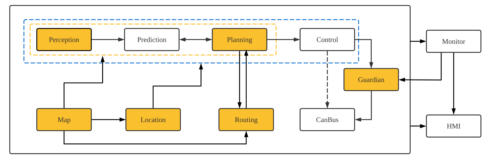
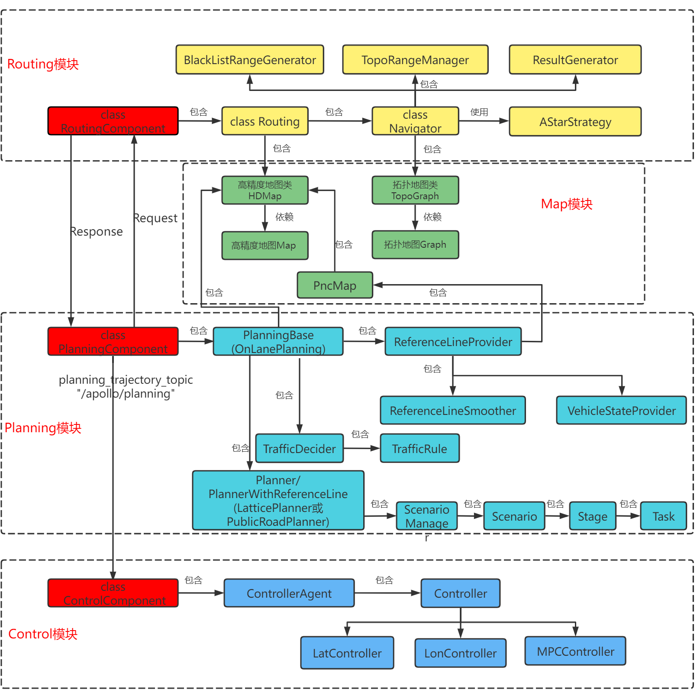
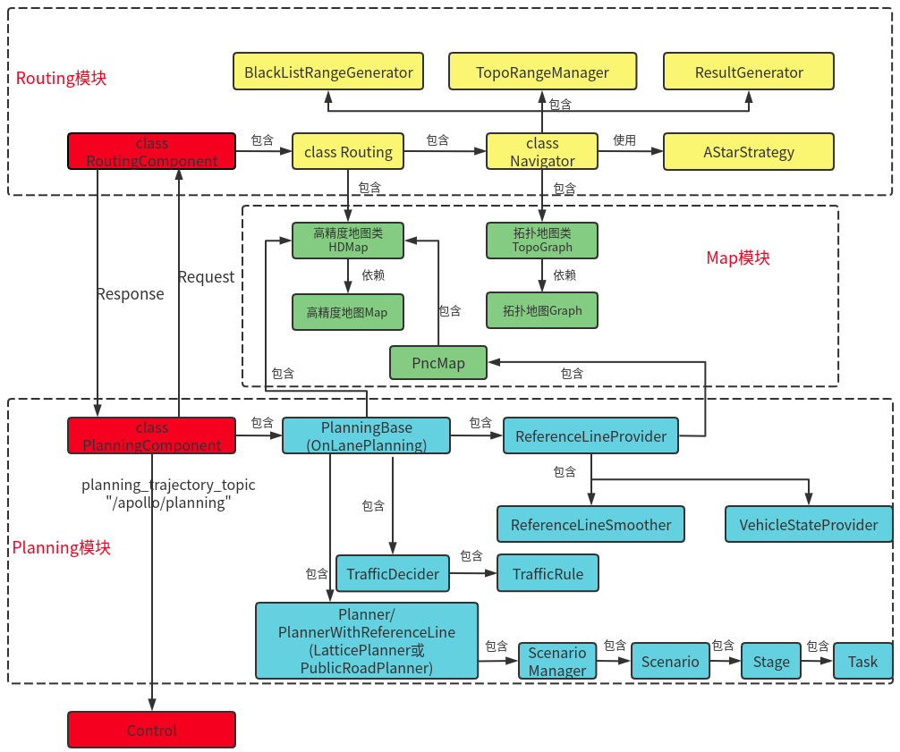

该项目**基于百度Apollo**对自动驾驶各个模块分别介绍: 

**坐标转换, 感知，预测，高精地图及导航，决策规划，运动控制，传感器，仿真及V2X，车辆动力学**

该项目的大多数资料来源于Apollo。大部分内容是对[**Apollo-v6.0.0**](https://github.com/ApolloAuto/apollo/releases/tag/v6.0.0)各模块及 **Cyber框架** 的解析和注释，属于源码阅读笔记。[详细内容](doc/自动驾驶导论.md)

---

**作者邮箱：hanhy20@mai ls.jlu.edu.cn** **欢迎交流**。

项目地址 https://github.com/HaiYangLib/ApolloAnnotation

* 在代码上传时，某些大文件(**主要是某些模型文件**)没有上传,下面给出了这些文件的详细路径，如果有需要的，可以去Apollo的github上下载，对应版本**[apollo-v6.0.0](https://github.com/ApolloAuto/apollo/releases/tag/v6.0.0)**


```c
*.caffemodel
*.model
*.caffemodel.metadata
*.onnx

modules/planning/data/model/*.pt

modules/perception/production/data/perception/camera/models/lane_detector/darkSCNN/params
modules/perception/production/data/perception/camera/models/lane_detector/darkSCNN/params
modules/perception/production/data/perception/camera/models/yolo_obstacle_detector/3d-r4-half/params
modules/perception/production/data/perception/camera/models/yolo_obstacle_detector/3d-yolo/params
modules/perception/production/data/perception/camera/models/lane_detector/darkSCNN/params
```

## 模块关系



**橙色的部分是正在做的工作。**与注释相关的文档，全部保存在**doc文件夹**中。




**各个模块订阅及发布的Topic**

**Routing模块订阅的话题:**

| 成员变量 | 话题名称                  | 消息类型       |
| -------- | ------------------------- | -------------- |
| 配置Proc | "/apollo/routing_request" | RoutingRequest |

**Routing模块发布的话题:**

| 成员变量                 | 话题名称                           | 消息类型        |
| ------------------------ | ---------------------------------- | --------------- |
| response_writer_         | "/apollo/routing_response"         | RoutingResponse |
| response_history_writer_ | "/apollo/routing_response_history" | RoutingResponse |

**Planning模块订阅的话题:**

| 成员变量              | 话题名称                           | 消息类型              |
| --------------------- | ---------------------------------- | --------------------- |
| 配置Proc              | "/apollo/prediction"               | PredictionObstacles   |
| 配置Proc              | "/apollo/canbus/chassis"           | Chassis               |
| 配置Proc              | "/apollo/localization/pose"        | LocalizationEstimate  |
| routing_reader_       | "/apollo/routing_response"         | RoutingResponse       |
| traffic_light_reader_ | "/apollo/perception/traffic_light" | TrafficLightDetection |
| pad_msg_reader_       | "/apollo/planning/pad"             | PadMessage            |
| story_telling_reader_ | "/apollo/storytelling"             | Stories               |

**Planning模块发布的话题:**

| 成员变量                       | 话题名称                         | 消息类型             |
| ------------------------------ | -------------------------------- | -------------------- |
| planning_writer_               | "/apollo/planning"               | ADCTrajectory        |
| rerouting_writer_              | "/apollo/routing_request"        | RoutingRequest       |
| planning_learning_data_writer_ | "/apollo/planning/learning_data" | PlanningLearningData |

## 实用工具篇概要 

介绍Cpp常用的一些开源库,如**protobuf glog gflags poco boost ros** 等, 主要涉及他们的安装及基础使用，更加具体的使用在Cyber篇的cyber_cmake源码中会体现。

这些第三方库很多在apollo中会用到, 属于比较常用的实用工具。

## Cyber篇概要 

完成了**Cyber的cmake版移植**，详细代码见**cyber_cmake**

提供了Cyber所需的第三方库的安装脚本,在thritd_party目录下

## Transform篇 

## 感知篇概要 

[详细内容](doc/自动驾驶导论.md)

针对**感知模块(Perception)**,   [ApolloAnnotation](https://github.com/HaiYangLib/ApolloAnnotation)做了以下工作：

* **Radar子模块**的注释工作主要涉及：Radar**数据预处理**，**IDMatch**和**匈牙利匹配**算法的讲解
* **Liadr子模块**的注释工作主要涉及：Lidar**数据预处理**，**Pointpillars算法**实现过程的分析与代码注释
* **Camera子模块**的注释工作暂时未做

## 预测篇概要 

暂时未做工作

##  导航篇概要 

[详细内容](doc/自动驾驶导论.md)

导航篇包含两个模块：Map和Routing

介绍了**Apollo Map模块**,主要包含**高精地图类对高精地图的封装**，**拓扑地图类对拓扑地图的封装**，**基于高精地图创建拓扑地图**。

介绍了**Apollo Routing模块**，主要包含Routing模块的具体实现，**拓扑子图的生成**和**基于拓扑子图A*搜索**，**组装搜索结果并整合成RoutingResponse**。

介绍了PncMap和ReferenceLineProvider，其中后者依赖前者, ReferenceLineProvider小节分析了**参考线生成及平滑**

## 规划篇概要 

[详细内容](doc/自动驾驶导论.md)



针对**规划模块(Planning)**,   [ApolloAnnotation](https://github.com/HaiYangLib/ApolloAnnotation)做了以下工作：

* 对**Frenet坐标系**做了推导

推到了**笛卡尔坐标系和Frenet坐标系**之间的转换关系

* 对**Lattice Planner**做了介绍

详细介绍了LatticPlanner的原理以及实现过程,其中包括**计算障碍物的S-T图**，**巡航模式下纵向4次多项式轨迹生成**,**存在障碍物停或止点时纵向5次多项式轨迹生成**，**基于二次规划的横向轨迹生成**。还介绍了对每组横纵向**轨迹代价**的计算。

* 对**OpenSpacePlanner**做了介绍

介绍了**OpenSpaceROI区域的生成**，**混合A***，**ReedShepp轨迹生成**

* 对Scenario的执行流程做了介绍

介绍了**Scenario的切换原理**，**Scenario--->Stage--->Task的执行流程**

## 控制篇概要 

[详细内容](doc/自动驾驶导论.md)

介绍了纵向控制,主要涉及在**纵向位置PID**和**纵向速度PID**

## 传感器篇概要 

暂时未做工作

## 仿真及V2X篇概要 

暂时未做工作

## 汽车动力学篇概要 

暂时未做工作

 

 

向一些愿意分享自动驾驶经验的博主表示感谢：

* **Apollo系列经验**  知乎博主  [王方浩 无人驾驶](https://www.zhihu.com/column/self-driving) 
* **Lattice Planner** B站UP主 [读书思过](https://space.bilibili.com/325034144)
* **路径规划与轨迹跟踪** B站UP主 [小黎的Ally](https://space.bilibili.com/477041559)
* **LQR控制** B站UP主 [忠厚老实的老王](https://space.bilibili.com/287989852?from=search&seid=125495911078972296&spm_id_from=333.337.0.0)
* **官方系列文档** [Apollo开放平台文档](https://apollo.auto/Apollo-Homepage-Document/Apollo_Doc_CN_6_0/)
* **Apollo 3.0阅读笔记**  Github [YannZyl](